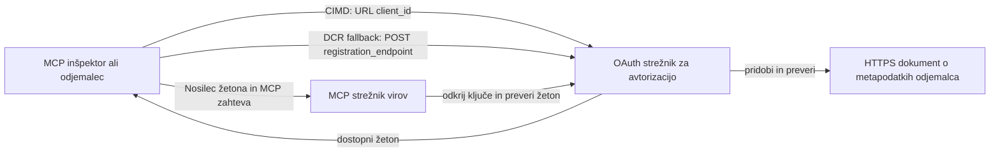

# Vzorec za avtorizacijo CIMD in DCR

Ta primer v TypeScript primerja dva načina, kako lahko OAuth odjemalec pridobi identiteto
pred dostopom do zaščitenega MCP strežnika:

- **Client ID Metadata Documents (CIMD)** uporabljajo stabilen HTTPS URL kot
  `client_id`. To je prednostni mehanizem za odjemalce in avtorizacijske
  strežnike, ki nimajo predhodnega odnosa.
- **Dynamic Client Registration (DCR)** zahteva, da avtorizacijski strežnik izdela
  neprozoren ID odjemalca med izvajanjem. MCP `2026-07-28` ohranja DCR le za zaledno
  združljivost.

Vzorec uporablja stabilen MCP TypeScript SDK v2 in brezstaten
MCP `2026-07-28` zahteveni model. Deluje z zunanjim OAuth 2.1/OpenID
Connect avtorizacijskim strežnikom, kot je Auth0. MCP strežnik je strežnik s sredstvom:
preverja dostopne žetone, vendar ne preverja uporabnikov ali ne izdaja
žetonov.

## Cilji učenja

Z dokončanjem tega primera boste sposobni:

- Razložiti, zakaj je CIMD prednostna pred DCR za nove MCP odjemalce.
- Objaviti veljaven CIMD dokument za javnega nativnega odjemalca.
- Konfigurirati MCP strežnik s sredstvom za OAuth odkritje in preverjanje JWT.
- Praktično uporabiti CIMD in DCR z istim MCP strežnikom in avtorizacijskim strežnikom.
- Uveljaviti OAuth obseg znotraj MCP orodja.
- Prepoznati, katere odgovornosti pripadajo odjemalcu, strežniku s sredstvom in
  avtorizacijskemu strežniku.

## Arhitektura



Avtorizacijski strežnik izbere in preveri registracijski mehanizem.
MCP strežnik vidi le preverjeno trditev `client_id`. HTTPS URL
s potjo identificira CIMD. Neprozoren ID ni dovolj za dokaz DCR, ker lahko
tudi predregistrirani odjemalec uporablja neprozoren ID; opcijska
nastavitev `DCR_CLIENT_ID_PREFIX` zagotavlja proizvajalski demo namig.

## Prednost registracije

MCP odjemalci, ki podpirajo vse mehanizme, naj jih uporabljajo v tem vrstnem redu:

1. Uporabi predregistrirane informacije o odjemalcu, če so že na voljo.
2. Uporabi CIMD, kadar avtorizacijski strežnik oglašuje
   `client_id_metadata_document_supported: true`.
3. Uporabi DCR samo kot rezervno možnost, kadar strežnik oglašuje
   `registration_endpoint`.
4. Povprašaj uporabnika po predregistriranih podatkih, če zgornje ni
   na voljo.

## Razporeditev projekta

```text
src/
  config.ts          Environment validation
  dcr.ts             DCR compatibility request
  mcp.ts             MCP tools and scope checks
  oauth.ts           Authorization metadata and JWT verification
  register-dcr.ts    DCR command-line helper
  registration.ts    CIMD document and mechanism classification
  server.ts          Express, OAuth discovery, and MCP endpoint
test/
  dcr.test.ts
  oauth.test.ts
  registration.test.ts
  server.test.ts
```

## Zahteve

- Node.js 20.6 ali novejši. Skripte uporabljajo `--env-file` in `--import`.
- OAuth 2.1/OpenID Connect avtorizacijski strežnik, ki podpira:
  - Avtorizacijski potek s kodo in S256 PKCE.
  - OAuth Protected Resource Metadata in Resource Indicators.
  - JWT dostopne žetone in JWKS konektor.
  - CIMD, ter DCR, če želite primerjati zastarelo rezervno možnost.
- MCP Inspector ali drug MCP `2026-07-28` odjemalec.
- Javni HTTPS URL za dokument CIMD. Razvojni tunel je primeren
  za laboratorij; v produkciji uporabite stabilno domeno.

## Namestitev in testiranje

```bash
npm install
npm run build
npm test
```

Dvanajst testov uporablja lokalne ključe in simulirane HTTP končne točke. Ne zahtevajo računa
na avtorizacijskem strežniku. Preverjajo:

- Obliko in URL omejitve CIMD dokumenta.
- Pošteno razvrščanje URL in neprozoren odjemalskih ID-jev.
- Ravnanje z DCR zahtevami in odzivi.
- Zavrnitev negotovih ne-nazajnih DCR končnih točk.
- Preverjanje podpisa JWT, izdajatelja, občinstva, poteka, ID odjemalca in obsega.
- Klic v MCP `2026-07-28` postopku `registration-info`.

## Konfiguracija avtorizacijskega strežnika

Točna imena kontrol se razlikujejo glede na ponudnika. Konfigurirajte te zmogljivosti:

1. Ustvarite API ali strežnik s sredstvom, katerega identifikator natančno ustreza vaši MCP
   URL, vključno z `/mcp`, npr. `http://127.0.0.1:3001/mcp`.
2. Uporabite RS256 dostopne žetone in vključite trditev `client_id` ali `azp`.
3. Dodajte dovoljenje ali obseg `tool:greet`.
4. Omogočite avtorizacijski potek s kodo in S256 PKCE za javne nativne odjemalce.
5. Omogočite Client ID Metadata Documents.
6. Za primerjavo omogočite tudi Dynamic Client Registration.
7. Zagotovite, da metapodatki avtorizacijskega strežnika oglašujejo:
   - `issuer`
   - `authorization_endpoint`
   - `token_endpoint`
   - `jwks_uri`
   - `client_id_metadata_document_supported: true`
   - `registration_endpoint`, kadar je DCR omogočen

### Primer Auth0

Pri Auth0 omogočite registracijo Client ID Metadata dokumentov, dinamično
registracijo OIDC aplikacij in združljivost z Resource Parameter. Ustvarite API,
katerega identifikator je natančen MCP URL in dodajte dovoljenje `tool:greet`.
Dovolite testnemu uporabniku in tretjim osebam zahtevati to dovoljenje.

Nadzorne plošče ponudnikov in razpoložljivost funkcij s časom spreminjajo. Pred uporabo teh nastavitev zunaj tega laboratorija preverite
dokumentacijo ponudnika.

## Konfiguracija primera

Ustvarite `.env` iz primera:

```powershell
Copy-Item .env.example .env
```

Na ukaznih lupinah, združljivih z bash:

```bash
cp .env.example .env
```

Nastavite te vrednosti:

```dotenv
MCP_SERVER_URL=http://127.0.0.1:3001/mcp
AUTHORIZATION_SERVER_ISSUER=https://your-tenant.example.com/
AUTHORIZATION_SERVER_METADATA_URL=https://your-tenant.example.com/.well-known/openid-configuration
CLIENT_METADATA_URL=https://your-public-host.example.com/client-metadata.json
OAUTH_REDIRECT_URIS=http://127.0.0.1:6274/oauth/callback
DCR_CLIENT_ID_PREFIX=tpc_
```

Pomembne podrobnosti:

- `AUTHORIZATION_SERVER_ISSUER` se mora natančno ujemati z `issuer` v odkritih
  metapodatkih avtorizacijskega strežnika, vključno z morebitno končno poševnico.
- `MCP_SERVER_URL` se mora ujemati z občinstvom dostopnega žetona.
- `CLIENT_METADATA_URL` mora uporabljati HTTPS, vsebovati pot, ki ni korenska, in biti
  javni URL, ki streže metapodatkovno pot. Query nizi in fragmenti so
  zavrnjeni, da pot in `client_id` ostaneta nespremenjena.
- `OAUTH_REDIRECT_URIS` je dovoljeni seznam ločen z vejicami. Privzeto je MCP
  Inspector povratni klic z ponovi vezavo.
- `DCR_CLIENT_ID_PREFIX` je opcijski in specifičen za ponudnika. Pustite prazen, če
  vaš ponudnik nima zanesljivega DCR predpone.

## Objavite CIMD dokument

Zaženite tunel, ki posreduje svoj javni HTTPS izvor na `127.0.0.1:3001`.
Nastavite `CLIENT_METADATA_URL` na ta izvor plus `/client-metadata.json`, nato zaženite:

```bash
npm run build
npm start
```

Preverite oba dokumenta za odkritje:

```bash
curl http://127.0.0.1:3001/health
curl http://127.0.0.1:3001/client-metadata.json
curl http://127.0.0.1:3001/.well-known/oauth-protected-resource/mcp
```

Vrnjen `client_id` z javnega HTTPS URL-ja metapodatkov mora biti bajt za bajtom
identičen temu URL-ju. Avtorizacijski strežnik mora preveriti dokument in
njegov preusmeritveni URI pred izdajo žetona.

> [!NOTE]
> Vzorec gosti dokument odjemalca in MCP strežnik s sredstvom v enem procesu
> da je laboratorij majhen. V produkciji ima MCP odjemalec svoj CIMD
> dokument neodvisno od strežnika s sredstvom.

## Primerjava CIMD in DCR

Zaženite MCP Inspector:

```bash
npx @modelcontextprotocol/inspector
```

Uporabite Streamable HTTP in se povežite na `http://127.0.0.1:3001/mcp`.

### CIMD (prednostni)

1. Vnesite javni `CLIENT_METADATA_URL` kot OAuth Client ID.
2. Zahtevajte `tool:greet` in vse identitetne obsege, ki jih zahteva vaš ponudnik.
3. Dokončajte prijavo in privolitev.
4. Pokličite `registration-info`. Poročalo bo `mechanism: "cimd"`.
5. Pokličite `greet`, da preverite izvrševanje obsega.

### DCR (združljivostna rezervna možnost)

1. Počistite shranjeno stanje OAuth v Inspectorju.
2. Pustite prazen OAuth Client ID, da lahko Inspector uporabi oglaševani
   `registration_endpoint`.
3. Dokončajte prijavo in privolitev.
4. Pokličite `registration-info`.
5. Če `DCR_CLIENT_ID_PREFIX` ustreza proizvajalčevo generiranim ID-jem, orodje
   poroča `mechanism: "dcr"`; sicer pravilno poroča
   `opaque-client-id`.

Lahko tudi neposredno demonstrirate registracijsko zahtevo:

```bash
npm run build
npm run register:dcr
```

Pomožni program izpiše vrnjeni ID odjemalca, vendar nikoli ne izpiše skrivnosti odjemalca.
Vsako vrnjeno skrivnost obravnavajte kot občutljivo in jo shranjujte v ustreznem varnem skladišču.

## Orodja

| Orodje | Zahtevani obseg | Namen |
| --- | --- | --- |
| `registration-info` | Preverjen odjemalec | Poročanje tipa ID odjemalca |
| `greet` | `tool:greet` | Demonstracija avtorizacije po orodju |

## Varnostna opozorila

- Preverite podpise JWT prek JWKS konektorja avtorizacijskega strežnika.
- Zahtevajte natančno ujemanje izdajatelja in občinstva.
- Zahtevajte potek veljavnosti in trditve ID odjemalca.
- Nikoli ne sprejmite žetona, izdanega za drugačno sredstvo.
- Nikoli ne posredujte MCP žetona navzdol do API-ja.
- Ohranite DCR poverilnice vezane na izdajatelja, ki jih je ustvaril.
- Preverite CIMD preusmeritvene URI natančno.
- Uporabite kontrole SSRF, kadar avtorizacijski strežnik pridobiva CIMD URL-je.
- Za avtorizacijske in metapodatkovne končne točke zunaj razvojnega loopbacka
  uporabljajte HTTPS.
- Ne sklepi DCR iz neprozornega ID odjemalca, razen če ponudnik dokumentira
  zanesljiv konvencijski identifikator.

## Reference

- [MCP avtorizacijska specifikacija](https://modelcontextprotocol.io/specification/2026-07-28/basic/authorization)
- [MCP registracija odjemalcev](https://modelcontextprotocol.io/specification/2026-07-28/basic/authorization/client-registration)
- [MCP najboljše varnostne prakse](https://modelcontextprotocol.io/specification/2026-07-28/basic/security_best_practices)
- [MCP TypeScript SDK v2 vodnik za avtorizacijo](https://ts.sdk.modelcontextprotocol.io/v2/serving/authorization)
- [OAuth Dynamic Client Registration (RFC 7591)](https://datatracker.ietf.org/doc/html/rfc7591)
- [OAuth Client ID Metadata Document osnutek](https://datatracker.ietf.org/doc/html/draft-ietf-oauth-client-id-metadata-document-00)

## Zahvala

Pristop poučevanja vzporedno je bil navdihnjen z
[Sambego/auth0-xmcp-cimd](https://github.com/Sambego/auth0-xmcp-cimd). Ta
primer je izvirna, nevtralna implementacija, zgrajena z uradnim
MCP TypeScript SDK v2 za ta učni načrt.

---

<!-- CO-OP TRANSLATOR DISCLAIMER START -->
**Omejitev odgovornosti**:
Ta dokument je bil preveden z uporabo AI prevajalske storitve [Co-op Translator](https://github.com/Azure/co-op-translator). Čeprav si prizadevamo za natančnost, vas prosimo, da upoštevate, da avtomatizirani prevodi lahko vsebujejo napake ali netočnosti. Izvirni dokument v njegovem izvirnem jeziku je treba obravnavati kot avtoritativni vir. Za kritične informacije je priporočljiv strokovni človeški prevod. Ne odgovarjamo za morebitna nesporazume ali napačne interpretacije, ki izhajajo iz uporabe tega prevoda.
<!-- CO-OP TRANSLATOR DISCLAIMER END -->