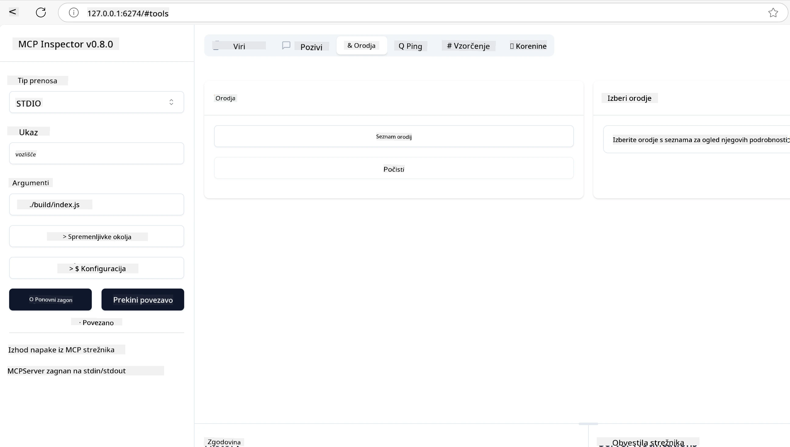
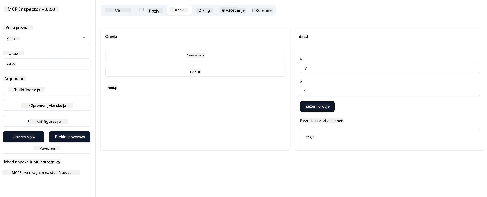

# Začetek z MCP

> [!NOTE]
> Java HTTP primer v tej lekciji uporablja zastareli HTTP+SSE prenos in
> cilja na SDK, združljiv s MCP `2025-11-25`. Za nove oddaljene strežnike uporabite
> `2026-07-28` Streamable HTTP prenos in preverite podporo v svojem SDK.

Dobrodošli na svojem prvem koraku z Model Context Protocol (MCP)! Ne glede na to, ali ste novinec pri MCP ali želite poglobiti svoje razumevanje, vas ta vodič vodi skozi osnovno nastavitev in razvojni proces. Spoznali boste, kako MCP omogoča nemoteno integracijo med AI modeli in aplikacijami ter se naučili, kako hitro pripraviti svoje okolje za izdelavo in testiranje rešitev z MCP.

> TLDR; Če ustvarjate AI aplikacije, veste, da lahko dodate orodja in druge vire svojemu LLM-ju (velikemu jezikovnemu modelu), da naredite LLM bolj informiran. Vendar, če ta orodja in vire postavite na strežnik, lahko aplikacija in zmogljivosti strežnika uporabljajo vsi odjemalci z/n brez LLM-ja.

## Pregled

Ta lekcija ponuja praktične usmeritve za nastavitev okolij MCP in izdelavo prvih aplikacij MCP. Naučili se boste, kako nastaviti potrebna orodja in ogrodja, zgraditi osnovne MCP strežnike, ustvariti gostiteljske aplikacije in testirati svoje implementacije.

Model Context Protocol (MCP) je odprt protokol, ki standardizira način, kako aplikacije zagotavljajo kontekst za LLM-je. Pomislite na MCP kot na USB-C priključek za AI aplikacije – zagotavlja standardiziran način za povezovanje AI modelov z različnimi podatkovnimi viri in orodji.

## Cilji učenja

Do konca te lekcije boste sposobni:

- Nastaviti razvojna okolja za MCP v C#, Java, Python, TypeScript in Rust
- Zgraditi in razmestiti osnovne MCP strežnike z lastnimi funkcijami (viri, pozivi in orodja)
- Ustvariti gostiteljske aplikacije, ki se povežejo s MCP strežniki
- Testirati in odkrivati napake implementacij MCP

## Nastavitev vašega okolja MCP

Preden začnete delati z MCP, je pomembno pripraviti razvojno okolje in razumeti osnovni potek dela. Ta razdelek vas bo vodil skozi začetne korake nastavitve, da zagotovite nemoten začetek z MCP.

### Predpogoji

Preden se potopite v razvoj MCP, poskrbite, da imate:

- **Razvojno okolje**: Za izbrani jezik (C#, Java, Python, TypeScript ali Rust)
- **IDE/Urejevalnik**: Visual Studio, Visual Studio Code, IntelliJ, Eclipse, PyCharm ali kateri koli sodoben urejevalnik kode
- **Upravitelji paketov**: NuGet, Maven/Gradle, pip, npm/yarn ali Cargo
- **API ključi**: Za vse AI storitve, ki jih nameravate uporabljati v svojih gostiteljskih aplikacijah

## Osnovna struktura MCP strežnika

MCP strežnik običajno vključuje:

- **Konfiguracija strežnika**: Nastavitev vrat, preverjanje pristnosti in drugih nastavitev
- **Viri**: Podatki in kontekst, ki so na voljo LLM-jem
- **Orodja**: Funkcionalnosti, ki jih lahko modeli kličejo
- **Pozivi**: Predloge za generiranje ali strukturiranje besedila

Tukaj je poenostavljen primer v TypeScriptu:

```typescript
import { McpServer, ResourceTemplate } from "@modelcontextprotocol/sdk/server/mcp.js";
import { StdioServerTransport } from "@modelcontextprotocol/sdk/server/stdio.js";
import { z } from "zod";

// Ustvari MCP strežnik
const server = new McpServer({
  name: "Demo",
  version: "1.0.0"
});

// Dodaj orodje za seštevanje
server.tool("add",
  { a: z.number(), b: z.number() },
  async ({ a, b }) => ({
    content: [{ type: "text", text: String(a + b) }]
  })
);

// Dodaj dinamični vir pozdravov
server.resource(
  "file",
  // Parameter 'list' nadzoruje, kako vir navaja razpoložljive datoteke. Nastavitev na undefined onemogoči izpisovanje za ta vir.
  new ResourceTemplate("file://{path}", { list: undefined }),
  async (uri, { path }) => ({
    contents: [{
      uri: uri.href,
      text: `File, ${path}!`
    }]
  })
);

// Dodaj datotečni vir, ki bere vsebino datotek
server.resource(
  "file",
  new ResourceTemplate("file://{path}", { list: undefined }),
  async (uri, { path }) => {
    let text;
    try {
      text = await fs.readFile(path, "utf8");
    } catch (err) {
      text = `Error reading file: ${err.message}`;
    }
    return {
      contents: [{
        uri: uri.href,
        text
      }]
    };
  }
);

server.prompt(
  "review-code",
  { code: z.string() },
  ({ code }) => ({
    messages: [{
      role: "user",
      content: {
        type: "text",
        text: `Please review this code:\n\n${code}`
      }
    }]
  })
);

// Začni prejemati sporočila na stdin in pošiljati sporočila na stdout
const transport = new StdioServerTransport();
await server.connect(transport);
```

V zgornji kodi smo:

- Uvozili potrebne razrede iz MCP TypeScript SDK.
- Ustvarili in konfigurirali nov primer MCP strežnika.
- Registrirali lastno orodje (`calculator`) z obdelovalno funkcijo.
- Zagnali strežnik, da posluša dohodne MCP zahteve.

## Testiranje in odpravljanje napak

Preden začnete testirati svoj MCP strežnik, je pomembno razumeti razpoložljiva orodja in najboljše prakse za odpravljanje napak. Učinkovito testiranje zagotavlja, da se vaš strežnik obnaša kot pričakovano in vam pomaga hitro prepoznati ter rešiti težave. Naslednji razdelek povzame priporočene pristope za preverjanje implementacije MCP.

MCP ponuja orodja, ki vam pomagajo pri testiranju in odpravljanju napak vaših strežnikov:

- **Orodje Inspector**, ta grafični vmesnik vam omogoča, da se povežete s svojim strežnikom in testirate orodja, pozive in vire.
- **curl**, lahko se povežete s strežnikom tudi z orodjem ukazne vrstice kot je curl ali drugimi odjemalci, ki lahko ustvarjajo in izvajajo HTTP ukaze.

### Uporaba MCP Inspectorja

[MCP Inspector](https://github.com/modelcontextprotocol/inspector) je vizualno orodje za testiranje, ki vam pomaga:

1. **Odkriti zmožnosti strežnika**: Samodejno zaznati razpoložljive vire, orodja in pozive
2. **Testirati izvajanje orodja**: Preizkusiti različne parametre in videti odzive v realnem času
3. **Pregledati metapodatke strežnika**: Preučiti informacije o strežniku, sheme in nastavitve

```bash
# primer TypeScript, nameščanje in izvajanje MCP Inspectorja
npx @modelcontextprotocol/inspector node build/index.js
```

Ko zaženete zgornje ukaze, MCP Inspector zažene lokalni spletni vmesnik v vašem brskalniku. Pričakujete lahko nadzorno ploščo, ki prikazuje vaše registrirane MCP strežnike, njihova razpoložljiva orodja, vire in pozive. Vmesnik vam omogoča interaktivno testiranje izvrševanja orodij, pregled metapodatkov strežnika in ogled odzivov v realnem času, kar olajša preverjanje in odpravljanje napak vaših MCP implementacij.

Tukaj je posnetek zaslona, kako je lahko videti:



## Pogoste težave pri nastavitvi in rešitve

| Težava | Možna rešitev |
|-------|-------------------|
| Povezava zavrnjena | Preverite, ali strežnik teče in je vrata pravilna |
| Napake izvajanja orodja | Preglejte preverjanje parametrov in obravnavo napak |
| Neuspehi preverjanja pristnosti | Preverite API ključe in dovoljenja |
| Napake preverjanja sheme | Poskrbite, da parametri ustrezajo določeni shemi |
| Strežnik se ne zažene | Preverite konflikte vrat ali manjkajoče odvisnosti |
| Napake CORS | Konfigurirajte ustrezne CORS glave za zahteve med izvorom |
| Težave z avtorizacijo | Preverite veljavnost žetona in dovoljenja |

## Lokalni razvoj

Za lokalni razvoj in testiranje lahko MCP strežnike zaženete neposredno na svojem računalniku:

1. **Zaženite strežniški proces**: Zaženite svojo aplikacijo MCP strežnika
2. **Konfigurirajte omrežje**: Poskrbite, da je strežnik dostopen na pričakovanih vratih
3. **Povežite odjemalce**: Uporabite lokalne povezovalne URL-je, kot je `http://localhost:3000`

```bash
# Primer: Zagon TypeScript MCP strežnika lokalno
npm run start
# Strežnik teče na http://localhost:3000
```

## Izdelava vašega prvega MCP strežnika

V prejšnji lekciji smo pokrili [Osnovne koncepte](../../01-CoreConcepts/README.md), zdaj pa je čas, da to znanje uporabimo.

### Kaj strežnik lahko počne

Preden začnemo s pisanjem kode, si le osvežimo, kaj strežnik lahko počne:

MCP strežnik lahko na primer:

- Dostopa do lokalnih datotek in baz podatkov
- Poveže se z oddaljenimi API-ji
- Izvede izračune
- Integrira z drugimi orodji in storitvami
- Nudi uporabniški vmesnik za interakcijo

Super, zdaj ko vemo, kaj lahko naredimo, začnimo s kodiranjem.

## Vaja: Ustvarjanje strežnika

Za ustvarjanje strežnika morate slediti naslednjim korakom:

- Namestite MCP SDK.
- Ustvarite projekt in postavite strukturo projekta.
- Napišite kodo strežnika.
- Testirajte strežnik.

### -1- Ustvarite projekt

#### TypeScript

```sh
# Ustvari imenik projekta in inicializiraj npm projekt
mkdir calculator-server
cd calculator-server
npm init -y
```

#### Python

```sh
# Ustvari imenik projekta
mkdir calculator-server
cd calculator-server
# Odpri mapo v Visual Studio Code - preskoči, če uporabljaš drug IDE
code .
```

#### .NET

```sh
dotnet new console -n McpCalculatorServer
cd McpCalculatorServer
```

#### Java

Za Java ustvarite Spring Boot projekt:

```bash
curl https://start.spring.io/starter.zip \
  -d dependencies=web \
  -d javaVersion=21 \
  -d type=maven-project \
  -d groupId=com.example \
  -d artifactId=calculator-server \
  -d name=McpServer \
  -d packageName=com.microsoft.mcp.sample.server \
  -o calculator-server.zip
```

Izvlecite zip datoteko:

```bash
unzip calculator-server.zip -d calculator-server
cd calculator-server
# po želji odstranite neuporabljene teste
rm -rf src/test/java
```

Dodajte naslednjo celotno konfiguracijo v svojo datoteko *pom.xml*:

```xml
<?xml version="1.0" encoding="UTF-8"?>
<project xmlns="http://maven.apache.org/POM/4.0.0"
    xmlns:xsi="http://www.w3.org/2001/XMLSchema-instance"
    xsi:schemaLocation="http://maven.apache.org/POM/4.0.0 http://maven.apache.org/xsd/maven-4.0.0.xsd">
    <modelVersion>4.0.0</modelVersion>
    
    <!-- Spring Boot parent for dependency management -->
    <parent>
        <groupId>org.springframework.boot</groupId>
        <artifactId>spring-boot-starter-parent</artifactId>
        <version>3.5.0</version>
        <relativePath />
    </parent>

    <!-- Project coordinates -->
    <groupId>com.example</groupId>
    <artifactId>calculator-server</artifactId>
    <version>0.0.1-SNAPSHOT</version>
    <name>Calculator Server</name>
    <description>Basic calculator MCP service for beginners</description>

    <!-- Properties -->
    <properties>
        <java.version>21</java.version>
        <maven.compiler.source>21</maven.compiler.source>
        <maven.compiler.target>21</maven.compiler.target>
    </properties>

    <!-- Spring AI BOM for version management -->
    <dependencyManagement>
        <dependencies>
            <dependency>
                <groupId>org.springframework.ai</groupId>
                <artifactId>spring-ai-bom</artifactId>
                <version>1.0.0-SNAPSHOT</version>
                <type>pom</type>
                <scope>import</scope>
            </dependency>
        </dependencies>
    </dependencyManagement>

    <!-- Dependencies -->
    <dependencies>
        <dependency>
            <groupId>org.springframework.ai</groupId>
            <artifactId>spring-ai-starter-mcp-server-webflux</artifactId>
        </dependency>
        <dependency>
            <groupId>org.springframework.boot</groupId>
            <artifactId>spring-boot-starter-actuator</artifactId>
        </dependency>
        <dependency>
         <groupId>org.springframework.boot</groupId>
         <artifactId>spring-boot-starter-test</artifactId>
         <scope>test</scope>
      </dependency>
    </dependencies>

    <!-- Build configuration -->
    <build>
        <plugins>
            <plugin>
                <groupId>org.springframework.boot</groupId>
                <artifactId>spring-boot-maven-plugin</artifactId>
            </plugin>
            <plugin>
                <groupId>org.apache.maven.plugins</groupId>
                <artifactId>maven-compiler-plugin</artifactId>
                <configuration>
                    <release>21</release>
                </configuration>
            </plugin>
        </plugins>
    </build>

    <!-- Repositories for Spring AI snapshots -->
    <repositories>
        <repository>
            <id>spring-milestones</id>
            <name>Spring Milestones</name>
            <url>https://repo.spring.io/milestone</url>
            <snapshots>
                <enabled>false</enabled>
            </snapshots>
        </repository>
        <repository>
            <id>spring-snapshots</id>
            <name>Spring Snapshots</name>
            <url>https://repo.spring.io/snapshot</url>
            <releases>
                <enabled>false</enabled>
            </releases>
        </repository>
    </repositories>
</project>
```

#### Rust

```sh
mkdir calculator-server
cd calculator-server
cargo init
```

### -2- Dodajte odvisnosti

Zdaj, ko je projekt ustvarjen, dodajmo naslednje odvisnosti:

#### TypeScript

```sh
# Če ni že nameščen, namestite TypeScript globalno
npm install typescript -g

# Namestite MCP SDK in Zod za preverjanje sheme
npm install @modelcontextprotocol/sdk zod
npm install -D @types/node typescript
```

#### Python

```sh
# Ustvarite virtualno okolje in namestite odvisnosti
python -m venv venv
venv\Scripts\activate
pip install "mcp[cli]"
```

#### Java

```bash
cd calculator-server
./mvnw clean install -DskipTests
```

#### Rust

```sh
cargo add rmcp --features server,transport-io
cargo add serde
cargo add tokio --features rt-multi-thread
```

### -3- Ustvarite datoteke projekta

#### TypeScript

Odprite datoteko *package.json* in nadomestite vsebino z naslednjo, da zagotovite, da lahko zgradite in zaženete strežnik:

```json
{
  "name": "calculator-server",
  "version": "1.0.0",
  "main": "index.js",
  "type": "module",
  "scripts": {
    "build": "tsc",
    "start": "npm run build && node ./build/index.js",
  },
  "keywords": [],
  "author": "",
  "license": "ISC",
  "description": "A simple calculator server using Model Context Protocol",
  "dependencies": {
    "@modelcontextprotocol/sdk": "^1.16.0",
    "zod": "^3.25.76"
  },
  "devDependencies": {
    "@types/node": "^24.0.14",
    "typescript": "^5.8.3"
  }
}
```

Ustvarite *tsconfig.json* z naslednjo vsebino:

```json
{
  "compilerOptions": {
    "target": "ES2022",
    "module": "Node16",
    "moduleResolution": "Node16",
    "outDir": "./build",
    "rootDir": "./src",
    "strict": true,
    "esModuleInterop": true,
    "skipLibCheck": true,
    "forceConsistentCasingInFileNames": true
  },
  "include": ["src/**/*"],
  "exclude": ["node_modules"]
}
```

Ustvarite imenik za vašo izvorno kodo:

```sh
mkdir src
touch src/index.ts
```

#### Python

Ustvarite datoteko *server.py*

```sh
touch server.py
```

#### .NET

Namestite potrebne NuGet pakete:

```sh
dotnet add package ModelContextProtocol --prerelease
dotnet add package Microsoft.Extensions.Hosting
```

#### Java

Za Java Spring Boot projekte je struktura projekta ustvarjena samodejno.

#### Rust

Za Rust je datoteka *src/main.rs* privzeto ustvarjena, ko zaženete `cargo init`. Odprite datoteko in izbrišite privzeto kodo.

### -4- Ustvarite kodo strežnika

#### TypeScript

Ustvarite datoteko *index.ts* in dodajte naslednjo kodo:

```typescript
import { McpServer, ResourceTemplate } from "@modelcontextprotocol/sdk/server/mcp.js";
import { StdioServerTransport } from "@modelcontextprotocol/sdk/server/stdio.js";
import { z } from "zod";
 
// Ustvari MCP strežnik
const server = new McpServer({
  name: "Calculator MCP Server",
  version: "1.0.0"
});
```

Zdaj imate strežnik, a ne počne veliko, popravimo to.

#### Python

```python
# server.py
from mcp.server.fastmcp import FastMCP

# Ustvari MCP strežnik
mcp = FastMCP("Demo")
```

#### .NET

```csharp
using Microsoft.Extensions.DependencyInjection;
using Microsoft.Extensions.Hosting;
using Microsoft.Extensions.Logging;
using ModelContextProtocol.Server;
using System.ComponentModel;

var builder = Host.CreateApplicationBuilder(args);
builder.Logging.AddConsole(consoleLogOptions =>
{
    // Configure all logs to go to stderr
    consoleLogOptions.LogToStandardErrorThreshold = LogLevel.Trace;
});

builder.Services
    .AddMcpServer()
    .WithStdioServerTransport()
    .WithToolsFromAssembly();
await builder.Build().RunAsync();

// add features
```

#### Java

Za Java ustvarite osnovne komponente strežnika. Najprej spremenite glavno razredno aplikacijo:

*src/main/java/com/microsoft/mcp/sample/server/McpServerApplication.java*:

```java
package com.microsoft.mcp.sample.server;

import org.springframework.ai.tool.ToolCallbackProvider;
import org.springframework.ai.tool.method.MethodToolCallbackProvider;
import org.springframework.boot.SpringApplication;
import org.springframework.boot.autoconfigure.SpringBootApplication;
import org.springframework.context.annotation.Bean;
import com.microsoft.mcp.sample.server.service.CalculatorService;

@SpringBootApplication
public class McpServerApplication {

    public static void main(String[] args) {
        SpringApplication.run(McpServerApplication.class, args);
    }
    
    @Bean
    public ToolCallbackProvider calculatorTools(CalculatorService calculator) {
        return MethodToolCallbackProvider.builder().toolObjects(calculator).build();
    }
}
```

Ustvarite storitev kalkulatorja *src/main/java/com/microsoft/mcp/sample/server/service/CalculatorService.java*:

```java
package com.microsoft.mcp.sample.server.service;

import org.springframework.ai.tool.annotation.Tool;
import org.springframework.stereotype.Service;

/**
 * Service for basic calculator operations.
 * This service provides simple calculator functionality through MCP.
 */
@Service
public class CalculatorService {

    /**
     * Add two numbers
     * @param a The first number
     * @param b The second number
     * @return The sum of the two numbers
     */
    @Tool(description = "Add two numbers together")
    public String add(double a, double b) {
        double result = a + b;
        return formatResult(a, "+", b, result);
    }

    /**
     * Subtract one number from another
     * @param a The number to subtract from
     * @param b The number to subtract
     * @return The result of the subtraction
     */
    @Tool(description = "Subtract the second number from the first number")
    public String subtract(double a, double b) {
        double result = a - b;
        return formatResult(a, "-", b, result);
    }

    /**
     * Multiply two numbers
     * @param a The first number
     * @param b The second number
     * @return The product of the two numbers
     */
    @Tool(description = "Multiply two numbers together")
    public String multiply(double a, double b) {
        double result = a * b;
        return formatResult(a, "*", b, result);
    }

    /**
     * Divide one number by another
     * @param a The numerator
     * @param b The denominator
     * @return The result of the division
     */
    @Tool(description = "Divide the first number by the second number")
    public String divide(double a, double b) {
        if (b == 0) {
            return "Error: Cannot divide by zero";
        }
        double result = a / b;
        return formatResult(a, "/", b, result);
    }

    /**
     * Calculate the power of a number
     * @param base The base number
     * @param exponent The exponent
     * @return The result of raising the base to the exponent
     */
    @Tool(description = "Calculate the power of a number (base raised to an exponent)")
    public String power(double base, double exponent) {
        double result = Math.pow(base, exponent);
        return formatResult(base, "^", exponent, result);
    }

    /**
     * Calculate the square root of a number
     * @param number The number to find the square root of
     * @return The square root of the number
     */
    @Tool(description = "Calculate the square root of a number")
    public String squareRoot(double number) {
        if (number < 0) {
            return "Error: Cannot calculate square root of a negative number";
        }
        double result = Math.sqrt(number);
        return String.format("√%.2f = %.2f", number, result);
    }

    /**
     * Calculate the modulus (remainder) of division
     * @param a The dividend
     * @param b The divisor
     * @return The remainder of the division
     */
    @Tool(description = "Calculate the remainder when one number is divided by another")
    public String modulus(double a, double b) {
        if (b == 0) {
            return "Error: Cannot divide by zero";
        }
        double result = a % b;
        return formatResult(a, "%", b, result);
    }

    /**
     * Calculate the absolute value of a number
     * @param number The number to find the absolute value of
     * @return The absolute value of the number
     */
    @Tool(description = "Calculate the absolute value of a number")
    public String absolute(double number) {
        double result = Math.abs(number);
        return String.format("|%.2f| = %.2f", number, result);
    }

    /**
     * Get help about available calculator operations
     * @return Information about available operations
     */
    @Tool(description = "Get help about available calculator operations")
    public String help() {
        return "Basic Calculator MCP Service\n\n" +
               "Available operations:\n" +
               "1. add(a, b) - Adds two numbers\n" +
               "2. subtract(a, b) - Subtracts the second number from the first\n" +
               "3. multiply(a, b) - Multiplies two numbers\n" +
               "4. divide(a, b) - Divides the first number by the second\n" +
               "5. power(base, exponent) - Raises a number to a power\n" +
               "6. squareRoot(number) - Calculates the square root\n" + 
               "7. modulus(a, b) - Calculates the remainder of division\n" +
               "8. absolute(number) - Calculates the absolute value\n\n" +
               "Example usage: add(5, 3) will return 5 + 3 = 8";
    }

    /**
     * Format the result of a calculation
     */
    private String formatResult(double a, String operator, double b, double result) {
        return String.format("%.2f %s %.2f = %.2f", a, operator, b, result);
    }
}
```

**Izbirni sestavni deli za produkcijsko pripravljeno storitev:**

Ustvarite konfiguracijo zagona *src/main/java/com/microsoft/mcp/sample/server/config/StartupConfig.java*:

```java
package com.microsoft.mcp.sample.server.config;

import org.springframework.boot.CommandLineRunner;
import org.springframework.context.annotation.Bean;
import org.springframework.context.annotation.Configuration;

@Configuration
public class StartupConfig {
    
    @Bean
    public CommandLineRunner startupInfo() {
        return args -> {
            System.out.println("\n" + "=".repeat(60));
            System.out.println("Calculator MCP Server is starting...");
            System.out.println("SSE endpoint: http://localhost:8080/sse");
            System.out.println("Health check: http://localhost:8080/actuator/health");
            System.out.println("=".repeat(60) + "\n");
        };
    }
}
```

Ustvarite health kontroler *src/main/java/com/microsoft/mcp/sample/server/controller/HealthController.java*:

```java
package com.microsoft.mcp.sample.server.controller;

import org.springframework.http.ResponseEntity;
import org.springframework.web.bind.annotation.GetMapping;
import org.springframework.web.bind.annotation.RestController;
import java.time.LocalDateTime;
import java.util.HashMap;
import java.util.Map;

@RestController
public class HealthController {
    
    @GetMapping("/health")
    public ResponseEntity<Map<String, Object>> healthCheck() {
        Map<String, Object> response = new HashMap<>();
        response.put("status", "UP");
        response.put("timestamp", LocalDateTime.now().toString());
        response.put("service", "Calculator MCP Server");
        return ResponseEntity.ok(response);
    }
}
```

Ustvarite obdelovalca izjem *src/main/java/com/microsoft/mcp/sample/server/exception/GlobalExceptionHandler.java*:

```java
package com.microsoft.mcp.sample.server.exception;

import org.springframework.http.HttpStatus;
import org.springframework.http.ResponseEntity;
import org.springframework.web.bind.annotation.ExceptionHandler;
import org.springframework.web.bind.annotation.RestControllerAdvice;

@RestControllerAdvice
public class GlobalExceptionHandler {

    @ExceptionHandler(IllegalArgumentException.class)
    public ResponseEntity<ErrorResponse> handleIllegalArgumentException(IllegalArgumentException ex) {
        ErrorResponse error = new ErrorResponse(
            "Invalid_Input", 
            "Invalid input parameter: " + ex.getMessage());
        return new ResponseEntity<>(error, HttpStatus.BAD_REQUEST);
    }

    public static class ErrorResponse {
        private String code;
        private String message;

        public ErrorResponse(String code, String message) {
            this.code = code;
            this.message = message;
        }

        // Pridobivalci
        public String getCode() { return code; }
        public String getMessage() { return message; }
    }
}
```

Ustvarite lastno banner datoteko *src/main/resources/banner.txt*:

```text
_____      _            _       _             
 / ____|    | |          | |     | |            
| |     __ _| | ___ _   _| | __ _| |_ ___  _ __ 
| |    / _` | |/ __| | | | |/ _` | __/ _ \| '__|
| |___| (_| | | (__| |_| | | (_| | || (_) | |   
 \_____\__,_|_|\___|\__,_|_|\__,_|\__\___/|_|   
                                                
Calculator MCP Server v1.0
Spring Boot MCP Application
```

</details>

#### Rust

Dodajte naslednjo kodo na vrh datoteke *src/main.rs*. Ta uvozi potrebne knjižnice in module za vaš MCP strežnik.

```rust
use rmcp::{
    handler::server::{router::tool::ToolRouter, tool::Parameters},
    model::{ServerCapabilities, ServerInfo},
    schemars, tool, tool_handler, tool_router,
    transport::stdio,
    ServerHandler, ServiceExt,
};
use std::error::Error;
```

Strežnik kalkulatorja bo preprost, ki lahko sešteje dve števili. Ustvarimo struct za predstavitev zahteve kalkulatorja.

```rust
#[derive(Debug, serde::Deserialize, schemars::JsonSchema)]
pub struct CalculatorRequest {
    pub a: f64,
    pub b: f64,
}
```

Nato ustvarite struct za predstavitev MCP strežnika kalkulatorja. Ta struct bo imel usmerjevalnik orodij, ki se uporablja za registracijo orodij.

```rust
#[derive(Debug, Clone)]
pub struct Calculator {
    tool_router: ToolRouter<Self>,
}
```

Zdaj lahko implementiramo `Calculator` struct tako, da ustvarimo novo instanco strežnika in implementiramo strežniškega obdelovalca za zagotavljanje informacij o strežniku.

```rust
#[tool_router]
impl Calculator {
    pub fn new() -> Self {
        Self {
            tool_router: Self::tool_router(),
        }
    }
}

#[tool_handler]
impl ServerHandler for Calculator {
    fn get_info(&self) -> ServerInfo {
        ServerInfo {
            instructions: Some("A simple calculator tool".into()),
            capabilities: ServerCapabilities::builder().enable_tools().build(),
            ..Default::default()
        }
    }
}
```

Nazadnje moramo implementirati glavno funkcijo za zagon strežnika. Ta funkcija bo ustvarila instanco `Calculator` struct in jo poganjala preko standardnega vhoda/izhoda.

```rust
#[tokio::main]
async fn main() -> Result<(), Box<dyn Error>> {
    let service = Calculator::new().serve(stdio()).await?;
    service.waiting().await?;
    Ok(())
}
```

Strežnik je zdaj nastavljen za zagotavljanje osnovnih informacij o sebi. Naslednje bomo dodali orodje za izvajanje seštevanja.

### -5- Dodajanje orodja in vira

Dodajte orodje in vir z dodajanjem naslednje kode:

#### TypeScript

```typescript
server.tool(
  "add",
  { a: z.number(), b: z.number() },
  async ({ a, b }) => ({
    content: [{ type: "text", text: String(a + b) }]
  })
);

server.resource(
  "greeting",
  new ResourceTemplate("greeting://{name}", { list: undefined }),
  async (uri, { name }) => ({
    contents: [{
      uri: uri.href,
      text: `Hello, ${name}!`
    }]
  })
);
```

Vaše orodje sprejema parametra `a` in `b` in izvaja funkcijo, ki proizvede odgovor v obliki:

```typescript
{
  contents: [{
    type: "text", content: "some content"
  }]
}
```

Vaš vir je dostopen prek niza "greeting" in sprejema parameter `name` ter proizvaja podoben odgovor kot orodje:

```typescript
{
  uri: "<href>",
  text: "a text"
}
```

#### Python

```python
# Dodaj orodje za seštevanje
@mcp.tool()
def add(a: int, b: int) -> int:
    """Add two numbers"""
    return a + b


# Dodaj dinamičen vir pozdravov
@mcp.resource("greeting://{name}")
def get_greeting(name: str) -> str:
    """Get a personalized greeting"""
    return f"Hello, {name}!"
```

V zgornji kodi smo:

- Določili orodje `add`, ki sprejema parametra `a` in `b`, oba cela števila.
- Ustvarili vir z imenom `greeting`, ki sprejema parameter `name`.

#### .NET

Dodajte to v svojo datoteko Program.cs:

```csharp
[McpServerToolType]
public static class CalculatorTool
{
    [McpServerTool, Description("Adds two numbers")]
    public static string Add(int a, int b) => $"Sum {a + b}";
}
```

#### Java

Orodja so bila že ustvarjena v prejšnjem koraku.

#### Rust

Dodajte novo orodje znotraj bloka `impl Calculator`:

```rust
#[tool(description = "Adds a and b")]
async fn add(
    &self,
    Parameters(CalculatorRequest { a, b }): Parameters<CalculatorRequest>,
) -> String {
    (a + b).to_string()
}
```

### -6- Končna koda

Dodajmo še zadnjo kodo, ki jo potrebujemo, da se strežnik zažene:

#### TypeScript

```typescript
// Začni prejemati sporočila na stdin in pošiljati sporočila na stdout
const transport = new StdioServerTransport();
await server.connect(transport);
```

Tukaj je celotna koda:

```typescript
// index.ts
import { McpServer, ResourceTemplate } from "@modelcontextprotocol/sdk/server/mcp.js";
import { StdioServerTransport } from "@modelcontextprotocol/sdk/server/stdio.js";
import { z } from "zod";

// Ustvari MCP strežnik
const server = new McpServer({
  name: "Calculator MCP Server",
  version: "1.0.0"
});

// Dodaj orodje za seštevanje
server.tool(
  "add",
  { a: z.number(), b: z.number() },
  async ({ a, b }) => ({
    content: [{ type: "text", text: String(a + b) }]
  })
);

// Dodaj dinamičen vir pozdravov
server.resource(
  "greeting",
  new ResourceTemplate("greeting://{name}", { list: undefined }),
  async (uri, { name }) => ({
    contents: [{
      uri: uri.href,
      text: `Hello, ${name}!`
    }]
  })
);

// Začni prejemati sporočila na stdin in pošiljati sporočila na stdout
const transport = new StdioServerTransport();
server.connect(transport);
```

#### Python

```python
# server.py
from mcp.server.fastmcp import FastMCP

# Ustvari MCP strežnik
mcp = FastMCP("Demo")


# Dodaj orodje za seštevanje
@mcp.tool()
def add(a: int, b: int) -> int:
    """Add two numbers"""
    return a + b


# Dodaj dinamični vir pozdrava
@mcp.resource("greeting://{name}")
def get_greeting(name: str) -> str:
    """Get a personalized greeting"""
    return f"Hello, {name}!"

# Glavni izvršilni blok - to je potrebno za zagon strežnika
if __name__ == "__main__":
    mcp.run()
```

#### .NET

Ustvarite datoteko Program.cs z naslednjo vsebino:

```csharp
using Microsoft.Extensions.DependencyInjection;
using Microsoft.Extensions.Hosting;
using Microsoft.Extensions.Logging;
using ModelContextProtocol.Server;
using System.ComponentModel;

var builder = Host.CreateApplicationBuilder(args);
builder.Logging.AddConsole(consoleLogOptions =>
{
    // Configure all logs to go to stderr
    consoleLogOptions.LogToStandardErrorThreshold = LogLevel.Trace;
});

builder.Services
    .AddMcpServer()
    .WithStdioServerTransport()
    .WithToolsFromAssembly();
await builder.Build().RunAsync();

[McpServerToolType]
public static class CalculatorTool
{
    [McpServerTool, Description("Adds two numbers")]
    public static string Add(int a, int b) => $"Sum {a + b}";
}
```

#### Java

Vaša celotna glavna razred aplikacije naj izgleda takole:

```java
// McpServerApplication.java
package com.microsoft.mcp.sample.server;

import org.springframework.ai.tool.ToolCallbackProvider;
import org.springframework.ai.tool.method.MethodToolCallbackProvider;
import org.springframework.boot.SpringApplication;
import org.springframework.boot.autoconfigure.SpringBootApplication;
import org.springframework.context.annotation.Bean;
import com.microsoft.mcp.sample.server.service.CalculatorService;

@SpringBootApplication
public class McpServerApplication {

    public static void main(String[] args) {
        SpringApplication.run(McpServerApplication.class, args);
    }
    
    @Bean
    public ToolCallbackProvider calculatorTools(CalculatorService calculator) {
        return MethodToolCallbackProvider.builder().toolObjects(calculator).build();
    }
}
```

#### Rust

Končna koda za Rust strežnik naj izgleda takole:

```rust
use rmcp::{
    ServerHandler, ServiceExt,
    handler::server::{router::tool::ToolRouter, tool::Parameters},
    model::{ServerCapabilities, ServerInfo},
    schemars, tool, tool_handler, tool_router,
    transport::stdio,
};
use std::error::Error;

#[derive(Debug, serde::Deserialize, schemars::JsonSchema)]
pub struct CalculatorRequest {
    pub a: f64,
    pub b: f64,
}

#[derive(Debug, Clone)]
pub struct Calculator {
    tool_router: ToolRouter<Self>,
}

#[tool_router]
impl Calculator {
    pub fn new() -> Self {
        Self {
            tool_router: Self::tool_router(),
        }
    }
    
    #[tool(description = "Adds a and b")]
    async fn add(
        &self,
        Parameters(CalculatorRequest { a, b }): Parameters<CalculatorRequest>,
    ) -> String {
        (a + b).to_string()
    }
}

#[tool_handler]
impl ServerHandler for Calculator {
    fn get_info(&self) -> ServerInfo {
        ServerInfo {
            instructions: Some("A simple calculator tool".into()),
            capabilities: ServerCapabilities::builder().enable_tools().build(),
            ..Default::default()
        }
    }
}

#[tokio::main]
async fn main() -> Result<(), Box<dyn Error>> {
    let service = Calculator::new().serve(stdio()).await?;
    service.waiting().await?;
    Ok(())
}
```

### -7- Testirajte strežnik

Zaženite strežnik z naslednjim ukazom:

#### TypeScript

```sh
npm run build
```

#### Python

```sh
mcp run server.py
```

> Za uporabo MCP Inspectorja uporabite `mcp dev server.py`, ki samodejno zažene Inspector in zagotovi potreben žeton seje proxy. Če uporabljate `mcp run server.py`, boste morali ročno zagnati Inspector in konfigurirati povezavo.

#### .NET

Prepričajte se, da ste v svojem imeniku projekta:

```sh
cd McpCalculatorServer
dotnet run
```

#### Java

```bash
./mvnw clean install -DskipTests
java -jar target/calculator-server-0.0.1-SNAPSHOT.jar
```

#### Rust

Za formatiranje in zagon strežnika zaženite naslednje ukaze:

```sh
cargo fmt
cargo run
```

### -8- Zaženite z uporabo Inspectorja

Inspector je odlično orodje, ki lahko zažene vaš strežnik in vam omogoči interakcijo z njim, da lahko testirate, ali deluje. Zaženimo ga:

> [!NOTE]
> V polju "ukaz" se lahko prikaže drugače, saj vsebuje ukaz za zagon strežnika z vašo specifično izvedbo/

#### TypeScript

```sh
npx @modelcontextprotocol/inspector node build/index.js
```

ali ga dodajte v svojo *package.json* datoteko takole: `"inspector": "npx @modelcontextprotocol/inspector node build/index.js"` in nato zaženite `npm run inspector`

#### Python

Python ovije orodje Node.js, imenovano inspector. To orodje je mogoče poklicati takole:

```sh
mcp dev server.py
```


Vendar ne implementira vseh metod, ki so na voljo v orodju, zato je priporočljivo, da neposredno zaženete orodje Node.js, kot je spodaj:

```sh
npx @modelcontextprotocol/inspector mcp run server.py
```

Če uporabljate orodje ali IDE, ki vam omogoča nastavitev ukazov in argumentov za zagon skript,
poskrbite, da bo v polju „Command“ nastavljeno `python`, v „Arguments“ pa `server.py`. Tako bo skripta pravilno tekel.

#### .NET

Prepričajte se, da ste v mapi vašega projekta:

```sh
cd McpCalculatorServer
npx @modelcontextprotocol/inspector dotnet run
```

#### Java

Prepričajte se, da je vaš kalkulator strežnik v teku
Zaženite inšpektor:

```cmd
npx @modelcontextprotocol/inspector
```

V spletni vmesnik inšpektorja:

1. Izberite "SSE" kot tip prenosa
2. Nastavite URL: `http://localhost:8080/sse`
3. Kliknite "Connect"


**Zdaj ste povezani s strežnikom**
**Sekcija za testiranje Java strežnika je sedaj zaključena**

Naslednja sekcija govori o interakciji s strežnikom.

Morali bi videti naslednji uporabniški vmesnik:


1. Povežite se s strežnikom z izbiro gumba Connect
  Ko ste povezani s strežnikom, bi morali videti naslednje:

  

1. Izberite "Tools" in "listTools", prikazati bi se moral "Add", izberite "Add" in vnesite vrednosti parametrov.

  Videli bi naslednji odgovor, torej rezultat iz orodja "add":

  

Čestitamo, uspelo vam je ustvariti in zagnati svoj prvi strežnik!

#### Rust

Za zagon Rust strežnika z MCP Inspector CLI uporabite naslednji ukaz:

```sh
npx @modelcontextprotocol/inspector cargo run --cli --method tools/call --tool-name add --tool-arg a=1 b=2
```

### Uradni SDK-ji

MCP zagotavlja uradne SDK-je za več programskih jezikov:

- [C# SDK](https://github.com/modelcontextprotocol/csharp-sdk) - Vzdrževan v sodelovanju z Microsoft
- [Java SDK](https://github.com/modelcontextprotocol/java-sdk) - Vzdrževan v sodelovanju s Spring AI
- [TypeScript SDK](https://github.com/modelcontextprotocol/typescript-sdk) - Uradna implementacija v TypeScript
- [Python SDK](https://github.com/modelcontextprotocol/python-sdk) - Uradna implementacija v Pythonu
- [Kotlin SDK](https://github.com/modelcontextprotocol/kotlin-sdk) - Uradna implementacija v Kotlinu
- [Swift SDK](https://github.com/modelcontextprotocol/swift-sdk) - Vzdrževan v sodelovanju z Loopwork AI
- [Rust SDK](https://github.com/modelcontextprotocol/rust-sdk) - Uradna implementacija v Rustu

## Ključne ugotovitve

- Nastavitev razvojnega okolja MCP je enostavna z jezikovno specifičnimi SDK-ji
- Gradnja MCP strežnikov vključuje ustvarjanje in registracijo orodij z jasnimi shemami
- Testiranje in odpravljanje napak sta ključna za zanesljive implementacije MCP

## Primeri

- [Java Calculator](../samples/java/calculator/README.md)
- [.NET Calculator](../../../../03-GettingStarted/samples/csharp)
- [JavaScript Calculator](../samples/javascript/README.md)
- [TypeScript Calculator](../samples/typescript/README.md)
- [Python Calculator](../../../../03-GettingStarted/samples/python)
- [Rust Calculator](../../../../03-GettingStarted/samples/rust)

## Naloga

Ustvarite preprost MCP strežnik z orodjem po vaši izbiri:

1. Implementirajte orodje v vašem izbranem jeziku (.NET, Java, Python, TypeScript ali Rust).
2. Določite vhodne parametre in vrednosti vrnitve.
3. Zaženite inšpektorsko orodje, da zagotovite, da strežnik deluje kot je mišljeno.
4. Testirajte implementacijo z različnimi vnosi.

## Rešitev

[Rešitev](./solution/README.md)

## Dodatni viri

- [Gradnja agentov z Model Context Protocol na Azure](https://learn.microsoft.com/azure/developer/ai/intro-agents-mcp)
- [Oddaljeni MCP z Azure Container Apps (Node.js/TypeScript/JavaScript)](https://learn.microsoft.com/samples/azure-samples/mcp-container-ts/mcp-container-ts/)
- [.NET OpenAI MCP Agent](https://learn.microsoft.com/samples/azure-samples/openai-mcp-agent-dotnet/openai-mcp-agent-dotnet/)

## Kaj sledi

Naslednje: [Začetek z MCP klienti](../02-client/README.md)

---

<!-- CO-OP TRANSLATOR DISCLAIMER START -->
**Omejitev odgovornosti**:
Ta dokument je bil preveden z uporabo AI prevajalske storitve [Co-op Translator](https://github.com/Azure/co-op-translator). Čeprav si prizadevamo za natančnost, vas prosimo, da upoštevate, da avtomatizirani prevodi lahko vsebujejo napake ali netočnosti. Izvirni dokument v njegovem izvirnem jeziku je treba obravnavati kot avtoritativni vir. Za kritične informacije je priporočljiv strokovni človeški prevod. Ne odgovarjamo za morebitna nesporazume ali napačne interpretacije, ki izhajajo iz uporabe tega prevoda.
<!-- CO-OP TRANSLATOR DISCLAIMER END -->