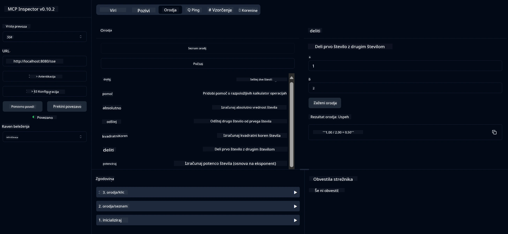

# Osnovna kalkulator MCP storitev

> [!NOTE]
> Ta Java rešitev uporablja zastarelo HTTP+SSE transportno plast in cilja na SDK
> združljiv z MCP `2025-11-25`. Ohranjena je zaradi ustrezanja kodi tečaja;
> novi oddaljeni strežniki naj uporabljajo `2026-07-28` Streamable HTTP podporo.

Ta storitev zagotavlja osnovne kalkulatorske operacije preko Model Context Protocol (MCP) z uporabo Spring Boot s prenosom WebFlux. Namenjena je kot preprost primer za začetnike, ki se učijo o implementacijah MCP.

Za več informacij poglejte referenčno dokumentacijo [MCP Server Boot Starter](https://docs.spring.io/spring-ai/reference/api/mcp/mcp-server-boot-starter-docs.html).


## Uporaba storitve

Storitev izpostavlja naslednje API končne točke preko MCP protokola:

- `add(a, b)`: Sešteje dve števili
- `subtract(a, b)`: Odšteje drugo število od prvega
- `multiply(a, b)`: Pomnoži dve števili
- `divide(a, b)`: Deli prvo število z drugim (s preverjanjem ničle)
- `power(base, exponent)`: Izračuna potenco števila
- `squareRoot(number)`: Izračuna kvadratni koren (s preverjanjem negativnega števila)
- `modulus(a, b)`: Izračuna ostanek pri deljenju
- `absolute(number)`: Izračuna absolutno vrednost

## Odvisnosti

Projekt zahteva naslednje ključne odvisnosti:

```xml
<dependency>
    <groupId>org.springframework.ai</groupId>
    <artifactId>spring-ai-starter-mcp-server-webflux</artifactId>
</dependency>
```

## Gradnja projekta

Projekt sestavite z uporabo Maven:
```bash
./mvnw clean install -DskipTests
```

## Zagon strežnika

### Uporaba Jave

```bash
java -jar target/calculator-server-0.0.1-SNAPSHOT.jar
```

### Uporaba MCP Inspector

MCP Inspector je uporabno orodje za delo z MCP storitvami. Za uporabo s to kalkulatorsko storitvijo:

1. **Namestite in zaženite MCP Inspector** v novem terminalskem oknu:
   ```bash
   npx @modelcontextprotocol/inspector
   ```

2. **Dostopajte do spletnega vmesnika** s klikom na URL, ki ga aplikacija prikaže (običajno http://localhost:6274)

3. **Konfigurirajte povezavo**:
   - Nastavite tip transporta na "SSE"
   - Nastavite URL na SSE končno točko vašega strežnika: `http://localhost:8080/sse`
   - Kliknite "Poveži"

4. **Uporabite orodja**:
   - Kliknite "Seznam orodij" za ogled razpoložljivih kalkulatorskih operacij
   - Izberite orodje in kliknite "Zaženi orodje" za izvedbo operacije



---

<!-- CO-OP TRANSLATOR DISCLAIMER START -->
**Omejitev odgovornosti**:
Ta dokument je bil preveden z uporabo AI prevajalske storitve [Co-op Translator](https://github.com/Azure/co-op-translator). Čeprav si prizadevamo za natančnost, vas prosimo, da upoštevate, da avtomatizirani prevodi lahko vsebujejo napake ali netočnosti. Izvirni dokument v njegovem izvirnem jeziku je treba obravnavati kot avtoritativni vir. Za kritične informacije je priporočljiv strokovni človeški prevod. Ne odgovarjamo za morebitna nesporazume ali napačne interpretacije, ki izhajajo iz uporabe tega prevoda.
<!-- CO-OP TRANSLATOR DISCLAIMER END -->