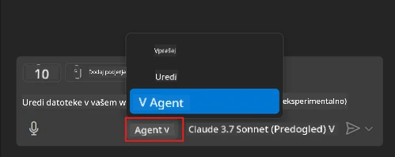
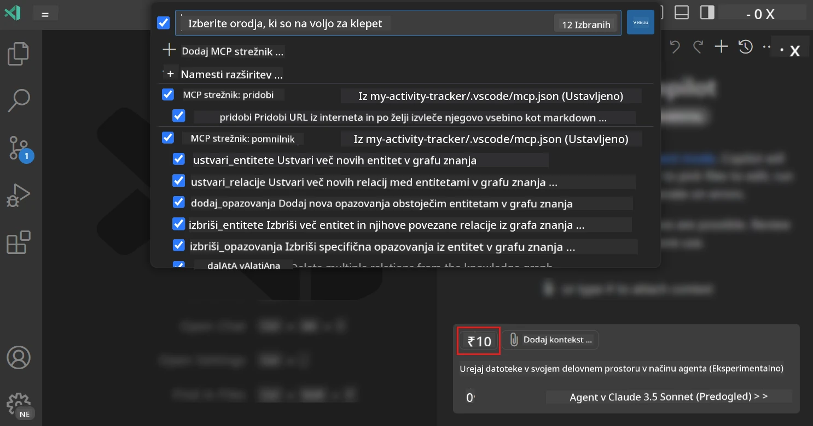
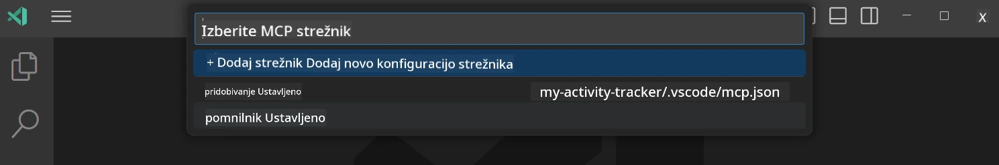
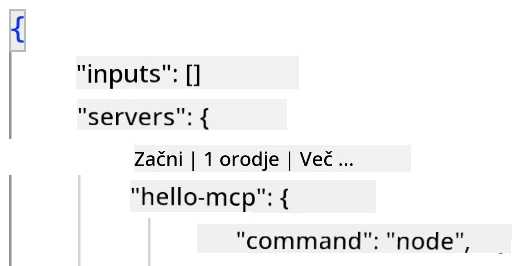
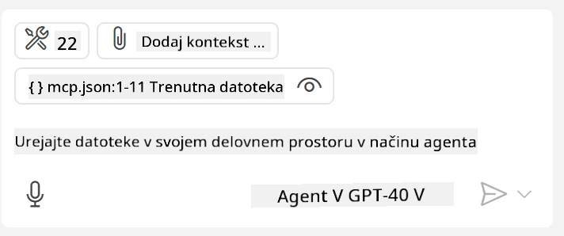
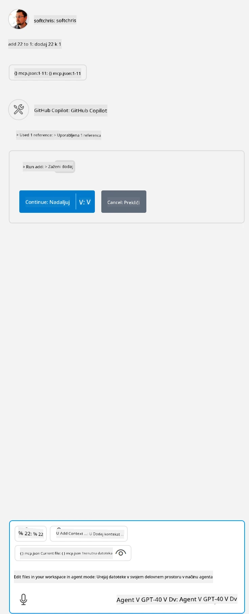

# Uporaba strežnika v načinu GitHub Copilot Agent

Visual Studio Code in GitHub Copilot lahko delujeta kot odjemalec in uporabljata MCP strežnik. Zakaj bi to želeli narediti, se morda sprašujete? No, to pomeni, da je mogoče vse funkcije, ki jih ima MCP strežnik, uporabljati neposredno znotraj vašega IDE. Predstavljajte si, da dodate na primer GitHubov MCP strežnik, kar bi omogočilo nadzor GitHuba prek pozivov namesto tipkanja posebnih ukazov v terminalu. Ali pa si predstavljajte karkoli, kar bi lahko izboljšalo vašo izkušnjo razvijalca, vse to pa bi bilo nadzorovano z naravnim jezikom. Zdaj začnete videti prednosti, kajne?

## Pregled

Ta lekcija govori o tem, kako uporabljati Visual Studio Code in način GitHub Copilot Agent kot odjemalca za vaš MCP strežnik.

## Cilji učenja

Ob koncu te lekcije boste znali:

- Uporabljati MCP strežnik preko Visual Studio Code.
- Zagnati funkcionalnosti, kot so orodja preko GitHub Copilot.
- Konfigurirati Visual Studio Code za iskanje in upravljanje vašega MCP strežnika.

## Uporaba

Vaš MCP strežnik lahko upravljate na dva načina:

- Grafični vmesnik, ki ga boste spoznali kasneje v tem poglavju.
- Terminal, možno je upravljati stvari iz terminala z ukazno vrstico `code`:

  Da dodate MCP strežnik v svoj uporabniški profil, uporabite ukazno možnost --add-mcp in zagotovite JSON konfiguracijo strežnika v obliki {\"name\":\"server-name\",\"command\":...}.

  ```
  code --add-mcp "{\"name\":\"my-server\",\"command\": \"uvx\",\"args\": [\"mcp-server-fetch\"]}"
  ```

### Posnetki zaslona





Pogovorimo se malo več o uporabi grafičnega vmesnika v naslednjih razdelkih.

## Pristop

Tako se je treba lotiti tega na višji ravni:

- Konfigurirati datoteko za iskanje našega MCP strežnika.
- Zagnati/Se povezati z navedenim strežnikom za prikaz njegovih funkcionalnosti.
- Uporabiti navedene funkcionalnosti skozi vmesnik GitHub Copilot Chat.

Odlično, zdaj ko razumemo potek, poskusimo uporabiti MCP strežnik skozi Visual Studio Code z vajo.

## Vaja: Uporaba strežnika

V tej vaji bomo konfigurirali Visual Studio Code, da najde vaš MCP strežnik, tako da bo mogoče uporabljati GitHub Copilot Chat vmesnik.

### -0- Predpriprava, omogočite odkrivanje MCP strežnikov

Morda boste morali omogočiti odkrivanje MCP strežnikov.

1. Pojdite na `Datoteka -> Nastavitve -> Nastavitve` v Visual Studio Code.

1. Poiščite "MCP" in omogočite `chat.mcp.discovery.enabled` v datoteki settings.json.

### -1- Ustvarite konfiguracijsko datoteko

Začnite z ustvarjanjem konfiguracijske datoteke v korenu vašega projekta, potrebovali boste datoteko z imenom MCP.json in jo postaviti v mapo .vscode. Naj bo videti takole:

```text
.vscode
|-- mcp.json
```

Naslednji korak, poglejmo, kako dodati zapis o strežniku.

### -2- Konfiguracija strežnika

Dodajte naslednjo vsebino v *mcp.json*:

```json
{
    "inputs": [],
    "servers": {
       "hello-mcp": {
           "command": "node",
           "args": [
               "build/index.js"
           ]
       }
    }
}
```

Zgoraj je prikazan preprost primer, kako zagnati strežnik napisan v Node.js, za druge okolja navedite ustrezni ukaz za zagon strežnika z uporabo `command` in `args`.

### -3- Zaženite strežnik

Zdaj, ko ste dodali vnos, zaženimo strežnik:

1. Poiščite svoj vnos v *mcp.json* in preverite, ali najdete ikono "play":

    

1. Kliknite na ikono "play", ikona orodij v GitHub Copilot Chat naj bi se povečala glede na število razpoložljivih orodij. Če kliknete na to ikono orodij, boste videli seznam registriranih orodij. Vsako orodje lahko označite ali odznačite glede na to, ali želite, da jih GitHub Copilot uporablja kot kontekst:

  

1. Za zagon orodja vnesite poziv, za katerega veste, da bo ustrezal opisu enega izmed vaših orodij, na primer poziv, kot je "add 22 to 1":

  

  Videli boste odgovor "23".

## Naloga

Poskusite dodati zapis o strežniku v svojo datoteko *mcp.json* in preverite, ali lahko začnete/ustavite strežnik. Preverite tudi, ali lahko preko GitHub Copilot Chat vmesnika komunicirate z orodji na vašem strežniku.

## Rešitev

[Rešitev](./solution/README.md)

## Ključna spoznanja

Ključna spoznanja iz tega poglavja so:

- Visual Studio Code je odličen odjemalec, ki vam omogoča uporabo več MCP strežnikov in njihovih orodij.
- Vmesnik GitHub Copilot Chat je način, kako komunicirate s strežniki.
- Uporabnika lahko povprašate po vhodnih podatkih, kot so API ključi, ki jih lahko posredujete MCP strežniku ob konfiguraciji vnosa strežnika v datoteki *mcp.json*.

## Primeri

- [Java Kalkulator](../samples/java/calculator/README.md)
- [.Net Kalkulator](../../../../03-GettingStarted/samples/csharp)
- [JavaScript Kalkulator](../samples/javascript/README.md)
- [TypeScript Kalkulator](../samples/typescript/README.md)
- [Python Kalkulator](../../../../03-GettingStarted/samples/python)

## Dodatni viri

- [Visual Studio dokumentacija](https://code.visualstudio.com/docs/copilot/chat/mcp-servers)

## Kaj sledi

- Naslednje: [Ustvarjanje stdio strežnika](../05-stdio-server/README.md)

---

<!-- CO-OP TRANSLATOR DISCLAIMER START -->
**Omejitev odgovornosti**:
Ta dokument je bil preveden z uporabo AI prevajalske storitve [Co-op Translator](https://github.com/Azure/co-op-translator). Čeprav si prizadevamo za natančnost, vas prosimo, da upoštevate, da avtomatizirani prevodi lahko vsebujejo napake ali netočnosti. Izvirni dokument v njegovem izvirnem jeziku je treba obravnavati kot avtoritativni vir. Za kritične informacije je priporočljiv strokovni človeški prevod. Ne odgovarjamo za morebitna nesporazume ali napačne interpretacije, ki izhajajo iz uporabe tega prevoda.
<!-- CO-OP TRANSLATOR DISCLAIMER END -->