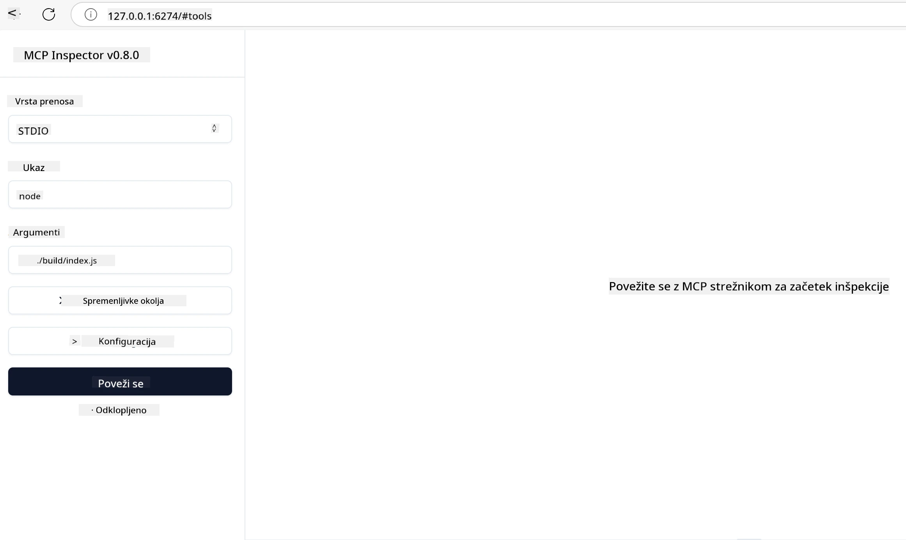

## Testiranje in odpravljanje napak

Preden začnete s testiranjem vašega MCP strežnika, je pomembno razumeti razpoložljiva orodja in najboljše prakse za odpravljanje napak. Učinkovito testiranje zagotavlja, da vaš strežnik deluje tako, kot je pričakovano, in vam pomaga hitro odkriti ter odpraviti težave. Naslednji razdelek opisuje priporočene pristope za preverjanje vaše MCP implementacije.

## Pregled

Ta lekcija zajema, kako izbrati pravi pristop za testiranje in najučinkovitejše orodje za testiranje.

## Cilji učenja

Do konca te lekcije boste znali:

- Opisati različne pristope za testiranje.
- Uporabiti različna orodja za učinkovito testiranje vaše kode.

## Testiranje MCP Strežnikov

MCP zagotavlja orodja, ki vam pomagajo testirati in odpravljati napake na vaših strežnikih:

- **MCP Inspector**: Orodje ukazne vrstice, ki ga lahko uporabljate tako kot CLI orodje kot tudi kot vizualno orodje.
- **Ročno testiranje**: Lahko uporabite orodje, kot je curl, za izvajanje spletnih zahtev, vendar bo katerokoli orodje, ki lahko izvaja HTTP, prav tako primerno.
- **Enotsko testiranje**: Možno je uporabiti vaš najljubši testni okvir za testiranje funkcij tako strežnika kot odjemalca.

### Uporaba MCP Inspectorja

Uporabo tega orodja smo opisali v prejšnjih lekcijah, a ga poglejmo na splošno. Gre za orodje, izdelano v Node.js, in ga lahko uporabite tako, da pokličete izvršljiv `npx`, ki bo orodje začasno prenesel in namestil ter se po končani izvedbi vaše zahteve samodejno očistil.

[MCP Inspector](https://github.com/modelcontextprotocol/inspector) vam pomaga:

- **Odkriti zmogljivosti strežnika**: Samodejno zaznava razpoložljive vire, orodja in pozive
- **Testirati izvajanje orodij**: Preizkusite različne parametre in spremljajte odgovore v realnem času
- **Ogledati metapodatke strežnika**: Preučite informacije o strežniku, sheme in konfiguracije

Običajen zagon orodja izgleda takole:

```bash
npx @modelcontextprotocol/inspector node build/index.js
```

Zgornji ukaz zažene MCP in njegovo vizualno vmesnik ter sproži lokalni spletni vmesnik v vašem brskalniku. Pričakujete lahko nadzorno ploščo, ki prikazuje vaše registrirane MCP strežnike, njihova razpoložljiva orodja, vire in pozive. Vmesnik omogoča interaktivno testiranje izvajanja orodij, pregledovanje metapodatkov strežnika in ogled odgovorov v realnem času, kar olajša preverjanje in odpravljanje napak v vaših implementacijah MCP strežnikov.

Tako lahko izgleda: 

To orodje lahko tudi zaženete v CLI načinu, kjer dodate atribut `--cli`. Tukaj je primer zagona orodja v "CLI" načinu, ki izpiše vsa orodja na strežniku:

```sh
npx @modelcontextprotocol/inspector --cli node build/index.js --method tools/list
```

### Ročno testiranje

Poleg zagona orodja inspector za testiranje zmogljivosti strežnika je drug podoben pristop zagon odjemalca, ki podpira HTTP, na primer curl.

S curl lahko neposredno testirate MCP strežnike preko HTTP zahtev:

```bash
# Primer: Preizkusni strežniški metapodatki
curl http://localhost:3000/v1/metadata

# Primer: Izvedite orodje
curl -X POST http://localhost:3000/v1/tools/execute \
  -H "Content-Type: application/json" \
  -d '{"name": "calculator", "parameters": {"expression": "2+2"}}'
```

Kot vidite iz zgornje uporabe curl, uporabljate POST zahtevo za klic orodja s podatki, ki vsebujejo ime orodja in njegove parametre. Uporabite pristop, ki vam najbolj ustreza. CLI orodja so na splošno hitrejša za uporabo in jih je mogoče avtomatizirati, kar je uporabno v CI/CD okolju.

### Enotsko testiranje

Ustvarite enotske teste za vaša orodja in vire, da zagotovite njihovo pravilno delovanje. Tukaj je nekaj primerov testne kode.

```python
import pytest

from mcp.server.fastmcp import FastMCP
from mcp.shared.memory import (
    create_connected_server_and_client_session as create_session,
)

# Označi celoten modul za asinhrone teste
pytestmark = pytest.mark.anyio


async def test_list_tools_cursor_parameter():
    """Test that the cursor parameter is accepted for list_tools.

    Note: FastMCP doesn't currently implement pagination, so this test
    only verifies that the cursor parameter is accepted by the client.
    """

 server = FastMCP("test")

    # Ustvari nekaj testnih orodij
    @server.tool(name="test_tool_1")
    async def test_tool_1() -> str:
        """First test tool"""
        return "Result 1"

    @server.tool(name="test_tool_2")
    async def test_tool_2() -> str:
        """Second test tool"""
        return "Result 2"

    async with create_session(server._mcp_server) as client_session:
        # Test brez parametra cursor (izpuščen)
        result1 = await client_session.list_tools()
        assert len(result1.tools) == 2

        # Test z cursor=None
        result2 = await client_session.list_tools(cursor=None)
        assert len(result2.tools) == 2

        # Test z cursor kot niz
        result3 = await client_session.list_tools(cursor="some_cursor_value")
        assert len(result3.tools) == 2

        # Test z cursor praznim nizom
        result4 = await client_session.list_tools(cursor="")
        assert len(result4.tools) == 2
    
```

Zgornja koda počne naslednje:

- Uporablja pytest ogrodje, ki omogoča ustvarjanje testov kot funkcij z uporabo assert izjav.
- Ustvari MCP strežnik z dvema različnima orodjema.
- Uporablja `assert` izjavo za preverjanje, da so določeni pogoji izpolnjeni.

Oglejte si [celotno datoteko tukaj](https://github.com/modelcontextprotocol/python-sdk/blob/main/tests/client/test_list_methods_cursor.py)

Glede na zgornjo datoteko lahko testirate svoj strežnik, da zagotovite, da so zmogljivosti ustvarjene, kot je potrebno.

Vsi večji SDK-ji imajo podobne testne razdelke, tako da jih lahko prilagodite svojemu izbranemu runtime okolju.

## Vzorci

- [Java Calculator](../samples/java/calculator/README.md)
- [.Net Calculator](../../../../03-GettingStarted/samples/csharp)
- [JavaScript Calculator](../samples/javascript/README.md)
- [TypeScript Calculator](../samples/typescript/README.md)
- [Python Calculator](../../../../03-GettingStarted/samples/python)

## Dodatni viri

- [Python SDK](https://github.com/modelcontextprotocol/python-sdk)

## Kaj sledi

- Naslednji korak: [Namestitev](../09-deployment/README.md)

---

<!-- CO-OP TRANSLATOR DISCLAIMER START -->
**Izjava o omejitvi odgovornosti**:
Ta dokument je bil preveden z uporabo AI prevajalske storitve [Co-op Translator](https://github.com/Azure/co-op-translator). Čeprav si prizadevamo za natančnost, prosimo, upoštevajte, da avtomatski prevodi lahko vsebujejo napake ali netočnosti. Izvirni dokument v maternem jeziku je treba šteti za avtoritativni vir. Za kritične informacije priporočamo strokovni človeški prevod. Za morebitna nerazumevanja ali napačne interpretacije, ki izhajajo iz uporabe tega prevoda, ne prevzemamo odgovornosti.
<!-- CO-OP TRANSLATOR DISCLAIMER END -->