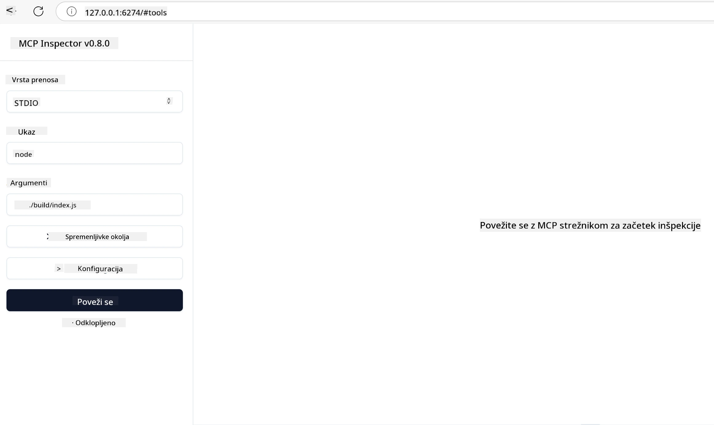

## Testiranje in odpravljanje napak

Preden začnete testirati svoj MCP strežnik, je pomembno razumeti razpoložljiva orodja in najboljše prakse za odpravljanje napak. Učinkovito testiranje zagotavlja, da se vaš strežnik obnaša po pričakovanjih, in vam pomaga hitro prepoznati in odpraviti težave. Naslednji oddelek povzema priporočene pristope za preverjanje vaše izvedbe MCP.

## Pregled

Ta lekcija obravnava, kako izbrati pravi pristop k testiranju in najučinkovitejše testno orodje.

## Cilji učenja

Ob koncu te lekcije boste znali:

- Opisati različne pristope za testiranje.
- Uporabiti različna orodja za učinkovito testiranje svoje kode.


## Testiranje MCP strežnikov

MCP nudi orodja za pomoč pri testiranju in odpravljanju napak vaših strežnikov:

- **MCP Inspector**: Orodje ukazne vrstice, ki ga lahko uporabljate tako kot CLI orodje kot tudi kot vizualno orodje.
- **Ročno testiranje**: Lahko uporabite orodje, kot je curl, za izvajanje spletnih zahtevkov, a ustrezno je vsako orodje, ki zna izvajati HTTP.
- **Enotsko testiranje**: Možno je uporabiti vaš priljubljeni testni okvir za testiranje funkcij tako strežnika kot odjemalca.

### Uporaba MCP Inspectorja

Uporabo tega orodja smo opisali v prejšnjih lekcijah, a si ga poglejmo na splošno. To je orodje, zgrajeno v Node.js, in ga lahko uporabite z zagonom `npx` izvršljive datoteke, ki bo začasno prenesla in namestila orodje, nato pa se očistila po zaključku vaše zahteve.

[MCP Inspector](https://github.com/modelcontextprotocol/inspector) vam pomaga:

- **Odkrijte zmogljivosti strežnika**: Samodejno zazna razpoložljive vire, orodja in pozive
- **Testirajte izvajanje orodij**: Preizkusite različne parametre in si oglejte odzive v realnem času
- **Ogled metapodatkov strežnika**: Preučite informacije o strežniku, sheme in konfiguracije

Tipičen zagon orodja izgleda tako:

```bash
npx @modelcontextprotocol/inspector node build/index.js
```

Zgornji ukaz zažene MCP in njegovo vizualno vmesnik ter odpre lokalni spletni vmesnik v vašem brskalniku. Lahko pričakujete nadzorno ploščo, ki prikazuje vaše registrirane MCP strežnike, njihova razpoložljiva orodja, vire in pozive. Vmesnik vam omogoča interaktivno testiranje izvajanja orodij, pregled metapodatkov strežnika in ogled odzivov v realnem času, kar olajša preverjanje in odpravljanje napak pri izvedbah MCP strežnikov.

Tako je lahko videti: 

Orodje lahko tudi zaženete v načinu CLI, za kar dodate atribut `--cli`. Tukaj je primer zagona orodja v načinu "CLI", ki našteje vsa orodja na strežniku:

```sh
npx @modelcontextprotocol/inspector --cli node build/index.js --method tools/list
```

### Ročno testiranje

Poleg pisanja in zagona orodja inspector za testiranje zmogljivosti strežnika, je še en podoben pristop zagnati odjemalca, ki zna uporabljati HTTP, na primer curl.

Z curl lahko neposredno testirate MCP strežnike z uporabo HTTP zahtevkov:

```bash
# Primer: Metapodatki testnega strežnika
curl http://localhost:3000/v1/metadata

# Primer: Zaženi orodje
curl -X POST http://localhost:3000/v1/tools/execute \
  -H "Content-Type: application/json" \
  -d '{"name": "calculator", "parameters": {"expression": "2+2"}}'
```

Kot lahko vidite zgoraj, z uporabo curl pošljete POST zahtevo za klic orodja z uporabo podatkov, ki vsebujejo ime orodja in njegove parametre. Uporabite pristop, ki vam najbolj ustreza. Orodja CLI so na splošno hitrejša in enostavnejša za skriptiranje, kar je lahko koristno v okolju CI/CD.

### Enotsko testiranje

Ustvarite enotske teste za svoja orodja in vire, da zagotovite, da delujejo kot je pričakovano. Tukaj je primer testne kode.

```python
import pytest

from mcp.server.fastmcp import FastMCP
from mcp.shared.memory import (
    create_connected_server_and_client_session as create_session,
)

# Označi celoten modul za asinhrone teste
pytestmark = pytest.mark.anyio


async def test_list_tools_cursor_parameter():
    """Test that the cursor parameter is accepted for list_tools.

    Note: FastMCP doesn't currently implement pagination, so this test
    only verifies that the cursor parameter is accepted by the client.
    """

 server = FastMCP("test")

    # Ustvari nekaj testnih orodij
    @server.tool(name="test_tool_1")
    async def test_tool_1() -> str:
        """First test tool"""
        return "Result 1"

    @server.tool(name="test_tool_2")
    async def test_tool_2() -> str:
        """Second test tool"""
        return "Result 2"

    async with create_session(server._mcp_server) as client_session:
        # Testiraj brez parametra cursor (izpuščeno)
        result1 = await client_session.list_tools()
        assert len(result1.tools) == 2

        # Testiraj z cursor=None
        result2 = await client_session.list_tools(cursor=None)
        assert len(result2.tools) == 2

        # Testiraj z cursor kot niz
        result3 = await client_session.list_tools(cursor="some_cursor_value")
        assert len(result3.tools) == 2

        # Testiraj z praznim nizom cursor
        result4 = await client_session.list_tools(cursor="")
        assert len(result4.tools) == 2
    
```

Predhodna koda počne naslednje:

- Uporablja ogrodje pytest, ki omogoča ustvarjanje testov kot funkcij in uporabo izjav assert.
- Ustvari MCP strežnik z dvema različnima orodjema.
- Uporablja izjavo `assert` za preverjanje, ali so izpolnjeni določeni pogoji.

Oglejte si [celotno datoteko tukaj](https://github.com/modelcontextprotocol/python-sdk/blob/main/tests/client/test_list_methods_cursor.py)

Glede na zgornjo datoteko lahko testirate svoj lasten strežnik in zagotovite, da so zmogljivosti ustvarjene, kot morajo biti.

Vsi glavni SDK-ji imajo podobne testne odseke, tako da se lahko prilagodite svojemu izbranemu runtime okolju.

## Primeri

- [Java Calculator](../samples/java/calculator/README.md)
- [.Net Calculator](../../../../03-GettingStarted/samples/csharp)
- [JavaScript Calculator](../samples/javascript/README.md)
- [TypeScript Calculator](../samples/typescript/README.md)
- [Python Calculator](../../../../03-GettingStarted/samples/python)

## Dodatni viri

- [Python SDK](https://github.com/modelcontextprotocol/python-sdk)

## Kaj sledi

- Naslednje: [Deploy](../09-deployment/README.md)

---

<!-- CO-OP TRANSLATOR DISCLAIMER START -->
**Omejitev odgovornosti**:
Ta dokument je bil preveden z uporabo AI prevajalske storitve [Co-op Translator](https://github.com/Azure/co-op-translator). Čeprav si prizadevamo za natančnost, vas prosimo, da upoštevate, da avtomatizirani prevodi lahko vsebujejo napake ali netočnosti. Izvirni dokument v njegovem izvirnem jeziku je treba obravnavati kot avtoritativni vir. Za kritične informacije je priporočljiv strokovni človeški prevod. Ne odgovarjamo za morebitna nesporazume ali napačne interpretacije, ki izhajajo iz uporabe tega prevoda.
<!-- CO-OP TRANSLATOR DISCLAIMER END -->