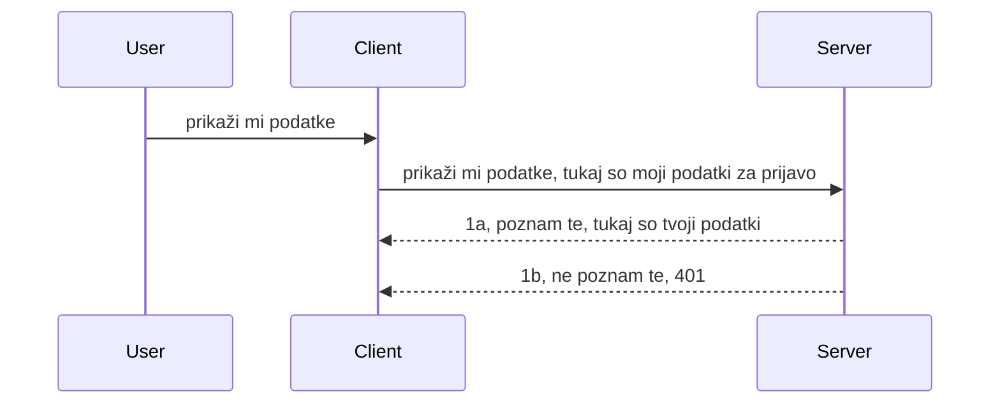

# Enostavna avtentikacija

MCP SDK-ji podpirajo uporabo OAuth 2.1, ki je, če smo pošteni, precej zapleten proces, ki vključuje pojme kot so auth strežnik, strežnik virov, pošiljanje poverilnic, pridobivanje kode, izmenjava kode za žeton nosilca, dokler končno ne pridete do podatkov z vaših virov. Če niste vajeni OAuth-a, kar je odlična stvar za implementacijo, je dobro začeti z nekim osnovnim nivojem avtentikacije in nato graditi na boljši in boljši varnosti. Zato ta poglavje obstaja, da vas postopoma pripelje do bolj napredne avtentikacije.

## Avtentikacija, kaj to pomeni?

Avtentikacija je okrajšava za overjanje in avtorizacijo. Ideja je, da moramo storiti dve stvari:

- **Overjanje (Authentication)**, kar je proces ugotavljanja, ali nekomu dovolimo vstopiti v naš dom, da ima pravico biti "tukaj", torej dostop do našega strežnika virov, kjer živijo funkcije MCP Strežnika.
- **Avtorizacija (Authorization)**, je proces ugotavljanja, ali bi moral uporabnik imeti dostop do teh konkretnih virov, ki jih zahteva, na primer do teh naročil ali teh izdelkov ali ali mu je dovoljeno prebrati vsebino, a ne izbrisati, kot en primer.

## Poverilnice: kako sistemu povemo, kdo smo

Večina spletnih razvijalcev začne razmišljati v smislu, da poda poverilnico strežniku, običajno skrivnost, ki pove, ali imajo pravico biti tukaj ("Authentication"). Ta poverilnica je ponavadi base64 zakodirana različica uporabniškega imena in gesla ali API ključ, ki enolično identificira določenega uporabnika.

To vključuje pošiljanje preko glave z imenom "Authorization" na tak način:

```json
{ "Authorization": "secret123" }
```

To se običajno imenuje osnovna avtentikacija (basic authentication). Kako potem poteka celoten tok, je takole:


Zdaj ko razumemo, kako to deluje z vidika toka, kako to implementirati? Večina spletnih strežnikov ima koncept, imenovan middleware, kos kode, ki teče kot del zahteve in lahko preveri poverilnice, in če so poverilnice veljavne, dopušča nadaljevanje zahteve. Če zahteva nima veljavnih poverilnic, prejmete napako avtentikacije. Poglejmo, kako lahko implementiramo to:

**Python**

```python
class AuthMiddleware(BaseHTTPMiddleware):
    async def dispatch(self, request, call_next):

        has_header = request.headers.get("Authorization")
        if not has_header:
            print("-> Missing Authorization header!")
            return Response(status_code=401, content="Unauthorized")

        if not valid_token(has_header):
            print("-> Invalid token!")
            return Response(status_code=403, content="Forbidden")

        print("Valid token, proceeding...")
       
        response = await call_next(request)
        # dodajte katere koli uporabniške glave ali na nek način spremenite odziv
        return response


starlette_app.add_middleware(CustomHeaderMiddleware)
```

Tukaj imamo:

- Ustvarjen middleware z imenom `AuthMiddleware`, katerega metoda `dispatch` se kliče s strani spletnega strežnika.
- Middleware dodan spletnemu strežniku:

    ```python
    starlette_app.add_middleware(AuthMiddleware)
    ```

- Napisano logiko validacije, ki preveri, če je glava Authorization prisotna in če je poslana skrivnost veljavna:

    ```python
    has_header = request.headers.get("Authorization")
    if not has_header:
        print("-> Missing Authorization header!")
        return Response(status_code=401, content="Unauthorized")

    if not valid_token(has_header):
        print("-> Invalid token!")
        return Response(status_code=403, content="Forbidden")
    ```

    če je skrivnost prisotna in veljavna, potem dovolimo zahtevi nadaljevati s klicem `call_next` in vrnemo odgovor.

    ```python
    response = await call_next(request)
    # dodajte poljubne uporabniške glave ali na kakršen koli način spremenite odgovor
    return response
    ```

Kako to deluje je, da če je narejena spletna zahteva proti strežniku, se middleware pokliče in glede na njegovo implementacijo bo ali dovolil zahtevi nadaljevati ali pa vrnil napako, ki kaže, da klient nima dovoljenja za nadaljevanje.

**TypeScript**

Tukaj ustvarimo middleware s priljubljenim ogrodjem Express in prestrežemo zahtevo, preden pride do MCP Strežnika. Tukaj je koda za to:

```typescript
function isValid(secret) {
    return secret === "secret123";
}

app.use((req, res, next) => {
    // 1. Ali je prisoten glava za avtorizacijo?
    if(!req.headers["Authorization"]) {
        res.status(401).send('Unauthorized');
    }
    
    let token = req.headers["Authorization"];

    // 2. Preveri veljavnost.
    if(!isValid(token)) {
        res.status(403).send('Forbidden');
    }

   
    console.log('Middleware executed');
    // 3. Posreduje zahtevo naslednjemu koraku v pipelinu zahtev.
    next();
});
```

V tej kodi:

1. Preverimo, ali glava Authorization obstaja, če ne, pošljemo 401 napako.
2. Zagotovimo, da je poverilnica/žeton veljaven, če ne, pošljemo 403 napako.
3. Nazadnje posredujemo zahtevo v cevovod zahtev in vrnemo zahtevan vir.

## Vaja: Implementiraj avtentikacijo

Vzemimo naše znanje in poskusimo to implementirati. Tukaj je načrt:

Strežnik

- Ustvarite spletni strežnik in MCP instanco.
- Implementirajte middleware za strežnik.

Odjemalec

- Pošljite spletno zahtevo z poverilnico preko glave.

### -1- Ustvarite spletni strežnik in MCP instanco

V prvem koraku moramo ustvariti instanco spletnega strežnika in MCP Strežnika.

**Python**

Tukaj ustvarimo MCP strežniško instanco, ustvarimo starlette spletno aplikacijo in jo gostimo z uvicorn.

```python
# ustvarjanje MCP strežnika

app = FastMCP(
    name="MCP Resource Server",
    instructions="Resource Server that validates tokens via Authorization Server introspection",
    host=settings["host"],
    port=settings["port"],
    debug=True
)

# ustvarjanje starlette spletne aplikacije
starlette_app = app.streamable_http_app()

# streženje aplikacije preko uvicorn
async def run(starlette_app):
    import uvicorn
    config = uvicorn.Config(
            starlette_app,
            host=app.settings.host,
            port=app.settings.port,
            log_level=app.settings.log_level.lower(),
        )
    server = uvicorn.Server(config)
    await server.serve()

run(starlette_app)
```

V tej kodi:

- Ustvarimo MCP Strežnik.
- Konstruiramo starlette spletno aplikacijo iz MCP Strežnika, `app.streamable_http_app()`.
- Gostimo in strežemo spletno aplikacijo z uporabo uvicorn `server.serve()`.

**TypeScript**

Tukaj ustvarjamo instanco MCP Strežnika.

```typescript
const server = new McpServer({
      name: "example-server",
      version: "1.0.0"
    });

    // ... nastavite strežniške vire, orodja in pozive ...
```

To ustvarjanje MCP Strežnika se mora zgoditi znotraj definicije poti POST /mcp, zato vzamemo zgornjo kodo in jo premaknemo takole:

```typescript
import express from "express";
import { randomUUID } from "node:crypto";
import { McpServer } from "@modelcontextprotocol/sdk/server/mcp.js";
import { StreamableHTTPServerTransport } from "@modelcontextprotocol/sdk/server/streamableHttp.js";
import { isInitializeRequest } from "@modelcontextprotocol/sdk/types.js"

const app = express();
app.use(express.json());

// Zemljevid za shranjevanje transportov po ID seje
const transports: { [sessionId: string]: StreamableHTTPServerTransport } = {};

// Obdelava POST zahtevkov za komunikacijo klient-server
app.post('/mcp', async (req, res) => {
  // Preveri obstoječi ID seje
  const sessionId = req.headers['mcp-session-id'] as string | undefined;
  let transport: StreamableHTTPServerTransport;

  if (sessionId && transports[sessionId]) {
    // Ponovna uporaba obstoječega transporta
    transport = transports[sessionId];
  } else if (!sessionId && isInitializeRequest(req.body)) {
    // Nova zahteva za inicializacijo
    transport = new StreamableHTTPServerTransport({
      sessionIdGenerator: () => randomUUID(),
      onsessioninitialized: (sessionId) => {
        // Shrani transport po ID seje
        transports[sessionId] = transport;
      },
      // Zaščita pred DNS rebindingom je privzeto onemogočena zaradi združljivosti nazaj. Če ta strežnik
      // poganjaš lokalno, poskrbi, da nastaviš:
      // enableDnsRebindingProtection: true,
      // allowedHosts: ['127.0.0.1'],
    });

    // Počisti transport, ko je zaprt
    transport.onclose = () => {
      if (transport.sessionId) {
        delete transports[transport.sessionId];
      }
    };
    const server = new McpServer({
      name: "example-server",
      version: "1.0.0"
    });

    // ... nastavi strežniške vire, orodja in pozive ...

    // Poveži se s strežnikom MCP
    await server.connect(transport);
  } else {
    // Neveljavna zahteva
    res.status(400).json({
      jsonrpc: '2.0',
      error: {
        code: -32000,
        message: 'Bad Request: No valid session ID provided',
      },
      id: null,
    });
    return;
  }

  // Obdelaj zahtevo
  await transport.handleRequest(req, res, req.body);
});

// Ponovno uporabni upravljalec za GET in DELETE zahteve
const handleSessionRequest = async (req: express.Request, res: express.Response) => {
  const sessionId = req.headers['mcp-session-id'] as string | undefined;
  if (!sessionId || !transports[sessionId]) {
    res.status(400).send('Invalid or missing session ID');
    return;
  }
  
  const transport = transports[sessionId];
  await transport.handleRequest(req, res);
};

// Obdelava GET zahtevkov za obvestila strežnika za klienta preko SSE
app.get('/mcp', handleSessionRequest);

// Obdelava DELETE zahtev za zaključek seje
app.delete('/mcp', handleSessionRequest);

app.listen(3000);
```

Zdaj vidite, kako je bila ustvaritev MCP Strežnika premaknjena znotraj `app.post("/mcp")`.

Nadaljujmo na naslednji korak ustvarjanja middleware, da lahko validiramo prihodnje poverilnice.

### -2- Implementirajte middleware za strežnik

Nato se lotimo dela middleware. Tukaj ustvarjamo middleware, ki išče poverilnico v glavi `Authorization` in jo validira. Če je sprejemljiva, bo zahteva nadaljevala z izvajanjem, kar potrebuje (npr. seznam orodij, branje vira ali karkoli MCP funkcionalnosti, ki jo klient zahteva).

**Python**

Za ustvarjanje middleware moramo ustvariti razred, ki podeduje `BaseHTTPMiddleware`. Obstajata dva zanimiva elementa:

- Zahteva `request`, iz katere preberemo podatke iz glave.
- `call_next` je klicni povratni mehanizem, ki ga moramo poklicati, če je prinesena poverilnica sprejemljiva.

Najprej moramo obravnavati primer, če glava `Authorization` manjka:

```python
has_header = request.headers.get("Authorization")

# glava ni prisotna, napaka s statusom 401, sicer nadaljuj.
if not has_header:
    print("-> Missing Authorization header!")
    return Response(status_code=401, content="Unauthorized")
```

Tukaj pošljemo sporočilo 401 unauthorized, ker klient ne uspe pri avtentikaciji.

Nato, če je bila podana poverilnica, moramo preveriti njeno veljavnost takole:

```python
 if not valid_token(has_header):
    print("-> Invalid token!")
    return Response(status_code=403, content="Forbidden")
```

Upoštevajte, da zgoraj pošljemo sporočilo 403 forbidden. Poglejmo celoten middleware spodaj, ki implementira vse, kar smo zgoraj omenili:

```python
class AuthMiddleware(BaseHTTPMiddleware):
    async def dispatch(self, request, call_next):

        has_header = request.headers.get("Authorization")
        if not has_header:
            print("-> Missing Authorization header!")
            return Response(status_code=401, content="Unauthorized")

        if not valid_token(has_header):
            print("-> Invalid token!")
            return Response(status_code=403, content="Forbidden")

        print("Valid token, proceeding...")
        print(f"-> Received {request.method} {request.url}")
        response = await call_next(request)
        response.headers['Custom'] = 'Example'
        return response

```

Super, ampak kaj pa funkcija `valid_token`? Tukaj je spodaj:
:

```python
# NE uporabljajte za produkcijo - izboljšajte to !!
def valid_token(token: str) -> bool:
    # odstranite predpono "Bearer "
    if token.startswith("Bearer "):
        token = token[7:]
        return token == "secret-token"
    return False
```

To je seveda potrebno izboljšati.

POMEMBNO: Nikoli NE smete imeti takšne skrivnosti v kodi. Idealno bi bilo pridobiti vrednost za primerjavo iz podatkovnega vira ali od ponudnika identitete (IDP) ali še bolje, naj IDP opravi validacijo.

**TypeScript**

Za implementacijo tega z Express potrebujemo klic metode `use`, ki sprejme middleware funkcije.

Potrebujemo:

- Interakcijo z zahtevkom, da preverimo poslano poverilnico v lastnosti `Authorization`.
- Validacijo poverilnice in če je veljavna, naj zahteva nadaljuje ter klientu omogoči MCP zahtevo (npr. seznam orodij, branje vira ali karkoli MCP povezano).

Tukaj preverjamo, ali obstaja glava `Authorization` in če ne, ustavimo zahtevo:

```typescript
if(!req.headers["authorization"]) {
    res.status(401).send('Unauthorized');
    return;
}
```

Če glava v prvem koraku ni poslana, prejmete 401.

Nato preverimo, ali je poverilnica veljavna, če ni, ponovno ustavimo zahtevo s sporočilom:

```typescript
if(!isValid(token)) {
    res.status(403).send('Forbidden');
    return;
} 
```

Opazite, da zdaj dobite 403 napako.

Tukaj je celotna koda:

```typescript
app.use((req, res, next) => {
    console.log('Request received:', req.method, req.url, req.headers);
    console.log('Headers:', req.headers["authorization"]);
    if(!req.headers["authorization"]) {
        res.status(401).send('Unauthorized');
        return;
    }
    
    let token = req.headers["authorization"];

    if(!isValid(token)) {
        res.status(403).send('Forbidden');
        return;
    }  

    console.log('Middleware executed');
    next();
});
```

Nastavili smo spletni strežnik, da sprejme middleware za preverjanje poverilnice, ki jo upamo, da nam klient pošlje. Kaj pa sam klient?

### -3- Pošljite spletno zahtevo z poverilnico preko glave

Moramo zagotoviti, da klient pošilja poverilnico preko glave. Ker bomo uporabili MCP klienta za to, moramo ugotoviti, kako se to naredi.

**Python**

Za klienta moramo poslati glavo z našo poverilnico takole:

```python
# NE nastavljajte vrednosti neposredno v kodi, imejte jo vsaj v okoljski spremenljivki ali na varnejšem mestu za shranjevanje
token = "secret-token"

async with streamablehttp_client(
        url = f"http://localhost:{port}/mcp",
        headers = {"Authorization": f"Bearer {token}"}
    ) as (
        read_stream,
        write_stream,
        session_callback,
    ):
        async with ClientSession(
            read_stream,
            write_stream
        ) as session:
            await session.initialize()
      
            # NAREDITI, kaj želite, da se naredi na odjemalcu, npr. seznam orodij, klic orodij itd.
```

Opazite, da napolnimo lastnost `headers` takole ` headers = {"Authorization": f"Bearer {token}"}`.

**TypeScript**

Lahko rešimo v dveh korakih:

1. Napolnimo konfiguracijski objekt z našo poverilnico.
2. Posredujemo konfiguracijski objekt prenosu (transportu).

```typescript

// NE trdo kodirajte vrednosti, kot je prikazano tukaj. Najmanj, kar lahko storite, je, da jo imate kot okoljsko spremenljivko in uporabite nekaj takega kot dotenv (v načinu za razvoj).
let token = "secret123"

// definirajte objekt možnosti za transport klienta
let options: StreamableHTTPClientTransportOptions = {
  sessionId: sessionId,
  requestInit: {
    headers: {
      "Authorization": "secret123"
    }
  }
};

// posredujte objekt možnosti transportu
async function main() {
   const transport = new StreamableHTTPClientTransport(
      new URL(serverUrl),
      options
   );
```

Tukaj vidite, kako smo morali ustvariti objekt `options` in naše glave postaviti pod lastnost `requestInit`.

POMEMBNO: Kako to od tu izboljšamo? Trenutna implementacija ima nekaj težav. Najprej, pošiljanje poverilnice na ta način je precej tvegano, razen če imate vsaj HTTPS. Tudi takrat lahko poverilnica pride v roke hekerjem, zato potrebujete sistem, kjer lahko žeton enostavno prekličete in dodate dodatne kontrole, kot na primer od kod v svetu prihaja, če so zahteve prehude (obnašanje botov), skratka, obstaja cela paleta varnostnih skrbi.

Vendar pa velja omeniti, da je za zelo preproste API-je, kjer nočete, da kdorkoli kliče vaš API brez overitve, kar imamo tukaj dober začetek.

Zato poskusimo malo izboljšati varnost z uporabo standardiziranega formata, kot je JSON Web Token, znan tudi kot JWT ali "JOT" žetoni.

## JSON Web žetoni, JWT

Poskušamo izboljšati stvari glede pošiljanja zelo preprostih poverilnic. Kakšne so neposredne izboljšave, ki jih dobimo z uvajanjem JWT?

- **Varnostne izboljšave**. Pri osnovni avtentikaciji pošiljate uporabniško ime in geslo kot base64 kodiran žeton (ali pošljete API ključ) znova in znova, kar poveča tveganje. Pri JWT pošljete uporabniško ime in geslo in dobite žeton v zameno, ki je tudi časovno omejen, kar pomeni, da poteče. JWT omogoča enostavno uporabo drobnozrnate kontrole dostopa z vlogami, področji in dovoljenji.
- **Brezstanjskost in skalabilnost**. JWT-ji so samostojni, nosijo vse uporabniške informacije in odpravijo potrebo po shranjevanju sej na strežniku. Žeton je mogoče tudi lokalno validirati.
- **Interoperabilnost in federacija**. JWT je središče OpenID Connect in se uporablja s poznanimi ponudniki identitet, kot so Entra ID, Google Identity in Auth0. Prav tako omogoča uporabo singl sign on in še več, kar ga naredi primernim za poslovno raven.
- **Modularnost in prilagodljivost**. JWT se lahko uporablja tudi z API prehodi, kot sta Azure API Management, NGINX in drugi. Podpira tudi scenarije uporabe avtentikacije in komunikacije strežnik-storitev, vključno z impersonacijo in delegacijskimi scenariji.
- **Zmogljivost in predpomnjenje**. JWT-je je mogoče predpomniti po dekodiranju, kar zmanjša potrebo po analizi. To posebej pomaga pri aplikacijah z velikim prometom, saj izboljša prepustnost in zmanjša obremenitev infrastrukture.
- **Napredne funkcije**. Prav tako podpira introspekcijo (preverjanje veljavnosti na strežniku) in preklic (narediti žeton neveljaven).

Z vsemi temi prednostmi poglejmo, kako lahko našo implementacijo pripeljemo na višjo raven.

## Pretvorba osnovne avtentikacije v JWT

Spremembe, ki jih moramo narediti na visoki ravni, so:

- **Naučiti se konstruirati JWT žeton** in ga pripraviti za pošiljanje iz klienta na strežnik.
- **Validirati JWT žeton** in če je veljaven, dovoliti klientu dostop do naših virov.
- **Varno shranjevanje žetona**. Kako ta žeton shranjujemo.
- **Zaščititi poti**. Potrebujemo zaščito poti, v našem primeru zaščititi pote in specifične MCP funkcije.
- **Dodati obnovitvene žetone**. Zagotoviti, da ustvarjamo žetone kratke življenjske dobe ter obnovitvene žetone s dolgo življenjsko dobo, ki se lahko uporabljajo za pridobitev novih žetonov, če potečejo. Prav tako zagotoviti obnovitveno končno točko in strategijo rotacije.

### -1- Konstruirajte JWT žeton

JWT žeton ima naslednje dele:

- **glava (header)**, uporabljen algoritem in tip žetona.
- **vsebina (payload)**, trditve, kot so sub (uporabnik ali entiteta, ki jo žeton predstavlja. V avtentikacijskem scenariju je to tipično ID uporabnika), exp (čas poteka), role (vloga).
- **potpis (signature)**, podpisan s skrivnostjo ali zasebnim ključem.

Za to bomo morali konstruirati glavo, vsebino in kodiran žeton.

**Python**

```python

import jwt
import jwt
from jwt.exceptions import ExpiredSignatureError, InvalidTokenError
import datetime

# Skrivni ključ, uporabljen za podpis JWT
secret_key = 'your-secret-key'

header = {
    "alg": "HS256",
    "typ": "JWT"
}

# informacije o uporabniku in njegove trditve ter čas poteka
payload = {
    "sub": "1234567890",               # Zadeva (ID uporabnika)
    "name": "User Userson",                # Lastna trditev
    "admin": True,                     # Lastna trditev
    "iat": datetime.datetime.utcnow(),# Datum izdaje
    "exp": datetime.datetime.utcnow() + datetime.timedelta(hours=1)  # Potek
}

# zakodiraj to
encoded_jwt = jwt.encode(payload, secret_key, algorithm="HS256", headers=header)
```

V zgornji kodi smo:

- Definirali glavo z algoritmom HS256 in tipom JWT.
- Konstruirali vsebino, ki vsebuje subjekt oziroma uporabniški id, uporabniško ime, vlogo, kdaj je bil izdan in kdaj poteče, s čimer implementiramo časovno omejenost, ki smo jo omenili prej.

**TypeScript**

Tukaj bomo potrebovali nekaj odvisnosti, ki nam bodo pomagale konstruirati JWT žeton.

Odvisnosti

```sh

npm install jsonwebtoken
npm install --save-dev @types/jsonwebtoken
```

Zdaj ko imamo to, ustvarimo glavo, vsebino in preko tega ustvarimo kodiran žeton.

```typescript
import jwt from 'jsonwebtoken';

const secretKey = 'your-secret-key'; // Uporabite okoljske spremenljivke v produkciji

// Določite vsebino
const payload = {
  sub: '1234567890',
  name: 'User usersson',
  admin: true,
  iat: Math.floor(Date.now() / 1000), // Izdan ob
  exp: Math.floor(Date.now() / 1000) + 60 * 60 // Poteče v 1 uri
};

// Določite glavo (neobvezno, jsonwebtoken nastavi privzete vrednosti)
const header = {
  alg: 'HS256',
  typ: 'JWT'
};

// Ustvarite žeton
const token = jwt.sign(payload, secretKey, {
  algorithm: 'HS256',
  header: header
});

console.log('JWT:', token);
```

Ta žeton je:

Podpisan z uporabo HS256  
Veljaven eno uro  
Vsebuje trditve kot sub, name, admin, iat in exp.

### -2- Validirajte žeton

Žeton moramo tudi validirati, to je nekaj, kar bi morali narediti na strežniku, da zagotovimo, da je tisto, kar nam pošlje klient, res veljavno. Tukaj je veliko preverjanj, ki jih moramo narediti, od validacije strukture do veljavnosti. Prav tako je priporočljivo, da dodate dodatne kontrole, kot na primer preverjanje, ali uporabnik obstaja v našem sistemu in še več.

Za validacijo žetona ga moramo dekodirati, da ga lahko preberemo in nato preverjamo njegovo veljavnost:

**Python**

```python

# Dekodirajte in preverite JWT
try:
    decoded = jwt.decode(token, secret_key, algorithms=["HS256"])
    print("✅ Token is valid.")
    print("Decoded claims:")
    for key, value in decoded.items():
        print(f"  {key}: {value}")
except ExpiredSignatureError:
    print("❌ Token has expired.")
except InvalidTokenError as e:
    print(f"❌ Invalid token: {e}")

```

V tej kodi kliče `jwt.decode` s podanim žetonom, skrivnim ključem in izbranim algoritmom. Opazite, da uporabljamo try-catch konstrukcijo, ker neuspešna validacija sproži napako.

**TypeScript**

Tukaj potrebujemo klic `jwt.verify` za pridobitev dekodirane različice žetona, ki jo lahko nato analiziramo. Če ta klic ne uspe, pomeni, da je struktura žetona napačna ali ni več veljavna.

```typescript

try {
  const decoded = jwt.verify(token, secretKey);
  console.log('Decoded Payload:', decoded);
} catch (err) {
  console.error('Token verification failed:', err);
}
```

OPOZORILO: kot omenjeno prej, bi morali dodatno preverjati, ali ta žeton kaže na uporabnika v našem sistemu in zagotavljati, da ima uporabnik pravice, ki jih trdi.

Nato si poglejmo nadzor dostopa na podlagi vlog, znan tudi kot RBAC.
## Dodajanje nadzora dostopa, ki temelji na vlogah

Ideja je, da želimo izraziti, da imajo različne vloge različne pravice. Na primer, predvidevamo, da lahko skrbnik (admin) naredi vse, običajni uporabniki pa lahko berejo/pišejo, gostje pa lahko samo berejo. Zato so tukaj nekatere možne ravni dovoljenj:

- Admin.Write  
- User.Read  
- Guest.Read  

Oglejmo si, kako lahko tak nadzor implementiramo z middleware-jem. Middleware-je lahko dodamo za posamezno pot kot tudi za vse poti.

**Python**

```python
from starlette.middleware.base import BaseHTTPMiddleware
from starlette.responses import JSONResponse
import jwt

# NE imejte skrivnosti v kodi, kot je ta, to je samo za demonstracijo. Preberite jo iz varnega mesta.
SECRET_KEY = "your-secret-key" # shranite to v okoljsko spremenljivko
REQUIRED_PERMISSION = "User.Read"

class JWTPermissionMiddleware(BaseHTTPMiddleware):
    async def dispatch(self, request, call_next):
        auth_header = request.headers.get("Authorization")
        if not auth_header or not auth_header.startswith("Bearer "):
            return JSONResponse({"error": "Missing or invalid Authorization header"}, status_code=401)

        token = auth_header.split(" ")[1]
        try:
            decoded = jwt.decode(token, SECRET_KEY, algorithms=["HS256"])
        except jwt.ExpiredSignatureError:
            return JSONResponse({"error": "Token expired"}, status_code=401)
        except jwt.InvalidTokenError:
            return JSONResponse({"error": "Invalid token"}, status_code=401)

        permissions = decoded.get("permissions", [])
        if REQUIRED_PERMISSION not in permissions:
            return JSONResponse({"error": "Permission denied"}, status_code=403)

        request.state.user = decoded
        return await call_next(request)


```
  
Obstaja nekaj različnih načinov za dodajanje middleware-ja, kot spodaj:

```python

# Alt 1: dodaj middleware med gradnjo starlette aplikacije
middleware = [
    Middleware(JWTPermissionMiddleware)
]

app = Starlette(routes=routes, middleware=middleware)

# Alt 2: dodaj middleware po tem, ko je starlette aplikacija že zgrajena
starlette_app.add_middleware(JWTPermissionMiddleware)

# Alt 3: dodaj middleware za posamezno pot
routes = [
    Route(
        "/mcp",
        endpoint=..., # upravljalec
        middleware=[Middleware(JWTPermissionMiddleware)]
    )
]
```
  
**TypeScript**

Lahko uporabimo `app.use` in middleware, ki bo tekel za vse zahtevke.

```typescript
app.use((req, res, next) => {
    console.log('Request received:', req.method, req.url, req.headers);
    console.log('Headers:', req.headers["authorization"]);

    // 1. Preveri, ali je bil poslan glava za avtorizacijo

    if(!req.headers["authorization"]) {
        res.status(401).send('Unauthorized');
        return;
    }
    
    let token = req.headers["authorization"];

    // 2. Preveri, ali je žeton veljaven
    if(!isValid(token)) {
        res.status(403).send('Forbidden');
        return;
    }  

    // 3. Preveri, ali uporabnik žetona obstaja v našem sistemu
    if(!isExistingUser(token)) {
        res.status(403).send('Forbidden');
        console.log("User does not exist");
        return;
    }
    console.log("User exists");

    // 4. Preveri, ali ima žeton ustrezna dovoljenja
    if(!hasScopes(token, ["User.Read"])){
        res.status(403).send('Forbidden - insufficient scopes');
    }

    console.log("User has required scopes");

    console.log('Middleware executed');
    next();
});

```
  
Obstaja precej stvari, ki jih lahko dovolimo našemu middleware-ju in ki jih NAJ bi middleware naredil, in sicer:

1. Preveri, če je prisoten authorization header  
2. Preveri, če je token veljaven, pokličemo `isValid`, kar je metoda, ki smo jo napisali in preveri integriteto in veljavnost JWT tokena.  
3. Preveri, če uporabnik obstaja v našem sistemu, to bi morali preveriti.

   ```typescript
    // uporabniki v zbirki podatkov
   const users = [
     "user1",
     "User usersson",
   ]

   function isExistingUser(token) {
     let decodedToken = verifyToken(token);

     // TODO, preveri, če uporabnik obstaja v zbirki podatkov
     return users.includes(decodedToken?.name || "");
   }
   ```
  
Zgoraj smo ustvarili zelo preprost seznam `users`, ki bi moral biti seveda v podatkovni bazi.

4. Poleg tega bi morali tudi preveriti, ali ima token prava dovoljenja.

   ```typescript
   if(!hasScopes(token, ["User.Read"])){
        res.status(403).send('Forbidden - insufficient scopes');
   }
   ```
  
V zgornji kodi middleware-ja preverjamo, da token vsebuje dovoljenje User.Read, če ne, pošljemo napako 403. Spodaj je pomočna metoda `hasScopes`.

   ```typescript
   function hasScopes(scope: string, requiredScopes: string[]) {
     let decodedToken = verifyToken(scope);
    return requiredScopes.every(scope => decodedToken?.scopes.includes(scope));
  }  
   ```

Have a think which additional checks you should be doing, but these are the absolute minimum of checks you should be doing.

Using Express as a web framework is a common choice. There are helpers library when you use JWT so you can write less code.

- `express-jwt`, helper library that provides a middleware that helps decode your token.
- `express-jwt-permissions`, this provides a middleware `guard` that helps check if a certain permission is on the token.

Here's what these libraries can look like when used:

```typescript
const express = require('express');
const jwt = require('express-jwt');
const guard = require('express-jwt-permissions')();

const app = express();
const secretKey = 'your-secret-key'; // put this in env variable

// Decode JWT and attach to req.user
app.use(jwt({ secret: secretKey, algorithms: ['HS256'] }));

// Check for User.Read permission
app.use(guard.check('User.Read'));

// multiple permissions
// app.use(guard.check(['User.Read', 'Admin.Access']));

app.get('/protected', (req, res) => {
  res.json({ message: `Welcome ${req.user.name}` });
});

// Error handler
app.use((err, req, res, next) => {
  if (err.code === 'permission_denied') {
    return res.status(403).send('Forbidden');
  }
  next(err);
});

```
  
Zdaj ste videli, kako se middleware lahko uporabi tako za avtentikacijo kot za avtorizacijo, pa kaj pa MCP, ali spremeni način, kako izvajamo avtorizacijo? Poglejmo v naslednjem poglavju.

### -3- Dodajanje RBAC v MCP

Do zdaj ste videli, kako lahko dodate RBAC preko middleware-ja, vendar za MCP ni enostavnega načina za dodajanje RBAC po značilnosti MCP-ja, kaj torej naredimo? Preprosto moramo dodati kodo, ki preverja, ali ima odjemalec pravice za klic določenega orodja:

Imate nekaj različnih možnosti, kako doseči RBAC po funkciji, tu je nekaj:

- Dodajte preverjanje za vsako orodje, vir, poziv, kjer morate preveriti raven dovoljenj.

   **python**

   ```python
   @tool()
   def delete_product(id: int):
      try:
          check_permissions(role="Admin.Write", request)
      catch:
        pass # stranka ni uspela preveriti pristnosti, sproži napako avtorizacije
   ```
  
   **typescript**

   ```typescript
   server.registerTool(
    "delete-product",
    {
      title: Delete a product",
      description: "Deletes a product",
      inputSchema: { id: z.number() }
    },
    async ({ id }) => {
      
      try {
        checkPermissions("Admin.Write", request);
        // naredi, pošlji id v productService in oddaljeno vstopno točko
      } catch(Exception e) {
        console.log("Authorization error, you're not allowed");  
      }

      return {
        content: [{ type: "text", text: `Deletected product with id ${id}` }]
      };
    }
   );
   ```


- Uporabite napreden strežniški pristop in upravljalce zahtev, da minimalizirate, koliko mest morate narediti preverjanje.

   **Python**

   ```python
   
   tool_permission = {
      "create_product": ["User.Write", "Admin.Write"],
      "delete_product": ["Admin.Write"]
   }

   def has_permission(user_permissions, required_permissions) -> bool:
      # user_permissions: seznam dovoljenj, ki jih ima uporabnik
      # required_permissions: seznam dovoljenj, potrebnih za orodje
      return any(perm in user_permissions for perm in required_permissions)

   @server.call_tool()
   async def handle_call_tool(
     name: str, arguments: dict[str, str] | None
   ) -> list[types.TextContent]:
    # Predpostavimo, da je request.user.permissions seznam dovoljenj za uporabnika
     user_permissions = request.user.permissions
     required_permissions = tool_permission.get(name, [])
     if not has_permission(user_permissions, required_permissions):
        # Vrzi napako "Nimate dovoljenja za uporabo orodja {name}"
        raise Exception(f"You don't have permission to call tool {name}")
     # nadaljuj in pokliči orodje
     # ...
   ```   
    

   **TypeScript**

   ```typescript
   function hasPermission(userPermissions: string[], requiredPermissions: string[]): boolean {
       if (!Array.isArray(userPermissions) || !Array.isArray(requiredPermissions)) return false;
       // Vrni true, če ima uporabnik vsaj eno zahtevano dovoljenje
       
       return requiredPermissions.some(perm => userPermissions.includes(perm));
   }
  
   server.setRequestHandler(CallToolRequestSchema, async (request) => {
      const { params: { name } } = request;
  
      let permissions = request.user.permissions;
  
      if (!hasPermission(permissions, toolPermissions[name])) {
         return new Error(`You don't have permission to call ${name}`);
      }
  
      // nadaljuj..
   });
   ```
  
Opomba, potrebno je zagotoviti, da vaš middleware dodeli dekodiran token lastnosti user v zahtevku, da je zgornja koda poenostavljena.

### Povzetek

Zdaj, ko smo govorili o dodajanju podpore za RBAC na splošno in za MCP posebej, je čas, da poskusite sami implementirati varnost, da zagotovite, da ste razumeli predstavljene koncepte.

## Naloga 1: Zgradite MCP strežnik in MCP odjemalca z osnovno avtentikacijo

Tukaj boste uporabili to, kar ste se naučili glede pošiljanja poverilnic skozi glave.

## Rešitev 1

[Rešitev 1](./code/basic/README.md)

## Naloga 2: Nadgradite rešitev iz Naloge 1 z uporabo JWT

Vzemi prvo rešitev, vendar jo tokrat izboljšajmo.

Namesto uporabe Basic Auth, uporabimo JWT.

## Rešitev 2

[Rešitev 2](./solution/jwt-solution/README.md)

## Izziv

Dodajte RBAC za vsako orodje, kot opisano v poglavju "Dodaj RBAC v MCP".

## Povzetek

Upamo, da ste v tem poglavju veliko naučili, od popolne odsotnosti varnosti, do osnovne varnosti, do JWT in kako ga lahko dodamo v MCP.

Zgradili smo trdno podlago z lastnimi JWT-ji, vendar ko skaliramo, se premikamo proti modelu identitete, ki temelji na standardih. Sprejetje IdP-ja kot je Entra ali Keycloak nam omogoča, da prenesemo izdajo tokenov, njihovo preverjanje in upravljanje življenjskega cikla na zanesljivo platformo — tako se lahko osredotočimo na logiko aplikacije in uporabniško izkušnjo.

Za to imamo bolj [napredno poglavje o Entri](../../05-AdvancedTopics/mcp-security-entra/README.md)

## Kaj sledi

- Naslednje: [Nastavitev MCP gostiteljev](../12-mcp-hosts/README.md)

---

<!-- CO-OP TRANSLATOR DISCLAIMER START -->
**Omejitev odgovornosti**:
Ta dokument je bil preveden z uporabo AI prevajalske storitve [Co-op Translator](https://github.com/Azure/co-op-translator). Čeprav si prizadevamo za natančnost, upoštevajte, da avtomatski prevodi lahko vsebujejo napake ali netočnosti. Izvirni dokument v njegovem izvor nem jeziku velja za avtoritativni vir. Za ključne informacije priporočamo profesionalni človeški prevod. Ne odgovarjamo za morebitna nesporazume ali napačne interpretacije, ki izhajajo z uporabo tega prevoda.
<!-- CO-OP TRANSLATOR DISCLAIMER END -->