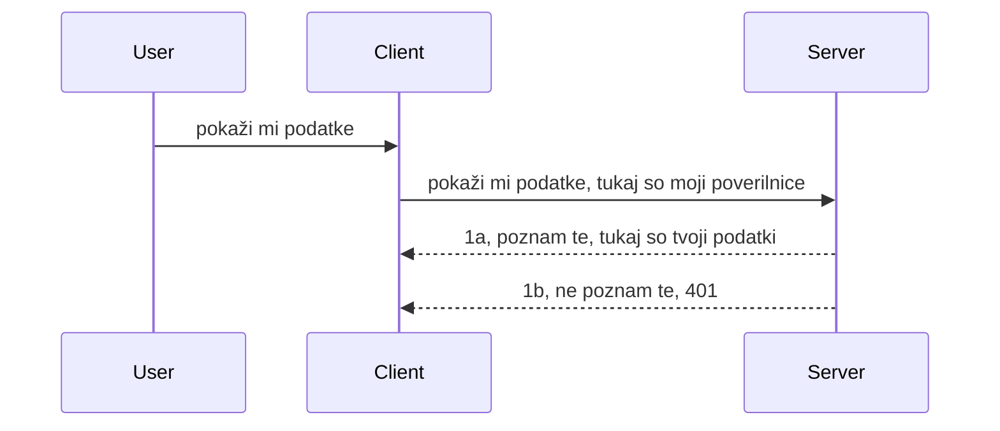

# Enostavna avtentikacija

MCP SDK-ji podpirajo uporabo OAuth 2.1, kar je, resnici na ljubo, precej zapleten proces, ki vključuje koncepte, kot so avtentikacijski strežnik, strežnik z viri, pošiljanje poverilnic, pridobivanje kode, zamenjava kode za žeton nosilca, dokler končno ne dobite podatkov o viru. Če OAuth ni nekaj, na kar ste navajeni (kar je odlična stvar za implementacijo), je dobra ideja začeti z osnovno raven avtentikacije in graditi na boljši in boljši varnosti. Zato ta poglavje obstaja, da vas vodi do bolj napredne avtentikacije.

## Avtentikacija, kaj s tem mislimo?

Avtentikacija je kratica za avtentikacijo in avtorizacijo. Ideja je, da moramo narediti dve stvari:

- **Avtentikacija**, kar je proces ugotavljanja, ali osebi dovolimo vstop v naš dom, torej ali ima pravico biti "tukaj", to je imeti dostop do našega strežnika z viri, kjer živijo naše funkcije MCP strežnika.
- **Avtorizacija**, je proces ugotavljanja, ali bi uporabnik moral imeti dostop do teh specifičnih virov, ki jih zahteva, na primer do teh naročil ali teh izdelkov, ali pa sme brati vsebino, vendar ne brisati, kot drugi primer.

## Poverilnice: kako sistemu povemo, kdo smo

Večina spletnih razvijalcev začne razmišljati v smislu zagotavljanja poverilnice strežniku, običajno skrivnosti, ki pove, ali jim je dovoljeno biti tukaj ("Avtentikacija"). Ta poverilnica je običajno base64 kodirana različica uporabniškega imena in gesla ali API ključ, ki enolično identificira določenega uporabnika.

To vključuje pošiljanje preko glave z imenom "Authorization" tako:

```json
{ "Authorization": "secret123" }
```

To se običajno imenuje osnovna avtentikacija. Celoten potek deluje tako:


```mermaid
sequenceDiagram
   participant User
   participant Client
   participant Server

   User->>Client: pokaži mi podatke
   Client->>Server: pokaži mi podatke, tukaj so moji poverilnice
   Server-->>Client: 1a, poznam te, tukaj so tvoji podatki
   Server-->>Client: 1b, ne poznam te, 401 
```

Zdaj ko razumemo, kako deluje z vidika poteka, kako to izvedemo? Večina spletnih strežnikov ima koncept, imenovan middleware, del kode, ki teče kot del zahteve in lahko preveri poverilnice, in če so poverilnice veljavne, dovoli zahtevi, da gre naprej. Če zahteva nima veljavnih poverilnic, prejmete napako avtentikacije. Poglejmo, kako to lahko izvedemo:

**Python**

```python
class AuthMiddleware(BaseHTTPMiddleware):
    async def dispatch(self, request, call_next):

        has_header = request.headers.get("Authorization")
        if not has_header:
            print("-> Missing Authorization header!")
            return Response(status_code=401, content="Unauthorized")

        if not valid_token(has_header):
            print("-> Invalid token!")
            return Response(status_code=403, content="Forbidden")

        print("Valid token, proceeding...")
       
        response = await call_next(request)
        # dodajte poljubne uporabniške glave ali na nek način spremenite odziv
        return response


starlette_app.add_middleware(CustomHeaderMiddleware)
```

Tukaj imamo:

- Ustvarjen middleware z imenom `AuthMiddleware`, kjer metoda `dispatch` kliče spletni strežnik.
- Middleware dodan spletnemu strežniku:

    ```python
    starlette_app.add_middleware(AuthMiddleware)
    ```

- Napisana logika validacije, ki preverja, ali je prisotna glava Authorization in ali je poslano skrivnost veljavna:

    ```python
    has_header = request.headers.get("Authorization")
    if not has_header:
        print("-> Missing Authorization header!")
        return Response(status_code=401, content="Unauthorized")

    if not valid_token(has_header):
        print("-> Invalid token!")
        return Response(status_code=403, content="Forbidden")
    ```

    če je skrivnost prisotna in veljavna, dovolimo prehod zahteve s klicem `call_next` in vrnemo odgovor.

    ```python
    response = await call_next(request)
    # dodajte poljubne uporabniške glave ali na nek način spremenite odgovor
    return response
    ```

Deluje tako, da če je spletna zahteva poslana strežniku, se middleware sproži in glede na njegovo implementacijo ali dovoli zahtevku prehod ali vrne napako, ki kaže, da stranki ni dovoljeno nadaljevati.

**TypeScript**

Tukaj ustvarimo middleware z priljubljenim ogrodjem Express in prestrežemo zahtevo, preden doseže MCP strežnik. Tukaj je koda za to:

```typescript
function isValid(secret) {
    return secret === "secret123";
}

app.use((req, res, next) => {
    // 1. Ali obstaja avtentikacijski header?
    if(!req.headers["Authorization"]) {
        res.status(401).send('Unauthorized');
    }
    
    let token = req.headers["Authorization"];

    // 2. Preveri veljavnost.
    if(!isValid(token)) {
        res.status(403).send('Forbidden');
    }

   
    console.log('Middleware executed');
    // 3. Posreduje zahtevo naslednjemu koraku v verigi zahtev.
    next();
});
```

V tej kodi:

1. Preverimo, ali je glava Authorization sploh prisotna, če ne, pošljemo napako 401.
2. Zagotovimo, da je poverilnica/žeton veljaven, če ne, pošljemo napako 403.
3. Na koncu pošljemo zahtevo naprej po cevi zahteve in vrnemo zahtevan vir.

## Vaja: Implementirajte avtentikacijo

Vzemimo naše znanje in poskusimo implementirati. Tukaj je načrt:

Strežnik

- Ustvarite spletni strežnik in MCP instanco.
- Implementirajte middleware za strežnik.

Odjemalec

- Pošljite spletno zahtevo s poverilnico preko glave.

### -1- Ustvarite spletni strežnik in MCP instanco

> [!WARNING]
> Spodnji primer TypeScript cilja MCP `2025-11-25`. Sledi prevozom
> preko `mcp-session-id` in ni trenutni primer prevoza `2026-07-28`. MCP
> `2026-07-28` odstrani rokovanje inicializacije in protokol session ID; nove
> implementacije uporabljajo samo-vsebuječe zahteve. Več v
> [Kaj se je spremenilo v MCP: Specifikacija 2026-07-28](../../01-CoreConcepts/mcp-2026-07-28.md).

V prvem koraku moramo ustvariti instanco spletnega strežnika in MCP strežnika.

**Python**

Tukaj ustvarimo MCP strežniško instanco, ustvarimo starlette spletno aplikacijo in jo gostimo z uvicorn.

```python
# ustvarjanje MCP strežnika

app = FastMCP(
    name="MCP Resource Server",
    instructions="Resource Server that validates tokens via Authorization Server introspection",
    host=settings["host"],
    port=settings["port"],
    debug=True
)

# ustvarjanje starlette spletne aplikacije
starlette_app = app.streamable_http_app()

# storitev aplikacije preko uvicorn
async def run(starlette_app):
    import uvicorn
    config = uvicorn.Config(
            starlette_app,
            host=app.settings.host,
            port=app.settings.port,
            log_level=app.settings.log_level.lower(),
        )
    server = uvicorn.Server(config)
    await server.serve()

run(starlette_app)
```

V tej kodi:

- Ustvarimo MCP strežnik.
- Sestavimo starlette spletno aplikacijo iz MCP strežnika, `app.streamable_http_app()`.
- Gostimo in strežemo spletno aplikacijo z uvicorn `server.serve()`.

**TypeScript**

Tukaj ustvarimo MCP strežniško instanco.

```typescript
const server = new McpServer({
      name: "example-server",
      version: "1.0.0"
    });

    // ... nastavite strežniške vire, orodja in pozive ...
```

To ustvarjanje MCP strežnika mora potekati znotraj definicije naše poti POST /mcp, zato vzamemo zgornjo kodo in jo premaknemo tako:

```typescript
import express from "express";
import { randomUUID } from "node:crypto";
import { McpServer } from "@modelcontextprotocol/sdk/server/mcp.js";
import { StreamableHTTPServerTransport } from "@modelcontextprotocol/sdk/server/streamableHttp.js";
import { isInitializeRequest } from "@modelcontextprotocol/sdk/types.js"

const app = express();
app.use(express.json());

// Zemljevid za shranjevanje transportov po ID-ju seje
const transports: { [sessionId: string]: StreamableHTTPServerTransport } = {};

// Obravnavaj POST zahteve za komunikacijo od odjemalca do strežnika
app.post('/mcp', async (req, res) => {
  // Preveri obstoječi ID seje
  const sessionId = req.headers['mcp-session-id'] as string | undefined;
  let transport: StreamableHTTPServerTransport;

  if (sessionId && transports[sessionId]) {
    // Ponovno uporabi obstoječi transport
    transport = transports[sessionId];
  } else if (!sessionId && isInitializeRequest(req.body)) {
    // Nova zahteva za inicializacijo
    transport = new StreamableHTTPServerTransport({
      sessionIdGenerator: () => randomUUID(),
      onsessioninitialized: (sessionId) => {
        // Shrani transport po ID-ju seje
        transports[sessionId] = transport;
      },
      // Zaščita pred DNS ponovnim vezanjem je privzeto onemogočena zaradi združljivosti z preteklimi različicami. Če ta strežnik poganjaš
      // lokalno, poskrbi, da nastaviš:
      // enableDnsRebindingProtection: true,
      // allowedHosts: ['127.0.0.1'],
    });

    // Očisti transport, ko je zaprt
    transport.onclose = () => {
      if (transport.sessionId) {
        delete transports[transport.sessionId];
      }
    };
    const server = new McpServer({
      name: "example-server",
      version: "1.0.0"
    });

    // ... nastavi strežniške vire, orodja in pozive ...

    // Poveži se s strežnikom MCP
    await server.connect(transport);
  } else {
    // Neveljavna zahteva
    res.status(400).json({
      jsonrpc: '2.0',
      error: {
        code: -32000,
        message: 'Bad Request: No valid session ID provided',
      },
      id: null,
    });
    return;
  }

  // Obravnavaj zahtevo
  await transport.handleRequest(req, res, req.body);
});

// Ponovno uporaben obdelovalec za GET in DELETE zahteve
const handleSessionRequest = async (req: express.Request, res: express.Response) => {
  const sessionId = req.headers['mcp-session-id'] as string | undefined;
  if (!sessionId || !transports[sessionId]) {
    res.status(400).send('Invalid or missing session ID');
    return;
  }
  
  const transport = transports[sessionId];
  await transport.handleRequest(req, res);
};

// Obravnavaj GET zahteve za obvestila s strežnika do odjemalca preko SSE
app.get('/mcp', handleSessionRequest);

// Obravnavaj DELETE zahteve za zaključek seje
app.delete('/mcp', handleSessionRequest);

app.listen(3000);
```

Zdaj vidite, kako je bilo ustvarjanje MCP strežnika premaknjeno znotraj `app.post("/mcp")`.

Nadaljujmo s naslednjim korakom ustvarjanja middleware, da bomo lahko preverjali prihajajoče poverilnice.

### -2- Implementirajte middleware za strežnik

Nadaljujmo s delom za middleware. Tukaj bomo ustvarili middleware, ki išče poverilnico v glavi `Authorization` in jo preveri. Če je sprejemljiva, bo zahteva nadaljevala, da bo naredila, kar je treba (npr. naštela orodja, prebrala vir ali karkoli, kar zahteva MCP funkcionalnost).

**Python**

Za ustvarjanje middleware potrebujemo ustvariti razred, ki podeduje `BaseHTTPMiddleware`. Obstajata dve zanimivi stvari:

- Zahteva `request`, iz katere preberemo informacije iz glave.
- `call_next`, klic, ki ga moramo izvesti, če stranka prinese sprejemljivo poverilnico.

Najprej moramo obravnavati primer, če glava `Authorization` manjka:

```python
has_header = request.headers.get("Authorization")

# glava ni prisotna, zavrži z 401, sicer nadaljuj.
if not has_header:
    print("-> Missing Authorization header!")
    return Response(status_code=401, content="Unauthorized")
```

Tukaj pošljemo sporočilo 401 unauthorized, saj stranka ne uspe avtentikacijo.

Nato, če je bila predložena poverilnica, moramo preveriti njeno veljavnost tako:

```python
 if not valid_token(has_header):
    print("-> Invalid token!")
    return Response(status_code=403, content="Forbidden")
```

Opažajte, da zgoraj pošljemo sporočilo 403 forbidden. Poglejmo celoten middleware spodaj, ki izvaja vse, kar smo omenili zgoraj:

```python
class AuthMiddleware(BaseHTTPMiddleware):
    async def dispatch(self, request, call_next):

        has_header = request.headers.get("Authorization")
        if not has_header:
            print("-> Missing Authorization header!")
            return Response(status_code=401, content="Unauthorized")

        if not valid_token(has_header):
            print("-> Invalid token!")
            return Response(status_code=403, content="Forbidden")

        print("Valid token, proceeding...")
        print(f"-> Received {request.method} {request.url}")
        response = await call_next(request)
        response.headers['Custom'] = 'Example'
        return response

```

Super, ampak kaj pa funkcija `valid_token`? Tukaj je spodaj:

```python
# NE uporabljajte v produkciji - izboljšajte to !!
def valid_token(token: str) -> bool:
    # odstranite predpono "Bearer "
    if token.startswith("Bearer "):
        token = token[7:]
        return token == "secret-token"
    return False
```

To bi seveda moralo biti izboljšano.

POMEMBNO: Nikoli ne bi smeli imeti takšnih skrivnosti v kodi. Idealno je, da vrednost za primerjavo pridobite iz podatkovnega vira ali od IDP (ponudnik identitete) ali še bolje, da validation prepustite IDP-ju.

**TypeScript**

Za implementacijo tega s Expressom moramo poklicati metodo `use`, ki sprejema funkcije middleware.

Moramo:

- Komunicirati z objektnim `request`, da preverimo posredovano poverilnico v lastnosti `Authorization`.
- Validirati poverilnico, in če je sprejemljiva, dovoliti zahtevi nadaljevanje in naj MCP zahteva stranke naredi, kar mora (npr. navajanje orodij, branje vira ali karkoli drugega za MCP).

Tukaj preverjamo, ali je glava `Authorization` prisotna, in če ni, ustavimo zahtevo:

```typescript
if(!req.headers["authorization"]) {
    res.status(401).send('Unauthorized');
    return;
}
```

Če glava sploh ni poslana, prejmete napako 401.

Nato preverimo, če je poverilnica veljavna, če ni, ponovno ustavimo zahtevo, a s malo drugačnim sporočilom:

```typescript
if(!isValid(token)) {
    res.status(403).send('Forbidden');
    return;
} 
```

Opazite, da dobite napako 403.

Tukaj je celotna koda:

```typescript
app.use((req, res, next) => {
    console.log('Request received:', req.method, req.url, req.headers);
    console.log('Headers:', req.headers["authorization"]);
    if(!req.headers["authorization"]) {
        res.status(401).send('Unauthorized');
        return;
    }
    
    let token = req.headers["authorization"];

    if(!isValid(token)) {
        res.status(403).send('Forbidden');
        return;
    }  

    console.log('Middleware executed');
    next();
});
```

Nastavili smo spletni strežnik, da sprejme middleware za preverjanje poverilnice, ki naj bi nam jo stranka poslala. Kaj pa sam odjemalec?

### -3- Pošljite spletno zahtevo s poverilnico preko glave

Moramo zagotoviti, da stranka prenese poverilnico preko glave. Ker bomo uporabili MCP odjemalca za to, moramo ugotoviti, kako se to naredi.

**Python**

Za odjemalca moramo posredovati glavo s poverilnico tako:

```python
# NE trdo kodiraj vrednosti, naj bo vsaj v okoljski spremenljivki ali varnejšem shranjevanju
token = "secret-token"

async with streamablehttp_client(
        url = f"http://localhost:{port}/mcp",
        headers = {"Authorization": f"Bearer {token}"}
    ) as (
        read_stream,
        write_stream,
        session_callback,
    ):
        async with ClientSession(
            read_stream,
            write_stream
        ) as session:
            await session.initialize()
      
            # NAREDITI, kaj želite narediti na odjemalcu, npr. seznam orodij, klicanje orodij itd.
```

Opažajte, kako napolnimo lastnost `headers` tako, da damo ` headers = {"Authorization": f"Bearer {token}"}`.

**TypeScript**

To lahko rešimo v dveh korakih:

1. Napolnimo konfiguracijski objekt z našo poverilnico.
2. Posredujemo konfiguracijski objekt transportu.

```typescript

// NE pritrdite vrednosti na trdo, kot je prikazano tukaj. Najmanj, kar lahko storite, je, da jo imate kot spremenljivko okolja in uporabite nekaj takega kot dotenv (v načinu za razvijalce).
let token = "secret123"

// definirajte objekt možnosti transporta za odjemalca
let options: StreamableHTTPClientTransportOptions = {
  sessionId: sessionId,
  requestInit: {
    headers: {
      "Authorization": "secret123"
    }
  }
};

// prenesite objekt možnosti v transport
async function main() {
   const transport = new StreamableHTTPClientTransport(
      new URL(serverUrl),
      options
   );
```

Tukaj zgoraj vidite, kako smo morali ustvariti `options` objekt in naše glave postaviti pod lastnost `requestInit`.

POMEMBNO: Kako pa to izboljšati? Trenutna implementacija ima nekaj težav. Prvič, posredovanje poverilnice na ta način je precej tvegano, razen če imate vsaj HTTPS. Tudi takrat lahko poverilnica ukradena, zato potrebujete sistem, kjer lahko žeton enostavno prekličete in dodate dodatne preverbe, kot je, od kod v svetu prihaja, ali se zahteva dogaja prepogosto (obnašanje kot bot), na kratko, ima veliko varnostnih pomislekov.

Kljub temu pa je za zelo enostavne API-je, kjer nočete, da kdorkoli kliče vaš API brez avtentikacije, to dober začetek.

Zato poskusimo malo okrepiti varnost z uporabo standardiziranega formata, kot je JSON Web Token, znan tudi kot JWT ali "JOT" žetoni.

## JSON Web Tokens, JWT

Torej, poskušamo izboljšati stvari od pošiljanja zelo enostavnih poverilnic. Kakšne so takojšnje izboljšave, ki jih dobimo z uporabo JWT?

- **Izboljšave varnosti**. Pri osnovni avtentikaciji pošiljate uporabniško ime in geslo kot base64 kodiran žeton (ali pošljete API ključ) vedno znova, kar povečuje tveganje. Pri JWT pošljete svoje uporabniško ime in geslo in dobite žeton v zameno, ki je tudi časovno omejen in poteče. JWT vam omogoča enostavno uporabo natančno določenega dostopa z vlogami, obsegom in dovoljenji.
- **Brezstatičnost in skalabilnost**. JWT-ji so samostojni, nosijo vse uporabniške podatke in odpravijo potrebo po strežniškem shranjevanju sej. Žeton je mogoče tudi localno validirati.
- **Medsebojna povezljivost in federacija**. JWT-ji so srce Open ID Connect in se uporabljajo z znanimi ponudniki identitete, kot so Entra ID, Google Identity in Auth0. Prav tako omogočajo enotni prijavi in še veliko več, kar jih naredi podjetniško raven.
- **Modularnost in prilagodljivost**. JWT-ji se lahko uporabljajo tudi z API prehodi, kot so Azure API Management, NGINX in drugi. Podpirajo tudi scenarije avtentikacije in komunikacije strežnik-do-strežnik, vključno z izmestitvijo in delegacijo.
- **Zmogljivost in predpomnjenje**. JWT-je je mogoče predpomniti po dekodiranju, kar zmanjša potrebo po parsiranju. To posebej pomaga aplikacijam z visoko obremenitvijo, saj izboljšuje prepustnost in zmanjšuje obremenitev izbrane infrastrukture.
- **Napredne funkcije**. Prav tako podpirajo introspekcijo (preverjanje veljavnosti na strežniku) in preklic (naredi žeton neveljaven).

Ob vseh teh prednostih poglejmo, kako lahko našo implementacijo ponesemo na višjo raven.

## Pretvorba osnovne avtentikacije v JWT

Torej spremembe, ki jih moramo narediti na splošni ravni, so:

- **Naučiti se sestaviti JWT žeton** in ga pripraviti za pošiljanje od odjemalca do strežnika.
- **Validirati JWT žeton**, in če je veljaven, dovoliti odjemalcu dostop do naših virov.
- **Varno shranjevanje žetonov**. Kako ta žeton shranjujemo.
- **Zaščititi poti**. Potrebujemo zaščito poti, v našem primeru specifične poti in funkcije MCP.
- **Dodati osvežitvene žetone**. Zagotoviti ustvarjanje žetonov z kratko življenjsko dobo, hkrati pa dolgoročne osvežitvene žetone, ki se lahko uporabijo za pridobivanje novih žetonov, če potečejo. Prav tako zagotoviti osvežitveni endpoint in strategijo rotacije.

### -1- Sestavite JWT žeton

Najprej JWT žeton sestavlja sledeče dele:

- **glava (header)**, uporabljen algoritem in tip žetona.
- **vsebina (payload)**, trditve, kot so sub (uporabnik ali entiteta, ki jo žeton predstavlja. V avtentikacijskem scenariju je to običajno uporabniški ID), exp (konec veljavnosti), role (vloga).
- **podpis (signature)**, podpisan z skrivnostjo ali zasebnim ključem.

Za to bomo morali sestaviti glavo, vsebino in kodiran žeton.

**Python**

```python

import jwt
import jwt
from jwt.exceptions import ExpiredSignatureError, InvalidTokenError
import datetime

# Skrivni ključ, uporabljen za podpisovanje JWT
secret_key = 'your-secret-key'

header = {
    "alg": "HS256",
    "typ": "JWT"
}

# informacije o uporabniku ter njegove trditve in čas poteka
payload = {
    "sub": "1234567890",               # Predmet (ID uporabnika)
    "name": "User Userson",                # Po meri določena trditev
    "admin": True,                     # Po meri določena trditev
    "iat": datetime.datetime.utcnow(),# Datum izdaje
    "exp": datetime.datetime.utcnow() + datetime.timedelta(hours=1)  # Datum poteka
}

# kodiraj to
encoded_jwt = jwt.encode(payload, secret_key, algorithm="HS256", headers=header)
```

V zgornji kodi smo:

- Določili glavo, ki uporablja HS256 kot algoritem in tip JWT.
- Sestavili vsebino, ki vsebuje subjekta ali uporabniški ID, uporabniško ime, vlogo, kdaj je bil žeton izdan in kdaj poteče, s tem smo implementirali časovno omejitev, o kateri smo prej govorili.

**TypeScript**

Tukaj bomo potrebovali nekaj odvisnosti, ki nam pomagajo sestaviti JWT žeton.

Odvisnosti

```sh

npm install jsonwebtoken
npm install --save-dev @types/jsonwebtoken
```

Zdaj, ko imamo to, ustvarimo glavo, vsebino in skozi to ustvarimo kodiran žeton.

```typescript
import jwt from 'jsonwebtoken';

const secretKey = 'your-secret-key'; // Uporabi okoljske spremenljivke v produkciji

// Določi vsebino
const payload = {
  sub: '1234567890',
  name: 'User usersson',
  admin: true,
  iat: Math.floor(Date.now() / 1000), // Izdan ob
  exp: Math.floor(Date.now() / 1000) + 60 * 60 // Poteče v 1 uri
};

// Določi glavo (izbirno, jsonwebtoken nastavi privzete vrednosti)
const header = {
  alg: 'HS256',
  typ: 'JWT'
};

// Ustvari žeton
const token = jwt.sign(payload, secretKey, {
  algorithm: 'HS256',
  header: header
});

console.log('JWT:', token);
```

Ta žeton je:

Podpisan s HS256
Veljaven 1 uro
Vključuje trditve kot sub, name, admin, iat in exp.

### -2- Validacija žetona

Potrebovali bomo tudi validirati žeton, kar je nekaj, kar bi morali storiti na strežniku, da zagotovimo, da nam stranka pošilja dejansko veljavne podatke. Obstaja veliko preverjanj, ki jih je treba narediti, od preverjanja strukture do veljavnosti. Spodbuja se tudi dodajanje drugih preverjanj, na primer, ali je uporabnik v vašem sistemu in še več.

Za validacijo žetona ga moramo dekodirati, da ga preberemo, in potem začnemo preverjati njegovo veljavnost:

**Python**

```python

# Dekodirajte in preverite JWT
try:
    decoded = jwt.decode(token, secret_key, algorithms=["HS256"])
    print("✅ Token is valid.")
    print("Decoded claims:")
    for key, value in decoded.items():
        print(f"  {key}: {value}")
except ExpiredSignatureError:
    print("❌ Token has expired.")
except InvalidTokenError as e:
    print(f"❌ Invalid token: {e}")

```


V tej kodi kličemo `jwt.decode` z uporabo žetona, skrivnega ključa in izbranega algoritma kot vhodnih podatkov. Opazite, da uporabljamo konstrukcijo try-catch, saj neuspešna validacija povzroči sprožitev napake.

**TypeScript**

Tukaj moramo klicati `jwt.verify`, da dobimo dekodirano različico žetona, ki jo lahko dodatno analiziramo. Če ta klic ne uspe, to pomeni, da je struktura žetona nepravilna ali da ni več veljavna.

```typescript

try {
  const decoded = jwt.verify(token, secretKey);
  console.log('Decoded Payload:', decoded);
} catch (err) {
  console.error('Token verification failed:', err);
}
```

OPOZORILO: kot je bilo že omenjeno, moramo izvesti dodatne preglede, da zagotovimo, da ta žeton ustreza uporabniku v našem sistemu in zagotoviti, da ima uporabnik pravice, ki jih trdi, da jih ima.

Nadalje si poglejmo upravljanje dostopa, temelječe na vlogah, znano tudi kot RBAC.

## Dodajanje upravljanja dostopa, temelječega na vlogah

Ideja je, da želimo izraziti, da imajo različne vloge različna dovoljenja. Na primer, predpostavimo, da lahko skrbnik naredi vse, običajni uporabnik lahko prebere/pise, gost pa lahko samo bere. Torej, tukaj je nekaj možnih stopenj dovoljenj:

- Admin.Write 
- User.Read
- Guest.Read

Poglejmo, kako lahko takšno upravljanje nadzorujemo z uporabo vmesnih programov (middleware). Vmesni programi se lahko dodajo na posamezne poti pa tudi za vse poti.

**Python**

```python
from starlette.middleware.base import BaseHTTPMiddleware
from starlette.responses import JSONResponse
import jwt

# NE imejte skrivnosti v kodi, kot je ta, je samo za namene demonstracije. Preberite jo z varnega mesta.
SECRET_KEY = "your-secret-key" # to dajte v spremenljivko okolja
REQUIRED_PERMISSION = "User.Read"

class JWTPermissionMiddleware(BaseHTTPMiddleware):
    async def dispatch(self, request, call_next):
        auth_header = request.headers.get("Authorization")
        if not auth_header or not auth_header.startswith("Bearer "):
            return JSONResponse({"error": "Missing or invalid Authorization header"}, status_code=401)

        token = auth_header.split(" ")[1]
        try:
            decoded = jwt.decode(token, SECRET_KEY, algorithms=["HS256"])
        except jwt.ExpiredSignatureError:
            return JSONResponse({"error": "Token expired"}, status_code=401)
        except jwt.InvalidTokenError:
            return JSONResponse({"error": "Invalid token"}, status_code=401)

        permissions = decoded.get("permissions", [])
        if REQUIRED_PERMISSION not in permissions:
            return JSONResponse({"error": "Permission denied"}, status_code=403)

        request.state.user = decoded
        return await call_next(request)


```

Obstaja nekaj različnih načinov za dodajanje vmesnega programa, kot spodaj:

```python

# Alt 1: dodaj middleware med gradnjo starlette aplikacije
middleware = [
    Middleware(JWTPermissionMiddleware)
]

app = Starlette(routes=routes, middleware=middleware)

# Alt 2: dodaj middleware potem, ko je starlette aplikacija že zgrajena
starlette_app.add_middleware(JWTPermissionMiddleware)

# Alt 3: dodaj middleware za vsako pot posebej
routes = [
    Route(
        "/mcp",
        endpoint=..., # upravljalec
        middleware=[Middleware(JWTPermissionMiddleware)]
    )
]
```

**TypeScript**

Uporabimo lahko `app.use` in vmesni program, ki bo deloval za vse zahteve.

```typescript
app.use((req, res, next) => {
    console.log('Request received:', req.method, req.url, req.headers);
    console.log('Headers:', req.headers["authorization"]);

    // 1. Preverite, ali je avtentikacijski glavi poslan

    if(!req.headers["authorization"]) {
        res.status(401).send('Unauthorized');
        return;
    }
    
    let token = req.headers["authorization"];

    // 2. Preverite, ali je žeton veljaven
    if(!isValid(token)) {
        res.status(403).send('Forbidden');
        return;
    }  

    // 3. Preverite, ali uporabnik žetona obstaja v našem sistemu
    if(!isExistingUser(token)) {
        res.status(403).send('Forbidden');
        console.log("User does not exist");
        return;
    }
    console.log("User exists");

    // 4. Preverite, ali ima žeton ustrezna dovoljenja
    if(!hasScopes(token, ["User.Read"])){
        res.status(403).send('Forbidden - insufficient scopes');
    }

    console.log("User has required scopes");

    console.log('Middleware executed');
    next();
});

```

Obstaja kar nekaj stvari, ki jih lahko dovolimo našemu vmesnemu programu in jih NAJ bi opravil, in sicer:

1. Preveri, ali obstaja avtentikacijski header
2. Preveri, ali je žeton veljaven; kličemo `isValid`, metodo, ki smo jo napisali in preverja integriteto ter veljavnost JWT žetona.
3. Preveri, ali uporabnik obstaja v našem sistemu; to moramo preveriti.

   ```typescript
    // uporabniki v podatkovni bazi
   const users = [
     "user1",
     "User usersson",
   ]

   function isExistingUser(token) {
     let decodedToken = verifyToken(token);

     // TODO, preveri, če uporabnik obstaja v podatkovni bazi
     return users.includes(decodedToken?.name || "");
   }
   ```

   Zgoraj smo ustvarili zelo preprosto listo `users`, ki bi morala biti seveda shranjena v podatkovni bazi.

4. Poleg tega moramo preveriti tudi, ali ima žeton ustrezna dovoljenja.

   ```typescript
   if(!hasScopes(token, ["User.Read"])){
        res.status(403).send('Forbidden - insufficient scopes');
   }
   ```

   V zgornji kodi v vmesnem programu preverjamo, ali žeton vsebuje dovoljenje User.Read, če ne, pošljemo napako 403. Spodaj je pomočna metoda `hasScopes`.

   ```typescript
   function hasScopes(scope: string, requiredScopes: string[]) {
     let decodedToken = verifyToken(scope);
    return requiredScopes.every(scope => decodedToken?.scopes.includes(scope));
  }
   ```

Have a think which additional checks you should be doing, but these are the absolute minimum of checks you should be doing.

Using Express as a web framework is a common choice. There are helpers library when you use JWT so you can write less code.

- `express-jwt`, helper library that provides a middleware that helps decode your token.
- `express-jwt-permissions`, this provides a middleware `guard` that helps check if a certain permission is on the token.

Here's what these libraries can look like when used:

```typescript
const express = require('express');
const jwt = require('express-jwt');
const guard = require('express-jwt-permissions')();

const app = express();
const secretKey = 'your-secret-key'; // put this in env variable

// Decode JWT and attach to req.user
app.use(jwt({ secret: secretKey, algorithms: ['HS256'] }));

// Check for User.Read permission
app.use(guard.check('User.Read'));

// multiple permissions
// app.use(guard.check(['User.Read', 'Admin.Access']));

app.get('/protected', (req, res) => {
  res.json({ message: `Welcome ${req.user.name}` });
});

// Error handler
app.use((err, req, res, next) => {
  if (err.code === 'permission_denied') {
    return res.status(403).send('Forbidden');
  }
  next(err);
});

```

Sedaj ste videli, kako se vmesni program lahko uporablja za avtentikacijo in avtorizacijo, kaj pa MCP, ali to spremeni način, kako izvajamo avtentikacijo? Oglejmo si v naslednjem razdelku.

### -3- Dodajanje RBAC v MCP

Do sedaj ste videli, kako lahko dodate RBAC preko vmesnega programa, vendar za MCP ni enostavnega načina za dodajanje RBAC na funkcijo MCP, kaj torej storimo? Preprosto dodamo kodo, kot je ta, ki v tem primeru preverja, ali ima odjemalec pravice do klica določenega orodja:

Imate nekaj različnih možnosti, kako doseči RBAC na nivoju posamezne funkcije, tukaj je nekaj:

- Dodajte preverjanje za vsako orodje, vir, poziv, kjer morate preveriti raven dovoljenj.

   **python**

   ```python
   @tool()
   def delete_product(id: int):
      try:
          check_permissions(role="Admin.Write", request)
      catch:
        pass # odjemalec ni uspel pri pooblaščanju, sproži napako pooblastila
   ```

   **typescript**

   ```typescript
   server.registerTool(
    "delete-product",
    {
      title: Delete a product",
      description: "Deletes a product",
      inputSchema: { id: z.number() }
    },
    async ({ id }) => {
      
      try {
        checkPermissions("Admin.Write", request);
        // Naredi, pošlji ID v productService in oddaljeno vnos
      } catch(Exception e) {
        console.log("Authorization error, you're not allowed");  
      }

      return {
        content: [{ type: "text", text: `Deletected product with id ${id}` }]
      };
    }
   );
   ```


- Uporabite napreden strežniški pristop in obdelovalce zahtev, da zmanjšate število mest, kjer morate izvajati preverjanje.

   **Python**

   ```python
   
   tool_permission = {
      "create_product": ["User.Write", "Admin.Write"],
      "delete_product": ["Admin.Write"]
   }

   def has_permission(user_permissions, required_permissions) -> bool:
      # user_permissions: seznam dovoljenj, ki jih ima uporabnik
      # required_permissions: seznam dovoljenj, potrebnih za orodje
      return any(perm in user_permissions for perm in required_permissions)

   @server.call_tool()
   async def handle_call_tool(
     name: str, arguments: dict[str, str] | None
   ) -> list[types.TextContent]:
    # Predpostavimo, da je request.user.permissions seznam dovoljenj uporabnika
     user_permissions = request.user.permissions
     required_permissions = tool_permission.get(name, [])
     if not has_permission(user_permissions, required_permissions):
        # Sproži napako "Nimate dovoljenja za uporabo orodja {name}"
        raise Exception(f"You don't have permission to call tool {name}")
     # nadaljuj in pokliči orodje
     # ...
   ```   
   

   **TypeScript**

   ```typescript
   function hasPermission(userPermissions: string[], requiredPermissions: string[]): boolean {
       if (!Array.isArray(userPermissions) || !Array.isArray(requiredPermissions)) return false;
       // Vrni true, če ima uporabnik vsaj eno zahtevano dovoljenje
       
       return requiredPermissions.some(perm => userPermissions.includes(perm));
   }
  
   server.setRequestHandler(CallToolRequestSchema, async (request) => {
      const { params: { name } } = request;
  
      let permissions = request.user.permissions;
  
      if (!hasPermission(permissions, toolPermissions[name])) {
         return new Error(`You don't have permission to call ${name}`);
      }
  
      // nadaljuj..
   });
   ```

   Opomba, morate zagotoviti, da vaš vmesni program dodeli dekodiran žeton lastnosti uporabnika v zahtevi, da je zgornja koda enostavna in berljiva.

### Povzetek

Zdaj, ko smo razpravljali o tem, kako splošno in za MCP posebej dodati podporo za RBAC, je čas, da poskusite sami implementirati varnost, da boste zagotovili, da ste razumeli predstavljene koncepte.

## Naloga 1: Ustvarite MCP strežnik in MCP odjemalca z osnovno avtentikacijo

Tukaj boste uporabili, kar ste se naučili o pošiljanju poverilnic prek headerjev.

## Rešitev 1

[Rešitev 1](./code/basic/README.md)

## Naloga 2: Nadgradite rešitev iz Naloge 1 z uporabo JWT

Vzemite prvo rešitev, a tokrat jo izboljšajte.

Namesto Basic Auth uporabite JWT.

## Rešitev 2

[Rešitev 2](./solution/jwt-solution/README.md)

## Izziv

Dodajte RBAC na nivoju orodja, kot smo opisali v razdelku "Dodajanje RBAC v MCP".

## Povzetek

Upamo, da ste se v tem poglavju veliko naučili, od popolne odsotnosti varnosti, do osnovne varnosti, do JWT in kako ga dodati MCP.

Zgradili smo trdne temelje s prilagojenimi JWT, vendar ko se širimo, prehajamo k modelu identitete, ki temelji na standardih. Sprejetje IdP, kot sta Entra ali Keycloak, nam omogoča izločitev izdaje, validacije in upravljanja življenjske dobe žetonov na zaupanja vredni platformi — kar nam osvobodi roke za osredotočanje na logiko aplikacije in uporabniško izkušnjo.

Za to imamo še bolj [napredno poglavje o Entri](../../05-AdvancedTopics/mcp-security-entra/README.md)

## Kaj sledi

- Naslednje: [Nastavitev MCP gostiteljev](../12-mcp-hosts/README.md)

---

<!-- CO-OP TRANSLATOR DISCLAIMER START -->
**Omejitev odgovornosti**:
Ta dokument je bil preveden z uporabo AI prevajalske storitve [Co-op Translator](https://github.com/Azure/co-op-translator). Čeprav si prizadevamo za natančnost, vas prosimo, da upoštevate, da avtomatizirani prevodi lahko vsebujejo napake ali netočnosti. Izvirni dokument v njegovem izvirnem jeziku je treba obravnavati kot avtoritativni vir. Za kritične informacije je priporočljiv strokovni človeški prevod. Ne odgovarjamo za morebitna nesporazume ali napačne interpretacije, ki izhajajo iz uporabe tega prevoda.
<!-- CO-OP TRANSLATOR DISCLAIMER END -->