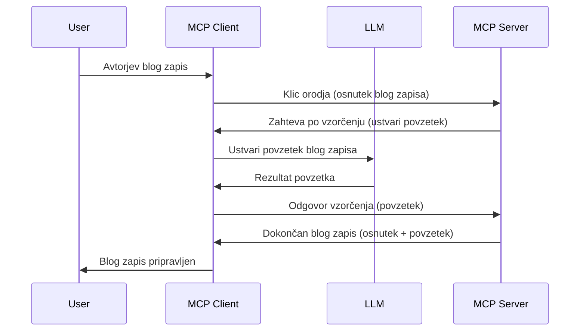

> [!WARNING]
> Vzorcevanje je v MCP `2026-07-28` zastarelo. Ta lekcija je ohranjena za
> starodobne izvedbe. Novi strežniki naj se neposredno povežejo z API ponudnika LLM.


# Vzorcevanje - prenašanje funkcij na klienta

> Vzorcevanje ostaja v specifikaciji `2026-07-28` zaradi združljivosti in je
> upravičeno do odstranitve ob prvi reviziji, izdani na današnji dan ali po 28.
> juliju 2027. Primeri v tej lekciji lahko uporabljajo SDK API-je, ki implementirajo `2025-11-25`.
> Glej [Kaj se je spremenilo v MCP: Specifikacija 2026-07-28](../../01-CoreConcepts/mcp-2026-07-28.md).

V starodobnih izvedbah omogoča Vzorcevanje MCP strežniku, da zaprosi za pomoč LLM
, ki ga upravlja klient. Za nove izvedbe raje kličite izbranega ponudnika LLM
neposredno.

Raziščimo nekaj primerov uporabe in kako sestaviti rešitev, ki vključuje vzorcevanje.

## Pregled

V tej lekciji se osredotočimo na razlago, kdaj in kje uporabljati Vzorcevanje in kako ga nastaviti.

## Cilji učenja

V tem poglavju bomo:

- Razložili, kaj je Vzorcevanje in kdaj ga uporabiti.
- Pokažemo, kako nastaviti Vzorcevanje v MCP.
- Podali primere uporabe Vzorcevanja v praksi.

## Kaj je Vzorcevanje in zakaj ga uporabljati?

Vzorcevanje je napredna funkcionalnost, ki deluje na naslednji način:



### Zahteva za vzorcevanje

Ok, zdaj ko imamo širok pogled na verjeten scenarij, poglejmo zahtevo za vzorcevanje, ki jo strežnik pošlje klientu. Takšna zahteva v formatu JSON-RPC je videti takole:

```json
{
  "jsonrpc": "2.0",
  "id": 1,
  "method": "sampling/createMessage",
  "params": {
    "messages": [
      {
        "role": "user",
        "content": {
          "type": "text",
          "text": "Create a blog post summary of the following blog post: <BLOG POST>"
        }
      }
    ],
    "modelPreferences": {
      "hints": [
        {
          "name": "claude-3-sonnet"
        }
      ],
      "intelligencePriority": 0.8,
      "speedPriority": 0.5
    },
    "systemPrompt": "You are a helpful assistant.",
    "maxTokens": 100
  }
}
```

Tu je nekaj opozoril:

- Poziv (prompt) v vsebini -> besedilo je naš poziv, ki je navodilo LLM, naj povzame vsebino blog prispevka.

- **modelPreferences**. Ta del je ravno to, priporočilo, kaj konfigurirati v LLM. Uporabnik se lahko odloči, ali sledi tem priporočilom ali jih spremeni. V tem primeru so priporočila glede modela, hitrosti in prioritete inteligence.
- **systemPrompt**, to je vaš običajen sistemski poziv, ki daje LLM osebnost in vsebuje navodila.
- **maxTokens**, lastnost, ki pove, koliko žetonov se priporoča uporabiti za to nalogo.

### Odgovor na vzorcevanje

Ta odgovor pošlje MCP klient nazaj MCP strežniku in je rezultat klica LLM-ja, čakanja na odgovor in nato sestave tega sporočila. Tako izgleda v formatu JSON-RPC:

```json
{
  "jsonrpc": "2.0",
  "id": 1,
  "result": {
    "role": "assistant",
    "content": {
      "type": "text",
      "text": "Here's your abstract <ABSTRACT>"
    },
    "model": "gpt-5",
    "stopReason": "endTurn"
  }
}
```

Opazite, da je odgovor povzetek blog prispevka, točno kot smo zahtevali. Prav tako opazite, da uporabljen model ni tisti, za katerega smo prosili, ampak "gpt-5" namesto "claude-3-sonnet". To ilustrira, da uporabnik lahko spremeni odločitev o uporabi in da je vaša zahteva za vzorcevanje priporočilo.

Ok, zdaj ko razumemo glavni potek in koristno nalogo za to "ustvarjanje blog prispevkov + povzetek", poglejmo, kaj moramo storiti, da bo delovalo.

### Vrste sporočil

Sporočila za vzorcevanje niso omejena le na besedilo, lahko pošljete tudi slike in zvočne datoteke. Tako JSON-RPC izgleda drugače:

**Besedilo**

```json
{
  "type": "text",
  "text": "The message content"
}
```

**Vsebina slike**

```json
{
  "type": "image",
  "data": "base64-encoded-image-data",
  "mimeType": "image/jpeg"
}
```

**Zvočna vsebina**

```json
{
  "type": "audio",
  "data": "base64-encoded-audio-data",
  "mimeType": "audio/wav"
}
```

> OPOMBA: Za trenutni status in navodila za migracijo glejte
> [zastarelo dokumentacijo o vzorcevanju](https://modelcontextprotocol.io/specification/2026-07-28/client/sampling).

## Kako nastaviti Vzorcevanje v klientu

> Opomba: če gradite samo strežnik, tukaj ne potrebujete veliko narediti.

V klientu morate funkcijo nastaviti tako:

```json
{
  "capabilities": {
    "sampling": {}
  }
}
```

To bo upoštevano, ko se vaš izbrani klient poveže s strežnikom.

## Primer vzorcevanja v praksi - Ustvarjanje blog prispevka

Skupaj napišimo vzorcevalni strežnik, potrebujemo narediti naslednje:

1. Ustvariti orodje na strežniku.
1. To orodje naj ustvari zahtevo za vzorcevanje.
1. Orodje naj počaka na odgovor na zahtevo za vzorcevanje klienta.
1. Nato naj se ustvari rezultat orodja.

Poglejmo kodo korak za korakom:

### -1- Ustvari orodje

**python**

```python
@mcp.tool()
async def create_blog(title: str, content: str, ctx: Context[ServerSession, None]) -> str:
    """Create a blog post and generate a summary"""

```

### -2- Ustvari zahtevo za vzorcevanje

Razširite orodje z naslednjo kodo:

**python**

```python
post = BlogPost(
        id=len(posts) + 1,
        title=title,
        content=content,
        abstract=""
    )

prompt = f"Create an abstract of the following blog post: title: {title} and draft: {content} "

result = await ctx.session.create_message(
        messages=[
            SamplingMessage(
                role="user",
                content=TextContent(type="text", text=prompt),
            )
        ],
        max_tokens=100,
)

```

### -3- Počakaj na odgovor in vrni odgovor

**python**

```python
post.abstract = result.content.text

posts.append(post)

# vrni končni izdelek
return json.dumps({
    "id": post.title,
    "abstract": post.abstract
})
```

### -4- Celotna koda

**python**

```python
from starlette.applications import Starlette
from starlette.routing import Mount, Host

from mcp.server.fastmcp import Context, FastMCP

from mcp.server.session import ServerSession
from mcp.types import SamplingMessage, TextContent

import json


from uuid import uuid4
from typing import List
from pydantic import BaseModel


mcp = FastMCP("Blog post generator")

# app = FastAPI()

posts = []

class BlogPost(BaseModel):
    id: int
    title: str
    content: str
    abstract: str

posts: List[BlogPost] = []

@mcp.tool()
async def create_blog(title: str, content: str, ctx: Context[ServerSession, None]) -> str:
    """Create a blog post and generate a summary"""

    post = BlogPost(
        id=len(posts) + 1,
        title=title,
        content=content,
        abstract=""
    )

    prompt = f"Create an abstract of the following blog post: title: {title} and draft: {content} "

    result = await ctx.session.create_message(
        messages=[
            SamplingMessage(
                role="user",
                content=TextContent(type="text", text=prompt),
            )
        ],
        max_tokens=100,
    )

    post.abstract = result.content.text

    posts.append(post)

    # vrni celoten blog objavo
    return json.dumps({
        "id": post.title,
        "abstract": post.abstract
    })

if __name__ == "__main__":
    print("Starting server...")
    # mcp.run()
    mcp.run(transport="streamable-http")

# zaženi aplikacijo z: python server.py
```

### -5- Testiranje v Visual Studio Code

Za testiranje v Visual Studio Code naredite naslednje:

1. Zaženite strežnik v terminalu
1. Dodajte ga v *mcp.json* (in zagotovite, da se zažene), npr. nekaj takega:

   ```json
   "servers": {
      "blog-server": {
        "type": "http",
        "url": "http://localhost:8000/mcp"
      }
   }
   ```

1. Vnesite poziv:

   ```text
   create a blog post named "Where Python comes from", the content is "Python is actually named after Monty Python Flying Circus"
   ```

1. Dovolite vzorcevanje. Ob prvem testu boste prejeli dodatno pogovorno okno, ki ga morate sprejeti, nato pa se prikaže običajno okno z prošnjo za zagon orodja.

1. Preverite rezultate. Rezultate boste videli lepo prikazane v GitHub Copilot Chat, lahko pa tudi pregledate surovi JSON odgovor.

**Bonus**. Orodja Visual Studio Code odlično podpirajo vzorcevanje. Dostop do vzorcevanja na vašem nameščenem strežniku lahko konfigurirate tako:

1. Pojdite v razdelek z razširitvami.
1. Izberite ikono zobnika za vaš nameščeni strežnik v razdelku "MCP SERVERS - INSTALLED".
1 Izberite "Configure Model Access", kjer lahko izbirate, katere modele lahko GitHub Copilot uporablja pri vzorcevanju. Prav tako lahko vidite vse zadnje zahteve za vzorcevanje s klikom na "Show Sampling requests".

## Naloga

V tej nalogi boste zgradili nekoliko drugačno vzorcevanje, namreč integracijo vzorcevanja, ki podpira generiranje opisa izdelka. Tu je vaš scenarij:

**Scenarij**: delavec v administraciji na e-trgovini potrebuje pomoč, saj ustvarjanje opisov izdelkov traja predolgo. Zato morate zgraditi rešitev, kjer lahko pokličete orodje "create_product" s parametri "title" in "keywords", ki naj generira celoten izdelek vključno z poljem "description", ki naj bo napolnjeno z LLM klienta.

NAMIG: uporabite prej naučeno, da sestavite ta strežnik in njegovo orodje z uporabo zahteve za vzorcevanje.

## Rešitev

[Rešitev](./solution/README.md)

## Ključne ugotovitve

Vzorcevanje je močna funkcija, ki strežniku omogoča, da delegira naloge klientu, kadar potrebuje pomoč LLM.

## Kaj sledi

- [Poglavje 4 - Praktična implementacija](../../04-PracticalImplementation/README.md)

---

<!-- CO-OP TRANSLATOR DISCLAIMER START -->
**Omejitev odgovornosti**:
Ta dokument je bil preveden z uporabo AI prevajalske storitve [Co-op Translator](https://github.com/Azure/co-op-translator). Čeprav si prizadevamo za natančnost, vas prosimo, da upoštevate, da avtomatizirani prevodi lahko vsebujejo napake ali netočnosti. Izvirni dokument v njegovem izvirnem jeziku je treba obravnavati kot avtoritativni vir. Za kritične informacije je priporočljiv strokovni človeški prevod. Ne odgovarjamo za morebitna nesporazume ali napačne interpretacije, ki izhajajo iz uporabe tega prevoda.
<!-- CO-OP TRANSLATOR DISCLAIMER END -->