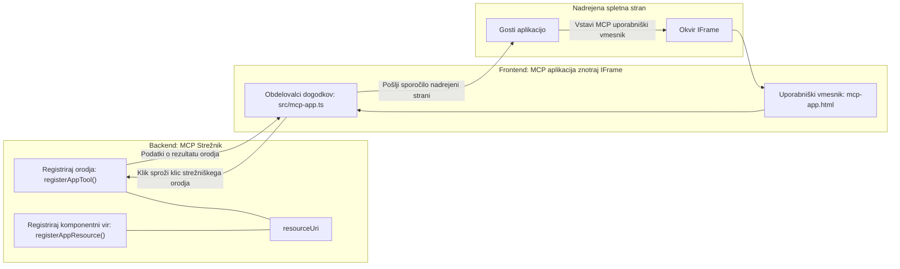
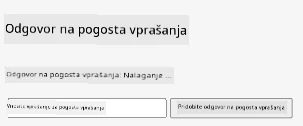
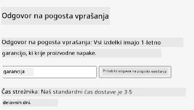
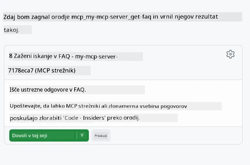
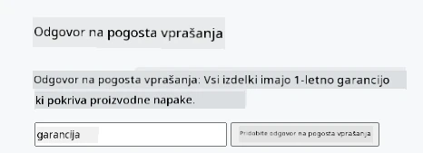

# MCP aplikacije

MCP aplikacije so nov način v MCP. Ideja je, da ne le odzovete z podatki nazaj iz klica orodja, ampak tudi zagotovite informacije o tem, kako naj se s temi informacijami upravlja. To pomeni, da lahko rezultati orodij zdaj vsebujejo informacije o uporabniškem vmesniku. Zakaj bi to želeli? No, razmislite, kako stvari počnete danes. Verjetno porabljate rezultate MCP strežnika tako, da pred njim postavite neko vrsto uporabniškega vmesnika, kar je koda, ki jo morate napisati in vzdrževati. Včasih je to, kar želite, vendar bi bilo včasih super, če bi lahko samo prinesli kos informacij, ki je samostojen in vsebuje vse od podatkov do uporabniškega vmesnika.

## Pregled

Ta lekcija ponuja praktične napotke o MCP aplikacijah, kako začeti z njimi in kako jih integrirati v vaše obstoječe spletne aplikacije. MCP aplikacije so zelo nov dodatek MCP standardu.

## Cilji učenja

Na koncu te lekcije boste znali:

- Pojasniti, kaj so MCP aplikacije.
- Kdaj uporabiti MCP aplikacije.
- Zgraditi in integrirati svoje MCP aplikacije.

## MCP aplikacije - kako delujejo

Ideja MCP aplikacij je zagotoviti odziv, ki je v bistvu komponenta za prikaz. Takšna komponenta lahko vsebuje tako vizualne kot interaktivne elemente, npr. klike na gumbe, vnos uporabnika in več. Začnimo s strežniško stranjo in našim MCP strežnikom. Za ustvarjanje MCP App komponente potrebujete ustvariti orodje in tudi aplikacijski vir. Ti dve polovici sta povezani z resourceUri.

Tukaj je primer. Poskusimo si vizualizirati, kaj je vključeno in katera dela kaj:

```text
server.ts -- responsible for registering tools and the component as a UI component
src/
  mcp-app.ts -- wiring up event handlers
mcp-app.html -- the user interface
```
  
Ta vizualni prikaz opisuje arhitekturo za ustvarjanje komponente in njeno logiko.


Poskusimo opisati odgovornosti za backend in frontend.

### Backend

Tu moramo doseči dve stvari:

- Registrirati orodja, s katerimi želimo delati.
- Definirati komponento.

**Registracija orodja**

```typescript
registerAppTool(
    server,
    "get-time",
    {
      title: "Get Time",
      description: "Returns the current server time.",
      inputSchema: {},
      _meta: { ui: { resourceUri } }, // Poveže orodje z njegovo UI zasnovo
    },
    async () => {
      const time = new Date().toISOString();
      return { content: [{ type: "text", text: time }] };
    },
  );

```
  
Zgornja koda opisuje vedenje, kjer razkriva orodje z imenom `get-time`. Ne potrebuje vhodov, ampak na koncu vrne trenutni čas. Imamo možnost definirati `inputSchema` za orodja, kjer moramo sprejeti uporabniški vnos.

**Registracija komponente**

V isti datoteki moramo registrirati tudi komponento:

```typescript
const resourceUri = "ui://get-time/mcp-app.html";

// Registrirajte vir, ki vrača združeno HTML/JavaScript za uporabniški vmesnik.
registerAppResource(
  server,
  resourceUri,
  resourceUri,
  { mimeType: RESOURCE_MIME_TYPE },
  async () => {
    const html = await fs.readFile(path.join(DIST_DIR, "mcp-app.html"), "utf-8");

    return {
    contents: [
        { uri: resourceUri, mimeType: RESOURCE_MIME_TYPE, text: html },
    ],
    };
  },
);
```
  
Opazite, kako omenjamo `resourceUri` za povezavo komponente z njenimi orodji. Zanimiv je tudi povratni klic, kjer naložimo UI datoteko in vrnemo komponento.

### Frontend komponente

Tako kot backend, imata tudi frontend dve deli:

- Frontend, napisan v čistem HTML.
- Kodo, ki obravnava dogodke in kaj narediti, npr. klic orodij ali sporočanje nadrejenemu oknu.

**Uporabniški vmesnik**

Poglejmo si uporabniški vmesnik.

```html
<!-- mcp-app.html -->
<!DOCTYPE html>
<html lang="en">
  <head>
    <meta charset="UTF-8" />
    <title>Get Time App</title>
  </head>
  <body>
    <p>
      <strong>Server Time:</strong> <code id="server-time">Loading...</code>
    </p>
    <button id="get-time-btn">Get Server Time</button>
    <script type="module" src="/src/mcp-app.ts"></script>
  </body>
</html>
```
  
**Povezovanje dogodkov**

Zadnji del je povezava dogodkov. To pomeni, da identificiramo dele v našem UI, ki potrebujejo upravljavce dogodkov, in kaj storiti, če pride do dogodkov:

```typescript
// mcp-app.ts

import { App } from "@modelcontextprotocol/ext-apps";

// Pridobi reference elementov
const serverTimeEl = document.getElementById("server-time")!;
const getTimeBtn = document.getElementById("get-time-btn")!;

// Ustvari instanco aplikacije
const app = new App({ name: "Get Time App", version: "1.0.0" });

// Obdelaj rezultate orodij s strežnika. Nastavi pred `app.connect()`, da preprečiš
// zamujanje začetnega rezultata orodja.
app.ontoolresult = (result) => {
  const time = result.content?.find((c) => c.type === "text")?.text;
  serverTimeEl.textContent = time ?? "[ERROR]";
};

// Poveži klik gumba
getTimeBtn.addEventListener("click", async () => {
  // `app.callServerTool()` omogoča vmesniku, da zahteva sveže podatke s strežnika
  const result = await app.callServerTool({ name: "get-time", arguments: {} });
  const time = result.content?.find((c) => c.type === "text")?.text;
  serverTimeEl.textContent = time ?? "[ERROR]";
});

// Poveži se na gostitelja
app.connect();
```
  
Kot vidite zgoraj, je to običajna koda za povezovanje elementov DOM z dogodki. Vredno izpostaviti je klic `callServerTool`, ki na koncu kliče orodje na back-endu.

## Obdelava uporabniškega vnosa

Do zdaj smo videli komponento z gumbom, ki ob kliku kliče orodje. Poglejmo, ali lahko dodamo še več UI elementov, npr. vhodno polje, in pošljemo argumente orodju. Implementirajmo funkcionalnost FAQ. Tako naj bi delovalo:

- Na voljo morata biti gumb in vhodni element, kjer uporabnik vnese ključne besede za iskanje, npr. "Shipping". To požene orodje na backendu, ki išče v FAQ podatkih.
- Orodje, ki podpira omenjeno FAQ iskanje.

Najprej dodajmo potrebno podporo na backendu:

```typescript
const faq: { [key: string]: string } = {
    "shipping": "Our standard shipping time is 3-5 business days.",
    "return policy": "You can return any item within 30 days of purchase.",
    "warranty": "All products come with a 1-year warranty covering manufacturing defects.",
  }

registerAppTool(
    server,
    "get-faq",
    {
      title: "Search FAQ",
      description: "Searches the FAQ for relevant answers.",
      inputSchema: zod.object({
        query: zod.string().default("shipping"),
      }),
      _meta: { ui: { resourceUri: faqResourceUri } }, // Poveže to orodje z njegovim UI virom
    },
    async ({ query }) => {
      const answer: string = faq[query.toLowerCase()] || "Sorry, I don't have an answer for that.";
      return { content: [{ type: "text", text: answer }] };
    },
  );
```
  
Tu vidimo, kako napolnimo `inputSchema` in mu damo `zod` shemo, kot sledi:

```typescript
inputSchema: zod.object({
  query: zod.string().default("shipping"),
})
```
  
V zgornji shemi deklariramo vhodni parameter `query`, ki je neobvezen z privzeto vrednostjo "shipping".

V redu, gremo naprej v *mcp-app.html*, da vidimo, kakšen UI moramo ustvariti:

```html
<div class="faq">
    <h1>FAQ response</h1>
    <p>FAQ Response: <code id="faq-response">Loading...</code></p>
    <input type="text" id="faq-query" placeholder="Enter FAQ query" />
    <button id="get-faq-btn">Get FAQ Response</button>
  </div>
```
  
Odlično, zdaj imamo vhodni element in gumb. Nato pojdimo v *mcp-app.ts*, da povežemo te dogodke:

```typescript
const getFaqBtn = document.getElementById("get-faq-btn")!;
const faqQueryInput = document.getElementById("faq-query") as HTMLInputElement;

getFaqBtn.addEventListener("click", async () => {
  const query = faqQueryInput.value;
  const result = await app.callServerTool({ name: "get-faq", arguments: { query } });
  const faq = result.content?.find((c) => c.type === "text")?.text;
  faqResponseEl.textContent = faq ?? "[ERROR]";
});
```
  
V zgornji kodi mi:

- Ustvarimo reference na zanimive UI elemente.
- Obdelamo klik gumba, da preberemo vrednost vhodnega elementa in pokličemo `app.callServerTool()` z `name` in `arguments`, kjer slednji posreduje `query` kot vrednost.

Kaj pravzaprav naredi `callServerTool`: pošlje sporočilo nadrejenemu oknu, ki nato kliče MCP strežnik.

### Poskusite sami

Če to poskusite, bi morali videti naslednje:

  

in tukaj poskus z vhodom, kot je "warranty":

  

Za zagon te kode pojdite v [kodo](./code/README.md)

## Testiranje v Visual Studio Code

Visual Studio Code ima odlično podporo za MVP aplikacije in je verjetno en izmed najlažjih načinov za testiranje vaših MCP aplikacij. Za uporabo Visual Studio Code dodajte v *mcp.json* zapis strežnika, kot sledi:

```json
"my-mcp-server-7178eca7": {
    "url": "http://localhost:3001/mcp",
    "type": "http"
  }
```
  
Nato zaženite strežnik, lahko komunicirate z MCP aplikacijo prek okna za klepet, če imate nameščen GitHub Copilot.

S tem sprožite ukaz prek poziva, npr. "#get-faq":

  

In tako, kot če bi ga zagnali v spletnem brskalniku, se prikazuje enako:

  

## Nalog

Ustvarite igro kamen, škarje, papir. Sestavljati naj jo bo naslednje:

UI:

- spustni seznam z možnostmi
- gumb za oddajo izbire
- oznaka, ki prikazuje, kdo je kaj izbral in kdo je zmagal

Strežnik:

- naj ima orodje kamen, papir, škarje, ki kot vnos sprejme "choice". Prav tako nariše računalnikovo izbiro in določi zmagovalca

## Rešitev

[Rešitev](./assignment/README.md)

## Povzetek

Naučili smo se o novem načinu MCP aplikacij. To je nov način, ki omogoča MCP strežnikom, da imajo mnenje ne le o podatkih, ampak tudi o tem, kako naj se podatki predstavijo.

Poleg tega smo izvedeli, da so te MCP aplikacije gostovane v IFrame in da za komunikacijo z MCP strežniki pošiljajo sporočila nadrejeni spletni aplikaciji. Obstaja več knjižnic tako za čisti JavaScript kot React in druge, ki to komunikacijo olajšajo.

## Ključne ugotovitve

Tukaj je, kar ste se naučili:

- MCP aplikacije so nov standard, uporaben, kadar želite poslati tako podatke kot funkcije uporabniškega vmesnika.
- Takšne aplikacije tečejo v IFrame zaradi varnostnih razlogov.

## Kaj sledi

- [Poglavje 4](../../04-PracticalImplementation/README.md)

---

<!-- CO-OP TRANSLATOR DISCLAIMER START -->
**Omejitev odgovornosti**:
Ta dokument je bil preveden z uporabo AI prevajalske storitve [Co-op Translator](https://github.com/Azure/co-op-translator). Čeprav si prizadevamo za natančnost, prosimo, upoštevajte, da lahko avtomatizirani prevodi vsebujejo napake ali netočnosti. Izvirni dokument v njegovem matičnem jeziku velja za avtoritativni vir. Za ključne informacije priporočamo strokovni človeški prevod. Nismo odgovorni za morebitna nesporazumevanja ali napačne interpretacije, ki izhajajo iz uporabe tega prevoda.
<!-- CO-OP TRANSLATOR DISCLAIMER END -->