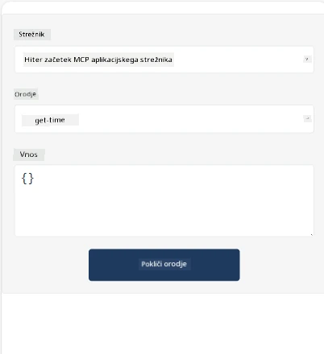
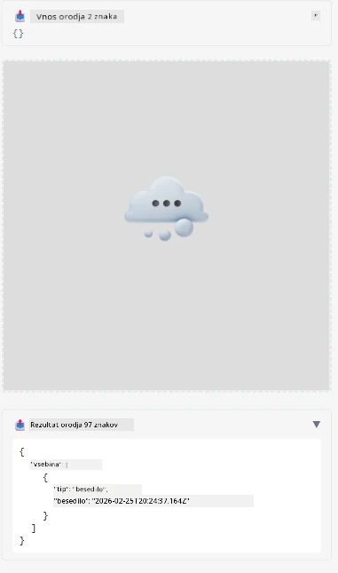

Tukaj je primer, ki prikazuje MCP aplikacijo

## Namestitev

1. Pojdite v mapo *mcp-app*
1. Zaženite `npm install`, to bo namestilo odvisnosti za frontend in backend

Preverite, da se backend prevede z zagonom:

```sh
npx tsc --noEmit
```

Če je vse v redu, ne bi smelo biti nobenega izpisa.

## Zagon backend-a

> To zahteva nekaj dodatnega dela, če uporabljate računalnik z Windows, saj rešitev MCP Apps uporablja knjižnico `concurrently` za zagon, za katero morate najti nadomestilo. Tukaj je sporna vrstica v *package.json* MCP aplikacije:

    ```json
    "start": "concurrently \"cross-env NODE_ENV=development INPUT=mcp-app.html vite build --watch\" \"tsx watch main.ts\""
    ```

Ta aplikacija ima dve komponenti, backend del in gostiteljski del.

Zaženite backend z ukazom:

```sh
npm start
```

To bi moralo zagnati backend na `http://localhost:3001/mcp`.

> Opomba, če uporabljate Codespace, boste morda morali nastaviti vidnost vrat na javno. Preverite, ali lahko dosegate konec v brskalniku preko https://<ime Codespace>.app.github.dev/mcp

## Možnost 1 - Preskusite aplikacijo v Visual Studio Code

Za testiranje rešitve v Visual Studio Code naredite naslednje:

- Dodajte zapis strežnika v `mcp.json` tako:

    ```json
    {
        "servers": {
            "my-mcp-server-7178eca7": {
                "url": "http://localhost:3001/mcp",
                "type": "http"
            }
        },
        "inputs": []
    }
    ```

1. Kliknite gumb "start" v *mcp.json*
1. Prepričajte se, da je odprto klepetalno okno in vpišite `get-faq`, videli bi morali rezultat, kot je ta:

    

## Možnost 2 - Preizkusite aplikacijo z gostiteljem

Repozitorij <https://github.com/modelcontextprotocol/ext-apps> vsebuje več različnih gostiteljev, ki jih lahko uporabite za testiranje vaših MVP aplikacij.

Predstavljamo vam dve različni možnosti:

### Lokalni računalnik

- Pojdite v mapo *ext-apps*, potem ko ste klonirali repozitorij.

- Namestite odvisnosti

   ```sh
   npm install
   ```

- V ločenem terminalskem oknu pojdite v *ext-apps/examples/basic-host*

    > Če uporabljate Codespace, morate odpreti datoteko serve.ts na vrstici 27 in zamenjati http://localhost:3001/mcp z URL-jem vašega Codespace za backend, na primer https://psychic-xylophone-657rpjgvxpc5g64-3001.app.github.dev/mcp

- Zaženite gostitelja:

    ```sh
    npm start
    ```

    To bi moralo povezati gostitelja z backendom in prikazati aplikacijo, ki teče tako:

    

### Codespace

Za uporabo okolja Codespace je potrebno nekaj dodatnega dela. Če želite uporabiti gostitelja preko Codespace:

- Pojdite v imenik *ext-apps* in se premaknite v *examples/basic-host*.
- Zaženite `npm install` za namestitev odvisnosti
- Zaženite `npm start` za zagon gostitelja.

## Preizkusite aplikacijo

Preizkusite aplikacijo na naslednji način:

- Izberite gumb "Call Tool" in videli boste rezultate tako:

    

Super, vse deluje.

---

<!-- CO-OP TRANSLATOR DISCLAIMER START -->
**Omejitev odgovornosti**:  
Ta dokument je bil preveden z uporabo AI prevajalske storitve [Co-op Translator](https://github.com/Azure/co-op-translator). Čeprav si prizadevamo za natančnost, upoštevajte, da avtomatizirani prevodi lahko vsebujejo napake ali netočnosti. Izvirni dokument v njegovem maternem jeziku velja za avtoritativni vir. Za kritične informacije je priporočljivo uporabiti profesionalen človeški prevod. Nismo odgovorni za morebitna nesporazume ali napačne interpretacije, ki izhajajo iz uporabe tega prevoda.
<!-- CO-OP TRANSLATOR DISCLAIMER END -->