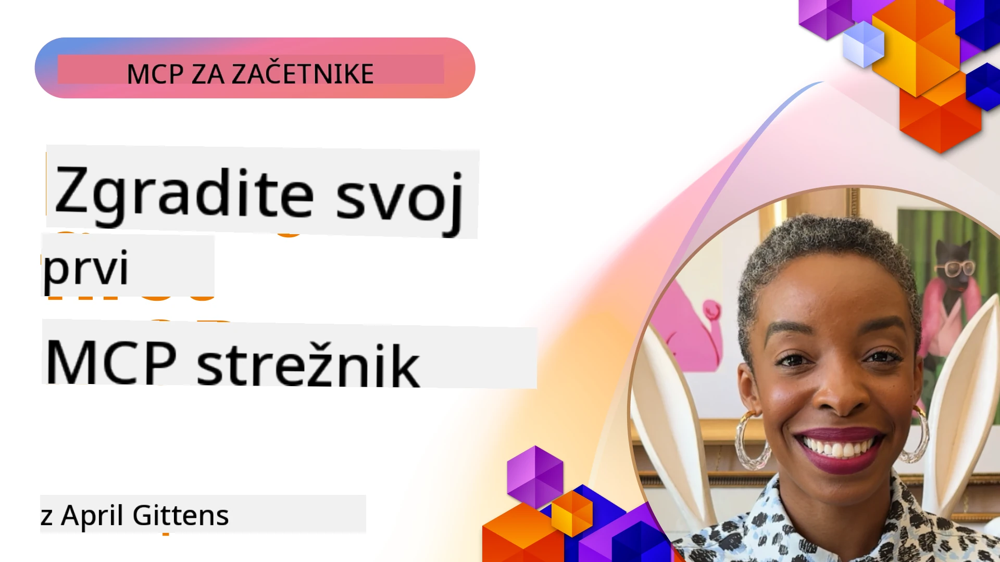

## Začetek  

_(Kliknite na sliko zgoraj, da si ogledate video te lekcije)_

Ta razdelek sestavlja več lekcij:

- **1 Vaš prvi strežnik**, v tej prvi lekciji se boste naučili, kako ustvariti svoj prvi strežnik in ga pregledati z orodjem za pregledovanje, ki je dragocena metoda za testiranje in razhroščevanje strežnika, [do lekcije](01-first-server/README.md)

- **2 Odjemalec**, v tej lekciji se boste naučili, kako napisati odjemalca, ki se lahko poveže z vašim strežnikom, [do lekcije](02-client/README.md)

- **3 Odjemalec z LLM**, še boljši način pisanja odjemalca je z dodajanjem LLM, tako da lahko "pogaja" z vašim strežnikom o tem, kaj storiti, [do lekcije](03-llm-client/README.md)

- **4 Uporaba načina GitHub Copilot Agent za strežnik v Visual Studio Code**. Tukaj si bomo ogledali zaganjanje našega MCP strežnika znotraj Visual Studio Code, [do lekcije](04-vscode/README.md)

- **5 stdio Transport strežnik** stdio transport je priporočeni standard za lokalno komunikacijo MCP strežnika in odjemalca, ki zagotavlja varno komunikacijo na osnovi podprocesov z vgrajeno izolacijo procesov [do lekcije](05-stdio-server/README.md)

- **6 HTTP pretakanje z MCP (Streamable HTTP)**. Spoznajte sodoben HTTP pretokovni transport (priporočeni pristop za oddaljene MCP strežnike po [MCP specifikaciji 2025-11-25](https://spec.modelcontextprotocol.io/specification/2025-11-25/basic/transports/#streamable-http)), obvestila o napredku in kako implementirati razširljive, v realnem času delujoče MCP strežnike in odjemalce s pomočjo Streamable HTTP. [do lekcije](06-http-streaming/README.md)

- **7 Uporaba AI orodnih kompletov za VSCode** za uporabo in testiranje vaših MCP odjemalcev in strežnikov [do lekcije](07-aitk/README.md)

- **8 Testiranje**. Tukaj se bomo osredotočili predvsem na različne načine testiranja našega strežnika in odjemalca, [do lekcije](08-testing/README.md)

- **9 Namestitev**. Ta poglavje obravnava različne načine nameščanja vaših MCP rešitev, [do lekcije](09-deployment/README.md)

- **10 Napredna uporaba strežnika**. To poglavje zajema napredno uporabo strežnika, [do lekcije](./10-advanced/README.md)

- **11 Avtentikacija**. To poglavje pokriva, kako dodati preprosto avtentikacijo, od osnovne avtentikacije do uporabe JWT in RBAC. Priporočamo, da začnete tukaj, nato pa si ogledate Napredne teme v 5. poglavju in izvedete dodatno varnostno utrjevanje po priporočilih iz 2. poglavja, [do lekcije](./11-simple-auth/README.md)

- **12 MCP gostitelji**. Konfigurirajte in uporabljajte priljubljene MCP gostiteljske odjemalce, vključno s Claude Desktop, Cursor, Cline in Windsurf. Naučite se tipov transporta in odpravljanja težav, [do lekcije](./12-mcp-hosts/README.md)

- **13 MCP inšpektor**. Interaktivno odpravljajte napake in testirajte svoje MCP strežnike z orodjem MCP inšpektor. Naučite se diagnosticirati orodja, vire in protokolna sporočila, [do lekcije](./13-mcp-inspector/README.md)

- **14 Vzorcevanje**. Ustvarite MCP strežnike, ki sodelujejo z MCP odjemalci pri nalogah povezanih z LLM. [do lekcije](./14-sampling/README.md)

- **15 MCP aplikacije**. Zgradite MCP strežnike, ki prav tako odgovarjajo z UI navodili, [do lekcije](./15-mcp-apps/README.md)

Protokol Model Context Protocol (MCP) je odprt protokol, ki standardizira, kako aplikacije zagotavljajo kontekst LLM-om. MCP si lahko predstavljate kot USB-C priključek za AI aplikacije - zagotavlja standardiziran način povezovanja AI modelov z različnimi viri podatkov in orodji.

## Cilji učenja

Do konca te lekcije boste znali:

- Nastaviti razvojno okolje za MCP v C#, Java, Python, TypeScript in JavaScript
- Zgraditi in namestiti osnovne MCP strežnike z lastnimi funkcijami (viri, pozivi in orodja)
- Ustvariti gostiteljske aplikacije, ki se povezujejo z MCP strežniki
- Testirati in razhroščevati MCP implementacije
- Razumeti pogoste izzive pri nastavitvi in njihove rešitve
- Povezati svoje MCP implementacije z priljubljenimi LLM storitvami

## Nastavitev vašega MCP okolja

Preden začnete delati z MCP, je pomembno pripraviti razvojno okolje in razumeti osnovni potek dela. Ta razdelek vas bo vodil skozi začetne korake nastavitve, da bo vaš začetek z MCP potekal gladko.

### Predpogoji

Preden se potopite v razvoj za MCP, zagotovite, da imate:

- **Razvojno okolje**: za izbrani programski jezik (C#, Java, Python, TypeScript ali JavaScript)
- **IDE/Urejevalnik**: Visual Studio, Visual Studio Code, IntelliJ, Eclipse, PyCharm ali kateri koli sodoben urejevalnik kode
- **Upravljavci paketov**: NuGet, Maven/Gradle, pip ali npm/yarn
- **API ključi**: za katere koli AI storitve, ki jih nameravate uporabljati v gostiteljskih aplikacijah

### Uradni SDK-ji

V naslednjih poglavjih boste videli rešitve, zgrajene z uporabo Python, TypeScript, Java in .NET. Tukaj so vsi uradno podprti SDK-ji.

MCP zagotavlja uradne SDK-je za več jezikov (skladen z [MCP specifikacijo 2025-11-25](https://spec.modelcontextprotocol.io/specification/2025-11-25/)):
- [C# SDK](https://github.com/modelcontextprotocol/csharp-sdk) - vzdrževan v sodelovanju z Microsoftom
- [Java SDK](https://github.com/modelcontextprotocol/java-sdk) - vzdrževan v sodelovanju s Spring AI
- [TypeScript SDK](https://github.com/modelcontextprotocol/typescript-sdk) - uradna implementacija za TypeScript
- [Python SDK](https://github.com/modelcontextprotocol/python-sdk) - uradna implementacija za Python (FastMCP)
- [Kotlin SDK](https://github.com/modelcontextprotocol/kotlin-sdk) - uradna implementacija za Kotlin
- [Swift SDK](https://github.com/modelcontextprotocol/swift-sdk) - vzdrževan v sodelovanju z Loopwork AI
- [Rust SDK](https://github.com/modelcontextprotocol/rust-sdk) - uradna implementacija za Rust
- [Go SDK](https://github.com/modelcontextprotocol/go-sdk) - uradna implementacija za Go

## Ključni poudarki

- Nastavitev MCP razvojnega okolja je enostavna z jezikovno specifičnimi SDK-ji
- Gradnja MCP strežnikov vključuje ustvarjanje in registracijo orodij z jasnimi shemami
- MCP odjemalci se povezujejo s strežniki in modeli za izkoriščanje razširjenih zmožnosti
- Testiranje in razhroščevanje sta ključna za zanesljive MCP implementacije
- Možnosti nameščanja segajo od lokalnega razvoja do rešitev v oblaku

## Vaja

Imamo nabor vzorcev, ki dopolnjujejo vaje, ki jih boste videli v vseh poglavjih tega razdelka. Poleg tega ima vsako poglavje svoje vaje in naloge.

- [Java kalkulator](./samples/java/calculator/README.md)
- [.Net kalkulator](../../../03-GettingStarted/samples/csharp)
- [JavaScript kalkulator](./samples/javascript/README.md)
- [TypeScript kalkulator](./samples/typescript/README.md)
- [Python kalkulator](../../../03-GettingStarted/samples/python)

## Dodatni viri

- [Gradnja agentov z Model Context Protocol na Azure](https://learn.microsoft.com/azure/developer/ai/intro-agents-mcp)
- [Oddaljeni MCP z Azure Container Apps (Node.js/TypeScript/JavaScript)](https://learn.microsoft.com/samples/azure-samples/mcp-container-ts/mcp-container-ts/)
- [.NET OpenAI MCP agent](https://learn.microsoft.com/samples/azure-samples/openai-mcp-agent-dotnet/openai-mcp-agent-dotnet/)

## Kaj sledi

Začnite s prvo lekcijo: [Ustvarjanje vašega prvega MCP strežnika](01-first-server/README.md)

Ko končate ta modul, nadaljujte z: [Modul 4: Praktična implementacija](../04-PracticalImplementation/README.md)

---

<!-- CO-OP TRANSLATOR DISCLAIMER START -->
**Omejitev odgovornosti**:
Ta dokument je bil preveden z uporabo storitve za avtomatski prevod AI [Co-op Translator](https://github.com/Azure/co-op-translator). Čeprav si prizadevamo za natančnost, upoštevajte, da lahko avtomatizirani prevodi vsebujejo napake ali netočnosti. Izvirni dokument v njegovem izvirnem jeziku se šteje za avtoritativni vir. Za kritične informacije priporočamo strokovni človeški prevod. Za morebitne nesporazume ali napačne interpretacije, ki izhajajo iz uporabe tega prevoda, ne prevzemamo odgovornosti.
<!-- CO-OP TRANSLATOR DISCLAIMER END -->