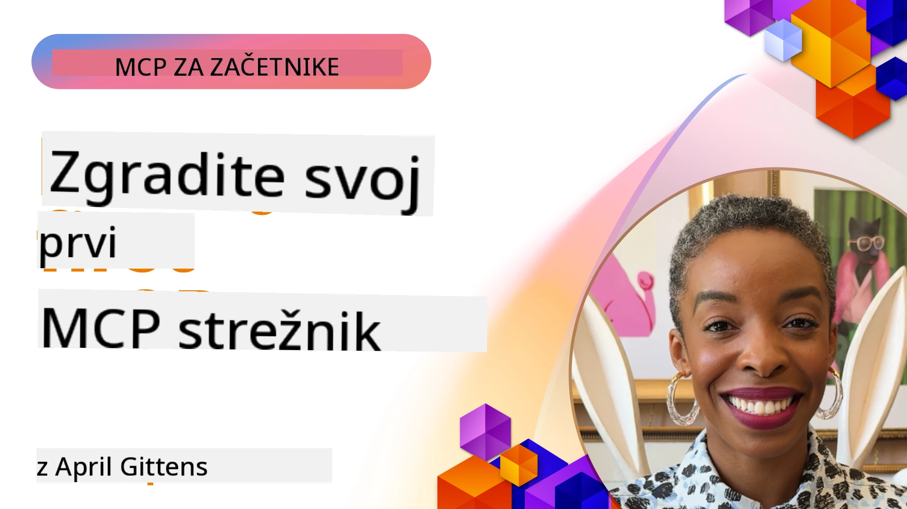

## Začetek  

_(Kliknite zgornjo sliko za ogled videoposnetka te lekcije)_

Ta razdelek vsebuje več lekcij:

- **1 Vaš prvi strežnik**, v tej prvi lekciji se boste naučili, kako ustvariti svoj prvi strežnik in ga pregledati z orodjem pregledovalnika, dragocenim načinom za testiranje in odpravljanje napak na vašem strežniku, [do lekcije](01-first-server/README.md)

- **2 Odjemalec**, v tej lekciji se boste naučili, kako napisati odjemalca, ki se lahko poveže z vašim strežnikom, [do lekcije](02-client/README.md)

- **3 Odjemalec z LLM**, še boljši način pisanja odjemalca je dodajanje LLM, da lahko "pogaja" z vašim strežnikom o tem, kaj storiti, [do lekcije](03-llm-client/README.md)

- **4 Uporaba načina agenta GitHub Copilot Strežnika v Visual Studio Code**. Tukaj si ogledamo zagon našega MCP strežnika znotraj Visual Studio Code, [do lekcije](04-vscode/README.md)

- **5 stdio Transportni strežnik** stdio transport je priporočeni standard za lokalno komunikacijo MCP strežnik-odjemalec, ki zagotavlja varno komunikacijo na podlagi podprocesov z vgrajeno izolacijo procesov [do lekcije](05-stdio-server/README.md)

- **6 HTTP pretakanje z MCP (Streamable HTTP)**. Spoznajte standardni
	oddaljeni transport v [MCP specifikaciji 2026-07-28](https://modelcontextprotocol.io/specification/2026-07-28/basic/transports/streamable-http),
	poleg zapuščinskega izvajanja na osnovi sej, ki je ohranjen v lekciji.
	[do lekcije](06-http-streaming/README.md)

- **7 Uporaba AI orodjarne za VSCode** za uporabo in testiranje vaših MCP odjemalcev in strežnikov [do lekcije](07-aitk/README.md)

- **8 Testiranje**. Tukaj se bomo posebej osredotočili, kako lahko na različne načine testiramo naš strežnik in odjemalca, [do lekcije](08-testing/README.md)

- **9 Nameščanje**. Ta poglavje bo obravnavalo različne načine nameščanja vaših MCP rešitev, [do lekcije](09-deployment/README.md)

- **10 Napredna uporaba strežnika**. To poglavje pokriva napredno uporabo strežnika, [do lekcije](./10-advanced/README.md)

- **11 Avtentikacija**. To poglavje pokriva, kako dodati preprosto avtentikacijo, od osnovne avtentikacije do uporabe JWT in RBAC. Priporočamo, da začnete tukaj in nato pogledate Napredne teme v poglavju 5 ter izvedete dodatne varnostne ukrepe po priporočilih v poglavju 2, [do lekcije](./11-simple-auth/README.md)

- **12 MCP gostitelji**. Konfigurirajte in uporabljajte priljubljene MCP gostiteljske odjemalce, vključno z Claude Desktop, Cursor, Cline in Windsurf. Spoznajte vrste transportov in odpravljanje težav, [do lekcije](./12-mcp-hosts/README.md)

- **13 MCP pregledovalnik**. Interaktivno razhroščujte in testirajte svoje MCP strežnike z orodjem MCP pregledovalnik. Naučite se odpravljati težave z orodji, viri in protokolnimi sporočili, [do lekcije](./13-mcp-inspector/README.md)

- **14 Vzorčenje**. Spoznajte zapuščinski primitiv vzorčenja za `2025-11-25` in
	kako migrirati nove zasnove na neposredno integracijo ponudnika LLM. Vzorčenje je
	opravljeno v MCP `2026-07-28`. [do lekcije](./14-sampling/README.md)

- **15 MCP aplikacije**. Zgradite MCP strežnike, ki prav tako odgovarjajo z UI navodili, [do lekcije](./15-mcp-apps/README.md)

Protokol Model Context (MCP) je odprt protokol, ki standardizira način, kako aplikacije zagotavljajo kontekst za LLM-je. MCP si lahko predstavljate kot USB-C priključek za AI aplikacije – zagotavlja standardiziran način povezave AI modelov z različnimi viri podatkov in orodji.

## Cilji učenja

Do konca te lekcije boste znali:

- Nastaviti razvojna okolja za MCP v C#, Java, Python, TypeScript in JavaScript
- Zgraditi in namestiti osnovne MCP strežnike z lastnimi funkcijami (viri, pozivi in orodja)
- Ustvariti gostiteljske aplikacije, ki se povezujejo z MCP strežniki
- Testirati in odpravljati MCP implementacije
- Razumeti pogoste izzive nastavitve in njihove rešitve
- Povezati svoje MCP implementacije s priljubljenimi LLM storitvami

## Nastavitev vašega MCP okolja

Preden začnete delati z MCP, je pomembno pripraviti razvojno okolje in razumeti osnovni potek dela. Ta razdelek vas bo vodil skozi začetne korake nastavitve za nemoten začetek z MCP.

### Zahteve

Preden se lotite razvoja MCP, poskrbite, da imate:

- **Razvojno okolje**: Za vaš izbrani jezik (C#, Java, Python, TypeScript ali JavaScript)
- **IDE/Urejevalnik**: Visual Studio, Visual Studio Code, IntelliJ, Eclipse, PyCharm ali kateri koli sodoben urejevalnik kode
- **Upravitelji paketov**: NuGet, Maven/Gradle, pip ali npm/yarn
- **API ključi**: Za katere koli AI storitve, ki jih nameravate uporabljati v svojih gostiteljskih aplikacijah

### Uradne SDK

V prihajajočih poglavjih boste videli rešitve, izdelane z uporabo Pythona, TypeScripta,
Jave in .NET. Tukaj so uradni SDK-ji.

Podpora SDK za MCP `2026-07-28` se uvaja neodvisno po jezikih.
Pred zagonom primera preverite različico paketa in opombe ob izdaji SDK
za podprte revizije protokola. Oglejte si
[uradni seznam SDK-jev](https://modelcontextprotocol.io/docs/sdk):
- [C# SDK](https://github.com/modelcontextprotocol/csharp-sdk) - Vzdrževan v sodelovanju z Microsoft
- [Java SDK](https://github.com/modelcontextprotocol/java-sdk) - Vzdrževan v sodelovanju s Spring AI
- [TypeScript SDK](https://github.com/modelcontextprotocol/typescript-sdk) - Uradna implementacija za TypeScript
- [Python SDK](https://github.com/modelcontextprotocol/python-sdk) - Uradna implementacija za Python (FastMCP)
- [Kotlin SDK](https://github.com/modelcontextprotocol/kotlin-sdk) - Uradna implementacija za Kotlin
- [Swift SDK](https://github.com/modelcontextprotocol/swift-sdk) - Vzdrževan v sodelovanju z Loopwork AI
- [Rust SDK](https://github.com/modelcontextprotocol/rust-sdk) - Uradna implementacija za Rust
- [Go SDK](https://github.com/modelcontextprotocol/go-sdk) - Uradna implementacija za Go

## Glavne ugotovitve

- Nastavljanje razvojnega okolja MCP je enostavno z jezikovno specifičnimi SDK-ji
- Gradnja MCP strežnikov vključuje ustvarjanje in registracijo orodij z jasnimi shemami
- MCP odjemalci se povežejo s strežniki in modeli za uporabo razširjenih zmogljivosti
- Testiranje in odpravljanje napak sta bistvena za zanesljive MCP implementacije
- Možnosti nameščanja segajo od lokalnega razvoja do rešitev v oblaku

## Vaja

Imamo nabor primerov, ki dopolnjujejo vaje, ki jih boste videli v vseh poglavjih tega razdelka. Poleg tega ima vsako poglavje tudi svoje vaje in zadolžitve

- [Java Kalkulator](./samples/java/calculator/README.md)
- [.NET Kalkulator](../../../03-GettingStarted/samples/csharp)
- [JavaScript Kalkulator](./samples/javascript/README.md)
- [TypeScript Kalkulator](./samples/typescript/README.md)
- [Python Kalkulator](../../../03-GettingStarted/samples/python)

## Dodatni viri

- [Gradnja agentov z Model Context Protocol na Azure](https://learn.microsoft.com/azure/developer/ai/intro-agents-mcp)
- [Oddaljeni MCP z Azure Container Apps (Node.js/TypeScript/JavaScript)](https://learn.microsoft.com/samples/azure-samples/mcp-container-ts/mcp-container-ts/)
- [.NET OpenAI MCP agent](https://learn.microsoft.com/samples/azure-samples/openai-mcp-agent-dotnet/openai-mcp-agent-dotnet/)

## Kaj sledi

Začnite s prvo lekcijo: [Ustvarjanje vašega prvega MCP strežnika](01-first-server/README.md)

Ko boste zaključili ta modul, nadaljujte z: [Modul 4: Praktična izvedba](../04-PracticalImplementation/README.md)

---

<!-- CO-OP TRANSLATOR DISCLAIMER START -->
**Omejitev odgovornosti**:
Ta dokument je bil preveden z uporabo AI prevajalske storitve [Co-op Translator](https://github.com/Azure/co-op-translator). Čeprav si prizadevamo za natančnost, vas prosimo, da upoštevate, da avtomatizirani prevodi lahko vsebujejo napake ali netočnosti. Izvirni dokument v njegovem izvirnem jeziku je treba obravnavati kot avtoritativni vir. Za kritične informacije je priporočljiv strokovni človeški prevod. Ne odgovarjamo za morebitna nesporazume ali napačne interpretacije, ki izhajajo iz uporabe tega prevoda.
<!-- CO-OP TRANSLATOR DISCLAIMER END -->