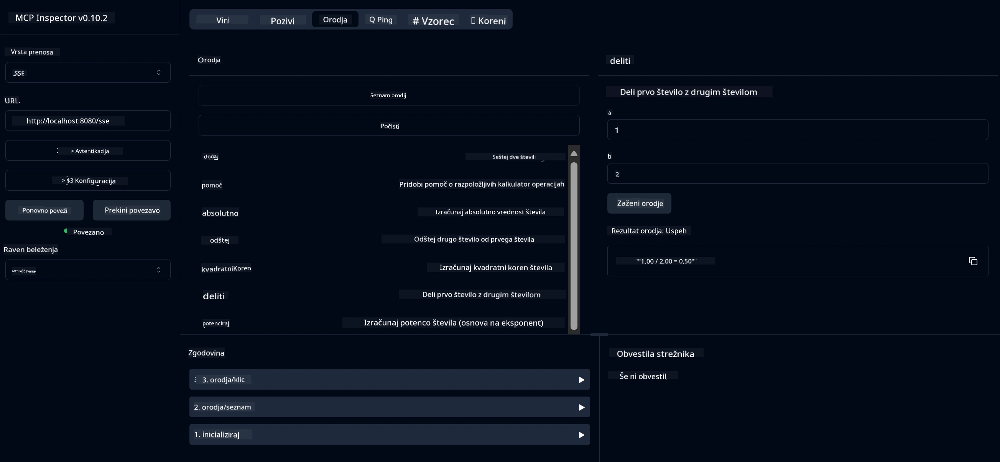

# Osnovna storitev kalkulatorja MCP

> [!NOTE]
> Ta primer uporablja zastareli prenos HTTP+SSE in cilja na SDK, združljiv
> z MCP `2025-11-25`. Novi oddaljeni strežniki naj uporabljajo `2026-07-28` Streamable
> HTTP podporo.

Ta storitev omogoča osnovne operacije kalkulatorja preko protokola Model Context Protocol (MCP) z uporabo Spring Boot in WebFlux prenosa. Namenjena je kot preprost primer za začetnike, ki se učijo o implementacijah MCP.

Za več informacij si oglejte referenčno dokumentacijo [MCP Server Boot Starter](https://docs.spring.io/spring-ai/reference/api/mcp/mcp-server-boot-starter-docs.html).

## Pregled

Storitev prikazuje:
- Podporo za SSE (Server-Sent Events)
- Samodejno registracijo orodij z uporabo Spring AI oznake `@Tool`
- Osnovne funkcije kalkulatorja:
  - Seštevanje, odštevanje, množenje, deljenje
  - Izračun potenc in kvadratnega korena
  - Modulo (ostanek) in absolutna vrednost
  - Pomožna funkcija za opise operacij

## Funkcionalnosti

Ta storitev kalkulatorja ponuja naslednje zmogljivosti:

1. **Osnovne aritmetične operacije**:
   - Seštevanje dveh števil
   - Odštevanje enega števila od drugega
   - Množenje dveh števil
   - Deljenje enega števila z drugim (s preverjanjem deljenja z ničlo)

2. **Napredne operacije**:
   - Izračun potenc (povišanje osnove na eksponent)
   - Izračun kvadratnega korena (s preverjanjem negativnih števil)
   - Izračun modulo (ostanka)
   - Izračun absolutne vrednosti

3. **Pomožni sistem**:
   - Vgrajena pomožna funkcija, ki pojasnjuje vse razpoložljive operacije

## Uporaba storitve

Storitev izpostavlja naslednje API končne točke preko MCP protokola:

- `add(a, b)`: Seštej dve števili
- `subtract(a, b)`: Odštej drugo število od prvega
- `multiply(a, b)`: Pomnoži dve števili
- `divide(a, b)`: Deli prvo število z drugim (s preverjanjem ničle)
- `power(base, exponent)`: Izračunaj potenco števila
- `squareRoot(number)`: Izračunaj kvadratni koren (s preverjanjem negativnih števil)
- `modulus(a, b)`: Izračunaj ostanek pri deljenju
- `absolute(number)`: Izračunaj absolutno vrednost
- `help()`: Pridobi informacije o razpoložljivih operacijah

## Testni odjemalec

Preprost testni odjemalec je vključen v paket `com.microsoft.mcp.sample.client`. Razred `SampleCalculatorClient` prikazuje razpoložljive operacije kalkulatorja.

## Uporaba LangChain4j odjemalca

Projekt vključuje primer LangChain4j odjemalca v `com.microsoft.mcp.sample.client.LangChain4jClient`, ki prikazuje, kako integrirati kalkulator z LangChain4j in modeli GitHub:

### Zahteve

1. **Nastavitev GitHub žetona**:
   
   Za uporabo AI modelov GitHub (kot je phi-4) potrebujete osebni dostopni žeton GitHub:

   a. Pojdite v nastavitve vašega GitHub računa: https://github.com/settings/tokens
   
   b. Kliknite "Generate new token" → "Generate new token (classic)"
   
   c. Žetonu dajte opisno ime
   
   d. Izberite naslednje obsege:
      - `repo` (poln nadzor nad zasebnimi repozitoriji)
      - `read:org` (beri članstvo v organizacijah in ekipah, beri projekte organizacij)
      - `gist` (ustvarjanje gistov)

      - `user:email` (Dostop do elektronskih naslovov uporabnikov (samo za branje))
   
   e. Kliknite "Generate token" in kopirajte svoj novi žeton
   
   f. Nastavite ga kot spremenljivko okolja:
      
      Na Windows:
      ```
      set GITHUB_TOKEN=your-github-token
      ```
      
      Na macOS/Linux:
      ```bash
      export GITHUB_TOKEN=your-github-token
      ```

   g. Za trajno nastavitev ga dodajte svojim spremenljivkam okolja preko sistemskih nastavitev

2. Dodajte GitHub odvisnost LangChain4j v svoj projekt (že vključeno v pom.xml):
   ```xml
   <dependency>
       <groupId>dev.langchain4j</groupId>
       <artifactId>langchain4j-github</artifactId>
       <version>${langchain4j.version}</version>
   </dependency>
   ```

3. Poskrbite, da je strežnik kalkulatorja aktiven na `localhost:8080`

### Zagon odjemalca LangChain4j

Ta primer prikazuje:
- Povezovanje s strežnikom MCP kalkulatorja preko SSE transporta
- Uporabo LangChain4j za ustvarjanje klepetalnega robota, ki uporablja operacije kalkulatorja
- Integracijo z GitHub AI modeli (trenutno uporablja model phi-4)

Odjemalec pošlje naslednje vzorčne poizvedbe za prikaz funkcionalnosti:
1. Izračun vsote dveh števil
2. Iskanje kvadratnega korena števila
3. Pridobivanje pomoči o razpoložljivih operacijah kalkulatorja

Zaženite primer in preverite izhod v konzoli, da vidite, kako AI model uporablja orodja kalkulatorja za odgovarjanje na poizvedbe.

### Konfiguracija GitHub modela

Odjemalec LangChain4j je konfiguriran za uporabo GitHub modela phi-4 z naslednjimi nastavitvami:

```java
ChatLanguageModel model = GitHubChatModel.builder()
    .apiKey(System.getenv("GITHUB_TOKEN"))
    .timeout(Duration.ofSeconds(60))
    .modelName("phi-4")
    .logRequests(true)
    .logResponses(true)
    .build();
```

Za uporabo drugih GitHub modelov preprosto spremenite parameter `modelName` na drug podprt model (npr. "claude-3-haiku-20240307", "llama-3-70b-8192" itd.).

## Odvisnosti

Projekt zahteva naslednje ključne odvisnosti:

```xml
<!-- For MCP Server -->
<dependency>
    <groupId>org.springframework.ai</groupId>
    <artifactId>spring-ai-starter-mcp-server-webflux</artifactId>
</dependency>

<!-- For LangChain4j integration -->
<dependency>
    <groupId>dev.langchain4j</groupId>
    <artifactId>langchain4j-mcp</artifactId>
    <version>${langchain4j.version}</version>
</dependency>

<!-- For GitHub models support -->
<dependency>
    <groupId>dev.langchain4j</groupId>
    <artifactId>langchain4j-github</artifactId>
    <version>${langchain4j.version}</version>
</dependency>
```

## Gradnja projekta

Projekt zgradite z uporabo Mavena:
```bash
./mvnw clean install -DskipTests
```

## Zagon strežnika

### Uporaba Java

```bash
java -jar target/calculator-server-0.0.1-SNAPSHOT.jar
```

### Uporaba MCP Inspector

MCP Inspector je uporaben pripomoček za interakcijo s storitvami MCP. Za uporabo s to kalkulatorsko storitvijo:

1. **Namestite in zaženite MCP Inspector** v novem oknu terminala:
   ```bash
   npx @modelcontextprotocol/inspector
   ```

2. **Dostop do spletnega vmesnika** s klikom na URL, ki ga prikaže aplikacija (običajno http://localhost:6274)

3. **Konfigurirajte povezavo**:
   - Nastavite tip prenosa na "SSE"
   - Nastavite URL na SSE končno točko vašega aktivnega strežnika: `http://localhost:8080/sse`
   - Kliknite "Connect"

4. **Uporabite orodja**:
   - Kliknite "List Tools" za ogled razpoložljivih operacij kalkulatorja
   - Izberite orodje in kliknite "Run Tool" za izvedbo operacije



### Uporaba Dockerja

Projekt vključuje Dockerfile za kontejnersko namestitev:

1. **Zgradite Docker sliko**:
   ```bash
   docker build -t calculator-mcp-service .
   ```

2. **Zaženite Docker kontejner**:
   ```bash
   docker run -p 8080:8080 calculator-mcp-service
   ```

To bo:
- Zgradilo večstopenjsko Docker sliko z Maven 3.9.9 in Eclipse Temurin 24 JDK
- Ustvarilo optimizirano slikovno okolje kontejnerja
- Izpostavilo storitev na vratih 8080
- Začelo MCP kalkulatorsko storitev znotraj kontejnerja

Do storitve boste dostopali na `http://localhost:8080` po zagonu kontejnerja.

## Reševanje težav

### Pogoste težave z GitHub žetonom


1. **Težave s dovoljenji žetona**: Če prejmete napako 403 Forbidden, preverite, ali ima vaš žeton pravilna dovoljenja, kot je navedeno v predpogojih.

2. **Žeton ni najden**: Če prejmete napako "No API key found", zagotovite, da je okoljska spremenljivka GITHUB_TOKEN pravilno nastavljena.

3. **Omejitve hitrosti**: GitHub API ima omejitve hitrosti. Če naletite na napako omejitve hitrosti (statusna koda 429), počakajte nekaj minut, preden poskusite znova.

4. **Potek žetona**: GitHub žetoni lahko potečejo. Če po določenem času prejmete napake pri avtentikaciji, ustvarite nov žeton in posodobite svojo okoljsko spremenljivko.

Če potrebujete dodatno pomoč, si oglejte [LangChain4j dokumentacijo](https://github.com/langchain4j/langchain4j) ali [GitHub API dokumentacijo](https://docs.github.com/en/rest).

---

<!-- CO-OP TRANSLATOR DISCLAIMER START -->
**Omejitev odgovornosti**:
Ta dokument je bil preveden z uporabo AI prevajalske storitve [Co-op Translator](https://github.com/Azure/co-op-translator). Čeprav si prizadevamo za natančnost, vas prosimo, da upoštevate, da avtomatizirani prevodi lahko vsebujejo napake ali netočnosti. Izvirni dokument v njegovem izvirnem jeziku je treba obravnavati kot avtoritativni vir. Za kritične informacije je priporočljiv strokovni človeški prevod. Ne odgovarjamo za morebitna nesporazume ali napačne interpretacije, ki izhajajo iz uporabe tega prevoda.
<!-- CO-OP TRANSLATOR DISCLAIMER END -->