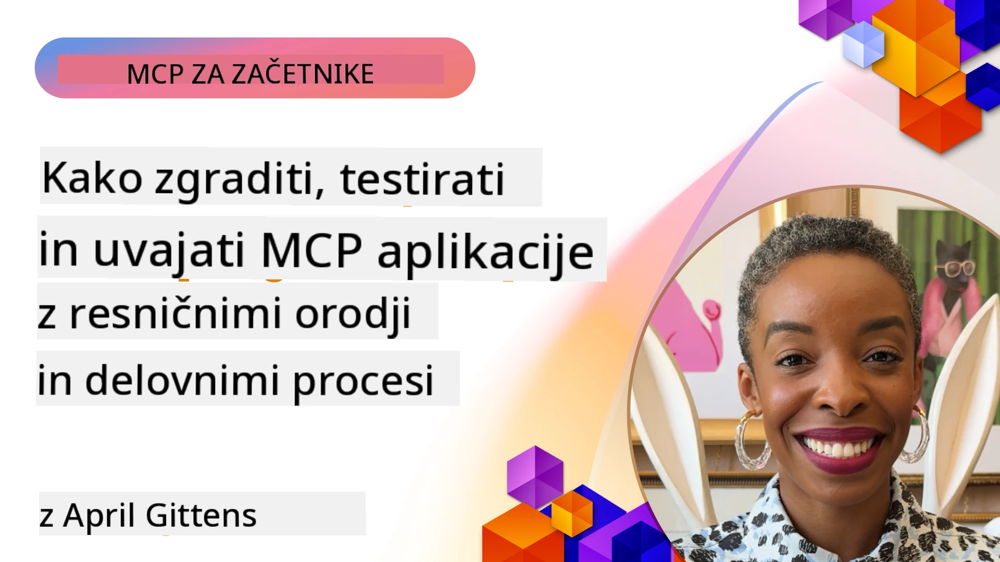

# Praktična izvedba

[](https://youtu.be/vCN9-mKBDfQ)

_(Kliknite zgornjo sliko za ogled posnetka tega učnega gradiva)_

Praktična izvedba je mesto, kjer moč Model Context Protocol (MCP) postane otipljiva. Medtem ko je razumevanje teorije in arhitekture MCP pomembno, prava vrednost nastane, ko te koncepte uporabite za gradnjo, testiranje in uvajanje rešitev, ki rešujejo resnične probleme. To poglavje premošča vrzel med konceptualnim znanjem in praktičnim razvojem ter vas vodi skozi proces oživljanja aplikacij, ki temeljijo na MCP.

Ne glede na to, ali razvijate inteligentne asistente, integrirate AI v poslovne delovne procese ali ustvarjate prilagojena orodja za obdelavo podatkov, MCP zagotavlja prilagodljivo osnovo. Njegova jezikovno nevtralna zasnova in uradne SDK za priljubljene programske jezike omogočajo dostop širokemu krogu razvijalcev. Z uporabo teh SDK lahko hitro izdelate prototipe, ponavljate in razširjate rešitve na različnih platformah in okoljih.

V naslednjih razdelkih boste našli praktične primere, vzorčno kodo in strategije uvajanja, ki prikazujejo, kako implementirati MCP v C#, Javi s Springom, TypeScriptu, JavaScriptu in Pythonu. Naučili se boste tudi, kako odpravljati napake in testirati vaše MCP strežnike, upravljati API-je in uvajati rešitve v oblak z uporabo Azure. Ti praktični viri so zasnovani za pospešitev vašega učenja in pomoč pri samozavestnem grajenju robustnih, proizvodno pripravljenih MCP aplikacij.

## Pregled

Ta lekcija se osredotoča na praktične vidike implementacije MCP v več programskih jezikih. Raziščemo, kako uporabljati MCP SDK-je v C#, Javi s Springom, TypeScriptu, JavaScriptu in Pythonu za gradnjo robustnih aplikacij, odpravljanje napak in testiranje MCP strežnikov ter ustvarjanje ponovljivih virov, pozivov in orodij.

## Cilji učenja

Na koncu te lekcije boste znali:

- Izvajati MCP rešitve z uporabo uradnih SDK v različnih programskih jezikih
- Sistematično odpravljati napake in testirati MCP strežnike
- Ustvarjati in uporabljati funkcije strežnika (Viri, Pozivi in Orodja)
- Oblikovati učinkovite MCP delovne postopke za kompleksne naloge
- Optimizirati MCP izvedbe za zmogljivost in zanesljivost

## Uradni SDK viri

Model Context Protocol ponuja uradne SDK za več jezikov (usklajeno z [MCP specifikacijo 2025-11-25](https://spec.modelcontextprotocol.io/specification/2025-11-25/)):

- [C# SDK](https://github.com/modelcontextprotocol/csharp-sdk)
- [Java s Springom SDK](https://github.com/modelcontextprotocol/java-sdk) **Opomba:** zahteva odvisnost od [Project Reactor](https://projectreactor.io). (Oglejte si [diskusijsko vprašanje 246](https://github.com/orgs/modelcontextprotocol/discussions/246).)
- [TypeScript SDK](https://github.com/modelcontextprotocol/typescript-sdk)
- [Python SDK](https://github.com/modelcontextprotocol/python-sdk)
- [Kotlin SDK](https://github.com/modelcontextprotocol/kotlin-sdk)
- [Go SDK](https://github.com/modelcontextprotocol/go-sdk)

## Delo z MCP SDK-ji

Ta razdelek ponuja praktične primere implementacije MCP v več programskih jezikih. V mapi `samples` lahko najdete vzorčno kodo urejeno po jezikih.

### Dostopni primeri

Repozitorij vsebuje [vzorce implementacij](../../../04-PracticalImplementation/samples) v naslednjih jezikih:

- [C#](./samples/csharp/README.md)
- [Java s Springom](./samples/java/containerapp/README.md)
- [TypeScript](./samples/typescript/README.md)
- [JavaScript](./samples/javascript/README.md)
- [Python](./samples/python/README.md)

Vsak vzorec prikazuje ključne koncepte MCP in vzorce implementacije za določen jezik in ekosistem.

### Praktični vodiči

Dodatni vodiči za praktično implementacijo MCP:

- [Paginacija in veliki nabori rezultatov](./pagination/README.md) - Upravljanje paginacije na osnovi kazalcev za orodja, vire in velike podatkovne zbirke

## Osnovne značilnosti strežnika

MCP strežniki lahko implementirajo katerokoli kombinacijo teh funkcij:

### Viri

Viri zagotavljajo kontekst in podatke za uporabo uporabnika ali AI modela:

- Repodatoteke dokumentov
- Znanje baze
- Strukturirani podatkovni viri
- Datotečni sistemi

### Pozivi

Pozivi so templati sporočil in delovnih postopkov za uporabnike:

- Vnaprej določene predloge pogovora
- Vodeni vzorci interakcije
- Specializirane strukture dialoga

### Orodja

Orodja so funkcije za izvajanje AI modela:

- Orodja za obdelavo podatkov
- Integracije zunanjih API-jev
- Računske zmožnosti
- Funkcionalnost iskanja

## Primeri implementacij: C# implementacija

Uradni repozitorij C# SDK vsebuje več vzorčnih implementacij, ki prikazujejo različne vidike MCP:

- **Osnovni MCP odjemalec**: Preprost primer ustvarjanja MCP odjemalca in klica orodij
- **Osnovni MCP strežnik**: Minimalna strežniška implementacija z osnovno registracijo orodij
- **Napredni MCP strežnik**: Popolnoma opremljen strežnik z registracijo orodij, avtentikacijo in obravnavo napak
- **Integracija ASP.NET**: Primeri integracije z ASP.NET Core
- **Vzorce implementacije orodij**: Različni vzorci za izvajanje orodij z različnimi stopnjami kompleksnosti

MCP C# SDK je v predogledu in API-ji se lahko spremenijo. Nenehno bomo posodabljali ta blog, ko se SDK razvija.

### Ključne funkcije

- [C# MCP Nuget ModelContextProtocol](https://www.nuget.org/packages/ModelContextProtocol)
- Gradnja vašega [prvega MCP strežnika](https://devblogs.microsoft.com/dotnet/build-a-model-context-protocol-mcp-server-in-csharp/).

Za popolne vzorce C# implementacij obiščite [uradni repozitorij C# SDK vzorcev](https://github.com/modelcontextprotocol/csharp-sdk)

## Primer implementacije: Java s Springom

Java s Springom SDK ponuja robustne možnosti implementacije MCP z lastnostmi poslovnega razreda.

### Ključne funkcije

- Integracija Spring Frameworka
- Močna tipna varnost
- Podpora reaktivnemu programiranju
- Celovita obravnava napak

Za popoln vzorec Java s Spring implementacije si oglejte [Java s Spring vzorec](samples/java/containerapp/README.md) v mapi vzorcev.

## Primer implementacije: JavaScript implementacija

JavaScript SDK ponuja lahko in prilagodljiv pristop k implementaciji MCP.

### Ključne funkcije

- Podpora Node.js in brskalniku
- API na osnovi promes
- Enostavna integracija z Express in drugimi ogrodji
- Podpora WebSocket za pretakanje

Za popoln vzorec JavaScript implementacije si oglejte [JavaScript vzorec](samples/javascript/README.md) v mapi vzorcev.

## Primer implementacije: Python implementacija

Python SDK ponuja pythonistični pristop k implementaciji MCP z odlično integracijo ML ogrodij.

### Ključne funkcije

- Podpora async/await z asyncio
- Integracija FastAPI``
- Enostavna registracija orodij
- Nativna integracija s priljubljenimi ML knjižnicami

Za popoln vzorec Python implementacije si oglejte [Python vzorec](samples/python/README.md) v mapi vzorcev.

## Urejanje API-jev

Azure API Management je odličen odgovor na vprašanje, kako lahko zaščitimo MCP strežnike. Ideja je postaviti Azure API Management instanco pred vaš MCP strežnik in ji dovoliti upravljanje funkcij, ki jih boste verjetno želeli, kot so:

- omejevanje hitrosti
- upravljanje žetonov
- spremljanje
- uravnoteženje obremenitve
- varnost

### Azure vzorec

Tukaj je Azure vzorec, ki točno to počne, tj. [ustvarjanje MCP strežnika in njegovo zaščito z Azure API Management](https://github.com/Azure-Samples/remote-mcp-apim-functions-python).

Ogledate si lahko, kako poteka avtentikacijski proces na spodnji sliki:


Na prikazani sliki se zgodi naslednje:

- Avtentikacija/avtorizacija poteka z uporabo Microsoft Entra.
- Azure API Management deluje kot vhodna točka in z uporabo politik usmerja in upravlja promet.
- Azure Monitor beleži vse zahtevke za nadaljnjo analizo.

#### Potek avtorizacije

Poglejmo podrobneje potek avtorizacije:


#### Specifikacija MCP avtorizacije

Več o [MCP specifikaciji avtorizacije](https://spec.modelcontextprotocol.io/specification/2025-11-25/basic/authorization/)

## Uvajanje oddaljenega MCP strežnika v Azure

Poglejmo, ali lahko uvedemo vzorec, ki smo ga omenili prej:

1. Klonirajte repozitorij

    ```bash
    git clone https://github.com/Azure-Samples/remote-mcp-apim-functions-python.git
    cd remote-mcp-apim-functions-python
    ```

1. Registrirajte ponudnika virov `Microsoft.App`.

   - Če uporabljate Azure CLI, zaženite `az provider register --namespace Microsoft.App --wait`.
   - Če uporabljate Azure PowerShell, zaženite `Register-AzResourceProvider -ProviderNamespace Microsoft.App`. Nato po določenem času preverite stanje registracije z ukazom `(Get-AzResourceProvider -ProviderNamespace Microsoft.App).RegistrationState`.

1. Zaženite ta [azd](https://aka.ms/azd) ukaz za zagotovitev storitve upravljanja API-jev, funkcijske aplikacije (z kodo) in vseh drugih potrebnih Azure virov

    ```shell
    azd up
    ```

    Ta ukaz bi moral uvesti vse oblačne vire na Azure

### Testiranje vašega strežnika z MCP Inspectorjem

1. V **novem terminalskem oknu** namestite in zaženite MCP Inspector

    ```shell
    npx @modelcontextprotocol/inspector
    ```

    Videli boste vmesnik podoben:

    

1. Kliknite CTRL, da naložite spletno aplikacijo MCP Inspector iz URL-ja, ki ga aplikacija prikaže (npr. [http://127.0.0.1:6274/#resources](http://127.0.0.1:6274/#resources))
1. Nastavite tip prenosa na `SSE`
1. Nastavite URL na vaš tekoči API Management SSE končni naslov, ki se prikaže po `azd up` in **Se povežite**:

    ```shell
    https://<apim-servicename-from-azd-output>.azure-api.net/mcp/sse
    ```

1. **Seznam orodij**. Kliknite na orodje in **Zaženite orodje**.

Če so bili vsi koraki uspešni, ste zdaj povezani z MCP strežnikom in lahko ste uporabili orodje.

## MCP strežniki za Azure

[Remote-mcp-functions](https://github.com/Azure-Samples/remote-mcp-functions-dotnet): Ta nabor repozitorijev je hitro zaženljiva predloga za gradnjo in uvajanje prilagojenih oddaljenih MCP (Model Context Protocol) strežnikov z uporabo Azure Functions v Pythonu, C# .NET ali Node/TypeScript.

Vzorniki nudijo celovito rešitev, ki razvijalcem omogoča:

- Gradnja in lokalno izvajanje: razvijajte in odpravljajte napake MCP strežnika na lokalnem računalniku
- Uvajanje v Azure: z lahkoto uvedite v oblak z enostavnim ukazom azd up
- Povezava s strankami: povežite se s MCP strežnikom iz različnih strank, vključno z načinom agenta Copilot v VS Code in orodjem MCP Inspector

### Ključne funkcije

- Varnost zasnovana: MCP strežnik je zaščiten s ključi in HTTPS
- Možnosti avtentikacije: podpira OAuth z vgrajeno avtentikacijo in/ali API Management
- Omrežna izolacija: omogoča omrežno izolacijo z uporabo Azure Virtual Networks (VNET)
- Strežnik brez strežnika: uporablja Azure Functions za skalabilno, dogodkovno usmerjeno izvajanje
- Lokalni razvoj: celovita podpora lokalnemu razvoju in odpravljanju napak
- Enostavno uvajanje: poenostavljen proces uvajanja v Azure

Repozitorij vključuje vse potrebne konfiguracijske datoteke, izvorno kodo in definicije infrastrukture za hiter začetek s proizvodno pripravljenim MCP strežnikom.

- [Azure Remote MCP Functions Python](https://github.com/Azure-Samples/remote-mcp-functions-python) - Vzorec MCP implementacije z Azure Functions v Pythonu

- [Azure Remote MCP Functions .NET](https://github.com/Azure-Samples/remote-mcp-functions-dotnet) - Vzorec MCP implementacije z Azure Functions v C# .NET

- [Azure Remote MCP Functions Node/Typescript](https://github.com/Azure-Samples/remote-mcp-functions-typescript) - Vzorec MCP implementacije z Azure Functions v Node/TypeScript.

## Ključne ugotovitve

- MCP SDK-ji zagotavljajo orodja po jezikih za implementacijo robustnih MCP rešitev
- Proces odpravljanja napak in testiranja je ključen za zanesljive MCP aplikacije
- Ponovni pozivi omogočajo dosledne AI interakcije
- Dobro zasnovani delovni postopki lahko orkestrirajo kompleksne naloge z uporabo več orodij
- Implementacija MCP rešitev zahteva upoštevanje varnosti, zmogljivosti in obravnave napak

## Praktična naloga

Oblikujte praktični MCP delovni postopek, ki naslavlja resnični problem v vašem področju:

1. Izberite 3–4 orodja, ki bi bila uporabna za reševanje tega problema
2. Ustvarite diagram delovnega postopka, ki prikazuje, kako ta orodja sodelujejo
3. Implementirajte osnovno različico enega od orodij v vašem izbranem jeziku
4. Ustvarite predlogo poziva, ki bi modelu pomagala učinkovito uporabiti vaše orodje

## Dodatni viri

---

## Kaj sledi

Naslednje: [Napredne teme](../05-AdvancedTopics/README.md)

---

<!-- CO-OP TRANSLATOR DISCLAIMER START -->
**Izjava o omejitvi odgovornosti**:
Ta dokument je bil preveden z uporabo AI prevajalske storitve [Co-op Translator](https://github.com/Azure/co-op-translator). Čeprav si prizadevamo za natančnost, vas prosimo, da upoštevate, da avtomatski prevodi lahko vsebujejo napake ali netočnosti. Izvirni dokument v matičnem jeziku velja za avtoritativni vir. Za pomembne informacije priporočamo strokovni človeški prevod. Nismo odgovorni za morebitne nesporazume ali napačne razlage, ki izhajajo iz uporabe tega prevoda.
<!-- CO-OP TRANSLATOR DISCLAIMER END -->