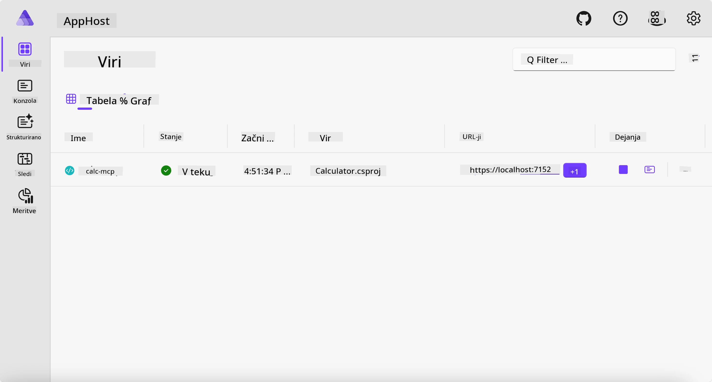
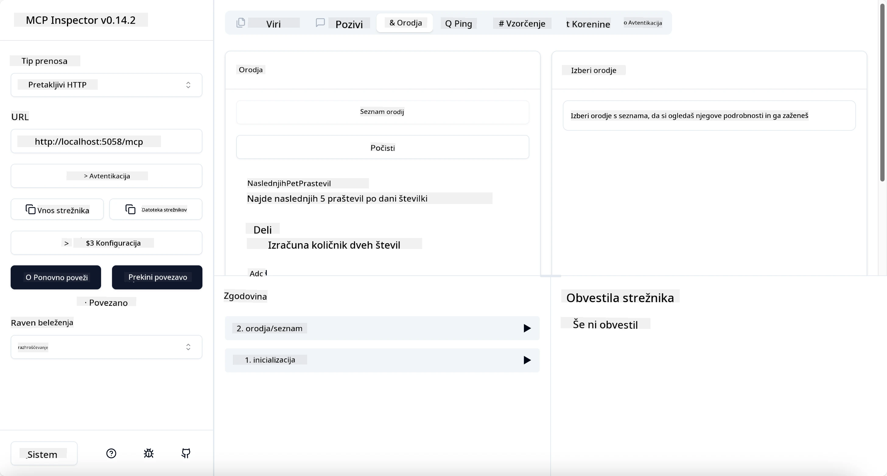
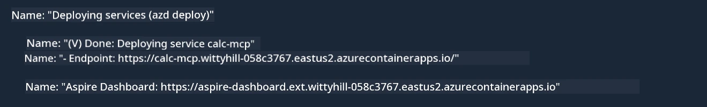

# Vzorec

Prejšnji primer prikazuje, kako uporabiti lokalni .NET projekt z vrsto `stdio`. In kako zagnati strežnik lokalno v vsebniku. To je dobra rešitev v mnogih situacijah. Vendar je lahko uporabno, da strežnik teče oddaljeno, na primer v oblaku. Tu pride na vrsto vrsta `http`.

Če pogledamo rešitev v mapi `04-PracticalImplementation`, se lahko zdi veliko bolj zapletena kot prejšnja. Toda v resnici ni. Če natančno pogledate projekt `src/Calculator`, boste videli, da gre večinoma za enako kodo kot v prejšnjem primeru. Edina razlika je, da uporabljamo drugo knjižnico `ModelContextProtocol.AspNetCore` za upravljanje HTTP zahtevkov. In spremenimo metodo `IsPrime`, da je zasebna, le da pokažemo, da lahko imate zasebne metode v svoji kodi. Preostanek kode je enak kot prej.

Drugi projekti so od [Aspire](https://aspire.dev/get-started/what-is-aspire/). Imati Aspire v rešitvi izboljša izkušnjo razvijalca med razvojem in testiranjem ter pomaga pri opazovanju. Ni nujno, da strežnik teče, a je dobra praksa, da ga imate v svoji rešitvi.

## Začni strežnik lokalno

1. V VS Code (z razširitvijo C# DevKit) pojdite v mapo `04-PracticalImplementation/samples/csharp`.
1. Zaženite naslednji ukaz, da začnete strežnik:

   ```bash
    dotnet watch run --project ./src/AppHost
   ```

1. Ko spletni brskalnik odpre Aspire nadzorno ploščo, opazite `http` URL. Moral bi biti nekaj takega kot `http://localhost:5058/`.

   

## Preizkusite Streamable HTTP z MCP Inspectorjem

Če imate Node.js različice 22.7.5 ali višje, lahko uporabite MCP Inspector za preizkus vašega strežnika.

Zaženite strežnik in v terminalu izvedite naslednji ukaz:

```bash
npx @modelcontextprotocol/inspector http://localhost:5058
```



- Izberite vrsto Transport kot `Streamable HTTP`.
- V polje Url vnesite prej zabeleženi URL strežnika in dodajte `/mcp`. Moral bi biti `http` (ne `https`), nekaj takega kot `http://localhost:5058/mcp`.
- kliknite na gumb Connect.

Ena dobra lastnost Inspectorja je, da omogoča dober pregled nad dogajanjem.

- Poskusite izpisati razpoložljiva orodja.
- Poskusite nekaj izmed njih, moralo bi delovati kot prej.

## Preizkusite MCP strežnik z GitHub Copilot Chat v VS Code

Za uporabo Streamable HTTP prenosa z GitHub Copilot Chat spremenite konfiguracijo prej ustvarjenega strežnika `calc-mcp` tako:

```jsonc
// .vscode/mcp.json
{
  "servers": {
    "calc-mcp": {
      "type": "http",
      "url": "http://localhost:5058/mcp"
    }
  }
}
```

Naredite nekaj preizkusov:

- Prosite za "3 praštevila po 6780". Opazujte, da Copilot uporabi nova orodja `NextFivePrimeNumbers` in vrne le prva 3 praštevila.
- Prosite za "7 praštevil po 111", da vidite, kaj se zgodi.
- Prosite za "John ima 24 lizik in jih želi razdeliti med 3 otroke. Koliko lizik ima vsak otrok?", da vidite, kaj se zgodi.

## Namestite strežnik na Azure

Namestimo strežnik na Azure, da ga lahko uporablja več ljudi.

V terminalu pojdite v mapo `04-PracticalImplementation/samples/csharp` in zaženite naslednji ukaz:

```bash
azd up
```

Ko je namestitev končana, bi morali videti sporočilo, kot je to:



Pridobite URL in ga uporabite v MCP Inspectorju in GitHub Copilot Chatu.

```jsonc
// .vscode/mcp.json
{
  "servers": {
    "calc-mcp": {
      "type": "http",
      "url": "https://calc-mcp.gentleriver-3977fbcf.australiaeast.azurecontainerapps.io/mcp"
    }
  }
}
```

## Kaj sledi?

Preizkusili smo različne vrste prenosa in testna orodja. Prav tako smo namestili vaš MCP strežnik na Azure. Kaj pa, če naš strežnik potrebuje dostop do zasebnih virov? Na primer, baze podatkov ali zasebnega API-ja? V naslednjem poglavju bomo videli, kako lahko izboljšamo varnost našega strežnika.

---

<!-- CO-OP TRANSLATOR DISCLAIMER START -->
**Omejitev odgovornosti**:
Ta dokument je bil preveden z uporabo AI prevajalske storitve [Co-op Translator](https://github.com/Azure/co-op-translator). Čeprav si prizadevamo za natančnost, vas prosimo, da upoštevate, da avtomatizirani prevodi lahko vsebujejo napake ali netočnosti. Izvirni dokument v njegovem izvirnem jeziku je treba obravnavati kot avtoritativni vir. Za kritične informacije je priporočljiv strokovni človeški prevod. Ne odgovarjamo za morebitna nesporazume ali napačne interpretacije, ki izhajajo iz uporabe tega prevoda.
<!-- CO-OP TRANSLATOR DISCLAIMER END -->