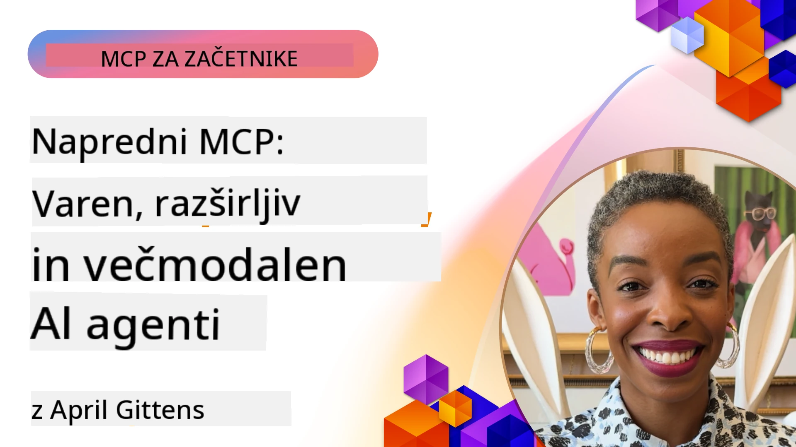

# Napredne teme v MCP

_(Kliknite zgornjo sliko za ogled videa te lekcije)_

Ta poglavje pokriva vrsto naprednih tem pri implementaciji Model Context Protocol (MCP), vključno z multimodalno integracijo, razširljivostjo, najboljšimi praksami varnosti in integracijo v podjetja. Te teme so ključne za gradnjo robustnih in proizvodno pripravljenih MCP aplikacij, ki lahko zadovoljijo zahteve sodobnih AI sistemov.

## Pregled

Ta lekcija raziskuje napredne koncepte pri implementaciji Model Context Protocol, s poudarkom na multimodalni integraciji, razširljivosti, najboljših varnostnih praksah in integraciji v podjetja. Te teme so bistvene za izdelavo MCP aplikacij proizvodne kakovosti, ki lahko obvladujejo kompleksne zahteve v podjetniških okoljih.

> **Opomba trenutne specifikacije:** MCP `2026-07-28` ukinja primitivi Roots in
> Sampling, ki sta bili zajeti v lekcijah 5.4 in 5.6. Prav tako premakne
> eksperimentalno funkcijo Tasks, omenjeno v Protocol Features (5.16), v
> namenski Tasks razširitvi. Te lekcije so ohranjene za dedne
> `2025-11-25` implementacije in vključujejo navodila za migracijo. Glej
> [Kaj se je spremenilo v MCP: specifikacija 2026-07-28](../01-CoreConcepts/mcp-2026-07-28.md).

## Cilji učenja

Ob koncu te lekcije boste sposobni:

- Izvesti multimodalne zmogljivosti v MCP okvirjih
- Načrtovati razširljive MCP arhitekture za scenarije z velikim povpraševanjem
- Uporabiti najboljše varnostne prakse v skladu z varnostnimi načeli MCP
- Integrirati MCP s podjetniškimi AI sistemi in okvirji
- Optimizirati zmogljivost in zanesljivost v proizvodnih okoljih

## Lekcije in vzorčni projekti

| Povezava | Naslov | Opis |
|------|-------|-------------|
| [5.1 Integracija z Azure](./mcp-integration/README.md) | Integracija z Azure | Naučite se, kako integrirati MCP strežnik na Azure |
| [5.2 Multimodalni primer](./mcp-multi-modality/README.md) | MCP multimodalni primeri | Primeri za zvok, sliko in multimodalne odgovore |
| [5.3 MCP OAuth2 primer](../../../05-AdvancedTopics/mcp-oauth2-demo) | MCP OAuth2 demo | Minimalna Spring Boot aplikacija, ki prikazuje OAuth2 z MCP, tako kot avtentikacijski kot tudi strežnik virov. Prikazuje varno izdajanje tokenov, zaščitene končne točke, implementacijo Azure Container Apps in integracijo upravljanja API-jev. |
| [5.4 Root Context](./mcp-root-contexts/README.md) | Root konteksti | Naučite se dedno `2025-11-25` Roots primitivo in trenutne možnosti migracije (ukinjeno v `2026-07-28`) |
| [5.5 Usmerjanje](./mcp-routing/README.md) | Usmerjanje | Spoznajte različne vrste usmerjanja |
| [5.6 Vzorec](./mcp-sampling/README.md) | Sampling | Spoznajte dedni `2025-11-25` Sampling primitiv in trenutne možnosti migracije (ukinjeno v `2026-07-28`) |
| [5.7 Razširjanje](./mcp-scaling/README.md) | Razširjanje | Spoznajte razširjanje |
| [5.8 Varnost](./mcp-security/README.md) | Varnost | Zavarujte svoj MCP strežnik |
| [5.9 Primer spletnega iskanja](./web-search-mcp/README.md) | MCP spletno iskanje | Python MCP strežnik in odjemalec, ki se integrira s SerpAPI za realnočasovno iskanje po spletu, novicah, izdelkih in vprašanjih ter odgovorih. Prikazuje večorodno orkestracijo, integracijo zunanjega API-ja in robustno obravnavo napak. |
| [5.10 Real-time streaming](./mcp-realtimestreaming/README.md) | Pretakanje | Pretakanje podatkov v realnem času je postalo ključno v današnjem svetu, kjer podjetja in aplikacije zahtevajo takojšen dostop do informacij za pravočasne odločitve. |
| [5.11 Real-time spletno iskanje](./mcp-realtimesearch/README.md) | Spletno iskanje | Kako MCP preoblikuje realnočasovno spletno iskanje z zagotavljanjem standardiziranega pristopa k upravljanju konteksta preko AI modelov, iskalnikov in aplikacij. |
| [5.12 Avtentikacija Entra ID za Model Context Protocol strežnike](./mcp-security-entra/README.md) | Entra ID avtentikacija | Microsoft Entra ID ponuja robustno identitetno in dostopno upravljanje v oblaku, ki pomaga zagotoviti, da lahko interakcijo z vašim MCP strežnikom izvajajo le pooblaščeni uporabniki in aplikacije. |
| [5.13 Microsoft Foundry Agent integracija](./mcp-foundry-agent-integration/README.md) | Microsoft Foundry integracija | Naučite se, kako integrirati Model Context Protocol strežnike z Microsoft Foundry agenti, kar omogoča zmogljivo orkestracijo orodij in podjetniške AI zmogljivosti s standardiziranimi povezavami do zunanjih podatkovnih virov. |
| [5.14 Context Engineering](./mcp-contextengineering/README.md) | Context Engineering | Prihodnost pristopov kontekstnega inženiringa za MCP strežnike, vključno z optimizacijo konteksta, dinamičnim upravljanjem konteksta in strategijami za učinkovito oblikovanje pozivov znotraj MCP okvirjev. |
| [5.15 MCP Custom Transport](./mcp-transport/README.md) | Prilagojen transport | Naučite se implementirati prilagojene transportne mehanizme za specializirane komunikacijske scenarije MCP. |
| [5.16 Globoki vpogled v protokolarne funkcije](./mcp-protocol-features/README.md) | Protokolarne funkcije | Obvladajte napredne protokolarne funkcije, vključno z obvestili o napredku, preklicem zahtevkov, predlogami virov in vzorci ravnanja z napakami. |
| [5.17 Adversarial Multi-Agent Reasoning](./mcp-adversarial-agents/README.md) | Konkurirajoči agenti | Uporabite dva agenta z nasprotnima stališčema, ki delita en nabor MCP orodij, da zaznavata halucinacije, izpostavita mejne primere in proizvedeta bolje kalibrirane izhode skozi strukturiran razpravo. |

> **Zgodovinska opomba `2025-11-25`:** ta revizija je uvedla eksperimentalne
> naloge (Tasks) in razširila več protokolarnih funkcij. V `2026-07-28` so naloge
> postale uradna razširitev, medtem ko je funkcija Roots postala ukinjena. Ne uporabljajte
> statusa funkcije `2025-11-25` kot trenutnega vodila; glejte
> [spremembe 2026-07-28](https://modelcontextprotocol.io/specification/2026-07-28/changelog).

## Dodatne reference

Za najnovejše informacije o naprednih temah MCP si oglejte:
- [MCP dokumentacija](https://modelcontextprotocol.io/)
- [Specifikacija MCP (2026-07-28)](https://modelcontextprotocol.io/specification/2026-07-28/)
- [GitHub repozitorij](https://github.com/modelcontextprotocol)
- [OWASP MCP Top 10](https://microsoft.github.io/mcp-azure-security-guide/mcp/) - varnostna tveganja in ublažitve
- [Delavnica MCP varnostnega vrha (Sherpa)](https://azure-samples.github.io/sherpa/) - praktična varnostna izobraževanja

## Ključne ugotovitve

- Multimodalne MCP implementacije razširjajo AI zmogljivosti preko samo obdelave besedila
- Razširljivost je ključna za podjetniške uvedbe in se lahko reši s horizontalnim in vertikalnim razširjanjem
- Celoviti varnostni ukrepi ščitijo podatke in zagotavljajo ustrezen nadzor dostopa
- Podjetniška integracija s platformami kot Azure OpenAI in Microsoft AI Foundry izboljšuje MCP zmogljivosti
- Napredne MCP implementacije koristijo optimizirane arhitekture in skrbno upravljanje virov

## Vaja

Načrtujte MCP implementacijo podjetniške kakovosti za specifičen primer uporabe:

1. Določite multimodalne zahteve za vaš primer uporabe
2. Opišite varnostne kontrole, potrebne za zaščito občutljivih podatkov
3. Načrtujte razširljivo arhitekturo, ki lahko obvladuje različne obremenitve
4. Načrtujte integracijske točke s podjetniškimi AI sistemi
5. Dokumentirajte morebitne ozka grla zmogljivosti in strategije za njihovo ublažitev

## Dodatni viri

- [Azure OpenAI dokumentacija](https://learn.microsoft.com/en-us/azure/ai-services/openai/)
- [Microsoft AI Foundry dokumentacija](https://learn.microsoft.com/en-us/ai-services/)

---

## Kaj sledi

Raziskujte lekcije v tem modulu, začenši z: [5.1 MCP integracija](./mcp-integration/README.md)

Ko zaključite ta modul, nadaljujte z: [Modul 6: Prispevki skupnosti](../06-CommunityContributions/README.md)

---

<!-- CO-OP TRANSLATOR DISCLAIMER START -->
**Omejitev odgovornosti**:
Ta dokument je bil preveden z uporabo AI prevajalske storitve [Co-op Translator](https://github.com/Azure/co-op-translator). Čeprav si prizadevamo za natančnost, vas prosimo, da upoštevate, da avtomatizirani prevodi lahko vsebujejo napake ali netočnosti. Izvirni dokument v njegovem izvirnem jeziku je treba obravnavati kot avtoritativni vir. Za kritične informacije je priporočljiv strokovni človeški prevod. Ne odgovarjamo za morebitna nesporazume ali napačne interpretacije, ki izhajajo iz uporabe tega prevoda.
<!-- CO-OP TRANSLATOR DISCLAIMER END -->