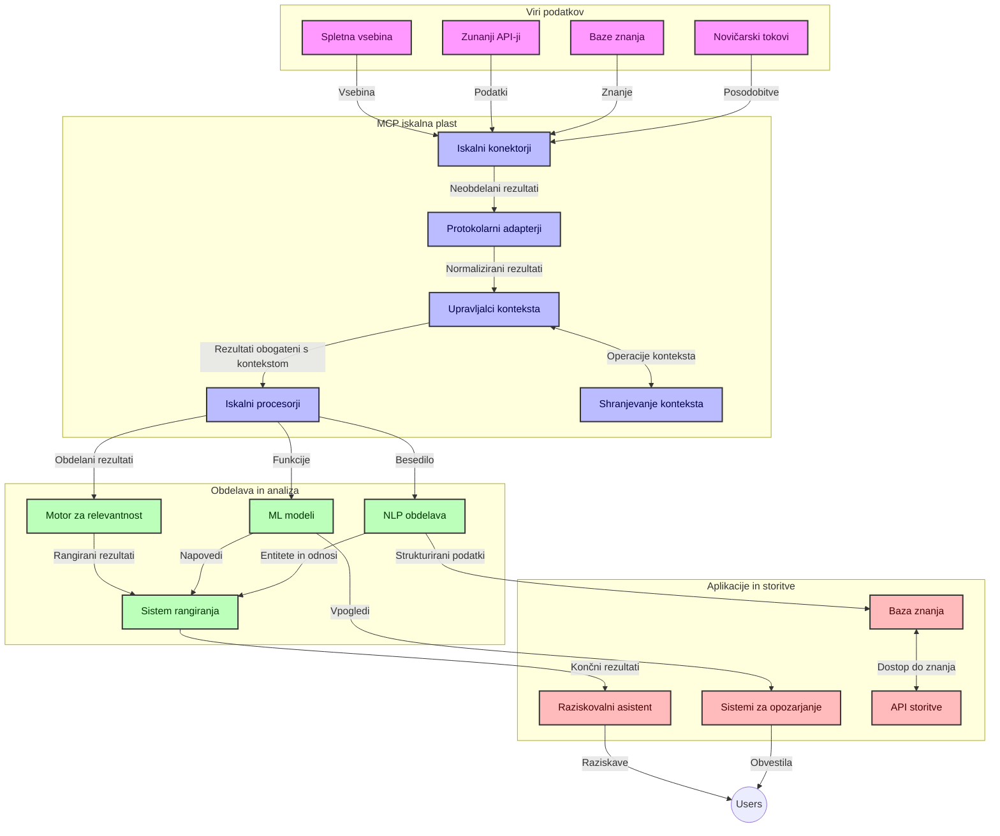
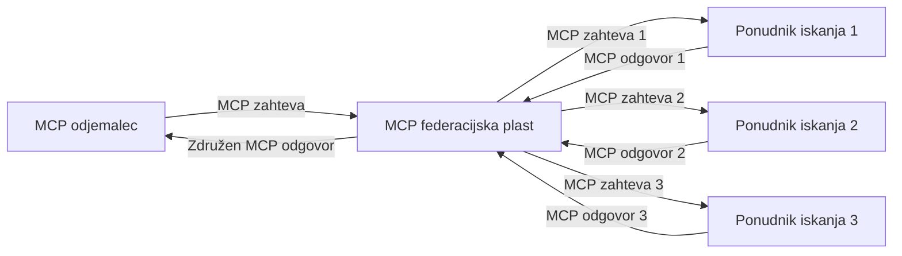
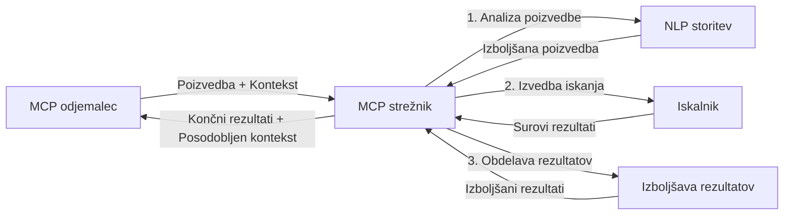

# Protokol modelnega konteksta za iskanje v spletu v realnem času

## Pregled

Iskanje po spletu v realnem času je postalo bistvenega pomena v današnjem informacijskem okolju, kjer aplikacije potrebujejo takojšen dostop do ažurnih informacij po internetu, da lahko zagotavljajo relevantne in pravočasne odgovore. Protokol modelnega konteksta (MCP) predstavlja pomemben napredek pri optimizaciji teh procesov iskanja v realnem času, izboljšanju učinkovitosti iskanja, ohranjanju kontekstualne celovitosti in izboljšanju celotne zmogljivosti sistema.

Ta modul raziskuje, kako MCP spreminja iskanje po spletu v realnem času z zagotavljanjem standardiziranega pristopa k upravljanju konteksta med AI modeli, iskalniki in aplikacijami.

### Kaj se boste naučili

V tem obsežnem vodniku boste odkrili:

- Kako MCP ustvarja neprekinjen most med AI modeli in zmogljivostmi iskanja v realnem času
- Arhitekturne vzorce za izvajanje učinkovitih in razširljivih rešitev iskanja z MCP
- Tehnike za ohranjanje konteksta iskanja skozi več poizvedb in interakcij
- Praktične implementacije kode v Pythonu in JavaScriptu za različne scenarije iskanja
- Metode za uravnoteženje relevantnosti, ažurnosti in zmogljivosti v iskalnih sistemih, ki uporabljajo MCP

## Uvod v iskanje po spletu v realnem času

Iskanje po spletu v realnem času je tehnološki pristop, ki omogoča neprekinjeno poizvedovanje, obdelavo in analizo spletnih informacij takoj, ko so objavljene ali posodobljene, kar sistemom omogoča zagotavljanje svežih in relevantnih informacij z minimalno zakasnitvijo. V nasprotju s tradicionalnimi iskalnimi sistemi, ki delujejo na indeksiranih podatkih, ki so lahko stare ure ali dni, realnočasovni postopki iskanja obdelujejo žive podatke s spleta in zagotavljajo vpoglede ter informacije, ki odražajo trenutno stanje spletne vsebine.

### Osnovni pojmi iskanja po spletu v realnem času:

- **Neprekinjena obdelava poizvedb**: Iskalne poizvedbe se obdelujejo na podlagi nenehno posodabljanih podatkovnih virov
- **Prednost svežine**: Sistemi so zasnovani tako, da dajejo prednost svežim informacijam
- **Uravnoteženje relevantnosti**: Ohranjanje ravnovesja med relevantnostjo in ažurnostjo
- **Razširljiva arhitektura**: Sistemi morajo obvladovati spremenljive obremenitve poizvedb in količine podatkov
- **Kontekstualno razumevanje**: Ohranjanje uporabniškega konteksta skozi več ciklov iskanja je ključno za smiselne rezultate
- **Dinamična preoblikovanja poizvedb**: Prilagajanje poizvedb na podlagi konteksta in prejšnjih rezultatov
- **Integracija več virov**: Združevanje rezultatov iz več ponudnikov iskanja in spletnih virov
- **Semantično razumevanje**: Obdelava poizvedb in vsebin na podlagi pomena, ne le ključnih besed
- **Realnočasovno razvrščanje**: Neprekinjeno prilagajanje uvrstitve rezultatov, ko postanejo na voljo nove informacije

### Protokol modelnega konteksta in iskanje po spletu v realnem času

Protokol modelnega konteksta (MCP) naslavlja več ključnih izzivov v okoljih iskanja po spletu v realnem času:

1. **Ohranjanje konteksta iskanja**: MCP standardizira, kako se kontekst ohranja med razpršenimi komponentami iskanja, kar zagotavlja, da imajo AI modeli in procesni vozli dostop do relevantne zgodovine poizvedb in uporabniških nastavitev.

2. **Učinkovito upravljanje poizvedb**: Z zagotavljanjem strukturiranih mehanizmov za prenos konteksta MCP zmanjšuje nepotreben ponovni prenos konteksta v vsakem ciklu iskanja.

3. **Medsebojna združljivost**: MCP ustvarja skupni jezik za deljenje konteksta med različnimi iskalnimi tehnologijami in AI modeli, kar omogoča bolj prilagodljive in razširljive arhitekture.

4. **Iskanju prilagojen kontekst**: Implementacije MCP lahko prednostno določajo, kateri elementi konteksta so najbolj pomembni za učinkovito iskanje, kar optimizira tako zmogljivost kot natančnost.

5. **Prilagodljiva obdelava iskanja**: S pravilnim upravljanjem konteksta prek MCP lahko iskalni sistemi dinamično prilagajajo obdelavo glede na spreminjajoče se potrebe uporabnikov in informacijska okolja.

V sodobnih aplikacijah, od agregatorjev novic do raziskovalnih pomočnikov, integracija MCP s spletnimi iskalnimi tehnologijami omogoča pametnejše, kontekstualno ozaveščeno iskanje, ki lahko zagotavlja vse bolj relevantne rezultate, ko interakcije uporabnikov napredujejo.

## Cilji učenja

Do konca te lekcije boste znali:

- Razumeti osnove iskanja po spletu v realnem času in njegove izzive v sodobnih aplikacijah
- Pojasniti, kako protokol modelnega konteksta (MCP) izboljšuje zmogljivosti iskanja v realnem času
- Izvajati iskalne rešitve, ki temeljijo na MCP, z uporabo priljubljenih ogrodij in API-jev
- Načrtovati in uvajati razširljive, visokozmogljive arhitekture iskanja z MCP
- Uporabljati koncepte MCP v različnih primerih, vključno s semantičnim iskanjem, raziskovalnimi pomočniki in AI-podprtimi brskalniki
- Oceniti nastajajoče trende in prihodnje inovacije v tehnologijah iskanja, ki temeljijo na MCP
- Razviti kontekstualno ozaveščene iskalne sisteme, ki se učijo iz uporabniških interakcij
- Integrirati zmogljivosti spletnega iskanja v AI pomočnike s standardiziranimi protokoli MCP
- Ustvarjati večstopenjske iskalne cevovode, ki postopoma izpopolnjujejo rezultate na podlagi konteksta
- Optimizirati zmogljivost iskanja ob hkratnem ohranjanju celovite ozaveščenosti o kontekstu

### Definicija in pomen

Iskanje po spletu v realnem času vključuje neprekinjeno poizvedovanje, pridobivanje in dostavo spletnih informacij z minimalno zakasnitvijo. V nasprotju s tradicionalnimi iskalniki, ki periodično pregledujejo in indeksirajo splet, realnočasovno iskanje stremi k prikazu informacij takoj, ko postanejo na voljo, kar omogoča takojšen dostop do najnovejše vsebine.

Ključne značilnosti iskanja po spletu v realnem času vključujejo:

- **Svežina**: Dajanje prednosti nedavni vsebini in posodobitvam
- **Neprekinjena obdelava**: Nenehno spremljanje novih informacij
- **Prilagoditev poizvedb**: Izpopolnjevanje iskalnih poizvedb glede na kontekst in povratne informacije
- **Takojšnja dostava**: Zagotavljanje rezultatov iskanja z minimalno zamudo
- **Ohranjanje konteksta**: Gradnja na prejšnjih poizvedbah za izboljšano relevantnost

### Izzivi tradicionalnega spletnega iskanja

Tradicionalni pristopi spletnega iskanja se pri uporabi v scenarijih realnega časa soočajo z več omejitvami:

1. **Fragmentacija konteksta**: Težave pri ohranjanju konteksta iskanja skozi več poizvedb
2. **Svežina informacij**: Izzivi pri dostopu do in dajanju prednosti najnovejšim informacijam
3. **Kompleksnost integracije**: Težave z interoperabilnostjo med iskalnimi sistemi in aplikacijami
4. **Težave z zakasnitvijo**: Uravnoteženje obsežnega iskanja z zahtevami po času odziva
5. **Prilagajanje relevantnosti**: Zagotavljanje natančnosti in relevantnosti med prioritetnim upoštevanjem ažurnosti

## Razumevanje protokola modelnega konteksta (MCP) za iskanje

### Kaj je MCP v kontekstih iskanja?

Protokol modelnega konteksta (MCP) je standardiziran komunikacijski protokol, zasnovan za olajšanje učinkovite interakcije med AI modeli in aplikacijami. V kontekstu iskanja po spletu v realnem času MCP zagotavlja okvir za:

- Ohranjanje konteksta iskanja skozi vrsto poizvedb
- Standardizacijo formatov iskalnih poizvedb in rezultatov
- Optimizacijo prenosa parametrov iskanja in rezultatov
- Izboljšanje komunikacije med modeli in iskalnimi sistemi

### Temeljne komponente in arhitektura

Arhitektura MCP za iskanje v realnem času obsega več ključnih komponent:

1. **Upravljavci konteksta poizvedb**: Upravljajo in vzdržujejo kontekst iskanja čez več poizvedb
2. **Procesorji iskanja**: Obdelujejo prihajajoče zahteve iskanja z uporabo tehnik, zavedajoč se konteksta
3. **Protokolni adapterji**: Pretvarjajo med različnimi iskalnimi API-ji ob ohranjanju konteksta
4. **Shramba konteksta**: Učinkovito shranjuje in pridobiva zgodovino iskanja ter nastavitve
5. **Iskalni povezovalniki**: Povezujejo se z različnimi iskalniki in spletnimi API-ji



### Kako MCP izboljšuje iskanje po spletu v realnem času

MCP naslavlja izzive tradicionalnega spletnega iskanja preko:

- **Kontekstualna kontinuiteta**: Ohranjanje povezav med poizvedbami skozi celotno sejo iskanja
- **Optimiziran prenos**: Zmanjševanje odvečnosti parametrov iskanja z inteligentnim upravljanjem konteksta
- **Standardizirani vmesniki**: Zagotavljanje doslednih API-jev za iskalne komponente
- **Zmanjšana zakasnitev**: Minimiziranje procesnega overheada z učinkovitimi metodami upravljanja konteksta
- **Izboljšana relevantnost**: Izboljšanje relevantnosti iskanja z ohranjanjem uporabniške namere skozi več poizvedb


## Integracija in implementacija

Sistemi za spletno iskanje v realnem času zahtevajo skrbno arhitekturno zasnovo in implementacijo, da ohranijo tako zmogljivost kot kontekstualno celovitost. Protokol modelnega konteksta nudi standardiziran pristop za integracijo AI modelov in iskalnih tehnologij, kar omogoča bolj sofisticirane, kontekstualno zavestne iskalne poti.

### Pregled integracije MCP v iskalnih arhitekturah

Izvedba MCP v okolju spletnega iskanja v realnem času vključuje več ključnih dejavnikov:

1. **Serijalizacija konteksta iskanja**: MCP zagotavlja učinkovite mehanizme za kodiranje kontekstualnih informacij znotraj iskalnih zahtev, s čimer zagotavlja, da bistveni kontekst spremlja poizvedbo skozi celotno obdelovalno cevovod. To vključuje standardizirane formate serializacije, optimizirane za metapodatke povezane z iskanjem.

2. **Procesiranje iskanja z ohranjanjem stanja**: MCP omogoča bolj inteligentno procesiranje z ohranjanjem dosledne predstavitve konteksta skozi več iteracij iskanja. To je posebej koristno v večstopenjskih iskalnih cevovodih, kjer izboljšave konteksta izboljšajo rezultate.

3. **Razširitev in rafinacija poizvedbe**: Implementacije MCP v iskalnih sistemih lahko omogočijo sofisticirano širitev in rafinacijo poizvedb na podlagi nabranega konteksta, kar omogoča vse bolj relevantne rezultate, ko se iskalna seja nadaljuje.

4. **Predpomnjenje in prioritetizacija rezultatov**: S standardizacijo ravnanja s kontekstom MCP pomaga upravljati predpomnjenje rezultatov in prioritetizacijo, kar omogoča komponentam, da se prilagajajo glede na spreminjajoči se kontekst iskanja.

5. **Fuzija in agregacija iskanja**: MCP olajša bolj sofisticirano federacijo iskanja prek več križnih izvorov z zagotavljanjem strukturiranih predstavitev konteksta iskanja, kar omogoča bolj smiselno agregacijo rezultatov iz raznolikih virov.

Izvedba MCP v različnih iskalnih tehnologijah ustvarja enoten pristop k upravljanju konteksta, zmanjšuje potrebo po prilagojenih integracijskih kodah hkrati pa izboljšuje zmožnost sistema za ohranjanje pomenljivega konteksta, ko se iskalne poizvedbe razvijajo.

### MCP v različnih izvedbah spletnega iskanja

Ti primeri sledijo trenutni specifikaciji MCP, ki je osredotočena na JSON-RPC temelječ protokol z različnimi transportnimi mehanizmi. Koda prikazuje, kako lahko izvedete prilagojene integracije iskanja, hkrati pa ohranite popolno združljivost s protokolom MCP.


<details>
<summary>Python implementacija z generičnim iskalnim API-jem</summary>

```python
import asyncio
import json
import aiohttp
from typing import Dict, Any, Optional, List
from contextlib import asynccontextmanager
from collections.abc import AsyncIterator

# Uvozi standardne MCP knjižnice
from mcp.client.session import ClientSession
from mcp.client.streamable_http import streamablehttp_client
from mcp.types import TextContent, CreateMessageRequestParams, CreateMessageResult
from mcp.server.fastmcp import FastMCP

# Ustvari FastMCP strežnik za spletno iskanje
search_server = FastMCP("WebSearch")

# Razred za upravljanje spletnih iskalnih operacij
class WebSearchHandler:
    def __init__(self, api_endpoint: str, api_key: str):
        self.api_endpoint = api_endpoint
        self.api_key = api_key
        self.session = None
        
    async def initialize(self):
        """Initialize the HTTP session"""
        self.session = aiohttp.ClientSession(
            headers={"Authorization": f"Bearer {self.api_key}"}
        )
    
    async def close(self):
        """Close the HTTP session"""
        if self.session:
            await self.session.close()
            
    async def perform_search(self, query: str, max_results: int = 5, 
                           include_domains: List[str] = None, 
                           exclude_domains: List[str] = None,
                           time_period: str = "any") -> Dict[str, Any]:
        """Perform web search using the search API"""
        # Sestavi parametre iskanja
        search_params = {
            "q": query,
            "limit": max_results,
            "time": time_period
        }
        
        if include_domains:
            search_params["site"] = ",".join(include_domains)
            
        if exclude_domains:
            search_params["exclude_site"] = ",".join(exclude_domains)
        
        # Izvedi zahtevo za iskanje
        try:
            async with self.session.get(
                self.api_endpoint,
                params=search_params
            ) as response:
                if response.status != 200:
                    error_text = await response.text()
                    raise Exception(f"Search API error: {response.status} - {error_text}")
                
                search_data = await response.json()
                
                # Pretvori API-specifičen odgovor v standardno obliko
                results = []
                for item in search_data.get("results", []):
                    results.append({
                        "title": item.get("title", ""),
                        "url": item.get("url", ""),
                        "snippet": item.get("snippet", ""),
                        "date": item.get("published_date", ""),
                        "source": item.get("source", "")
                    })
                
                return {
                    "query": query,
                    "totalResults": len(results),
                    "results": results
                }
        except Exception as e:
            print(f"Search API request error: {e}")
            raise

# Inicializiraj upravitelja iskanja
search_handler = WebSearchHandler(
    api_endpoint="https://api.search-service.example/search",
    api_key="your-api-key-here"
)

# Nastavi življenjsko dobo za upravljanje upravitelja iskanja
@asyncio.asynccontextmanager
async def app_lifespan(server: FastMCP):
    """Manage application lifecycle"""
    await search_handler.initialize()
    try:
        yield {"search_handler": search_handler}
    finally:
        await search_handler.close()

# Nastavi življenjsko dobo za strežnik
search_server = FastMCP("WebSearch", lifespan=app_lifespan)

# Registriraj orodje za spletno iskanje
@search_server.tool()
async def web_search(query: str, max_results: int = 5, 
                   include_domains: List[str] = None,
                   exclude_domains: List[str] = None,
                   time_period: str = "any") -> Dict[str, Any]:
    """
    Search the web for information
    
    Args:
        query: The search query
        max_results: Maximum number of results to return (default: 5)
        include_domains: List of domains to include in search results
        exclude_domains: List of domains to exclude from search results
        time_period: Time period for results ("day", "week", "month", "any")
        
    Returns:
        Dictionary containing search results
    """
    ctx = search_server.get_context()
    search_handler = ctx.request_context.lifespan_context["search_handler"]
    
    results = await search_handler.perform_search(
        query=query,
        max_results=max_results,
        include_domains=include_domains,
        exclude_domains=exclude_domains,
        time_period=time_period
    )
    
    return results

# Primer uporabe stranke
async def client_example():
    # Poveži se s strežnikom za iskanje s pomočjo Streamable HTTP prenosa
    async with streamablehttp_client("http://localhost:8000/mcp") as (read, write, _):
        async with ClientSession(read, write) as session:
            # Inicializiraj povezavo
            await session.initialize()
            
            # Pokliči orodje web_search
            search_results = await session.call_tool(
                "web_search", 
                {
                    "query": "latest developments in AI and Model Context Protocol",
                    "max_results": 5,
                    "time_period": "day",
                    "include_domains": ["github.com", "microsoft.com"]
                }
            )
            
            print(f"Search results: {search_results}")

# Primer izvajanja strežnika
if __name__ == "__main__":
    # Zaženi strežnik s Streamable HTTP prenosom
    search_server.run(transport="streamable-http")
```
</details> 

<details>
<summary>JavaScript implementacija iskanja v brskalniku</summary>


```javascript
// Implementacija MCP strežnika za spletno iskanje
import { McpServer, ResourceTemplate } from '@modelcontextprotocol/sdk/server/mcp.js';
import { StreamableHTTPServerTransport } from '@modelcontextprotocol/sdk/server/streamableHttp.js';
import { z } from 'zod';

// Ustvari MCP strežnik za spletno iskanje
const searchServer = new McpServer({
    name: "BrowserSearch",
    description: "A server that provides web search capabilities"
});

// Razred storitve iskanja
class SearchService {
    constructor(searchApiUrl, apiKey) {
        this.searchApiUrl = searchApiUrl;
        this.apiKey = apiKey;
    }

    async performSearch(parameters) {
        const {
            query = '',
            maxResults = 5,
            includeDomains = [],
            excludeDomains = [],
            timePeriod = 'any'
        } = parameters;
        
        // Sestavi URL iskanja s parametri
        const url = new URL(this.searchApiUrl);
        url.searchParams.append('q', query);
        url.searchParams.append('limit', maxResults);
        url.searchParams.append('time', timePeriod);
        
        if (includeDomains.length > 0) {
            url.searchParams.append('site', includeDomains.join(','));
        }
        
        if (excludeDomains.length > 0) {
            url.searchParams.append('exclude_site', excludeDomains.join(','));
        }
        
        try {
            const response = await fetch(url.toString(), {
                method: 'GET',
                headers: {
                    'Authorization': `Bearer ${this.apiKey}`,
                    'Content-Type': 'application/json'
                }
            });
            
            if (!response.ok) {
                const errorText = await response.text();
                throw new Error(`Search API error: ${response.status} - ${errorText}`);
            }
            
            const searchData = await response.json();
            
            // Pretvori API-specifični odgovor v standardno obliko
            const results = searchData.results?.map(item => ({
                title: item.title || '',
                url: item.url || '',
                snippet: item.snippet || '',
                date: item.published_date || '',
                source: item.source || ''
            })) || [];
            
            return {
                query,
                totalResults: results.length,
                results
            };
        } catch (error) {
            console.error('Search API request error:', error);
            throw error;
        }
    }
}

// Inicializiraj storitev iskanja
const searchService = new SearchService(
    'https://api.search-service.example/search',
    'your-api-key-here'
);

// Nastavi ponudnika konteksta za strežnik
searchServer.setContextProvider(() => {
    return {
        searchService
    };
});

// Registriraj orodje za spletno iskanje
searchServer.tool({
    name: 'web_search',
    description: 'Search the web for information',
    parameters: {
        type: 'object',
        properties: {
            query: {
                type: 'string',
                description: 'The search query'
            },
            maxResults: {
                type: 'integer',
                description: 'Maximum number of results to return',
                default: 5
            },
            includeDomains: {
                type: 'array',
                items: { type: 'string' },
                description: 'List of domains to include in search results'
            },
            excludeDomains: {
                type: 'array',
                items: { type: 'string' },
                description: 'List of domains to exclude from search results'
            },
            timePeriod: {
                type: 'string',
                description: 'Time period for results',
                enum: ['day', 'week', 'month', 'any'],
                default: 'any'
            }
        },
        required: ['query']
    },
    handler: async (params, context) => {
        const { searchService } = context;
        return await searchService.performSearch(params);
    }
});

// Primer kode odjemalca za povezavo s strežnikom za iskanje
import { Client } from '@modelcontextprotocol/sdk/client/index.js';
import { StreamableHTTPClientTransport } from '@modelcontextprotocol/sdk/client/streamableHttp.js';

async function connectToSearchServer() {
    // Poveži se s strežnikom za iskanje
    const transport = new StreamableHTTPClientTransport(
        new URL('http://localhost:8000/mcp')
    );
    
    const client = new Client({
        name: 'search-client',
        version: '1.0.0'
    });
    
    await client.connect(transport);
    
    // Izvedi orodje za iskanje
    const searchResults = await client.callTool({
        name: 'web_search',
        arguments: {
            query: 'Model Context Protocol implementation examples',
            maxResults: 10,
            timePeriod: 'week',
            includeDomains: ['github.com', 'docs.microsoft.com']
        }
    });
    
    console.log('Search results:', searchResults);
    
    // Počisti
    await client.disconnect();
}

// Zaženi strežnik
const transport = new StreamableHTTPServerTransport();
await searchServer.connect(transport);
console.log('Search server running at http://localhost:8000/mcp');

// V ločenem procesu ali po zagonu strežnika
// connectToSearchServer().catch(console.error);
```
</details> 


## Opozorilo glede primerov kode

> **Pomembna opomba**: Spodnji primeri kode prikazujejo integracijo Protokola modelnega konteksta (MCP) s funkcionalnostjo spletnega iskanja. Čeprav sledijo vzorcem in strukturam uradnih MCP SDK-jev, so poenostavljeni za izobraževalne namene.
> 
> Ti primeri prikazujejo:
> 
> 1. **Python implementacija**: FastMCP strežnik, ki zagotavlja orodje za spletno iskanje in se povezuje z zunanjim iskalnim API-jem. Ta primer prikazuje pravilno upravljanje življenjskega cikla, ravnanje s kontekstom in implementacijo orodja po vzorcih [uradnega MCP Python SDK-ja](https://github.com/modelcontextprotocol/python-sdk). Strežnik uporablja priporočeni Streamable HTTP transport, ki je nadomestil starejši SSE transport za produkcijske uvedbe.
> 
> 2. **JavaScript implementacija**: TypeScript/JavaScript implementacija z vzorcem FastMCP iz [uradnega MCP TypeScript SDK-ja](https://github.com/modelcontextprotocol/typescript-sdk) za ustvarjanje iskalnega strežnika s pravilnimi definicijami orodij in povezavami odjemalcev. Sledi najnovejšim priporočilom za upravljanje sej in ohranjanje konteksta.
> 
> Ti primeri bi za produkcijsko uporabo zahtevali dodatno ravnanje z napakami, preverjanje pristnosti in specifično kodo za integracijo API-jev. Prikazani API vmesniki za iskanje (`https://api.search-service.example/search`) so nadomestni in bi jih bilo treba zamenjati z dejanskimi končnimi točkami iskalne storitve.
> 
> Za popolne podrobnosti implementacije in najsodobnejše pristope,
> glejte [uradno MCP specifikacijo](https://modelcontextprotocol.io/specification/2026-07-28/)
> in dokumentacijo SDK-ja.

## Osnovni koncepti

### Okvir Model Context Protocol (MCP)

Na svoji osnovi Model Context Protocol nudi standardiziran način za izmenjavo konteksta med AI modeli, aplikacijami in storitvami. V spletnem iskanju v realnem času je ta okvir bistven za ustvarjanje skladnih, večkrokovnih iskalnih izkušenj. Ključne komponente vključujejo:

1. **Arhitektura klient-strežnik**: MCP vzpostavlja jasno ločitev med iskalnimi klienti (zahtevajočimi) in iskalnimi strežniki (ponudniki), kar omogoča fleksibilne modele uvajanja.

2. **JSON-RPC komunikacija**: Protokol uporablja JSON-RPC za izmenjavo sporočil, s čimer je združljiv s spletnimi tehnologijami in enostaven za implementacijo na različnih platformah.

3. **Upravljanje konteksta**: MCP definira strukturirane metode za vzdrževanje, posodabljanje in uporabo konteksta iskanja skozi več interakcij.

4. **Definicije orodij**: Iskalne zmožnosti so predstavljene kot standardizirana orodja z dobro definiranimi parametri in vrnjenimi vrednostmi.

5. **Podpora pretakanju**: Protokol podpira pretakanje rezultatov, kar je ključno za iskanje v realnem času, kjer rezultati lahko prihajajo postopoma.

### Vzorci integracije spletnega iskanja

Pri integraciji MCP s spletnim iskanjem se pojavi več vzorcev:

#### 1. Neposredna integracija ponudnika iskanja


V tem vzorcu MCP strežnik neposredno komunicira z enim ali več iskalnimi API-ji, pretvarja MCP zahteve v API-specifične klice in oblikuje rezultate kot odgovore MCP.

#### 2. Federirano iskanje z ohranjanjem konteksta



Ta vzorec razdeli iskalne poizvedbe med več MCP-združljivih ponudnikov iskanja, ki se lahko specializirajo za različne vrste vsebin ali iskalne zmožnosti, hkrati pa ohranja enoten kontekst.

#### 3. Iskalni verižni proces z izboljšanim kontekstom



V tem vzorcu je iskalni proces razdeljen na več stopenj, pri čemer se kontekst bogati v vsakem koraku, kar privede do postopoma bolj relevantnih rezultatov.

### Komponente konteksta iskanja

V MCP osnovanem spletnem iskanju kontekst običajno vključuje:

- **Zgodovina poizvedb**: Prejšnje iskalne poizvedbe v seji
- **Uporabniške preference**: Jezik, regija, nastavitve varnega iskanja
- **Zgodovina interakcij**: Kateri rezultati so bili kliknjeni, čas preživet na rezultatih
- **Iskalni parametri**: Filtri, vrstni redi in drugi modifikatorji iskanja
- **Področno znanje**: Predmetno specifičen kontekst, relevanten za iskanje
- **Časovni kontekst**: Časovni dejavniki pomembnosti
- **Preference virov**: Zanesljivi ali prednostni informacijski viri

## Primeri uporabe in aplikacije

### Raziskave in zbiranje informacij

MCP izboljšuje poteke raziskav z:

- Ohranjanjem raziskovalnega konteksta skozi iskalne seje
- Omogočanjem bolj sofisticiranih in kontekstualno relevantnih poizvedb
- Podporo federaciji iskanja iz več virov
- Olajšanjem izvlečka znanja iz iskalnih rezultatov

### Spremljanje novic in trendov v realnem času

Iskanje podprto z MCP ponuja prednosti za spremljanje novic:

- Skoraj v realnem času odkrivanje nastajajočih novičarskih zgodb
- Kontekstualno filtriranje relevantnih informacij
- Sledenje temam in entitetam prek več virov
- Personalizirana novičarska opozorila na podlagi uporabniškega konteksta

### Brskanje in raziskovanje z dodatki AI

MCP ustvarja nove možnosti za AI podprto brskanje:

- Kontekstualni predlogi iskanja na podlagi trenutnih aktivnosti v brskalniku
- Gladko združevanje spletnega iskanja z asistenti, ki jih poganjajo veliki jezikovni modeli (LLM)
- Večkrožno rafiniranje iskanja z ohranjenim kontekstom
- Izboljšano preverjanje dejstev in verifikacijo informacij

## Prihodnji trendi in inovacije

### Razvoj MCP v spletnem iskanju

V prihodnosti pričakujemo, da se bo MCP razvijal za:


- **Multimodalno iskanje**: Integracija iskanja besedil, slik, zvoka in videa s ohranjenim kontekstom
- **Decentralizirano iskanje**: Podpora distribuiranim in federiranim iskalnim ekosistemom
- **Zasebnost iskanja**: Mehanizmi iskanja, ki ohranjajo zasebnost in so zavedni konteksta
- **Razumevanje poizvedb**: Globoka semantična analiza poizvedb v naravnem jeziku

### Potencialni napredki v tehnologiji

Nove tehnologije, ki bodo oblikovale prihodnost MCP iskanja:

1. **Nevronske iskalne arhitekture**: Iskalni sistemi, ki temeljijo na vgradnji, optimizirani za MCP
2. **Personaliziran kontekst iskanja**: Učenje posameznikovih vzorcev iskanja skozi čas
3. **Integracija znanstvenih grafov**: Kontekstualno iskanje, izboljšano z domenovno specifičnimi znanstvenimi grafi
4. **Medmodalni kontekst**: Ohranjanje konteksta med različnimi modalitetami iskanja

## Praktične vaje

### Naloga 1: Nastavitev osnovnega MCP iskalnega sistema

V tej nalogi se boste naučili:
- Konfigurirati osnovno MCP iskalno okolje
- Izvesti upravljalce konteksta za spletno iskanje
- Testirati in potrditi ohranjanje konteksta skozi različne ponovitve iskanja

### Naloga 2: Izgradnja raziskovalnega pomočnika z MCP iskanjem

Ustvarite celovito aplikacijo, ki:
- Obdeluje raziskovalna vprašanja v naravnem jeziku
- Izvaja iskanje po spletu, ki upošteva kontekst
- Sintezo informacij iz več virov
- Predstavlja organizirane raziskovalne ugotovitve

### Naloga 3: Implementacija federacije iskanja z več viri z MCP

Napredna naloga, ki zajema:
- Kontekstualno usmerjanje poizvedb večim iskalnikom
- Rangiranje in združevanje rezultatov
- Kontekstualno odstranjevanje podvojenih rezultatov iskanja
- Upravljanje z metapodatki, specifičnimi za posamezen vir

## Dodatni viri

- [Specifikacija Model Context Protocol](https://modelcontextprotocol.io/specification/2026-07-28/) - Uradna specifikacija MCP in podrobna dokumentacija protokola
- [Dokumentacija Model Context Protocol](https://modelcontextprotocol.io/) - Podrobni vodiči in navodila za implementacijo
- [MCP Python SDK](https://github.com/modelcontextprotocol/python-sdk) - Uradna Python implementacija MCP protokola
- [MCP TypeScript SDK](https://github.com/modelcontextprotocol/typescript-sdk) - Uradna TypeScript implementacija MCP protokola
- [MCP referenčni strežniki](https://github.com/modelcontextprotocol/servers) - Referenčne implementacije MCP strežnikov
- [Dokumentacija Bing Web Search API](https://learn.microsoft.com/en-us/bing/search-apis/bing-web-search/overview) - Microsoftov spletni iskalni API
- [Google Custom Search JSON API](https://developers.google.com/custom-search/v1/overview) - Programabilni iskalnik Googla
- [SerpAPI Dokumentacija](https://serpapi.com/search-api) - API za rezultate iskalnikov
- [Dokumentacija Meilisearch](https://www.meilisearch.com/docs) - Iskalnik z odprto kodo
- [Dokumentacija Elasticsearch](https://www.elastic.co/guide/index.html) - Razpršen iskalnik in analitični motor
- [Dokumentacija LangChain](https://python.langchain.com/docs/get_started/introduction) - Izgradnja aplikacij z LLM-ji

## Cilji učenja

Z dokončanjem tega modula boste sposobni:

- Razumeti osnove realnočasovnega spletnega iskanja in njegove izzive
- Razložiti, kako Model Context Protocol (MCP) izboljšuje zmogljivosti realnočasovnega spletnega iskanja
- Izvajati iskalne rešitve, ki temeljijo na MCP, z uporabo priljubljenih okvirjev in API-jev
- Načrtovati in uvajati razširljive, zmogljive iskalne arhitekture z MCP
- Uporabiti koncepte MCP v različnih primerih uporabe, vključno s semantičnim iskanjem, raziskovalno pomočjo in brskanjem, obogatenim z AI
- Oceniti nastajajoče trende in prihodnje inovacije v tehnologijah iskanja, ki temeljijo na MCP


### Razmisleki o zaupanju in varnosti

Pri izvajanju MCP-baziranih spletnih iskalnih rešitev upoštevajte naslednja pomembna načela iz MCP specifikacije:

1. **Soglasje in nadzor uporabnika**: Uporabniki morajo izrecno soglašati in razumeti vse dostope do podatkov in operacije. To je posebej pomembno pri spletnih iskanjih, ki lahko dostopajo do zunanjih virov podatkov.

2. **Zasebnost podatkov**: Zagotovite ustrezno ravnanje s poizvedbami in rezultati iskanja, zlasti če lahko vsebujejo občutljive informacije. Izvedite primerne nadzore dostopa za zaščito uporabniških podatkov.

3. **Varnost orodij**: Izvedite ustrezno avtentikacijo in validacijo iskalnih orodij, saj predstavljajo potencialne varnostne nevarnosti zaradi izvedbe poljubne kode. Opisi vedenja orodij naj se smatrajo nezaupljivi, razen če so pridobljeni s strani zaupanja vrednega strežnika.

4. **Jasna dokumentacija**: Zagotovite jasno dokumentacijo o zmožnostih, omejitvah in varnostnih vidikih vaše MCP-bazirane implementacije iskanja v skladu z navodili MCP specifikacije.

5. **Zanesljivi postopki soglasij**: Zgradite robustne postopke soglasij in avtorizacije, ki jasno pojasnijo funkcije posameznih orodij pred njihovim dovoljenjem, še posebej za orodja, ki delujejo z zunanjimi spletnimi viri.

Za popolne podrobnosti o varnosti in zaupanju MCP si oglejte
[uradno dokumentacijo](https://modelcontextprotocol.io/specification/2026-07-28/basic/security_best_practices).

## Kaj sledi 

- [5.12 Avtentikacija Entra ID za Model Context Protocol strežnike](../mcp-security-entra/README.md)

---

<!-- CO-OP TRANSLATOR DISCLAIMER START -->
**Omejitev odgovornosti**:
Ta dokument je bil preveden z uporabo AI prevajalske storitve [Co-op Translator](https://github.com/Azure/co-op-translator). Čeprav si prizadevamo za natančnost, vas prosimo, da upoštevate, da avtomatizirani prevodi lahko vsebujejo napake ali netočnosti. Izvirni dokument v njegovem izvirnem jeziku je treba obravnavati kot avtoritativni vir. Za kritične informacije je priporočljiv strokovni človeški prevod. Ne odgovarjamo za morebitna nesporazume ali napačne interpretacije, ki izhajajo iz uporabe tega prevoda.
<!-- CO-OP TRANSLATOR DISCLAIMER END -->