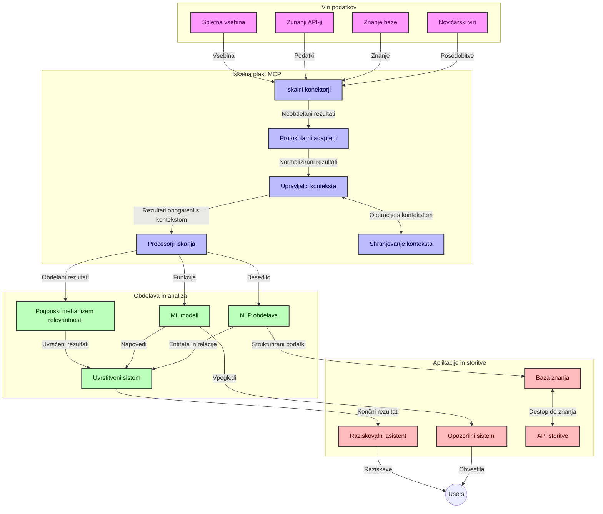
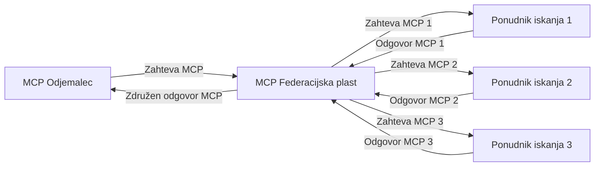
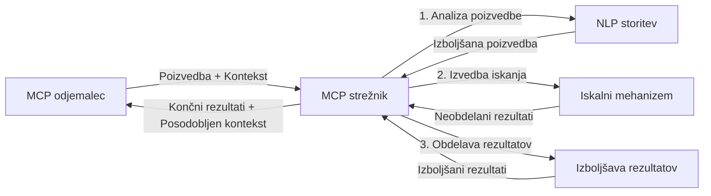

# Protokol konteksta modela za iskanje po spletu v realnem času

## Pregled

Iskanje po spletu v realnem času je postalo ključnega pomena v današnjem informacijskem okolju, kjer aplikacije potrebujejo takojšen dostop do posodobljenih informacij po celotnem internetu, da zagotavljajo relevantne in pravočasne odzive. Protokol konteksta modela (MCP) predstavlja pomemben napredek pri optimizaciji teh procesov iskanja v realnem času, izboljšanju učinkovitosti iskanja, ohranjanju kontekstualne integritete in izboljšanju splošne zmogljivosti sistema.

Ta modul raziskuje, kako MCP preoblikuje iskanje po spletu v realnem času z zagotavljanjem standardiziranega pristopa k upravljanju konteksta med AI modeli, iskalniki in aplikacijami.

### Kaj boste spoznali

V tem celovitem vodniku boste odkrili:

- Kako MCP ustvarja nemoten most med AI modeli in zmožnostmi iskanja po spletu v realnem času
- Arhitekturne vzorce za implementacijo učinkovitih in razširljivih rešitev iskanja z MCP
- Tehnike ohranjanja konteksta iskanja skozi več poizvedb in interakcij
- Praktične implementacije kode v Pythonu in JavaScriptu za različne scenarije iskanja
- Metode za uravnoteženje relevantnosti, svežine in zmogljivosti v sistemih iskanja, podprtih z MCP

## Uvod v iskanje po spletu v realnem času

Iskanje po spletu v realnem času je tehnološki pristop, ki omogoča neprekinjeno poizvedovanje, obdelavo in analizo spletnih informacij takoj, ko so objavljene ali posodobljene, kar omogoča sistemom zagotavljanje svežih in relevantnih informacij z minimalno zakasnitvijo. Za razliko od tradicionalnih iskalnih sistemov, ki delujejo na indeksiranih podatkih, ki so lahko stare ure ali dnevi, procesi iskanja v realnem času obdelujejo žive podatke s spleta in zagotavljajo vpoglede in informacije, ki odražajo trenutni status spletne vsebine.

### Osnovni pojmi iskanja po spletu v realnem času:

- **Neprekinjena obdelava poizvedb**: Poizvedbe se obdelujejo na podatkovnih virih, ki se nenehno posodabljajo
- **Prednost svežine**: Sistemi so zasnovani tako, da dajejo prednost svežim informacijam
- **Uravnoteženost relevantnosti**: Ohranjanje ravnovesja med relevantnostjo in svežino
- **Razširljiva arhitektura**: Sistemi morajo obvladovati spremenljive obremenitve poizvedb in obsege podatkov
- **Kontekstualno razumevanje**: Ohranjanje uporabnikovega konteksta skozi več ciklov iskanja je ključno za smiselne rezultate
- **Dinamična reformulacija poizvedb**: Prilagodljivo spreminjanje poizvedb glede na kontekst in prejšnje rezultate
- **Integracija več virov**: Združevanje rezultatov iz več iskalnih ponudnikov in spletnih virov
- **Semantično razumevanje**: Obdelava poizvedb in vsebin na podlagi pomena in ne le ključnih besed
- **Razvrščanje v realnem času**: Neprekinjeno prilagajanje uvrstitev rezultatov, ko so na voljo nove informacije

### Protokol konteksta modela in iskanje po spletu v realnem času

Protokol konteksta modela (MCP) rešuje več ključnih izzivov v okoljih iskanja po spletu v realnem času:

1. **Ohranjanje konteksta iskanja**: MCP standardizira način ohranjanja konteksta med porazdeljenimi iskalnimi komponentami, kar zagotavlja, da imajo AI modeli in obdelovalni vozli dostop do relevantne zgodovine poizvedb in uporabniških preferenc.

2. **Učinkovito upravljanje poizvedb**: Z zagotavljanjem strukturiranih mehanizmov za prenos konteksta MCP zmanjšuje navlako ponavljanja konteksta v vsaki iteraciji iskanja.

3. **Medsebojna delovanje**: MCP ustvarja skupni jezik za deljenje konteksta med različnimi iskalnimi tehnologijami in AI modeli, kar omogoča bolj prilagodljive in razširljive arhitekture.

4. **Za iskanje optimiziran kontekst**: Implementacije MCP lahko določijo, kateri kontekstni elementi so najbolj relevantni za učinkovito iskanje, kar optimizira tako zmogljivost kot natančnost.

5. **Prilagodljiva obdelava iskanja**: Z ustreznim upravljanjem konteksta preko MCP lahko iskalni sistemi dinamično prilagajajo obdelavo glede na spreminjajoče se potrebe uporabnikov in informacije.

V sodobnih aplikacijah, od zbiranja novic do raziskovalnih pomočnikov, integracija MCP s tehnologijami iskanja omogoča bolj inteligentno, kontekstualno zavedno iskanje, ki lahko zagotovi vse bolj relevantne rezultate, ko se uporabniške interakcije nadaljujejo.

## Cilji učenja

Ob koncu te lekcije boste lahko:

- Razumeli temelje iskanja po spletu v realnem času in njegove izzive v sodobnih aplikacijah
- Razložili, kako Protokol konteksta modela (MCP) izboljšuje zmožnosti iskanja po spletu v realnem času
- Implementirali rešitve za iskanje na osnovi MCP z uporabo priljubljenih ogrodij in API-jev
- Oblikovali in uvajali razširljive, zmogljive arhitekture iskanja z MCP
- Uporabili koncept MCP v različnih primerih uporabe, vključno s semantičnim iskanjem, raziskovalno pomočjo in AI-podprtim brskanjem
- Ocenili nove trende in prihodnje inovacije v tehnologijah iskanja na osnovi MCP
- Razvili sisteme iskanja, zavedne konteksta, ki se učijo iz uporabniških interakcij
- Integrirali zmožnosti spletnega iskanja v AI asistente z uporabo standardiziranih MCP protokolov
- Ustvarili večstopenjske iskalne tokove, ki postopoma izpopolnjujejo rezultate glede na kontekst
- Optimizirali zmogljivost iskanja ob ohranjanju celovite zavednosti konteksta

### Definicija in pomen

Iskanje po spletu v realnem času vključuje neprekinjeno poizvedovanje, pridobivanje in dostavljanje spletnih informacij z minimalno zakasnitvijo. Za razliko od tradicionalnih iskalnikov, ki občasno prečkajo splet in ga indeksirajo, je cilj iskanja v realnem času takojšnje prikazovanje informacij takoj, ko so na voljo, kar omogoča takojšen dostop do najbolj aktualnih vsebin.

Ključne značilnosti iskanja po spletu v realnem času vključujejo:

- **Svežina**: Prednost nedavnih vsebin in posodobitev
- **Neprekinjena obdelava**: Stalno spremljanje novih informacij
- **Prilagoditev poizvedb**: Izpopolnjevanje iskalnih poizvedb glede na kontekst in povratne informacije
- **Takojšnja dostava**: Zagotavljanje rezultatov iskanja z minimalno zamudo
- **Ohranjanje konteksta**: Gradnja na prejšnjih poizvedbah za izboljšano relevantnost

### Izzivi tradicionalnega spletnega iskanja

Tradicionalni pristopi spletnega iskanja se soočajo z več omejitvami, ko jih uporabljamo v realnem času:

1. **Fragmentacija konteksta**: Težave pri ohranjanju konteksta iskanja skozi več poizvedb
2. **Svežina informacij**: Izzivi pri dostopu in prioritizaciji najsodobnejših informacij
3. **Zapletenost integracije**: Težave z medsebojnim delovanjem med iskalnimi sistemi in aplikacijami
4. **Težave z zakasnitvijo**: Uravnoteženje celovitega iskanja z zahtevami po odzivnem času
5. **Nastavitev relevantnosti**: Zagotavljanje natančnosti in relevantnosti ob prednostni obravnavi svežine

## Razumevanje Protokola konteksta modela (MCP) za iskanje

### Kaj je MCP v kontekstih iskanja?

Protokol konteksta modela (MCP) je standardiziran komunikacijski protokol, zasnovan za olajšanje učinkovitega sodelovanja med AI modeli in aplikacijami. V kontekstu iskanja po spletu v realnem času MCP ponuja okvir za:

- Ohranjanje konteksta iskanja skozi zaporedja poizvedb
- Standardizacijo formatov iskalnih poizvedb in rezultatov
- Optimizacijo prenosa parametrov in rezultatov iskanja
- Izboljšanje komunikacije med modeli in iskalniki

### Osnovne komponente in arhitektura

Arhitektura MCP za iskanje po spletu v realnem času sestoji iz več ključnih komponent:

1. **Upravitelji konteksta poizvedb**: Upravljajo in ohranjajo kontekst iskanja skozi več poizvedb
2. **Iskalni procesorji**: Obdelujejo vhodne iskalne zahteve z uporabo tehnik, ki se zavedajo konteksta
3. **Protokolni adapterji**: Pretvarjajo med različnimi iskalnimi API-ji ob ohranjanju konteksta
4. **Shramba konteksta**: Učinkovito shranjuje in pridobiva zgodovino iskanja in preference
5. **Iskalni povezovalniki**: Povezujejo se z različnimi iskalniki in spletnimi API-ji



### Kako MCP izboljšuje iskanje po spletu v realnem času

MCP rešuje izzive tradicionalnega spletnega iskanja skozi:

- **Kontekstualno kontinuiteto**: Ohranjanje povezav med poizvedbami skozi celotno sejo iskanja
- **Optimiziran prenos**: Zmanjšanje podvajanja v iskalnih parametrih z inteligentnim upravljanjem konteksta
- **Standardizirane vmesnike**: Zagotavljanje konsistentnih API-jev za iskalne komponente
- **Zmanjšano zakasnitev**: Minimizacija režijskih stroškov obdelave z učinkovitim upravljanjem konteksta
- **Izboljšana relevantnost**: Izboljšanje relevantnosti iskanja z ohranjanjem uporabniških namenov skozi več poizvedb

## Integracija in implementacija

Sistemi iskanja po spletu v realnem času zahtevajo skrbno arhitekturno zasnovo in izvedbo, da ohranijo tako zmogljivost kot kontekstualno integriteto. Protokol konteksta modela ponuja standardiziran pristop k integraciji AI modelov in iskalnih tehnologij, kar omogoča bolj sofisticirane, kontekstualno zavedne iskalne tokove.

### Pregled integracije MCP v iskalne arhitekture

Implementacija MCP v okoljih iskanja po spletu v realnem času vključuje več ključnih premislekov:

1. **Seralizacija konteksta iskanja**: MCP zagotavlja učinkovite mehanizme za kodiranje kontekstualnih informacij znotraj iskalnih zahtev, s čimer zagotavlja, da ključni kontekst spremlja poizvedbo skozi obdelovalni tok. To vključuje standardizirane formate seralizacije, optimizirane za metapodatke, povezane z iskanjem.

2. **Državna obdelava iskanja**: MCP omogoča inteligentnejšo obdelavo s stanjem z ohranjanjem dosledne reprezentacije konteksta skozi več iteracij iskanja. To je še posebej dragoceno v večstopenjskih iskalnih tokovih, kjer izboljšava konteksta izboljšuje rezultate.

3. **Razširjanje in izpopolnjevanje poizvedb**: Implementacije MCP v iskalnih sistemih lahko omogočajo sofisticirano razširjanje in izpopolnjevanje poizvedb na podlagi akumuliranega konteksta, kar omogoča vse bolj relevantne rezultate skozi iskalno sejo.

4. **Predpomnjenje in prioritizacija rezultatov**: Z zagotavljanjem standardiziranega upravljanja konteksta MCP pomaga upravljati predpomnjenje in prioritetno razvrščanje rezultatov, kar omogoča komponentam prilagoditev glede na spreminjajoči se kontekst iskanja.

5. **Iskalna federacija in agregacija**: MCP omogoča bolj sofisticirano federacijo iskanja prek več backendov z zagotavljanjem strukturiranih reprezentacij konteksta iskanja, kar omogoča bolj smiselno agregacijo rezultatov iz različnih virov.

Implementacija MCP prek različnih iskalnih tehnologij ustvarja enoten pristop k upravljanju konteksta, zmanjšuje potrebo po prilagojeni kodi za integracijo in hkrati izboljšuje sposobnost sistema, da ohrani smiseln kontekst, ko se poizvedbe spreminjajo.

### MCP v različnih implementacijah spletnega iskanja

Ti primeri sledijo trenutni specifikaciji MCP, ki se osredotoča na protokol, osnovan na JSON-RPC, z različnimi mehanizmi transporta. Koda prikazuje, kako lahko implementirate lastne integracije iskanja ob ohranjanju popolne združljivosti s protokolom MCP.


<details>
<summary>Implementacija v Pythonu z generičnim iskalnim API-jem</summary>

```python
import asyncio
import json
import aiohttp
from typing import Dict, Any, Optional, List
from contextlib import asynccontextmanager
from collections.abc import AsyncIterator

# Uvozi standardne knjižnice MCP
from mcp.client.session import ClientSession
from mcp.client.streamable_http import streamablehttp_client
from mcp.types import TextContent, CreateMessageRequestParams, CreateMessageResult
from mcp.server.fastmcp import FastMCP

# Ustvari FastMCP strežnik za spletno iskanje
search_server = FastMCP("WebSearch")

# Razred za upravljanje operacij spletnega iskanja
class WebSearchHandler:
    def __init__(self, api_endpoint: str, api_key: str):
        self.api_endpoint = api_endpoint
        self.api_key = api_key
        self.session = None
        
    async def initialize(self):
        """Initialize the HTTP session"""
        self.session = aiohttp.ClientSession(
            headers={"Authorization": f"Bearer {self.api_key}"}
        )
    
    async def close(self):
        """Close the HTTP session"""
        if self.session:
            await self.session.close()
            
    async def perform_search(self, query: str, max_results: int = 5, 
                           include_domains: List[str] = None, 
                           exclude_domains: List[str] = None,
                           time_period: str = "any") -> Dict[str, Any]:
        """Perform web search using the search API"""
        # Sestavi parametre iskanja
        search_params = {
            "q": query,
            "limit": max_results,
            "time": time_period
        }
        
        if include_domains:
            search_params["site"] = ",".join(include_domains)
            
        if exclude_domains:
            search_params["exclude_site"] = ",".join(exclude_domains)
        
        # Izvedi zahtevo po iskanju
        try:
            async with self.session.get(
                self.api_endpoint,
                params=search_params
            ) as response:
                if response.status != 200:
                    error_text = await response.text()
                    raise Exception(f"Search API error: {response.status} - {error_text}")
                
                search_data = await response.json()
                
                # Pretvori API-specifičen odgovor v standardno obliko
                results = []
                for item in search_data.get("results", []):
                    results.append({
                        "title": item.get("title", ""),
                        "url": item.get("url", ""),
                        "snippet": item.get("snippet", ""),
                        "date": item.get("published_date", ""),
                        "source": item.get("source", "")
                    })
                
                return {
                    "query": query,
                    "totalResults": len(results),
                    "results": results
                }
        except Exception as e:
            print(f"Search API request error: {e}")
            raise

# Inicializiraj upravljalnik iskanja
search_handler = WebSearchHandler(
    api_endpoint="https://api.search-service.example/search",
    api_key="your-api-key-here"
)

# Nastavi življenjsko dobo za upravljanje upravljalnika iskanja
@asyncio.asynccontextmanager
async def app_lifespan(server: FastMCP):
    """Manage application lifecycle"""
    await search_handler.initialize()
    try:
        yield {"search_handler": search_handler}
    finally:
        await search_handler.close()

# Nastavi življenjsko dobo za strežnik
search_server = FastMCP("WebSearch", lifespan=app_lifespan)

# Registriraj orodje za spletno iskanje
@search_server.tool()
async def web_search(query: str, max_results: int = 5, 
                   include_domains: List[str] = None,
                   exclude_domains: List[str] = None,
                   time_period: str = "any") -> Dict[str, Any]:
    """
    Search the web for information
    
    Args:
        query: The search query
        max_results: Maximum number of results to return (default: 5)
        include_domains: List of domains to include in search results
        exclude_domains: List of domains to exclude from search results
        time_period: Time period for results ("day", "week", "month", "any")
        
    Returns:
        Dictionary containing search results
    """
    ctx = search_server.get_context()
    search_handler = ctx.request_context.lifespan_context["search_handler"]
    
    results = await search_handler.perform_search(
        query=query,
        max_results=max_results,
        include_domains=include_domains,
        exclude_domains=exclude_domains,
        time_period=time_period
    )
    
    return results

# Primer uporabe odjemalca
async def client_example():
    # Poveži se s strežnikom za iskanje z uporabo Streamable HTTP transporta
    async with streamablehttp_client("http://localhost:8000/mcp") as (read, write, _):
        async with ClientSession(read, write) as session:
            # Inicializiraj povezavo
            await session.initialize()
            
            # Pokliči orodje web_search
            search_results = await session.call_tool(
                "web_search", 
                {
                    "query": "latest developments in AI and Model Context Protocol",
                    "max_results": 5,
                    "time_period": "day",
                    "include_domains": ["github.com", "microsoft.com"]
                }
            )
            
            print(f"Search results: {search_results}")

# Primer zagona strežnika
if __name__ == "__main__":
    # Zaženi strežnik s Streamable HTTP transportom
    search_server.run(transport="streamable-http")
```
</details> 

<details>
<summary>Implementacija v JavaScriptu z iskanjem v brskalniku</summary>


```javascript
// Implementacija MCP strežnika za spletno iskanje
import { McpServer, ResourceTemplate } from '@modelcontextprotocol/sdk/server/mcp.js';
import { StreamableHTTPServerTransport } from '@modelcontextprotocol/sdk/server/streamableHttp.js';
import { z } from 'zod';

// Ustvari MCP strežnik za spletno iskanje
const searchServer = new McpServer({
    name: "BrowserSearch",
    description: "A server that provides web search capabilities"
});

// Razred storitve iskanja
class SearchService {
    constructor(searchApiUrl, apiKey) {
        this.searchApiUrl = searchApiUrl;
        this.apiKey = apiKey;
    }

    async performSearch(parameters) {
        const {
            query = '',
            maxResults = 5,
            includeDomains = [],
            excludeDomains = [],
            timePeriod = 'any'
        } = parameters;
        
        // Sestavi URL iskanja s parametri
        const url = new URL(this.searchApiUrl);
        url.searchParams.append('q', query);
        url.searchParams.append('limit', maxResults);
        url.searchParams.append('time', timePeriod);
        
        if (includeDomains.length > 0) {
            url.searchParams.append('site', includeDomains.join(','));
        }
        
        if (excludeDomains.length > 0) {
            url.searchParams.append('exclude_site', excludeDomains.join(','));
        }
        
        try {
            const response = await fetch(url.toString(), {
                method: 'GET',
                headers: {
                    'Authorization': `Bearer ${this.apiKey}`,
                    'Content-Type': 'application/json'
                }
            });
            
            if (!response.ok) {
                const errorText = await response.text();
                throw new Error(`Search API error: ${response.status} - ${errorText}`);
            }
            
            const searchData = await response.json();
            
            // Pretvori API-specifičen odgovor v standardno obliko
            const results = searchData.results?.map(item => ({
                title: item.title || '',
                url: item.url || '',
                snippet: item.snippet || '',
                date: item.published_date || '',
                source: item.source || ''
            })) || [];
            
            return {
                query,
                totalResults: results.length,
                results
            };
        } catch (error) {
            console.error('Search API request error:', error);
            throw error;
        }
    }
}

// Inicializiraj storitev iskanja
const searchService = new SearchService(
    'https://api.search-service.example/search',
    'your-api-key-here'
);

// Nastavi ponudnika konteksta za strežnik
searchServer.setContextProvider(() => {
    return {
        searchService
    };
});

// Registriraj orodje za spletno iskanje
searchServer.tool({
    name: 'web_search',
    description: 'Search the web for information',
    parameters: {
        type: 'object',
        properties: {
            query: {
                type: 'string',
                description: 'The search query'
            },
            maxResults: {
                type: 'integer',
                description: 'Maximum number of results to return',
                default: 5
            },
            includeDomains: {
                type: 'array',
                items: { type: 'string' },
                description: 'List of domains to include in search results'
            },
            excludeDomains: {
                type: 'array',
                items: { type: 'string' },
                description: 'List of domains to exclude from search results'
            },
            timePeriod: {
                type: 'string',
                description: 'Time period for results',
                enum: ['day', 'week', 'month', 'any'],
                default: 'any'
            }
        },
        required: ['query']
    },
    handler: async (params, context) => {
        const { searchService } = context;
        return await searchService.performSearch(params);
    }
});

// Primer odjemalske kode za povezavo na strežnik iskanja
import { Client } from '@modelcontextprotocol/sdk/client/index.js';
import { StreamableHTTPClientTransport } from '@modelcontextprotocol/sdk/client/streamableHttp.js';

async function connectToSearchServer() {
    // Poveži se s strežnikom iskanja
    const transport = new StreamableHTTPClientTransport(
        new URL('http://localhost:8000/mcp')
    );
    
    const client = new Client({
        name: 'search-client',
        version: '1.0.0'
    });
    
    await client.connect(transport);
    
    // Izvedi orodje za iskanje
    const searchResults = await client.callTool({
        name: 'web_search',
        arguments: {
            query: 'Model Context Protocol implementation examples',
            maxResults: 10,
            timePeriod: 'week',
            includeDomains: ['github.com', 'docs.microsoft.com']
        }
    });
    
    console.log('Search results:', searchResults);
    
    // Očisti
    await client.disconnect();
}

// Zaženi strežnik
const transport = new StreamableHTTPServerTransport();
await searchServer.connect(transport);
console.log('Search server running at http://localhost:8000/mcp');

// V ločenem procesu ali po zagonu strežnika
// connectToSearchServer().catch(console.error);
```
</details> 


## Opozorilo glede primerov kode

> **Pomembno obvestilo**: Spodnji primeri kode prikazujejo integracijo Protokola konteksta modela (MCP) z funkcionalnostjo spletnega iskanja. Čeprav sledijo vzorcem in strukturi uradnih MCP SDK-jev, so za namene izobraževanja poenostavljeni.
> 
> Ti primeri prikazujejo:
> 
> 1. **Implementacija v Pythonu**: Implementacija strežnika FastMCP, ki zagotavlja orodje za spletno iskanje in se poveže z zunanjim iskalnim API-jem. Ta primer prikazuje pravilno upravljanje življenjske dobe, upravljanje konteksta in implementacijo orodij po vzorcih [uradnega MCP Python SDK](https://github.com/modelcontextprotocol/python-sdk). Strežnik uporablja priporočeni transport Streamable HTTP, ki je nadomestil starejši SSE transport za produkcijske uvedbe.
> 
> 2. **Implementacija v JavaScriptu**: Implementacija v TypeScriptu/JavaScriptu z uporabo vzorca FastMCP iz [uradnega MCP TypeScript SDK](https://github.com/modelcontextprotocol/typescript-sdk) za ustvarjanje iskalnega strežnika s pravilno definicijo orodij in povezavami s stranko. Sledi najnovejšim priporočenim vzorcem za upravljanje sej in ohranjanje konteksta.
> 
> Ti primeri bi v produkcijski uporabi zahtevali dodatno upravljanje napak, avtentikacijo in specifično integracijo API-jev. Prikazane iskalne API končne točke (`https://api.search-service.example/search`) so nadomestne in jih je treba zamenjati z dejanskimi iskalnimi storitvami.
> 
> Za popolne podrobnosti implementacije in najnovejše pristope prosimo, da si ogledate [uradno specifikacijo MCP](https://spec.modelcontextprotocol.io/) in dokumentacijo SDK.

## Osnovni pojmi

### Okvir Protokola konteksta modela (MCP)

Protokol konteksta modela na osnovi je standardiziran način, kako lahko AI modeli, aplikacije in storitve izmenjujejo kontekst. V iskanju po spletu v realnem času je ta okvir bistven za ustvarjanje koherentnih, večkratih iskalnih izkušenj. Ključne komponente vključujejo:

1. **Arhitektura klient-strežnik**: MCP vzpostavlja jasno ločnico med iskalnimi odjemalci (zahtevalci) in iskalnimi strežniki (ponudniki), kar omogoča prilagodljive modele uvajanja.

2. **JSON-RPC komunikacija**: Protokol uporablja JSON-RPC za izmenjavo sporočil, kar zagotavlja združljivost s spletnimi tehnologijami in enostavno implementacijo na različnih platformah.

3. **Upravljanje konteksta**: MCP opredeljuje strukturirane metode za vzdrževanje, posodabljanje in uporabo konteksta iskanja skozi več interakcij.

4. **Definicije orodij**: Iskalne zmožnosti so predstavljene kot standardizirana orodja z dobro opredeljenimi parametri in vrnjeno vrednostjo.

5. **Podpora pretakanju**: Protokol podpira pretakanje rezultatov, kar je bistveno za iskanje v realnem času, kjer lahko rezultati prihajajo postopoma.

### Vzorci integracije spletnega iskanja

Pri integraciji MCP z iskanjem po spletu se pojavi več vzorcev:

#### 1. Neposredna integracija ponudnika iskanja


V tem vzorcu strežnik MCP neposredno komunicira z enim ali več iskalnimi API-ji, prevaja MCP zahteve v API-specifične klice in formatira rezultate kot MCP odgovore.

#### 2. Federirano iskanje z ohranjanjem konteksta



Ta vzorec razporedi iskalne poizvedbe med več ponudniki iskanja, združljivimi z MCP, od katerih se vsak morebiti specializira za različne vrste vsebin ali iskalnih zmogljivosti, hkrati pa ohranja enoten kontekst.

#### 3. Iskalni verižni postopek z izboljšanim kontekstom



V tem vzorcu je iskalni postopek razdeljen na več stopenj, pri čemer se kontekst na vsakem koraku obogati, kar vodi do postopno bolj relevantnih rezultatov.

### Komponente iskalnega konteksta

V iskanju po spletu na osnovi MCP kontekst običajno vključuje:

- **Zgodovina poizvedb**: Prejšnje iskalne poizvedbe v seji
- **Uporabniške preference**: Jezik, regija, nastavitve varnega iskanja
- **Zgodovina interakcij**: Kateri rezultati so bili kliknjeni, čas, porabljen na rezultatih
- **Parametri iskanja**: Filtri, vrstni redi in drugi iskalni modifikatorji
- **Znanje o področju**: Predmetno specifičen kontekst, relevanten za iskanje
- **Časovni kontekst**: Dejavniki relevantnosti, vezani na čas
- **Preferirani viri**: Zanesljivi ali prednostno uporabljeni informacijski viri

## Primeri uporabe in aplikacije

### Raziskave in zbiranje informacij

MCP izboljšuje delovne procese raziskovanja z:

- Ohranjanjem raziskovalnega konteksta skozi seje iskanja
- Omogočanjem sofisticiranih in kontekstualno relevantnih poizvedb
- Podporo federaciji iskanja iz več virov
- Olajševanjem izvlečka znanja iz rezultatov iskanja

### Spremljanje novic in trendov v realnem času

Iskanje, podprto z MCP, ponuja prednosti pri spremljanju novic:

- Bližnje do pravočasne odkritja nastajajočih novičarskih zgodb
- Kontekstualno filtriranje relevantnih informacij
- Sledenje temam in entitetam prek več virov
- Personalizirana obvestila o novicah na podlagi uporabniškega konteksta

### AI-podprto brskanje in raziskovanje

MCP odpira nove možnosti za AI-podprto brskanje:

- Kontekstualni predlogi iskanja glede na trenutno dejavnost brskalnika
- Neprekinjena integracija spletnega iskanja z asistenti, podprtimi z LLM
- Večkratno izpopolnjevanje iskanja z ohranjenim kontekstom
- Izboljšano preverjanje dejstev in potrditev informacij

## Prihodnji trendi in inovacije

### Razvoj MCP v spletnem iskanju

V prihodnosti pričakujemo, da se bo MCP razvijal za reševanje:


- **Multimodalno iskanje**: Integracija iskanja po besedilu, slikah, zvoku in videu s ohranitvijo konteksta
- **Decentralizirano iskanje**: Podpora distribuiranim in združenim iskalnim ekosistemom
- **Zasebnost iskanja**: Mehanizmi iskanja, ki varujejo zasebnost in upoštevajo kontekst
- **Razumevanje poizvedb**: Globoka semantična analiza naravnih jezikovnih iskalnih poizvedb

### Potencialni tehnološki napredki

Nove tehnologije, ki bodo oblikovale prihodnost MCP iskanja:

1. **Nevronske iskalne arhitekture**: Sistemi iskanja, ki temeljijo na vgradnjah, optimizirani za MCP
2. **Personaliziran kontekst iskanja**: Učenje individualnih vzorcev iskanja uporabnikov skozi čas
3. **Integracija grafov znanja**: Kontekstualno iskanje, izboljšano z domeno specifičnimi grafi znanja
4. **Križno-modalni kontekst**: Ohranjanje konteksta med različnimi načini iskanja

## Praktične vaje

### Vaja 1: Nastavitev osnovne MCP iskalne verige

V tej vaji se boste naučili:
- Konfigurirati osnovno okolje za MCP iskanje
- Uvesti upravljalce konteksta za spletno iskanje
- Testirati in potrditi ohranjanje konteksta med posameznimi iskalnimi iteracijami

### Vaja 2: Izgradnja raziskovalnega asistenta z MCP iskanjem

Ustvarite celovito aplikacijo, ki:
- Obdeluje raziskovalna vprašanja v naravnem jeziku
- Izvaja kontekstualno spletno iskanje
- Sinteza informacij iz več virov
- Predstavlja organizirane rezultate raziskav

### Vaja 3: Implementacija večvirovnega združenega iskanja z MCP

Napredna vaja, ki zajema:
- Pošiljanje poizvedb več iskalnikom ob upoštevanju konteksta
- Razvrstitev in združevanje rezultatov
- Kontekstualno deduplikacijo iskalnih rezultatov
- Obdelavo metapodatkov iz posameznih virov

## Dodatni viri

- [Model Context Protocol Specification](https://spec.modelcontextprotocol.io/) - Uradna specifikacija MCP in podrobna dokumentacija protokola
- [Model Context Protocol Documentation](https://modelcontextprotocol.io/) - Podrobni vodiči in navodila za implementacijo
- [MCP Python SDK](https://github.com/modelcontextprotocol/python-sdk) - Uradna Python implementacija MCP protokola
- [MCP TypeScript SDK](https://github.com/modelcontextprotocol/typescript-sdk) - Uradna TypeScript implementacija MCP protokola
- [MCP Reference Servers](https://github.com/modelcontextprotocol/servers) - Referenčne implementacije MCP strežnikov
- [Bing Web Search API Documentation](https://learn.microsoft.com/en-us/bing/search-apis/bing-web-search/overview) - Microsoftov spletni iskalni API
- [Google Custom Search JSON API](https://developers.google.com/custom-search/v1/overview) - Googlov programabilni iskalni mehanizem
- [SerpAPI Documentation](https://serpapi.com/search-api) - API za rezultate iskalnikov
- [Meilisearch Documentation](https://www.meilisearch.com/docs) - Open source iskalni mehanizem
- [Elasticsearch Documentation](https://www.elastic.co/guide/index.html) - Distribuiran iskalni in analitični motor
- [LangChain Documentation](https://python.langchain.com/docs/get_started/introduction) - Zgradite aplikacije z LLM

## Cilji učenja

Z dokončanjem tega modula boste lahko:

- Razumeli temelje spletnega iskanja v realnem času in njegove izzive
- Pojasnili, kako Model Context Protocol (MCP) izboljšuje zmogljivosti spletnega iskanja v realnem času
- Implementirali rešitve iskanja, ki temeljijo na MCP, z uporabo priljubljenih okvirjev in API-jev
- Oblikovali in uvedli razširljive, visoko zmogljive iskalne arhitekture z MCP
- Uporabili koncepte MCP v različnih primerih uporabe, vključno s semantičnim iskanjem, raziskovalno asistenco in brskanjem, ki ga podpira umetna inteligenca
- Ocenili nove trende in prihodnje inovacije v tehnologijah iskanja na osnovi MCP


### Premisleki o zaupanju in varnosti

Pri implementaciji spletnih iskalnih rešitev na osnovi MCP upoštevajte naslednja pomembna načela iz MCP specifikacije:

1. **Soglasje in nadzor uporabnika**: Uporabniki morajo izrecno privoliti in razumeti vse dostope do podatkov in operacije. To je še posebej pomembno za implementacije spletnega iskanja, ki lahko dostopajo do zunanjih virov podatkov.

2. **Zasebnost podatkov**: Zagotovite ustrezno ravnanje s poizvedbami in rezultati iskanja, zlasti kadar vsebujejo občutljive informacije. Implementirajte ustrezne kontrole dostopa za zaščito uporabniških podatkov.

3. **Varnost orodij**: Uvedite ustrezno avtorizacijo in validacijo iskalnih orodij, saj predstavljajo potencialna varnostna tveganja z izvajanjem naključne kode. Opisi vedenja orodij naj se štejejo za nezaupljive, razen če so pridobljeni iz zaupanja vrednega strežnika.

4. **Jasna dokumentacija**: Zagotovite jasno dokumentacijo o zmožnostih, omejitvah in varnostnih premislekih vaše MCP iskalne implementacije, skladno z navodili za implementacijo iz MCP specifikacije.

5. **Robustni tokovi soglasij**: Zgradite robustne postopke soglasij in avtorizacije, ki jasno pojasnijo delovanje vsakega orodja pred avtorizacijo njegove uporabe, zlasti za orodja, ki interagirajo z zunanjimi spletnimi viri.

Za popolne podrobnosti o varnosti in premislekih zaupanja MCP glejte [uradno dokumentacijo](https://modelcontextprotocol.io/specification/2025-11-25/basic/security_best_practices).

## Kaj sledi

- [5.12 Avtentikacija Entra ID za Model Context Protocol Strežnike](../mcp-security-entra/README.md)

---

<!-- CO-OP TRANSLATOR DISCLAIMER START -->
**Omejitev odgovornosti**:
Ta dokument je bil preveden z uporabo AI prevajalske storitve [Co-op Translator](https://github.com/Azure/co-op-translator). Čeprav si prizadevamo za natančnost, vas prosimo, da upoštevate, da avtomatizirani prevodi lahko vsebujejo napake ali netočnosti. Izvirni dokument v njegovem izvirnem jeziku je treba obravnavati kot avtoritativni vir. Za kritične informacije je priporočljiv strokovni človeški prevod. Ne odgovarjamo za morebitna nesporazume ali napačne interpretacije, ki izhajajo iz uporabe tega prevoda.
<!-- CO-OP TRANSLATOR DISCLAIMER END -->