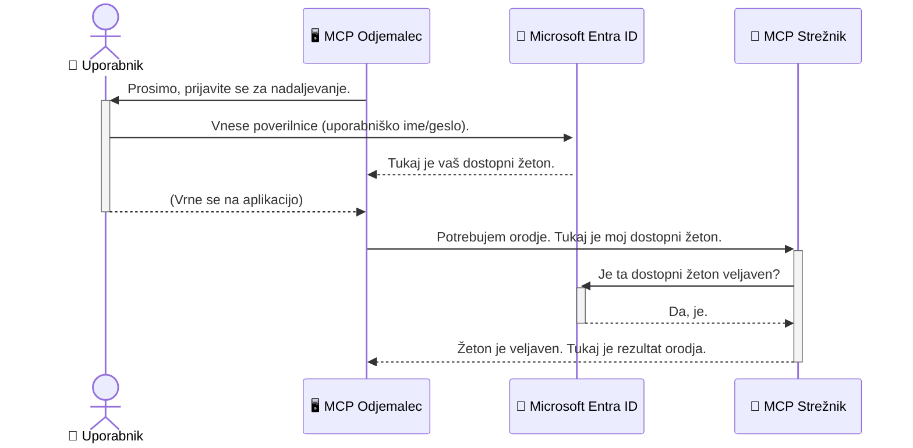

# Zavarovanje potekov dela AI: Entra ID avtentikacija za strežnike protokola Model Context

> [!NOTE]
> Koda oddaljenega strežnika v tej lekciji varuje dedne `/sse` in `/message`
> končne točke ter cilja na MCP `2025-11-25`. Ohranjajte njegove prakse za
> prepoznavanje identitete in preverjanje žetonov, vendar za nove
> implementacije uporabljajte združljiv Streamable HTTP transport `2026-07-28`.

## Uvod
Zavarovanje vašega strežnika Model Context Protcola (MCP) je prav tako pomembno kot zaklepanje vhodnih vrat hiše. Če strežnik MCP pustite odprt, so vaša orodja in podatki izpostavljeni nepooblaščenim dostopom, kar lahko povzroči varnostne kršitve. Microsoft Entra ID nudi robustno rešitev za upravljanje identitete in dostopa v oblaku, ki zagotavlja, da lahko z vašim strežnikom MCP komunicirajo le pooblaščeni uporabniki in aplikacije. V tem razdelku se boste naučili, kako varovati vaše AI poteke dela z uporabo Entra ID avtentikacije.

## Cilji učenja
Na koncu tega razdelka boste znali:

- Razumeti pomen zavarovanja MCP strežnikov.
- Pojasniti osnove Microsoft Entra ID in OAuth 2.0 avtentikacije.
- Razlikovati med javnimi in zaupnimi odjemalci.
- Uvesti Entra ID avtentikacijo tako v lokalnih (javni odjemalec) kot oddaljenih (zaupni odjemalec) scenarijih MCP strežnika.
- Uporabiti najboljše varnostne prakse pri razvoju AI potekov dela.

## Varnost in MCP

Tako kot ne bi pustili odklenjenih vhodnih vrat svoje hiše, tudi MCP strežnika ne smete pustiti odprtega za vsakogar. Zavarovanje vaših AI potekov dela je ključno za gradnjo robustnih, zaupanja vrednih in varnih aplikacij. Ta poglavje vas bo uvedlo v uporabo Microsoft Entra ID za zavarovanje vaših MCP strežnikov, da bodo do vaših orodij in podatkov lahko dostopali le pooblaščeni uporabniki in aplikacije.

## Zakaj je varnost pomembna za MCP strežnike

Predstavljajte si, da ima vaš MCP strežnik orodje, ki lahko pošilja e-pošto ali dostopa do baze podatkov strank. Nenadzorovan strežnik bi pomenil, da lahko kdorkoli potencialno uporablja to orodje, kar vodi do nepooblaščenega dostopa do podatkov, neželene pošte ali drugih zlonamernih dejavnosti.

Z implementacijo avtentikacije zagotovite, da se vsak zahtevek na vaš strežnik preveri, s čimer se potrdi identiteta uporabnika ali aplikacije, ki zahtevek pošilja. To je prvi in najpomembnejši korak pri zavarovanju vaših AI potekov dela.

## Uvod v Microsoft Entra ID

[**Microsoft Entra ID**](https://adoption.microsoft.com/microsoft-security/entra/) je storitev za upravljanje identitete in dostopa v oblaku. Predstavljajte si ga kot univerzalnega varnostnika za vaše aplikacije. Ukvarja se z zahtevnim postopkom preverjanja uporabniških identitet (avtentikacija) in določitvijo, kaj jim je dovoljeno početi (avtorizacija).

Z uporabo Entra ID lahko:

- Omogočite varen prijavni postopek za uporabnike.
- Zaščitite API-je in storitve.
- Upravljate varnostne politike na centraliziran način.

Za MCP strežnike Entra ID zagotavlja robustno in široko zaupanja vredno rešitev za upravljanje, kdo ima dostop do zmožnosti vašega strežnika.

---

## Razumevanje magije: Kako deluje Entra ID avtentikacija

Entra ID uporablja odprte standarde kot je **OAuth 2.0** za obdelavo avtentikacije. Čeprav so podrobnosti lahko kompleksne, je osnovni koncept preprost in ga je mogoče razložiti z analogijo.

### Rahlo pojasnilo OAuth 2.0: Ključ vratarja

Predstavljajte si OAuth 2.0 kot službo parkirnega vratarja za vaš avtomobil. Ko pridete v restavracijo, vratarju ne daste glavnega ključa. Namesto tega mu daste **ključ vratarja**, ki ima omejene pravice – lahko vklopi avto in zaklene vrata, vendar ne more odpreti prtljažnika ali predala s priročniki.

V tej analogiji:

- **Vi** ste **Uporabnik**.
- **Vaš avtomobil** je **MCP strežnik** z njegovimi dragocenimi orodji in podatki.
- **Vratar** je **Microsoft Entra ID**.
- **Parkirni asistent** je **MCP odjemalec** (aplikacija, ki poskuša dostopati do strežnika).
- **Ključ vratarja** je **dostopni žeton**.

Dostopni žeton je varen niz znakov, ki ga MCP odjemalec dobi od Entra ID po vaši prijavi. Nato odjemalec predstavi ta žeton MCP strežniku z vsakim zahtevkom. Strežnik lahko preveri žeton, da zagotovi, da je zahtevek veljaven in da ima odjemalec potrebna dovoljenja, vse to brez da bi kdaj moral obravnavati vaše dejanske poverilnice (kot je geslo).

### Potek avtentikacije

Tako potek proces v praksi:



### Predstavitev Microsoft Authentication Library (MSAL)

Preden se poglobimo v kodo, je pomembno predstaviti ključno komponento, ki jo boste videli v primerih: **Microsoft Authentication Library (MSAL)**.

MSAL je knjižnica, ki jo razvija Microsoft in razvijalcem bistveno olajša upravljanje avtentikacije. Namesto da pišete kompleksno kodo za upravljanje varnostnih žetonov, prijav in osveževanja sej, MSAL opravi večino zahtevnega dela.

Uporaba knjižnice, kot je MSAL, je zelo priporočljiva, ker:

- **Je varna:** Implementira industrijske standarde in najboljše varnostne prakse, zmanjšuje tveganje ranljivosti v vaši kodi.
- **Poenostavlja razvoj:** Odvzame zapletenost protokolov OAuth 2.0 in OpenID Connect ter vam omogoča, da k svoji aplikaciji dodate robustno avtentikacijo s samo nekaj vrsticami kode.
- **Je vzdrževana:** Microsoft aktivno vzdržuje in posodablja MSAL za odzivanje na nove varnostne grožnje in spremembe platform.

MSAL podpira širok nabor jezikov in razvojnih okvirov, vključno z .NET, JavaScript/TypeScript, Python, Java, Go, in mobilnimi platformami, kot sta iOS in Android. To pomeni, da lahko uporabljate enake vzorce avtentikacije po celotni vaši tehnološki hrbtenici.

Za več informacij o MSAL si lahko ogledate uradno [MSAL povzetek dokumentacije](https://learn.microsoft.com/entra/identity-platform/msal-overview).

---

## Zavarovanje vašega MCP strežnika z Entra ID: Vodnik po korakih

Zdaj si poglejmo, kako zavarovati lokalni MCP strežnik (ta komunicira preko `stdio`) z uporabo Entra ID. Ta primer uporablja **javnega odjemalca**, ki je primeren za aplikacije, ki tečejo na uporabniški napravi, kot je namizna aplikacija ali lokalni razvojni strežnik.

### Scenarij 1: Zavarovanje lokalnega MCP strežnika (z javnim odjemalcem)

V tem scenariju bomo pogledali MCP strežnik, ki teče lokalno, komunicira preko `stdio` in uporablja Entra ID za avtentikacijo uporabnika, preden mu dovoli dostop do njegovih orodij. Strežnik bo imel eno orodje, ki pridobi profilne informacije uporabnika iz Microsoft Graph API.

#### 1. Nastavitev aplikacije v Entra ID

Preden napišete kodo, morate registrirati svojo aplikacijo v Microsoft Entra ID. To Entra ID pove za vašo aplikacijo in ji podeli dovoljenje za uporabo avtentikacijskih storitev.

1. Pojdite na **[Microsoft Entra portal](https://entra.microsoft.com/)**.
2. Izberite **Registracije aplikacij** in kliknite **Nova registracija**.
3. Vaši aplikaciji dajte ime (npr. "Moj lokalni MCP strežnik").
4. Za **Vrste podprtih računov** izberite **Samo računi v tem organizacijskem imeniku**.
5. Polje **Preusmeritveni URI** lahko v tem primeru pustite prazno.
6. Kliknite **Registriraj**.

Ko je registracija dokončana, si zabeležite **ID aplikacije (odjemalca)** in **ID imenika (najemnika)**. Te podatke boste potrebovali v kodi.

#### 2. Koda: Razčlenitev

Poglejmo ključne dele kode, ki obdelujejo avtentikacijo. Celotna koda za ta primer je na voljo v mapi [Entra ID - Local - WAM](https://github.com/Azure-Samples/mcp-auth-servers/tree/main/src/entra-id-local-wam) v repozitoriju [mcp-auth-servers na GitHubu](https://github.com/Azure-Samples/mcp-auth-servers).

**`AuthenticationService.cs`**

Ta razred je odgovoren za interakcijo z Entra ID.

- **`CreateAsync`**: Ta metoda inicializira `PublicClientApplication` iz MSAL (Microsoft Authentication Library). Konfigurirana je z vašo `clientId` in `tenantId`.
- **`WithBroker`**: To omogoča uporabo posrednika (kot je Windows Web Account Manager), ki zagotavlja bolj varen in nemoten enotni prijavni proces.
- **`AcquireTokenAsync`**: To je osrednja metoda. Najprej poskuša tiho pridobiti žeton (kar pomeni, da uporabnik ne bo moral ponovno prijavljati, če ima že veljavno sejo). Če tihega žetona ni mogoče pridobiti, bo interaktivno pozvala uporabnika k prijavi.

```csharp
// Simplified for clarity
public static async Task<AuthenticationService> CreateAsync(ILogger<AuthenticationService> logger)
{
    var msalClient = PublicClientApplicationBuilder
        .Create(_clientId) // Your Application (client) ID
        .WithAuthority(AadAuthorityAudience.AzureAdMyOrg)
        .WithTenantId(_tenantId) // Your Directory (tenant) ID
        .WithBroker(new BrokerOptions(BrokerOptions.OperatingSystems.Windows))
        .Build();

    // ... cache registration ...

    return new AuthenticationService(logger, msalClient);
}

public async Task<string> AcquireTokenAsync()
{
    try
    {
        // Try silent authentication first
        var accounts = await _msalClient.GetAccountsAsync();
        var account = accounts.FirstOrDefault();

        AuthenticationResult? result = null;

        if (account != null)
        {
            result = await _msalClient.AcquireTokenSilent(_scopes, account).ExecuteAsync();
        }
        else
        {
            // If no account, or silent fails, go interactive
            result = await _msalClient.AcquireTokenInteractive(_scopes).ExecuteAsync();
        }

        return result.AccessToken;
    }
    catch (Exception ex)
    {
        _logger.LogError(ex, "An error occurred while acquiring the token.");
        throw; // Optionally rethrow the exception for higher-level handling
    }
}
```

**`Program.cs`**

Tukaj se nastavi MCP strežnik in integrira avtentikacijska storitev.

- **`AddSingleton<AuthenticationService>`**: Registrira `AuthenticationService` v vsebnik za odvisnostno inekcijo, da ga lahko uporabljajo drugi deli aplikacije (kot naše orodje).
- **Orodje `GetUserDetailsFromGraph`**: To orodje zahteva primer `AuthenticationService`. Preden karkoli stori, kliče `authService.AcquireTokenAsync()`, da pridobi veljaven dostopni žeton. Če je avtentikacija uspešna, z žetonom pokliče Microsoft Graph API in pridobi podatke o uporabniku.

```csharp
// Simplified for clarity
[McpServerTool(Name = "GetUserDetailsFromGraph")]
public static async Task<string> GetUserDetailsFromGraph(
    AuthenticationService authService)
{
    try
    {
        // This will trigger the authentication flow
        var accessToken = await authService.AcquireTokenAsync();

        // Use the token to create a GraphServiceClient
        var graphClient = new GraphServiceClient(
            new BaseBearerTokenAuthenticationProvider(new TokenProvider(authService)));

        var user = await graphClient.Me.GetAsync();

        return System.Text.Json.JsonSerializer.Serialize(user);
    }
    catch (Exception ex)
    {
        return $"Error: {ex.Message}";
    }
}
```

#### 3. Kako vse skupaj deluje

1. Ko MCP odjemalec poskuša uporabiti orodje `GetUserDetailsFromGraph`, to orodje najprej kliče `AcquireTokenAsync`.
2. `AcquireTokenAsync` sproži MSAL knjižnico, da preveri veljavnost žetona.
3. Če žeton ni najden, MSAL, preko posrednika, pozove uporabnika k prijavi z njihovim Entra ID računom.
4. Ko se uporabnik prijavi, Entra ID izda dostopni žeton.
5. Orodje prejme žeton in ga uporabi za varen klic Microsoft Graph API.
6. Podatki o uporabniku se vrnejo MCP odjemalcu.

Ta postopek zagotavlja, da lahko orodje uporablja le avtenticirani uporabniki in tako učinkovito zavaruje vaš lokalni MCP strežnik.

### Scenarij 2: Zavarovanje oddaljenega MCP strežnika (z zaupnim odjemalcem)

Ko MCP strežnik teče na oddaljeni napravi (kot je strežnik v oblaku) in komunicira prek protokola, kot je HTTP Streaming, so varnostne zahteve drugačne. V tem primeru uporabite **zaupnega odjemalca** in **potek po avtorizacijskem kodu**. To je varnejša metoda, ker aplikacijski skrivnosti nikoli niso razkrite v brskalniku.

Ta primer uporablja MCP strežnik na osnovi TypeScript, ki uporablja Express.js za obdelavo HTTP zahtevkov.

#### 1. Nastavitev aplikacije v Entra ID

Nastavitev v Entra ID je podobna kot pri javnem odjemalcu, vendar je ena ključna razlika: potrebno je ustvariti **skrivnost odjemalca**.

1. Pojdite na **[Microsoft Entra portal](https://entra.microsoft.com/)**.
2. V registraciji vaše aplikacije pojdite na zavihek **Certifikati in skrivnosti**.
3. Kliknite **Nova skrivnost odjemalca**, ji dajte opis in kliknite **Dodaj**.
4. **Pomembno:** Takoj kopirajte vrednost skrivnosti. Kasneje si je ne boste mogli več ogledati.
5. Potrebno je tudi konfigurirati **Preusmeritveni URI**. Pojdite na zavihek **Avtentikacija**, kliknite **Dodaj platformo**, izberite **Splet** in vnesite preusmeritveni URI za vašo aplikacijo (npr. `http://localhost:3001/auth/callback`).

> **⚠️ Pomembno varnostno opozorilo:** Za produkcijske aplikacije Microsoft močno priporoča uporabo metod **avtentikacije brez skrivnosti**, kot sta **Upravljana identiteta** ali **Zveza identitete delovne obremenitve**, namesto skrivnosti odjemalca. Skrivnosti odjemalca predstavljajo varnostno tveganje, saj se lahko razkrijejo ali kompromitirajo. Upravljane identitete nudijo varnejši pristop, saj ni potrebe po shranjevanju poverilnic v vaši kodi ali konfiguraciji.
>
> Za več informacij o upravljanih identitetah in kako jih implementirati si oglejte [Pregled upravljanih identitet za Azure vire](https://learn.microsoft.com/entra/identity/managed-identities-azure-resources/overview).

#### 2. Koda: Razčlenitev

Ta primer uporablja pristop z upravljanjem sej. Ko se uporabnik avtenticira, strežnik shrani dostopni in osvežitveni žeton v sejo ter uporabniku dodeli žeton seje. Ta žeton se nato uporablja za naslednje zahtevke. Celotna koda za ta primer je na voljo v mapi [Entra ID - Confidential client](https://github.com/Azure-Samples/mcp-auth-servers/tree/main/src/entra-id-cca-session) v repozitoriju [mcp-auth-servers na GitHubu](https://github.com/Azure-Samples/mcp-auth-servers).

**`Server.ts`**

Ta datoteka nastavi Express strežnik in MCP transportno plast.

- **`requireBearerAuth`**: To je vmesna programska oprema, ki varuje `/sse` in `/message` končne točke. Preverja veljaven žeton prenašalca v glavi `Authorization` zahtevka.
- **`EntraIdServerAuthProvider`**: To je prilagojeni razred, ki implementira vmesnik `McpServerAuthorizationProvider`. Odgovoren je za upravljanje OAuth 2.0 poteka.
- **`/auth/callback`**: Ta končna točka obdeluje preusmeritev iz Entra ID potem, ko se uporabnik avtenticira. Zamenja avtorizacijsko kodo za dostopni in osvežitveni žeton.

```typescript
// Poenostavljeno za jasnost
const app = express();
const { server } = createServer();
const provider = new EntraIdServerAuthProvider();

// Zaščitite SSE konec
app.get("/sse", requireBearerAuth({
  provider,
  requiredScopes: ["User.Read"]
}), async (req, res) => {
  // ... povežite se s transportom ...
});

// Zaščitite konec sporočila
app.post("/message", requireBearerAuth({
  provider,
  requiredScopes: ["User.Read"]
}), async (req, res) => {
  // ... obdelajte sporočilo ...
});

// Obdelajte OAuth 2.0 povratni klic
app.get("/auth/callback", (req, res) => {
  provider.handleCallback(req.query.code, req.query.state)
    .then(result => {
      // ... obdelajte uspeh ali neuspeh ...
    });
});
```

**`Tools.ts`**

Ta datoteka definira orodja, ki jih nudi MCP strežnik. Orodje `getUserDetails` je podobno kot v prejšnjem primeru, vendar dostopni žeton pridobi iz seje.

```typescript
// Poenostavljeno za jasnost
server.setRequestHandler(CallToolRequestSchema, async (request) => {
  const { name } = request.params;
  const context = request.params?.context as { token?: string } | undefined;
  const sessionToken = context?.token;

  if (name === ToolName.GET_USER_DETAILS) {
    if (!sessionToken) {
      throw new AuthenticationError("Authentication token is missing or invalid. Ensure the token is provided in the request context.");
    }

    // Pridobi Entra ID žeton iz shrambe sej
    const tokenData = tokenStore.getToken(sessionToken);
    const entraIdToken = tokenData.accessToken;

    const graphClient = Client.init({
      authProvider: (done) => {
        done(null, entraIdToken);
      }
    });

    const user = await graphClient.api('/me').get();

    // ... vrni podatke o uporabniku ...
  }
});
```

**`auth/EntraIdServerAuthProvider.ts`**

Ta razred upravlja z logiko za:

- Preusmeritev uporabnika na prijavno stran Entra ID.
- Zamenjavo avtorizacijske kode za dostopni žeton.
- Shranjevanje žetonov v `tokenStore`.
- Osveževanje dostopnega žetona, ko poteče.


#### 3. Kako vse to deluje skupaj

1. Ko se uporabnik prvič poskuša povezati na MCP strežnik, bo `requireBearerAuth` vmesnik zaznal, da nima veljavne seje in ga preusmeril na stran za prijavo v Entra ID.
2. Uporabnik se prijavi s svojim računom Entra ID.
3. Entra ID preusmeri uporabnika nazaj na končno točko `/auth/callback` z avtentikacijskim kodo.
4. Strežnik zamenja kodo za dostopni žeton in osvežitveni žeton, jih shrani in ustvari žeton seje, ki ga pošlje odjemalcu.
5. Odjemalec lahko zdaj uporablja ta žeton seje v glavi `Authorization` za vse prihodnje zahteve MCP strežniku.
6. Ko se pokliče orodje `getUserDetails`, uporabi žeton seje za iskanje dostopnega žetona Entra ID in nato uporabi ta žeton za klic Microsoft Graph API.

Ta potek je bolj zapleten kot potek za javne odjemalce, vendar je potreben za internetno izpostavljene končne točke. Ker so oddaljeni MCP strežniki dostopni preko javnega interneta, potrebujejo močnejše varnostne ukrepe za zaščito pred nepooblaščenim dostopom in morebitnimi napadi.


## Najboljše varnostne prakse

- **Vedno uporabljajte HTTPS**: Šifrirajte komunikacijo med odjemalcem in strežnikom, da zaščitite žetone pred prestrezanjem.
- **Uvedite nadzor dostopa na osnovi vlog (RBAC)**: Ne preverjajte le *ali* je uporabnik avtenticiran, temveč tudi *kaj* je pooblaščen storiti. V Entra ID lahko opredelite vloge in jih preverite v svojem MCP strežniku.
- **Nadzorujte in izvajajte revizijo**: Beležite vse dogodke avtentikacije, da lahko zaznate in se odzovete na sumljive dejavnosti.
- **Obvladujte omejevanje hitrosti in dušenje zahtevkov**: Microsoft Graph in drugi API-ji uvajajo omejevanje hitrosti za preprečevanje zlorab. Vzpostavite eksponentno vračanje nazaj in logiko ponovitve v vašem MCP strežniku, da lepo obravnavate HTTP 429 (preveč zahtevkov) odzive. Razmislite o predpomnilniku pogosto dostopanih podatkov, da zmanjšate klice API.
- **Varnostno shranjevanje žetonov**: Shranjujte dostopne žetone in osvežitvene žetone varno. Za lokalne aplikacije uporabite varnostne mehanizme sistema. Za strežniške aplikacije razmislite o uporabi šifriranega shranjevanja ali varnih storitev za upravljanje ključev, kot je Azure Key Vault.
- **Obdelava poteka žetonov**: Dostopni žetoni imajo omejeno življenjsko dobo. Implementirajte samodejno osveževanje žetonov z uporabo osvežitvenih žetonov za nemoteno uporabniško izkušnjo brez ponovne avtentikacije.
- **Razmislite o uporabi Azure API Management**: Medtem ko implementacija varnosti neposredno v vašem MCP strežniku nudi natančen nadzor, lahko API prehodi, kot je Azure API Management, samodejno upravljajo mnoge vidike varnosti, vključno z avtentikacijo, avtoritacijo, omejevanjem hitrosti in nadzorom. Nudijo centralizirano varnostno plast, ki stoji med vašimi odjemalci in MCP strežniki. Za več podrobnosti o uporabi API prehodov z MCP glejte [Azure API Management Your Auth Gateway For MCP Servers](https://techcommunity.microsoft.com/blog/integrationsonazureblog/azure-api-management-your-auth-gateway-for-mcp-servers/4402690).


## Ključne ugotovitve

- Varnost vašega MCP strežnika je ključnega pomena za zaščito vaših podatkov in orodij.
- Microsoft Entra ID nudi robustno in razširljivo rešitev za avtentikacijo in avtoritacijo.
- Za lokalne aplikacije uporabite **javni odjemalec**, za oddaljene strežnike pa **zaupnega odjemalca**.
- **Avtentikacijski potek z avtoritacijsko kodo** je najbolj varna možnost za spletne aplikacije.


## Vaja

1. Premislite o MCP strežniku, ki bi ga morda zgradili. Bi bil lokalni strežnik ali oddaljeni strežnik?
2. Glede na vaš odgovor, bi uporabili javnega ali zaupanja vrednega odjemalca?
3. Katere pravice bi vaš MCP strežnik zahteval za izvajanje dejanj v Microsoft Graph?


## Praktične vaje

### Vaja 1: Registracija aplikacije v Entra ID
Obiščite Microsoft Entra portal.
Registrirajte novo aplikacijo za vaš MCP strežnik.
Zapišite ID aplikacije (odjemalca) in ID imenika (najemnika).

### Vaja 2: Varnost lokalnega MCP strežnika (javni odjemalec)
- Sledite primerom kode za integracijo MSAL (Microsoft Authentication Library) za avtentikacijo uporabnikov.
- Preizkusite potek avtentikacije z klicem orodja MCP, ki pridobi uporabnične podatke iz Microsoft Graph.

### Vaja 3: Varnost oddaljenega MCP strežnika (zaupanja vredni odjemalec)
- Registrirajte zaupanja vrednega odjemalca v Entra ID in ustvarite skrivnost odjemalca.
- Konfigurirajte svoj Express.js MCP strežnik za uporabo avtoritacijskega poteka z avtentikacijsko kodo.
- Preizkusite zaščitene končne točke in potrdite dostop s pomočjo žetonov.

### Vaja 4: Uveljavljanje najboljših varnostnih praks
- Omogočite HTTPS za vaš lokalni ali oddaljeni strežnik.
- Uvedite nadzor dostopa na osnovi vlog (RBAC) v vaši strežniški logiki.
- Dodajte obravnavo poteka žetonov in varno shranjevanje žetonov.

## Viri

1. **Dokumentacija pregleda MSAL**  
   Naučite se, kako Microsoft Authentication Library (MSAL) omogoča varno pridobivanje žetonov na različnih platformah:  
   [MSAL Overview on Microsoft Learn](https://learn.microsoft.com/en-gb/entra/msal/overview)

2. **GitHub repozitorij Azure-Samples/mcp-auth-servers**  
   Referenčne implementacije MCP strežnikov, ki prikazujejo poteke avtentikacije:  
   [Azure-Samples/mcp-auth-servers on GitHub](https://github.com/Azure-Samples/mcp-auth-servers)

3. **Pregled Upravljanih identitet za Azure vire**  
   Razumite, kako odpraviti skrivnosti s sistemsko ali uporabniško dodeljenimi upravljanimi identitetami:  
   [Managed Identities Overview on Microsoft Learn](https://learn.microsoft.com/en-us/entra/identity/managed-identities-azure-resources/)

4. **Azure API Management: Vaša avtentikacijska prehod za MCP strežnike**  
   Poglobljen pregled uporabe APIM kot varne OAuth2 prehoda za MCP strežnike:  
   [Azure API Management Your Auth Gateway For MCP Servers](https://techcommunity.microsoft.com/blog/integrationsonazureblog/azure-api-management-your-auth-gateway-for-mcp-servers/4402690)

5. **Referenca dovoljenj Microsoft Graph**  
   Celovit seznam delegiranih in aplikacijskih dovoljenj za Microsoft Graph:  
   [Microsoft Graph Permissions Reference](https://learn.microsoft.com/zh-tw/graph/permissions-reference)


## Cilji učenja
Po končanem tem delu boste lahko:

- Pojasnili, zakaj je avtentikacija ključnega pomena za MCP strežnike in AI delovne tokove.
- Nastavili in konfigurirali avtentikacijo Entra ID za scenarije lokalnega in oddaljenega MCP strežnika.
- Izbrali ustrezno vrsto odjemalca (javni ali zaupanja vreden) glede na namestitev vašega strežnika.
- Uporabili varne prakse kodiranja, vključno s shranjevanjem žetonov in avtoritacijo na osnovi vlog.
- Zaupno zaščitili vaš MCP strežnik in njegova orodja pred nepooblaščenim dostopom.

## Kaj sledi

- [5.13 Protokol modelnega konteksta (MCP) integracija z Microsoft Foundry](../mcp-foundry-agent-integration/README.md)

---

<!-- CO-OP TRANSLATOR DISCLAIMER START -->
**Omejitev odgovornosti**:
Ta dokument je bil preveden z uporabo AI prevajalske storitve [Co-op Translator](https://github.com/Azure/co-op-translator). Čeprav si prizadevamo za natančnost, vas prosimo, da upoštevate, da avtomatizirani prevodi lahko vsebujejo napake ali netočnosti. Izvirni dokument v njegovem izvirnem jeziku je treba obravnavati kot avtoritativni vir. Za kritične informacije je priporočljiv strokovni človeški prevod. Ne odgovarjamo za morebitna nesporazume ali napačne interpretacije, ki izhajajo iz uporabe tega prevoda.
<!-- CO-OP TRANSLATOR DISCLAIMER END -->