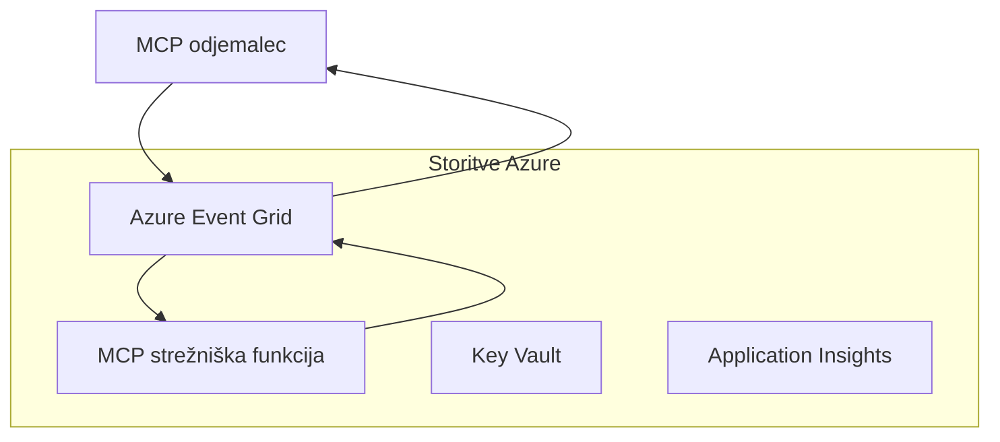
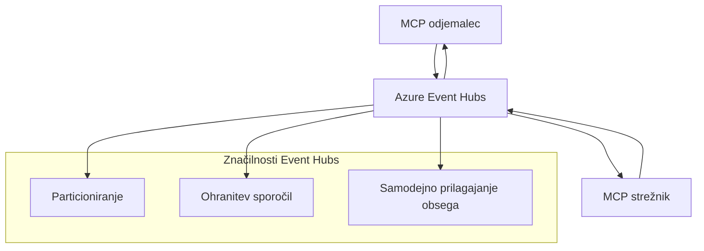

# MCP Prilagojeni prenosi - Napreden vodnik za izvedbo

Protokol kontekstnega modela (MCP) dovoljuje izvedbe prilagojenih prenosov za
specializirana okolja. Ta napreden vodnik raziskuje Azure Event Grid in
Azure Event Hubs kot arhitekturne vzorce. Niso standardni MCP prenosi
in zahtevajo soglasje obeh končnih točk glede prilagojene preslikave.

> **Obseg MCP `2026-07-28`:** trenutni protokol nima sej na ravni protokola,
> zato se prilagojeni prenosi ne smejo zanašati na afiniteto do seje ali
> vrstni red po seji. Glave `Mcp-Method` in pogojna `Mcp-Name` so
> zahteve standardnega Streamable HTTP prenosa; ne-HTTP prenos
> potrebuje ustrezno, izrecno dogovorjeno preslikavo, če posredniki morajo usmerjati
> brez dekodiranja telesa JSON-RPC. Glej
> [Kaj se je spremenilo v MCP: Specifikacija 2026-07-28](../../01-CoreConcepts/mcp-2026-07-28.md).

## Uvod

Standardni prenosi MCP so stdio in Streamable HTTP. Nekatera podjetja
uporabljajo prilagojeno preslikavo za integracijo z obstoječo sporočilno
infrastrukturo, vendar to lahko zmanjša interoperabilnost z MCP gostitelji in
SDK-ji, ki izvajajo samo standardne prenose.

Ta lekcija uporablja brezstatične zahteve specifikacije MCP
`2026-07-28` za Azure storitve za sporočanje in uveljavljene vzorce
integracije v podjetjih.

### **Arhitektura MCP prenosa**

**Iz specifikacije MCP `2026-07-28`:**

- **Standardni prenosi**: stdio in Streamable HTTP
- **Prilagojeni prenosi**: neobvezni, po implementaciji specifične preslikave, ki se dogovorijo
    med obema končnima točkama
- **Oblika sporočila**: JSON-RPC 2.0 z razširitvami specifičnimi za MCP
- **Samozadostni zahtevki**: ni na voljo protokolarne seje ali stiska roke
    za prenos stanja med zahtevki

## Cilji učenja

Do konca te napredne lekcije boste lahko:

- **Razumeti zahteve po prilagojenih prenosih**: izvaja MCP protokol nad katerimkoli transportnim slojem ob ohranjanju skladnosti
- **Zgraditi prenos Azure Event Grid**: ustvariti dogajalsko vodene MCP strežnike za brezstopenjsko razširljivost
- **Izvesti prenos Azure Event Hubs**: zasnovati visokozmogljive MCP rešitve z uporabo Azure Event Hubs za pretakanje v realnem času
- **Uporabiti poslovne vzorce**: integrirati prilagojene prenose z obstoječo Azure infrastrukturo in varnostnimi modeli
- **Obravnavati zanesljivost prenosa**: izvesti trdnost sporočil, vrstni red in obravnavo napak za poslovne primere
- **Optimizirati zmogljivost**: zasnovati rešitve prenosov za zahteve glede razširljivosti, zakasnitve in prepustnosti

## **Zahteve za prenos**

### **Osnovne zahteve za MCP `2026-07-28`**

```yaml
Message Protocol:
  format: "JSON-RPC 2.0 with MCP extensions"
    correlation: "Match responses to requests by JSON-RPC id"
    state: "Each request must be self-contained"
  
Transport Layer:
  reliability: "Transport MUST handle connection failures gracefully"
  security: "Transport MUST support secure communication"
    identification: "Carry protocol version, capabilities, and identity per request"
  
Custom Transport:
    compliance: "Map the selected MCP revision without adding session assumptions"
  extensibility: "MAY add transport-specific features"
    interoperability: "Both endpoints MUST agree on the custom mapping"
```

## **Izvedba prenosa Azure Event Grid**

Azure Event Grid zagotavlja brezstopenjsko usmerjanje dogodkov, idealno za dogajalsko vodene MCP arhitekture. Ta izvedba prikazuje, kako zgraditi razširljive, šibko povezane MCP sisteme.

### **Pregled arhitekture**



### **Implementacija v C# - prenos Event Grid**

```csharp
using Azure.Messaging.EventGrid;
using Microsoft.Extensions.Azure;
using System.Text.Json;

public class EventGridMcpTransport : IMcpTransport
{
    private readonly EventGridPublisherClient _publisher;
    private readonly string _topicEndpoint;
    private readonly string _clientId;
    
    public EventGridMcpTransport(string topicEndpoint, string accessKey, string clientId)
    {
        _publisher = new EventGridPublisherClient(
            new Uri(topicEndpoint), 
            new AzureKeyCredential(accessKey));
        _topicEndpoint = topicEndpoint;
        _clientId = clientId;
    }
    
    public async Task SendMessageAsync(McpMessage message)
    {
        var eventGridEvent = new EventGridEvent(
            subject: $"mcp/{_clientId}",
            eventType: "MCP.MessageReceived",
            dataVersion: "1.0",
            data: JsonSerializer.Serialize(message))
        {
            Id = Guid.NewGuid().ToString(),
            EventTime = DateTimeOffset.UtcNow
        };
        
        await _publisher.SendEventAsync(eventGridEvent);
    }
    
    public async Task<McpMessage> ReceiveMessageAsync(CancellationToken cancellationToken)
    {
        // Event Grid is push-based, so implement webhook receiver
        // This would typically be handled by Azure Functions trigger
        throw new NotImplementedException("Use EventGridTrigger in Azure Functions");
    }
}

// Azure Function for receiving Event Grid events
[FunctionName("McpEventGridReceiver")]
public async Task<IActionResult> HandleEventGridMessage(
    [EventGridTrigger] EventGridEvent eventGridEvent,
    ILogger log)
{
    try
    {
        var mcpMessage = JsonSerializer.Deserialize<McpMessage>(
            eventGridEvent.Data.ToString());
        
        // Process MCP message
        var response = await _mcpServer.ProcessMessageAsync(mcpMessage);
        
        // Send response back via Event Grid
        await _transport.SendMessageAsync(response);
        
        return new OkResult();
    }
    catch (Exception ex)
    {
        log.LogError(ex, "Error processing Event Grid MCP message");
        return new BadRequestResult();
    }
}
```

### **Implementacija v TypeScript - prenos Event Grid**

```typescript
import { EventGridPublisherClient, AzureKeyCredential } from "@azure/eventgrid";
import { McpTransport, McpMessage } from "./mcp-types";

export class EventGridMcpTransport implements McpTransport {
    private publisher: EventGridPublisherClient;
    private clientId: string;
    
    constructor(
        private topicEndpoint: string,
        private accessKey: string,
        clientId: string
    ) {
        this.publisher = new EventGridPublisherClient(
            topicEndpoint,
            new AzureKeyCredential(accessKey)
        );
        this.clientId = clientId;
    }
    
    async sendMessage(message: McpMessage): Promise<void> {
        const event = {
            id: crypto.randomUUID(),
            source: `mcp-client-${this.clientId}`,
            type: "MCP.MessageReceived",
            time: new Date(),
            data: message
        };
        
        await this.publisher.sendEvents([event]);
    }
    
    // Prejem na dogodke, ki jih sprožijo Azure Functions
    onMessage(handler: (message: McpMessage) => Promise<void>): void {
        // Implementacija bi uporabila sprožilec Azure Functions Event Grid
        // To je konceptualni vmesnik za prejemnik webhooka
    }
}

// Implementacija Azure Functions
import { app, InvocationContext, EventGridEvent } from "@azure/functions";

app.eventGrid("mcpEventGridHandler", {
    handler: async (event: EventGridEvent, context: InvocationContext) => {
        try {
            const mcpMessage = event.data as McpMessage;
            
            // Obdelaj MCP sporočilo
            const response = await mcpServer.processMessage(mcpMessage);
            
            // Pošlji odgovor preko Event Grid
            await transport.sendMessage(response);
            
        } catch (error) {
            context.error("Error processing MCP message:", error);
            throw error;
        }
    }
});
```

### **Implementacija v Python - prenos Event Grid**

```python
from azure.eventgrid import EventGridPublisherClient, EventGridEvent
from azure.core.credentials import AzureKeyCredential
import asyncio
import json
from typing import Callable, Optional
import uuid
from datetime import datetime

class EventGridMcpTransport:
    def __init__(self, topic_endpoint: str, access_key: str, client_id: str):
        self.client = EventGridPublisherClient(
            topic_endpoint, 
            AzureKeyCredential(access_key)
        )
        self.client_id = client_id
        self.message_handler: Optional[Callable] = None
    
    async def send_message(self, message: dict) -> None:
        """Send MCP message via Event Grid"""
        event = EventGridEvent(
            data=message,
            subject=f"mcp/{self.client_id}",
            event_type="MCP.MessageReceived",
            data_version="1.0"
        )
        
        await self.client.send(event)
    
    def on_message(self, handler: Callable[[dict], None]) -> None:
        """Register message handler for incoming events"""
        self.message_handler = handler

# Implementacija Azure Functions
import azure.functions as func
import logging

def main(event: func.EventGridEvent) -> None:
    """Azure Functions Event Grid trigger for MCP messages"""
    try:
        # Analiziraj MCP sporočilo iz dogodka Event Grid
        mcp_message = json.loads(event.get_body().decode('utf-8'))
        
        # Obdelaj MCP sporočilo
        response = process_mcp_message(mcp_message)
        
        # Pošlji odgovor nazaj prek Event Grid
        # (Implementacija bi ustvarila novega odjemalca Event Grid)
        
    except Exception as e:
        logging.error(f"Error processing MCP Event Grid message: {e}")
        raise
```

## **Izvedba prenosa Azure Event Hubs**

Azure Event Hubs zagotavlja visokoprepustne, pretoke v realnem času za MCP scenarije, ki zahtevajo nizko zakasnitev in velike količine sporočil.

### **Pregled arhitekture**



### **Implementacija v C# - prenos Event Hubs**

```csharp
using Azure.Messaging.EventHubs;
using Azure.Messaging.EventHubs.Producer;
using Azure.Messaging.EventHubs.Consumer;
using System.Text;

public class EventHubsMcpTransport : IMcpTransport, IDisposable
{
    private readonly EventHubProducerClient _producer;
    private readonly EventHubConsumerClient _consumer;
    private readonly string _consumerGroup;
    private readonly CancellationTokenSource _cancellationTokenSource;
    
    public EventHubsMcpTransport(
        string connectionString, 
        string eventHubName,
        string consumerGroup = "$Default")
    {
        _producer = new EventHubProducerClient(connectionString, eventHubName);
        _consumer = new EventHubConsumerClient(
            consumerGroup, 
            connectionString, 
            eventHubName);
        _consumerGroup = consumerGroup;
        _cancellationTokenSource = new CancellationTokenSource();
    }
    
    public async Task SendMessageAsync(McpMessage message)
    {
        var messageBody = JsonSerializer.Serialize(message);
        var eventData = new EventData(Encoding.UTF8.GetBytes(messageBody));
        
        // Add MCP-specific properties
        eventData.Properties.Add("MessageType", message.Method ?? "response");
        eventData.Properties.Add("MessageId", message.Id);
        eventData.Properties.Add("Timestamp", DateTimeOffset.UtcNow);
        
        await _producer.SendAsync(new[] { eventData });
    }
    
    public async Task StartReceivingAsync(
        Func<McpMessage, Task> messageHandler)
    {
        await foreach (PartitionEvent partitionEvent in _consumer.ReadEventsAsync(
            _cancellationTokenSource.Token))
        {
            try
            {
                var messageBody = Encoding.UTF8.GetString(
                    partitionEvent.Data.EventBody.ToArray());
                var mcpMessage = JsonSerializer.Deserialize<McpMessage>(messageBody);
                
                await messageHandler(mcpMessage);
            }
            catch (Exception ex)
            {
                // Handle deserialization or processing errors
                Console.WriteLine($"Error processing message: {ex.Message}");
            }
        }
    }
    
    public void Dispose()
    {
        _cancellationTokenSource?.Cancel();
        _producer?.DisposeAsync().AsTask().Wait();
        _consumer?.DisposeAsync().AsTask().Wait();
        _cancellationTokenSource?.Dispose();
    }
}
```

### **Implementacija v TypeScript - prenos Event Hubs**

```typescript
import { 
    EventHubProducerClient, 
    EventHubConsumerClient, 
    EventData 
} from "@azure/event-hubs";

export class EventHubsMcpTransport implements McpTransport {
    private producer: EventHubProducerClient;
    private consumer: EventHubConsumerClient;
    private isReceiving = false;
    
    constructor(
        private connectionString: string,
        private eventHubName: string,
        private consumerGroup: string = "$Default"
    ) {
        this.producer = new EventHubProducerClient(
            connectionString, 
            eventHubName
        );
        this.consumer = new EventHubConsumerClient(
            consumerGroup,
            connectionString,
            eventHubName
        );
    }
    
    async sendMessage(message: McpMessage): Promise<void> {
        const eventData: EventData = {
            body: JSON.stringify(message),
            properties: {
                messageType: message.method || "response",
                messageId: message.id,
                timestamp: new Date().toISOString()
            }
        };
        
        await this.producer.sendBatch([eventData]);
    }
    
    async startReceiving(
        messageHandler: (message: McpMessage) => Promise<void>
    ): Promise<void> {
        if (this.isReceiving) return;
        
        this.isReceiving = true;
        
        const subscription = this.consumer.subscribe({
            processEvents: async (events, context) => {
                for (const event of events) {
                    try {
                        const messageBody = event.body as string;
                        const mcpMessage: McpMessage = JSON.parse(messageBody);
                        
                        await messageHandler(mcpMessage);
                        
                        // Posodobi kontrolno točko za dostavo vsaj enkrat
                        await context.updateCheckpoint(event);
                    } catch (error) {
                        console.error("Error processing Event Hubs message:", error);
                    }
                }
            },
            processError: async (err, context) => {
                console.error("Event Hubs error:", err);
            }
        });
    }
    
    async close(): Promise<void> {
        this.isReceiving = false;
        await this.producer.close();
        await this.consumer.close();
    }
}
```

### **Implementacija v Python - prenos Event Hubs**

```python
from azure.eventhub import EventHubProducerClient, EventHubConsumerClient
from azure.eventhub import EventData
import json
import asyncio
from typing import Callable, Dict, Any
import logging

class EventHubsMcpTransport:
    def __init__(
        self, 
        connection_string: str, 
        eventhub_name: str,
        consumer_group: str = "$Default"
    ):
        self.producer = EventHubProducerClient.from_connection_string(
            connection_string, 
            eventhub_name=eventhub_name
        )
        self.consumer = EventHubConsumerClient.from_connection_string(
            connection_string,
            consumer_group=consumer_group,
            eventhub_name=eventhub_name
        )
        self.is_receiving = False
    
    async def send_message(self, message: Dict[str, Any]) -> None:
        """Send MCP message via Event Hubs"""
        event_data = EventData(json.dumps(message))
        
        # Dodajte lastnosti, specifične za MCP
        event_data.properties = {
            "messageType": message.get("method", "response"),
            "messageId": message.get("id"),
            "timestamp": "2025-01-14T10:30:00Z"  # Uporabite dejanski časovni žig
        }
        
        async with self.producer:
            event_data_batch = await self.producer.create_batch()
            event_data_batch.add(event_data)
            await self.producer.send_batch(event_data_batch)
    
    async def start_receiving(
        self, 
        message_handler: Callable[[Dict[str, Any]], None]
    ) -> None:
        """Start receiving MCP messages from Event Hubs"""
        if self.is_receiving:
            return
        
        self.is_receiving = True
        
        async with self.consumer:
            await self.consumer.receive(
                on_event=self._on_event_received(message_handler),
                starting_position="-1"  # Začnite od začetka
            )
    
    def _on_event_received(self, handler: Callable):
        """Internal event handler wrapper"""
        async def handle_event(partition_context, event):
            try:
                # Razčlenite MCP sporočilo iz dogodka Event Hubs
                message_body = event.body_as_str(encoding='UTF-8')
                mcp_message = json.loads(message_body)
                
                # Obdelajte MCP sporočilo
                await handler(mcp_message)
                
                # Posodobite kontrolno točko za dostavo vsaj enkrat
                await partition_context.update_checkpoint(event)
                
            except Exception as e:
                logging.error(f"Error processing Event Hubs message: {e}")
        
        return handle_event
    
    async def close(self) -> None:
        """Clean up transport resources"""
        self.is_receiving = False
        await self.producer.close()
        await self.consumer.close()
```

## **Napredni vzorci prenosov**

### **Vzdržnost in zanesljivost sporočil**

```csharp
// Implementing message durability with retry logic
public class ReliableTransportWrapper : IMcpTransport
{
    private readonly IMcpTransport _innerTransport;
    private readonly RetryPolicy _retryPolicy;
    
    public async Task SendMessageAsync(McpMessage message)
    {
        await _retryPolicy.ExecuteAsync(async () =>
        {
            try
            {
                await _innerTransport.SendMessageAsync(message);
            }
            catch (TransportException ex) when (ex.IsRetryable)
            {
                // Log and retry
                throw;
            }
        });
    }
}
```

### **Integracija varnosti prenosa**

```csharp
// Integrating Azure Key Vault for transport security
public class SecureTransportFactory
{
    private readonly SecretClient _keyVaultClient;
    
    public async Task<IMcpTransport> CreateEventGridTransportAsync()
    {
        var accessKey = await _keyVaultClient.GetSecretAsync("EventGridAccessKey");
        var topicEndpoint = await _keyVaultClient.GetSecretAsync("EventGridTopic");
        
        return new EventGridMcpTransport(
            topicEndpoint.Value.Value,
            accessKey.Value.Value,
            Environment.MachineName
        );
    }
}
```

### **Nadzor in opazovanje prenosa**

```csharp
// Adding telemetry to custom transports
public class ObservableTransport : IMcpTransport
{
    private readonly IMcpTransport _transport;
    private readonly ILogger _logger;
    private readonly TelemetryClient _telemetryClient;
    
    public async Task SendMessageAsync(McpMessage message)
    {
        using var activity = Activity.StartActivity("MCP.Transport.Send");
        activity?.SetTag("transport.type", "EventGrid");
        activity?.SetTag("message.method", message.Method);
        
        var stopwatch = Stopwatch.StartNew();
        
        try
        {
            await _transport.SendMessageAsync(message);
            
            _telemetryClient.TrackDependency(
                "EventGrid",
                "SendMessage",
                DateTime.UtcNow.Subtract(stopwatch.Elapsed),
                stopwatch.Elapsed,
                true
            );
        }
        catch (Exception ex)
        {
            _telemetryClient.TrackException(ex);
            throw;
        }
    }
}
```

## **Scenariji poslovne integracije**

### **Scenarij 1: distribuirano procesiranje MCP**

Uporaba Azure Event Grid za distribucijo MCP zahtevkov med več obdelovalnih vozlišč:

```yaml
Architecture:
  - MCP Client sends requests to Event Grid topic
  - Multiple Azure Functions subscribe to process different tool types
  - Results aggregated and returned via separate response topic
  
Benefits:
  - Horizontal scaling based on message volume
  - Fault tolerance through redundant processors
  - Cost optimization with serverless compute
```

### **Scenarij 2: MCP pretakanje v realnem času**

Uporaba Azure Event Hubs za pogosto interakcijo MCP:

```yaml
Architecture:
  - MCP Client streams continuous requests via Event Hubs
  - Stream Analytics processes and routes messages
  - Multiple consumers handle different aspect of processing
  
Benefits:
  - Low latency for real-time scenarios
  - High throughput for batch processing
  - Built-in partitioning for parallel processing
```

### **Scenarij 3: hibridna arhitektura prenosov**

Združevanje več prenosov za različne primere uporabe:

```csharp
public class HybridMcpTransport : IMcpTransport
{
    private readonly IMcpTransport _realtimeTransport; // Event Hubs
    private readonly IMcpTransport _batchTransport;    // Event Grid
    private readonly IMcpTransport _fallbackTransport; // HTTP Streaming
    
    public async Task SendMessageAsync(McpMessage message)
    {
        // Route based on message characteristics
        var transport = message.Method switch
        {
            "tools/call" when IsRealtime(message) => _realtimeTransport,
            "resources/read" when IsBatch(message) => _batchTransport,
            _ => _fallbackTransport
        };
        
        await transport.SendMessageAsync(message);
    }
}
```

## **Optimizacija zmogljivosti**

### **Pakiranje sporočil za Event Grid**

```csharp
public class BatchingEventGridTransport : IMcpTransport
{
    private readonly List<McpMessage> _messageBuffer = new();
    private readonly Timer _flushTimer;
    private const int MaxBatchSize = 100;
    
    public async Task SendMessageAsync(McpMessage message)
    {
        lock (_messageBuffer)
        {
            _messageBuffer.Add(message);
            
            if (_messageBuffer.Count >= MaxBatchSize)
            {
                _ = Task.Run(FlushMessages);
            }
        }
    }
    
    private async Task FlushMessages()
    {
        List<McpMessage> toSend;
        lock (_messageBuffer)
        {
            toSend = new List<McpMessage>(_messageBuffer);
            _messageBuffer.Clear();
        }
        
        if (toSend.Any())
        {
            var events = toSend.Select(CreateEventGridEvent);
            await _publisher.SendEventsAsync(events);
        }
    }
}
```

### **Strategija razdelitve za Event Hubs**

```csharp
public class PartitionedEventHubsTransport : IMcpTransport
{
    public async Task SendMessageAsync(McpMessage message)
    {
        // Partition by client ID for session affinity
        var partitionKey = ExtractClientId(message);
        
        var eventData = new EventData(JsonSerializer.SerializeToUtf8Bytes(message))
        {
            PartitionKey = partitionKey
        };
        
        await _producer.SendAsync(new[] { eventData });
    }
}
```

## **Preizkušanje prilagojenih prenosov**

### **Enotsko testiranje s testnimi dvojniki**

```csharp
[Test]
public async Task EventGridTransport_SendMessage_PublishesCorrectEvent()
{
    // Arrange
    var mockPublisher = new Mock<EventGridPublisherClient>();
    var transport = new EventGridMcpTransport(mockPublisher.Object);
    var message = new McpMessage { Method = "tools/list", Id = "test-123" };
    
    // Act
    await transport.SendMessageAsync(message);
    
    // Assert
    mockPublisher.Verify(
        x => x.SendEventAsync(
            It.Is<EventGridEvent>(e => 
                e.EventType == "MCP.MessageReceived" &&
                e.Subject == "mcp/test-client"
            )
        ),
        Times.Once
    );
}
```

### **Integracijsko testiranje z Azure testnimi vsebniki**

```csharp
[Test]
public async Task EventHubsTransport_IntegrationTest()
{
    // Using Testcontainers for integration testing
    var eventHubsContainer = new EventHubsContainer()
        .WithEventHub("test-hub");
    
    await eventHubsContainer.StartAsync();
    
    var transport = new EventHubsMcpTransport(
        eventHubsContainer.GetConnectionString(),
        "test-hub"
    );
    
    // Test message round-trip
    var sentMessage = new McpMessage { Method = "test", Id = "123" };
    McpMessage receivedMessage = null;
    
    await transport.StartReceivingAsync(msg => {
        receivedMessage = msg;
        return Task.CompletedTask;
    });
    
    await transport.SendMessageAsync(sentMessage);
    await Task.Delay(1000); // Allow for message processing
    
    Assert.That(receivedMessage?.Id, Is.EqualTo("123"));
}
```

## **Najboljše prakse in smernice**

### **Načela oblikovanja prenosa**

1. **Idempotentnost**: zagotovite, da je obdelava sporočil idempotentna za obvladovanje dvojnikov
2. **Obravnava napak**: izvedite celovito obravnavo napak in vrste za mrtve pošte
3. **Nadzor**: dodajte podrobno telemetrijo in zdravstvene preglede
4. **Varnost**: uporabite upravljane identitete in dostop z minimalnimi privilegiji
5. **Zmognost**: zasnujte za svoje specifične zahteve glede zakasnitve in prepustnosti

### **Priporočila specifična za Azure**

1. **Uporabite upravljano identiteto**: izogibajte se povezovalnim nizom v produkciji
2. **Izvedite varovalke**: zaščitite se pred izpadi Azure storitev
3. **Nadzirajte stroške**: spremljajte obseg sporočil in stroške obdelave
4. **Načrtujte za razširitev**: zgodaj zasnujte strategije razdelitve in skaliranja
5. **Temeljito testirajte**: uporabite Azure DevTest Labs za celovito testiranje

## **Zaključek**

Prilagojeni MCP prenosi omogočajo zmogljive poslovne scenarije z uporabo Azure sporočilnih storitev. Z izvajanjem prenosov Event Grid ali Event Hubs lahko ustvarite razširljive, zanesljive MCP rešitve, ki se brezšivno integrirajo z obstoječo Azure infrastrukturo.

Predstavljeni primeri prikazujejo vzorce pripravljene za proizvodnjo za izvedbo prilagojenih prenosov ob ohranjanju skladnosti s protokolom MCP in najboljšimi praksami Azure.

## **Dodatni viri**

- [Specifikacija MCP 2026-07-28](https://modelcontextprotocol.io/specification/2026-07-28/)
- [Dokumentacija Azure Event Grid](https://docs.microsoft.com/azure/event-grid/)
- [Dokumentacija Azure Event Hubs](https://docs.microsoft.com/azure/event-hubs/)
- [Azure Functions Event Grid sprožilec](https://docs.microsoft.com/azure/azure-functions/functions-bindings-event-grid)
- [Azure SDK za .NET](https://github.com/Azure/azure-sdk-for-net)
- [Azure SDK za TypeScript](https://github.com/Azure/azure-sdk-for-js)
- [Azure SDK za Python](https://github.com/Azure/azure-sdk-for-python)

---

> *Ta vodnik se osredotoča na prilagojene arhitekturne vzorce. Preverite vedenje protokola z [Specifikacijo MCP 2026-07-28](https://modelcontextprotocol.io/specification/2026-07-28/),
> in preverite uporabo Azure glede na vaše zahteve in omejitve storitev.*


## Kaj sledi
- [6. Prispevki skupnosti](../../06-CommunityContributions/README.md)

---

<!-- CO-OP TRANSLATOR DISCLAIMER START -->
**Omejitev odgovornosti**:
Ta dokument je bil preveden z uporabo AI prevajalske storitve [Co-op Translator](https://github.com/Azure/co-op-translator). Čeprav si prizadevamo za natančnost, vas prosimo, da upoštevate, da avtomatizirani prevodi lahko vsebujejo napake ali netočnosti. Izvirni dokument v njegovem izvirnem jeziku je treba obravnavati kot avtoritativni vir. Za kritične informacije je priporočljiv strokovni človeški prevod. Ne odgovarjamo za morebitna nesporazume ali napačne interpretacije, ki izhajajo iz uporabe tega prevoda.
<!-- CO-OP TRANSLATOR DISCLAIMER END -->