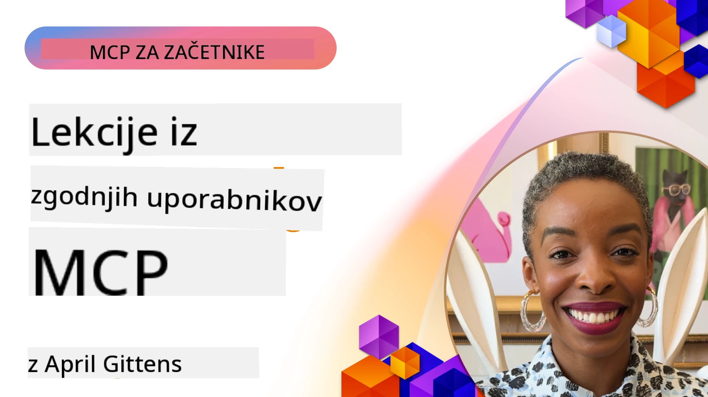

# 🌟 Lekcije od zgodnjih uporabnikov

[](https://youtu.be/jds7dSmNptE)

_(Kliknite zgornjo sliko za ogled videa te lekcije)_

## 🎯 Kaj zajema ta modul

Ta modul raziskuje, kako resnične organizacije in razvijalci uporabljajo Model Context Protocol (MCP) za reševanje dejanskih izzivov in spodbujanje inovacij. Preko podrobnih študij primerov, praktičnih projektov in uporabnih primerov boste odkrili, kako MCP omogoča varno, razširljivo integracijo AI, ki povezuje jezikovne modele, orodja in podjetniške podatke.

### 📚 Oglejte si MCP v praksi

Želite videti, kako se ti principi uporabljajo v produkcijsko pripravljenih orodjih? Oglejte si naš [**10 Microsoft MCP strežnikov, ki spreminjajo produktivnost razvijalcev**](microsoft-mcp-servers.md), ki prikazuje resnične Microsoft MCP strežnike, ki jih lahko uporabljate že danes.

## Pregled

Ta lekcija raziskuje, kako so zgodnji uporabniki izkoristili Model Context Protocol (MCP) za reševanje izzivov iz resničnega sveta in spodbujanje inovacij v različnih panogah. Preko podrobnih študij primerov in praktičnih projektov boste videli, kako MCP omogoča standardizirano, varno in razširljivo integracijo AI — povezovanje velikih jezikovnih modelov, orodij in podjetniških podatkov v enotnem okviru. Pridobili boste praktične izkušnje z oblikovanjem in gradnjo rešitev na osnovi MCP, se naučili preverjenih vzorcev implementacije in odkrili najboljše prakse za uvajanje MCP v produkcijska okolja. Lekcija prav tako izpostavlja nastajajoče trende, prihodnje smernice in odprtokodne vire, ki vam pomagajo ostati na čelu tehnologije MCP in njenega razvijajočega se ekosistema.

## Cilji učenja

- Analizirati implementacije MCP v resničnem svetu v različnih industrijah
- Ob oblikovanju in gradnji celovitih aplikacij na osnovi MCP
- Raziskovati nastajajoče trende in prihodnje smeri tehnologije MCP
- Uporabljati najboljše prakse v dejanskih razvojnih scenarijih

## Implementacije MCP v resničnem svetu

### Študija primera 1: Avtomatizacija podpore strankam v podjetju

Multinacionalno podjetje je uvedlo rešitev na osnovi MCP za standardizacijo AI interakcij v svojih sistemih podpore strankam. To jim je omogočilo:

- Ustvariti enotni vmesnik za več ponudnikov LLM
- Ohranjati dosledno upravljanje pozivov med oddelki
- Uvesti robustne varnostne in skladnostne kontrole
- Enostavno preklapljati med različnimi AI modeli glede na specifične potrebe

**Tehnična implementacija:**

```python
# Implementacija Python MCP strežnika za podporo strankam
import logging
import asyncio
from modelcontextprotocol import create_server, ServerConfig
from modelcontextprotocol.server import MCPServer
from modelcontextprotocol.transports import create_http_transport
from modelcontextprotocol.resources import ResourceDefinition
from modelcontextprotocol.prompts import PromptDefinition
from modelcontextprotocol.tool import ToolDefinition

# Konfiguriraj beleženje
logging.basicConfig(level=logging.INFO)

async def main():
    # Ustvari konfiguracijo strežnika
    config = ServerConfig(
        name="Enterprise Customer Support Server",
        version="1.0.0",
        description="MCP server for handling customer support inquiries"
    )
    
    # Inicializiraj MCP strežnik
    server = create_server(config)
    
    # Registriraj vire baze znanja
    server.resources.register(
        ResourceDefinition(
            name="customer_kb",
            description="Customer knowledge base documentation"
        ),
        lambda params: get_customer_documentation(params)
    )
    
    # Registriraj predloge pozivov
    server.prompts.register(
        PromptDefinition(
            name="support_template",
            description="Templates for customer support responses"
        ),
        lambda params: get_support_templates(params)
    )
    
    # Registriraj orodja za podporo
    server.tools.register(
        ToolDefinition(
            name="ticketing",
            description="Create and update support tickets"
        ),
        handle_ticketing_operations
    )
    
    # Zaženi strežnik s HTTP prenosom
    transport = create_http_transport(port=8080)
    await server.run(transport)

if __name__ == "__main__":
    asyncio.run(main())
```

**Rezultati:** 30 % zmanjšanje stroškov modelov, 45 % izboljšanje skladnosti odgovorov in izboljšana skladnost po globalnih operacijah.

### Študija primera 2: Diagnostični pomočnik v zdravstvu

Zdravstveni ponudnik je razvil infrastrukturo MCP za integracijo več specializiranih medicinskih AI modelov, obenem pa je poskrbel, da so občutljivi bolniški podatki ostali zaščiteni:

- Nemoteno preklapljanje med splošnimi in specialističnimi medicinskimi modeli
- Stroge kontrole zasebnosti in revizijske sledove
- Integracija z obstoječimi sistemi elektronskih zdravstvenih kartonov (EHR)
- Dosledno inženirstvo pozivov za medicinsko terminologijo

**Tehnična implementacija:**

```csharp
// C# MCP host application implementation in healthcare application
using Microsoft.Extensions.DependencyInjection;
using ModelContextProtocol.SDK.Client;
using ModelContextProtocol.SDK.Security;
using ModelContextProtocol.SDK.Resources;

public class DiagnosticAssistant
{
    private readonly MCPHostClient _mcpClient;
    private readonly PatientContext _patientContext;
    
    public DiagnosticAssistant(PatientContext patientContext)
    {
        _patientContext = patientContext;
        
        // Configure MCP client with healthcare-specific settings
        var clientOptions = new ClientOptions
        {
            Name = "Healthcare Diagnostic Assistant",
            Version = "1.0.0",
            Security = new SecurityOptions
            {
                Encryption = EncryptionLevel.Medical,
                AuditEnabled = true
            }
        };
        
        _mcpClient = new MCPHostClientBuilder()
            .WithOptions(clientOptions)
            .WithTransport(new HttpTransport("https://healthcare-mcp.example.org"))
            .WithAuthentication(new HIPAACompliantAuthProvider())
            .Build();
    }
    
    public async Task<DiagnosticSuggestion> GetDiagnosticAssistance(
        string symptoms, string patientHistory)
    {
        // Create request with appropriate resources and tool access
        var resourceRequest = new ResourceRequest
        {
            Name = "patient_records",
            Parameters = new Dictionary<string, object>
            {
                ["patientId"] = _patientContext.PatientId,
                ["requestingProvider"] = _patientContext.ProviderId
            }
        };
        
        // Request diagnostic assistance using appropriate prompt
        var response = await _mcpClient.SendPromptRequestAsync(
            promptName: "diagnostic_assistance",
            parameters: new Dictionary<string, object>
            {
                ["symptoms"] = symptoms,
                patientHistory = patientHistory,
                relevantGuidelines = _patientContext.GetRelevantGuidelines()
            });
            
        return DiagnosticSuggestion.FromMCPResponse(response);
    }
}
```

**Rezultati:** Izboljšani diagnostični predlogi za zdravnike ob hkratnem popolnem spoštovanju HIPAA in znatnem zmanjšanju preklapljanja konteksta med sistemi.

### Študija primera 3: Analiza tveganj v finančnih storitvah

Finančna institucija je implementirala MCP za standardizacijo procesov analize tveganja v različnih oddelkih:

- Ustvarila enotni vmesnik za modele kreditnega tveganja, zaznavanje goljufij in investicijskega tveganja
- Implementirala stroge kontrole dostopa in verzioniranje modelov
- Zagotovila revizijsko sled za vsa AI priporočila
- Ohranjala konsistentno obliko podatkov med različnimi sistemi

**Tehnična implementacija:**

```java
// Java MCP strežnik za ocenjevanje finančnega tveganja
import org.mcp.server.*;
import org.mcp.security.*;

public class FinancialRiskMCPServer {
    public static void main(String[] args) {
        // Ustvari MCP strežnik z funkcijami finančne skladnosti
        MCPServer server = new MCPServerBuilder()
            .withModelProviders(
                new ModelProvider("risk-assessment-primary", new AzureOpenAIProvider()),
                new ModelProvider("risk-assessment-audit", new LocalLlamaProvider())
            )
            .withPromptTemplateDirectory("./compliance/templates")
            .withAccessControls(new SOCCompliantAccessControl())
            .withDataEncryption(EncryptionStandard.FINANCIAL_GRADE)
            .withVersionControl(true)
            .withAuditLogging(new DatabaseAuditLogger())
            .build();
            
        server.addRequestValidator(new FinancialDataValidator());
        server.addResponseFilter(new PII_RedactionFilter());
        
        server.start(9000);
        
        System.out.println("Financial Risk MCP Server running on port 9000");
    }
}
```

**Rezultati:** Izboljšana skladnost z regulativami, 40 % hitrejši cikli uvajanja modelov in izboljšana konsistentnost ocenjevanja tveganj med oddelki.

### Študija primera 4: Microsoft Playwright MCP strežnik za avtomatizacijo brskalnika

Microsoft je razvil [Playwright MCP strežnik](https://github.com/microsoft/playwright-mcp), ki omogoča varno, standardizirano avtomatizacijo brskalnika preko Model Context Protocol. Ta produkcijsko pripravljen strežnik omogoča AI agentom in LLM-jem interakcijo z brskalniki na nadzorovan, revidiran in razširljiv način — omogoča primere uporabe, kot so avtomatizirano testiranje spletnih strani, ekstrakcija podatkov in poteki dela od začetka do konca.

> **🎯 Produkcijsko pripravljen pripomoček**
> 
> Ta študija primera prikazuje resnični MCP strežnik, ki ga lahko uporabljate danes! Več o Playwright MCP strežniku in drugih 9 produkcijsko pripravljenih Microsoft MCP strežnikih si preberite v našem [**Microsoft MCP vodiču po strežnikih**](microsoft-mcp-servers.md#8--playwright-mcp-server).

**Ključne značilnosti:**
- Razkriva zmogljivosti avtomatizacije brskalnika (navigacija, izpolnjevanje obrazcev, zajem posnetkov zaslona itd.) kot MCP orodja
- Uvaja stroge kontrole dostopa in peskovnik za preprečevanje nepooblaščenih dejanj
- Omogoča podroben revizijski zapis vseh interakcij brskalnika
- Podpira integracijo z Azure OpenAI in drugimi ponudniki LLM za avtomatizacijo na osnovi agentov
- Poganja GitHub Copilot-ovega Coding Agenta z zmogljivostmi brskanja po spletu

**Tehnična implementacija:**

```typescript
// TypeScript: Registracija Playwright orodij za avtomatizacijo brskalnika v MCP strežniku
import { createServer, ToolDefinition } from 'modelcontextprotocol';
import { launch } from 'playwright';

const server = createServer({
  name: 'Playwright MCP Server',
  version: '1.0.0',
  description: 'MCP server for browser automation using Playwright'
});

// Registrirajte orodje za navigacijo do URL-ja in zajem zaslonske slike
server.tools.register(
  new ToolDefinition({
    name: 'navigate_and_screenshot',
    description: 'Navigate to a URL and capture a screenshot',
    parameters: {
      url: { type: 'string', description: 'The URL to visit' }
    }
  }),
  async ({ url }) => {
    const browser = await launch();
    const page = await browser.newPage();
    await page.goto(url);
    const screenshot = await page.screenshot();
    await browser.close();
    return { screenshot };
  }
);

// Zaženite MCP strežnik
server.listen(8080);
```

**Rezultati:**

- Omogočil varno, programatično avtomatizacijo brskalnika za AI agente in LLM-je
- Zmanjšal ročni napor testa in izboljšal pokritost testov spletnih aplikacij
- Zagotovil ponovno uporabljiv in razširljiv okvir za integracijo orodij na osnovi brskalnika v podjetniških okoljih
- Poganja zmogljivosti brskanja po spletu v GitHub Copilot-u

**Reference:**

- [GitHub repozitorij Playwright MCP strežnika](https://github.com/microsoft/playwright-mcp)
- [Microsoft AI in avtomatizacijske rešitve](https://azure.microsoft.com/en-us/products/ai-services/)

### Študija primera 5: Azure MCP – Podjetniški Model Context Protocol kot storitev

Azure MCP Server ([https://aka.ms/azmcp](https://aka.ms/azmcp)) je Microsoftova vodena, podjetniško usmerjena implementacija Model Context Protocol, zasnovana za zagotavljanje razširljivih, varnih in skladnih MCP strežniških zmogljivosti kot oblaku. Azure MCP omogoča organizacijam hitro uvajanje, upravljanje in integracijo MCP strežnikov z Azure AI, podatkovnimi in varnostnimi storitvami, znižuje operativno breme in pospešuje sprejemanje AI.

> **🎯 Produkcijsko pripravljen pripomoček**
> 
> To je resnični MCP strežnik, ki ga lahko uporabljate danes! Več o Microsoft Foundry MCP strežniku preberite v našem [**Microsoft MCP vodiču po strežnikih**](microsoft-mcp-servers.md).


- Popolnoma upravljano gostovanje MCP strežnika z vgrajenim skaliranjem, spremljanjem in varnostjo
- Naravna integracija z Azure OpenAI, Azure AI Search in drugimi Azure storitvami
- Podjetniško overjanje in pooblastilo preko Microsoft Entra ID
- Podpora za prilagojena orodja, predloge pozivov in konektorje virov
- Skladnost s podjetniškimi varnostnimi in regulativnimi zahtevami

**Tehnična implementacija:**

```yaml
# Example: Azure MCP server deployment configuration (YAML)
apiVersion: mcp.microsoft.com/v1
kind: McpServer
metadata:
  name: enterprise-mcp-server
spec:
  modelProviders:
    - name: azure-openai
      type: AzureOpenAI
      endpoint: https://<your-openai-resource>.openai.azure.com/
      apiKeySecret: <your-azure-keyvault-secret>
  tools:
    - name: document_search
      type: AzureAISearch
      endpoint: https://<your-search-resource>.search.windows.net/
      apiKeySecret: <your-azure-keyvault-secret>
  authentication:
    type: EntraID
    tenantId: <your-tenant-id>
  monitoring:
    enabled: true
    logAnalyticsWorkspace: <your-log-analytics-id>
```

**Rezultati:**  
- Zmanjšan čas do vrednosti za podjetniške AI projekte z zagotavljanjem takoj uporabne, skladne MCP strežniške platforme
- Poenostavljena integracija LLM-jev, orodij in podjetniških podatkovnih virov
- Izboljšana varnost, opazovanje in operativna učinkovitost za delovne obremenitve MCP
- Izboljšana kakovost kode z najboljšimi praksami Azure SDK in trenutnimi vzorci overjanja

**Reference:**  
- [Dokumentacija Azure MCP](https://aka.ms/azmcp)
- [GitHub repozitorij Azure MCP strežnika](https://github.com/Azure/azure-mcp)
- [Azure AI storitve](https://azure.microsoft.com/en-us/products/ai-services/)
- [Microsoft MCP Center](https://mcp.azure.com)

## Študija primera 6: NLWeb 
MCP (Model Context Protocol) je nastajajoči protokol za klepetalne bote in AI asistente, da komunicirajo z orodji. Vsak primerek NLWeb je tudi MCP strežnik, ki podpira eno osnovno metodo, ask, ki omogoča postavljanje vprašanj spletni strani v naravnem jeziku. Vrnjeni odgovor uporablja schema.org, široko uporabljan slovar za opis spletnih podatkov. Posplošeno gledano je MCP za NLWeb tako, kot je Http za HTML. NLWeb združuje protokole, formate Schema.org in primer kodo, da pomaga spletnim mestom hitro ustvarjati te končne točke, kar koristi tako ljudem preko pogovornih vmesnikov kot strojim preko naravne interakcije med agenti.

Obstajata dve ločeni komponenti NLWeb.
- Protokol, zelo preprost za začetek, ki omogoča komunikacijo z mestom v naravnem jeziku in format, ki uporablja json in schema.org za vrnjen odgovor. Za več podrobnosti glejte dokumentacijo REST API.
- Enostavna implementacija (1), ki izkorišča obstoječe označevanje, za mesta, ki jih je mogoče abstraktirati kot sezname predmetov (izdelki, recepti, znamenitosti, ocene itd.). Skupaj z naborom uporabniških vmesnikov lahko mesta enostavno nudijo pogovorne vmesnike do svoje vsebine. Za več podrobnosti o tem, kako to deluje, glejte dokumentacijo o življenjskem ciklu poizvedbe klepeta.
 
**Reference:**  
- [Dokumentacija Azure MCP](https://aka.ms/azmcp)
- [NLWeb](https://github.com/microsoft/NlWeb)

### Študija primera 7: Microsoft Foundry MCP strežnik – Integracija podjetniških AI agentov

Microsoft Foundry MCP strežniki prikazujejo, kako lahko MCP uporabljamo za orkestracijo in upravljanje AI agentov in potekov dela v podjetniških okoljih. Z integracijo MCP z Microsoft Foundry lahko organizacije standardizirajo interakcije agentov, izkoristijo upravljanje potekov dela Foundry in zagotovijo varne, razširljive implementacije.

> **🎯 Produkcijsko pripravljen pripomoček**
> 
> To je resnični MCP strežnik, ki ga lahko uporabljate danes! Več o Microsoft Foundry MCP strežniku preberite v našem [**Microsoft MCP vodiču po strežnikih**](microsoft-mcp-servers.md#9--microsoft-foundry-mcp-server).

**Ključne značilnosti:**
- Celovit dostop do Azure AI ekosistema, vključno s katalogi modelov in upravljanjem uvajanja
- Indeksiranje znanja z Azure AI Search za aplikacije RAG
- Orodja za vrednotenje uspešnosti AI modelov in zagotavljanje kakovosti
- Integracija z Microsoft Foundry Catalog in Labs za vrhunske raziskovalne modele
- Upravljanje in vrednotenje agentov za produkcijske scenarije

**Rezultati:**
- Hitro prototipiranje in robustno spremljanje delovnih tokov AI agentov
- Nemotena integracija z Azure AI storitvami za napredne scenarije
- Enotni vmesnik za gradnjo, uvajanje in spremljanje agentnih procesov
- Izboljšana varnost, skladnost in operativna učinkovitost za podjetja
- Pospešeno sprejemanje AI ob ohranjanju nadzora nad zapletenimi agentnimi procesi

**Reference:**
- [Microsoft Foundry MCP Server GitHub Repozitorij](https://github.com/azure-ai-foundry/mcp-foundry)
- [Integracija Azure AI agentov z MCP (Microsoft Foundry Blog)](https://devblogs.microsoft.com/foundry/integrating-azure-ai-agents-mcp/)

### Študija primera 8: Foundry MCP Playground – Eksperimentiranje in prototipiranje

Foundry MCP Playground nudi okolje, pripravljeno za uporabo, za eksperimentiranje z MCP strežniki in integracijami Microsoft Foundry. Razvijalci lahko hitro prototipirajo, testirajo in ocenjujejo AI modele in poteke dela agentov z uporabo virov iz Microsoft Foundry Catalog in Labs. Playground poenostavi nastavitve, zagotavlja vzorčne projekte in podpira skupinski razvoj, kar olajša raziskovanje najboljših praks in novih scenarijev z minimalnim naporom. Posebej je uporaben za ekipe, ki želijo validirati ideje, deliti poskuse in pospešiti učenje brez potrebe po zapleteni infrastrukturi. Z nižanjem vhoda pomaga spodbujati inovacije in prispevke skupnosti v ekosistemu MCP in Microsoft Foundry.

**Reference:**

- [Foundry MCP Playground GitHub Repozitorij](https://github.com/azure-ai-foundry/foundry-mcp-playground)

### Študija primera 9: Microsoft Learn Docs MCP strežnik – Dostop do dokumentacije, podprt z AI

Microsoft Learn Docs MCP strežnik je storitev, gostovana v oblaku, ki AI asistentom omogoča dostop do uradne Microsoft dokumentacije v realnem času preko Model Context Protocol. Ta produkcijsko pripravljen strežnik povezuje z obsežnim Microsoft Learn ekosistemom in omogoča semantično iskanje po vseh uradnih Microsoft virih.

> **🎯 Produkcijsko pripravljen pripomoček**
> 
> To je resnični MCP strežnik, ki ga lahko uporabljate danes! Več o Microsoft Learn Docs MCP strežniku preberite v našem [**Microsoft MCP vodiču po strežnikih**](microsoft-mcp-servers.md#1--microsoft-learn-docs-mcp-server).

**Ključne značilnosti:**
- Dostop do uradne Microsoft, Azure in Microsoft 365 dokumentacije v realnem času
- Napredne semantične zmogljivosti iskanja, ki razumejo kontekst in namen
- Vedno ažurne informacije, saj je vsebina Microsoft Learn sproti objavljena
- Obsežna pokritost vseh virov Microsoft Learn, Azure Dokumentacije in Microsoft 365
- Vrne do 10 kakovostnih vsebinskih kosov z naslovi člankov in URL-ji

**Zakaj je to ključno:**
- Rešuje problem "zastarelega znanja AI" za Microsoft tehnologije
- Zagotavlja, da imajo AI asistenti dostop do najnovejših funkcij .NET, C#, Azure in Microsoft 365
- Ponuja avtoritativne, prvoosebne informacije za natančno generiranje kode
- Ključno za razvijalce, ki delajo z hitro razvijajočimi se Microsoft tehnologijami

**Rezultati:**
- Dramatično izboljšana natančnost kode, generirane z AI za Microsoft tehnologije
- Zmanjšan čas iskanja aktualne dokumentacije in najboljših praks
- Izboljšana produktivnost razvijalcev z dokumentacijo, ki upošteva kontekst
- Nemotena integracija s poteki razvoja brez zapuščanja IDE

**Reference:**
- [Microsoft Learn Docs MCP strežnik GitHub Repozitorij](https://github.com/MicrosoftDocs/mcp)
- [Microsoft Learn Dokumentacija](https://learn.microsoft.com/)

## Praktični projekti

### Projekt 1: Izgradnja MCP strežnika z več ponudniki

**Cilj:** Ustvariti MCP strežnik, ki lahko usmerja zahteve do več ponudnikov AI modelov glede na specifične kriterije.

**Zahteve:**

- Podpora za vsaj tri različne ponudnike modelov (npr. OpenAI, Anthropic, lokalni modeli)
- Implementacija mehanizma usmerjanja na podlagi metapodatkov zahtev
- Ustvariti konfiguracijski sistem za upravljanje poverilnic ponudnikov
- Dodati predpomnjenje za optimizacijo zmogljivosti in stroškov
- Zgraditi preprost nadzorni seznam za spremljanje uporabe

**Koraki implementacije:**

1. Postavitev osnovne infrastrukture MCP strežnika
2. Implementacija adapterjev ponudnikov za vsako AI model storitev
3. Ustvarjanje logike usmerjanja na podlagi atributov zahtev
4. Dodajanje mehanizmov predpomnjenja za pogoste zahteve
5. Razvoj nadzorne plošče za spremljanje
6. Testiranje z različnimi vzorci zahtev

**Tehnologije:** Izberite med Python (.NET/Java/Python glede na vašo izbiro), Redis za predpomnjenje in preprosto spletno ogrodje za nadzorno ploščo.

### Projekt 2: Sistem za upravljanje predlog v podjetju

**Cilj:** Razviti sistem na osnovi MCP za upravljanje, verzioniranje in uvajanje predlog pozivov v organizaciji.

**Zahteve:**


- Ustvarite centralizirano skladišče predlogov pozivov
- Uvedite verzioniranje in delovne tokove odobritve
- Zgradite zmogljivosti testiranja predlogov s primeri vhodov
- Razvijte dostopne kontrole na podlagi vlog
- Ustvarite API za pridobivanje in uvajanje predlog

**Koraki izvedbe:**

1. Oblikujte shemo baze podatkov za shranjevanje predlog
2. Ustvarite osnovni API za CRUD operacije predlog
3. Implementirajte sistem verzioniranja
4. Zgradite delovni tok odobritve
5. Razvijte testni okvir
6. Ustvarite preprosto spletno vmesnik za upravljanje
7. Integrirajte z MCP strežnikom

**Tehnologije:** Vaš izbrani backend okvir, SQL ali NoSQL baza podatkov in frontend okvir za upravljalni vmesnik.

### Projekt 3: Platforma za generiranje vsebin na osnovi MCP

**Cilj:** Zgraditi platformo za generiranje vsebin, ki uporablja MCP za zagotavljanje doslednih rezultatov prek različnih vrst vsebin.

**Zahteve:**

- Podpora več vsebinskim formatom (blog objave, družbena omrežja, marketinški besedil)
- Uvajanje generiranja na osnovi predlog z možnostmi prilagajanja
- Ustvarite sistem pregleda vsebine in povratnih informacij
- Spremljajte metrike učinkovitosti vsebine
- Podpora verzioniranju in iteraciji vsebin

**Koraki izvedbe:**

1. Postavite infrastrukturo MCP odjemalca
2. Ustvarite predloge za različne vrste vsebin
3. Zgradite cevovod generiranja vsebin
4. Implementirajte sistem pregleda
5. Razvijte sistem spremljanja metrik
6. Ustvarite uporabniški vmesnik za upravljanje predlog in generiranje vsebin

**Tehnologije:** Vaš izbrani programski jezik, spletni okvir in sistem baze podatkov.

## Prihodnji razvoj MCP tehnologije

### Nastajajoči trendi

1. **Večmodalni MCP**
   - Razširitev MCP za standardizacijo interakcij z modeli slik, zvoka in videa
   - Razvoj zmogljivosti medmodalnega sklepanja
   - Standardizirani formati pozivov za različne modalitete

2. **Federirana MCP infrastruktura**
   - Razdeljena MCP omrežja, ki lahko delijo vire med organizacijami
   - Standardizirani protokoli za varno deljenje modelov
   - Tehnike računanja s spoštovanjem zasebnosti

3. **MCP tržnice**
   - Ekosistemi za deljenje in monetizacijo MCP predlog in vtičnikov
   - Procesi zagotavljanja kakovosti in certificiranja
   - Integracija s tržnicami modelov

4. **MCP za Edge računalništvo**
   - Prilagoditev MCP standardov za naprave z omejenimi viri na robu omrežja
   - Optimizirani protokoli za okolja z nizko pasovno širino
   - Specializirane izvedbe MCP za IoT ekosisteme

5. **Regulativni okviri**
   - Razvoj MCP razširitev za skladnost z regulativami
   - Standardizirane informacije za revizijo in vmesniki za razložljivost
   - Integracija z nastajajočimi okviri upravljanja AI

### MCP rešitve podjetja Microsoft

Microsoft in Azure sta razvila več odprtokodnih skladišč, ki razvijalcem pomagajo implementirati MCP v različnih scenarijih:

#### Microsoft organizacija

1. [playwright-mcp](https://github.com/microsoft/playwright-mcp) - Playwright MCP strežnik za avtomatizacijo in testiranje brskalnikov
2. [files-mcp-server](https://github.com/microsoft/files-mcp-server) - Implementacija MCP strežnika za OneDrive za lokalno testiranje in prispevanje skupnosti
3. [NLWeb](https://github.com/microsoft/NlWeb) - NLWeb je zbirka odprtih protokolov in povezanih odprtih orodij. Osredotoča se na vzpostavitev osnovne plasti za AI splet

#### Azure-Samples organizacija

1. [mcp](https://github.com/Azure-Samples/mcp) - Povezave do vzorcev, orodij in virov za gradnjo in integracijo MCP strežnikov na Azure z več jeziki
2. [mcp-auth-servers](https://github.com/Azure-Samples/mcp-auth-servers) - Referenčni MCP strežniki, ki demonstrirajo avtentikacijo z aktualno specifikacijo Model Context Protocol
3. [remote-mcp-functions](https://github.com/Azure-Samples/remote-mcp-functions) - Vstopna stran za implementacije oddaljenih MCP strežnikov v Azure Functions z povezavami na repozitorije za različne jezike
4. [remote-mcp-functions-python](https://github.com/Azure-Samples/remote-mcp-functions-python) - Predloga za hitro začetek gradnje in uvajanja prilagojenih oddaljenih MCP strežnikov z Python in Azure Functions
5. [remote-mcp-functions-dotnet](https://github.com/Azure-Samples/remote-mcp-functions-dotnet) - Predloga za hitro začetek gradnje in uvajanja prilagojenih oddaljenih MCP strežnikov z .NET/C# in Azure Functions
6. [remote-mcp-functions-typescript](https://github.com/Azure-Samples/remote-mcp-functions-typescript) - Predloga za hitro začetek gradnje in uvajanja prilagojenih oddaljenih MCP strežnikov z TypeScript in Azure Functions
7. [remote-mcp-apim-functions-python](https://github.com/Azure-Samples/remote-mcp-apim-functions-python) - Azure API Management kot AI prehod do oddaljenih MCP strežnikov s Python
8. [AI-Gateway](https://github.com/Azure-Samples/AI-Gateway) - APIM ❤️ AI eksperimenti vključno z MCP funkcionalnostmi, integracijo z Azure OpenAI in AI Foundry

Ta skladišča nudijo različne implementacije, predloge in vire za delo z Model Context Protocol v različnih programskih jezikih in storitvah Azure. Zajemajo širok spekter primerov uporabe, od osnovnih implementacij strežnikov do avtentikacije, oblačnega uvajanja in scenarijev integracije v podjetjih.

#### MCP imenik virov

[MCP Resources directory](https://github.com/microsoft/mcp/tree/main/Resources) v uradnem Microsoft MCP skladišču ponuja skrbno izbrano zbirko vzorčnih virov, predlog pozivov in definicij orodij za uporabo z MCP strežniki. Ta imenik je zasnovan, da razvijalcem hitro omogoči začetek z MCP z nudenjem ponovno uporabnih gradnikov in najboljših praks za:

- **Predloge pozivov:** Predloge pozivov, pripravljene za uporabo pri pogostih AI opravilih in scenarijih, ki jih lahko prilagodite za svoje implementacije MCP strežnikov.
- **Definicije orodij:** Primeri shem in metapodatkov orodij za standardizacijo integracije in klicev orodij prek različnih MCP strežnikov.
- **Vzorec virov:** Primerne definicije virov za povezovanje do podatkovnih virov, API-jev in zunanjih storitev znotraj MCP okvira.
- **Referenčne implementacije:** Praktični primeri, ki prikazujejo, kako strukturirati in organizirati vire, pozive in orodja v realnih MCP projektih.

Ti viri pospešujejo razvoj, spodbujajo standardizacijo in pomagajo zagotoviti najboljše prakse pri gradnji in uvajanju rešitev na osnovi MCP.

#### MCP imenik virov

- [MCP Resources (vzorec pozivov, orodij in definicij virov)](https://github.com/microsoft/mcp/tree/main/Resources)

### Raziskovalne priložnosti

- Učinkovite tehnike optimizacije pozivov znotraj MCP okvirov
- Varnostni modeli za večnajemniške MCP implementacije
- Merjenje zmogljivosti različnih MCP implementacij
- Formalne metode verifikacije MCP strežnikov

## Zaključek

Model Context Protocol (MCP) hitro oblikuje prihodnost standardizirane, varne in interoperabilne AI integracije med industrijami. S pomočjo študij primerov in praktičnih projektov v tej lekciji ste videli, kako zgodnji uporabniki—including Microsoft in Azure—izkoriščajo MCP za reševanje resničnih izzivov, pospeševanje uporabe AI ter zagotavljanje skladnosti, varnosti in razširljivosti. MCP modularni pristop omogoča organizacijam povezovanje velikih jezikovnih modelov, orodij in poslovnih podatkov v enotni, preverljivi strukturi. Ko se MCP razvija, bo ključnega pomena aktivno sodelovanje v skupnosti, raziskovanje odprtokodnih virov in uporaba najboljših praks za gradnjo robustnih, prihodnost pripravljenih AI rešitev.

## Dodatni viri

- [MCP Foundry GitHub skladišče](https://github.com/azure-ai-foundry/mcp-foundry)
- [Foundry MCP igrišče](https://github.com/azure-ai-foundry/foundry-mcp-playground)
- [Integracija Azure AI Agentov z MCP (Microsoft Foundry blog)](https://devblogs.microsoft.com/foundry/integrating-azure-ai-agents-mcp/)
- [MCP GitHub skladišče (Microsoft)](https://github.com/microsoft/mcp)
- [MCP Resources imenik (vzorec pozivov, orodij in definicij virov)](https://github.com/microsoft/mcp/tree/main/Resources)
- [MCP skupnost & dokumentacija](https://modelcontextprotocol.io/introduction)
- [MCP specifikacija (2026-07-28)](https://modelcontextprotocol.io/specification/2026-07-28/)
- [Azure MCP dokumentacija](https://aka.ms/azmcp)
- [OWASP MCP Top 10](https://microsoft.github.io/mcp-azure-security-guide/mcp/) - Najboljše varnostne prakse
- [Playwright MCP strežnik GitHub skladišče](https://github.com/microsoft/playwright-mcp)
- [Files MCP strežnik (OneDrive)](https://github.com/microsoft/files-mcp-server)
- [Azure-Samples MCP](https://github.com/Azure-Samples/mcp)
- [MCP Auth strežniki (Azure-Samples)](https://github.com/Azure-Samples/mcp-auth-servers)
- [Oddaljene MCP funkcije (Azure-Samples)](https://github.com/Azure-Samples/remote-mcp-functions)
- [Oddaljene MCP funkcije Python (Azure-Samples)](https://github.com/Azure-Samples/remote-mcp-functions-python)
- [Oddaljene MCP funkcije .NET (Azure-Samples)](https://github.com/Azure-Samples/remote-mcp-functions-dotnet)
- [Oddaljene MCP funkcije TypeScript (Azure-Samples)](https://github.com/Azure-Samples/remote-mcp-functions-typescript)
- [Oddaljene MCP APIM funkcije Python (Azure-Samples)](https://github.com/Azure-Samples/remote-mcp-apim-functions-python)
- [AI-Gateway (Azure-Samples)](https://github.com/Azure-Samples/AI-Gateway)
- [Microsoft AI in avtomatizacijske rešitve](https://azure.microsoft.com/en-us/products/ai-services/)

## Vaje

1. Analizirajte eno od študij primerov in predlagajte alternativni pristop izvedbe.
2. Izberite eno od idej projektov in pripravite podrobno tehnično specifikacijo.
3. Raziskujte industrijo, ki ni zajeta v študijah primerov, in opišite, kako bi MCP lahko rešil njene specifične izzive.
4. Raziskujte eno izmed prihodnjih smeri in pripravite koncept nove MCP razširitve za njeno podporo.

## Kaj sledi

Raziskujte več: [Microsoft MCP strežniki](./microsoft-mcp-servers.md)

Nadaljujte na: [Modul 8: Najboljše prakse](../08-BestPractices/README.md)

---

<!-- CO-OP TRANSLATOR DISCLAIMER START -->
**Omejitev odgovornosti**:
Ta dokument je bil preveden z uporabo AI prevajalske storitve [Co-op Translator](https://github.com/Azure/co-op-translator). Čeprav si prizadevamo za natančnost, vas prosimo, da upoštevate, da avtomatizirani prevodi lahko vsebujejo napake ali netočnosti. Izvirni dokument v njegovem izvirnem jeziku je treba obravnavati kot avtoritativni vir. Za kritične informacije je priporočljiv strokovni človeški prevod. Ne odgovarjamo za morebitna nesporazume ali napačne interpretacije, ki izhajajo iz uporabe tega prevoda.
<!-- CO-OP TRANSLATOR DISCLAIMER END -->