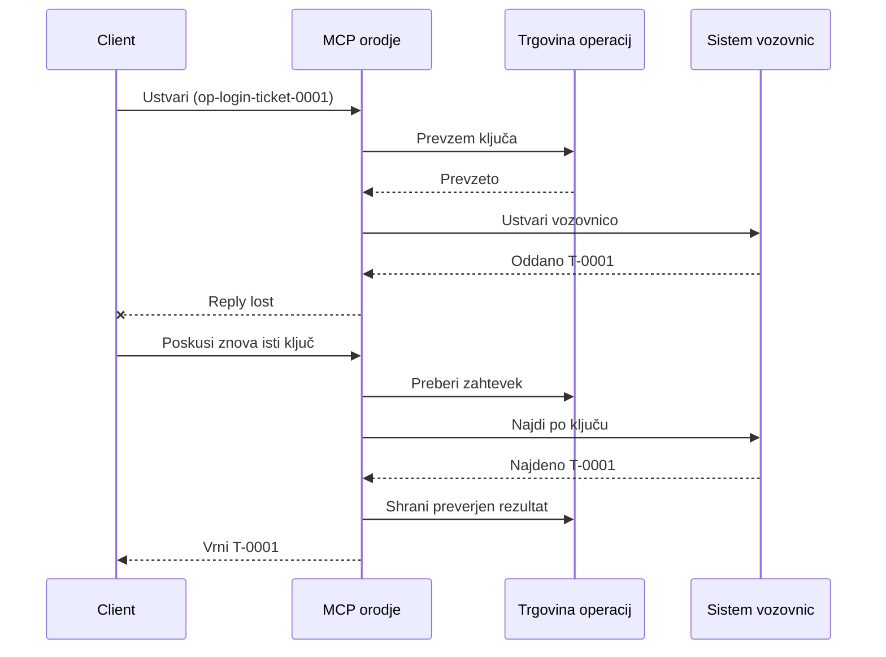
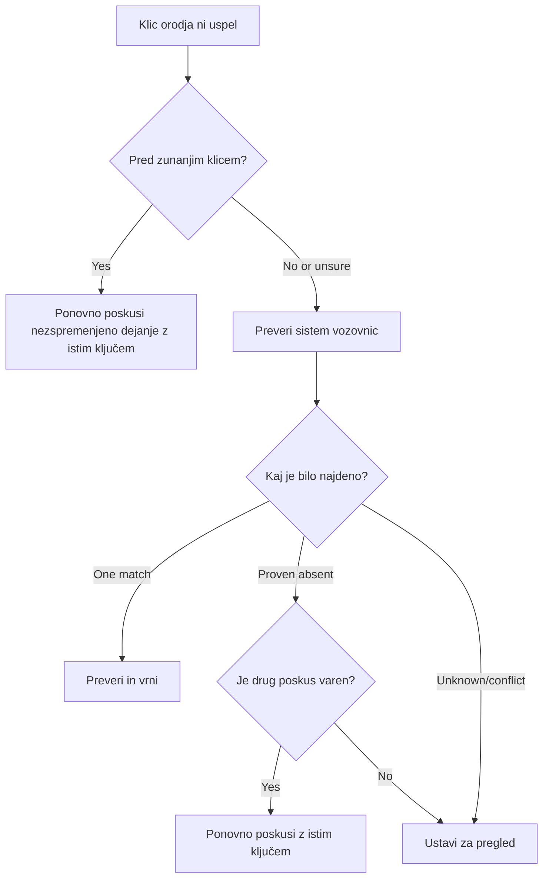

# Varni ponovni poskusi za orodja MCP: vzorec zanesljivostnega spremljevalca

Manjkanje odgovora ne pomeni, da dejanje manjka. Orodje za podporna vstopnice
lahko ustvari vstopnico `T-0001` in nato izgubi povezavo, preden stranka vidi
rezultat. Če stranka slepo poskuša znova, lahko ustvari `T-0002`.

Ta lekcija prikazuje, kako prepoznati ta negotov izid, ohraniti eno stabilno
identiteto za mišljeno dejanje in preveriti sistem vstopnic pred ponovnim poskusom.
Priložena vaja v Pythonu se izvaja lokalno s standardno knjižnico
in SQLite.

## Zakaj časovna omejitev pomeni "izid ni znan"

Predpostavimo, da klicatelj pokliče `create_support_ticket` z operacijskim ključem
`op-login-ticket-0001`:



Povezava pade po potrditvi vstopnice, a preden prispe rezultat.
Klicatelj ve samo, da odgovor manjka. Ne ve, ali vstopnica manjka.
Ponovna uporaba operacijskega ključa omogoči orodju, da najde in vrne
`T-0001`, namesto da ustvari `T-0002`.

## Kaj počne zanesljivostni spremljevalec

Zanesljivostni spremljevalec je programska koda, ki hrani stanje obnovitve okoli
orodja. Lahko je knjižnica, vmesna programska oprema, storitev z bazo podatkov ali preprosto
del implementacije orodja. Ni nujno, da je ločen proces,
in ni funkcija protokola MCP.

Spremljevalec ima štiri naloge:

1. shraniti mišljeno dejanje pred klicem zunanjega sistema;
2. dovoli, da le en izvajalec prevzame to dejanje;
3. zapomniti dovolj stanja za obnovitev po zrušitvi; in
4. preveriti zunanji sistem, ko je izid negotov.

Ta lekcija se nanaša na končno specifikacijo MCP `2026-07-28`. MCP nima
seje na ravni protokola, zato je operacijski ključ običajen argument orodja
, ki ga podpira trajno stanje aplikacije. Enak vzorec deluje tudi s starejšimi
različicami MCP.

## Štiri ID-ji, ki rešujejo različne probleme

Ti identifikatorji so povezani, a niso zamenljivi:

| Identifikator | Kaj identificira | Preživi ponovni poskus? |
| --- | --- | --- |
| JSON-RPC ID | En zahtevek in odgovor | Ne; uporabi nov ID zahtevka |
| MCP ID naloge | Ena dolgotrajna naloga | Da; obdrži za povpraševanje |
| Operacijski ključ | Ena mišljena akcija | Da; ponovno uporabi za to dejanje |
| ID vstopnice | Shranjeni rezultat | Da; vrni ga po preverjanju |

Obvestila o napredku in kontekst sledljivosti pomagajo opazovati zahtevek.
Prekinitev zahteva ustavitev dela. Noben od njih ne preprečuje podvojene vstopnice.

## Zgradi zaščito

Ustvari operacijski ključ pred prvim klicem orodja in ga shrani s
delovnim tokom. Vsak poskus ustvarjanja iste mišljene vstopnice uporabi isti ključ:

```json
{
  "operation_key": "op-login-ticket-0001",
  "title": "Cannot sign in"
}
```

Druga mišljena vstopnica dobi nov ključ. V produkciji generiraj neprosojno,
neizvedljivo vrednost namesto vstavljanja podatkov kupca v ključ.

Tukaj je popolna shema orodja MCP, uporabljena v tej lekciji:

```json
{
  "name": "create_support_ticket",
  "title": "Create support ticket",
  "description": "Creates or recovers one support ticket for an operation key.",
  "inputSchema": {
    "$schema": "https://json-schema.org/draft/2020-12/schema",
    "type": "object",
    "properties": {
      "operation_key": {
        "type": "string",
        "minLength": 16,
        "maxLength": 128,
        "description": "Stable key reused for the same intended action."
      },
      "title": {
        "type": "string",
        "minLength": 1,
        "maxLength": 200
      }
    },
    "required": ["operation_key", "title"],
    "additionalProperties": false
  },
  "outputSchema": {
    "$schema": "https://json-schema.org/draft/2020-12/schema",
    "type": "object",
    "properties": {
      "ticket_id": {
        "type": "string"
      },
      "operation_key": {
        "type": "string"
      },
      "status": {
        "type": "string",
        "const": "verified"
      }
    },
    "required": ["ticket_id", "operation_key", "status"],
    "additionalProperties": false
  }
}
```

Overjena identiteta klicatelja prihaja iz konteksta strežnika, ne iz
vhodnih podatkov orodja, ki jih zagotavlja model. Omeji vsako shranjeno operacijo na:

- tega klicatelja, najemnika ali storitvenega računa;
- ime in različico orodja; in
- zgoščenko normaliziranih vhodov, ki definirajo zunanjo akcijo.

Vhodna zgoščenka odgovori na preprosto vprašanje: "Ali ta ponovni poskus zahteva isto
vstopnico?" Če ključ že pripada drugemu naslovu, zavrni klic.

Vrnjena zgodnejša rešitev za spremenjen vhod bi prikrila napako pogodbe.

Zahtevek shranite z eno atomarno podatkovno operacijo. "Atomarno" pomeni, da dva delavca
ne moreta oba opazovati praznega zapisa in oba postati lastnika. Zaklepanje, ki je lokalno
za proces, ni dovolj, če lahko druga strežniška instanca prejme ponovni poskus.

Delovni tok ustvari ključ, medtem ko je dejanje `načrtovano`. Vzorec nato
trajno shrani te stanje:

- `zahtevan`: en delavec je rezerviral operacijo;
- `zaključen`: sistem za vstopnice je vrnil rezultat; in
- `preverjen`: branje iz sistema za vstopnice potrdi rezultat.

Nesreča lahko pusti shranjeno stanje na `zahtevan` tudi po tem, ko je bila
vstopnica ustvarjena. Vsak neodločen zahtevek obravnavajte kot negotovega, dokler ga zunanja
dokazila ne razjasnijo. Ne domnevajte, da `zahtevan` pomeni "se ni zgodilo nič."

## Oporavite se, preden ponovno poskusite

Ko klic orodja ne uspe, določite, kaj je znano, preden pošljete še eno zunanjo
pisanje:



Preverjanje, ki ne uspe pred klicem API-ja za vstopnice, je znana napaka.
Ponovno poskusite nespremenjeno dejanje z istim ključem operacije. Če popravljanje vhoda
spremeni namenjeno vstopnico, ustvarite nov ključ za to novo dejanje.

Če je zahteva morda dosegla sistem za vstopnice, jo najprej uskladite.
Usklajevanje pomeni primerjavo shranjenega zahtevka z avtoritativnim zapisom vstopnice.
Vrni obstoječo vstopnico, ko je najden natanko en ujemajoči se zapis.
Ponovno poskusite le, če vstopnica zagotovo ne obstaja in zgornja pogodba
naredi še en poskus varnega.

"Ni najdeno" ni vedno dokončno. Ponudnik s postopno doslednim
iskanjem lahko potrebuje omejeno čakanje in še en pregled. Če sistema ni mogoče
iskati, daje nasprotujoče se rezultate ali ne more varno deduplicirati drugega
poskusa, ustavite in poročajte o `izidu neznanem`. Ustavitev tukaj se včasih imenuje
"zataknjeno zaprto": delovni tok zavrne ugibanje.

## Dokazi, opravila in preklic

Odgovor orodja pove, kaj je orodje sporočilo. Shranjena kontrolna točka pove, kaj je
delovni tok zabeležil. Najmočnejši dokazi prihajajo iz sistema, ki je lastnik
rezultata: na primer, branje iz sistema za vstopnice, ki najde natanko eno
ujemajočo se vstopnico.

Prilagodite dokaze tveganju. ID sporočila ponudnika je morda dovolj za
obvestilo z nizkim tveganjem. Plačila, uvajanja in uničujoča dejanja lahko
potrebujejo dokazilo o stanju ponudnika, knjigi ali ročni kontroli.

Razširitev MCP Opravila dopolnjuje ta vzorec za dolgotrajno delo. ID opravila
omogoča odjemalcu nadaljevanje preverjanja po prekinitvi povezave, vendar ne določi
niti ne deduplira same vstopnice. Ko se uporabljajo opravil, se identitete povežejo
takole:

```text
operation key -> Task ID -> ticket ID -> verification evidence
```

Preklic je kooperativen, ne razveljavitev. Vstopnica je lahko še vedno ustvarjena
po potrditvi preklica, zato negotov rezultat še vedno potrebuje
uskladitev.

## Zaženite vajo vstavljanja napake

Vzorec uporablja dve datoteki SQLite: ena predstavlja trgovino operacij in
druga predstavlja zunanji sistem za vstopnice. Ni transakcije, ki bi obsegala
obe datoteki. Napako vstavimo po potrditvi vstopnice, a pred tem, ko
stranski avto zabeleži zaključek.

Neposredna Python metoda sprejme `caller_id` kot nadomestek za avtenticirano
strežniško okolje. Ne dodajajte `caller_id` v modelom nadzorovano MCP vhodno
shemo.

Napovejte rezultat pred zagonom testov:

| Pot | Rezultat po ponovnem poskusu | Število vstopnic |
| --- | --- | --- |
| Slepi ponovni poskus | Ustvari `T-0002` po izgubi odgovora za `T-0001` | 2 |

| Varovano ponovno poskušanje | Najde in vrne `T-0001` | 1 |

Zaženi:

```bash
cd 08-BestPractices/reliability-sidecars/python
python -m unittest discover -p "test_*.py" -v
```

Šest testov pokaže, da:

1. slepo ponovno poskušanje ustvari podvojitev;
2. izguba odziva plus ponovni zagon obnovi eno vozovnico iz trajne zahteve;
3. preverjeno ponovno poskušanje ponovno uporabi shranjeni rezultat;
4. spremenjen vnos ali nasprotujoči zunanji dokazi se zavrnejo;
5. obstoječa zahteva brez zunanjih dokazov se varno ustavi; in
6. sočasne zahteve dovoljujejo enega lastnika brez nazadovanja preverjenega rezultata.

Odpri primer:

- [Python implementacija](../../../../08-BestPractices/reliability-sidecars/python/reliability_sidecar.py)
- [Deterministični testi](../../../../08-BestPractices/reliability-sidecars/python/test_reliability_sidecar.py)

Vzorec namerno izpušča najeme zastarelih zahtev. Pravila prevzema v proizvodnji
potrebujejo omejen najem, atomski prenos lastništva in drugo zunanjo
preverbo pred izvedbo.

## Neobvezna skupnostna implementacija

Agent Enhancer Utilities je ena izmed skupnostnih implementacij tega
aplikacijskega vzorca. Njegov planer izbere pristop okrevanja, medtem ko
checkpoints beležijo stanje zahtev in negotovih rezultatov. Orodje domene ali
MCP strežnik še vedno izvaja in preverja resnično dejanje. Ta storitev ni
del MCP specifikacije in ni obvezna za to lekcijo.

| Koncept lekcije | Del Agent Enhancerja | Pomembna omejitev |
| --- | --- | --- |
| Načrt okrevanja | `workflow-guard-planner` | Ne kliče orodja domene |
| Zahteva in okrevanje | `workflow-checkpoint` | `external_proof` ostane `false` |
| Natančno predvajanje sidecarja | `lab.invoke_tool` | Uporablja ločen ključ idempotentnosti |
| Preveri resnično dejanje | Iskanje/branje cilja | Lasti ga domena MCP |

Za natančno ponovno poskušanje enega klica sidecar `lab.invoke_tool` sprejme zunanji
`idempotency_key`. Ta ključ identificira klic sidecar; ni poslovni
`operation_key`, uporabljen za vozovnico.

Značkana javna pogodba in neobvezen primer v mreži so na voljo
tukaj:

- [Pogodba Reliability Sidecar v1](https://github.com/artiehinz/Agent-Enhancer-Utilities/blob/v1.6.0/docs/RELIABILITY_SIDECAR_CONTRACT_V1.md)
- [Primer planer in lažna domena](https://github.com/artiehinz/Agent-Enhancer-Utilities/tree/v1.6.0/examples/reliability-sidecar)

Te povezave ilustrirajo aplikacijski vzorec. Ne trdijo, da
gostujoča storitev ustreza MCP `2026-07-28`, in stanje checkpoints nikoli ne šteje
kot zunanji dokaz vozovnice.

## Seznam za proizvodnjo

- [ ] Ustvari in shrani ključ operacije pred prvim zunanjim poskusom.
- [ ] Poveži ključ z klicateljem, različico orodja in normaliziranim zgoščencem vnosa.
- [ ] Zavrni spremenjen vnos pod obstoječim ključem.
- [ ] Dovoli enega lastnika z atomsko operacijo deljenega skladišča.
- [ ] Posreduj ključ navzdol do ponudnika, kadar podpira idempotentnost.
- [ ] Uskladi negotove izide pred drugo zapisjo.
- [ ] Ohrani preverjene rezultate in dokaze za celoten časovni okvir ponovnega poskusa.
- [ ] Ustavi za pregled, ko zunanji izid ni varen za ugotavljanje.

## Reference

- [Specifikacija MCP `2026-07-28`](https://modelcontextprotocol.io/specification/2026-07-28)
- [MCP `2026-07-28` smernice za orodja](https://modelcontextprotocol.io/specification/2026-07-28/server/tools)
- [Razširitev MCP Tasks](https://modelcontextprotocol.io/extensions/tasks/overview)
- [Specifikacija JSON-RPC 2.0](https://www.jsonrpc.org/specification)

---

<!-- CO-OP TRANSLATOR DISCLAIMER START -->
**Omejitev odgovornosti**:
Ta dokument je bil preveden z uporabo AI prevajalske storitve [Co-op Translator](https://github.com/Azure/co-op-translator). Čeprav si prizadevamo za natančnost, vas prosimo, da upoštevate, da avtomatizirani prevodi lahko vsebujejo napake ali netočnosti. Izvirni dokument v njegovem izvirnem jeziku je treba obravnavati kot avtoritativni vir. Za kritične informacije je priporočljiv strokovni človeški prevod. Ne odgovarjamo za morebitna nesporazume ali napačne interpretacije, ki izhajajo iz uporabe tega prevoda.
<!-- CO-OP TRANSLATOR DISCLAIMER END -->