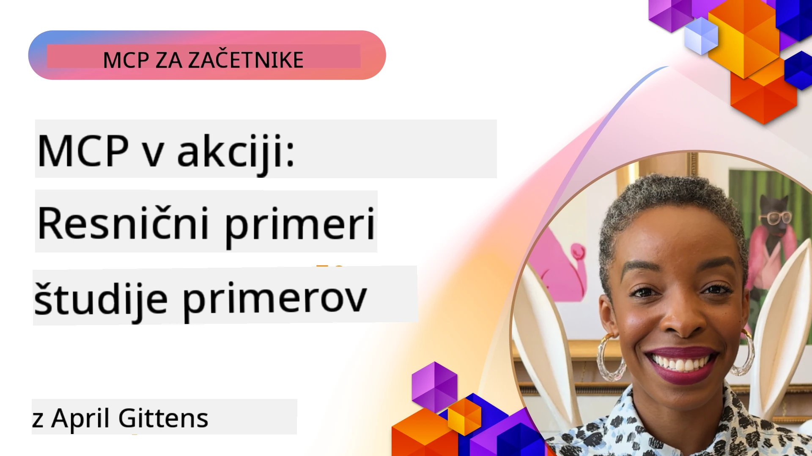

# MCP v akciji: Študije primerov iz resničnega sveta

_(Kliknite na zgornjo sliko za ogled videoposnetka te lekcije)_

Protokol konteksta modela (MCP) spreminja način, kako aplikacije AI sodelujejo s podatki, orodji in storitvami. Ta oddelek predstavlja študije primerov iz resničnega sveta, ki prikazujejo praktične uporabe MCP v različnih podjetniških scenarijih.

## Pregled

Ta oddelek prikazuje konkretne primere implementacij MCP, ki poudarjajo, kako organizacije izkoriščajo ta protokol za reševanje zapletenih poslovnih izzivov. S preučevanjem teh študij primerov boste pridobili vpoglede v vsestranskost, razširljivost in praktične koristi MCP v resničnih situacijah.

## Glavni učni cilji

Z raziskovanjem teh študij primerov boste:

- Razumeli, kako lahko MCP uporabimo za reševanje specifičnih poslovnih problemov
- Spoznali različne vzorce integracije in arhitekturne pristope
- Prepoznali najboljše prakse za izvajanje MCP v podjetniških okoljih
- Pridobili vpoglede v izzive in rešitve, s katerimi smo se srečevali v resničnih implementacijah
- Identificirali priložnosti za uporabo podobnih vzorcev v lastnih projektih

## Izpostavljene študije primerov

### 1. [Azure AI Travel Agents – Referenčna implementacija](./travelagentsample.md)

Ta študija primera preučuje Microsoftovo celovito referenčno rešitev, ki prikazuje, kako zgraditi večagentno, na AI-u temelječo aplikacijo za načrtovanje potovanj z uporabo MCP, Azure OpenAI in Azure AI Search. Projekt prikazuje:

- Upravljanje več agentov prek MCP
- Integracijo podjetniških podatkov z Azure AI Search
- Varnostno in razširljivo arhitekturo z uporabo Azure storitev
- Razširljive pripomočke z večkratno uporabo komponent MCP
- Pogovorno uporabniško izkušnjo z močjo Azure OpenAI

Arhitektura in podrobnosti implementacije nudijo dragocene vpoglede v gradnjo kompleksnih večagentnih sistemov z MCP kot koordinacijsko plastjo.

### 2. [Posodabljanje elementov Azure DevOps z YouTube podatki](./UpdateADOItemsFromYT.md)

Ta študija primera prikazuje praktično uporabo MCP za avtomatizacijo delovnih potekov. Pokaže, kako se lahko MCP orodja uporabijo za:

- Izvleček podatkov s spletnih platform (YouTube)
- Posodabljanje delovnih elementov v sistemih Azure DevOps
- Ustvarjanje ponovljivih avtomatiziranih tokov dela
- Integracijo podatkov med različnimi sistemi

Ta primer kaže, kako tudi razmeroma preproste implementacije MCP lahko prinesejo pomembne izboljšave učinkovitosti z avtomatizacijo rutinskih opravil in izboljšanjem skladnosti podatkov med sistemi.

### 3. [Pridobivanje dokumentacije v realnem času z MCP](./docs-mcp/README.md)

Ta študija primera vas vodi skozi povezovanje Python konzolnega odjemalca s strežnikom Model Context Protocol (MCP) za pridobivanje in beleženje dokumentacije Microsofta v realnem času, ki je kontekstno ozaveščena. Naučili se boste, kako:

- Povezati se s strežnikom MCP z uporabo Python odjemalca in uradnega MCP SDK
- Uporabiti streaming HTTP odjemalce za učinkovito pridobivanje podatkov v realnem času
- Klicati orodja za dokumentacijo na strežniku in neposredno beležiti odzive v konzolo
- Integrirati posodobljeno Microsoftovo dokumentacijo v svoj delovni proces brez zapuščanja terminala

Poglavje vključuje praktično nalogo, minimalen delujoč vzorec kode in povezave do dodatnih virov za poglobljeno učenje. Oglejte si celoten pregled in kodo v povezanem poglavju, da boste razumeli, kako lahko MCP preoblikuje dostop do dokumentacije in produktivnost razvijalcev v konzolnih okoljih.

### 4. [Interaktivna spletna aplikacija za generiranje študijskih načrtov z MCP](./docs-mcp/README.md)

Ta študija primera prikazuje, kako zgraditi interaktivno spletno aplikacijo z Chainlit in Model Context Protocol (MCP) za generiranje personaliziranih študijskih načrtov za katerokoli temo. Uporabniki lahko določijo predmet (npr. "certifikat AI-900") in trajanje študija (npr. 8 tednov), aplikacija pa bo zagotovila tedenski razpored priporočene vsebine. Chainlit omogoča pogovorni klepetalni vmesnik, ki je privlačen in prilagodljiv.

- Pogovorna spletna aplikacija na osnovi Chainlit
- Uporabniški pozivi za temo in trajanje
- Tedenske priporočitve vsebine z uporabo MCP
- Odzivi v realnem času z adaptivnim klepetalnim vmesnikom

Projekt prikazuje, kako se lahko pogovorna AI in MCP združita za ustvarjanje dinamičnih, uporabniško usmerjenih izobraževalnih orodij v sodobnem spletnem okolju.

### 5. [Dokumentacija v urejevalniku z MCP strežnikom v VS Code](./docs-mcp/README.md)

Ta študija primera prikazuje, kako lahko Microsoft Learn Docs pripeljete neposredno v svoje okolje VS Code z MCP strežnikom — brez preklapljanja med zavihki brskalnika! Videli boste, kako:

- Takojšnje iskanje in branje dokumentacije znotraj VS Code z MCP panelom ali ukazno vrstico
- Navajanje dokumentacije in vstavljanje povezav neposredno v README ali markdown datoteke tečajev
- Uporaba GitHub Copilota in MCP skupaj za nemotene AI-podprte delovne tokove dokumentacije in kode
- Preverjanje ter izboljševanje dokumentacije z odzivi v realnem času in natančnostjo iz Microsofta
- Integracija MCP z GitHub delovnimi tokovi za stalno validacijo dokumentacije

Implementacija vključuje:

- Primer konfiguracije `.vscode/mcp.json` za enostavno nastavitev
- Prikaze zaslona (screenshot) izkušnje v urejevalniku
- Nasvete za kombiniranje Copilota in MCP za največjo produktivnost

Ta scenarij je idealen za avtorje tečajev, pisce dokumentacije in razvijalce, ki želijo ostati osredotočeni v svojem urejevalniku med delom z dokumentacijo, Copilotom in orodji za validacijo — vse, podprto z MCP.

### 6. [Ustvarjanje MCP strežnika z APIM](./apimsample.md)

Ta študija primera zagotavlja korak-po-korak vodnik, kako ustvariti MCP strežnik z uporabo Azure API Management (APIM). Pokriva:

- Nastavitev MCP strežnika v Azure API Management
- Izpostavljanje API operacij kot MCP orodij
- Konfiguriranje politik za omejitev hitrosti in varnost
- Testiranje MCP strežnika z Visual Studio Code in GitHub Copilot

Ta primer prikazuje, kako izkoristiti zmogljivosti Azure za ustvarjanje robustnega MCP strežnika, ki se lahko uporablja v različnih aplikacijah in izboljšuje integracijo AI sistemov s podjetniškimi API-ji.

### 7. [GitHub MCP Register — Pospeševanje agentne integracije](https://github.com/mcp)

Ta študija primera preučuje GitHub MCP Register, ki je bil lansiran septembra 2025 in rešuje ključen izziv v AI ekosistemu: razdrobljeno odkrivanje in nameščanje strežnikov Model Context Protocol (MCP).

#### Pregled
**MCP Register** rešuje vedno večje težave raztresenih MCP strežnikov med repozitoriji in registri, zaradi katerih je bila integracija počasna in nagnjena k napakam. Ti strežniki omogočajo AI agentom interakcijo z zunanjimi sistemi, kot so API-ji, baze podatkov in viri dokumentacije.

#### Opis problema
Razvijalci, ki so gradili agentne delovne tokove, so se soočali z več izzivi:
- **Slaba odkritev** MCP strežnikov na različnih platformah
- **Podvajajoča se vprašanja o nastavitvah** po forumih in dokumentaciji
- **Varnostna tveganja** iz nepreverjenih in nezaupljivih virov
- **Pomanjkanje standardizacije** v kakovosti in združljivosti strežnikov

#### Arhitektura rešitve
GitHub MCP Register centralizira zaupanja vredne MCP strežnike z glavnim funkcionalnostmi:
- **Namestitev z enim klikom** preko VS Code za enostavno nastavitev
- **Razvrščanje signalov preko šuma** po številu zvezdic, aktivnosti in potrditvah skupnosti
- **Neposredna integracija** z GitHub Copilot in drugimi MCP združljivimi orodji
- **Odprt model prispevkov**, ki omogoča tako skupnosti kot podjetjem sodelovanje

#### Poslovni vpliv
Register je prinesel merljive izboljšave:
- **Hitrejše vključevanje** razvijalcev z orodji, kot je Microsoft Learn MCP Server, ki pretaka uradno dokumentacijo neposredno agentom
- **Izboljšana produktivnost** z namenskimi strežniki, kot je `github-mcp-server`, ki omogoča avtomatizacijo GitHub naravnega jezika (ustvarjanje PR, ponovni zagon CI, pregled kode)
- **Močnejše zaupanje v ekosistem** prek kuriranih seznamov in transparentnih standardov konfiguracije

#### Strateška vrednost
Za praktike, specializirane za upravljanje življenjskega cikla agentov in reproducibilne delovne tokove, MCP Register ponuja:
- **Modularno nameščanje agentov** s standardiziranimi komponentami
- **Ocene, podprte z registri** za dosledno testiranje in validacijo
- **Medorodna združljivost** omogoča nemoteno integracijo med različnimi AI platformami

Ta študija primera dokazuje, da MCP Register ni zgolj imenik — je temeljna platforma za razširljivo, resnično integracijo modelov in nameščanje agentnih sistemov.

### 8. [Objavljanje na družbenih omrežjih iz agenta](./publora-social-publishing.md)

Ta študija primera vodi skozi **remote MCP strežnik s pisanjem** — katerega orodja izvajajo nepovratne ukrepe v imenu uporabnika — z uporabo socialnega objavljanja kot deljenega primera. Agent pripravi objavo, človek jo odobri, strežnik pa jo razporedi po omrežjih.

Zanimiv del so oblikovne omejitve, ki jih objavljanje nalaga, in veljajo za vsak strežnik, ki piše namesto le branja:

- **Odprto odkrivanje, preverjena izvedba** — `tools/list` je dostopen brez poverilnic, tako da lahko registri in odjemalci pregledujejo, medtem ko vsak `tools/call` zahteva žeton in sicer vrne `401` z glavo `WWW-Authenticate`
- **OAuth registracija brez zunanjega koraka** — dinamična registracija odjemalca danes, s smernicami v Client ID Metadata Documents v specifikaciji `2026-07-28`
- **Oznake orodij** (`readOnlyHint`, `destructiveHint`, `idempotentHint`), ki jih odjemalci uporabljajo za odločitev, kaj potrditi — namigi namesto prisile, nekaj, kar zdaj pričakujejo direktoriji priključkov ob pregledu
- **Neizumljivi identifikatorji**, tako da halucinirana vrednost glasno neuspe, namesto da bi delovala po verjetno zgledajoči vrednosti
- **Idempotentni ključi na orodjih, ki ustvarjajo objavo**, da ponovni poskus izvajanja agenta ne ustvari podvajajoče objave
- **Brez-op cilj opisan v shemi orodja**, ki preizkuša celotno pot pisanja in ne objavi ničesar, za pregledovalce in CI

Poglavje se zaključi s kratkim kontrolnim seznamom, ki ga lahko uporabite za strežnik, ki ga gradite.

## Zaključek

Te osem obsežnih študij primerov prikazuje izjemno vsestranskost in praktične uporabe Model Context Protocol v različnih resničnih scenarijih. Od kompleksnih večagentnih sistemov za načrtovanje potovanj in upravljanja API-jev podjetij do poenostavljenih delovnih tokov dokumentacije in revolucionarnega GitHub MCP registra, ti primeri prikazujejo, kako MCP zagotavlja standardiziran, razširljiv način povezovanja AI sistemov z orodji, podatki in storitvami, ki jih potrebujejo za izjemno vrednost.

Študije primerov pokrivajo več dimenzij implementacije MCP:
- **Podjetniška integracija**: Azure API Management in avtomatizacija Azure DevOps
- **Večagentna orkestracija**: Načrtovanje potovanj z usklajenimi AI agenti
- **Produktivnost razvijalcev**: Integracija VS Code in dostop do dokumentacije v realnem času
- **Razvoj ekosistema**: GitHub MCP Register kot temeljna platforma
- **Izobraževalne aplikacije**: Interaktivni generatorji študijskih načrtov in pogovorni vmesniki

S preučevanjem teh implementacij pridobite ključne vpoglede v:
- **Arhitekturne vzorce** za različne razsežnosti in uporabe
- **Strategije implementacije**, ki uravnotežijo funkcionalnost z vzdržnostjo
- **Varnostne in razširljivostne** premisleke za produkcijske namestitve
- **Najboljše prakse** za razvoj MCP strežnikov in integracijo odjemalcev
- **Ekosistemsko razmišljanje** za gradnjo povezanih AI-podprtih rešitev

Ti primeri skupaj dokazujejo, da MCP ni zgolj teoretični okvir, temveč zrel, produkcijsko pripravljen protokol, ki omogoča praktične rešitve za zapletene poslovne izzive. Ne glede na to, ali gradite preprosta avtomatizirana orodja ali sofisticirane večagentne sisteme, vzorci in pristopi, prikazani tukaj, nudijo trdno osnovo za vaše lastne MCP projekte.

## Dodatni viri

- [Azure AI Travel Agents GitHub Repozitorij](https://github.com/Azure-Samples/azure-ai-travel-agents)
- [Azure DevOps MCP Orodje](https://github.com/microsoft/azure-devops-mcp)
- [Playwright MCP Orodje](https://github.com/microsoft/playwright-mcp)
- [Microsoft Docs MCP Strežnik](https://github.com/MicrosoftDocs/mcp)
- [GitHub MCP Register — Pospeševanje agentne integracije](https://github.com/mcp)
- [Skupnostni primeri MCP](https://github.com/microsoft/mcp)

## Kaj sledi

- Prejšnje: [Modul 8: Najboljše prakse](../08-BestPractices/README.md)
- Naslednje: [Modul 10: Poenostavljanje AI delovnih tokov: Gradnja MCP strežnika z AI kompletom orodij](../10-StreamliningAIWorkflowsBuildingAnMCPServerWithAIToolkit/README.md)

---

<!-- CO-OP TRANSLATOR DISCLAIMER START -->
**Omejitev odgovornosti**:
Ta dokument je bil preveden z uporabo AI prevajalske storitve [Co-op Translator](https://github.com/Azure/co-op-translator). Čeprav si prizadevamo za natančnost, vas prosimo, da upoštevate, da avtomatizirani prevodi lahko vsebujejo napake ali netočnosti. Izvirni dokument v njegovem izvirnem jeziku je treba obravnavati kot avtoritativni vir. Za kritične informacije je priporočljiv strokovni človeški prevod. Ne odgovarjamo za morebitna nesporazume ali napačne interpretacije, ki izhajajo iz uporabe tega prevoda.
<!-- CO-OP TRANSLATOR DISCLAIMER END -->