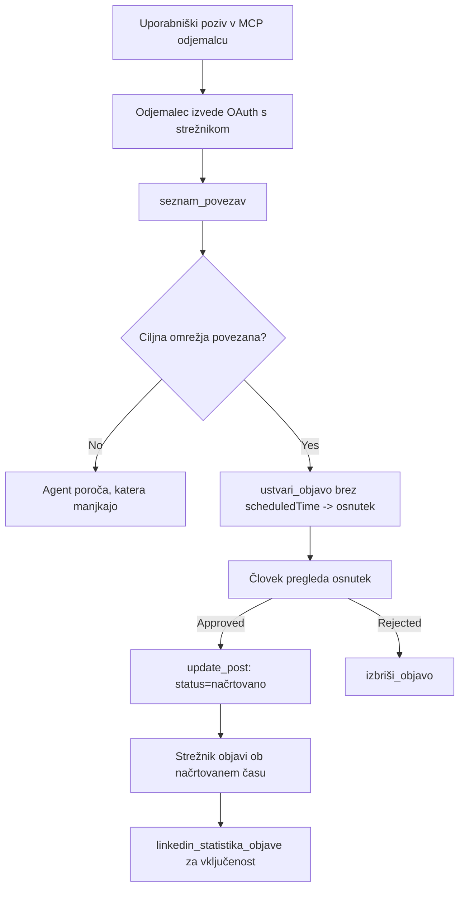

# Študija primera: Objavljanje na družbenih omrežjih iz agenta z oddaljenim MCP strežnikom

> **Opozorilo:** Več storitev in odprtokodnih projektov lahko objavlja na družbenih omrežjih, prav tako lahko ekipa neposredno integrira API vsakega omrežja. Spodnji scenarij je predstavljen kot en delujoč primer, kako je mogoče oblikovati in uporabljati **oddaljeni MCP strežnik z možnostjo zapisovanja**. Publora je komercialna storitev s prostim nivojem; vzorci, opisani tukaj, veljajo za vsak MCP strežnik, ki izvaja nepovratne ukrepe v imenu uporabnika.

## Pregled

Agenti so dobri pri pripravi vsebin in slabi pri njihovi dostavi. Model lahko v nekaj sekundah napiše objavo o novici, nato pa delo ustavi: objavljanje pomeni API za vsako omrežje, OAuth aplikacijo za vsako omrežje in drugačen nabor pravil za medije za vsako. Večina ekip to reši tako, da besedilo ročno kopira v brskalnik.

Ta študija primera preučuje, kako se ta zadnji korak zaključi z enim samim oddaljenim MCP strežnikom in — bolj uporabno za vsakogar, ki ga gradi — oblikovalske odločitve, ki jih mora strežnik z možnostjo pisanja pravilno izpeljati. Branje podatkov je odpuščajoče. Objavljanje ni: napačen klic orodja je viden publiki in ga ni mogoče razveljaviti.

## Scenarij

Majhna ekipa za odnose z razvijalci pripravlja objave znotraj agenta (Claude, VS Code, Cursor — odjemalec ni pomemben). Želijo, da agent:

- vidi, katere povezane račune ima ekipa,
- sestavi objavo in jo obdrži kot osnutek za potrditev s strani človeka,
- pripne sliko,
- razporedi objavo na več omrežij ob izbranem času,
- in pozneje poroča o njenem učinku.

Ključno je, da želijo, da agent *ne more* pomotoma objaviti, medtem ko še vedno preizkušajo.

## Uporabljena orodja

- [Publora MCP strežnik](https://github.com/publora/mcp-server) — oddaljeni MCP strežnik (`streamable-http`), ki izpostavlja orodja za objavljanje, razporejanje, medije in analitiko LinkedIna. Registriran v uradnem MCP registru kot `com.publora/mcp-server`.

## Korak za korakom delovni tok

1. **Povežite strežnik.** Odjemalci, ki podpirajo OAuth, zaključijo avtentikacijski rezultatni tok s PKCE preko lastnega zaslona soglasja strežnika; odjemalci, ki tega ne podpirajo, na primer brezglavi CLI, uporabljajo Publora API ključ v glavi. Obe poti sta podprti, katero boste dobili, pa je odvisno od odjemalca, ne od strežnika.
2. **Naštejte povezave.** Agent kliče `list_connections` in prejme povezane račune z njihovimi identifikatorji.
3. **Pripravite osnutek.** Agent kliče `create_post` *brez* razporejenega časa. Objavo shrani kot osnutek — nič ni objavljeno.
4. **Pripnite medije.** Javne URL-je slik posreduje v istem klicu; strežnik jih prenese in preveri.
5. **Razporedite.** Ko človek potrdi, `update_post` nastavi status na razporejeno s časom ISO 8601.
6. **Merite.** Za LinkedIn `linkedin_post_stats` vrne angažiranost, ko je objava aktivna.

## Primer poziva

```text
Which social accounts do I have connected?
Draft a post announcing our new changelog page, attach the screenshot at
https://example.com/changelog.png, and keep it as a draft — do not publish it.
Once I approve, schedule it to LinkedIn and Bluesky for tomorrow at 09:00 UTC.
```

## Zanka Mermaid



## Tehnična izvedba

Spodnje lekcije so prenosljivi del te študije primera.

### Odprto odkrivanje, avtenticirano izvajanje

`tools/list` je dostopen brez poverilnic; vsak `tools/call` zahteva žeton in sicer vrne `401` z glavo `WWW-Authenticate`, ki kaže na metapodatke zaščitenega vira. (Strežnik odgovarja tudi na neavtenticiran `initialize`, kar je pomembno le za odjemalce na različicah protokola pred `2026-07-28`; ta revizija je popolnoma odstranila rokovanje.)

Ta razdelitev v praksi šteje. Registri, kataloški imeniki in odjemalci lahko pregledujejo orodja — imena, sheme, oznake — brez skrivnosti, medtem ko se nič ne da *izvajati* anonimno. Strežnik, ki zahteva žeton za `initialize`, je dejansko neviden za orodje; strežnik, ki dovoljuje anonimni `tools/call`, pa je odgovornost.

### Registracija: dinamična registracija odjemalca in kaj jo nadomesti

Strežnik oglašuje `/.well-known/oauth-protected-resource` in `/.well-known/oauth-authorization-server` ter podpira avtorizacijski tok s kodo in PKCE (`S256`), osvežitvene žetone in **dinamično registracijo odjemalcev**.

Dinamična registracija odstrani ročni korak: brez nje vsak odjemalec potrebuje predhodno izdan `client_id`, kar pomeni zahtevo zunaj kanala za vsakega novega odjemalca.

Obravnavajte to kot združljivostno vedenje, ne pa kot načrt za kopiranje. Revizija specifikacije `2026-07-28` ukinja dinamično registracijo v korist dokumentov meta-podatkov ID odjemalca (Client ID Metadata Documents), kjer odjemalec gostuje dokument na stabilnem HTTPS URL in ta URL *je* `client_id`. DCR trenutno še deluje, vendar naj strežnik, ki se gradi danes, načrtuje CIMD in ohrani DCR le za starejše odjemalce.

### Oznake orodij niso okras

Vsako orodje nosi `title` in ustrezne namige: `readOnlyHint`, `destructiveHint`, `idempotentHint`, `openWorldHint`.

Dva razloga za vlaganje vanje. Prvič, odjemalci uporabijo namige, da odločijo, kaj potrditi z uporabnikom — odjemalec lahko samodejno izvede iskanje samo za branje in se ustavi za potrditev pred brisanjem. Specifikacija izrecno določa, da so oznake nezanesljivi namigi, ne mehanizem avtoritete: oblikujejo, kaj odjemalec ponuja storiti, ne ustavijo ničesar na strežniku, strežnik pa mora še vedno uveljavljati svoje pravilnike. Drugič, glavni imeniki povezovalcev zdaj *zahtevajo* njihovo prisotnost za pregled; strežnik brez naslovov in namigov bo zavrnjen ne glede na to, kako dobro deluje.

### Naredite identifikatorje neizmišljive

Identifikatorji platform so neprozorni nizi, ki jih vrne `list_connections`, in opis sheme izrecno pravi, da jih je treba dobesedno kopirati in nikoli ugibati. Strežnik zavrne vse drugo.

Modeli so vešči ugibalci. Vsak strežnik z možnostjo pisanja naj predpostavi, da bo identifikator na koncu nastal kot iluzija, in naj ta potovanje neuspešno in glasno zaustavi čim prej, namesto da bi ukrepal na verjetni vrednosti.

### Neuspeh pred objavo z uporabnim sporočilom

Nekatera omrežja zavračajo samo-besedilne objave in zahtevajo sliko ali video. To se preveri ob razporeditvi objave, napaka pa navede platformo in manjkajoči pogoj.

Agent se lahko povrne od "Instagram zahteva medije — pripnite sliko ali video" brez dodatnega klica. Ne more se povrniti od splošne `400` napake.

### Naredite ponovitve varne

Dve orodji za ustvarjanje vsebin, `create_post` in `update_post`, sprejemata ključ idempotence: ponovna uporaba z enako zahtevo ponovi prvotni odgovor namesto, da bi ustvarila drugo objavo. Agentovi časi izvajanja poskušajo ob časovnih omejitvah; brez idempotence postane počasni odziv podvojena objava. Druga orodja za zapisovanje — brisanja, koraki medijev, reakcije in komentarji LinkedIna — ne sprejemajo ključa, zato ponovitev ni samodejno varna. Velja vedeti, katere vaše mutacije so zaščitene in katere ne.

### Omogočite preizkus brez objave

Strežnik sprejema rezerviran cilj, `publora-playground`, ki se preveri in potrdi kot pravi cilj, nato pa zavrže — nič ne doseže aktivnega računa. Opisano je v sami shemi orodij, ki jo lahko vsak odjemalec prebere brez poverilnic: polje `platforms` pri `create_post` ga dokumentira kot "cilj testiranja povezave, ki ne zahteva prave povezave — objava je potrjena in zavrnjena, nič ne objavi". Kliče se tako, da ga pošljete kot edini vnos: `platforms: ["publora-playground"]`.

To se je izkazalo za eno najbolj uporabnih podrobnosti celotne površine. Pregledovalci imenikov povezovalcev, sodelavci in CI lahko izvedejo celotno pot pisanja brez tveganja za resnično publiko. Vsak MCP strežnik z nepovratnimi ukrepi ima korist od dokumentiranega cilja za brezdejanje.

## Rezultati in vpliv

- Korak objavljanja se je premaknil iz brskalnika v isti pogovor, kjer je vsebina napisana, in navada osnutka najprej ohranja človeka v zanki. Bodite natančni, kaj to pomeni: osnutek je konvencija, ne meja. Enake poverilnice lahko razporedijo ali objavijo, zato mora vsak, ki potrebuje pravo stopnjo odobritve, to uveljavljati zunaj orodjne površine — ločene poverilnice ali sloj politike pred strežnikom.
- Razlike po omrežjih — zahteve za medije, nitkanje, nadzori odgovorov — se obravnavajo enkrat na strežniku namesto v vsakem agentu posebej.
- Enak strežnik podpira več MCP odjemalcev brez dela po odjemalcu, ker je odkrivanje odprto in registracija dinamična.
- Oblikovne omejitve zgoraj so oblikovali tako pregledi imenikov povezovalcev kot uporabniki: oznake, OAuth in varni testni cilj so vsak posebej zahtevali vsaj eni od njih.

## Reference

- [Publora MCP strežnik (izvorno kodo)](https://github.com/publora/mcp-server)
- [Publora API in MCP dokumentacija](https://docs.publora.com)
- [Vnos v MCP registru: `com.publora/mcp-server`](https://registry.modelcontextprotocol.io/v0/servers?search=com.publora/mcp-server)
- [MCP specifikacija — Avtorizacija](https://modelcontextprotocol.io/specification/draft/basic/authorization)
- [MCP specifikacija — Oznake orodij](https://modelcontextprotocol.io/docs/concepts/tools)

## Kaj sledi

- Vzemite MCP strežnik, ki ga gradite, in preverite tri najcenejše izboljšave tukaj: oznake na vsakem orodju, ključ idempotence pri vsakem zapisu in dokumentiran cilj brez dejanja.
- Preizkusite razdeljeno odprto odkrivanje: pokličite `tools/list` proti javnemu oddaljenemu strežniku brez poverilnic, nato pokličite orodje in preglejte izziv `401`.
- Premislite, kaj "razveljavitev" pomeni za vašo domeno. Objavljanje ima osnutke in brisanje; če vaši ukrepi nimajo ekvivalenta, potrjevanje spada v zasnovo orodja, ne v poziv.

---

<!-- CO-OP TRANSLATOR DISCLAIMER START -->
**Omejitev odgovornosti**:
Ta dokument je bil preveden z uporabo AI prevajalske storitve [Co-op Translator](https://github.com/Azure/co-op-translator). Čeprav si prizadevamo za natančnost, vas prosimo, da upoštevate, da avtomatizirani prevodi lahko vsebujejo napake ali netočnosti. Izvirni dokument v njegovem izvirnem jeziku je treba obravnavati kot avtoritativni vir. Za kritične informacije je priporočljiv strokovni človeški prevod. Ne odgovarjamo za morebitna nesporazume ali napačne interpretacije, ki izhajajo iz uporabe tega prevoda.
<!-- CO-OP TRANSLATOR DISCLAIMER END -->