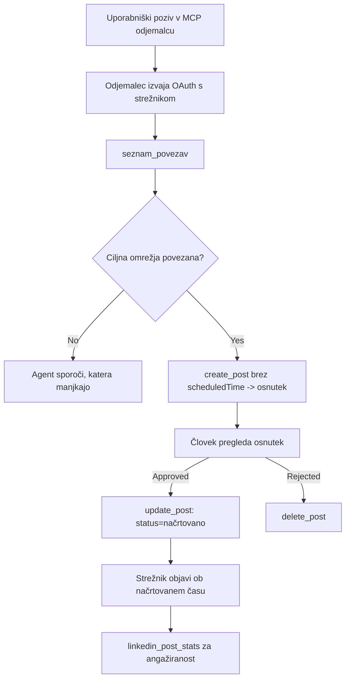

# Študija primera: Objavljanje na družbenih omrežjih iz agenta z oddaljenim MCP strežnikom

> **Opozorilo:** Več storitev in odprtokodnih projektov lahko objavlja na družbenih omrežjih, ekipa pa lahko tudi neposredno integrira API vsakega omrežja. Spodnji scenarij je predstavljen kot en delujoč primer, kako je mogoče oblikovati in uporabljati **zapisovalni oddaljeni MCP strežnik**. Publora je komercialna storitev s prostim paketom; vzorci, opisani tukaj, veljajo za vsak MCP strežnik, ki na uporabnikov račun izvaja nepreklicne ukrepe.

## Pregled

Agenti so dobri pri pripravi vsebin, slabi pa pri njihovi dostavi. Model lahko v nekaj sekundah zapiše obvestilo za izdajo, nato pa delo ustavi: objava pomeni API za vsako omrežje, OAuth aplikacijo za vsako omrežje in drugačen nabor pravil za medije za vsako. Večina ekip to reši tako, da ročno kopira besedilo v brskalnik.

Ta študija primera preuči, kako je ta zadnji korak zaključen z enim samim oddaljenim MCP strežnikom in — kar je bolj uporabno za vsakogar, ki ga gradi — oblikovne odločitve, ki jih mora pravilno izpeljati **zapisovalni** strežnik. Branje podatkov je odpuščajoče. Objavljanje ni: napačen klic orodja je viden občinstvu in ga ni mogoče razveljaviti.

## Scenarij

Majhna ekipa za odnose z razvijalci pripravlja objave znotraj agenta (Claude, VS Code, Cursor — odjemalec ni pomemben). Želijo, da agent:

- vidi, kateri družbeni računi so povezani z ekipo,
- pripravi osnutek objave in jo hrani kot osnutek, da jo odobri človek,
- priloži sliko,
- načrtuje objavo na več omrežjih ob izbranem času,
- in pozneje poroča o uspešnosti.

Ključno je, da želijo, da agent *ne more* nehote objavljati, ko še eksperimentirajo.

## Orodja, uporabljena

- [Publora MCP strežnik](https://github.com/publora/mcp-server) — oddaljeni MCP strežnik (`streamable-http`), ki omogoča orodja za objavljanje, načrtovanje, medije in analitiko LinkedIna. Registriran v uradnem MCP registru kot `com.publora/mcp-server`.

## Korak-po-korak delovni proces

1. **Poveži strežnik.** Odjemalci, ki podpirajo OAuth, opravijo tok avtorizacijskega kode s PKCE skozi lastni zaslon za privolitev strežnika; odjemalci, ki tega ne podpirajo, na primer nezaznavne ukazne vrstice, uporabljajo API ključ Publora v glavi. Podprti so oboji; katero metodo dobite, je odvisno od odjemalca, ne od strežnika.
2. **Naštej povezave.** Agent pokliče `list_connections` in prejme povezane račune z njihovimi identifikatorji.
3. **Pripravi osnutek.** Agent pokliče `create_post` *brez* načrtovanega časa. Objavo shrani kot osnutek — nič ni objavljeno.
4. **Priloži medije.** Javne URL-je slik pošlje v istem klicu; strežnik jih prenese in preveri.
5. **Načrtuj.** Ko človek odobri, `update_post` nastavi stanje na načrtovano z ISO 8601 časom.
6. **Merjenje.** Za LinkedIn `linkedin_post_stats` vrne angažiranost, ko je objava živa.

## Primer poziva

```text
Which social accounts do I have connected?
Draft a post announcing our new changelog page, attach the screenshot at
https://example.com/changelog.png, and keep it as a draft — do not publish it.
Once I approve, schedule it to LinkedIn and Bluesky for tomorrow at 09:00 UTC.
```

## Mermaid diagram poteka



## Tehnična implementacija

Spodnje lekcije so prenosljivi del te študije primera.

### Odprta odkritja, avtorizirano izvajanje

`tools/list` je dostopen brez poverilnic; vsak `tools/call` zahteva žeton
in sicer vrača `401` z glavo `WWW-Authenticate`, ki kaže na
metapodatke zaščitenega vira. Starejši strežniški konektor prav tako odgovarja na
neavtorizirani `initialize` za odjemalce z različic protokola pred
`2026-07-28`; trenutni odjemalci tega protokola ne uporabljajo.

Ta strežniško-specifična delitev omogoča registracijam, katalogom in odjemalcem ogled imen, shem in oznak orodij brez skrivnosti, ob prepovedi anonimnega
izvajanja. Odprta odkritja so izbira pri nameščanju, ne MCP zahteva; zaščitena namestitev lahko zahteva tudi avtorizacijo za `tools/list`.


moral vsak odjemalec imeti predhodno dodeljen `client_id` od prodajalca.


### Oznake orodij niso dekoracija

Vsako orodje nosi `title` in uporabo namige: `readOnlyHint`, `destructiveHint`, `idempotentHint`, `openWorldHint`.

Dva razloga za vlaganje vanje. Prvič, odjemalci uporabljajo namige za odločanje, kaj potrditi z uporabnikom — odjemalec lahko samodejno izvede iskanje samo za branje in se ustavi za potrditev pred brisanjem. Specifikacija izračno navaja, da so oznake nezaupljivi namigi, ne avtorizacijski mehanizem: oblikujejo, kaj odjemalec ponuja, ne ustavijo ničesar na strežniku, kjer strežnik še vedno mora uveljaviti svoja pravila. Drugič, glavni direktoriji konektorjev jih zdaj *zahtevajo* za pregled; strežnik, ki nima naslovov in namigov orodij, bo kljub delovanju zavrnjen.

### Naredite identifikatorje neizmišljive

Identifikatorji platform so neprozorne nizi, ki jih vrne `list_connections`, in opis sheme jasno določa, da jih je treba dobesedno kopirati in nikoli ugibati. Strežnik zavrne vse ostalo.

Modeli so tekoči ugibalci. Vsak zapisovalni strežnik bi moral predvideti, da bo identifikator slej ko prej haluciniran in naj ta pot glasno in zgodaj propade, namesto da bi ukrepal na podlagi verjetne vrednosti.

### Propadnite pred objavo, s sporočilom, ki je uporabno

Nekatera omrežja zavračajo objave samo z besedilom in zahtevajo sliko ali video. To se preverja, ko je objava načrtovana, in napaka navede platformo in manjkajočo zahtevo.

Agent se lahko odpravi od "Instagram zahteva medije — priložite sliko ali video" brez dodatnega kroga. Ni pa sposoben okrevanja pri splošni `400`.

### Naredi ponovitve varne

Dve orodji, ki ustvarjata vsebino, `create_post` in `update_post`, sprejemata ključ idempotentnosti: ponovna uporaba z enakim zahtevkom ponovi prvotni odgovor namesto da ustvari drugo objavo. Agenti v času izvajanja ponavljajo pri časovni omejitvi; brez idempotentnosti se počasni odziv spremeni v dvojno objavo. Druga orodja za zapis — brisanje, koraki z mediji, odzivi in komentarji na LinkedIn — ne sprejemajo ključa, zato ponovitev ni samodejno varna. Dobro je poznati, katere vaše mutacije so zaščitene in katere ne.

### Omogoči način testiranja, ki ne objavi ničesar

Strežnik sprejema rezerviran cilj, `publora-playground`, ki je preverjen in priznan kot pravi cilj in nato zavržen — nič ne pride do živega računa. To je opisano v sami shemi orodja, ki jo lahko vsak odjemalec prebere brez poverilnic: polje `platforms` pri `create_post` ga dokumentira kot "cilj za testiranje povezave, ki ne zahteva dejanske povezave — objava je priznana in zavržena, nič ni objavljeno". Pokličite ga tako, da ga daste kot edini vnos: `platforms: ["publora-playground"]`.

Izkazalo se je, da je to ena najbolj uporabnih podrobnosti celotne površine. Pregledovalci direktorijev konektorjev, sodelavci in CI lahko izvedejo celotno pot pisanja od začetka do konca brez tveganja za pravo občinstvo. Vsak MCP strežnik z nepreklicnimi ukrepi ima korist od dokumentiranega cilja no-op.

## Rezultati in vpliv

- Korak objave se je premaknil iz brskalnika v isti pogovor, kjer se piše vsebina, navada osnutka najprej pa ohranja človeka v zanki. Bodite natančni glede tega, kaj to pomeni: osnutek je konvencija, ne meja. Enake poverilnice lahko načrtujejo ali objavijo, zato mora vsak, ki potrebuje pravo odobritev, uveljaviti to zunaj orodja — ločene poverilnice ali sloj pravil pred strežnikom.
- Razlike med omrežji — zahteve medija, povezovanje v niti, kontrole odgovorov — se obravnavajo enkrat na strežniku, ne v vsakem agentu posebej.
- Enak strežnik podpira več MCP odjemalcev brez predhodno izdanih poverilnic.
    Trenutni odjemalci lahko uporabljajo Dokumente metapodatkov odjemalcev; DCR ostaja rezervna možnost
    za starejše odjemalce.
- Zasnovne omejitve zgoraj so oblikovali kot pregledi direktorijev konektorjev, tako kot uporabniki: oznake, OAuth in varen cilj za testi so bili vsaj enkrat zahtevani.

## Reference

- [Publora MCP strežnik (izvorna koda)](https://github.com/publora/mcp-server)
- [Publora API in MCP dokumentacija](https://docs.publora.com)
- [MCP registracija: `com.publora/mcp-server`](https://registry.modelcontextprotocol.io/v0/servers?search=com.publora/mcp-server)
- [MCP specifikacija — Avtorizacija](https://modelcontextprotocol.io/specification/2026-07-28/basic/authorization)
- [MCP specifikacija — Oznake orodij](https://modelcontextprotocol.io/docs/concepts/tools)

## Kaj sledi

- Vzemite MCP strežnik, ki ga gradite, in preglejte tri najcenejše zmage tukaj: oznake na vsakem orodju, idempotentni ključ na vsakem zapisu in dokumentiran cilj no-op.
- Preizkusite delitev odprtih odkritij: pokličite `tools/list` na javnem oddaljenem strežniku brez poverilnic, nato pa orodje in preglejte izziv `401`.
- Premislite, kaj "razveljavitev" pomeni v vašem področju. Objavljanje ima osnutke in brisanje; če vaši ukrepi nimajo ustreznika, je potrjevanje v zasnovi orodja, ne v pozivu.

---

<!-- CO-OP TRANSLATOR DISCLAIMER START -->
**Omejitev odgovornosti**:
Ta dokument je bil preveden z uporabo AI prevajalske storitve [Co-op Translator](https://github.com/Azure/co-op-translator). Čeprav si prizadevamo za natančnost, vas prosimo, da upoštevate, da avtomatizirani prevodi lahko vsebujejo napake ali netočnosti. Izvirni dokument v njegovem izvirnem jeziku je treba obravnavati kot avtoritativni vir. Za kritične informacije je priporočljiv strokovni človeški prevod. Ne odgovarjamo za morebitna nesporazume ali napačne interpretacije, ki izhajajo iz uporabe tega prevoda.
<!-- CO-OP TRANSLATOR DISCLAIMER END -->