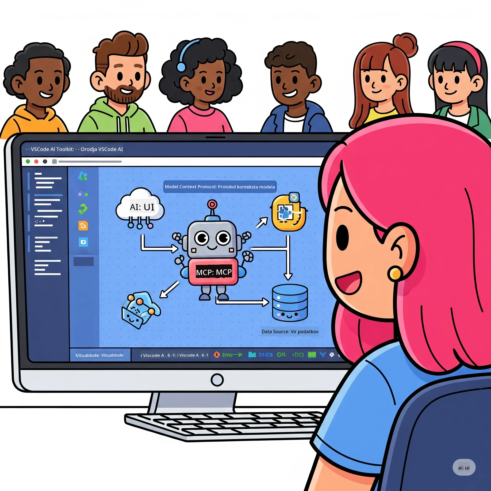
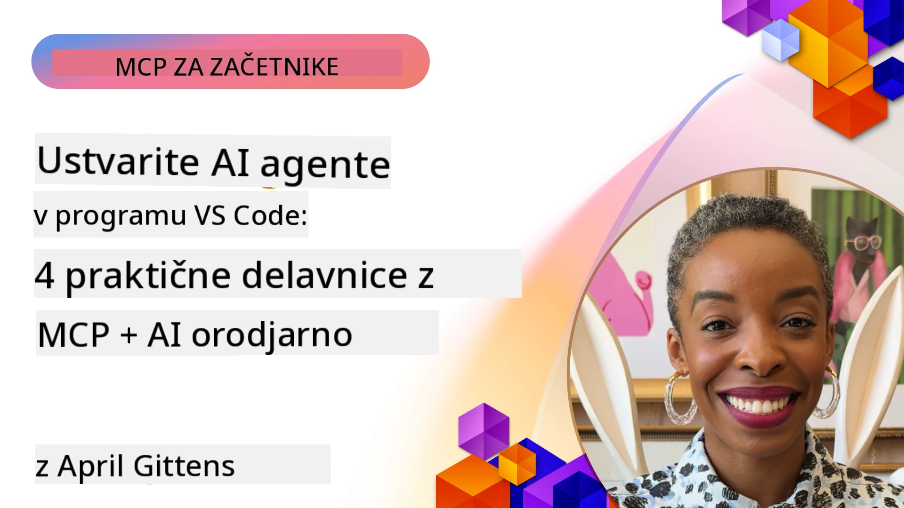

# Poenostavitev AI delovnih tokov: gradnja MCP strežnika z Microsoft Foundry Toolkit

## 🎯 Pregled

_(Kliknite zgornjo sliko za ogled videoposnetka te lekcije)_

Dobrodošli na **Delavnici Model Context Protocol (MCP)**! Ta obsežna praktična delavnica združuje dve najsodobnejši tehnologiji za revolucionarno razvoj AI aplikacij:

> **Opomba o združljivosti:** koda delavnice je bila zgrajena in testirana z MCP
> `2025-11-25`, kot je prikazano na zgornji znački. Uporabite
> [trenutno specifikacijo `2026-07-28`](https://modelcontextprotocol.io/specification/2026-07-28/)
> za nove implementacije protokola in pred prehodom na laboratorijske vaje
> preglejte izdaje SDK.

- **🔗 Model Context Protocol (MCP)**: odprt standard za brezhibno integracijo AI orodij
- **🛠️ Razširitev Microsoft Foundry Toolkit za VS Code**: zmogljiva Microsoftova AI razvojna razširitev

### 🎓 Kaj boste osvojili

Do konca te delavnice boste obvladali umetnost gradnje inteligentnih aplikacij, ki povezujejo AI modele z resničnimi orodji in storitvami. Od avtomatiziranega testiranja do prilagojenih API integracij boste pridobili praktične veščine za reševanje kompleksnih poslovnih izzivov.

## 🏗️ Tehnološki sklad

### 🔌 Model Context Protocol (MCP)

MCP je **"USB-C za AI"** – univerzalni standard, ki povezuje AI modele z zunanjimi orodji in podatkovnimi viri.

**✨ Ključne značilnosti:**

- 🔄 **Standardizirana integracija**: univerzalen vmesnik za povezave AI-orodij
- 🏛️ **Fleksibilna arhitektura**: lokalni in oddaljeni strežniki preko stdio/SSE prenosa
- 🧰 **Bogati ekosistem**: Orodja, spodbude in viri v enem protokolu
- 🔒 **Pripravljenost za podjetja**: vgrajena varnost in zanesljivost

**🎯 Zakaj je MCP pomemben:**
Tako kot je USB-C odpravil zmedo s kabli, MCP odpravlja kompleksnost AI integracij. En protokol, neskončne možnosti.

### 🤖 Razširitev Microsoft Foundry Toolkit za VS Code

Microsoftova vodilna AI razvojna razširitev, ki spremeni VS Code v AI močvir.

**🚀 Osnovne zmogljivosti:**

- 📦 **Katalog modelov**: dostop do modelov iz Azure AI, GitHub, Hugging Face, Ollama
- ⚡ **Lokalna inferenca**: ONNX-optimizirano izvajanje na CPU/GPU/NPU
- 🏗️ **Graditelj agentov**: vizualni razvoj AI agentov z MCP integracijo
- 🎭 **Večmodalno**: podpora za besedilo, vid in strukturirane izhode

**💡 Koristi pri razvoju:**

- Namestitev modela brez konfiguracije
- Vizualno oblikovanje pozivov
- Igralno polje za testiranje v realnem času
- Nemotena integracija MCP strežnika

## 📚 Učna pot

### [🚀 Modul 1: Osnove Microsoft Foundry Toolkit](./lab1/README.md)

**Trajanje**: 15 minut

- 🛠️ Namestite in konfigurirajte Microsoft Foundry Toolkit za VS Code
- 🗂️ Raziščite katalog modelov (100+ modelov iz GitHub, ONNX, OpenAI, Anthropic, Google)
- 🎮 Obvladajte interaktivno igralno polje za testiranje modelov v realnem času
- 🤖 Ustvarite svojega prvega AI agenta z Agent Builderjem
- 📊 Ocenite zmogljivost modela z vgrajenimi merili (F1, relevantnost, podobnost, koherenca)
- ⚡ Spoznajte zmogljivosti paketnega obdelovanja in večmodalno podporo

**🎯 Učni cilj**: Ustvarite funkcionalnega AI agenta s celovitim razumevanjem zmožnosti Microsoft Foundry Toolkit

### [🌐 Modul 2: MCP z osnovami Microsoft Foundry Toolkit](./lab2/README.md)

**Trajanje**: 20 minut

- 🧠 Obvladajte arhitekturo in koncepte Model Context Protocol (MCP)
- 🌐 Raziščite Microsoftov MCP strežniški ekosistem
- 🤖 Zgradite agent za avtomatizacijo brskalnika z uporabo Playwright MCP strežnika
- 🔧 Integrirajte MCP strežnike z Microsoft Foundry Toolkit Agent Builderjem
- 📊 Konfigurirajte in testirajte MCP orodja znotraj svojih agentov
- 🚀 Izvozite in uvedite agente, podprte z MCP, za produkcijsko uporabo

**🎯 Učni cilj**: Uvedite AI agenta, ki je izjemno podprt z zunanjimi orodji skozi MCP

### [🔧 Modul 3: Napredni razvoj MCP z Microsoft Foundry Toolkit](./lab3/README.md)

**Trajanje**: 20 minut

- 💻 Ustvarite prilagojene MCP strežnike z Microsoft Foundry Toolkit
- 🐍 Konfigurirajte in uporabljajte najnovejši MCP Python SDK (v1.9.3)
- 🔍 Nastavite in uporabite MCP Inspector za razhroščevanje
- 🛠️ Zgradite strežnik Weather MCP z profesionalnimi delovnimi tokovi za razhroščevanje
- 🧪 Razhroščujte MCP strežnike v okoljih Agent Builder in Inspector

**🎯 Učni cilj**: Razvijajte in razhroščujte prilagojene MCP strežnike z modernimi orodji

### [🐙 Modul 4: Praktični razvoj MCP - Prilagojen strežnik za kloniranje GitHub](./lab4/README.md)

**Trajanje**: 30 minut

- 🏗️ Zgradite resnični GitHub Clone MCP strežnik za razvojne delovne procese
- 🔄 Implementirajte pametno kloniranje repozitorijev z validacijo in obravnavo napak
- 📁 Ustvarite inteligentno upravljanje imenikov in integracijo z VS Code
- 🤖 Uporabljajte način GitHub Copilot Agent z prilagojenimi MCP orodji
- 🛡️ Uporabite produkcijsko zanesljivost in združljivost med platformami

**🎯 Učni cilj**: Uvedite produkcijsko pripravljen MCP strežnik, ki poenostavlja resnične razvojne delovne procese

## 💡 Resnični primeri uporabe in vpliv

### 🏢 Primeri uporabe v podjetjih

#### 🔄 Avtomatizacija DevOps

Spremenite svoj razvojni delovni proces z inteligentno avtomatizacijo:

- **Pametno upravljanje repozitorijev**: Odločanje o pregledu kode in združitvah, ki jih poganja AI
- **Inteligentni CI/CD**: Samodejna optimizacija cevovodov na podlagi sprememb kode
- **Razvrščanje težav**: Samodejna klasifikacija in dodelitev napak

#### 🧪 Revolucija zagotavljanja kakovosti

Izboljšajte testiranje z avtomatizacijo, ki poganja AI:

- **Inteligentno generiranje testov**: Samodejno ustvarjanje celovitih testnih sklopov
- **Vizualno regresijsko testiranje**: Odkrivanje sprememb v UI, ki ga poganja AI
- **Nadzor zmogljivosti**: Proaktivna identifikacija in rešitev težav

#### 📊 Inteligenca podatkovnih tokov

Zgradite pametnejše delovne tokove za obdelavo podatkov:

- **Prilagodljivi ETL postopki**: Samooptimizirajoče se transformacije podatkov
- **Zaznavanje anomalij**: Spremljanje kakovosti podatkov v realnem času
- **Pametno usmerjanje**: Pametno upravljanje pretoka podatkov

#### 🎧 Izboljšanje uporabniške izkušnje

Ustvarjajte izjemne interakcije s strankami:

- **Podpora, prilagojena kontekstu**: AI agenti z dostopom do zgodovine strank
- **Proaktivna rešitev težav**: Napovedna storitev za stranke
- **Integracija več kanalov**: Združena AI izkušnja na različnih platformah

## 🛠️ Zahteve in namestitev

### 💻 Sistemske zahteve

| Komponenta | Zahteva | Opombe |
|-----------|-------------|-------|
| **Operacijski sistem** | Windows 10+, macOS 10.15+, Linux | Poljuben sodoben OS |
| **Visual Studio Code** | Zadnja stabilna različica | Potrebno za Microsoft Foundry Toolkit |
| **Node.js** | v18.0+ in npm | Za razvoj MCP strežnika |
| **Python** | 3.10+ | Izbirno za MCP strežnike v Pythonu |
| **Spomin** | najmanj 8 GB RAM | Priporočeno 16 GB za lokalne modele |

### 🔧 Razvojno okolje

#### Priporočeni razširitve za VS Code

- **Microsoft Foundry Toolkit** (ms-windows-ai-studio.windows-ai-studio)
- **Python** (ms-python.python)
- **Python razhroščevalnik** (ms-python.debugpy)
- **GitHub Copilot** (GitHub.copilot) - Izbirno, a uporabno

#### Izbirna orodja

- **uv**: Sodobni Python upravljalec paketov
- **MCP Inspector**: Vizualno orodje za razhroščevanje MCP strežnikov
- **Playwright**: Za primere avtomatizacije spletnih strani

## 🎖️ Cilji učenja in potrditev

### 🏆 Seznam za obvladovanje veščin

Z zaključkom te delavnice boste dosegli obvladovanje na:

#### 🎯 Osnovne kompetence

- [ ] **Obvladovanje MCP protokola**: Globoko razumevanje arhitekture in vzorcev implementacije
- [ ] **Usposobljenost za Microsoft Foundry Toolkit**: Strokovna uporaba Microsoft Foundry Toolkit za hitro razvijanje
- [ ] **Razvoj po meri strežnikov**: Gradnja, uvajanje in vzdrževanje produkcijskih MCP strežnikov
- [ ] **Odličnost integracije orodij**: Gladko povezovanje AI z obstoječimi razvojni tokovi
- [ ] **Uporaba za reševanje težav**: Uporaba naučenih veščin za resnične poslovne izzive

#### 🔧 Tehnične veščine

- [ ] Namestite in konfigurirajte Microsoft Foundry Toolkit v VS Code
- [ ] Oblikujte in izvedite strežnike MCP po meri
- [ ] Integrirajte GitHub modele z MCP arhitekturo
- [ ] Ustvarite avtomatizirane preizkusne delovne tokove z Playwright
- [ ] Uvedite AI agente za produkcijsko rabo
- [ ] Razhroščite in optimizirajte zmogljivost MCP strežnika

#### 🚀 Napredne zmožnosti

- [ ] Arhitektura AI integracij na ravni podjetja
- [ ] Izvedba varnostnih najboljših praks za AI aplikacije
- [ ] Oblikovanje razširljivih MCP strežniških arhitektur
- [ ] Ustvarjanje orodnih nizov po meri za specifična področja
- [ ] Mentoriranje drugih v razvoj AI-native

## 📖 Dodatni viri

- [MCP specifikacija (2026-07-28)](https://modelcontextprotocol.io/specification/2026-07-28/)
- [Microsoft Foundry Toolkit GitHub repozitorij](https://github.com/microsoft/vscode-ai-toolkit)
- [Zbirka vzorčnih MCP strežnikov](https://github.com/modelcontextprotocol/servers)
- [Vodič najboljših praks](https://modelcontextprotocol.io/docs/best-practices)
- [OWASP MCP Top 10](https://microsoft.github.io/mcp-azure-security-guide/mcp/) - Najboljše varnostne prakse

---

**🚀 Pripravljeni na revolucijo v svojem razvojnem delovnem toku AI?**

Zgradimo skupaj prihodnost inteligentnih aplikacij z MCP in Microsoft Foundry Toolkit!

## Kaj sledi

Nadaljujte na: [Modul 11: MCP Server praktične vaje](../11-MCPServerHandsOnLabs/README.md)

---

<!-- CO-OP TRANSLATOR DISCLAIMER START -->
**Omejitev odgovornosti**:
Ta dokument je bil preveden z uporabo AI prevajalske storitve [Co-op Translator](https://github.com/Azure/co-op-translator). Čeprav si prizadevamo za natančnost, vas prosimo, da upoštevate, da avtomatizirani prevodi lahko vsebujejo napake ali netočnosti. Izvirni dokument v njegovem izvirnem jeziku je treba obravnavati kot avtoritativni vir. Za kritične informacije je priporočljiv strokovni človeški prevod. Ne odgovarjamo za morebitna nesporazume ali napačne interpretacije, ki izhajajo iz uporabe tega prevoda.
<!-- CO-OP TRANSLATOR DISCLAIMER END -->