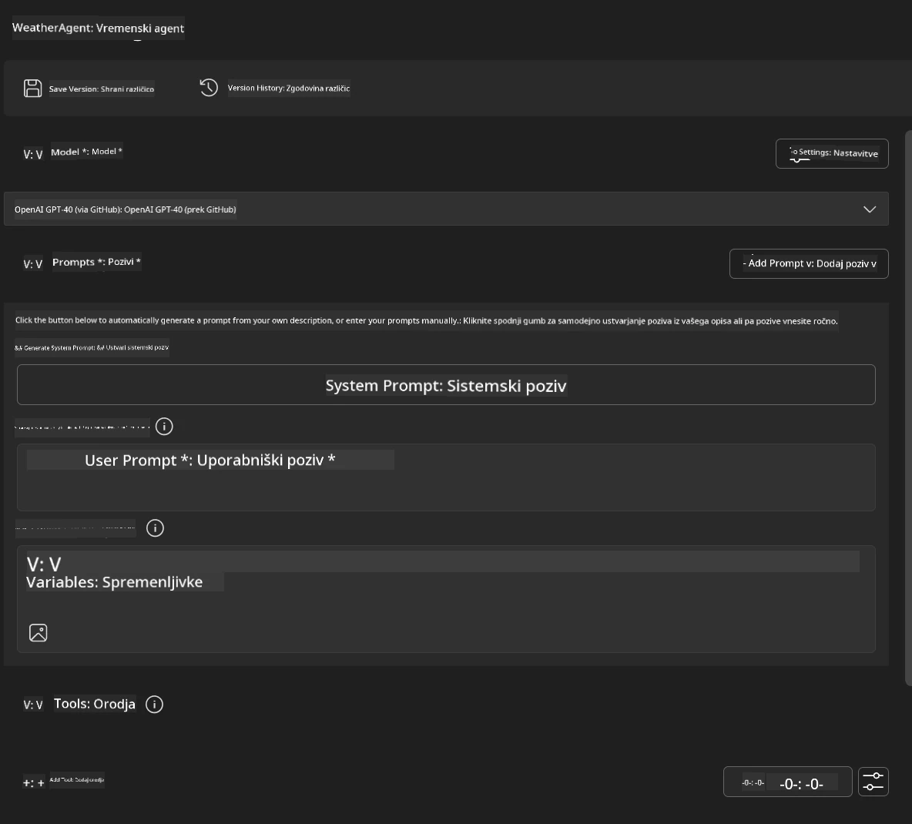
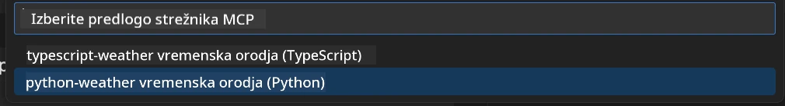
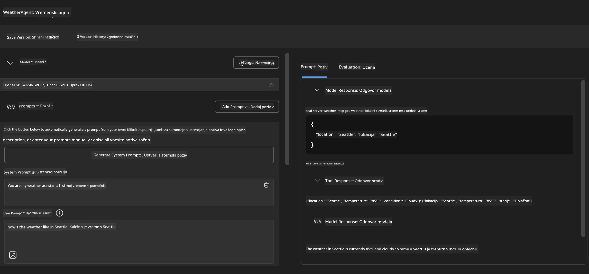
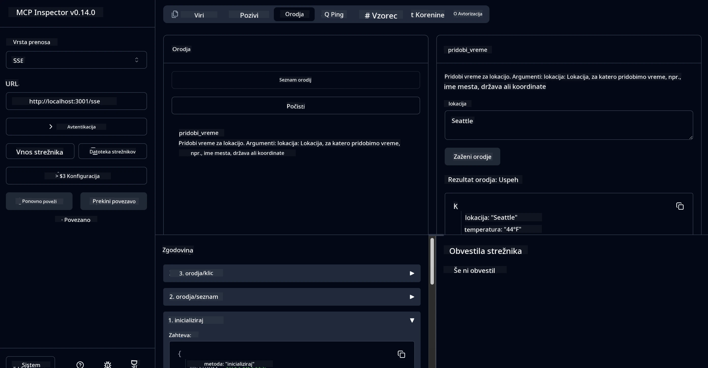

# 🔧 Modul 3: Napreden razvoj MCP z Microsoft Foundry Toolkit

> [!NOTE]
> URL-ji za Inspector v tej delavnici uporabljajo zastareli konec `/sse` in ciljajo na
> določene odvisnosti MCP SDK `1.9.3` in Inspector `0.14.0`. Niso
> trenutni primeri Streamable HTTP `2026-07-28`.


## 🎯 Cilji učenja

Ob koncu te delavnice boste znali:

- ✅ Ustvariti lastne MCP strežnike z Microsoft Foundry Toolkit
- ✅ Konfigurirati in uporabljati najnovejši MCP Python SDK (v1.9.3)
- ✅ Nastaviti in uporabljati MCP Inspector za odpravljanje napak
- ✅ Odpravljati napake MCP strežnikov v okoljih Agent Builder in Inspector
- ✅ Razumeti napredne poteke razvoja MCP strežnikov

## 📋 Predpogoji

- Dokončan modul 2 (Osnove MCP)
- VS Code z nameščeno Microsoft Foundry Toolkit razširitvijo
- Python 3.10+ okolje
- Node.js in npm za nastavitev Inspectorja

## 🏗️ Kaj boste zgradili

V tej delavnici boste ustvarili **Weather MCP strežnik**, ki prikazuje:
- Vlastno implementacijo MCP strežnika
- Integracijo z Microsoft Foundry Toolkit Agent Builder
- Profesionalne poteke odpravljanja napak
- Sodobne vzorce uporabe MCP SDK

---

## 🔧 Pregled osnovnih komponent

### 🐍 MCP Python SDK
Python SDK za Model Context Protocol zagotavlja osnovo za gradnjo lastnih MCP strežnikov. Uporabili boste različico 1.9.3 z izboljšanimi možnostmi odpravljanja napak.

### 🔍 MCP Inspector
Močno orodje za odpravljanje napak, ki zagotavlja:
- Spremljanje strežnika v realnem času
- Vizualizacijo izvajanja orodij
- Pregled omrežnih zahtevkov/odgovorov
- Interaktivno testno okolje

---

## 📖 Korak-po-korak implementacija

### Korak 1: Ustvarite WeatherAgent v Agent Builderju

1. **Zaženite Agent Builder** v VS Code preko Microsoft Foundry Toolkit razširitve
2. **Ustvarite novega agenta** z naslednjo konfiguracijo:
   - Ime agenta: `WeatherAgent`



### Korak 2: Inicializirajte MCP strežniški projekt

1. **Pojdite na Orodja** → **Dodaj orodje** v Agent Builderju
2. **Izberite "MCP Server"** med razpoložljivimi možnostmi
3. **Izberite "Ustvari nov MCP strežnik"**
4. **Izberite predlogo `python-weather`**
5. **Poimenujte svoj strežnik:** `weather_mcp`



### Korak 3: Odprite in preglejte projekt

1. **Odprite ustvarjeni projekt** v VS Code
2. **Preverite strukturo projekta:**
   ```
   weather_mcp/
   ├── src/
   │   ├── __init__.py
   │   └── server.py
   ├── inspector/
   │   ├── package.json
   │   └── package-lock.json
   ├── .vscode/
   │   ├── launch.json
   │   └── tasks.json
   ├── pyproject.toml
   └── README.md
   ```

### Korak 4: Nadgradite na najnovejši MCP SDK

> **🔍 Zakaj nadgraditi?** Želimo uporabiti najnovejši MCP SDK (v1.9.3) in storitev Inspector (0.14.0) za izboljšane funkcije in boljše odpravljanje napak.

#### 4a. Posodobite Python odvisnosti

**Uredite `pyproject.toml`:** posodobite [./code/weather_mcp/pyproject.toml](../../../../10-StreamliningAIWorkflowsBuildingAnMCPServerWithAIToolkit/lab3/code/weather_mcp/pyproject.toml)


#### 4b. Posodobite konfiguracijo Inspectorja

**Uredite `inspector/package.json`:** posodobite [./code/weather_mcp/inspector/package.json](../../../../10-StreamliningAIWorkflowsBuildingAnMCPServerWithAIToolkit/lab3/code/weather_mcp/inspector/package.json)

#### 4c. Posodobite odvisnosti Inspectorja

**Uredite `inspector/package-lock.json`:** posodobite [./code/weather_mcp/inspector/package-lock.json](../../../../10-StreamliningAIWorkflowsBuildingAnMCPServerWithAIToolkit/lab3/code/weather_mcp/inspector/package-lock.json)

> **📝 Opomba:** Ta datoteka vsebuje obsežne definicije odvisnosti. Spodaj je osnovna struktura - celotna vsebina zagotavlja pravilno reševanje odvisnosti.


> **⚡ Celoten Package Lock:** Celotna datoteka package-lock.json vsebuje približno 3000 vrstic definicij odvisnosti. Zgoraj je prikazana ključna struktura - za popolno rešitev odvisnosti uporabite priloženo datoteko.

### Korak 5: Konfigurirajte odpravljanje napak v VS Code

*Opomba: Prosimo, kopirajte datoteko na določenem mestu, da zamenjate ustrezno lokalno datoteko*

#### 5a. Posodobite konfiguracijo zagona

**Uredite `.vscode/launch.json`:**

```json
{
  "version": "0.2.0",
  "configurations": [
    {
      "name": "Attach to Local MCP",
      "type": "debugpy",
      "request": "attach",
      "connect": {
        "host": "localhost",
        "port": 5678
      },
      "presentation": {
        "hidden": true
      },
      "internalConsoleOptions": "neverOpen",
      "postDebugTask": "Terminate All Tasks"
    },
    {
      "name": "Launch Inspector (Edge)",
      "type": "msedge",
      "request": "launch",
      "url": "http://localhost:6274?timeout=60000&serverUrl=http://localhost:3001/sse#tools",
      "cascadeTerminateToConfigurations": [
        "Attach to Local MCP"
      ],
      "presentation": {
        "hidden": true
      },
      "internalConsoleOptions": "neverOpen"
    },
    {
      "name": "Launch Inspector (Chrome)",
      "type": "chrome",
      "request": "launch",
      "url": "http://localhost:6274?timeout=60000&serverUrl=http://localhost:3001/sse#tools",
      "cascadeTerminateToConfigurations": [
        "Attach to Local MCP"
      ],
      "presentation": {
        "hidden": true
      },
      "internalConsoleOptions": "neverOpen"
    }
  ],
  "compounds": [
    {
      "name": "Debug in Agent Builder",
      "configurations": [
        "Attach to Local MCP"
      ],
      "preLaunchTask": "Open Agent Builder",
    },
    {
      "name": "Debug in Inspector (Edge)",
      "configurations": [
        "Launch Inspector (Edge)",
        "Attach to Local MCP"
      ],
      "preLaunchTask": "Start MCP Inspector",
      "stopAll": true
    },
    {
      "name": "Debug in Inspector (Chrome)",
      "configurations": [
        "Launch Inspector (Chrome)",
        "Attach to Local MCP"
      ],
      "preLaunchTask": "Start MCP Inspector",
      "stopAll": true
    }
  ]
}
```

**Uredite `.vscode/tasks.json`:**

```
{
  "version": "2.0.0",
  "tasks": [
    {
      "label": "Start MCP Server",
      "type": "shell",
      "command": "python -m debugpy --listen 127.0.0.1:5678 src/__init__.py sse",
      "isBackground": true,
      "options": {
        "cwd": "${workspaceFolder}",
        "env": {
          "PORT": "3001"
        }
      },
      "problemMatcher": {
        "pattern": [
          {
            "regexp": "^.*$",
            "file": 0,
            "location": 1,
            "message": 2
          }
        ],
        "background": {
          "activeOnStart": true,
          "beginsPattern": ".*",
          "endsPattern": "Application startup complete|running"
        }
      }
    },
    {
      "label": "Start MCP Inspector",
      "type": "shell",
      "command": "npm run dev:inspector",
      "isBackground": true,
      "options": {
        "cwd": "${workspaceFolder}/inspector",
        "env": {
          "CLIENT_PORT": "6274",
          "SERVER_PORT": "6277",
        }
      },
      "problemMatcher": {
        "pattern": [
          {
            "regexp": "^.*$",
            "file": 0,
            "location": 1,
            "message": 2
          }
        ],
        "background": {
          "activeOnStart": true,
          "beginsPattern": "Starting MCP inspector",
          "endsPattern": "Proxy server listening on port"
        }
      },
      "dependsOn": [
        "Start MCP Server"
      ]
    },
    {
      "label": "Open Agent Builder",
      "type": "shell",
      "command": "echo ${input:openAgentBuilder}",
      "presentation": {
        "reveal": "never"
      },
      "dependsOn": [
        "Start MCP Server"
      ],
    },
    {
      "label": "Terminate All Tasks",
      "command": "echo ${input:terminate}",
      "type": "shell",
      "problemMatcher": []
    }
  ],
  "inputs": [
    {
      "id": "openAgentBuilder",
      "type": "command",
      "command": "ai-mlstudio.agentBuilder",
      "args": {
        "initialMCPs": [ "local-server-weather_mcp" ],
        "triggeredFrom": "vsc-tasks"
      }
    },
    {
      "id": "terminate",
      "type": "command",
      "command": "workbench.action.tasks.terminate",
      "args": "terminateAll"
    }
  ]
}
```


---

## 🚀 Zagon in testiranje vašega MCP strežnika

### Korak 6: Namestite odvisnosti

Po izvedbi sprememb konfiguracije zaženite naslednje ukaze:

**Namestite Python odvisnosti:**
```bash
uv sync
```

**Namestite odvisnosti Inspectorja:**
```bash
cd inspector
npm install
```

### Korak 7: Odpravljanje napak z Agent Builder

1. **Pritisnite F5** ali uporabite konfiguracijo **"Debug in Agent Builder"**
2. **Izberite sestavljeno konfiguracijo** iz panela za odpravljanje napak
3. **Počakajte na zagon strežnika** in odpiranje Agent Builderja
4. **Testirajte svoj Weather MCP strežnik** z naravnimi jezikovnimi poizvedbami

Vnosni poziv, kot je ta

SYSTEM_PROMPT

```
You are my weather assistant
```

USER_PROMPT

```
How's the weather like in Seattle
```



### Korak 8: Odpravljanje napak z MCP Inspectorjem

1. **Uporabite konfiguracijo "Debug in Inspector"** (Edge ali Chrome)
2. **Odprite vmesnik Inspector** na `http://localhost:6274`
3. **Raziskujte interaktivno testno okolje:**
   - Ogled razpoložljivih orodij
   - Testiranje izvajanja orodij
   - Spremljanje omrežnih zahtevkov
   - Odpravljanje napak strežniških odgovorov



---

## 🎯 Ključni rezultati učenja

Z izvedbo te delavnice ste:

- [x] **Ustvarili lastni MCP strežnik** z Microsoft Foundry Toolkit predlogami
- [x] **Nadgradili na najnovejši MCP SDK** (v1.9.3) za izboljšane funkcionalnosti
- [x] **Konfigurirali profesionalne poteke odpravljanja napak** za Agent Builder in Inspector
- [x] **Nastavili MCP Inspector** za interaktivno testiranje strežnika
- [x] **Obvladali konfiguracije odpravljanja napak v VS Code** za razvoj MCP

## 🔧 Raziskane napredne funkcije

| Funkcija | Opis | Primer uporabe |
|---------|-------------|----------|
| **MCP Python SDK v1.9.3** | Najnovejša implementacija protokola | Sodobni razvoj strežnikov |
| **MCP Inspector 0.14.0** | Interaktivno orodje za odpravljanje napak | Testiranje strežnika v realnem času |
| **Odpravljanje napak v VS Code** | Integrirano razvojno okolje | Profesionalni potek odpravljanja napak |
| **Integracija Agent Builder** | Neposredna povezava Microsoft Foundry Toolkit | Celovito testiranje agentov |

## 📚 Dodatni viri

- [Dokumentacija MCP Python SDK](https://modelcontextprotocol.io/docs/sdk/python)
- [Vodnik za Microsoft Foundry Toolkit razširitev](https://code.visualstudio.com/docs/ai/ai-toolkit)
- [Dokumentacija za odpravljanje napak v VS Code](https://code.visualstudio.com/docs/editor/debugging)
- [Specifikacija Model Context Protocol](https://modelcontextprotocol.io/docs/concepts/architecture)

---

**🎉 Čestitke!** Uspešno ste zaključili modul 3 in zdaj lahko ustvarjate, odpravljate napake ter nameščate lastne MCP strežnike z profesionalnimi poteki razvoja.

### 🔜 Nadaljujte na naslednji modul

Ste pripravljeni uporabiti svoje znanje MCP v realnem razvojnem poteku? Nadaljujte na **[Modul 4: Praktični razvoj MCP - Lastni GitHub klon strežnik](../lab4/README.md)**, kjer boste:
- Zgradili produkcijsko pripravljen MCP strežnik, ki avtomatizira operacije GitHub repozitorijev
- Implementirali funkcionalnost kloniranja GitHub repozitorijev preko MCP
- Integrirali lastne MCP strežnike z VS Code in GitHub Copilot Agent Mode
- Testirali in nameščali lastne MCP strežnike v produkcijskem okolju
- Naučili se praktične avtomatizacije delovnih procesov za razvijalce

---

<!-- CO-OP TRANSLATOR DISCLAIMER START -->
**Omejitev odgovornosti**:
Ta dokument je bil preveden z uporabo AI prevajalske storitve [Co-op Translator](https://github.com/Azure/co-op-translator). Čeprav si prizadevamo za natančnost, vas prosimo, da upoštevate, da avtomatizirani prevodi lahko vsebujejo napake ali netočnosti. Izvirni dokument v njegovem izvirnem jeziku je treba obravnavati kot avtoritativni vir. Za kritične informacije je priporočljiv strokovni človeški prevod. Ne odgovarjamo za morebitna nesporazume ali napačne interpretacije, ki izhajajo iz uporabe tega prevoda.
<!-- CO-OP TRANSLATOR DISCLAIMER END -->