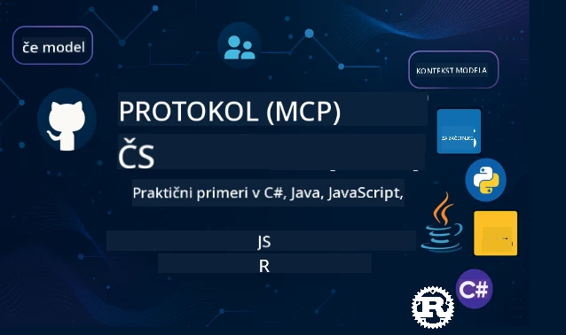

 

[](https://GitHub.com/microsoft/mcp-for-beginners/graphs/contributors)
[](https://GitHub.com/microsoft/mcp-for-beginners/issues)
[](https://GitHub.com/microsoft/mcp-for-beginners/pulls)
[](http://makeapullrequest.com)

[](https://GitHub.com/microsoft/mcp-for-beginners/watchers)
[](https://GitHub.com/microsoft/mcp-for-beginners/fork)
[](https://GitHub.com/microsoft/mcp-for-beginners/stargazers)


[](https://discord.gg/nTYy5BXMWG)

Sledite tem korakom za začetek uporabe teh virov:
1. **Razvejite repozitorij**: Kliknite [](https://GitHub.com/microsoft/mcp-for-beginners/fork)
2. **Klonirajte repozitorij**:   `git clone https://github.com/microsoft/mcp-for-beginners.git`
3. **Pridružite se** [](https://discord.gg/nTYy5BXMWG)


### 🌐 Podpora več jezikov

#### Podprto z GitHub akcijo (samodejno in vedno posodobljeno)

<!-- CO-OP TRANSLATOR LANGUAGES TABLE START -->
[Arabščina](../ar/README.md) | [Bengalščina](../bn/README.md) | [Bolgarščina](../bg/README.md) | [Burmanščina (Mjanmar)](../my/README.md) | [Kitajščina (poenostavljena)](../zh-CN/README.md) | [Kitajščina (tradicionalna, Hongkong)](../zh-HK/README.md) | [Kitajščina (tradicionalna, Makao)](../zh-MO/README.md) | [Kitajščina (tradicionalna, Tajvan)](../zh-TW/README.md) | [Hrvaščina](../hr/README.md) | [Češčina](../cs/README.md) | [Danska](../da/README.md) | [Nizozemščina](../nl/README.md) | [Estonščina](../et/README.md) | [Finnščina](../fi/README.md) | [Franščina](../fr/README.md) | [Nemščina](../de/README.md) | [Grščina](../el/README.md) | [Hebrejščina](../he/README.md) | [Hindijščina](../hi/README.md) | [Madžarščina](../hu/README.md) | [Indonezijščina](../id/README.md) | [Italijanščina](../it/README.md) | [Japonščina](../ja/README.md) | [Kannada](../kn/README.md) | [Korejščina](../ko/README.md) | [Litvanščina](../lt/README.md) | [Malajščina](../ms/README.md) | [Malajalščina](../ml/README.md) | [Maratščina](../mr/README.md) | [Nepalščina](../ne/README.md) | [Nigerski pidžin](../pcm/README.md) | [Norveščina](../no/README.md) | [Perzijščina (Farši)](../fa/README.md) | [Poljščina](../pl/README.md) | [Portugalščina (Brazilija)](../pt-BR/README.md) | [Portugalščina (Portugalska)](../pt-PT/README.md) | [Pandžabi (Gurmuki)](../pa/README.md) | [Romunščina](../ro/README.md) | [Ruščina](../ru/README.md) | [Srbščina (cirilica)](../sr/README.md) | [Slovaščina](../sk/README.md) | [Slovenščina](./README.md) | [Španščina](../es/README.md) | [Svahili](../sw/README.md) | [Švedščina](../sv/README.md) | [Tagaloški (Filipini)](../tl/README.md) | [Tamilščina](../ta/README.md) | [Telugu](../te/README.md) | [Tajščina](../th/README.md) | [Turščina](../tr/README.md) | [Ukrajinščina](../uk/README.md) | [Urdu](../ur/README.md) | [Vietnamščina](../vi/README.md)

> **Raje klonirate lokalno?**

> Ta repozitorij vsebuje prevode v več kot 50 jezikih, kar znatno poveča velikost prenosa. Za kloniranje brez prevodov uporabite nekoherentni checkout:
> ```bash
> git clone --filter=blob:none --sparse https://github.com/microsoft/mcp-for-beginners.git
> cd mcp-for-beginners
> git sparse-checkout set --no-cone '/*' '!translations' '!translated_images'
> ```
> Tako boste dobili vse, kar potrebujete za dokončanje tečaja z veliko hitrejšim prenosom.
<!-- CO-OP TRANSLATOR LANGUAGES TABLE END -->

# 🚀 Učni načrt Model Context Protocol (MCP) za začetnike

## **Naučite se MCP z interaktivnimi primeri kode v C#, Java, JavaScript, Rust, Python in TypeScript**

## 🧠 Pregled učnega načrta Model Context Protocol
Dobrodošli na vaši poti v Model Context Protocol! Če ste se kdaj spraševali, kako AI aplikacije komunicirajo z različnimi orodji in storitvami, boste zdaj odkrili elegantno rešitev, ki spreminja način, kako razvijalci gradijo inteligentne sisteme.

MCP si zamislite kot univerzalni prevajalec za AI aplikacije – tako kot vam USB vmesniki omogočajo povezavo kateregakoli naprave s računalnikom, MCP omogoča AI modelom, da se na standardiziran način povežejo s katerim koli orodjem ali storitvijo. Ne glede na to, ali ustvarjate svoj prvi klepetalni robot ali delate na zahtevnih AI potekih dela, vam razumevanje MCP daje moč za izdelavo bolj zmogljivih in prilagodljivih aplikacij.

Ta učni načrt je zasnovan z vztrajnostjo in skrbjo za vaš učni proces. Začeli bomo z enostavnimi koncepti, ki jih že poznate, in postopoma gradili vaše znanje s praktično vadbo v vašem priljubljenem programskem jeziku. Vsak korak vključuje jasne razlage, praktične primere in obilo spodbude skozi celotno pot.

Ko dokončate to pot, boste zmogli sami zgraditi MCP strežnike, jih integrirati s priljubljenimi AI platformami in razumeli, kako ta tehnologija preoblikuje prihodnost razvoja AI. Začnimo skupaj to razburljivo dogodivščino!

### Uradna dokumentacija in specifikacije

Ti viri postajajo vse bolj dragoceni, ko bo vaše razumevanje raslo, a ne čutite pritiska, da morate vse prebrati takoj. Začnite z deli, ki vas najbolj zanimajo!
- 📘 [MCP dokumentacija](https://modelcontextprotocol.io/) – To je vaš glavni vir za korak-po-koraku vodiče in uporabniške priročnike. Dokumentacija je napisano z mislijo na začetnike, ponuja jasne primere, ki jim lahko sledite v svojem tempu.
- 📜 [MCP specifikacija](https://modelcontextprotocol.io/docs/) – Številka kot obsežen referenčni priročnik. Med potekom učnega načrta se boste tu vračali po natančne podrobnosti in raziskovali napredne funkcije.
- 📜 [Izvirna MCP specifikacija](https://modelcontextprotocol.io/specification/versioning) – Vsebuje dodatne tehnične podrobnosti, ki so lahko koristne za napredne implementacije. Na voljo je, ko jo potrebujete, a se z njo ne obremenjujte ob začetku.
- 🧑‍💻 [MCP GitHub repozitorij](https://github.com/modelcontextprotocol) – Tukaj najdete SDK-je, orodja in primere kode v različnih programskih jezikih. Kot zakladnica praktičnih primerov in komponent, pripravljenih za uporabo.
- 🌐 [MCP skupnost](https://github.com/orgs/modelcontextprotocol/discussions) – Pridružite se drugim učencem in izkušenim razvijalcem v razpravah o MCP. Podporno okolje, kjer so vprašanja dobrodošla in se znanje prosto deli.
  
## Cilji učenja

Ko boste zaključili ta učni načrt, boste samozavestni in navdušeni nad novimi znanji. Tukaj je, kaj boste dosegli:

• **Razumeti temelje MCP**: Spoznali boste, kaj je Model Context Protocol in zakaj spreminja način, kako AI aplikacije sodelujejo, s pomočjo analogij in preprostih primerov.

• **Zgraditi svoj prvi MCP strežnik**: Ustvarili boste delujoč MCP strežnik v vašem priljubljenem programskem jeziku, začeli z enostavnimi primeri in postopoma gradili svoje znanje.

• **Povezati AI modele s pravimi orodji**: Naučili se boste, kako premostiti vrzel med AI modeli in dejanskimi storitvami, kar bo vašim aplikacijam dalo zmogljive nove zmožnosti.

• **Izvajati najboljše varnostne prakse**: Razumeli boste, kako ohraniti vaše MCP implementacije varne in zaščitene, ščititi tako aplikacije kot uporabnike.

• **Zagotovo izdati**: Spoznali boste, kako prenesti svoje MCP projekte od razvoja do produkcije z dobrimi pristopi, ki delujejo v realnem svetu.

• **Pridružiti se MCP skupnosti**: Postali boste del rastoče skupnosti razvijalcev, ki sooblikujejo prihodnost razvoja AI aplikacij.

## Osnovno ozadje

Preden se poglobimo v specifike MCP, poskrbimo, da se dobro počutite z nekaterimi temeljnimi koncepti. Ne skrbite, če na teh področjih niste strokovnjak – vse razložimo sproti!

### Razumevanje protokolov (temelj)

Protokol lahko primerjamo s pravili pogovora. Ko pokličete prijatelja, oba veste, da rečete "živjo" na začetku, izmenjujete vlogo govorca in poslušalca ter rečete "nasvidenje" na koncu. Računalniški programi potrebujejo podobna pravila za učinkovito komunikacijo.

MCP je protokol – nabor dogovorjenih pravil, ki omogočajo AI modelom in aplikacijam produktivne "pogovore" z orodji in storitvami. Tako kot pravila pogovora poenostavijo človeško komunikacijo, MCP naredi komunikacijo AI aplikacij veliko bolj zanesljivo in zmogljivo.

### Odnosi strežnik-stranka (kako programi delujejo skupaj)

Vsak dan uporabljate odnose strežnik-stranka! Ko z brskalnikom (stranko) obiščete spletno stran, se povežete s strežnikom, ki vam pošlje vsebino strani. Brskalnik ve, kako zaprositi za informacije, strežnik pa ve, kako odgovoriti.

Pri MCP gre za podoben odnos: AI modeli delujejo kot stranke, ki zahtevajo informacije ali akcije, medtem ko MCP strežniki zagotavljajo te zmogljivosti. To je kot imeti pomočnika (strežnika), ki ga AI lahko prosi, da opravi določene naloge.

### Zakaj je standardizacija pomembna (združevanje delovanja)

Predstavljajte si, da bi vsak proizvajalec avtomobilov uporabljal drugačno obliko črpalke za gorivo – za vsak avto bi potrebovali poseben adapter! Standardizacija pomeni dogovor o skupnih pristopih, da stvari delujejo skupaj brez težav.

MCP nudi to standardizacijo za AI aplikacije. Namesto da bi vsak AI model potreboval posebno kodo za vsako orodje, MCP omogoča univerzalno komunikacijo med njimi. To pomeni, da lahko razvijalci gradijo orodja enkrat in jih uporabljajo s številnimi različnimi AI sistemi.

## 🧭 Pregled vaše učne poti

Vaša pot z MCP je skrbno strukturirana, da postopoma krepi vaše zaupanje in znanje. Vsaka faza uvaja nove koncepte, hkrati utrjuje že pridobljeno znanje.

### 🌱 Začetna faza: Razumevanje osnov (moduli 0-2)

Tu se začne vaša avantura! Predstavili vam bomo koncepte MCP z razumljivimi analogijami in preprostimi primeri. Razumeli boste, kaj je MCP, zakaj obstaja in kako se umešča v širši svet razvoja AI.

• **Modul 0 – Uvod v MCP**: Začeli bomo z raziskovanjem, kaj je MCP in zakaj je tako pomemben za sodobne AI aplikacije. Spoznali boste primere MCP iz resničnega sveta in razumeli, kako rešuje pogoste težave razvijalcev.

• **Modul 1 – Razlaga osnovnih konceptov**: Tukaj boste spoznali ključne sestavne dele MCP. Uporabili bomo veliko analogij in vizualnih primerov, da bodo ti koncepti jasni in naravni.

• **Modul 2 – Varnost v MCP**: Varnost se morda sliši zastrašujoče, a pokazali vam bomo, kako MCP vključuje vgrajene varnostne funkcije in vas naučili najboljših praks za zaščito vaših aplikacij že od začetka.

### 🔨 Gradbena faza: Ustvarjanje vaših prvih implementacij (modul 3)

Zdaj se začne prava zabava! Pridobili boste praktične izkušnje z izdelavo dejanskih MCP strežnikov in strank. Ne skrbite – začeli bomo enostavno in vas po korakih vodili.

Ta modul vključuje več praktičnih vodičev, ki vam omogočajo vadbo v vašem priljubljenem programskem jeziku. Ustvarili boste svoj prvi strežnik, zgradili klienta za povezavo z njim in celo integrirali priljubljena razvojna orodja, kot je VS Code.
Vsak vodič vključuje celovite primere kode, nasvete za odpravljanje težav in razlage, zakaj sprejemamo določene oblikovne odločitve. Do konca te faze boste imeli delujoče implementacije MCP, na katere boste ponosni!

### 🚀 Faza rasti: Napredni koncepti in uporaba v realnem svetu (Moduli 4-5)

Ko osvojite osnove, ste pripravljeni raziskati bolj izpopolnjene funkcije MCP. Pokrili bomo praktične strategije implementacije, tehnike razhroščevanja in napredne teme, kot je integracija večmodalne umetne inteligence.

Naučili se boste tudi, kako razširiti svoje implementacije MCP za uporabo v produkciji in se integrirati s platformami v oblaku, kot je Azure. Ti moduli vas pripravijo, da zgradite MCP rešitve, ki zmorejo obvladovati zahteve iz resničnega sveta.

### 🌟 Faza mojstrstva: Skupnost in specializacija (Moduli 6-11)

Zadnja faza je osredotočena na vključevanje v skupnost MCP in specializacijo na področjih, ki vas najbolj zanimajo. Naučili se boste, kako prispevati k odprtokodnim MCP projektom, implementirati napredne vzorce avtentikacije ter graditi celovite rešitve z integracijo podatkovnih baz.

Modul 11 si zasluži posebno omembo – gre za celovit učni načrt s 13 delavnicami, ki vas nauči zgraditi produkcijsko pripravljene MCP strežnike z integracijo PostgreSQL. Je kot zaključni projekt, ki povezuje vse, kar ste se naučili!

### 📚 Celotna struktura kurikuluma

| Modul | Tema | Opis | Povezava |
|--------|-------|-------------|------|
| **Moduli 1-3: Osnove** | | | |
| 00 | Uvod v MCP | Pregled Model Context Protocol in njegov pomen v AI potokih | [Preberi več](./00-Introduction/README.md) |
| 01 | Pojasnitev osnovnih konceptov | Poglobljena razlaga osnovnih konceptov MCP | [Preberi več](./01-CoreConcepts/README.md) |
| 02 | Varnost v MCP | Varnostne grožnje in najboljše prakse | [Preberi več](./02-Security/README.md) |
| 03 | Začetek dela z MCP | Nastavitev okolja, osnovni strežniki/odjemalci, integracija | [Preberi več](./03-GettingStarted/README.md) |
| **Modul 3: Gradnja prvega strežnika in odjemalca** | | | |
| 3.1 | Prvi strežnik | Ustvarite svoj prvi MCP strežnik | [Vodič](./03-GettingStarted/01-first-server/README.md) |
| 3.2 | Prvi odjemalec | Razvijte osnovnega MCP odjemalca | [Vodič](./03-GettingStarted/02-client/README.md) |
| 3.3 | Odjemalec z LLM | Integracija velikih jezikovnih modelov | [Vodič](./03-GettingStarted/03-llm-client/README.md) |
| 3.4 | Integracija VS Code | Uporaba MCP strežnikov v VS Code | [Vodič](./03-GettingStarted/04-vscode/README.md) |
| 3.5 | stdio strežnik | Ustvarjanje strežnikov z uporabo stdio transporta | [Vodič](./03-GettingStarted/05-stdio-server/README.md) |
| 3.6 | HTTP pretakanje | Implementacija HTTP pretakanja v MCP | [Vodič](./03-GettingStarted/06-http-streaming/README.md) |
| 3.7 | AI orodjarna | Uporaba AI orodjarne z MCP | [Vodič](./03-GettingStarted/07-aitk/README.md) |
| 3.8 | Testiranje | Testirajte implementacijo MCP strežnika | [Vodič](./03-GettingStarted/08-testing/README.md) |
| 3.9 | Namestitev | Namestitev MCP strežnikov v produkcijo | [Vodič](./03-GettingStarted/09-deployment/README.md) |
| 3.10 | Napredna uporaba strežnika | Uporaba naprednih strežnikov za izkoriščanje naprednih funkcij in izboljšanje arhitekture | [Vodič](./03-GettingStarted/10-advanced/README.md) |
| 3.11 | Osnovna avtentikacija | Poglavje, ki prikazuje avtentikacijo od začetka in RBAC | [Vodič](./03-GettingStarted/11-simple-auth/README.md) |
| **Moduli 4-5: Praktično & Napredno** | | | |
| 04 | Praktična implementacija | SDK-ji, razhroščevanje, testiranje, ponovno uporabni predlogi pozivov | [Preberi več](./04-PracticalImplementation/README.md) |
| 05 | Napredne teme v MCP | Večmodalna AI, razširjanje, uporaba v podjetjih | [Preberi več](./05-AdvancedTopics/README.md) |
| 5.1 | Azure integracija | MCP integracija z Azure | [Vodič](./05-AdvancedTopics/mcp-integration/README.md) |
| 5.2 | Večmodalnost | Delo z več modalitetami | [Vodič](./05-AdvancedTopics/mcp-multi-modality/README.md) |
| 5.3 | OAuth2 demo | Implementacija OAuth2 avtentikacije | [Vodič](./05-AdvancedTopics/mcp-oauth2-demo/README.md) |
| 5.4 | Root konteksti | Razumevanje in implementacija root kontekstov | [Vodič](./05-AdvancedTopics/mcp-root-contexts/README.md) |
| 5.5 | Usmerjanje | Strategije usmerjanja MCP | [Vodič](./05-AdvancedTopics/mcp-routing/README.md) |
| 5.6 | Vzorec vzorčenja | Tehnike vzorčenja v MCP | [Vodič](./05-AdvancedTopics/mcp-sampling/README.md) |
| 5.7 | Razširjanje | Skaliranje implementacij MCP | [Vodič](./05-AdvancedTopics/mcp-scaling/README.md) |
| 5.8 | Varnost | Napredne varnostne razmisleke | [Vodič](./05-AdvancedTopics/mcp-security/README.md) |
| 5.9 | Iskanje po spletu | Implementacija spletnega iskanja | [Vodič](./05-AdvancedTopics/web-search-mcp/README.md) |
| 5.10 | Pretakanje v realnem času | Izgradnja funkcionalnosti pretakanja v realnem času | [Vodič](./05-AdvancedTopics/mcp-realtimestreaming/README.md) |
| 5.11 | Iskanje v realnem času | Implementacija iskanja v realnem času | [Vodič](./05-AdvancedTopics/mcp-realtimesearch/README.md) |
| 5.12 | Entra ID avtentikacija | Avtentikacija z Microsoft Entra ID | [Vodič](./05-AdvancedTopics/mcp-security-entra/README.md) |
| 5.13 | Foundry integracija | Integracija z Azure AI Foundry | [Vodič](./05-AdvancedTopics/mcp-foundry-agent-integration/README.md) |
| 5.14 | Inženiring konteksta | Tehnike za učinkovito inženirstvo konteksta | [Vodič](./05-AdvancedTopics/mcp-contextengineering/README.md) |
| 5.15 | MCP prilagojen transport | Implementacije prilagojenih transportov | [Vodič](./05-AdvancedTopics/mcp-transport/README.md) |
| **Moduli 6-10: Skupnost in najboljše prakse** | | | |
| 06 | Prispevki skupnosti | Kako prispevati v MCP ekosistem | [Vodič](./06-CommunityContributions/README.md) |
| 07 | Izkušnje zgodnje uporabe | Zgodbe o implementacijah v realnem svetu | [Vodič](./07-LessonsFromEarlyAdoption/README.md) |
| 08 | Najboljše prakse za MCP | Uspešnost, odpornost, vzdržljivost | [Vodič](./08-BestPractices/README.md) |
| 09 | Študije primerov MCP | Praktični primeri implementacij | [Vodič](./09-CaseStudy/README.md) |
| 10 | Praktična delavnica | Gradnja MCP strežnika z AI Toolkit | [Delavnica](./10-StreamliningAIWorkflowsBuildingAnMCPServerWithAIToolkit/README.md) |
| **Modul 11: MCP strežnik – praktične delavnice** | | | |
| 11 | Integracija MCP strežnika s podatkovno bazo | Celovit učni načrt s 13 delavnicami za integracijo PostgreSQL | [Delavnice](./11-MCPServerHandsOnLabs/README.md) |
| 11.1 | Uvod | Pregled MCP z integracijo podatkovne baze in primer uporabe v maloprodaji | [Delavnica 00](./11-MCPServerHandsOnLabs/00-Introduction/README.md) |
| 11.2 | Osnovna arhitektura | Razumevanje arhitekture MCP strežnika, slojev podatkovne baze in varnostnih vzorcev | [Delavnica 01](./11-MCPServerHandsOnLabs/01-Architecture/README.md) |
| 11.3 | Varnost in večnajemništvo | Varnost na ravni vrstic, avtentikacija in dostop do podatkov za več najemnikov | [Delavnica 02](./11-MCPServerHandsOnLabs/02-Security/README.md) |
| 11.4 | Nastavitev okolja | Nastavitev razvojnega okolja, Docker, Azure viri | [Delavnica 03](./11-MCPServerHandsOnLabs/03-Setup/README.md) |
| 11.5 | Oblikovanje podatkovne baze | Nastavitev PostgreSQL, oblikovanje sheme za maloprodajo in vzorčni podatki | [Delavnica 04](./11-MCPServerHandsOnLabs/04-Database/README.md) |
| 11.6 | Implementacija MCP strežnika | Izgradnja FastMCP strežnika z integracijo podatkovne baze | [Delavnica 05](./11-MCPServerHandsOnLabs/05-MCP-Server/README.md) |
| 11.7 | Razvoj orodij | Ustvarjanje orodij za poizvedbe podatkovne baze in introspekcija shem | [Delavnica 06](./11-MCPServerHandsOnLabs/06-Tools/README.md) |
| 11.8 | Semantično iskanje | Implementacija vektorskih vdelav z Azure OpenAI in pgvector | [Delavnica 07](./11-MCPServerHandsOnLabs/07-Semantic-Search/README.md) |
| 11.9 | Testiranje in razhroščevanje | Strategije testiranja, orodja za razhroščevanje in pristopi validacije | [Delavnica 08](./11-MCPServerHandsOnLabs/08-Testing/README.md) |
| 11.10 | Integracija VS Code | Konfiguracija VS Code integracije MCP in uporaba AI klepeta | [Delavnica 09](./11-MCPServerHandsOnLabs/09-VS-Code/README.md) |
| 11.11 | Strategije nameščanja | Namestitev z Dockerjem, Azure Container Apps in premisleki o razširjanju | [Delavnica 10](./11-MCPServerHandsOnLabs/10-Deployment/README.md) |
| 11.12 | Spremljanje | Application Insights, beleženje, spremljanje zmogljivosti | [Delavnica 11](./11-MCPServerHandsOnLabs/11-Monitoring/README.md) |
| 11.13 | Najboljše prakse | Optimizacija zmogljivosti, izboljšanje varnosti in nasveti za produkcijo | [Delavnica 12](./11-MCPServerHandsOnLabs/12-Best-Practices/README.md) |

### 💻 Vzorčni projekti kode

Eno najbolj vznemirljivih področij učenja MCP je postopni razvoj vaših programerskih veščin. Naše primere kode smo zasnovali tako, da so sprva preprosti, nato pa postopoma bolj izpopolnjeni, ko se vaše razumevanje poglobi. Tako predstavljamo koncepte – z enostavno berljivo kodo, ki pa prikazuje resnične principe MCP. Spoznali boste ne samo, kaj koda počne, ampak tudi, zakaj je strukturirana tako in kako se vklaplja v večje MCP aplikacije.

#### Osnovni primeri MCP kalkulatorja

| Jezik | Opis | Povezava |
|----------|-------------|------|
| C# | Primer MCP strežnika | [Ogled kode](./03-GettingStarted/samples/csharp/README.md) |
| Java | MCP kalkulator | [Ogled kode](./03-GettingStarted/samples/java/calculator/README.md) |
| JavaScript | MCP demo | [Ogled kode](./03-GettingStarted/samples/javascript/README.md) |
| Python | MCP strežnik | [Ogled kode](../../03-GettingStarted/samples/python/mcp_calculator_server.py) |
| TypeScript | MCP primer | [Ogled kode](./03-GettingStarted/samples/typescript/README.md) |
| Rust | MCP primer | [Ogled kode](./03-GettingStarted/samples/rust/README.md) |

#### Napredne implementacije MCP

| Jezik | Opis | Povezava |
|----------|-------------|------|
| C# | Napredni primer | [Ogled kode](./04-PracticalImplementation/samples/csharp/README.md) |
| Java s Springom | Primer container aplikacije | [Ogled kode](./04-PracticalImplementation/samples/java/containerapp/README.md) |
| JavaScript | Napredni primer | [Ogled kode](./04-PracticalImplementation/samples/javascript/README.md) |
| Python | Kompleksna implementacija | [Ogled kode](../../04-PracticalImplementation/samples/python/READMEmd) |
| TypeScript | Primer containerja | [Ogled kode](./04-PracticalImplementation/samples/typescript/README.md) |


## 🎯 Predpogoji za učenje MCP

Za čim bolje izkoristiti ta kurikulum, bi morali imeti:

- Osnovno znanje programiranja v vsaj enem od naslednjih jezikov: C#, Java, JavaScript, Python ali TypeScript
- Razumevanje modela klient-strežnik in API-jev
- Poznavanje konceptov REST in HTTP
- (Neobvezno) Ozadje v konceptih AI/ML

- Vključevanje v naše skupnostne razprave za podporo

## 📚 Vodnik za študij in viri

V tem repozitoriju je na voljo več virov, ki vam pomagajo učinkovito raziskovati in se učiti:

### Vodnik za študij

Na voljo je obsežen [Vodnik za študij](./study_guide.md), ki vam pomaga učinkovito preučiti ta repozitorij. Ta vizualna karta kurikuluma prikazuje povezave med temami in ponuja navodila, kako učinkovito uporabljati vzorčne projekte. Še posebej je koristen, če ste vizualni učenec, ki rad vidi celotno sliko.

Vodnik vsebuje:
- Vizualno karto kurikuluma, ki prikazuje vse obravnavane teme
- Podroben razrez vsakega dela repozitorija
- Navodila za uporabo vzorčnih projektov
- Priporočene učne poti za različne ravni znanja
- Dodatne vire za dopolnitev vašega učnega procesa

### Dnevnik sprememb

Vzdržujemo podroben [Dnevnik sprememb](./changelog.md), ki beleži vse pomembne posodobitve gradiv kurikuluma, da boste vedno na tekočem z najnovejšimi izboljšavami in dodatki.
- Dodajanje nove vsebine
- Strukturne spremembe
- Izboljšave funkcij
- Posodobitve dokumentacije

## 🛠️ Kako učinkovito uporabljati ta kurikulum

Vsaka lekcija v tem vodiču vključuje:
1. Jasna pojasnila pojmov MCP  
2. Živi primeri kode v več jezikih  
3. Vaje za gradnjo pravih aplikacij MCP  
4. Dodatni viri za napredne učence

## Vsebina na zahtevo

### [MCP Dev Days julij 2025](https://developer.microsoft.com/en-us/reactor/series/S-1563/)
#### [➡️Poglej na zahtevo - MCP Dev Days](https://developer.microsoft.com/en-us/reactor/series/S-1563/)
Pripravite se na dva dni globokega tehničnega vpogleda, povezovanja skupnosti in praktičnega učenja na MCP Dev Days, virtualnem dogodku, posvečenem protokolu Model Context Protocol (MCP) — nastajajočemu standardu, ki povezuje AI modele in orodja, na katerih temeljijo.  
Dogodek MCP Dev Days si lahko ogledate, če se registrirate na naši strani dogodka: https://aka.ms/mcpdevdays.

#### [1. dan: Produktivnost MCP, DevTools in skupnost:](https://developer.microsoft.com/en-us/reactor/series/S-1563/)

Osredotočen je na opolnomočenje razvijalcev za uporabo MCP v njihovem razvojnem delovnem toku in praznovanje neverjetne skupnosti MCP. Pridružili se nam bodo člani skupnosti in partnerji, kot so Arcade, Block, Okta in Neon, da bomo videli, kako sodelujejo z Microsoftom pri oblikovanju odprtega, razširljivega ekosistema MCP.  
Praktični, kontekstno usmerjeni delovni tokovi za razvoj  
Seje in vpogledi vodenih s strani skupnosti  
Ne glede na to, ali šele začenjate z MCP ali že razvijate z njim, bo 1. dan postavil temelje z navdihom in uporabnimi nasveti.

#### [2. dan: Zgradite MCP strežnike samozavestno](https://developer.microsoft.com/en-us/reactor/series/S-1563/)

Je za razvijalce MCP. Globoko bomo raziskali strategije izvajanja in najboljše prakse za ustvarjanje MCP strežnikov ter integracijo MCP v vaše AI delovne tokove.

#### Tematike vključujejo:

- Izgradnja MCP strežnikov in njihova integracija v izkušnje agentov  
- Razvoj, ki temelji na pozivih  
- Varnostne najboljše prakse  
- Uporaba gradnikov, kot so Funkcije, ACA in upravljanje API-jev  
- Usklajevanje registracije in orodja (1P + 3P)

Če ste razvijalec, ustvarjalec orodij ali strateg za AI produkte, je ta dan poln vpogledov, ki jih potrebujete za gradnjo skalabilnih, varnih in prihodnje pripravljenih MCP rešitev.

### MCP Boot Camp avgust 2025
Naučite se v intenzivnih video sejah, kako ustvariti MCP strežnike, integrirati z VS Code in profesionalno namestiti na Azure, na podlagi vsebine kurikuluma MCP za začetnike. Odnesite praktične veščine v tehnologiji, ki jo že uporabljajo velike družbe.

#### [➡️Poglej na zahtevo MCP Bootcamp | Angleščina](https://developer.microsoft.com/en-us/reactor/series/s-1568/)
#### [➡️Poglej na zahtevo MCP Bootcamp | Brazilščina](https://developer.microsoft.com/en-us/reactor/series/S-1566/)
#### [➡️Poglej na zahtevo MCP Bootcamp | Španščina](https://developer.microsoft.com/en-us/reactor/series/S-1567/)

### Naučimo se MCP s C# - serija vodičev  
Naučimo se o protokolu Model Context Protocol (MCP), sodobnem okviru, zasnovanem za standardizacijo interakcij med AI modeli in odjemalskimi aplikacijami. Skozi to začetniško prijazno sejo vam bomo predstavili MCP in vas vodili skozi ustvarjanje prvega MCP strežnika.  
#### C#: [https://aka.ms/letslearnmcp-csharp](https://aka.ms/letslearnmcp-csharp)  
#### Java: [https://aka.ms/letslearnmcp-java](https://aka.ms/letslearnmcp-java)  
#### JavaScript: [https://aka.ms/letslearnmcp-javascript](https://aka.ms/letslearnmcp-javascript)  
#### Python: [https://aka.ms/letslearnmcp-python](https://aka.ms/letslearnmcp-python)

## 🎓 Vaša MCP pot se prične

Čestitamo! Pravkar ste naredili prvi korak na vznemirljivi poti, ki bo razširila vaše programerske zmožnosti in vas povezala s samo srčiko AI razvoja.

### Kaj ste že dosegli

Z branjem tega uvoda ste že začeli graditi svojo osnovo znanja MCP. Razumete, kaj je MCP, zakaj je pomemben in kako vam bo ta kurikulum pomagal na poti učenja. To je pomemben dosežek in začetek vaše strokovnosti na tem pomembnem področju tehnologije.

### Pustolovščina pred vami

Ko boste napredovali skozi module, ne pozabite, da je bil vsak strokovnjak nekoč začetnik. Koncepti, ki se vam zdaj zdijo zapleteni, vam bodo postali povsem naravni, ko jih boste vadili in uporabljali. Vsak majhen korak gradi mogočne sposobnosti, ki vam bodo služile skozi celotno kariero razvoja.

### Vaša mreža podpore

Pridružujete se skupnosti učencev in strokovnjakov, ki so strastni do MCP in željni pomagati drugim uspeti. Ne glede na to, ali se zataknete pri programerskem izzivu ali ste navdušeni nad novim odkritjem, je skupnost tu, da vas podpira na vaši poti.

Če se zataknete ali imate vprašanja o gradnji AI aplikacij, se pridružite ostalim učencem in izkušenim razvijalcem v razpravah o MCP. To je podporna skupnost, kjer so vprašanja dobrodošla in kjer se znanje prosto deli.

[](https://discord.gg/nTYy5BXMWG)

Če imate povratne informacije o produktu ali napake med gradnjo, obiščite:

[](https://aka.ms/foundry/forum)

### Pripravljeni za začetek?

Vaša MCP pustolovščina se začne zdaj! Začnite z Modulom 0 in zdignite svoje prve praktične izkušnje z MCP ali pa odkrijte vzorčne projekte in poglejte, kaj boste gradili. Zapomnite si – vsak strokovnjak je začel natanko tam, kjer ste zdaj vi, in z vztrajnostjo ter vajo boste presenečeni, koliko boste dosegli.

Dobrodošli v svetu razvoja Model Context Protocol. Skupaj ustvarimo nekaj neverjetnega!

## 🤝 Prispevanje k učni skupnosti

Ta kurikulum raste in se krepi z vašimi prispevki! Ne glede na to, ali popravljate tipkarsko napako, predlagate jasnejšo razlago ali dodajate nov primer, vaši prispevki pomagajo drugim začetnikom uspeti.

Hvala Microsoftu Valued Professional [Shivam Goyal](https://www.linkedin.com/in/shivam2003/) za prispevek primerov kode.

Proces prispevanja je zasnovan tako, da je prijazen in podporen. Večina prispevkov zahteva Contributor License Agreement (CLA), vendar vas avtomatizirana orodja skozi postopek vodijo gladko.

## 📜 Učenje odprte kode

Celoten ta kurikulum je na voljo pod licenco MIT [LICENSE](../../LICENSE), kar pomeni, da ga lahko uporabite, spreminjate in prosto delite. To podpira našo misijo, da je znanje MCP dostopno razvijalcem po vsem svetu.

## 🤝 Smernice za prispevke

Ta projekt sprejema prispevke in predloge. Večina prispevkov zahteva, da se strinjate z Contributor License Agreement (CLA), ki potrjuje, da imate pravico in dejansko omogočate uporabo vašega prispevka. Za več podrobnosti obiščite <https://cla.opensource.microsoft.com>.

Ko vložite pull request, bo CLA robot samodejno ugotovil, ali morate predložiti CLA, in ustrezno označil PR (npr. preverjanje statusa, komentar). Sledite preprostim navodilom robota. To boste morali storiti samo enkrat za vse repozitorije, ki uporabljajo naš CLA.

Ta projekt je sprejel [Microsoft Open Source Code of Conduct](https://opensource.microsoft.com/codeofconduct/).  
Za več informacij si oglejte [Code of Conduct FAQ](https://opensource.microsoft.com/codeofconduct/faq/) ali kontaktirajte [opencode@microsoft.com](mailto:opencode@microsoft.com) za dodatna vprašanja ali komentarje.

---

*Pripravljeni začeti svojo MCP pot? Začnite z [Modul 00 - Uvod v MCP](./00-Introduction/README.md) in naredite prve korake v svet razvoja Model Context Protocol!*


## 🎒 Drugi tečaji
Naša ekipa izdeluje tudi druge tečaje! Oglejte si:

<!-- CO-OP TRANSLATOR OTHER COURSES START -->
### LangChain  
[](https://aka.ms/langchain4j-for-beginners)  
[](https://aka.ms/langchainjs-for-beginners?WT.mc_id=m365-94501-dwahlin)

---

### Azure / Edge / MCP / Agentki  
[](https://github.com/microsoft/AZD-for-beginners?WT.mc_id=academic-105485-koreyst)  
[](https://github.com/microsoft/edgeai-for-beginners?WT.mc_id=academic-105485-koreyst)  
[](https://github.com/microsoft/mcp-for-beginners?WT.mc_id=academic-105485-koreyst)  
[](https://github.com/microsoft/ai-agents-for-beginners?WT.mc_id=academic-105485-koreyst)

---

### Serija Generativni AI  
[](https://github.com/microsoft/generative-ai-for-beginners?WT.mc_id=academic-105485-koreyst)  
[-9333EA?style=for-the-badge&labelColor=E5E7EB&color=9333EA)](https://github.com/microsoft/Generative-AI-for-beginners-dotnet?WT.mc_id=academic-105485-koreyst)  
[-C084FC?style=for-the-badge&labelColor=E5E7EB&color=C084FC)](https://github.com/microsoft/generative-ai-for-beginners-java?WT.mc_id=academic-105485-koreyst)  
[-E879F9?style=for-the-badge&labelColor=E5E7EB&color=E879F9)](https://github.com/microsoft/generative-ai-with-javascript?WT.mc_id=academic-105485-koreyst)

---

### Osnovno učenje  
[](https://aka.ms/ml-beginners?WT.mc_id=academic-105485-koreyst)  
[](https://aka.ms/datascience-beginners?WT.mc_id=academic-105485-koreyst)  
[](https://aka.ms/ai-beginners?WT.mc_id=academic-105485-koreyst)  
[](https://github.com/microsoft/Security-101?WT.mc_id=academic-96948-sayoung)
[](https://aka.ms/webdev-beginners?WT.mc_id=academic-105485-koreyst)
[](https://aka.ms/iot-beginners?WT.mc_id=academic-105485-koreyst)
[](https://github.com/microsoft/xr-development-for-beginners?WT.mc_id=academic-105485-koreyst)

---
 
### Serija Copilot
[](https://aka.ms/GitHubCopilotAI?WT.mc_id=academic-105485-koreyst)
[](https://github.com/microsoft/mastering-github-copilot-for-dotnet-csharp-developers?WT.mc_id=academic-105485-koreyst)
[](https://github.com/microsoft/CopilotAdventures?WT.mc_id=academic-105485-koreyst)
<!-- CO-OP TRANSLATOR OTHER COURSES END -->

---

<!-- CO-OP TRANSLATOR DISCLAIMER START -->
**Izjava o omejitvi odgovornosti**:
Ta dokument je bil preveden z uporabo storitve za strojno prevajanje [Co-op Translator](https://github.com/Azure/co-op-translator). Čeprav si prizadevamo za natančnost, vas prosimo, da upoštevate, da avtomatizirani prevodi lahko vsebujejo napake ali netočnosti. Izvirni dokument v njegovem izvirnem jeziku velja za avtoritativni vir. Za ključne informacije priporočamo strokoven človeški prevod. Ne odgovarjamo za morebitne nesporazume ali napačne interpretacije, ki izhajajo iz uporabe tega prevoda.
<!-- CO-OP TRANSLATOR DISCLAIMER END -->