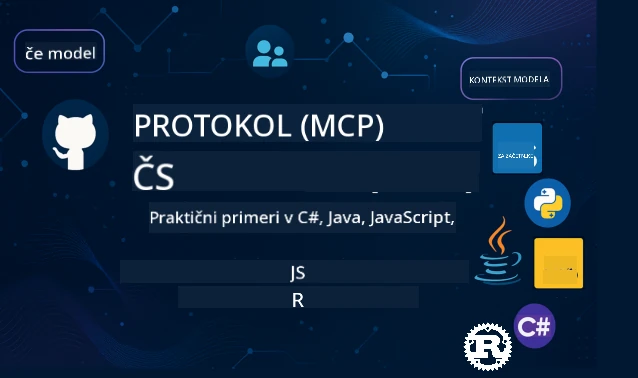

 

[](https://GitHub.com/microsoft/mcp-for-beginners/graphs/contributors)
[](https://GitHub.com/microsoft/mcp-for-beginners/issues)
[](https://GitHub.com/microsoft/mcp-for-beginners/pulls)
[](http://makeapullrequest.com)

[](https://GitHub.com/microsoft/mcp-for-beginners/watchers)
[](https://GitHub.com/microsoft/mcp-for-beginners/fork)
[](https://GitHub.com/microsoft/mcp-for-beginners/stargazers)


[](https://discord.gg/nTYy5BXMWG)

Sledite tem korakom, da začnete uporabljati te vire:
1. **Razvejajte repozitorij**: Kliknite [](https://GitHub.com/microsoft/mcp-for-beginners/fork)
2. **Klonirajte repozitorij**:   `git clone https://github.com/microsoft/mcp-for-beginners.git`
3. **Pridružite se** [](https://discord.gg/nTYy5BXMWG)


### 🌐 Podpora za več jezikov

#### Podprto preko GitHub Action (avtomatizirano in vedno posodobljeno)

<!-- CO-OP TRANSLATOR LANGUAGES TABLE START -->
[Arabic](../ar/README.md) | [Bengali](../bn/README.md) | [Bulgarian](../bg/README.md) | [Burmese (Myanmar)](../my/README.md) | [Chinese (Simplified)](../zh-CN/README.md) | [Chinese (Traditional, Hong Kong)](../zh-HK/README.md) | [Chinese (Traditional, Macau)](../zh-MO/README.md) | [Chinese (Traditional, Taiwan)](../zh-TW/README.md) | [Croatian](../hr/README.md) | [Czech](../cs/README.md) | [Danish](../da/README.md) | [Dutch](../nl/README.md) | [Estonian](../et/README.md) | [Finnish](../fi/README.md) | [French](../fr/README.md) | [German](../de/README.md) | [Greek](../el/README.md) | [Hebrew](../he/README.md) | [Hindi](../hi/README.md) | [Hungarian](../hu/README.md) | [Indonesian](../id/README.md) | [Italian](../it/README.md) | [Japanese](../ja/README.md) | [Kannada](../kn/README.md) | [Korean](../ko/README.md) | [Lithuanian](../lt/README.md) | [Malay](../ms/README.md) | [Malayalam](../ml/README.md) | [Marathi](../mr/README.md) | [Nepali](../ne/README.md) | [Nigerian Pidgin](../pcm/README.md) | [Norwegian](../no/README.md) | [Persian (Farsi)](../fa/README.md) | [Polish](../pl/README.md) | [Portuguese (Brazil)](../pt-BR/README.md) | [Portuguese (Portugal)](../pt-PT/README.md) | [Punjabi (Gurmukhi)](../pa/README.md) | [Romanian](../ro/README.md) | [Russian](../ru/README.md) | [Serbian (Cyrillic)](../sr/README.md) | [Slovak](../sk/README.md) | [Slovenian](./README.md) | [Spanish](../es/README.md) | [Swahili](../sw/README.md) | [Swedish](../sv/README.md) | [Tagalog (Filipino)](../tl/README.md) | [Tamil](../ta/README.md) | [Telugu](../te/README.md) | [Thai](../th/README.md) | [Turkish](../tr/README.md) | [Ukrainian](../uk/README.md) | [Urdu](../ur/README.md) | [Vietnamese](../vi/README.md)

> **Raje klonirate lokalno?**
>
> Ta repozitorij vključuje prevode v več kot 50 jezikov, kar močno poveča velikost prenosa. Če želite klonirati brez prevodov, uporabite sparse checkout:
>
> **Bash / macOS / Linux:**
> ```bash
> git clone --filter=blob:none --sparse https://github.com/microsoft/mcp-for-beginners.git
> cd mcp-for-beginners
> git sparse-checkout set --no-cone '/*' '!translations' '!translated_images'
> ```
>
> **CMD (Windows):**
> ```cmd
> git clone --filter=blob:none --sparse https://github.com/microsoft/mcp-for-beginners.git
> cd mcp-for-beginners
> git sparse-checkout set --no-cone "/*" "!translations" "!translated_images"
> ```
>
> Tako dobite vse, kar potrebujete za dokončanje tečaja, z veliko hitrejšim prenosom.
<!-- CO-OP TRANSLATOR LANGUAGES TABLE END -->

# 🚀 Kurikulum Model Context Protocol (MCP) za začetnike

## **Naučite se MCP z praktičnimi primeri kode v C#, Java, JavaScript, Rust, Python in TypeScript**

## 🧠 Pregled kurikuluma Model Context Protocol
Dobrodošli na poti v svet Model Context Protocol! Če ste se kdaj spraševali, kako AI aplikacije komunicirajo z različnimi orodji in storitvami, boste zdaj odkrili elegantno rešitev, ki spreminja način, kako razvijalci ustvarjajo inteligentne sisteme.

MCP si predstavljajte kot univerzalni prevajalnik za AI aplikacije – tako kot USB priključki omogočajo povezavo kateregakoli naprave na računalnik, MCP omogoča AI modelom povezovanje s katerimkoli orodjem ali storitvijo na standardiziran način. Ne glede na to, ali ustvarjate svojega prvega klepetalnega robota ali delate na kompleksnih AI delovnih tokovih, razumevanje MCP vam bo dalo moč za izdelavo bolj zmogljivih in prilagodljivih aplikacij.

Ta kurikulum je zasnovan z voljo in skrbjo za vaš učni proces. Začeli bomo s preprostimi koncepti, ki jih že poznate, in postopoma gradili vaše znanje skozi praktično delo v vašem najljubšem programskem jeziku. Vsak korak vključuje jasna pojasnila, praktične primere in veliko spodbude na poti.

Ko dokončate to potovanje, boste imeli samozavest za izdelavo lastnih MCP strežnikov, njihovo integracijo s priljubljenimi AI platformami ter razumevanje, kako ta tehnologija preoblikuje prihodnost razvoja AI. Začnimo to razburljivo pustolovščino skupaj!

### Uradna dokumentacija in specifikacije

Ta kurikulum je usklajen z **MCP Specifikacijo 2025-11-25** (najnovejšo stabilno izdajo). MCP specifikacija uporablja verzioniranje na podlagi datuma (v formatu LLLL-MM-DD), da zagotovi jasen pregled nad različicami protokola.

Ti viri postanejo še bolj dragoceni, ko boste poglabljali razumevanje, ampak nikar se ne obremenjujte, da morate brati vse takoj. Začnite tam, kjer vas zanima!
- 📘 [MCP Dokumentacija](https://modelcontextprotocol.io/) – Vaš glavni vir za korak-po-korak vadnice in uporabniške priročnike. Dokumentacija je napisana z mislimi na začetnike in vsebuje jasne primere, po katerih lahko sledite z lastnim tempom.
- 📜 [MCP Specifikacija](https://modelcontextprotocol.io/specification/2025-11-25) – To je vaše celovito referenčno gradivo. Ko boste napredovali skozi kurikulum, se boste pogosto vračali sem za iskanje podrobnih informacij in raziskovanje naprednih funkcij.
- 📜 [MCP Versioniranje specifikacije](https://modelcontextprotocol.io/specification/versioning) – Tukaj so informacije o zgodovini različic protokola in o tem, kako MCP uporablja verzioniranje na podlagi datuma (LLLL-MM-DD).
- 🧑‍💻 [MCP GitHub repozitorij](https://github.com/modelcontextprotocol) – Tukaj najdete SDK-je, orodja in primere kode v več programskih jezikih. Je kot zakladnica praktičnih primerov in komponent, pripravljenih za uporabo.
- 🌐 [Skupnost MCP](https://github.com/orgs/modelcontextprotocol/discussions) – Pridružite se drugim učenjakom in izkušenim razvijalcem v razpravah o MCP. To je podporna skupnost, kjer so vprašanja dobrodošla in se znanje svobodno deli.

## Cilji učenja

Na koncu tega kurikuluma se boste počutili samozavestno in navdušeno nad svojimi novimi sposobnostmi. Dosegli boste naslednje:

• **Razumevanje osnov MCP**: Spoznali boste, kaj je Model Context Protocol in zakaj spreminja način, kako AI aplikacije sodelujejo, z analogijami in primeri, ki so smiselni.

• **Izgradnja prvega MCP strežnika**: Ustvarili boste delujoč MCP strežnik v želenem programskem jeziku, začeli z enostavnimi primeri in postopoma razvijali svoje znanje.

• **Povezovanje AI modelov z realnimi orodji**: Naučili se boste, kako premostiti vrzel med AI modeli in dejanskimi storitvami, da vašim aplikacijam omogočite močne nove zmožnosti.

• **Implementacija varnostnih praks**: Razumeli boste, kako zaščititi svoje MCP implementacije in varovati tako aplikacije kot uporabnike.

• **Zagotovljena uvedba**: Spoznali boste, kako prenesti svoje MCP projekte iz razvoja v produkcijo, z uporabnimi strategijami za uvajanje, ki delujejo v praksi.

• **Pridružitev skupnosti MCP**: Postali boste del rastoče skupnosti razvijalcev, ki oblikujejo prihodnost razvoja AI aplikacij.

## Ključna predznanja

Preden se poglobimo v podrobnosti MCP, se prepričajmo, da razumete nekaj osnovnih konceptov. Ne skrbite, če na teh področjih niste strokovnjak – vse potrebno vam bomo razložili sproti!

### Razumevanje protokolov (osnova)

Protokol si predstavljajte kot pravila za pogovor. Ko pokličete prijatelja, oba veste, da je treba reči "živjo" na začetku, govoriti izmenično in na koncu reči "nasvidenje". Računalniški programi potrebujejo podobna pravila, da učinkovito komunicirajo.

MCP je protokol – niz dogovorjenih pravil, ki AI modelom in aplikacijam omogocha produktivne "pogovore" z orodji in storitvami. Tako kot pravila pogovora naredijo komunikacijo med ljudmi bolj gladko, MCP naredi komunikacijo AI aplikacij veliko bolj zanesljivo in učinkovito.

### Odnosi klient-strežnik (kako programi sodelujejo)

Tak odnos klient-strežnik uporabljate vsak dan! Ko uporabite spletni brskalnik (klient) za obisk spletne strani, se povežete s spletnim strežnikom, ki vam pošlje vsebino strani. Brskalnik ve, kako zahtevati informacije, strežnik pa ve, kako odgovoriti.

V MCP imamo podoben odnos: AI modeli so klienti, ki zahtevajo informacije ali dejanja, MCP strežniki pa nudijo te funkcije. To je kot imeti pomočnika (strežnika), ki ga AI lahko vpraša, da opravi določena opravila.

### Zakaj je standardizacija pomembna (združevanje delovanja)

Predstavljajte si, da bi vsak proizvajalec avtomobilov uporabljal plinske črpalke različnih oblik – potrebovali bi poseben adapter za vsak avto! Standardizacija pomeni, da se dogovorimo o skupnih načinih, da stvari brezhibno delujejo skupaj.

MCP zagotavlja to standardizacijo za AI aplikacije. Namesto da bi vsak AI model potreboval prilagojeno kodo za vsako orodje, MCP ustvari univerzalni način njihove komunikacije. To omogoča razvijalcem, da orodja zgradijo enkrat in jih uporabijo v številnih različnih AI sistemih.

## 🧭 Pregled vaše učne poti

Vaša pot z MCP je skrbno zastavljena, da postopoma gradi vašo samozavest in spretnosti. Vsaka faza uvede nove koncepte in hkrati utrjuje tisto, kar ste že osvojili.

### 🌱 Fazni temelj: Razumevanje osnov (moduli 0-2)

Tu se začne vaša pustolovščina! Predstavili vam bomo koncepta MCP z uporabo znanih analogij in preprostih primerov. Spoznali boste, kaj MCP je, zakaj obstaja in kako se umešča v širši svet razvoja AI.

• **Modul 0 - Uvod v MCP**: Začeli bomo z raziskovanjem, kaj MCP je in zakaj je pomemben za sodobne AI aplikacije. Videli boste resnične primere MCP v akciji in razumeli, kako rešuje pogosto zastavljene težave razvijalcev.

• **Modul 1 - Glavni koncepti**: Tukaj se boste naučili osnovnih gradnikov MCP. Uporabili bomo veliko analogij in vizualnih primerov, da bodo ti koncepti naravni in razumljivi.

• **Modul 2 - Varnost v MCP**: Varnost se morda sliši strašljivo, toda pokazali vam bomo, kako MCP vključuje vgrajene varnostne funkcije in vas naučili najboljših praks za zaščito aplikacij že od začetka.

### 🔨 Fazni razvoj: Ustvarjanje prvih implementacij (modul 3)

Zdaj se zares začne zabava! Dobite praktične izkušnje z gradnjo pravih MCP strežnikov in klientov. Ne skrbite – začeli bomo preprosto in vas bomo vodili skozi vsak korak.
Ta modul vključuje več praktičnih vodnikov, ki vam omogočajo vajo v vašem priljubljenem programskem jeziku. Ustvarili boste svoj prvi strežnik, zgradili odjemalca za povezavo z njim in celo integrirali priljubljena razvojna orodja, kot je VS Code.

Vsak vodnik vključuje popolne primere kode, nasvete za odpravljanje težav in razlage, zakaj sprejemamo določene oblikovne odločitve. Ob koncu te faze boste imeli delujoče implementacije MCP, na katere boste lahko ponosni!

### 🚀 Faza rasti: Napredni koncepti in uporaba v resničnem svetu (moduli 4-5)

Ko obvladate osnove, ste pripravljeni raziskati bolj izpopolnjene funkcije MCP. Pokrili bomo praktične strategije implementacije, tehnike odpravljanja napak in napredne teme, kot je integracija večmodalne umetne inteligence.

Naučili se boste tudi, kako razširiti svoje implementacije MCP za produkcijsko rabo in integrirati z oblačnimi platformami, kot je Azure. Ti moduli vas pripravijo na gradnjo MCP rešitev, ki zmorejo obvladovati zahteve iz resničnega sveta.

### 🌟 Faza obvladovanja: Skupnost in specializacija (moduli 6-11)

Zaključna faza se osredotoča na vključevanje v MCP skupnost in specializacijo na področjih, ki vas najbolj zanimajo. Naučili se boste, kako prispevati k odprtokodnim MCP projektom, izvajati napredne vzorce avtentikacije in graditi celovite rešitve z integracijo baz podatkov.

Modul 11 zasluži posebno omembo - gre za celovito 13-delno praktično učno pot, ki vas nauči graditi produkcijsko pripravljene MCP strežnike z integracijo PostgreSQL. To je kot zaključni projekt, ki združi vse, kar ste se naučili!

### 📚 Struktura celotnega učnega načrta

| Modul | Tema | Opis | Povezava |
|--------|-------|-------------|------|
| **Moduli 0-3: Osnove** | | | |
| 00 | Uvod v MCP | Pregled protokola Model Context in njegov pomen v AI potokih | [Preberi več](./00-Introduction/README.md) |
| 01 | Razlaga osnovnih pojmov | Poglobljen pregled osnovnih konceptov MCP | [Preberi več](./01-CoreConcepts/README.md) |
| 02 | Varnost v MCP | Varnostne grožnje in dobre prakse | [Preberi več](./02-Security/README.md) |
| 03 | Začetek z MCP | Nastavitev okolja, osnovni strežniki/odjemalci, integracija | [Preberi več](./03-GettingStarted/README.md) |
| **Modul 3: Gradnja prvega strežnika in odjemalca** | | | |
| 3.1 | Prvi strežnik | Ustvarite svoj prvi MCP strežnik | [Vodnik](./03-GettingStarted/01-first-server/README.md) |
| 3.2 | Prvi odjemalec | Razvijte osnovnega MCP odjemalca | [Vodnik](./03-GettingStarted/02-client/README.md) |
| 3.3 | Odjemalec z LLM | Integrirajte velike jezikovne modele | [Vodnik](./03-GettingStarted/03-llm-client/README.md) |
| 3.4 | Integracija VS Code | Uporaba MCP strežnikov v VS Code | [Vodnik](./03-GettingStarted/04-vscode/README.md) |
| 3.5 | stdio strežnik | Ustvarite strežnike z uporabo stdio transporta | [Vodnik](./03-GettingStarted/05-stdio-server/README.md) |
| 3.6 | HTTP pretakanje | Implementirajte HTTP pretakanje v MCP | [Vodnik](./03-GettingStarted/06-http-streaming/README.md) |
| 3.7 | AI orodjarna | Uporabite AI orodjarno z MCP | [Vodnik](./03-GettingStarted/07-aitk/README.md) |
| 3.8 | Testiranje | Testirajte svojo MCP implementacijo strežnika | [Vodnik](./03-GettingStarted/08-testing/README.md) |
| 3.9 | Namestitev | Namestite MCP strežnike v produkcijo | [Vodnik](./03-GettingStarted/09-deployment/README.md) |
| 3.10 | Napredna uporaba strežnika | Uporabite napredne strežnike za napredne funkcije in izboljšano arhitekturo | [Vodnik](./03-GettingStarted/10-advanced/README.md) |
| 3.11 | Enostavna avtentikacija | Poglavje, ki prikazuje avtentikacijo od začetka in RBAC | [Vodnik](./03-GettingStarted/11-simple-auth/README.md) |
| 3.12 | MCP gostitelji | Konfiguriranje Claude Desktop, Cursor, Cline in drugih MCP gostiteljev | [Vodnik](./03-GettingStarted/12-mcp-hosts/README.md) |
| 3.13 | MCP inšpektor | Odpravljanje napak in testiranje MCP strežnikov z orodjem Inspector | [Vodnik](./03-GettingStarted/13-mcp-inspector/README.md) |
| 3.14 | Vzorec | Uporabite vzorčenje za sodelovanje z odjemalcem | [Vodnik](./03-GettingStarted/14-sampling/README.md) |
| 3.15 | MCP aplikacije | Gradite MCP aplikacije | [Vodnik](./03-GettingStarted/15-mcp-apps/README.md) |
| **Moduli 4-5: Praktično & Napredno** | | | |
| 04 | Praktična implementacija | SDK-ji, odpravljanje napak, testiranje, ponovno uporabni predlogi | [Preberi več](./04-PracticalImplementation/README.md) |
| 4.1 | Straničenje | Upravljanje velikih rezultatov z obravnavo straničenja s kazalcem | [Vodnik](./04-PracticalImplementation/pagination/README.md) |
| 05 | Napredne teme v MCP | Večmodalna AI, skaliranje, uporaba v podjetjih | [Preberi več](./05-AdvancedTopics/README.md) |
| 5.1 | Integracija Azure | MCP integracija z Azure | [Vodnik](./05-AdvancedTopics/mcp-integration/README.md) |
| 5.2 | Večmodalnost | Delo z več modalnostmi | [Vodnik](./05-AdvancedTopics/mcp-multi-modality/README.md) |
| 5.3 | Demonstracija OAuth2 | Implementacija OAuth2 avtentikacije | [Vodnik](./05-AdvancedTopics/mcp-oauth2-demo/README.md) |
| 5.4 | Osnovni konteksti | Razumevanje in implementacija osnovnih kontekstov | [Vodnik](./05-AdvancedTopics/mcp-root-contexts/README.md) |
| 5.5 | Usmerjanje | MCP strategije usmerjanja | [Vodnik](./05-AdvancedTopics/mcp-routing/README.md) |
| 5.6 | Vzorčenje | Tehnike vzorčenja v MCP | [Vodnik](./05-AdvancedTopics/mcp-sampling/README.md) |
| 5.7 | Skaliranje | Razširite implementacije MCP | [Vodnik](./05-AdvancedTopics/mcp-scaling/README.md) |
| 5.8 | Varnost | Napredne varnostne razmisleke | [Vodnik](./05-AdvancedTopics/mcp-security/README.md) |
| 5.9 | Iskanje po spletu | Implementirajte možnosti spletnega iskanja | [Vodnik](./05-AdvancedTopics/web-search-mcp/README.md) |
| 5.10 | Pretakanje v realnem času | Gradite funkcionalnost pretakanja v realnem času | [Vodnik](./05-AdvancedTopics/mcp-realtimestreaming/README.md) |
| 5.11 | Iskanje v realnem času | Implementirajte iskanje v realnem času | [Vodnik](./05-AdvancedTopics/mcp-realtimesearch/README.md) |
| 5.12 | Entra ID avtentikacija | Avtentikacija z Microsoft Entra ID | [Vodnik](./05-AdvancedTopics/mcp-security-entra/README.md) |
| 5.13 | Integracija Foundry | Integracija z Azure AI Foundry | [Vodnik](./05-AdvancedTopics/mcp-foundry-agent-integration/README.md) |
| 5.14 | Inženiring konteksta | Tehnike za učinkovito inženirstvo konteksta | [Vodnik](./05-AdvancedTopics/mcp-contextengineering/README.md) |
| 5.15 | MCP prilagojen transport | Prilagojene implementacije transporta | [Vodnik](./05-AdvancedTopics/mcp-transport/README.md) |
| 5.16 | Lastnosti protokola | Obvestila o napredku, preklic, predloge virov | [Vodnik](./05-AdvancedTopics/mcp-protocol-features/README.md) |
| **Moduli 6-10: Skupnost in dobre prakse** | | | |
| 06 | Prispevki skupnosti | Kako prispevati v MCP ekosistem | [Vodnik](./06-CommunityContributions/README.md) |
| 07 | Izkušnje zgodnjih uporabnikov | Zgodbe o implementaciji iz resničnega sveta | [Vodnik](./07-LessonsfromEarlyAdoption/README.md) |
| 08 | Najboljše prakse za MCP | Zmogljivost, odpornost na napake, odpornost | [Vodnik](./08-BestPractices/README.md) |
| 09 | Študije primerov MCP | Primeri praktičnih implementacij | [Vodnik](./09-CaseStudy/README.md) |
| 10 | Prakti delavnica | Gradnja MCP strežnika z AI orodjarno | [Delavnica](./10-StreamliningAIWorkflowsBuildingAnMCPServerWithAIToolkit/README.md) |
| **Modul 11: MCP strežnik praksa** | | | |
| 11 | Integracija MCP strežnika z bazo podatkov | Celovit 13-laboratorijski praktični učni potek za integracijo PostgreSQL | [Laboratoriji](./11-MCPServerHandsOnLabs/README.md) |
| 11.1 | Uvod | Pregled MCP z integracijo baze podatkov in primer uporabo za maloprodajo | [Laboratorij 00](./11-MCPServerHandsOnLabs/00-Introduction/README.md) |
| 11.2 | Osnovna arhitektura | Razumevanje arhitekture MCP strežnika, plasti baze podatkov in vzorcev varnosti | [Laboratorij 01](./11-MCPServerHandsOnLabs/01-Architecture/README.md) |
| 11.3 | Varnost in večuporabniški dostop | Varnost na ravni vrstic, avtentikacija in dostop do podatkov za več najemnikov | [Laboratorij 02](./11-MCPServerHandsOnLabs/02-Security/README.md) |
| 11.4 | Nastavitev okolja | Nastavitev razvojnega okolja, Docker, Azure viri | [Laboratorij 03](./11-MCPServerHandsOnLabs/03-Setup/README.md) |
| 11.5 | Oblikovanje baze podatkov | Nastavitev PostgreSQL, zasnova sheme za maloprodajo in vzorčni podatki | [Laboratorij 04](./11-MCPServerHandsOnLabs/04-Database/README.md) |
| 11.6 | Implementacija MCP strežnika | Gradnja strežnika FastMCP z integracijo baze podatkov | [Laboratorij 05](./11-MCPServerHandsOnLabs/05-MCP-Server/README.md) |
| 11.7 | Razvoj orodij | Ustvarjanje orodij za poizvedbe v bazi in introspektijo sheme | [Laboratorij 06](./11-MCPServerHandsOnLabs/06-Tools/README.md) |
| 11.8 | Semantično iskanje | Implementacija vektorskih predstavitev z Azure OpenAI in pgvector | [Laboratorij 07](./11-MCPServerHandsOnLabs/07-Semantic-Search/README.md) |
| 11.9 | Testiranje in odpravljanje napak | Strategije testiranja, orodja za odpravljanje napak in pristopi k validaciji | [Laboratorij 08](./11-MCPServerHandsOnLabs/08-Testing/README.md) |
| 11.10 | Integracija VS Code | Konfiguracija integracije MCP v VS Code in uporaba AI Chat | [Laboratorij 09](./11-MCPServerHandsOnLabs/09-VS-Code/README.md) |
| 11.11 | Strategije namestitve | Namestitev z Dockerjem, Azure Container Apps in premisleki o skaliranju | [Laboratorij 10](./11-MCPServerHandsOnLabs/10-Deployment/README.md) |
| 11.12 | Nadzor | Application Insights, beleženje, spremljanje zmogljivosti | [Laboratorij 11](./11-MCPServerHandsOnLabs/11-Monitoring/README.md) |
| 11.13 | Najboljše prakse | Optimizacija zmogljivosti, utrjevanje varnosti in nasveti za produkcijo | [Laboratorij 12](./11-MCPServerHandsOnLabs/12-Best-Practices/README.md) |

### 💻 Projekti s primeri kode

Ena najbolj vznemirljivih delov učenja MCP je, da vidite svoje veščine programiranja postopno napredovati. Naše primere kode smo zasnovali tako, da se začnejo preprosto in postanejo bolj sofisticirani, ko se vaše razumevanje poglobi. Tukaj je opis, kako predstavljamo koncepte – s kodo, ki je enostavna za razumevanje, a kaže resnične MCP principe, boste razumeli ne samo kaj ta koda naredi, temveč tudi zakaj je tako strukturirana in kako se vklopi v večje MCP aplikacije.

#### Osnovni primeri MCP kalkulatorja

| Jezik | Opis | Povezava |
|----------|-------------|------|
| C# | Primer MCP strežnika | [Ogled kode](./03-GettingStarted/samples/csharp/README.md) |
| Java | MCP kalkulator | [Ogled kode](./03-GettingStarted/samples/java/calculator/README.md) |
| JavaScript | MCP demo | [Ogled kode](./03-GettingStarted/samples/javascript/README.md) |
| Python | MCP strežnik | [Ogled kode](../../03-GettingStarted/samples/python/mcp_calculator_server.py) |
| TypeScript | MCP primer | [Ogled kode](./03-GettingStarted/samples/typescript/README.md) |
| Rust | MCP primer | [Ogled kode](./03-GettingStarted/samples/rust/README.md) |

#### Napredne implementacije MCP

| Jezik | Opis | Povezava |
|----------|-------------|------|
| C# | Napredni primer | [Ogled kode](./04-PracticalImplementation/samples/csharp/README.md) |
| Java s Spring | Primer container app | [Ogled kode](./04-PracticalImplementation/samples/java/containerapp/README.md) |
| JavaScript | Napredni primer | [Ogled kode](./04-PracticalImplementation/samples/javascript/README.md) |
| Python | Kompleksna implementacija | [Ogled kode](./04-PracticalImplementation/samples/python/README.md) |
| TypeScript | Primer container | [Ogled kode](./04-PracticalImplementation/samples/typescript/README.md) |


## 🎯 Predpogoji za učenje MCP

Da boste kar največ izkoristili ta učni načrt, bi morali imeti:
- Osnovno znanje programiranja v vsaj enem izmed naslednjih jezikov: C#, Java, JavaScript, Python ali TypeScript
- Razumevanje modela klient-strežnik in API-jev
- Poznavanje konceptov REST in HTTP
- (Neobvezno) Ozadje v pojmih umetne inteligence/machine learninga (AI/ML)

- Udeležba v skupnostnih razpravah za podporo

## 📚 Vodnik za učenje in viri

Ta repozitorij vsebuje več virov, ki vam bodo pomagali pri učinkovitemu učenju in orientaciji:

### Vodnik za učenje

Na voljo je obsežen [vodnik za učenje](./study_guide.md), ki vam pomaga učinkovito krmariti po tem repozitoriju. Ta vizualna karta kurikuluma prikazuje, kako so vse teme povezane in nudi navodila, kako učinkovito uporabljati vzorčne projekte. Posebej je uporaben za vizualne učence, ki radi vidijo celotno sliko.

Vodnik vključuje:
- Vizualno karto kurikuluma, ki prikazuje vse obravnavane teme
- Podroben razčlenitev vsakega dela repozitorija
- Navodila za uporabo vzorčnih projektov
- Priporočene učne poti za različne ravni znanja
- Dodatne vire za dopolnitev vaše učne poti

### Zapis sprememb

Vzdržujemo podroben [zapis sprememb](./changelog.md), ki sledi vsem pomembnim posodobitvam kurikuluma, da boste na tekočem z najnovejšimi izboljšavami in dodatki.
- Dodajanje nove vsebine
- Strukturne spremembe
- Izboljšave funkcij
- Posodobitve dokumentacije

## 🛠️ Kako učinkovito uporabljati ta kurikulum

Vsaka lekcija v tem vodniku vključuje:

1. Jasna pojasnila konceptov MCP  
2. Interaktivne primere kode v več jezikih  
3. Vaje za ustvarjanje pravih MCP aplikacij  
4. Dodatne vire za naprednejše učence

### Naučimo se MCP z jezikom C# - Serija vodičev
Spoznajmo Model Context Protocol (MCP), najsodobnejši okvir, zasnovan za standardizacijo interakcij med AI modeli in klientsko programsko opremo. V tej začetniški seji vas bomo uvedli v MCP in vas vodili pri ustvarjanju prvega MCP strežnika.
#### C#: [https://aka.ms/letslearnmcp-csharp](https://aka.ms/letslearnmcp-csharp)
#### Java: [https://aka.ms/letslearnmcp-java](https://aka.ms/letslearnmcp-java)
#### JavaScript: [https://aka.ms/letslearnmcp-javascript](https://aka.ms/letslearnmcp-javascript)
#### Python: [https://aka.ms/letslearnmcp-python](https://aka.ms/letslearnmcp-python)

## 🎓 Vaša pot MCP se začne

Čestitamo! Ravno ste naredili prvi korak na razburljivi poti, ki bo razširila vaše programerske zmožnosti in vas povezala z najsodobnejšim razvojem AI.

### Kaj ste že dosegli

Z branjem tega uvoda ste že začeli graditi svoje znanje MCP. Razumete, kaj je MCP, zakaj je pomemben in kako ta kurikulum podpira vašo učno pot. To je pomemben dosežek in začetek vaše strokovnosti na tem pomembnem področju.

### Pustolovščina pred vami

Ko boste napredovali skozi module, ne pozabite, da je bil vsak strokovnjak nekoč začetnik. Koncepti, ki se zdaj zdijo zapleteni, bodo postali samoumevni, ko jih boste vadili in uporabljali. Vsak majhen korak gradi močne zmožnosti, ki vam bodo služile skozi celotno razvijalsko kariero.

### Vaša podporna mreža

Pridružujete se skupnosti učencev in strokovnjakov, ki so navdušeni nad MCP in želijo pomagati drugim uspeti. Ne glede na to, ali ste se zataknili pri izzivu s kodo ali ste navdušeni nad novim prebojem, je skupnost tukaj, da podpira vašo pot.

Če imate težave ali vprašanja glede izdelave AI aplikacij, se pridružite drugim učencem in izkušenim razvijalcem v razpravah o MCP. Skupnost je podporna in odprta, vprašanja so dobrodošla, znanje se prosto deli.

[](https://discord.gg/nTYy5BXMWG)

Če imate povratne informacije o izdelku ali napake med razvojem obiščite:

[](https://aka.ms/foundry/forum)

### Ste pripravljeni začeti?

Vaša MCP pustolovščina se začne zdaj! Začnite z Modulom 0, da se potopite v svoje prve praktične izkušnje z MCP, ali pa raziščite vzorčne projekte in si oglejte, kaj boste ustvarili. Ne pozabite – vsak strokovnjak je začel točno tam, kjer ste zdaj, in s potrpljenjem ter vadbo boste presenečeni nad svojimi dosežki.

Dobrodošli v svet razvoja Model Context Protocol. Skupaj ustvarimo nekaj izjemnega!

## 🤝 Prispevanje v skupnost za učenje

Ta kurikulum postaja močnejši z vložki učencev, kot ste vi! Ne glede na to, ali popravljate tipkarsko napako, predlagate jasnejšo razlago ali dodajate nov primer, vaše prispevke pomagajo drugim začetnikom uspeti.

Hvala Microsoftovemu cenjenemu strokovnjaku [Shivam Goyal](https://www.linkedin.com/in/shivam2003/) za prispevek vzorčnih kod.

Proces prispevanja je zasnovan tako, da je prijazen in podporen. Večina prispevkov zahteva Contributor License Agreement (CLA), vendar vas bodo samodejna orodja gladko vodila skozi postopek.

## 📜 Odprto učno gradivo

Celoten ta kurikulum je na voljo pod licenco MIT [LICENSE](../../LICENSE), kar pomeni, da ga lahko prosto uporabljate, spreminjate in delite. To podpira našo misijo, da je znanje MCP dostopno razvijalcem po vsem svetu.

## 🤝 Smernice za prispevke

Ta projekt sprejema prispevke in predloge. Večina prispevkov zahteva, da se strinjate z Contributor License Agreement (CLA), ki potrjuje, da imate pravico in dejansko podeljujete pravice za uporabo vašega prispevka. Za podrobnosti obiščite <https://cla.opensource.microsoft.com>.

Ko oddate pull request, bo CLA bot samodejno ugotovil, ali morate predložiti CLA, in ustrezno označil PR (npr. statusna kontrola, komentar). Preprosto sledite navodilom bota. To boste morali narediti le enkrat za vse repozitorije z našo CLA.

Ta projekt je sprejel [Microsoft Open Source Code of Conduct](https://opensource.microsoft.com/codeofconduct/). Za več informacij glejte [Pogosta vprašanja o kodeksu ravnanja](https://opensource.microsoft.com/codeofconduct/faq/) ali pišite na [opencode@microsoft.com](mailto:opencode@microsoft.com) za dodatna vprašanja ali komentarje.

---

*Ste pripravljeni začeti svojo MCP pot? Začnite z [Modul 00 - Uvod v MCP](./00-Introduction/README.md) in naredite prve korake v svet razvoja Model Context Protocol!*

## 🎒 Drugi tečaji
Naša ekipa ustvarja tudi druge tečaje! Oglejte si:

<!-- CO-OP TRANSLATOR OTHER COURSES START -->
### LangChain
[](https://aka.ms/langchain4j-for-beginners)
[](https://aka.ms/langchainjs-for-beginners?WT.mc_id=m365-94501-dwahlin)
[](https://github.com/microsoft/langchain-for-beginners?WT.mc_id=m365-94501-dwahlin)
---

### Azure / Edge / MCP / Agent
[](https://github.com/microsoft/AZD-for-beginners?WT.mc_id=academic-105485-koreyst)
[](https://github.com/microsoft/edgeai-for-beginners?WT.mc_id=academic-105485-koreyst)
[](https://github.com/microsoft/mcp-for-beginners?WT.mc_id=academic-105485-koreyst)
[](https://github.com/microsoft/ai-agents-for-beginners?WT.mc_id=academic-105485-koreyst)

---

### Serija Generativne AI
[](https://github.com/microsoft/generative-ai-for-beginners?WT.mc_id=academic-105485-koreyst)
[-9333EA?style=for-the-badge&labelColor=E5E7EB&color=9333EA)](https://github.com/microsoft/Generative-AI-for-beginners-dotnet?WT.mc_id=academic-105485-koreyst)
[-C084FC?style=for-the-badge&labelColor=E5E7EB&color=C084FC)](https://github.com/microsoft/generative-ai-for-beginners-java?WT.mc_id=academic-105485-koreyst)
[-E879F9?style=for-the-badge&labelColor=E5E7EB&color=E879F9)](https://github.com/microsoft/generative-ai-with-javascript?WT.mc_id=academic-105485-koreyst)

---

### Osnove učenja
[](https://aka.ms/ml-beginners?WT.mc_id=academic-105485-koreyst)
[](https://aka.ms/datascience-beginners?WT.mc_id=academic-105485-koreyst)
[](https://aka.ms/ai-beginners?WT.mc_id=academic-105485-koreyst)
[](https://github.com/microsoft/Security-101?WT.mc_id=academic-96948-sayoung)
[](https://aka.ms/webdev-beginners?WT.mc_id=academic-105485-koreyst)
[](https://aka.ms/iot-beginners?WT.mc_id=academic-105485-koreyst)
[](https://github.com/microsoft/xr-development-for-beginners?WT.mc_id=academic-105485-koreyst)

---

### Serija Copilot
[](https://aka.ms/GitHubCopilotAI?WT.mc_id=academic-105485-koreyst)
[](https://github.com/microsoft/mastering-github-copilot-for-dotnet-csharp-developers?WT.mc_id=academic-105485-koreyst)
[](https://github.com/microsoft/CopilotAdventures?WT.mc_id=academic-105485-koreyst)
<!-- CO-OP TRANSLATOR OTHER COURSES END -->

---

<!-- CO-OP TRANSLATOR DISCLAIMER START -->
**Omejitev odgovornosti**:
Ta dokument je bil preveden z uporabo storitve za prevajanje z umetno inteligenco [Co-op Translator](https://github.com/Azure/co-op-translator). Čeprav si prizadevamo za natančnost, vas opozarjamo, da lahko samodejni prevodi vsebujejo napake ali netočnosti. Izvirni dokument v maternem jeziku velja za zavezujoč vir. Za kritične informacije priporočamo strokovni prevod s strani človeka. Nismo odgovorni za kakršne koli nesporazume ali napačne interpretacije, ki izhajajo iz uporabe tega prevoda.
<!-- CO-OP TRANSLATOR DISCLAIMER END -->