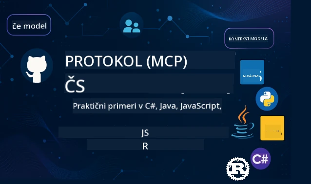

 

[](https://GitHub.com/microsoft/mcp-for-beginners/graphs/contributors)
[](https://GitHub.com/microsoft/mcp-for-beginners/issues)
[](https://GitHub.com/microsoft/mcp-for-beginners/pulls)
[](http://makeapullrequest.com)
[](https://mcptoplist.com/server/mcp.so%2Fmcp-for-beginners%2Fmicrosoft)

[](https://GitHub.com/microsoft/mcp-for-beginners/watchers)
[](https://GitHub.com/microsoft/mcp-for-beginners/fork)
[](https://GitHub.com/microsoft/mcp-for-beginners/stargazers)


[](https://discord.gg/nTYy5BXMWG)

Sledite tem korakom za začetek uporabe teh virov:
1. **Razvezi repozitorij**: Kliknite [](https://GitHub.com/microsoft/mcp-for-beginners/fork)
2. **Kloniraj repozitorij**:   `git clone https://github.com/microsoft/mcp-for-beginners.git`
3. **Pridruži se** [](https://discord.gg/nTYy5BXMWG)


### 🌐 Podpora za več jezikov

#### Podprto preko GitHub Action (Avtomatizirano in vedno posodobljeno)

<!-- CO-OP TRANSLATOR LANGUAGES TABLE START -->
[Arabščina](../ar/README.md) | [Bengalski](../bn/README.md) | [Bolgarščina](../bg/README.md) | [Burmanščina (Mjanmar)](../my/README.md) | [Kitajščina (poenostavljena)](../zh-CN/README.md) | [Kitajščina (tradicionalna, Hong Kong)](../zh-HK/README.md) | [Kitajščina (tradicionalna, Macau)](../zh-MO/README.md) | [Kitajščina (tradicionalna, Tajvan)](../zh-TW/README.md) | [Hrvaščina](../hr/README.md) | [Češčina](../cs/README.md) | [Danščina](../da/README.md) | [Nizozemščina](../nl/README.md) | [Estonščina](../et/README.md) | [Finščina](../fi/README.md) | [Francoščina](../fr/README.md) | [Nemščina](../de/README.md) | [Grščina](../el/README.md) | [Hebrejščina](../he/README.md) | [Hindijščina](../hi/README.md) | [Madžarščina](../hu/README.md) | [Indonezijščina](../id/README.md) | [Italijanščina](../it/README.md) | [Japonščina](../ja/README.md) | [Kannada](../kn/README.md) | [Khmerski](../km/README.md) | [Korejščina](../ko/README.md) | [Litovščina](../lt/README.md) | [Malajščina](../ms/README.md) | [Malajalščina](../ml/README.md) | [Maratščina](../mr/README.md) | [Nepalščina](../ne/README.md) | [Nigerijski pidžin](../pcm/README.md) | [Norveščina](../no/README.md) | [Perzijščina (Farsi)](../fa/README.md) | [Poljščina](../pl/README.md) | [Portugalski (Brazilija)](../pt-BR/README.md) | [Portugalski (Portugalska)](../pt-PT/README.md) | [Punjabi (Gurmukhi)](../pa/README.md) | [Romunščina](../ro/README.md) | [Ruščina](../ru/README.md) | [Srbščina (cirilica)](../sr/README.md) | [Slovaščina](../sk/README.md) | [Slovenščina](./README.md) | [Španščina](../es/README.md) | [Svahili](../sw/README.md) | [Švedščina](../sv/README.md) | [Tagalog (Filipinski)](../tl/README.md) | [Tamilščina](../ta/README.md) | [Telugu](../te/README.md) | [Tajščina](../th/README.md) | [Turščina](../tr/README.md) | [Ukrajinščina](../uk/README.md) | [Urdu](../ur/README.md) | [Vietnamščina](../vi/README.md)

> **Raje klonirate lokalno?**
>
> Ta repozitorij vključuje več kot 50 prevodov jezikov, kar znatno poveča velikost prenosa. Če želite klonirati brez prevodov, uporabite sparse checkout:
>
> **Bash / macOS / Linux:**
> ```bash
> git clone --filter=blob:none --sparse https://github.com/microsoft/mcp-for-beginners.git
> cd mcp-for-beginners
> git sparse-checkout set --no-cone '/*' '!translations' '!translated_images'
> ```
>
> **CMD (Windows):**
> ```cmd
> git clone --filter=blob:none --sparse https://github.com/microsoft/mcp-for-beginners.git
> cd mcp-for-beginners
> git sparse-checkout set --no-cone "/*" "!translations" "!translated_images"
> ```
>
> Tako dobite vse, kar potrebujete za dokončanje tečaja, s precej hitrejšim prenosom.
<!-- CO-OP TRANSLATOR LANGUAGES TABLE END -->

# 🚀 Kurikulum Model Context Protocol (MCP) za začetnike

## **Naučite se MCP z praktičnimi primeri kode v C#, Java, JavaScript, Rust, Python in TypeScript**

## 🧠 Pregled kurikuluma Model Context Protocol
Dobrodošli na vaši poti v Model Context Protocol! Če ste se kdaj spraševali, kako AI aplikacije komunicirajo z različnimi orodji in storitvami, boste zdaj odkrili elegantno rešitev, ki spreminja način, kako razvijalci ustvarjajo inteligentne sisteme.

Pomislite na MCP kot na univerzalni prevajalnik za AI aplikacije – tako kot USB priključki omogočajo povezavo kateregakoli naprave z vašim računalnikom, MCP omogoča AI modelom povezavo z vsakim orodjem ali storitvijo na standardiziran način. Ne glede na to, ali ustvarjate svoj prvi klepetalni robot ali delate na kompleksnih AI potekih dela, bo razumevanje MCP-ja dalo moč ustvarjati bolj zmogljive in prilagodljive aplikacije.

Ta kurikulum je zasnovan z potrpežljivostjo in skrbjo za vašo učno pot. Začeli bomo z enostavnimi koncepti, ki jih že razumete, in postopoma gradili vaše strokovno znanje z uporabo praktičnih vaj v vašem priljubljenem programskem jeziku. Vsak korak vključuje jasna pojasnila, praktične primere in veliko spodbude na poti.

Ko boste končali to potovanje, boste samozavestno zgradili svoje lastne MCP strežnike, jih integrirali s priljubljenimi AI platformami in razumeli, kako ta tehnologija preoblikuje prihodnost razvoja AI. Začnimo to razburljivo pustolovščino skupaj!

### Uradna dokumentacija in specifikacije

Trenutna revizija protokola je **MCP Specifikacija 2026-07-28**. Specifikacija MCP
uporablja verzioniranje na osnovi datuma (obliko LLLL-MM-DD), da naredi združljivost protokola
eksplicitno.

> **Opomba o verziji:** ta kurikulum uči aktualne `2026-07-28`
> koncepte, vključno z brezstanjskimi (stateless) zahtevki, ogrodjem Extensions in
> opuščanjem Roots, Sampling in Logging. Nekateri praktični primeri ostajajo
> eksplicitno verzionirani na `2025-11-25`, dokler SDK ne dohiti. Oglejte si
> [Kaj se je spremenilo v MCP: Specifikacija 2026-07-28](./01-CoreConcepts/mcp-2026-07-28.md)
> za spremembe in smernice za migracijo.

Ti viri postajajo bolj dragoceni, ko vaše razumevanje raste, vendar se ne počutite pod pritiskom, da morate vse takoj prebrati. Začnite s področji, ki vas najbolj zanimajo!
- 📘 [MCP Dokumentacija](https://modelcontextprotocol.io/) – To je vaš glavni vir za korak-po-korak vodiče in uporabniške priročnike. Dokumentacija je napisana z mislijo na začetnike, ponuja jasne primere, s katerimi lahko sledite v svojem tempu.
- 📜 [MCP Specifikacija](https://modelcontextprotocol.io/specification/2026-07-28) – To dojemite kot vaš obsežen referenčni priročnik. Med delom skozi kurikulum se boste vračali sem, da poiščete specifične podrobnosti in raziščete napredne funkcije.
- 📜 [MCP Verzicioniranje Specifikacije](https://modelcontextprotocol.io/specification/versioning) – Vsebuje informacije o zgodovini verzij protokola in kako MCP uporablja verzioniranje na osnovi datuma (LLLL-MM-DD).
- 🧑‍💻 [MCP GitHub Repozitorij](https://github.com/modelcontextprotocol) – Tukaj najdete SDK-je, orodja in vzorce kode v več programskih jezikih. Je kot zakladnica praktičnih primerov in pripravljenih komponent za uporabo.
- 🌐 [MCP Skupnost](https://github.com/orgs/modelcontextprotocol/discussions) – Pridružite se drugim učencem in izkušenim razvijalcem v razpravah o MCP-ju. To je podpirajoča skupnost, kjer so vprašanja dobrodošla in znanje se prosto deli.
  
## Cilji učenja

Do konca tega kurikuluma se boste počutili samozavestno in navdušeno nad svojimi novimi sposobnostmi. Tukaj je, kar boste dosegli:

• **Razumeti osnove MCP**: Spoznali boste, kaj je Model Context Protocol in zakaj spreminja način, kako AI aplikacije sodelujejo, z analogijami in primeri, ki so razumljivi.

• **Zgraditi svoj prvi MCP strežnik**: Ustvarili boste delujoč MCP strežnik v svojem izbranem programskem jeziku, začeli s preprostimi primeri in postopoma gradili svoje sposobnosti.

• **Povezati AI modele z realnimi orodji**: Naučili se boste, kako premostiti vrzel med AI modeli in dejanskimi storitvami, drugim vašim aplikacijam dajo močne nove zmožnosti.

• **Izvajati varnostne najboljše prakse**: Razumeli boste, kako ohraniti varnost MCP implementacij, zaščititi tako vaše aplikacije kot uporabnike.

• **Zagotovo uvajati v produkcijo**: Naučili se boste, kako svoje MCP projekte od razvoja peljati do proizvodnje z uporabnimi strategijami uvajanja, ki delujejo v resničnem svetu.

• **Pridružiti se MCP skupnosti**: Postali boste del rastoče skupnosti razvijalcev, ki oblikujejo prihodnost razvoja AI aplikacij.

## Ključna izhodišča

Preden se poglobimo v podrobnosti MCP, poskrbimo, da ste udobni z nekaterimi osnovnimi koncepti. Ne skrbite, če niste strokovnjak na teh področjih — vse, kar morate vedeti, vam bomo razložili sproti!

### Razumevanje protokolov (Temelj)

Pomislite na protokol kot na pravila za pogovor. Ko pokličete prijatelja, oba veste, da ob odgovoru rečete "živjo", govorite izmenično in rečete "nasvidenje", ko končate. Računalniški programi potrebujejo podobna pravila, da učinkovito komunicirajo.

MCP je protokol – niz dogovorjenih pravil, ki AI modelom in aplikacijam pomagajo imeti produktivne "pogovore" z orodji in storitvami. Tako kot pravila za pogovor olajšajo človeško komunikacijo, MCP naredi komunikacijo AI aplikacij veliko bolj zanesljivo in zmogljivo.

### Odnosi med odjemalcem in strežnikom (Kako programi sodelujejo)

Odnosi odjemalec-strežnik uporabljate vsak dan! Ko uporabljate spletni brskalnik (odjemalec) za obisk spletne strani, se povezujete s spletnih strežnikom, ki vam pošlje vsebino strani. Brskalnik ve, kako zahtevati informacije, strežnik pa, kako odgovoriti.

V MCP imamo podoben odnos: AI modeli delujejo kot odjemalci, ki zahtevajo informacije ali dejavnosti, medtem ko MCP strežniki zagotavljajo te zmožnosti. To je kot imeti koristnega pomočnika (strežnik), za katerega se AI lahko obrne z zahtevo za določena opravila.

### Zakaj je standardizacija pomembna (Kako stvari delujejo skupaj)

Predstavljajte si, če bi vsak proizvajalec avtomobilov uporabljal drugačne oblike bencinskih črpalk — potrebovali bi poseben adapter za vsak avto! Standardizacija pomeni dogovor o skupnih pristopih, da stvari delujejo brezhibno skupaj.

MCP nudi to standardizacijo za AI aplikacije. Namesto da bi vsak AI model potreboval lasten kodo za vsako orodje, MCP ustvari univerzalen način za njihovo komunikacijo. To pomeni, da lahko razvijalci orodja zgradijo enkrat in jih uporabljajo z mnogimi različnimi AI sistemi.

## 🧭 Pregled vaše učne poti

Vaša pot MCP je skrbno strukturirana, da postopoma gradi vašo samozavest in veščine. Vsaka faza uvaja nove koncepte, hkrati pa utrjuje že pridobljeno znanje.

### 🌱 Osnovna faza: Razumevanje osnov (Moduli 0-2)

Tukaj se začne vaša pustolovščina! Predstavili vam bomo koncepte MCP z uporabo znanih analogij in preprostih primerov. Spoznali boste, kaj je MCP, zakaj obstaja in kako se prilega širšemu svetu razvoja AI.


• **Modul 0 - Uvod v MCP**: Začeli bomo z raziskovanjem, kaj je MCP in zakaj je tako pomemben za sodobne AI aplikacije. Videli boste primere MCP v praksi in razumeli, kako rešuje pogoste težave, s katerimi se srečujejo razvijalci.

• **Modul 1 - Razlaga osnovnih pojmov**: Tukaj se boste naučili ključnih gradnikov MCP. Uporabili bomo veliko analogij in vizualnih primerov, da bodo ti pojmi naravni in razumljivi.

• **Modul 2 - Varnost v MCP**: Varnost se morda sliši zastrašujoče, a pokazali vam bomo, kako MCP vključuje vgrajene varnostne funkcije in vas naučili najboljših praks za zaščito vaših aplikacij že od začetka.

### 🔨 Faza gradnje: Ustvarjanje vaših prvih implementacij (Modul 3)

Zdaj pa se začne prava zabava! Dobite praktične izkušnje z gradnjo dejanskih MCP strežnikov in odjemalcev. Ne skrbite – začeli bomo preprosto in vas vodili skozi vsak korak.

Ta modul vključuje več praktičnih vodnikov, ki vam omogočajo vadbo v vašem priljubljenem programskem jeziku. Ustvarili boste svoj prvi strežnik, razvili odjemalca za povezavo z njim in celo integrirali priljubljena razvojna orodja, kot je VS Code.

Vsak vodič vključuje celovite primere kode, nasvete za odpravljanje težav in razlage, zakaj sprejemamo določene oblikovalske odločitve. Na koncu te faze boste imeli delujoče implementacije MCP, na katere boste ponosni!

### 🚀 Faza rasti: Napredni pojmi in uporaba v resničnem svetu (Moduli 4-5)

Ko osnove obvladate, ste pripravljeni raziskati bolj zahtevne funkcije MCP. Pokrili bomo praktične implementacijske strategije, tehnike odpravljanja napak in napredne teme, kot je integracija večmodalnih AI sistemov.

Naučili se boste tudi, kako razširiti vaše MCP implementacije za proizvodno uporabo in integrirati z oblačnimi platformami, kot je Azure. Ti moduli vas pripravijo na gradnjo MCP rešitev, ki zmorejo upravljati zahteve resničnega sveta.

### 🌟 Faza mojstrstva: Skupnost in specializacija (Moduli 6-11)

Zadnja faza se osredotoča na vključitev v MCP skupnost in specializacijo na področjih, ki vas najbolj zanimajo. Naučili se boste, kako prispevati k odprtokodnim MCP projektom, implementirati napredne vzorce avtentikacije in graditi celovite rešitve z integracijo baz podatkov.

Modul 11 zasluži posebno omembo - je celotna učna pot s 13 laboratoriji, ki vas nauči graditi proizvodne MCP strežnike z integracijo PostgreSQL. Je kot zaključni projekt, ki povezuje vse, kar ste se naučili!

### 📚 Celotna struktura učnega načrta

| Modul | Tema | Opis | Povezava |
|--------|-------|-------------|------|
| **Moduli 0-3: Osnove** | | | |
| 00 | Uvod v MCP | Pregled Model Context Protocol in njegov pomen v AI potokih | [Preberi več](./00-Introduction/README.md) |
| 01 | Razlaga osnovnih pojmov | Poglobljen razisk osnovnih konceptov MCP | [Preberi več](./01-CoreConcepts/README.md) |
| 1.1 | Kaj se je spremenilo v MCP (2026-07-28) | Brezstaten protokol, razširitveni okvir in ukinjanje funkcij v trenutni specifikaciji | [Vodič](./01-CoreConcepts/mcp-2026-07-28.md) |
| 02 | Varnost v MCP | Varnostne grožnje in najboljše prakse | [Preberi več](./02-Security/README.md) |
| 2.1 | CIMD in DCR avtentikacija | Primerjava prednostne registracije CIMD z ukinjenim DCR z uporabo zaščitenega MCP strežnika | [Vzorec](./02-Security/samples/cimd-dcr-auth/README.md) |
| 03 | Začetek z MCP | Nastavitev okolja, osnovni strežniki/odjemalci, integracija | [Preberi več](./03-GettingStarted/README.md) |
| **Modul 3: Gradnja vašega prvega strežnika in odjemalca** | | | |
| 3.1 | Prvi strežnik | Ustvarite svoj prvi MCP strežnik | [Vodič](./03-GettingStarted/01-first-server/README.md) |
| 3.2 | Prvi odjemalec | Razvijte osnovnega MCP odjemalca | [Vodič](./03-GettingStarted/02-client/README.md) |
| 3.3 | Odjemalec z LLM | Integrirajte velike jezikovne modele | [Vodič](./03-GettingStarted/03-llm-client/README.md) |
| 3.4 | Integracija VS Code | Uporabite MCP strežnike v VS Code | [Vodič](./03-GettingStarted/04-vscode/README.md) |
| 3.5 | stdio strežnik | Ustvarite strežnike z uporabo stdio transporta | [Vodič](./03-GettingStarted/05-stdio-server/README.md) |
| 3.6 | HTTP pretakanje | Implementirajte HTTP pretakanje v MCP | [Vodič](./03-GettingStarted/06-http-streaming/README.md) |
| 3.7 | Microsoft Foundry Toolkit | Uporabite Microsoft Foundry Toolkit z MCP | [Vodič](./03-GettingStarted/07-aitk/README.md) |
| 3.8 | Testiranje | Testirajte svojo implementacijo MCP strežnika | [Vodič](./03-GettingStarted/08-testing/README.md) |
| 3.9 | Namestitev | Namestite MCP strežnike v produkcijsko okolje | [Vodič](./03-GettingStarted/09-deployment/README.md) |
| 3.10 | Napredna uporaba strežnika | Uporabite napredne strežnike za napredno uporabo funkcij in izboljšano arhitekturo | [Vodič](./03-GettingStarted/10-advanced/README.md) |
| 3.11 | Enostavna avtentikacija | Poglavje, ki prikazuje avtentikacijo od začetka in RBAC | [Vodič](./03-GettingStarted/11-simple-auth/README.md) |
| 3.12 | MCP gostitelji | Konfigurirajte Claude Desktop, Cursor, Cline in druge MCP gostitelje | [Vodič](./03-GettingStarted/12-mcp-hosts/README.md) |
| 3.13 | MCP pregledovalnik | Odpravljanje napak in testiranje MCP strežnikov z orodjem Inspector | [Vodič](./03-GettingStarted/13-mcp-inspector/README.md) |
| 3.14 | Vzorčenje | Uporabite vzorčenje za sodelovanje z odjemalcem | [Vodič](./03-GettingStarted/14-sampling/README.md) |
| 3.15 | MCP aplikacije | Gradite MCP aplikacije | [Vodič](./03-GettingStarted/15-mcp-apps/README.md) |
| **Moduli 4-5: Praktični & Napredni** | | | |
| 04 | Praktična implementacija | SDK-ji, odpravljanje napak, testiranje, ponovno uporabni predlogi prošenj | [Preberi več](./04-PracticalImplementation/README.md) |
| 4.1 | Paginacija | Upravljanje velikih nizov rezultatov s straničnosti po kazalcu | [Vodič](./04-PracticalImplementation/pagination/README.md) |
| 05 | Napredne teme v MCP | Večmodalna AI, skaliranje, podjetniška uporaba | [Preberi več](./05-AdvancedTopics/README.md) |
| 5.1 | Integracija z Azure | MCP integracija z Azure | [Vodič](./05-AdvancedTopics/mcp-integration/README.md) |
| 5.2 | Večmodalnost | Delo z več modalnostmi | [Vodič](./05-AdvancedTopics/mcp-multi-modality/README.md) |
| 5.3 | OAuth2 demo | Implementacija OAuth2 avtentikacije | [Vodič](./05-AdvancedTopics/mcp-oauth2-demo/README.md) |
| 5.4 | Korenski konteksti | Razumevanje in implementacija korenskih kontekstov | [Vodič](./05-AdvancedTopics/mcp-root-contexts/README.md) |
| 5.5 | Usmerjanje | MCP strategije usmerjanja | [Vodič](./05-AdvancedTopics/mcp-routing/README.md) |
| 5.6 | Vzorčenje | Tehnike vzorčenja v MCP | [Vodič](./05-AdvancedTopics/mcp-sampling/README.md) |
| 5.7 | Skaliranje | Skalirajte MCP implementacije | [Vodič](./05-AdvancedTopics/mcp-scaling/README.md) |
| 5.8 | Varnost | Napredne varnostne razmisleke | [Vodič](./05-AdvancedTopics/mcp-security/README.md) |
| 5.9 | Iskanje po spletu | Implementacija zmožnosti spletnega iskanja | [Vodič](./05-AdvancedTopics/web-search-mcp/README.md) |
| 5.10 | Realnočasovno pretakanje | Gradnja funkcionalnosti realnočasovnega pretakanja | [Vodič](./05-AdvancedTopics/mcp-realtimestreaming/README.md) |
| 5.11 | Realnočasovno iskanje | Implementacija realnočasovnega iskanja | [Vodič](./05-AdvancedTopics/mcp-realtimesearch/README.md) |
| 5.12 | Avtentikacija Entra ID | Avtentikacija z Microsoft Entra ID | [Vodič](./05-AdvancedTopics/mcp-security-entra/README.md) |
| 5.13 | Integracija Foundry | Integracija z Microsoft Foundry | [Vodič](./05-AdvancedTopics/mcp-foundry-agent-integration/README.md) |
| 5.14 | Inženiring konteksta | Tehnike za učinkovito inženiring konteksta | [Vodič](./05-AdvancedTopics/mcp-contextengineering/README.md) |
| 5.15 | MCP po meri transporta | Implementacije po meri transporta | [Vodič](./05-AdvancedTopics/mcp-transport/README.md) |
| 5.16 | Lastnosti protokola | Obvestila o napredku, preklic, predloge virov | [Vodič](./05-AdvancedTopics/mcp-protocol-features/README.md) |
| 5.17 | Protikonkurenčno več-agentno razmišljanje | Dva agenta se prepirata za nasprotni strani z uporabo skupnih MCP orodij, ocenjuje jih agent sodnik | [Vodič](./05-AdvancedTopics/mcp-adversarial-agents/README.md) |
| **Moduli 6-10: Skupnost in najboljše prakse** | | | |
| 06 | Prispevki skupnosti | Kako prispevati k MCP ekosistemu | [Vodič](./06-CommunityContributions/README.md) |
| 07 | Izkušnje zgodnjih uporabnikov | Zgodbe dejanskih implementacij | [Vodič](./07-LessonsfromEarlyAdoption/README.md) |
| 08 | Najboljše prakse za MCP | Zmogljivost, odpornost na napake, robustnost | [Vodič](./08-BestPractices/README.md) |
| 09 | Študije primerov MCP | Praktični primeri implementacije | [Vodič](./09-CaseStudy/README.md) |
| 10 | Delavnica | Gradnja MCP strežnika z Microsoft Foundry Toolkit | [Lab](./10-StreamliningAIWorkflowsBuildingAnMCPServerWithAIToolkit/README.md) |
| **Modul 11: MCP strežnik praktični laboratorij** | | | |
| 11 | Integracija MCP strežnika z bazo podatkov | Celovit učni potek z 13 laboratoriji za integracijo PostgreSQL | [Laboratoriji](./11-MCPServerHandsOnLabs/README.md) |
| 11.1 | Uvod | Pregled MCP z integracijo baze podatkov in primer uporabe analitike maloprodaje | [Lab 00](./11-MCPServerHandsOnLabs/00-Introduction/README.md) |
| 11.2 | Jedrna arhitektura | Razumevanje arhitekture MCP strežnika, plasti baze podatkov in varnostnih vzorcev | [Lab 01](./11-MCPServerHandsOnLabs/01-Architecture/README.md) |
| 11.3 | Varnost & večnajemništvo | Varnost na ravni vrstic, avtentikacija in dostop do podatkov več najemnikov | [Lab 02](./11-MCPServerHandsOnLabs/02-Security/README.md) |
| 11.4 | Nastavitev okolja | Nastavitev razvojnega okolja, Docker, Azure viri | [Lab 03](./11-MCPServerHandsOnLabs/03-Setup/README.md) |
| 11.5 | Oblikovanje baze podatkov | Nastavitev PostgreSQL, oblikovanje maloprodajne sheme in vzorčni podatki | [Lab 04](./11-MCPServerHandsOnLabs/04-Database/README.md) |
| 11.6 | Implementacija MCP strežnika | Gradnja FastMCP strežnika z integracijo baze podatkov | [Lab 05](./11-MCPServerHandsOnLabs/05-MCP-Server/README.md) |
| 11.7 | Razvoj orodij | Ustvarjanje orodij za poizvedbe baze in pregled sheme | [Lab 06](./11-MCPServerHandsOnLabs/06-Tools/README.md) |
| 11.8 | Semantično iskanje | Implementacija vektorskih vdelav z Azure OpenAI in pgvector | [Lab 07](./11-MCPServerHandsOnLabs/07-Semantic-Search/README.md) |
| 11.9 | Testiranje & odpravljanje napak | Strategije testiranja, orodja za odpravljanje napak in pristopi potrjevanja | [Lab 08](./11-MCPServerHandsOnLabs/08-Testing/README.md) |
| 11.10 | Integracija VS Code | Konfiguracija MCP integracije v VS Code in uporaba AI klepeta | [Lab 09](./11-MCPServerHandsOnLabs/09-VS-Code/README.md) |
| 11.11 | Strategije nameščanja | Namestitev Docker, Azure Container Apps in razmisleki o skaliranju | [Lab 10](./11-MCPServerHandsOnLabs/10-Deployment/README.md) |
| 11.12 | Nadzor | Application Insights, beleženje, spremljanje zmogljivosti | [Lab 11](./11-MCPServerHandsOnLabs/11-Monitoring/README.md) |
| 11.13 | Najboljše prakse | Optimizacija zmogljivosti, utrjevanje varnosti in nasveti za produkcijo | [Lab 12](./11-MCPServerHandsOnLabs/12-Best-Practices/README.md) |
| **Modul 12: Orodja MCP** | | | |
| 12.1 | Orodja | Uporaba MCP v aplikaciji Copilot | [ Vodič ](./12-tooling/README.md) |

### 💻 Vzorčni projekti kode


Eden najbolj vznemirljivih delov učenja MCP je opazovanje, kako se vaše kode razvijajo postopoma. Naše primerke kode smo zasnovali tako, da se začenjajo preprosto in postajajo bolj sofisticirani, ko se vaše razumevanje poglobi. Tako predstavljamo koncepte – z enostavno razumljivo kodo, ki pa prikazuje prave principe MCP, boste razumeli ne le, kaj ta koda počne, ampak tudi zakaj je strukturirana tako in kako se prilega večjim MCP aplikacijam.

#### Osnovni vzorci MCP kalkulatorja

| Jezik | Opis | Povezava |
|----------|-------------|------|
| C# | MCP strežnik primer | [Oglej si kodo](./03-GettingStarted/samples/csharp/README.md) |
| Java | MCP kalkulator | [Oglej si kodo](./03-GettingStarted/samples/java/calculator/README.md) |
| JavaScript | MCP prikaz | [Oglej si kodo](./03-GettingStarted/samples/javascript/README.md) |
| Python | MCP strežnik | [Oglej si kodo](../../03-GettingStarted/samples/python/mcp_calculator_server.py) |
| TypeScript | MCP primer | [Oglej si kodo](./03-GettingStarted/samples/typescript/README.md) |
| Rust | MCP primer | [Oglej si kodo](./03-GettingStarted/samples/rust/README.md) |

#### Napredne implementacije MCP

| Jezik | Opis | Povezava |
|----------|-------------|------|
| C# | Napredni primer | [Oglej si kodo](./04-PracticalImplementation/samples/csharp/README.md) |
| Java s Springom | Primer aplikacije v vsebniku | [Oglej si kodo](./04-PracticalImplementation/samples/java/containerapp/README.md) |
| JavaScript | Napredni primer | [Oglej si kodo](./04-PracticalImplementation/samples/javascript/README.md) |
| Python | Kompleksna implementacija | [Oglej si kodo](./04-PracticalImplementation/samples/python/README.md) |
| TypeScript | Vzorec vsebnika | [Oglej si kodo](./04-PracticalImplementation/samples/typescript/README.md) |


## 🎯 Predpogoj za učenje MCP

Za kar se da učinkovito učenje tega učnega načrta bi morali imeti:

- Osnovno znanje programiranja v vsaj enem od naslednjih jezikov: C#, Java, JavaScript, Python ali TypeScript
- Razumevanje modela klient-strežnik in API-jev
- Seznanjenost s koncepti REST in HTTP
- (Neobvezno) Ozadje v konceptih AI/ML

- Pridruževanje našim skupnostnim razpravam za podporo

## 📚 Študijski vodič in viri

Ta repozitorij vsebuje več virov, ki vam pomagajo učinkovito krmariti in učiti:

### Študijski vodič

Na voljo je obsežen [študijski vodič](./study_guide.md), ki vam pomaga učinkovito krmariti ta repozitorij. Ta vizualna mapa učnega načrta prikazuje, kako so vsi tematski sklopi povezani in nudi navodila o uporabi vzorčnih projektov. Še posebej je koristen, če ste vizualni učenec, ki rad vidi celotno sliko.

Vodič vključuje:
- Vizualno mapo učnega načrta, ki prikazuje vse obravnavane teme
- Podroben pregled vsakega razdelka v repozitoriju
- Navodila, kako uporabljati vzorčne projekte
- Priporočene učne poti za različne ravni znanja
- Dodatne vire, ki dopolnjujejo vašo učno pot

### Spremembe

Vzdržujemo podroben [seznam sprememb](./changelog.md), ki spremlja vse pomembne posodobitve učnega načrta, da boste na tekočem z najnovejšimi izboljšavami in dodatki.
- Dodajanje nove vsebine
- Strukturne spremembe
- Izboljšave funkcij
- Posodobitve dokumentacije

## 🛠️ Kako učinkovito uporabljati ta učni načrt

Vsaka lekcija v tem vodiču vključuje:

1. Jasna pojasnila konceptov MCP  
2. V živo prikazane primere kode v več jezikih  
3. Vaje za izgradnjo pravih MCP aplikacij  
4. Dodatne vire za napredne učence

### Naučimo se MCP z C# - serija tutorialov
Naučimo se Model Context Protocol (MCP), napredni okvir zasnovan za standardizacijo interakcij med AI modeli in klientskimi aplikacijami. V tem začetniško prijaznem sklopu vas bomo uvedli v MCP in vas popeljali skozi ustvarjanje vašega prvega MCP strežnika.
#### C#: [https://aka.ms/letslearnmcp-csharp](https://aka.ms/letslearnmcp-csharp)
#### Java: [https://aka.ms/letslearnmcp-java](https://aka.ms/letslearnmcp-java)
#### JavaScript: [https://aka.ms/letslearnmcp-javascript](https://aka.ms/letslearnmcp-javascript)
#### Python: [https://aka.ms/letslearnmcp-python](https://aka.ms/letslearnmcp-python)

## 🎓 Vaša MCP pot se začne

Čestitamo! Pravkar ste naredili prvi korak v vznemirljivi poti, ki bo razširila vaše programske sposobnosti in vas povezala z napredno robno AI razvojno tehnologijo.

### Kaj ste že dosegli

Z branjem tega uvoda ste že začeli graditi temelj vašega znanja o MCP. Razumete, kaj MCP je, zakaj je pomemben in kako vam bo ta učni načrt pomagal na vaši učni poti. To je pomemben dosežek in začetek vašega strokovnega znanja na tem pomembnem področju.

### Pustolovščina pred vami

Ko boste napredovali skozi module, imejte v mislih, da je bil vsak strokovnjak nekoč začetnik. Koncepti, ki se morda zdijo zdaj zapleteni, bodo postali druga narava, ko jih boste vadili in uporabljali. Vsak majhen korak gradi močne zmožnosti, ki vam bodo služile skozi vašo razvojno kariero.

### Vaša podporna mreža

Pridružujete se skupnosti učencev in strokovnjakov, ki so navdušeni nad MCP ter željni pomagati drugim uspeti. Ne glede na to, ali ste ujeli v izziv programiranja ali navdušeni nad novim odkritjem, je skupnost tukaj, da podpira vašo pot.

Če naletite na težave ali imate vprašanja o gradnji AI aplikacij, se pridružite drugim učencem in izkušenim razvijalcem v razpravah o MCP. To je podpirajoča skupnost, kjer so vprašanja dobrodošla in znanje prostodušno deljeno.

[](https://discord.gg/nTYy5BXMWG)

Če imate povratne informacije o izdelku ali napake med gradnjo, obiščite:

[](https://aka.ms/foundry/forum)

### Pripravljeni začeti?

Vaša MCP pustolovščina se začne zdaj! Začnite z Modulom 0, da se poglobite v svoje prve praktične izkušnje z MCP, ali pa raziskujte vzorčne projekte, da vidite, kaj boste ustvarjali. Zapomnite si – vsak strokovnjak je začel točno tam, kjer ste zdaj, in s potrpežljivostjo ter vadbo boste presenečeni, kaj vse lahko dosežete.

Dobrodošli v svetu razvoja Model Context Protocol. Skupaj ustvarimo nekaj neverjetnega!

## 🤝 Prispevanje skupnosti učencev

Ta učni načrt postaja močnejši z vašimi prispevki! Ne glede na to, ali popravljate tiskarsko napako, predlagate boljšo razlago ali dodajate nov primer, vaš prispevek pomaga drugim začetnikom uspeti.

Zahvala Microsoft Valued Professional [Shivamu Goyalu](https://www.linkedin.com/in/shivam2003/) za prispevek primerov kode.

Proces prispevanja je zasnovan prijazno in podpira. Večina prispevkov zahteva Contributor License Agreement (CLA), vendar vas bodo avtomatizirana orodja tekoče vodila skozi postopek.

## 📜 Učenje odprte kode

Celoten ta učni načrt je na voljo pod MIT [LICENCO](../../LICENSE), kar pomeni, da ga lahko uporabljate, spreminjate in delite prosto. To podpira našo misijo, da znanje MCP naredimo dostopno razvijalcem povsod.
## 🤝 Smernice za prispevke

Ta projekt sprejema prispevke in predloge. Večina prispevkov zahteva, da se strinjate s
Contributor License Agreement (CLA), s katerim izjavite, da imate pravico in dejansko omogočate,
da uporabimo vaš prispevek. Za podrobnosti obiščite <https://cla.opensource.microsoft.com>.

Ko oddate pull request, bo CLA bot samodejno ugotovil, ali morate predložiti
CLA in ustrezno označil PR (npr. statusni pregled, komentar). Preprosto sledite navodilom,
ki jih poda bot. To boste morali storiti samo enkrat za vse repozitorije, ki uporabljajo naš CLA.

Ta projekt je sprejel [Microsoft Open Source Code of Conduct](https://opensource.microsoft.com/codeofconduct/).
Za več informacij glejte [Pogosta vprašanja o kodeksu ravnanja](https://opensource.microsoft.com/codeofconduct/faq/) ali
kontaktirajte [opencode@microsoft.com](mailto:opencode@microsoft.com) za dodatna vprašanja ali pripombe.

---

*Pripravljeni začeti svojo MCP pot? Začnite z [Modul 00 - Uvod v MCP](./00-Introduction/README.md) in naredite prve korake v svetu razvoja Model Context Protocol!*


## 🎒 Drugi tečaji
Naša ekipa pripravlja še druge tečaje! Oglejte si:

<!-- CO-OP TRANSLATOR OTHER COURSES START -->
### LangChain
[](https://aka.ms/langchain4j-for-beginners)
[](https://aka.ms/langchainjs-for-beginners?WT.mc_id=m365-94501-dwahlin)
[](https://github.com/microsoft/langchain-for-beginners?WT.mc_id=m365-94501-dwahlin)
---

### Azure / Edge / MCP / Agenti
[](https://github.com/microsoft/AZD-for-beginners?WT.mc_id=academic-105485-koreyst)
[](https://github.com/microsoft/edgeai-for-beginners?WT.mc_id=academic-105485-koreyst)
[](https://github.com/microsoft/mcp-for-beginners?WT.mc_id=academic-105485-koreyst)
[](https://github.com/microsoft/ai-agents-for-beginners?WT.mc_id=academic-105485-koreyst)

---
 
### Serija Generativne AI
[](https://github.com/microsoft/generative-ai-for-beginners?WT.mc_id=academic-105485-koreyst)
[-9333EA?style=for-the-badge&labelColor=E5E7EB&color=9333EA)](https://github.com/microsoft/Generative-AI-for-beginners-dotnet?WT.mc_id=academic-105485-koreyst)
[-C084FC?style=for-the-badge&labelColor=E5E7EB&color=C084FC)](https://github.com/microsoft/generative-ai-for-beginners-java?WT.mc_id=academic-105485-koreyst)
[-E879F9?style=for-the-badge&labelColor=E5E7EB&color=E879F9)](https://github.com/microsoft/generative-ai-with-javascript?WT.mc_id=academic-105485-koreyst)

---
 
### Osnovno učenje
[](https://aka.ms/ml-beginners?WT.mc_id=academic-105485-koreyst)
[](https://aka.ms/datascience-beginners?WT.mc_id=academic-105485-koreyst)

[](https://aka.ms/ai-beginners?WT.mc_id=academic-105485-koreyst)
[](https://github.com/microsoft/Security-101?WT.mc_id=academic-96948-sayoung)
[](https://aka.ms/webdev-beginners?WT.mc_id=academic-105485-koreyst)
[](https://aka.ms/iot-beginners?WT.mc_id=academic-105485-koreyst)
[](https://github.com/microsoft/xr-development-for-beginners?WT.mc_id=academic-105485-koreyst)

---
 
### Serija Copilot
[](https://aka.ms/GitHubCopilotAI?WT.mc_id=academic-105485-koreyst)
[](https://github.com/microsoft/mastering-github-copilot-for-dotnet-csharp-developers?WT.mc_id=academic-105485-koreyst)
[](https://github.com/microsoft/CopilotAdventures?WT.mc_id=academic-105485-koreyst)
<!-- CO-OP TRANSLATOR OTHER COURSES END -->

---

<!-- CO-OP TRANSLATOR DISCLAIMER START -->
**Omejitev odgovornosti**:
Ta dokument je bil preveden z uporabo AI prevajalske storitve [Co-op Translator](https://github.com/Azure/co-op-translator). Čeprav si prizadevamo za natančnost, vas prosimo, da upoštevate, da avtomatizirani prevodi lahko vsebujejo napake ali netočnosti. Izvirni dokument v njegovem izvirnem jeziku je treba obravnavati kot avtoritativni vir. Za kritične informacije je priporočljiv strokovni človeški prevod. Ne odgovarjamo za morebitna nesporazume ali napačne interpretacije, ki izhajajo iz uporabe tega prevoda.
<!-- CO-OP TRANSLATOR DISCLAIMER END -->