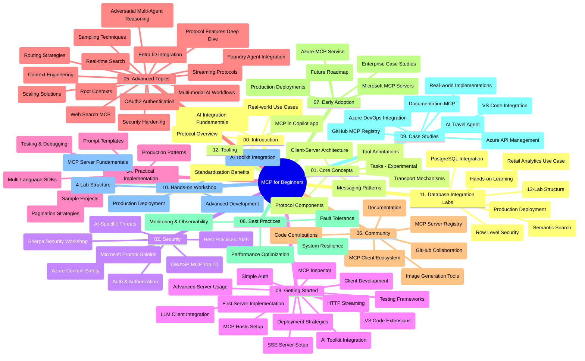

# Protokol modelnega konteksta (MCP) za začetnike - študijski vodič

Ta študijski vodič ponuja pregled strukture in vsebine repozitorija za učni načrt "Protokol modelnega konteksta (MCP) za začetnike". Uporabite ta vodič za učinkovito krmarjenje po repozitoriju in kar najboljšo izrabo razpoložljivih virov.

## Pregled repozitorija

Protokol modelnega konteksta (MCP) je standardiziran okvir za interakcije med AI modeli in odjemalskimi aplikacijami. Sprva ga je ustvaril Anthropic, zdaj pa MCP vzdržuje širša skupnost MCP preko uradne GitHub organizacije. Ta repozitorij ponuja celovit učni načrt s praktičnimi primeri kode v C#, Javi, JavaScriptu, Pythonu in TypeScriptu, zasnovan za razvijalce AI, arhitekte sistemov in programske inženirje.

## Vizualni zemljevid učnega načrta

## Struktura repozitorija

Repozitorij je organiziran v dvanajst glavnih razdelkov, vsak se osredotoča na različne vidike MCP:

1. **Uvod (00-Introduction/)**
   - Pregled protokola modelnega konteksta
   - Zakaj je standardizacija pomembna v AI cevovodih
   - Praktični primeri uporabe in koristi

2. **Osnovni koncepti (01-CoreConcepts/)**
   - Arhitektura klient-strežnik
   - Ključne sestavine protokola
   - Vzorce sporočanja v MCP
   - Trenutna specifikacija: [Kaj se je spremenilo v MCP: Specifikacija 2026-07-28](./01-CoreConcepts/mcp-2026-07-28.md) — stateless jedro protokola, ogrodje za razširitve in ukinitev funkcij Root/Sampling/Logging

3. **Varnost (02-Security/)**
   - Varnostne grožnje v MCP sistemih
   - Najboljše prakse za varno implementacijo
   - Strategije avtorizacije in avtentikacije
   - Praktični [primer avtorizacije CIMD in DCR](./02-Security/samples/cimd-dcr-auth/README.md)
   - **Celovita varnostna dokumentacija**:
     - Najboljše varnostne prakse MCP
     - Vodnik za implementacijo zaščite vsebine Azure
     - Varnostni nadzori in tehnike MCP
     - Hitri referenčni vodnik najboljših praks MCP
   - **Ključne varnostne teme**:
     - Napadi injiciranja navodil in zastrupitve orodij
     - Prevzem seje in problemi z zmedenim zastopnikom
     - Ranljivosti pri posredovanju žetonov
     - Prekomerne pravice in nadzor dostopa
     - Varnost oskrbovalne verige za AI komponente
     - Integracija Microsoft Prompt Shields

4. **Začetek dela (03-GettingStarted/)**
   - Nastavitev in konfiguracija okolja
   - Ustvarjanje osnovnih MCP strežnikov in odjemalcev
   - Integracija z obstoječimi aplikacijami
   - Vključno s poglavji za:
     - Prva implementacija strežnika
     - Razvoj odjemalca
     - Integracija LLM odjemalca
     - Integracija v VS Code
     - Strežnik z dogodki, ki jih pošilja strežnik (SSE)
     - Napredna uporaba strežnika
     - HTTP pretakanje
     - Integracija AI orodnega pribora
     - Testne strategije
     - Smernice za nameščanje

5. **Praktična implementacija (04-PracticalImplementation/)**
   - Uporaba SDK-jev v različnih programskih jezikih
   - Tehnike razhroščevanja, testiranja in validacije
   - Izdelava ponovno uporabnih predlog in delovnih tokov za pozive
   - Vzorčni projekti z izvedbenimi primeri

6. **Napredne teme (05-AdvancedTopics/)**
   - Tehnike inženiringa konteksta
   - Integracija Foundry agenta
   - Večmodalni AI delovni tokovi
   - Demonstracije avtentikacije OAuth2
   - Zmožnosti iskanja v realnem času
   - Pretakanje v realnem času
   - Implementacija osnovnih kontekstov
   - Strategije usmerjanja
   - Tehnike vzorčenja
   - Pristopi k skaliranju
   - Varstvene premisleke
   - Integracija varnosti Entra ID
   - Integracija spletnega iskanja
   - Adversarialno večagentsko sklepanje (vzorce debata)

7. **Prispevki skupnosti (06-CommunityContributions/)**
   - Kako prispevati k kodi in dokumentaciji
   - Sodelovanje preko GitHub
   - Izboljšave in povratne informacije, ki jih vodi skupnost
   - Uporaba različnih MCP odjemalcev (Claude Desktop, Cline, VSCode)
   - Delo s priljubljenimi MCP strežniki, vključno z generiranjem slik

8. **Učne lekcije iz zgodnje uporabe (07-LessonsfromEarlyAdoption/)**
   - Implementacije v resničnem svetu in zgodbe o uspehu
   - Izgradnja in nameščanje rešitev na osnovi MCP
   - Trend in prihodnji načrt
   - **Microsoft MCP strežniki vodnik**: Celovit vodnik po 10 produkcijsko pripravljenih Microsoft MCP strežnikih, vključno z:
     - Microsoft Learn Docs MCP strežnik
     - Azure MCP strežnik (15+ specializiranih priključkov)
     - GitHub MCP strežnik
     - Azure DevOps MCP strežnik
     - MarkItDown MCP strežnik
     - SQL Server MCP strežnik
     - Playwright MCP strežnik
     - Dev Box MCP strežnik
     - Microsoft Foundry MCP strežnik
     - Microsoft 365 Agents Toolkit MCP strežnik

9. **Najboljše prakse (08-BestPractices/)**
   - Nastavitev zmogljivosti in optimizacija
   - Oblikovanje sistemov MCP odpornim na napake
   - Strategije testiranja in odpornosti

10. **Študije primerov (09-CaseStudy/)**
    - **Sedem celovitih študij primerov**, ki prikazujejo vsestranskost MCP v različnih scenarijih:
    - **Azure AI Travel Agents**: Orkestracija več agentov z Azure OpenAI in AI iskanjem
    - **Integracija Azure DevOps**: Avtomatizacija delovnih tokov z osvežitvami podatkov YouTube
    - **Pridobivanje dokumentacije v realnem času**: Python konzolni odjemalec s pretakanjem HTTP
    - **Interaktivni generator učnega načrta**: Chainlit spletna aplikacija s pogovornim AI
    - **Dokumentacija v urejevalniku**: Integracija VS Code z delovnimi tokovi GitHub Copilot
    - **Azure API Management**: Integracija poslovnih API-jev z ustvarjanjem MCP strežnika
    - **GitHub MCP registracija**: Razvoj ekosistema in platforma za integracijo agentov
    - Primeri implementacij, ki zajemajo poslovno integracijo, produktivnost razvijalcev in razvoj ekosistema

11. **Praktična delavnica (10-StreamliningAIWorkflowsBuildingAnMCPServerWithAIToolkit/)**
    - Celovita praktična delavnica, ki združuje MCP z AI orodnim priborom
    - Izgradnja inteligentnih aplikacij, ki povezujejo AI modele s stvarnim svetom orodij
    - Praktični moduli, ki pokrivajo osnove, razvoj po meri strežnika in strategije za produkcijsko uvedbo
    - **Struktura delavnice**:
      - Delavnica 1: Osnove MCP strežnika
      - Delavnica 2: Napredni razvoj MCP strežnika
      - Delavnica 3: Integracija AI orodnega pribora
      - Delavnica 4: Uvedba v produkcijo in skaliranje
    - Učni pristop na osnovi delavnic z navodili po korakih

12. **MCP strežniki z integracijo podatkovnih baz (11-MCPServerHandsOnLabs/)**
    - **Celovit učni načrt z 13 delavnicami** za izgradnjo produkcijsko pripravljenih MCP strežnikov z integracijo PostgreSQL
    - **Implementacija analiz v maloprodaji v resničnem svetu** s primerom uporabe Zava Retail
    - **Poslovni vzorci** vključno z varnostjo na ravni vrstic (RLS), semantičnim iskanjem in dostopom do podatkov za več najemnikov
    - **Popolna struktura delavnic**:
      - **Delavnice 00-03: Osnove** - Uvod, arhitektura, varnost, nastavitev okolja
      - **Delavnice 04-06: Izgradnja MCP strežnika** - Oblikovanje podatkovne baze, implementacija MCP strežnika, razvoj orodij
      - **Delavnice 07-09: Napredne funkcije** - Semantično iskanje, testiranje in razhroščevanje, integracija v VS Code
      - **Delavnice 10-12: Produkcija in najboljše prakse** - Uvedba, spremljanje, optimizacija
    - **Pokrite tehnologije**: okvir FastMCP, PostgreSQL, Azure OpenAI, Azure Container Apps, Application Insights
    - **Učni izidi**: Produkcijsko pripravljeni MCP strežniki, vzorci integracije podatkovnih baz, AI-podprte analitike, poslovna varnost

13. **Orodja (12-tooling/)**
    - Naučite se, kako uporabljati MCP v aplikaciji Copilot in drugih orodjih

## Dodatni viri

Repozitorij vključuje podporno gradivo:

- **Mapa s slikami**: Vsebuje diagrame in ilustracije, uporabljene skozi učni načrt
- **Prevodi**: Podpora za več jezikov z avtomatiziranimi prevodi dokumentacije
- **Uradni viri MCP**:
  - [MCP dokumentacija](https://modelcontextprotocol.io/)
  - [Specifikacija MCP](https://modelcontextprotocol.io/specification/2026-07-28/)
  - [MCP GitHub repozitorij](https://github.com/modelcontextprotocol)

## Kako uporabljati ta repozitorij

1. **Zaporedno učenje**: Sledite poglavjem po vrsti (od 00 do 11) za strukturirano učno izkušnjo.
2. **Jezično osredotočenje**: Če vas zanima določen programski jezik, raziščite mape s primeri za implementacije v vašem priljubljenem jeziku.
3. **Praktična implementacija**: Začnite z razdelkom "Začetek dela" za nastavitev okolja in ustvarjanje prvega MCP strežnika in odjemalca.
4. **Napredno raziskovanje**: Ko obvladate osnove, se poglobite v napredne teme za širitev znanja.
5. **Vključevanje skupnosti**: Pridružite se MCP skupnosti preko GitHub razprav in Discord kanalov za povezovanje z eksperti in drugimi razvijalci.

## MCP odjemalci in orodja

Učni načrt pokriva različne MCP odjemalce in orodja:

1. **Uradni odjemalci**:
   - Visual Studio Code
   - MCP v Visual Studio Code
   - Claude Desktop
   - Claude v VSCode
   - Claude API

2. **Skupnostni odjemalci**:
   - Cline (na terminalu)
   - Cursor (koder)
   - ChatMCP
   - Windsurf

3. **MCP orodja za upravljanje**:
   - MCP CLI
   - MCP Manager
   - MCP Linker
   - MCP Router

## Priljubljeni MCP strežniki

Repozitorij predstavlja različne MCP strežnike, vključno z:

1. **Uradni Microsoft MCP strežniki**:
   - Microsoft Learn Docs MCP strežnik
   - Azure MCP strežnik (več kot 15 specializiranih priključkov)
   - GitHub MCP strežnik
   - Azure DevOps MCP strežnik
   - MarkItDown MCP strežnik
   - SQL Server MCP strežnik
   - Playwright MCP strežnik
   - Dev Box MCP strežnik
   - Microsoft Foundry MCP strežnik
   - Microsoft 365 Agents Toolkit MCP strežnik

2. **Uradni referenčni strežniki**:
   - Datotečni sistem
   - Pridobivanje (Fetch)
   - Pomnilnik
   - Zaporedno razmišljanje

3. **Generiranje slik**:
   - Azure OpenAI DALL-E 3
   - Stable Diffusion WebUI
   - Replicate

4. **Razvojna orodja**:
   - Git MCP
   - Kontrola terminala
   - Koder asistent

5. **Specializirani strežniki**:
   - Salesforce
   - Microsoft Teams
   - Jira & Confluence

## Prispevanje

Ta repozitorij vabi k prispevkom iz skupnosti. Oglejte si razdelek Prispevki skupnosti za navodila, kako učinkovito prispevati k MCP ekosistemu.

----

*Ta študijski vodič je bil nazadnje posodobljen 9. septembra 2026. Odraža MCP
specifikacijo `2026-07-28`, trenutno revizijo protokola. Nekateri praktični
primeri ostajajo eksplicitno verzionirani na `2025-11-25`, medtem ko njihovi SDK-ji in orodja
uporabljajo stateless protokol API-je.*

---

<!-- CO-OP TRANSLATOR DISCLAIMER START -->
**Omejitev odgovornosti**:
Ta dokument je bil preveden z uporabo AI prevajalske storitve [Co-op Translator](https://github.com/Azure/co-op-translator). Čeprav si prizadevamo za natančnost, vas prosimo, da upoštevate, da avtomatizirani prevodi lahko vsebujejo napake ali netočnosti. Izvirni dokument v njegovem izvirnem jeziku je treba obravnavati kot avtoritativni vir. Za kritične informacije je priporočljiv strokovni človeški prevod. Ne odgovarjamo za morebitna nesporazume ali napačne interpretacije, ki izhajajo iz uporabe tega prevoda.
<!-- CO-OP TRANSLATOR DISCLAIMER END -->