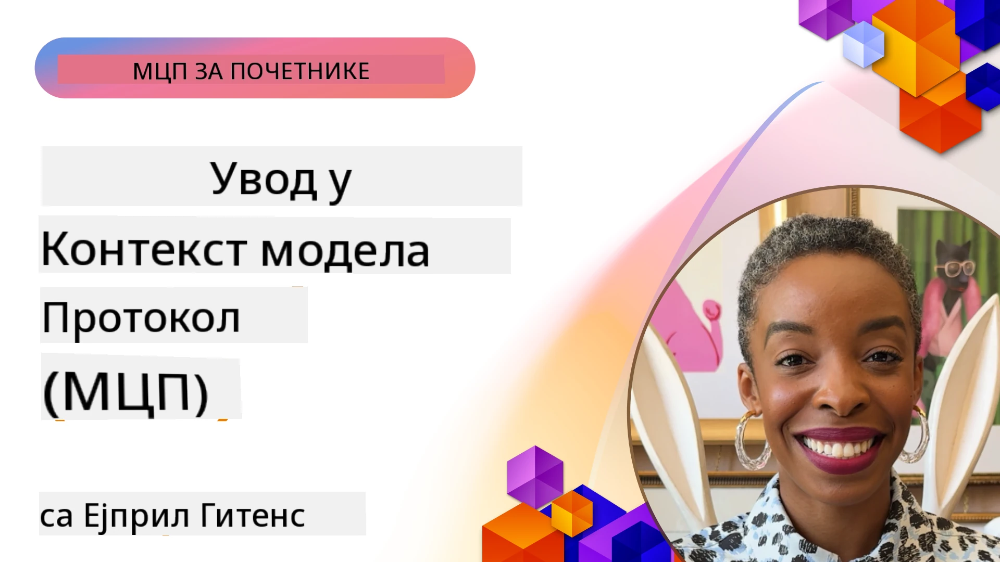
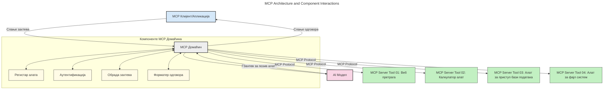
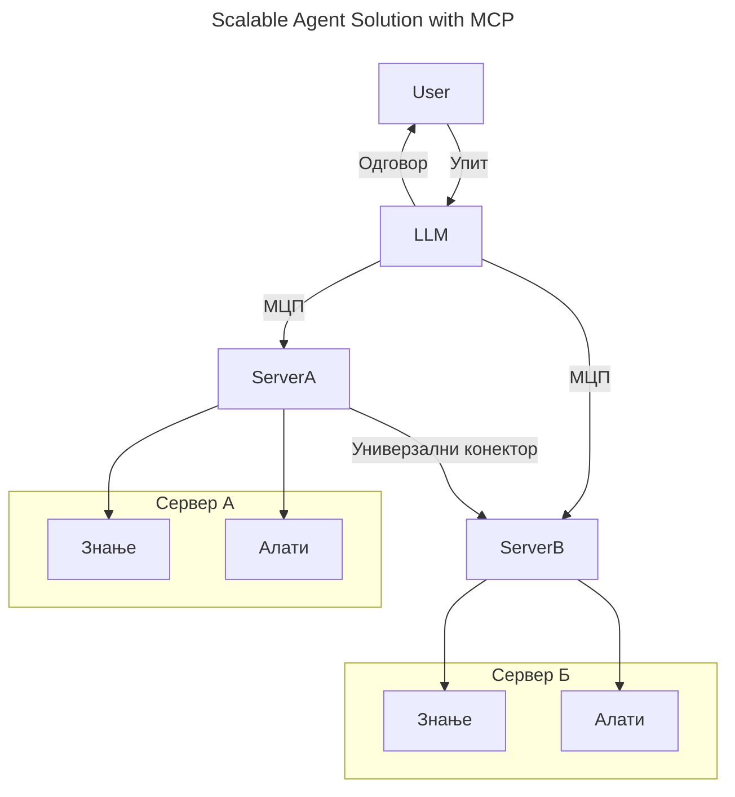
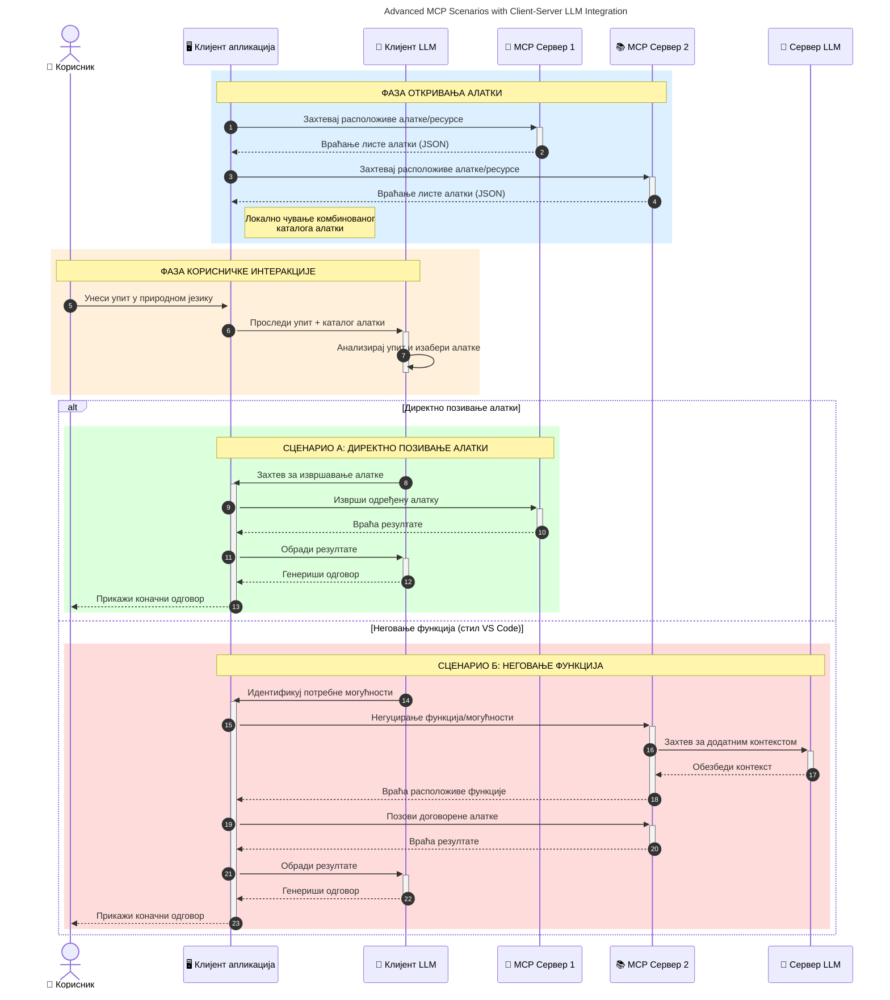

# Увод у Протокол Контекста Модела (MCP): Зашто је важан за скалабилне AI апликације

_(Кликните на слику изнад да бисте гледали видео овог часа)_

Генеративне AI апликације представљају велики корак напред јер често омогућавају кориснику да комуницира са апликацијом користећи природне језичке упите. Међутим, како се све више времена и ресурса улаже у такве апликације, желите да будете сигурни да можете лако интегрисати функционалности и ресурсе на начин који је једноставан за проширење, да ваша апликација може да подржи више модела који се користе, као и да може да рукује различитим детаљима модела. Укратко, изградња генеративних AI апликација је лака на почетку, али како расту и постају сложеније, потребно је почети дефинисати архитектуру и вероватно ћете морати да се ослоните на стандард да бисте осигурали да су ваше апликације изграђене на доследан начин. Овде улази MCP да организује ствари и пружи стандард.

---

## **🔍 Шта је Протокол Контекста Модела (MCP)?**

**Протокол Контекста Модела (MCP)** је **отворени, стандардизовани интерфејс** који омогућава великим језичким моделима (LLM) да беспрекорно комуницирају са спољним алатима, API-jима и изворима података. Пружа доследну архитектуру за побољшање функционалности AI модела изван њихових тренинг података, омогућавајући паметније, скалабилне и реагујуће AI системе.

---

## **🎯 Зашто је стандардизација у AI важна**

Како генеративне AI апликације постају сложеније, неопходно је усвојити стандарде који обезбеђују **скалабилност, проширивост, одрживост** и **избегавање закључавања код добављача**. MCP одговара на ове потребе тако што:

- Уједињује интеграције модела и алата
- Смањује крхке, једнократне прилагођене решења
- Дозвољава да више модела од различитих добављача коегзистира унутар једног екосистема

**Напомена:** Док MCP себе сматра отвореним стандардом, нема планова да се стандардизује преко постојећих стандардних тела као што су IEEE, IETF, W3C, ISO или било које друго тело за стандарде.

---

## **📚 Циљеви учења**

На крају овог чланка моћи ћете да:

- Дефинишете **Протокол Контекста Модела (MCP)** и његове примене
- Разумете како MCP стандардизује комуникацију између модела и алата
- Идентификујете основне компоненте MCP архитектуре
- Истражите примере примене MCP у предузећима и развојним контекстима

---

## **💡 Зашто је Протокол Контекста Модела (MCP) револуционарни**

### **🔗 MCP решава фрагментацију у AI интеракцијама**

Пре MCP-а, интеграција модела са алатима захтевала је:

- Прилагођени код за сваки пар алат-модел
- Нестандардне API-је за сваког добављача
- Честа прекида услед ажурирања
- Лошу скалабилност с повећањем броја алата

### **✅ Предности стандардизације MCP**

| **Предност**              | **Опис**                                                                |
|--------------------------|-------------------------------------------------------------------------|
| Интероперабилност         | LLM-и раде без проблема са алатима различитих добављача                   |
| Доследност                | Једнако понашање на свим платформама и алатима                            |
| Поновна употреба          | Алати изграђени једном могу се користити у више пројеката и система       |
| Бржи развој               | Смањује време развоја коришћењем стандардизованих, plug-and-play интерфејса|

---

## **🧱 Преглед MCP архитектуре на високом нивоу**

MCP следи **клијент-сервер модел**, где:

- **MCP хостови** извршавају AI моделе
- **MCP клијенти** иницирају захтеве
- **MCP сервери** пружају контекст, алате и могућности

### **Кључне компоненте:**

- **Ресурси** – Статички или динамички подаци за моделе  
- **Упити (Prompts)** – Пред дефинисани токови за вођену генерацију  
- **Алатке (Tools)** – Извршне функције као претрага, израчунавање  
- **Семпловање (Sampling)** – Агентско понашање преко рекурзивних интеракција (застарело у
    MCP верзији `2026-07-28`; нове имплементације треба да се интегришу директно са провајдером LLM)

- **Елизитација (Elicitation)** – Захтеви иницирани од стране сервера за унос корисника
- **Корени (Roots)** – Информативне локације у систему фајлова релевантне за сервер
    (застарело у MCP `2026-07-28`; радије користите параметре алата, URI ресурсе или
    конфигурацију сервера)

### **Архитектура протокола:**

MCP користи двослојну архитектуру:
- **Слој података**: JSON-RPC 2.0 поруке, метаподаци по захтеву, откривање и
    примитиви протокола
- **Транспортни слој**: stdio за локалне подсистеме и Streamable HTTP за
    удаљене сервере. Streamable HTTP може користити SSE рамковање за стриминг одговора,
    али старији HTTP+SSE транспорт је застарео.

---

## Како MCP сервери раде

MCP сервери функционишу на следећи начин:

- **Ток захтева**:
    1. Захтев иницира крајњи корисник или софтвер који делује у његово име.
    2. **MCP клијент** шаље захтев **MCP хосту**, који управља извршавањем AI модела.
    3. **AI модел** прими кориснички упит и може затражити приступ спољним алатима или подацима преко једног или више позива алата.
    4. **MCP хост**, а не сам модел директно, комуницира са одговарајућим **MCP серверима** користећи стандардизовани протокол.
- **Функционалности MCP хоста**:
    - **Регистар алата**: Одржава каталог доступних алата и њихових могућности.
    - **Аутентификација**: Верификује дозволе за приступ алатима.
    - **Обрада захтева**: Обрађује долазне захтеве за алате од модела.
    - **Форматер одговора**: Структурира излазе алата у формат који модел може разумети.
- **Извођење на MCP серверу**:
    - **MCP хост** прослеђује позиве алатима једном или више **MCP сервера**, од којих сваки пружа специјализоване функције (нпр. претрага, израчунавање, упити у базу података).
    - **MCP сервери** извршавају своје операције и враћају резултате **MCP хосту** у доследном формату.
    - **MCP хост** форматира и прослеђује те резултате AI моделу.
- **Завршетак одговора**:
    - **AI модел** укључује излазе алата у коначни одговор.
    - **MCP хост** шаље овај одговор натраг **MCP клијенту**, који га доставља крајњем кориснику или позивајућем софтверу.
    

## 👨‍💻 Како направити MCP сервер (са примерима)

MCP сервери вам омогућавају да проширите могућности LLM тако што пружају податке и функционалности. 

Спремни за испробавање? Ево језичких и/или стек специфичних SDK-ова са примерима креирања једноставних MCP сервера на различитим језицима/стековима:

- **Python SDK**: https://github.com/modelcontextprotocol/python-sdk

- **TypeScript SDK**: https://github.com/modelcontextprotocol/typescript-sdk

- **Java SDK**: https://github.com/modelcontextprotocol/java-sdk

- **C#/.NET SDK**: https://github.com/modelcontextprotocol/csharp-sdk

## 🌍 Примери стварне употребе MCP

MCP омогућава широк спектар примена проширујући AI могућности:

| **Примена**               | **Опис**                                                                |
|-------------------------|-------------------------------------------------------------------------|
| Интеграција података у предузећима  | Повезивање LLM са базама података, CRM-овима или интерним алатима     |
| Агентски AI системи       | Омогућава аутономне агенте са приступом алатима и радним токовима одлучивања |
| Мултимодалне апликације    | Комбинују текстуалне, сликовне и аудио алате у једну уједињену AI апликацију |
| Интеграција података у реалном времену | Уношење живих података у AI интеракције за прецизније и актуелније резултате |

### 🧠 MCP = Универзални стандард за AI интеракције

Протокол Контекста Модела (MCP) функционише као универзални стандард за AI интеракције, слично као што је USB-C стандардизовао физичке везе за уређаје. У свету AI, MCP пружа доследан интерфејс, омогућавајући моделима (клијентима) да се беспрекорно интегришу са спољним алатима и провајдерима података (серверима). Ово елиминише потребу за различитим, прилагођеним протоколима за сваки API или извор података.

По MCP-у, MCP-компатибилан алат (познат као MCP сервер) следи унифицирани стандард. Ови сервери могу набројати алате или радње које пружају и извршити те радње када им их AI агент затражи. Платформе AI агената које подржавају MCP могу да открију доступне алате са сервера и позову их преко овог стандардног протокола.

### 💡 Олакшава приступ знању

Поред пружања алата, MCP омогућава и приступ знању. Он омогућава апликацијама да пруже контекст великим језичким моделима тако што их повезује са разним изворима података. На пример, MCP сервер може представљати фирмски репозиторијум докумената, омогућавајући агентима да на захтев преузму релевантне информације. Други сервер може обављати конкретне радње као слање имејлова или ажурирање записа. Са становишта агента, ово су једноставно алати које може користити — неки алати враћају податке (контекст знања), док други извршавају радње. MCP ефикасно управља обема.

Агент који се повезује на MCP сервер аутоматски сазнаје доступне могућности сервера и приступачне податке преко стандардног формата. Ова стандардизација омогућава динамичку доступност алата. На пример, додавањем новог MCP сервера у систем агента његове функције одмах постају употребљиве без даљег прилагођавања упутстава агента.

Ова поједностављена интеграција се слаже са током приказаним на следећој дијаграму, где сервери пружају и алате и знање, обезбеђујући беспрекорну сарадњу између система.

### 👉 Пример: Скалабилно агентско решење

Универзални конектор омогућава MCP серверима да комуницирају и деле могућности међу собом, дозвољавајући ServerA да делегира задатке ServerB-у или приступи његовим алатима и знању. Ово федерално повезивање алата и података између сервера подржава скалабилне и модуларне агентске архитектуре. Пошто MCP стандардизује изложеност алата, агенти могу динамички откривати и усмеравати захтеве између сервера без уграђених интеграција.

Федеровање алата и знања: Алати и подаци могу бити приступачни преко сервера, омогућавајући скалабилније и модуларније агентске архитектуре.

### 🔄 Напредни MCP сценарији са интеграцијом LLM на страни клијента

Поред основне MCP архитектуре, постоје напредни сценарији у којима и клијент и сервер садрже LLM-ове, омогућавајући сложеније интеракције. На следећој дијаграми, **Клијентска апликација** може бити IDE са низом MCP алата на располагању за коришћење од стране LLM-а:

## 🔐 Практичне предности MCP

Ево практичних предности коришћења MCP:

- **Ажурност**: Модели могу приступати актуелним информацијама ван својих тренинг података
- **Проширење могућности**: Модели могу користити специјализоване алате за задаке за које нису обучени
- **Смањење халуцинација**: Спољни извори података пружају чињеничну основу
- **Приватност**: Осетљиви подаци могу остати у сигурним окружењима уместо да буду уграђени у упите

## 📌 Кључни закључци

Следећи су кључни закључци за коришћење MCP:

- **MCP** стандардизује начин на који AI модели комуницирају са алатима и подацима
- Промовише **проширивост, доследност и интероперабилност**
- MCP помаже у **смањењу времена развоја, побољшава поузданост и проширује могућности модела**
- Клијент-сервер архитектура **омогућава флексибилне, прошириве AI апликације**

## 🧠 Вежба

Размислити о AI апликацији коју бисте желели да направите.

- Који **спољни алати или подаци** би могли побољшати њене могућности?
- Како би MCP могао учинити интеграцију **једноставнијом и поузданијом?**

## Додатни ресурси

- [MCP GitHub Репозиторијум](https://github.com/modelcontextprotocol)

## Шта следи

Следеће: [Поглавље 1: Основни појмови](../01-CoreConcepts/README.md)

---

<!-- CO-OP TRANSLATOR DISCLAIMER START -->
**Изјава о одрицању одговорности**:
Овај документ је преведен коришћењем услуге за аутоматски превод [Co-op Translator](https://github.com/Azure/co-op-translator). Иако тежимо тачности, имајте у виду да аутоматски преводи могу садржати грешке или нетачности. Оригинални документ на његовом изворном језику треба сматрати ауторитативним извором. За критичне информације препоручује се професионални људски превод. Нисмо одговорни за било каква неспоразума или погрешна тумачења која произилазе из коришћења овог превода.
<!-- CO-OP TRANSLATOR DISCLAIMER END -->