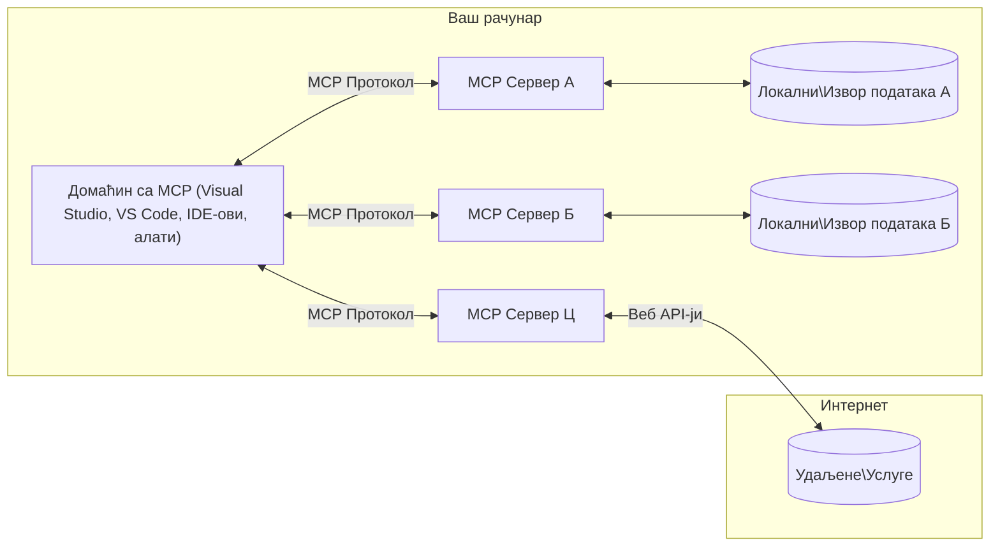

# MCP Основни Концепти: Мастеринг Протокола Контекста Модела за AI Интеграцију

[](https://youtu.be/earDzWGtE84)

_(Кликните на слику изнад да бисте погледали видео о овој лекцији)_

[Model Context Protocol (MCP)](https://github.com/modelcontextprotocol) је моћан, стандардизован оквир који оптимизује комуникацију између Великих Језичких Модела (LLMs) и спољних алата, апликација и извора података.  
Овај водич ће вас провести кроз основне концепте MCP-а. Научићете о његовој клијент-сервер архитектури, основним компонентама, механизмима комуникације и најбољим праксама имплементације.

- **Јасна корисничка сагласност**: Сав приступ подацима и операције захтевају изричиту корисничку дозволу пре извршења. Корисници морају јасно разумети који ће подаци бити приступљени и које ће радње бити извршене, са детаљном контролом над дозволама и овлашћењима.

- **Заштита приватности података**: Кориснички подаци се излажу само уз изричиту сагласност и морају бити заштићени робусним контролама приступа током целог животног циклуса интеракције. Имплементације морају спречити неовлашћени пренос података и одржавати строге границе приватности.

- **Безбедност извршења алата**: Сваки позив алата захтева изричиту корисничку сагласност са јасним разумевањем функционалности алата, параметара и потенцијалног утицаја. Робусне безбедносне границе морају спречити нежељено, небезбедно или злонамерно извршење алата.

- **Безбедност транспортног слоја**: Сви канали комуникације треба да користе одговарајуће механизме шифровања и аутентификације. Удаљене везе треба да имплементирају сигурне транспортне протоколе и правилно управљање акредитивима.

#### Упутства за имплементацију:

- **Управљање дозволама**: Имплементирајте системе фино подељених дозвола који омогућавају корисницима контролу којим серверима, алатима и ресурсима је приступ дозвољен  
- **Аутентификација и овлашћење**: Користите сигурне методе аутентификације (OAuth, API кључеви) са правилним управљањем токенима и истеком  
- **Валидација уноса**: Валидација свих параметара и уноса података у складу са дефинисаним шемама ради спречавања инјекционих напада  
- **Аудит логовање**: Одржавајте свеобухватне записе свих операција за безбедносни надзор и усаглашеност

## Преглед

Ова лекција истражује основну архитектуру и компоненте које чине екосистем Протокола Контекста Модела (MCP). Научићете о клијент-сервер архитектури, кључним компонентама и механизмима комуникације који покрећу MCP интеракције.

## Кључни Циљеви Учeња

До краја ове лекције, ви ћете:

- Разумети MCP клијент-сервер архитектуру.  
- Идентификовати улоге и одговорности Хостова, Клијената и Сервера.  
- Анализирати основне карактеристике које чине MCP флексибилним интеграционим слојем.  
- Научити како информације тече унутар MCP екосистема.  
- Стекнути практичне увиде кроз примере кода у .NET, Java, Python и JavaScript.

## MCP Архитектура: Детаљнији Поглед

MCP екосистем је изграђен на клијент-сервер моделу. Ова модуларна структура омогућава AI апликацијама ефикасну интеракцију са алатима, базама података, API-јима и контекстуалним ресурсима. Хајде да разложимо ову архитектуру на њене основне компоненте.

У свом језгру, MCP прати клијент-сервер архитектуру где хост апликација може да се повеже са више сервера:


- **MCP Хостови**: Програми као што су VSCode, Claude Desktop, IDE-и или AI алати који желе приступити подацима преко MCP-а  
- **MCP Клијенти**: Протокол клијенти који одржавају 1:1 везе са серверима  
- **MCP Сервери**: Лагани програми који излажу специфичне могућности кроз стандардизовани Протокол Контекста Модела  
- **Локални Извори Података**: Фајлови, базе података и сервиси на вашем рачунару којима MCP сервери могу безбедно приступити  
- **Удаљене Услуге**: Спољни системи доступни преко интернета којима MCP сервери могу приступити преко API-ја.

MCP Протокол је еволуирајући стандард који користи верзионисање засновано на датуму (формат ГГГГ-ММ-ДД). Тренутна верзија протокола је **2025-11-25**. Можете видети најновија ажурирања у [спецификацији протокола](https://modelcontextprotocol.io/specification/2025-11-25/)

### 1. Хостови

У Протоколу Контекста Модела (MCP), **Хостови** су AI апликације које служе као примарни интерфејс кроз који корисници интерагују са протоколом. Хостови координишу и управљају везама са више MCP сервера креирајући посебне MCP клијенте за сваку серверску везу. Примери Хостова укључују:

- **AI Апликације**: Claude Desktop, Visual Studio Code, Claude Code  
- **Развојна Окружења**: IDE-и и уређивачи кода са MCP интеграцијом  
- **Прилагођене Апликације**: Намјенски AI агенти и алати

**Хостови** су апликације које координишу интеракције са AI моделима. Они:

- **Оркестрирају AI Моделе**: Извршавају или интерагују са LLM-овима да генеришу одговоре и координишу AI токове рада  
- **Управљају Клијентским Везама**: Креирају и одржавају по једног MCP клијента за сваку MCP сервер везу  
- **Контролишу Кориснички Интерфејс**: Руководе током разговора, корисничким интеракцијама и приказом одговора  
- **Спроводе Безбедност**: Контролишу дозволе, безбедносне ограничења и аутентификацију  
- **Обрађују Корисничку Сагласност**: Управљају корисничким одобрењем за дељење података и извршење алата

### 2. Клијенти

**Клијенти** су основне компоненте које одржавају посебне један-на-један везе између Хостова и MCP сервера. Сваки MCP клијент се инстанцира од стране Хоста да се повеже са одређеним MCP сервером, обезбеђујући организоване и безбедне канале комуникације. Више клијената омогућава Хостовима да се истовремено повежу са више сервера.

**Клијенти** су конекторске компоненте унутар хост апликације. Они:

- **Протокол Комуникација**: Слање JSON-RPC 2.0 захтева серверима са упутствима и инструкцијама  
- **Неговање Могућности**: Неговати подржане функције и верзије протокола са серверима током иницијализације  
- **Извршење Алатa**: Управљају захтевима за извршење алата од модела и обрађују одговоре  
- **Ажурирања у Реалном Времену**: Обрађују нотификације и ажурирања у реалном времену од сервера  
- **Обрада Одговора**: Обрађују и форматирају одговоре сервера за приказ корисницима

### 3. Сервери

**Сервери** су програми који пружају контекст, алате и могућности MCP клијентима. Могу се извршавати локално (на истом рачунару као Хост) или удаљено (на спољним платформама), и одговорни су за обраду захтева клијената и пружање структурираних одговора. Сервери излажу специфичне функционалности кроз стандардизовани Протокол Контекста Модела.

**Сервери** су сервиси који пружају контекст и могућности. Они:

- **Регистрација Карактеристика**: Региструју и излажу доступне примитиве (ресурсе, упите, алате) клијентима  
- **Обрада Захтева**: Примају и извршавају позиве алата, захтеве за ресурсима и упите од клијената  
- **Обезбеђивање Контекста**: Пружају контекстуалне информације и податке за побољшање одговора модела  
- **Управљање Стањем**: Одржавају стање сесије и обрађују интеракције са стањем када је потребно  
- **Нотификације у Реалном Времену**: Слање нотификација о променама могућности и ажурирањима повезаним клијентима

Сервере може развијати било ко да прошири могућности модела специјализованом функционалношћу, и подржавају и локалне и удаљене сценарије имплементације.

### 4. Серверски Примитиви

Сервери у Протоколу Контекста Модела (MCP) пружају три основна **примитива** која дефинишу фундаменталне грађевинске блокове за богате интеракције између клијената, хостова и језичких модела. Ови примитиви одређују типове контекстуалних информација и акција доступних кроз протокол.

MCP сервери могу излагати било коју комбинацију следећа три основна примитива:

#### Ресурси

**Ресурси** су извори података који пружају контекстуалне информације AI апликацијама. Представљају статичке или динамичке садржаје који могу побољшати разумевање модела и доношење одлука:

- **Контекстуални Податци**: Структуриране информације и контекст за коришћење од стране AI модела  
- **Базе Знања**: Репозиторијуми докумената, чланци, приручници и научни радови  
- **Локални Извори Података**: Фајлови, базе података и локалне системске информације  
- **Спољни Податци**: API одговори, веб сервиси и подаци удаљених система  
- **Динамички Садржај**: Податци у реалном времену који се ажурирају у зависности од спољних услова

Ресурси се идентификују URI-јевима и подржавају откривање преко метода `resources/list` и преузимање преко `resources/read`:

```text
file://documents/project-spec.md
database://production/users/schema
api://weather/current
```

#### Упити

**Упити** су поновно употребљиви шаблони који помажу у структуирању интеракција са језичким моделима. Пружају стандардизоване обрасце интеракције и шаблонизоване токове рада:

- **Интеракције засноване на шаблонима**: Предструктурисане поруке и почетни разговори  
- **Шаблони Токова Рада**: Стандардизовани низови за уобичајене задатке и интеракције  
- **Примери са неколико узорака**: Шаблони засновани на примерима за упутства моделу  
- **Системски Упити**: Основни упити који дефинишу понашање и контекст модела  
- **Динамички Шаблони**: Параметризовани упити који се прилагођавају специфичним контекстима

Упити подржавају замену променљивих и могу се открити преко `prompts/list` и преузети са `prompts/get`:

```markdown
Generate a {{task_type}} for {{product}} targeting {{audience}} with the following requirements: {{requirements}}
```

#### Алатке

**Алатке** су извршне функције које AI модели могу позивати да изврше специфичне радње. Представљају "глаголе" MCP екосистема, омогућавајући моделима интеракцију са спољним системима:

- **Извршне Функције**: Дискретне операције које модели могу позивати са специфичним параметрима  
- **Интеграција Спољних Система**: API позиви, упити база података, операције са фајловима, прорачуни  
- **Јединствени Идентитет**: Свака алатка има јединствено име, опис и шему параметара  
- **Структурирани Улаз/Излаз**: Алатке прихватају валидиране параметре и враћају структуриране, типизиране одговоре  
- **Акционе Могућности**: Омогућавају моделима извођење стварних радњи и преузимање живих података

Алатке су дефинисане помоћу JSON Шеме за валидацију параметара и откривају се преко `tools/list` и извршавају преко `tools/call`:

```typescript
server.tool(
  "search_products", 
  {
    query: z.string().describe("Search query for products"),
    category: z.string().optional().describe("Product category filter"),
    max_results: z.number().default(10).describe("Maximum results to return")
  }, 
  async (params) => {
    // Изврши претрагу и врати структуриране резултате
    return await productService.search(params);
  }
);
```

## Клијентски Примитиви

У Протоколу Контекста Модела (MCP), **клијенти** могу излагати примитиве који омогућавају серверима да захтевају додатне могућности од хост апликације. Ови примитиви на страни клијента омогућавају богатије, интерактивније имплементације сервера које могу приступити могућностима AI модела и корисничким интеракцијама.

### Узорковање

**Узорковање** омогућава серверима да захтевају завршетке језичког модела из AI апликације клијента. Овај примитив омогућава серверима приступ LLM могућностима без уграђивања сопствених зависности модела:

- **Независан Приступ Моделу**: Сервери могу захтевати завршетке без укључивања LLM SDK-ова или управљања приступом моделу  
- **AI Инициран од стране Сервера**: Омогућава серверима аутономно генерисање садржаја користећи AI модел клијента  
- **Рекурзивне LLM Интеракције**: Подржава сложене сценарије где сервери требају AI помоћ за обраду  
- **Динамичка Генерација Садржаја**: Омогућава серверима креирање контекстуалних одговора користећи модел хоста

Узорковање се иницира преко методе `sampling/complete`, где сервери шаљу захтеве за завршетке клијентима.

### Елицитација

**Елицитација** омогућава серверима да захтевају додатне информације или потврду од корисника преко клијентског интерфејса:

- **Захтеви за Корисничким Уносом**: Сервери могу тражити додатне информације када су потребне за извршење алата  
- **Дијалози Потврде**: Захтевају корисничко одобрење за осетљиве или утицајне операције  
- **Интерактивни Токови Рада**: Омогућавају серверима креирање корак-по-корак корисничких интеракција  
- **Динамичко Прикупљање Параметара**: Прикупљају недостајуће или опционе параметре током извршења алата

Захтеви за елицитацију се праве коришћењем методе `elicitation/request` за прикупљање корисничког уноса преко интерфејса клијента.

### Логовање

**Логовање** омогућава серверима да шаљу структуриране лог поруке клијентима за дебаговање, праћење и оперативну видљивост:

- **Подршка за Дебаговање**: Омогућава серверима да пруже детаљне записе извршења за решавање проблема  
- **Оперативно Праћење**: Слање статусних ажурирања и метрика перформанси клијентима  
- **Извештавање о Грешкама**: Пружа детаљан контекст грешака и дијагностичке информације  
- **Аудит Трагови**: Креира свеобухватне записе операција и одлука сервера

Лог поруке се шаљу клијентима ради пружања транспарентности у операције сервера и олакшавања дебаговања.

## Ток Информација у MCP

Протокол Контекста Модела (MCP) дефинише структуриран ток информација између хостова, клијената, сервера и модела. Разумевање овог тока помаже у разјашњавању како се кориснички захтеви обрађују и како се спољни алати и подаци интегришу у одговоре модела.

- **Хост Иницира Везу**  
  Хост апликација (као што је IDE или интерфејс за ћаскање) успоставља везу са MCP сервером, обично преко STDIO, WebSocket-а или другог подржаног транспорта.

- **Неговање Могућности**  
  Клијент (уграђен у хост) и сервер размењују информације о својим подржаним функцијама, алатима, ресурсима и верзијама протокола. Ово осигурава да обе стране разумеју које могућности су доступне за сесију.

- **Кориснички Захтев**  
  Корисник интерагује са хостом (нпр. уноси упит или команду). Хост прикупља овај унос и прослеђује га клијенту на обраду.

- **Коришћење Ресурса или Алатa**  
  - Клијент може затражити додатни контекст или ресурсе од сервера (као што су фајлови, уноси у бази података или чланци из базе знања) да обогати разумевање модела.  
  - Ако модел одлучи да је потребан алат (нпр. за преузимање података, извршење прорачуна или позив API-ја), клијент шаље захтев за позив алата серверу, наводећи име алата и параметре.

- **Извршење на Серверу**  
  Сервер прима захтев за ресурс или алат, извршава потребне операције (као што су покретање функције, упит базе података или преузимање фајла) и враћа резултате клијенту у структурираном формату.

- **Генерисање Одговора**  
  Клијент интегрише одговоре сервера (подаци ресурса, излази алата итд.) у текућу интеракцију са моделом. Модел користи ове информације да генерише свеобухватан и контекстуално релевантан одговор.

- **Приказ Резултата**  
  Хост прима коначни излаз од клијента и приказује га кориснику, често укључујући и генерисани текст модела и резултате извршења алата или претраге ресурса.

Овај ток омогућава MCP-у да подржи напредне, интерактивне и контекстуално свесне AI апликације беспрекорним повезивањем модела са спољним алатима и изворима података.

## Архитектура и Слојеви Протокола

MCP се састоји од два различита архитектонска слоја који заједно раде да пруже комплетан комуникациони оквир:

### Слој Података

**Слој Података** имплементира основни MCP протокол користећи **JSON-RPC 2.0** као основу. Овај слој дефинише структуру порука, семантику и обрасце интеракције:

#### Основне Компоненте:

- **JSON-RPC 2.0 Протокол**: Сва комуникација користи стандардизовани JSON-RPC 2.0 формат порука за позиве метода, одговоре и нотификације
- **Управљање животним циклусом**: Руководи иницијализацијом везе, преговорима о могућностима и завршетком сесије између клијената и сервера  
- **Примитиви сервера**: Омогућавају серверима да пруже основну функционалност кроз алате, ресурсе и упите  
- **Примитиви клијента**: Омогућавају серверима да захтевају узорковање од LLM-ова, добијају унос корисника и шаљу лог поруке  
- **Обавештења у реалном времену**: Подржава асинхрона обавештења за динамичка ажурирања без потребе за повременим проверавањем  

#### Кључне карактеристике:

- **Преговарање верзије протокола**: Користи верзионисање засновано на датуму (ГГГГ-ММ-ДД) за обезбеђивање компатибилности  
- **Откривање могућности**: Клијенти и сервери размењују информације о подржаним функцијама током иницијализације  
- **Сесије са стањем**: Одржава стање везе кроз више интеракција ради континуитета контекста  

### Транспортни слој

**Транспортни слој** управља комуникационим каналима, форматирањем порука и аутентификацијом између учесника MCP-а:

#### Подржани транспортни механизми:

1. **STDIO транспорт**:  
   - Користи стандардне улазно-излазне токове за директну комуникацију процеса  
   - Оптималан за локалне процесе на истој машини без мрежног оптерећења  
   - Често се користи за локалне имплементације MCP сервера  

2. **Стримујући HTTP транспорт**:  
   - Користи HTTP POST за поруке од клијента ка серверу  
   - Опционо Server-Sent Events (SSE) за стримовање од сервера ка клијенту  
   - Омогућава комуникацију са удаљеним серверима преко мреже  
   - Подржава стандардну HTTP аутентификацију (bearer токени, API кључеви, прилагођени заглавља)  
   - MCP препоручује OAuth за безбедну аутентификацију засновану на токенима  

#### Апстракција транспорта:

Транспортни слој апстрахује детаље комуникације од слоја података, омогућавајући исти JSON-RPC 2.0 формат порука преко свих транспортних механизама. Ова апстракција омогућава апликацијама да без проблема пребацују између локалних и удаљених сервера.

### Безбедносне разматрања

Имплементације MCP-а морају се придржавати неколико критичних безбедносних принципа како би обезбедиле безбедне, поуздане и сигурне интеракције у свим операцијама протокола:

- **Сагласност и контрола корисника**: Корисници морају дати изричиту сагласност пре него што се приступи било којим подацима или изврше операције. Треба да имају јасну контролу над тим који се подаци деле и које су акције овлашћене, уз интуитивне корисничке интерфејсе за преглед и одобрење активности.

- **Приватност података**: Кориснички подаци треба да буду изложени само уз изричиту сагласност и морају бити заштићени одговарајућим контролама приступа. Имплементације MCP-а морају спречити неовлашћени пренос података и обезбедити да приватност буде очувана током свих интеракција.

- **Безбедност алата**: Пре позивања било ког алата потребна је изричита сагласност корисника. Корисници треба да имају јасно разумевање функционалности сваког алата, а морају се спроводити робусне безбедносне границе како би се спречило нежељено или небезбедно извршавање алата.

Пратећи ове безбедносне принципе, MCP обезбеђује поверење корисника, приватност и безбедност у свим интеракцијама протокола уз омогућавање моћних AI интеграција.

## Примери кода: Кључне компоненте

Испод су примери кода у неколико популарних програмских језика који илуструју како имплементирати кључне компоненте MCP сервера и алате.

### .NET пример: Креирање једноставног MCP сервера са алатима

Ево практичног .NET примера кода који показује како имплементирати једноставан MCP сервер са прилагођеним алатима. Овај пример приказује како дефинисати и регистровати алате, обрађивати захтеве и повезати сервер користећи Model Context Protocol.

```csharp
using System;
using System.Threading.Tasks;
using ModelContextProtocol.Server;
using ModelContextProtocol.Server.Transport;
using ModelContextProtocol.Server.Tools;

public class WeatherServer
{
    public static async Task Main(string[] args)
    {
        // Create an MCP server
        var server = new McpServer(
            name: "Weather MCP Server",
            version: "1.0.0"
        );
        
        // Register our custom weather tool
        server.AddTool<string, WeatherData>("weatherTool", 
            description: "Gets current weather for a location",
            execute: async (location) => {
                // Call weather API (simplified)
                var weatherData = await GetWeatherDataAsync(location);
                return weatherData;
            });
        
        // Connect the server using stdio transport
        var transport = new StdioServerTransport();
        await server.ConnectAsync(transport);
        
        Console.WriteLine("Weather MCP Server started");
        
        // Keep the server running until process is terminated
        await Task.Delay(-1);
    }
    
    private static async Task<WeatherData> GetWeatherDataAsync(string location)
    {
        // This would normally call a weather API
        // Simplified for demonstration
        await Task.Delay(100); // Simulate API call
        return new WeatherData { 
            Temperature = 72.5,
            Conditions = "Sunny",
            Location = location
        };
    }
}

public class WeatherData
{
    public double Temperature { get; set; }
    public string Conditions { get; set; }
    public string Location { get; set; }
}
```

### Java пример: Компоненте MCP сервера

Овај пример демонстрира исти MCP сервер и регистрацију алата као горе наведени .NET пример, али имплементиран у Јави.

```java
import io.modelcontextprotocol.server.McpServer;
import io.modelcontextprotocol.server.McpToolDefinition;
import io.modelcontextprotocol.server.transport.StdioServerTransport;
import io.modelcontextprotocol.server.tool.ToolExecutionContext;
import io.modelcontextprotocol.server.tool.ToolResponse;

public class WeatherMcpServer {
    public static void main(String[] args) throws Exception {
        // Креирај MCP сервер
        McpServer server = McpServer.builder()
            .name("Weather MCP Server")
            .version("1.0.0")
            .build();
            
        // Региструј алат за временску прогнозу
        server.registerTool(McpToolDefinition.builder("weatherTool")
            .description("Gets current weather for a location")
            .parameter("location", String.class)
            .execute((ToolExecutionContext ctx) -> {
                String location = ctx.getParameter("location", String.class);
                
                // Преузми податке о времену (поједностављено)
                WeatherData data = getWeatherData(location);
                
                // Врати форматирани одговор
                return ToolResponse.content(
                    String.format("Temperature: %.1f°F, Conditions: %s, Location: %s", 
                    data.getTemperature(), 
                    data.getConditions(), 
                    data.getLocation())
                );
            })
            .build());
        
        // Повежи сервер користећи stdio транспорт
        try (StdioServerTransport transport = new StdioServerTransport()) {
            server.connect(transport);
            System.out.println("Weather MCP Server started");
            // Одржавај сервер у раду док се процес не заврши
            Thread.currentThread().join();
        }
    }
    
    private static WeatherData getWeatherData(String location) {
        // Имплементација би позвала API за временску прогнозу
        // Пojедностављено за потребе примера
        return new WeatherData(72.5, "Sunny", location);
    }
}

class WeatherData {
    private double temperature;
    private String conditions;
    private String location;
    
    public WeatherData(double temperature, String conditions, String location) {
        this.temperature = temperature;
        this.conditions = conditions;
        this.location = location;
    }
    
    public double getTemperature() {
        return temperature;
    }
    
    public String getConditions() {
        return conditions;
    }
    
    public String getLocation() {
        return location;
    }
}
```

### Python пример: Изградња MCP сервера

Овај пример користи fastmcp, па се побрините да га прво инсталирате:

```python
pip install fastmcp
```
Пример кода:

```python
#!/usr/bin/env python3
import asyncio
from fastmcp import FastMCP
from fastmcp.transports.stdio import serve_stdio

# Креирајте FastMCP сервер
mcp = FastMCP(
    name="Weather MCP Server",
    version="1.0.0"
)

@mcp.tool()
def get_weather(location: str) -> dict:
    """Gets current weather for a location."""
    return {
        "temperature": 72.5,
        "conditions": "Sunny",
        "location": location
    }

# Алтернативни приступ коришћењем класе
class WeatherTools:
    @mcp.tool()
    def forecast(self, location: str, days: int = 1) -> dict:
        """Gets weather forecast for a location for the specified number of days."""
        return {
            "location": location,
            "forecast": [
                {"day": i+1, "temperature": 70 + i, "conditions": "Partly Cloudy"}
                for i in range(days)
            ]
        }

# Региструјте алате класе
weather_tools = WeatherTools()

# Покрените сервер
if __name__ == "__main__":
    asyncio.run(serve_stdio(mcp))
```

### JavaScript пример: Креирање MCP сервера

Овај пример показује креирање MCP сервера у JavaScript-у и како регистровати два алата везана за временске услове.

```javascript
// Коришћење званичног Model Context Protocol SDK-а
import { McpServer } from "@modelcontextprotocol/sdk/server/mcp.js";
import { StdioServerTransport } from "@modelcontextprotocol/sdk/server/stdio.js";
import { z } from "zod"; // За валидацију параметара

// Креирај MCP сервер
const server = new McpServer({
  name: "Weather MCP Server",
  version: "1.0.0"
});

// Дефиниши алат за временску прогнозу
server.tool(
  "weatherTool",
  {
    location: z.string().describe("The location to get weather for")
  },
  async ({ location }) => {
    // Ово би обично позивало API за временску прогнозу
    // Поједностављено за демонстрацију
    const weatherData = await getWeatherData(location);
    
    return {
      content: [
        { 
          type: "text", 
          text: `Temperature: ${weatherData.temperature}°F, Conditions: ${weatherData.conditions}, Location: ${weatherData.location}` 
        }
      ]
    };
  }
);

// Дефиниши алат за прогнозу
server.tool(
  "forecastTool",
  {
    location: z.string(),
    days: z.number().default(3).describe("Number of days for forecast")
  },
  async ({ location, days }) => {
    // Ово би обично позивало API за временску прогнозу
    // Поједностављено за демонстрацију
    const forecast = await getForecastData(location, days);
    
    return {
      content: [
        { 
          type: "text", 
          text: `${days}-day forecast for ${location}: ${JSON.stringify(forecast)}` 
        }
      ]
    };
  }
);

// Помоћне функције
async function getWeatherData(location) {
  // Симулирај позив API-ја
  return {
    temperature: 72.5,
    conditions: "Sunny",
    location: location
  };
}

async function getForecastData(location, days) {
  // Симулирај позив API-ја
  return Array.from({ length: days }, (_, i) => ({
    day: i + 1,
    temperature: 70 + Math.floor(Math.random() * 10),
    conditions: i % 2 === 0 ? "Sunny" : "Partly Cloudy"
  }));
}

// Повежи сервер користећи stdio транспорт
const transport = new StdioServerTransport();
server.connect(transport).catch(console.error);

console.log("Weather MCP Server started");
```
  
Овај JavaScript пример демонстрира како направити MCP клијента који се повезује на сервер, шаље упит и обрађује одговор укључујући све позиве алата који су направљени.

## Безбедност и овлашћење

MCP укључује неколико уграђених концепата и механизама за управљање безбедношћу и овлашћењем током целог протокола:

1. **Контрола дозвола за алате**:  
   Клијенти могу одредити које алате модел сме да користи током сесије. Ово осигурава да су доступни само изричито овлашћени алати, смањујући ризик од нежељених или небезбедних операција. Дозволе се могу динамички конфигурисати на основу корисничких преференција, организационих политика или контекста интеракције.

2. **Аутентификација**:  
   Сервери могу захтевати аутентификацију пре него што одобре приступ алатима, ресурсима или осетљивим операцијама. Ово може укључивати API кључеве, OAuth токене или друге шеме аутентификације. Правилна аутентификација осигурава да само поуздани клијенти и корисници могу позивати могућности на страни сервера.

3. **Валидација**:  
   Валидација параметара се спроводи за све позиве алата. Сваки алат дефинише очекиване типове, формате и ограничења за своје параметре, а сервер валидацијује долазне захтеве у складу са тим. Ово спречава да неисправни или злонамерни уноси стигну до имплементација алата и помаже у одржавању интегритета операција.

4. **Ограничење брзине (Rate Limiting)**:  
   Да би се спречила злоупотреба и обезбедила фер употреба ресурса сервера, MCP сервери могу имплементирати ограничење брзине за позиве алата и приступ ресурсима. Ограничења могу бити по кориснику, по сесији или глобално, и помажу у заштити од DoS напада или прекомерне потрошње ресурса.

Комбиновањем ових механизама, MCP пружа сигурну основу за интеграцију језичких модела са спољним алатима и изворима података, уз пружање фине контроле корисницима и програмерима над приступом и коришћењем.

## Протокол поруке и ток комуникације

MCP комуникација користи структуиране **JSON-RPC 2.0** поруке како би омогућила јасне и поуздане интеракције између домаћина, клијената и сервера. Протокол дефинише специфичне обрасце порука за различите типове операција:

### Основни типови порука:

#### **Иницијализационе поруке**
- **`initialize` захтев**: Успоставља везу и преговара верзију протокола и могућности  
- **`initialize` одговор**: Потврђује подржане функције и информације о серверу  
- **`notifications/initialized`**: Сигнализира да је иницијализација завршена и да је сесија спремна  

#### **Поруке за откривање**
- **`tools/list` захтев**: Открива доступне алате на серверу  
- **`resources/list` захтев**: Листира доступне ресурсе (изворе података)  
- **`prompts/list` захтев**: Преузима доступне шаблоне упита  

#### **Поруке за извршење**  
- **`tools/call` захтев**: Извршава одређени алат са прослеђеним параметрима  
- **`resources/read` захтев**: Преузима садржај одређеног ресурса  
- **`prompts/get` захтев**: Преузима шаблон упита са опционим параметрима  

#### **Поруке са стране клијента**
- **`sampling/complete` захтев**: Сервер тражи завршетак од LLM-а од клијента  
- **`elicitation/request`**: Сервер тражи унос корисника преко клијентског интерфејса  
- **Лог поруке**: Сервер шаље структуиране лог поруке клијенту  

#### **Обавештења**
- **`notifications/tools/list_changed`**: Сервер обавештава клијента о променама у алатима  
- **`notifications/resources/list_changed`**: Сервер обавештава клијента о променама у ресурсима  
- **`notifications/prompts/list_changed`**: Сервер обавештава клијента о променама у упитима  

### Структура поруке:

Све MCP поруке прате JSON-RPC 2.0 формат са:  
- **Захтевним порукама**: укључују `id`, `method` и опционе `params`  
- **Одговорним порукама**: укључују `id` и или `result` или `error`  
- **Обавештењима**: укључују `method` и опционе `params` (нема `id` и не очекује се одговор)  

Ова структура комуникације обезбеђује поуздане, пратљиве и прошириве интеракције које подржавају напредне сценарије као што су ажурирања у реалном времену, ланац алата и робусно руковање грешкама.

## Кључне поуке

- **Архитектура**: MCP користи клијент-сервер архитектуру где домаћини управљају више клијентских веза ка серверима  
- **Учесници**: Екосистем укључује домаћине (AI апликације), клијенте (протокол конекторе) и сервере (пружаоце могућности)  
- **Транспортни механизми**: Комуникација подржава STDIO (локално) и стримујући HTTP са опционим SSE (удаљено)  
- **Основни примитиви**: Сервери излажу алате (извршне функције), ресурсе (изворе података) и упите (шаблоне)  
- **Примитиви клијента**: Сервери могу тражити узорковање (LLM завршетке), еликацију (кориснички унос) и логовање од клијената  
- **Основа протокола**: Изграђен на JSON-RPC 2.0 са верзионисањем заснованим на датуму (тренутно: 2025-11-25)  
- **Капацитети у реалном времену**: Подржава обавештења за динамичка ажурирања и синхронизацију у реалном времену  
- **Безбедност на првом месту**: Изричита сагласност корисника, заштита приватности података и безбедан транспорт су основни захтеви  

## Вежба

Осмислите једноставан MCP алат који би био користан у вашој области. Дефинишите:  
1. Како би се алат звао  
2. Које параметре би прихватао  
3. Који излаз би враћао  
4. Како би модел могао да користи овај алат за решавање корисничких проблема  

---

## Шта следи

Следеће: [Поглавље 2: Безбедност](../02-Security/README.md)

---

<!-- CO-OP TRANSLATOR DISCLAIMER START -->
**Одрицање од одговорности**:
Овај документ је преведен коришћењем AI услуге за превођење [Co-op Translator](https://github.com/Azure/co-op-translator). Иако се трудимо да превод буде тачан, имајте у виду да аутоматски преводи могу садржати грешке или нетачности. Оригинални документ на његовом изворном језику треба сматрати ауторитетним извором. За критичне информације препоручује се професионални људски превод. Нисмо одговорни за било каква неспоразума или погрешна тумачења која произилазе из коришћења овог превода.
<!-- CO-OP TRANSLATOR DISCLAIMER END -->