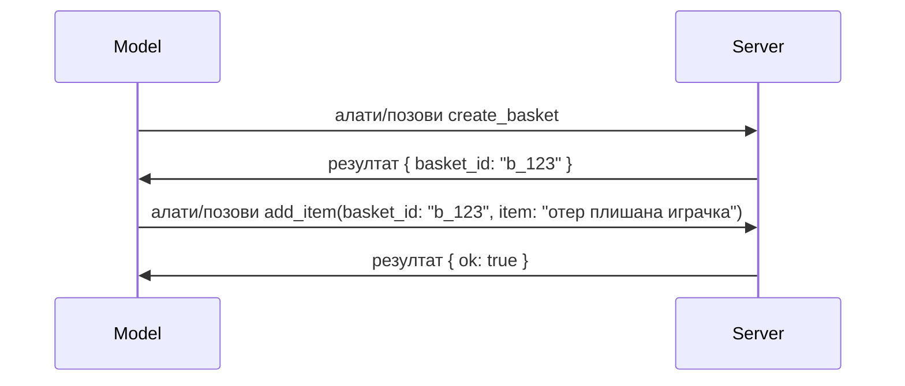

# Шта се променило у MCP: Спецификација 2026-07-28

> **Статус:** Коначна. MCP Спецификација `2026-07-28` објављена 28. јула 2026. године
> и представља тренутну ревизију протокола. Ова лекција описује коначну
> спецификацију. Неке примерке из наставног плана остају изричито верзиониране на
> `2025-11-25` јер њихови SDK-ови још нису усвојили нови без-државни API;
> те примере третирајте као смернице за задржавање компатибилности са застарелим верзијама.

## Преглед

`2026-07-28` је највећа ревизија MCP-а од његовог покретања. Шест
Предлога за побољшање спецификације (SEP-ова) уклања протоколски ниво сесија и
чини MCP без-државним на нивоу транспорта, екстензије постају првокласни,
верзионирани механизам, а неколико функција обрађених раније у овом наставном плану
(Roots, Sampling, Logging) је депрецирано по новој политици животног циклуса. Ова
лекција сумира шта се променило, зашто је то важно и шта то значи за код
написан према `2025-11-25`.

Извор: [The 2026-07-28 MCP Specification Release Candidate](https://blog.modelcontextprotocol.io/posts/2026-07-28-release-candidate/) (Model Context Protocol блог, Давид Сориа Парра и Ден Делимарски).

## Циљеви учења

До краја ове лекције, моћи ћете да:

- Објасните зашто MCP прелази на без-државно језгро протокола и који проблем решава за хоризонтално скалиране имплементације.
- Опишите како се замењује руковање `initialize`/`initialized` и заглавље `Mcp-Session-Id`.
- Идентификујте нова заглавља `Mcp-Method` и `Mcp-Name` као и метаподатке кеширања `ttlMs`/`cacheScope`.
- Препознајте оквир екстензија и две екстензије које долазе са овим издањем: MCP Apps и Tasks.
- Сумирајте појачавање ауторизације и депрецирање Динамичке регистрације клијената.

- Идентификујте које су основне функције (Roots, Sampling, Logging) сада депрециране и шта то практично значи.
- Објасните промену пуног JSON Schema 2020-12 за алате `inputSchema`/`outputSchema`.

## Без-државни протокол

Главна промена: MCP постаје без-државан на нивоу протокола.

### Пре (2025-11-25): сесије вас везују за један сервер

Позивање алата преко Streamable HTTP почиње руковањем `initialize`. Сервер одговара заглављем `Mcp-Session-Id` које сваки наредни захтев мора да носи:

```http
POST /mcp HTTP/1.1
Mcp-Session-Id: 1868a90c-3a3f-4f5b
Content-Type: application/json

{"jsonrpc":"2.0","id":2,"method":"tools/call",
 "params":{"name":"search","arguments":{"q":"otters"}}}
```

Пошто је сесија везана за серверску инстанцу која ју је издала, хоризонтално скалиране имплементације захтевају **лепљиво рутирање** на балансеру оптерећења и **заједничку меморију сесија** између инстанци.

### После (2026-07-28): сваки захтев је самосталан

```http
POST /mcp HTTP/1.1
MCP-Protocol-Version: 2026-07-28
Mcp-Method: tools/call
Mcp-Name: search
Content-Type: application/json

{"jsonrpc":"2.0","id":1,"method":"tools/call",
 "params":{"name":"search","arguments":{"q":"otters"},
           "_meta":{"io.modelcontextprotocol/protocolVersion":"2026-07-28",
                    "io.modelcontextprotocol/clientInfo":{"name":"my-app","version":"1.0"},
                    "io.modelcontextprotocol/clientCapabilities":{}}}}
```

Било која серверска инстанца може обрадити овај захтев. Кључне промене:

- **Руковање `initialize`/`initialized` је уклоњено** ([SEP-2575](https://github.com/modelcontextprotocol/modelcontextprotocol/pull/2575)). Верзија протокола, информације о клијенту и могућности клијента прелазе у `_meta` у сваком захтеву. Нова метода `server/discover` омогућава клијенту да унапред дохвати капацитете сервера када му затребају.
- **Заглавље `Mcp-Session-Id` и сесија на нивоу протокола су уклоњени** ([SEP-2567](https://github.com/modelcontextprotocol/modelcontextprotocol/pull/2567)). Лепљиво рутирање и заједничке меморије сесија више нису потребне на нивоу протокола.

### Без-државни протокол, државне апликације

Уклањање сесије на нивоу протокола не значи да ваш сервер не може бити државан. Рекомандовани образац је исти какав HTTP API-ји увек користе: из једног позива алата добити експлицитну референцу (нпр. `basket_id`, `browser_id`) и проћи ту референцу као обичан аргумент за наредне позиве.



Ово чини стање видљивим и разумним моделу уместо да га крије у метаподацима транспорта, и омогућава да било која серверска инстанца обради било који позив.

### Захтеви са сервера ка клијенту, реструктурирани

Без-државни протокол ипак треба начин да сервер тражи од клијента нешто за време позива (нпр. упит за дохватање информације):

- **Захтеви покренути од сервера могу бити издавани само док сервер активно обрађује захтев клијента** ([SEP-2260](https://github.com/modelcontextprotocol/modelcontextprotocol/pull/2260)) — раније препорука, сада обавеза. Корисник никада није изненада упитан.
- **Захтеви са више кругова (Multi Round-Trip Requests)** ([SEP-2322](https://github.com/modelcontextprotocol/modelcontextprotocol/pull/2322)) замењују држање отвореног SSE стрима. Уместо тога, сервер враћа `InputRequiredResult`:

  ```json
  {
    "resultType": "input_required",
    "inputRequests": {
      "confirm": {
        "type": "elicitation",
        "message": "Delete 3 files?",
        "schema": { "type": "boolean" }
      }
    },
    "requestState": "eyJzdGVwIjoxLCJmaWxlcyI6WyJhIiwiYiIsImMiXX0="
  }
  ```

  Клијент прикупља одговоре и поново издаје оригинални позив са `inputResponses` плус ехоираним `requestState`. Било која серверска инстанца може наставити покушај јер је све потребно у терету.

### Рутабилно, кеширајуће, пратљиво

Три мање промене олакшавају руковање без-државним саобраћајем:

- **Заглавља `Mcp-Method` и `Mcp-Name` су обавезна на Streamable HTTP захтевима** ([SEP-2243](https://github.com/modelcontextprotocol/modelcontextprotocol/pull/2243)), тако да балансери оптерећења, капије и лимиттери могу да рутују према операцији без прегледања JSON тела. Сервери одбијају захтеве где заглавља и тело нису у сагласности.
- **Резултати `tools/list` и читања ресурса сада садрже `ttlMs` и `cacheScope`** ([SEP-2549](https://github.com/modelcontextprotocol/modelcontextprotocol/pull/2549)), моделоване по HTTP `Cache-Control`. Клијенти знају колико резултат листе остаје свеже и да ли је безбедно делити га међу корисницима, без потребе за дуготрајним SSE стримом за праћење промена.
- **Пропагација W3C Trace Context у `_meta` је документаована** ([SEP-414](https://github.com/modelcontextprotocol/modelcontextprotocol/pull/414)), исправљајући имена кључева `traceparent`, `tracestate` и `baggage`, тако да распоређени трагови могу следити позив кроз клиентски SDK, MCP сервер и системе у наставку у [OpenTelemetry](https://opentelemetry.io/)-компатибилном позадинском систему.

## Екстензије постају првокласне

Екстензије су постојале неформално у `2025-11-25`. [SEP-2133](https://github.com/modelcontextprotocol/modelcontextprotocol/pull/2133) их формализује:

- Екстензије се идентификују обрнутим DNS идентификаторима.
- Неготијају се кроз мапу `extensions` у могућностима клијента и сервера.
- Налазе се у својим репозиторијумима `ext-*` са делегираним одржаваоцима и верзују се независно од језгра спецификације.
- Нови Extensions Track у SEP процесу им омогућава пут од експерименталног до званичног.

Ово издање доноси две званичне екстензије.

### MCP Apps: серверски рендеровани кориснички интерфејси

[MCP Apps](https://blog.modelcontextprotocol.io/posts/2026-01-26-mcp-apps/) ([SEP-1865](https://github.com/modelcontextprotocol/modelcontextprotocol/pull/1865)) омогућава серверама да испоручују интерактивне HTML интерфејсе које домаћини приказују у sandboxowanom iframe-у. Алати декларативно предају своје шаблоне UI унапред како би домаћини могли да их претходно учитају, кеширају и безбедносно ревидирају пре извршења. Основе сте већ обрадили у [Лекцији 15: MCP Apps](../03-GettingStarted/15-mcp-apps/README.md) — у оквиру система екстензија, MCP Apps је сада формално екстензија, а не експериментална основна функција.

### Tasks прелазе у екстензију

Tasks су испоручени као експериментална основна функција у `2025-11-25`. Редизајн у производној употреби је показао да им је место као екстензији: [Tasks екстензија](https://github.com/modelcontextprotocol/modelcontextprotocol/pull/2663) мења животни циклус око без-државног модела — сервер може одговорити на `tools/call` са референцом на задатак, а клијент га покреће даље помоћу `tasks/get`, `tasks/update` и `tasks/cancel`. Креирање задатка је серверски дириговано: клијент најављује екстензију, а сервер одлучује када позив треба да се изврши као задатак. `tasks/list` је у потпуности уклоњен јер не може безбедно да се ограничи без сесија.

> **Напомена о миграцији:** ако сте имплементирали експериментални Tasks API из `2025-11-25`, морате мигрирати на нови животни циклус екстензије — није уназад компатибилан.

## Појачана ауторизација

Неколико SEP-ова појачава
[спецификацију ауторизације](https://modelcontextprotocol.io/specification/2026-07-28/basic/authorization)
да боље одговара стварним OAuth 2.0 / OpenID Connect имплементацијама:

| SEP | Промена |
|---|---|
| [SEP-2468](https://github.com/modelcontextprotocol/modelcontextprotocol/pull/2468) | Клијенти морају валидирати параметар `iss` у ауторизационим одговорима према [RFC 9207](https://www.rfc-editor.org/rfc/rfc9207), чиме се ублажавају напади мешања (mix-up) у обрасцу MCP-а са једним клијентом и више сервера. Будуће верзије ће захтевати одбацивање одговора без `iss`. |
| [SEP-837](https://github.com/modelcontextprotocol/modelcontextprotocol/pull/837) | Клијенти за компатибилност Динамичке регистрације користе `application_type` OpenID Connect-а, избегавајући нетачне подразумеване вредности `"web"` за десктоп и CLI клијенте. |
| [SEP-2352](https://github.com/modelcontextprotocol/modelcontextprotocol/pull/2352) | Регистрови креденцијали за компатибилност су везани за издавача сервера ауторизације (`issuer`); клијенти се поново региструју ако се ресурс мигрира. |
| [SEP-2207](https://github.com/modelcontextprotocol/modelcontextprotocol/pull/2207) | Документује како захтевати освежавајуће токене од OpenID Connect-style сервера ауторизације. |
| [SEP-2350](https://github.com/modelcontextprotocol/modelcontextprotocol/pull/2350) | Појашњава акумулацију опсега током step-up ауторизације. |
| [SEP-2351](https://github.com/modelcontextprotocol/modelcontextprotocol/pull/2351) | Појашњава суфикс `.well-known` откривања. |

Ако градите сервер ауторизације за MCP, обезбедите `iss` у
ауторизационим одговорима и пратите коначну спецификацију ауторизације. Погледајте
[02-Security](../02-Security/README.md) за смернице имплементације.

Динамичка регистрација клијената остаје доступна ради компатибилности али је и
депрецирана у `2026-07-28`. Нове имплементације треба да користе Client ID Metadata
документе.

## Депрециране функције

По новом
[политици животног циклуса функција](https://github.com/modelcontextprotocol/modelcontextprotocol/pull/2577),
Roots, Sampling, Logging и Динамичка регистрација клијената су **Депрецирани**:

| Функција | Препоручена замена |
|---|---|
| Roots | Параметри алата, URI-јеви ресурса или конфигурација сервера |
| Sampling | Директна интеграција са LLM API-јевима |
| Logging | `stderr` за stdio транспорте; OpenTelemetry за структурисано посматрање |
| Dynamic Client Registration | Client ID Metadata документи |

Ове функције остају у `2026-07-28` ради компатибилности. Кандидат су за
уклањање у првој ревизији спецификације објављеној на или након 28. јула 2027;
стварно уклањање може се десити касније. Нове имплементације треба да користе горе
наведене образце замене.

## Пуна JSON Schema 2020-12 за алате

Шеме `inputSchema` и `outputSchema` алата су подигнуте на пуну [JSON Schema 2020-12](https://json-schema.org/draft/2020-12) ([SEP-2106](https://github.com/modelcontextprotocol/modelcontextprotocol/pull/2106)):

- Улазне шеме задржавају ограничење коренског `type: "object"`, али сада дозвољавају композицију (`oneOf`, `anyOf`, `allOf`), услове и референце (`$ref`, `$defs`).
- Излазне шеме су неограничене, а `structuredContent` сада може бити било која JSON вредност, не само објекат.
- Имплементације не смеју аутоматски дереферирати спољне `$ref` URIs и треба да ограничавају дубину шеме и време валидације (разматрање заштите од отказа услуге ако верификујете шеме на страни сервера).

Посебно, код грешке за недостајући ресурс се мења са MCP-специфичног `-32002` на JSON-RPC стандард `-32602` (Invalid Params) ([SEP-2164](https://github.com/modelcontextprotocol/modelcontextprotocol/pull/2164)). Ако ваш клијент изрично гледа `-32002`, мораћете то ажурирати.

## Како протокол напредује од одавде

Ово издање садржи прекидне промене које MCP одржаваоци не сматрају стандардом у будућности. Три управљачка SEP-а имају за циљ да спрече поновљање:

- **Политика животног циклуса функција** даје свакој функцији пут Активно → Депрецирано → Уклоњено са најмање дванаест месеци између депрецације и најранијег могућег уклањања.
- **Оквир екстензија** омогућава да нове могућности буду испоручене као опционе екстензије и стабилизују се тамо пре него што икада дођу у језгро спецификације.
- SEP Стандарда више не може достићи коначни статус без да сценарио који му одговара буде укључен у [скуп за усаглашеност](https://github.com/modelcontextprotocol/conformance) ([SEP-2484](https://github.com/modelcontextprotocol/modelcontextprotocol/pull/2484)) — исти скуп података према којем систем нивоа SDK-ја оцјењује званичне SDK-ове.

## Временска линија издања и валидација

- кандидат за издање је закључан 21. маја 2026.
- коначна спецификација је објављена 28. јула 2026.

- Подршка за SDK може заостајати за спецификацијом. Проверите
  [документацију SDK-а](https://modelcontextprotocol.io/docs/sdk) и белешке о издању SDK-а
  пре миграције примера.
- Пратите финалне измене у
  [спецификацији од 2026-07-28](https://modelcontextprotocol.io/specification/2026-07-28/)
  и њеном
  [прегледу измена](https://modelcontextprotocol.io/specification/2026-07-28/changelog).

## Шта ово значи за овај курикулум

Курикулум прелази са примера из `2025-11-25` на тренутну
спецификацију `2026-07-28`. Конкретно:

- **Сесије и `initialize` руковање** у примерима који експлицитно циљају
  `2025-11-25` су застарело понашање. Протокол `2026-07-28` их замењује
  горе наведеним моделом бездржавних захтева.
- **Sampling и Roots** остају доступни ради компатибилности, али су застарели.
  Нови дизајни треба да користе наведенe замене изнад.
- **Експериментална функција Tasks**, ако сте је користили, мораће бити мигрирана на нови животни циклус Tasks екстензије.
- **MCP апликације** ([Лекција 15](../03-GettingStarted/15-mcp-apps/README.md)) у пракси нису погођене; једноставно прелазе под формални оквир екстензија.

## Допунски ресурси

- [MCP спецификација 2026-07-28](https://modelcontextprotocol.io/specification/2026-07-28/)
- [Преглед измена за 2026-07-28](https://modelcontextprotocol.io/specification/2026-07-28/changelog)
- [MCP спецификација од 2026-07-28 као кандидат за издање (историјски блог пост)](https://blog.modelcontextprotocol.io/posts/2026-07-28-release-candidate/)
- [Будућност MCP транспорта](https://blog.modelcontextprotocol.io/posts/2025-12-19-mcp-transport-future/)
- [SEP смернице](https://modelcontextprotocol.io/community/sep-guidelines)
- [MCP SDK систем нивоа](https://modelcontextprotocol.io/docs/sdk)

## Следећи кораци

Вратите се на [Основне концепте](./README.md) или наставите са
[Безбедношћу](../02-Security/README.md) да бисте применили тренутна упутства `2026-07-28`.

---

<!-- CO-OP TRANSLATOR DISCLAIMER START -->
**Изјава о одрицању одговорности**:
Овај документ је преведен коришћењем услуге за аутоматски превод [Co-op Translator](https://github.com/Azure/co-op-translator). Иако тежимо тачности, имајте у виду да аутоматски преводи могу садржати грешке или нетачности. Оригинални документ на његовом изворном језику треба сматрати ауторитативним извором. За критичне информације препоручује се професионални људски превод. Нисмо одговорни за било каква неспоразума или погрешна тумачења која произилазе из коришћења овог превода.
<!-- CO-OP TRANSLATOR DISCLAIMER END -->