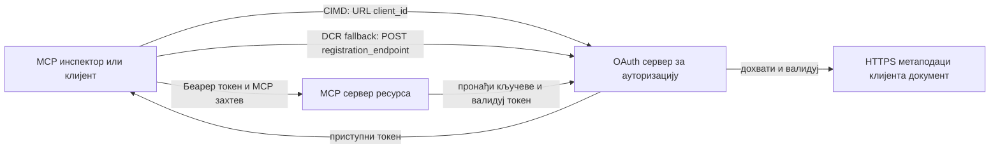

# Пример за CIMD и DCR аутентификацију

Овај TypeScript пример пореди два начина на која OAuth клијент може добити идентитет
пре приступа заштићеном MCP серверу:

- **Client ID Metadata Documents (CIMD)** користе стабилан HTTPS URL као
  `client_id`. Ово је препоручени механизам за клијенте и ауторизационе
  сервере који немају претходни однос.
- **Dynamic Client Registration (DCR)** тражи од ауторизационог сервера да генерише
  нејасан client ID у време извршавања. MCP `2026-07-28` задржава DCR само ради
  назадне компатибилности.

Пример користи стабилан MCP TypeScript SDK v2 и бездржавни
MCP `2026-07-28` модел захтева. Ради са спољним OAuth 2.1/OpenID
Connect ауторизационим сервером као што је Auth0. MCP сервер је сервер ресурса:
он верификује приступне токене али не аутентификује кориснике нити издаје
токене.

## Циљеви учења

Завршетком овог примера моћи ћете да:

- Објасните зашто је CIMD препоручен у односу на DCR за нове MCP клијенте.
- Објавите важећи CIMD документ за јавног нативног клијента.
- Конфигуришете MCP сервер ресурса за OAuth откривање и JWT валидацију.
- Вежбате CIMD и DCR са истим MCP сервером и ауторизационим сервером.
- Примeните OAuth опсег унутар MCP алата.
- Идентификујете која одговорност припада клијенту, серверу ресурса и
  ауторизационом серверу.

## Архитектура



Ауторизациони сервер бира и валидаје механизам регистрације.
MCP сервер види само резултујући верификовани `client_id` тврдњу. HTTPS URL
са путем идентификује CIMD. Нејасан ID није довољан да докаже DCR јер
претходно регистровани клијент такође може користити нејасан ID; опциони
`DCR_CLIENT_ID_PREFIX` параметар даје демонстрациони подсетник специфичан за провајдера.

## Приоритет регистрације

MCP клијенти који подржавају сваки механизам треба да користе овај редослед:

1. Користите претходно регистроване клијент информације када су већ доступне.
2. Користите CIMD када ауторизациони сервер оглашава
   `client_id_metadata_document_supported: true`.
3. Користите DCR само као резерву када сервер оглашава
   `registration_endpoint`.
4. Питајте корисника за претходно регистроване клијент информације ако ништа од наведеног није
   доступно.

## Структура пројекта

```text
src/
  config.ts          Environment validation
  dcr.ts             DCR compatibility request
  mcp.ts             MCP tools and scope checks
  oauth.ts           Authorization metadata and JWT verification
  register-dcr.ts    DCR command-line helper
  registration.ts    CIMD document and mechanism classification
  server.ts          Express, OAuth discovery, and MCP endpoint
test/
  dcr.test.ts
  oauth.test.ts
  registration.test.ts
  server.test.ts
```

## Захтеви

- Node.js 20.6 или новији. Скрипте користе `--env-file` и `--import`.
- OAuth 2.1/OpenID Connect ауторизациони сервер који подржава:
  - Authorization code flow са S256 PKCE.
  - OAuth Protected Resource Metadata и Resource Indicators.
  - JWT приступне токене и JWKS крајњу тачку.
  - CIMD, као и DCR ако желите упоредити стару резерву.
- MCP Inspector или други MCP `2026-07-28` клијент.
- Јавни HTTPS URL за CIMD документ. Развојни тунел је погодан
  за лабораторију; у продукцији користите стабилан домен.

## Инсталација и тестирање

```bash
npm install
npm run build
npm test
```

Дванаест тестова користе локалне кључеве и мок HTTP крајње тачке. Они не захтевају
налог на ауторизационом серверу. Проверавају:

- Облик CIMD документа и ограничења URL-а.
- Искрену класификацију URL и нејасних client ID.
- Обраду DCR захтева и одговора.
- Одбијање несигурних DCR крајњих тачака које нису loopback.
- Верификацију JWT потписа, издаваоца, публике, истека, client ID и опсега.
- Позив унутар процеса MCP `2026-07-28` ка `registration-info`.

## Конфигуришите ауторизациони сервер

Тачна имена контроле варирају код провајдера. Конфигуришите ове могућности:

1. Креирајте API или сервер ресурса чији идентификатор тачно одговара вашем MCP
   URL-у, укључујући `/mcp`, на пример `http://127.0.0.1:3001/mcp`.
2. Користите RS256 приступне токене и укључите `client_id` или `azp` тврдњу.
3. Додајте дозволу или опсег `tool:greet`.
4. Омогућите authorization code flow са S256 PKCE за јавне нативне клијенте.
5. Омогућите Client ID Metadata Documents.
6. За потребе поређења, омогућите Dynamic Client Registration.
7. Осигурајте да ауторизациони сервер оглашава метаподатке:
   - `issuer`
   - `authorization_endpoint`
   - `token_endpoint`
   - `jwks_uri`
   - `client_id_metadata_document_supported: true`
   - `registration_endpoint` када је DCR омогућен

### Пример за Auth0

За Auth0, омогућите Client ID Metadata Document Registration, OIDC Dynamic
Application Registration, и компатибилност Resource Parameter. Креирајте API
чији је идентификатор тачан MCP URL и додајте дозволу `tool:greet`.
Омогућите тест кориснику и клијентима трећих страна да затраже ту дозволу.

Контролне табле провајдера и доступност функција се временом мењају. Проверите
документацију провајдера пре коришћења ових подешавања ван ове лабораторије.

## Конфигурација примера

Креирајте `.env` из примера:

```powershell
Copy-Item .env.example .env
```

У баш компатибилним љуштурама:

```bash
cp .env.example .env
```

Поставите ове вредности:

```dotenv
MCP_SERVER_URL=http://127.0.0.1:3001/mcp
AUTHORIZATION_SERVER_ISSUER=https://your-tenant.example.com/
AUTHORIZATION_SERVER_METADATA_URL=https://your-tenant.example.com/.well-known/openid-configuration
CLIENT_METADATA_URL=https://your-public-host.example.com/client-metadata.json
OAUTH_REDIRECT_URIS=http://127.0.0.1:6274/oauth/callback
DCR_CLIENT_ID_PREFIX=tpc_
```

Важни детаљи:

- `AUTHORIZATION_SERVER_ISSUER` мора тачно одговарати `issuer` у откривеним
  метаподацима ауторизационог сервера, укључујући било који завршни коси црту.
- `MCP_SERVER_URL` мора одговарати публици приступног токена.
- `CLIENT_METADATA_URL` мора користити HTTPS, садржати непразан пут и бити
  јавни URL који служи метаподатке руту. Квери низови и фрагменти се
  одбијају тако да рута и `client_id` остану идентични.
- `OAUTH_REDIRECT_URIS` је листа одобрених, одвојена зарезом. Подразумевано је MCP
  Inspector loopback callback.
- `DCR_CLIENT_ID_PREFIX` је опциони и специфичан за провајдера. Оставите га празним ако
  ваш провајдер нема поуздан префикс за DCR.

## Објавите CIMD документ

Покрените тунел који прослеђује свој јавни HTTPS извор на `127.0.0.1:3001`.
Поставите `CLIENT_METADATA_URL` на тај извор плус `/client-metadata.json`, затим покрените:

```bash
npm run build
npm start
```

Проверите оба документа за откривање:

```bash
curl http://127.0.0.1:3001/health
curl http://127.0.0.1:3001/client-metadata.json
curl http://127.0.0.1:3001/.well-known/oauth-protected-resource/mcp
```

`client_id` који враћа јавни HTTPS метаподаци URL мора бити бајт-по-бајт
идентичан том URL-у. Ауторизациони сервер мора верификовати документ и
његов redirect URI пре издавања токена.

> [!NOTE]
> Пример хостује client документ и MCP сервер ресурса у једном процесу
> да би лабораторија била мала. У продукцији, MCP клијент поседује и хостује свој CIMD
> документ независно од сервера ресурса.

## Поређење CIMD и DCR

Покрените MCP Inspector:

```bash
npx @modelcontextprotocol/inspector
```

Користите Streamable HTTP и повежите се на `http://127.0.0.1:3001/mcp`.

### CIMD (Препоручено)

1. Унесите јавни `CLIENT_METADATA_URL` као OAuth Client ID.
2. Затражите `tool:greet` као и било који identity scope који ваш провајдер захтева.
3. Завршите пријаву и давање сагласности.
4. Позовите `registration-info`. Он пријављује `mechanism: "cimd"`.
5. Позовите `greet` да проверите примену опсега.

### DCR (Резервна компатибилност)

1. Очистите сачувано OAuth стање у Inspector-у.
2. Оставите празно OAuth Client ID да би Inspector могао користити оглашену
   `registration_endpoint`.
3. Завршите пријаву и давање сагласности.
4. Позовите `registration-info`.
5. Ако `DCR_CLIENT_ID_PREFIX` одговара провајдерским генерисаним ID-јевима, алат
   пријављује `mechanism: "dcr"`; у супротном исправно пријављује
   `opaque-client-id`.

Можете такође директно демонстрирати захтев за регистрацију:

```bash
npm run build
npm run register:dcr
```

Помоћни програм исписује враћени client ID али никада не исписује client secret.
Са било којим враћеним тајним подацима поступајте као са осетљивим и чувате их у одговарајућем складишту тајних података.

## Алатке

| Алатка | Захтевани опсег | Сврха |
| --- | --- | --- |
| `registration-info` | Верификовани клијент | Прикажи тип client ID |
| `greet` | `tool:greet` | Демонстрирај ауторизацију по алатци |

## Безбедносне напомене

- Верификујте JWT потписе преко JWKS крајње тачке ауторизационог сервера.
- Захтевајте тачно поравнање издаваоца и публике.
- Захтевајте тврдње о истеку и client ID.
- Никада не прихватајте токен издат за други ресурс.
- Никада не прослеђујте MCP токен ка спољном API-ју.
- Држите DCR акредитиве везане за издаваоца који их је креирао.
- Верификујте CIMD redirect URI са тачним поклапањем.
- Примените SSRF контроле када ауторизациони сервер преузима CIMD URL-ове.
- Користите HTTPS за ауторизационе и метаподаће крајње тачке ван loopback
  развојне средине.
- Не закључујте DCR на основу нејасног client ID осим ако провајдер не докуметује
  поуздану конвенцију идентификатора.

## Референце

- [MCP authorization specification](https://modelcontextprotocol.io/specification/2026-07-28/basic/authorization)
- [MCP client registration](https://modelcontextprotocol.io/specification/2026-07-28/basic/authorization/client-registration)
- [MCP security best practices](https://modelcontextprotocol.io/specification/2026-07-28/basic/security_best_practices)
- [MCP TypeScript SDK v2 authorization guide](https://ts.sdk.modelcontextprotocol.io/v2/serving/authorization)
- [OAuth Dynamic Client Registration (RFC 7591)](https://datatracker.ietf.org/doc/html/rfc7591)
- [OAuth Client ID Metadata Document draft](https://datatracker.ietf.org/doc/html/draft-ietf-oauth-client-id-metadata-document-00)

## Захвалност

Паралелни приступ учењу инспирисан је
[Sambego/auth0-xmcp-cimd](https://github.com/Sambego/auth0-xmcp-cimd). Овај
пример је оригинална, провајдер-неутрална имплементација израђена са званичним
MCP TypeScript SDK v2 за овај курс.

---

<!-- CO-OP TRANSLATOR DISCLAIMER START -->
**Изјава о одрицању одговорности**:
Овај документ је преведен коришћењем услуге за аутоматски превод [Co-op Translator](https://github.com/Azure/co-op-translator). Иако тежимо тачности, имајте у виду да аутоматски преводи могу садржати грешке или нетачности. Оригинални документ на његовом изворном језику треба сматрати ауторитативним извором. За критичне информације препоручује се професионални људски превод. Нисмо одговорни за било каква неспоразума или погрешна тумачења која произилазе из коришћења овог превода.
<!-- CO-OP TRANSLATOR DISCLAIMER END -->