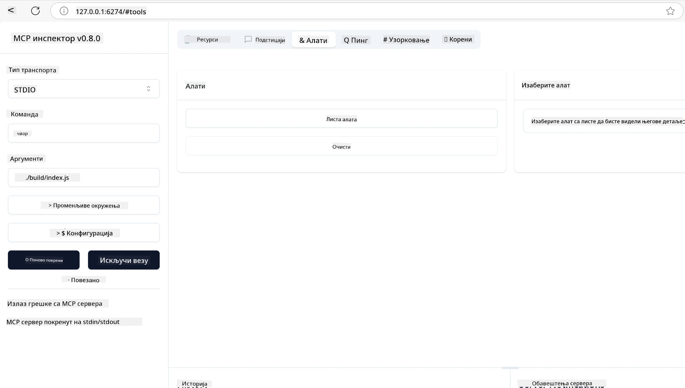
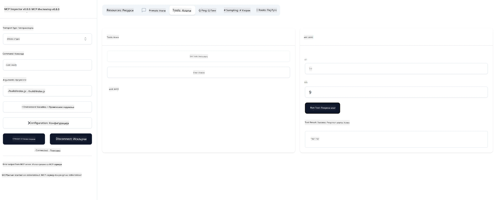

# Почетак са MCP

> [!NOTE]
> Пример Java HTTP у овој лекцији користи наслеђени HTTP+SSE транспорт и
> циља SDK компатибилан са MCP `2025-11-25`. За нове удаљене сервере, користите
> `2026-07-28` Streamable HTTP транспорт и проверите подршку у вашем SDK.

Добродошли у ваше прве кораке са Model Context Protocol (MCP)! Без обзира да ли сте нови у MCP или желите да продубите своје знање, овај водич ће вас провести кроз основни процес подешавања и развоја. Открићете како MCP омогућава беспрекорну интеграцију између AI модела и апликација, и научићете како брзо припремити своје окружење за креирање и тестирање решења покретаних MCP-ом.

> Кратко речено; Ако правите AI апликације, знате да можете додати алате и друге ресурсе свом LLM-у (велики модел језика), да би LLM био боље информисан. Међутим, ако те алате и ресурсе сместите на сервер, апликација и могућности сервера могу користити сви клијенти са или без LLM-а.

## Преглед

Ова лекција пружа практичне смернице о подешавању MCP окружења и креирању ваших првих MCP апликација. Научићете како да примените потребне алате и оквире, изградите основне MCP сервере, направите хост апликације и тестирате своје имплементације.

Model Context Protocol (MCP) је отворени протокол који стандардизује начин на који апликације пружају контекст LLM-овима. Замислите MCP као USB-C порт за AI апликације — омогућава стандардизован начин повезивања AI модела са различитим изворима података и алатима.

## Циљеви учења

До краја ове лекције моћи ћете да:

- Поставите развојна окружења за MCP у C#, Java, Python, TypeScript и Rust
- Изградите и имплементирате основне MCP сервере са прилагођеним функцијама (ресурси, упити и алати)
- Креирате хост апликације које се повезују са MCP серверима
- Тестирате и отклањате грешке у MCP имплементацијама

## Подешавање вашег MCP окружења

Пре него што почнете да радите са MCP-ом, важно је припремити развојно окружење и разумети основни ток рада. Овај одељак ће вас провести кроз почетне кораке подешавања како бисте осигурали безпрекоран почетак са MCP-ом.

### Предуслови

Пре него што зароните у развој MCP-а, уверите се да имате:

- **Развојно окружење**: За изабрани језик (C#, Java, Python, TypeScript, или Rust)
- **IDE/Уредник кода**: Visual Studio, Visual Studio Code, IntelliJ, Eclipse, PyCharm, или било који модерни уредник кода
- **Менаџери пакета**: NuGet, Maven/Gradle, pip, npm/yarn, или Cargo
- **API кључеви**: За све AI сервисе које планирате да користите у својим хост апликацијама

## Основна структура MCP сервера

MCP сервер обично садржи:

- **Конфигурација сервера**: Подешавање порта, аутентификације и других опција
- **Ресурси**: Податке и контекст доступан LLM-овима
- **Алате**: Функционалности које модели могу да позову
- **Упите**: Шаблоне за генерисање или структурирање текста

Ево поједностављеног примера у TypeScript-у:

```typescript
import { McpServer, ResourceTemplate } from "@modelcontextprotocol/sdk/server/mcp.js";
import { StdioServerTransport } from "@modelcontextprotocol/sdk/server/stdio.js";
import { z } from "zod";

// Креирај MCP сервер
const server = new McpServer({
  name: "Demo",
  version: "1.0.0"
});

// Додај алат за сабирање
server.tool("add",
  { a: z.number(), b: z.number() },
  async ({ a, b }) => ({
    content: [{ type: "text", text: String(a + b) }]
  })
);

// Додај динамичан ресурс за поздрав
server.resource(
  "file",
  // Параметар 'list' контролише како ресурс приказује расположиве датотеке. Подешавање на undefined онемогућава приказ листе за овај ресурс.
  new ResourceTemplate("file://{path}", { list: undefined }),
  async (uri, { path }) => ({
    contents: [{
      uri: uri.href,
      text: `File, ${path}!`
    }]
  })
);

// Додај ресурс за датотеку који чита садржај датотеке
server.resource(
  "file",
  new ResourceTemplate("file://{path}", { list: undefined }),
  async (uri, { path }) => {
    let text;
    try {
      text = await fs.readFile(path, "utf8");
    } catch (err) {
      text = `Error reading file: ${err.message}`;
    }
    return {
      contents: [{
        uri: uri.href,
        text
      }]
    };
  }
);

server.prompt(
  "review-code",
  { code: z.string() },
  ({ code }) => ({
    messages: [{
      role: "user",
      content: {
        type: "text",
        text: `Please review this code:\n\n${code}`
      }
    }]
  })
);

// Почни примање порука на stdin и слање порука на stdout
const transport = new StdioServerTransport();
await server.connect(transport);
```

У претходном коду смо:

- Увезли потребне класе из MCP TypeScript SDK-а.
- Креирали и конфигурисали нову инстанцу MCP сервера.
- Регистровали прилагођени алат (`calculator`) са хендлер функцијом.
- Покренули сервер да слуша долазне MCP захтеве.

## Тестирање и отклањање грешака

Пре него што почнете тестирање вашег MCP сервера, важно је разумети доступне алате и најбоље праксе за отклањање грешака. Ефикасно тестирање осигурава да сервер ради како се очекује и помаже вам да брзо идентификујете и решите проблеме. Следећи одељак представља препоручене приступе за валидацију ваше MCP имплементације.

MCP пружа алате који вам помажу да тестирате и отклањате грешке својих сервера:

- **Inspector алат**, ова графичка интерфејс вам омогућава да се повежете на свој сервер и тестирате алате, упите и ресурсе.
- **curl**, такође можете да се повежете на сервер помоћу командне линије уз алате као што је curl или других клијената који могу креирати и извршавати HTTP команде.

### Коришћење MCP Inspectora

[MCP Inspector](https://github.com/modelcontextprotocol/inspector) је визуелни алат за тестирање који вам помаже да:

1. **Откријете могућности сервера**: Аутоматски детектује доступне ресурсе, алате и упите
2. **Тестирате извршење алата**: Испробајте различите параметре и видите одговоре у реалном времену
3. **Прегледате метаподатке сервера**: Испитујте информације о серверу, шеме и конфигурације

```bash
# пример TypeScript-а, инсталација и покретање MCP инспектора
npx @modelcontextprotocol/inspector node build/index.js
```

Када извршите горе наведене команде, MCP Inspector ће покренути локални веб интерфејс у вашем прегледачу. Можете очекивати да ћете видети контролну таблу која приказује ваше регистроване MCP сервере, њихове доступне алате, ресурсе и упите. Интерфејс вам дозвољава интерактивно тестирање извршења алата, испитивање метаподатака сервера и преглед одговора у реалном времену, омогућавајући лакшу верификацију и отклањање грешака у вашим MCP сервер имплементацијама.

Ево снимка екрана како то може изгледати:



## Чести проблеми приликом подешавања и решења

| Проблем | Могуће решење |
|-------|-------------------|
| Веза одбијена | Проверите да ли сервер ради и да је порт исправан |
| Грешке приликом извршења алата | Прегледајте проверу параметара и руковање грешкама |
| Неуспешна аутентификација | Потврдите API кључеве и дозволе |
| Грешке при валидацији шеме | Уверите се да параметри одговарају дефинисаној шеми |
| Сервер се не покреће | Проверите конфликте портова или недостајуће зависности |
| CORS грешке | Конфигуришите одговарајуће CORS заглавља за cross-origin захтеве |
| Проблеми са аутентификацијом | Потврдите ваљаност токена и дозволе |

## Локални развој

За локални развој и тестирање, можете покретати MCP сервере директно на вашем рачунару:

1. **Покрените серверски процес**: Покрените вашу MCP сервер апликацију
2. **Конфигуришите мрежу**: Уверите се да је сервер доступан на очекиваном порту
3. **Повежите клијенте**: Користите локалне URL адресе као што је `http://localhost:3000`

```bash
# Пример: Покретање TypeScript MCP сервера локално
npm run start
# Сервер ради на http://localhost:3000
```

## Изградња вашег првог MCP сервера

Прошли смо [Основне појмове](../../01-CoreConcepts/README.md) у претходној лекцији, сада је време да та знања применимо.

### Шта сервер може да ради

Пре него што почнемо да пишемо код, подсетимо се шта све сервер може да ради:

MCP сервер може на пример:

- Приступати локалним фајловима и базама података
- Повезивати се на удаљене API-је
- Извршавати прорачуне
- Интегрисати се са другим алатима и сервисима
- Обезбедити кориснички интерфејс за интеракцију

Одлично, сада када знамо шта све може, хајде да кренемо са кодирањем.

## Вежба: Креирање сервера

За креирање сервера потребно је да следите ове кораке:

- Инсталирајте MCP SDK.
- Креирајте пројекат и подесите структуру пројекта.
- Напишите код сервера.
- Тестирајте сервер.

### -1- Креирање пројекта

#### TypeScript

```sh
# Креирајте директоријум пројекта и иницијализујте npm пројекат
mkdir calculator-server
cd calculator-server
npm init -y
```

#### Python

```sh
# Креирајте директоријум пројекта
mkdir calculator-server
cd calculator-server
# Отворите фолдер у Visual Studio Code - Прескочите ако користите други IDE
code .
```

#### .NET

```sh
dotnet new console -n McpCalculatorServer
cd McpCalculatorServer
```

#### Java

За Java, направите Spring Boot пројекат:

```bash
curl https://start.spring.io/starter.zip \
  -d dependencies=web \
  -d javaVersion=21 \
  -d type=maven-project \
  -d groupId=com.example \
  -d artifactId=calculator-server \
  -d name=McpServer \
  -d packageName=com.microsoft.mcp.sample.server \
  -o calculator-server.zip
```

Распакујте zip фајл:

```bash
unzip calculator-server.zip -d calculator-server
cd calculator-server
# опционално уклонити неискоришћене тестове
rm -rf src/test/java
```

Додајте следећу потпуну конфигурацију у свој *pom.xml* фајл:

```xml
<?xml version="1.0" encoding="UTF-8"?>
<project xmlns="http://maven.apache.org/POM/4.0.0"
    xmlns:xsi="http://www.w3.org/2001/XMLSchema-instance"
    xsi:schemaLocation="http://maven.apache.org/POM/4.0.0 http://maven.apache.org/xsd/maven-4.0.0.xsd">
    <modelVersion>4.0.0</modelVersion>
    
    <!-- Spring Boot parent for dependency management -->
    <parent>
        <groupId>org.springframework.boot</groupId>
        <artifactId>spring-boot-starter-parent</artifactId>
        <version>3.5.0</version>
        <relativePath />
    </parent>

    <!-- Project coordinates -->
    <groupId>com.example</groupId>
    <artifactId>calculator-server</artifactId>
    <version>0.0.1-SNAPSHOT</version>
    <name>Calculator Server</name>
    <description>Basic calculator MCP service for beginners</description>

    <!-- Properties -->
    <properties>
        <java.version>21</java.version>
        <maven.compiler.source>21</maven.compiler.source>
        <maven.compiler.target>21</maven.compiler.target>
    </properties>

    <!-- Spring AI BOM for version management -->
    <dependencyManagement>
        <dependencies>
            <dependency>
                <groupId>org.springframework.ai</groupId>
                <artifactId>spring-ai-bom</artifactId>
                <version>1.0.0-SNAPSHOT</version>
                <type>pom</type>
                <scope>import</scope>
            </dependency>
        </dependencies>
    </dependencyManagement>

    <!-- Dependencies -->
    <dependencies>
        <dependency>
            <groupId>org.springframework.ai</groupId>
            <artifactId>spring-ai-starter-mcp-server-webflux</artifactId>
        </dependency>
        <dependency>
            <groupId>org.springframework.boot</groupId>
            <artifactId>spring-boot-starter-actuator</artifactId>
        </dependency>
        <dependency>
         <groupId>org.springframework.boot</groupId>
         <artifactId>spring-boot-starter-test</artifactId>
         <scope>test</scope>
      </dependency>
    </dependencies>

    <!-- Build configuration -->
    <build>
        <plugins>
            <plugin>
                <groupId>org.springframework.boot</groupId>
                <artifactId>spring-boot-maven-plugin</artifactId>
            </plugin>
            <plugin>
                <groupId>org.apache.maven.plugins</groupId>
                <artifactId>maven-compiler-plugin</artifactId>
                <configuration>
                    <release>21</release>
                </configuration>
            </plugin>
        </plugins>
    </build>

    <!-- Repositories for Spring AI snapshots -->
    <repositories>
        <repository>
            <id>spring-milestones</id>
            <name>Spring Milestones</name>
            <url>https://repo.spring.io/milestone</url>
            <snapshots>
                <enabled>false</enabled>
            </snapshots>
        </repository>
        <repository>
            <id>spring-snapshots</id>
            <name>Spring Snapshots</name>
            <url>https://repo.spring.io/snapshot</url>
            <releases>
                <enabled>false</enabled>
            </releases>
        </repository>
    </repositories>
</project>
```

#### Rust

```sh
mkdir calculator-server
cd calculator-server
cargo init
```

### -2- Додавање зависности

Сада када сте креирали пројекат, додаћемо зависности:

#### TypeScript

```sh
# Ако већ није инсталиран, инсталирајте TypeScript глобално
npm install typescript -g

# Инсталирајте MCP SDK и Zod за валидацију шеме
npm install @modelcontextprotocol/sdk zod
npm install -D @types/node typescript
```

#### Python

```sh
# Креирајте виртуелно окружење и инсталирајте зависности
python -m venv venv
venv\Scripts\activate
pip install "mcp[cli]"
```

#### Java

```bash
cd calculator-server
./mvnw clean install -DskipTests
```

#### Rust

```sh
cargo add rmcp --features server,transport-io
cargo add serde
cargo add tokio --features rt-multi-thread
```

### -3- Креирање пројектних фајлова

#### TypeScript

Отворите *package.json* фајл и замените садржај следећим како бисте осигурали да можете да саставите и покренете сервер:

```json
{
  "name": "calculator-server",
  "version": "1.0.0",
  "main": "index.js",
  "type": "module",
  "scripts": {
    "build": "tsc",
    "start": "npm run build && node ./build/index.js",
  },
  "keywords": [],
  "author": "",
  "license": "ISC",
  "description": "A simple calculator server using Model Context Protocol",
  "dependencies": {
    "@modelcontextprotocol/sdk": "^1.16.0",
    "zod": "^3.25.76"
  },
  "devDependencies": {
    "@types/node": "^24.0.14",
    "typescript": "^5.8.3"
  }
}
```

Направите *tsconfig.json* са следећим садржајем:

```json
{
  "compilerOptions": {
    "target": "ES2022",
    "module": "Node16",
    "moduleResolution": "Node16",
    "outDir": "./build",
    "rootDir": "./src",
    "strict": true,
    "esModuleInterop": true,
    "skipLibCheck": true,
    "forceConsistentCasingInFileNames": true
  },
  "include": ["src/**/*"],
  "exclude": ["node_modules"]
}
```

Креирајте директоријум за свој изворни код:

```sh
mkdir src
touch src/index.ts
```

#### Python

Креирајте фајл *server.py*

```sh
touch server.py
```

#### .NET

Инсталирајте потребне NuGet пакете:

```sh
dotnet add package ModelContextProtocol --prerelease
dotnet add package Microsoft.Extensions.Hosting
```

#### Java

За Java Spring Boot пројекте, структура пројекта ће бити аутоматски креирана.

#### Rust

За Rust, *src/main.rs* фајл се прави подразумевано када покренете `cargo init`. Отворите фајл и обришите подразумевани код.

### -4- Креирање серверског кода

#### TypeScript

Креирајте фајл *index.ts* и додајте следећи код:

```typescript
import { McpServer, ResourceTemplate } from "@modelcontextprotocol/sdk/server/mcp.js";
import { StdioServerTransport } from "@modelcontextprotocol/sdk/server/stdio.js";
import { z } from "zod";
 
// Направите MCP сервер
const server = new McpServer({
  name: "Calculator MCP Server",
  version: "1.0.0"
});
```

Сада имате сервер, али он не ради много, хајде да то поправимо.

#### Python

```python
# server.py
from mcp.server.fastmcp import FastMCP

# Креирај MCP сервер
mcp = FastMCP("Demo")
```

#### .NET

```csharp
using Microsoft.Extensions.DependencyInjection;
using Microsoft.Extensions.Hosting;
using Microsoft.Extensions.Logging;
using ModelContextProtocol.Server;
using System.ComponentModel;

var builder = Host.CreateApplicationBuilder(args);
builder.Logging.AddConsole(consoleLogOptions =>
{
    // Configure all logs to go to stderr
    consoleLogOptions.LogToStandardErrorThreshold = LogLevel.Trace;
});

builder.Services
    .AddMcpServer()
    .WithStdioServerTransport()
    .WithToolsFromAssembly();
await builder.Build().RunAsync();

// add features
```

#### Java

За Java, креирајте основне компоненте сервера. Прво, измените главну класу апликације:

*src/main/java/com/microsoft/mcp/sample/server/McpServerApplication.java*:

```java
package com.microsoft.mcp.sample.server;

import org.springframework.ai.tool.ToolCallbackProvider;
import org.springframework.ai.tool.method.MethodToolCallbackProvider;
import org.springframework.boot.SpringApplication;
import org.springframework.boot.autoconfigure.SpringBootApplication;
import org.springframework.context.annotation.Bean;
import com.microsoft.mcp.sample.server.service.CalculatorService;

@SpringBootApplication
public class McpServerApplication {

    public static void main(String[] args) {
        SpringApplication.run(McpServerApplication.class, args);
    }
    
    @Bean
    public ToolCallbackProvider calculatorTools(CalculatorService calculator) {
        return MethodToolCallbackProvider.builder().toolObjects(calculator).build();
    }
}
```

Креирајте сервис калкулатора *src/main/java/com/microsoft/mcp/sample/server/service/CalculatorService.java*:

```java
package com.microsoft.mcp.sample.server.service;

import org.springframework.ai.tool.annotation.Tool;
import org.springframework.stereotype.Service;

/**
 * Service for basic calculator operations.
 * This service provides simple calculator functionality through MCP.
 */
@Service
public class CalculatorService {

    /**
     * Add two numbers
     * @param a The first number
     * @param b The second number
     * @return The sum of the two numbers
     */
    @Tool(description = "Add two numbers together")
    public String add(double a, double b) {
        double result = a + b;
        return formatResult(a, "+", b, result);
    }

    /**
     * Subtract one number from another
     * @param a The number to subtract from
     * @param b The number to subtract
     * @return The result of the subtraction
     */
    @Tool(description = "Subtract the second number from the first number")
    public String subtract(double a, double b) {
        double result = a - b;
        return formatResult(a, "-", b, result);
    }

    /**
     * Multiply two numbers
     * @param a The first number
     * @param b The second number
     * @return The product of the two numbers
     */
    @Tool(description = "Multiply two numbers together")
    public String multiply(double a, double b) {
        double result = a * b;
        return formatResult(a, "*", b, result);
    }

    /**
     * Divide one number by another
     * @param a The numerator
     * @param b The denominator
     * @return The result of the division
     */
    @Tool(description = "Divide the first number by the second number")
    public String divide(double a, double b) {
        if (b == 0) {
            return "Error: Cannot divide by zero";
        }
        double result = a / b;
        return formatResult(a, "/", b, result);
    }

    /**
     * Calculate the power of a number
     * @param base The base number
     * @param exponent The exponent
     * @return The result of raising the base to the exponent
     */
    @Tool(description = "Calculate the power of a number (base raised to an exponent)")
    public String power(double base, double exponent) {
        double result = Math.pow(base, exponent);
        return formatResult(base, "^", exponent, result);
    }

    /**
     * Calculate the square root of a number
     * @param number The number to find the square root of
     * @return The square root of the number
     */
    @Tool(description = "Calculate the square root of a number")
    public String squareRoot(double number) {
        if (number < 0) {
            return "Error: Cannot calculate square root of a negative number";
        }
        double result = Math.sqrt(number);
        return String.format("√%.2f = %.2f", number, result);
    }

    /**
     * Calculate the modulus (remainder) of division
     * @param a The dividend
     * @param b The divisor
     * @return The remainder of the division
     */
    @Tool(description = "Calculate the remainder when one number is divided by another")
    public String modulus(double a, double b) {
        if (b == 0) {
            return "Error: Cannot divide by zero";
        }
        double result = a % b;
        return formatResult(a, "%", b, result);
    }

    /**
     * Calculate the absolute value of a number
     * @param number The number to find the absolute value of
     * @return The absolute value of the number
     */
    @Tool(description = "Calculate the absolute value of a number")
    public String absolute(double number) {
        double result = Math.abs(number);
        return String.format("|%.2f| = %.2f", number, result);
    }

    /**
     * Get help about available calculator operations
     * @return Information about available operations
     */
    @Tool(description = "Get help about available calculator operations")
    public String help() {
        return "Basic Calculator MCP Service\n\n" +
               "Available operations:\n" +
               "1. add(a, b) - Adds two numbers\n" +
               "2. subtract(a, b) - Subtracts the second number from the first\n" +
               "3. multiply(a, b) - Multiplies two numbers\n" +
               "4. divide(a, b) - Divides the first number by the second\n" +
               "5. power(base, exponent) - Raises a number to a power\n" +
               "6. squareRoot(number) - Calculates the square root\n" + 
               "7. modulus(a, b) - Calculates the remainder of division\n" +
               "8. absolute(number) - Calculates the absolute value\n\n" +
               "Example usage: add(5, 3) will return 5 + 3 = 8";
    }

    /**
     * Format the result of a calculation
     */
    private String formatResult(double a, String operator, double b, double result) {
        return String.format("%.2f %s %.2f = %.2f", a, operator, b, result);
    }
}
```

**Опционе компоненте за сервис спреман за продукцију:**

Креирајте почетну конфигурацију *src/main/java/com/microsoft/mcp/sample/server/config/StartupConfig.java*:

```java
package com.microsoft.mcp.sample.server.config;

import org.springframework.boot.CommandLineRunner;
import org.springframework.context.annotation.Bean;
import org.springframework.context.annotation.Configuration;

@Configuration
public class StartupConfig {
    
    @Bean
    public CommandLineRunner startupInfo() {
        return args -> {
            System.out.println("\n" + "=".repeat(60));
            System.out.println("Calculator MCP Server is starting...");
            System.out.println("SSE endpoint: http://localhost:8080/sse");
            System.out.println("Health check: http://localhost:8080/actuator/health");
            System.out.println("=".repeat(60) + "\n");
        };
    }
}
```

Креирајте контролер здравља *src/main/java/com/microsoft/mcp/sample/server/controller/HealthController.java*:

```java
package com.microsoft.mcp.sample.server.controller;

import org.springframework.http.ResponseEntity;
import org.springframework.web.bind.annotation.GetMapping;
import org.springframework.web.bind.annotation.RestController;
import java.time.LocalDateTime;
import java.util.HashMap;
import java.util.Map;

@RestController
public class HealthController {
    
    @GetMapping("/health")
    public ResponseEntity<Map<String, Object>> healthCheck() {
        Map<String, Object> response = new HashMap<>();
        response.put("status", "UP");
        response.put("timestamp", LocalDateTime.now().toString());
        response.put("service", "Calculator MCP Server");
        return ResponseEntity.ok(response);
    }
}
```

Креирајте глобални обрађивач изузетака *src/main/java/com/microsoft/mcp/sample/server/exception/GlobalExceptionHandler.java*:

```java
package com.microsoft.mcp.sample.server.exception;

import org.springframework.http.HttpStatus;
import org.springframework.http.ResponseEntity;
import org.springframework.web.bind.annotation.ExceptionHandler;
import org.springframework.web.bind.annotation.RestControllerAdvice;

@RestControllerAdvice
public class GlobalExceptionHandler {

    @ExceptionHandler(IllegalArgumentException.class)
    public ResponseEntity<ErrorResponse> handleIllegalArgumentException(IllegalArgumentException ex) {
        ErrorResponse error = new ErrorResponse(
            "Invalid_Input", 
            "Invalid input parameter: " + ex.getMessage());
        return new ResponseEntity<>(error, HttpStatus.BAD_REQUEST);
    }

    public static class ErrorResponse {
        private String code;
        private String message;

        public ErrorResponse(String code, String message) {
            this.code = code;
            this.message = message;
        }

        // Гетери
        public String getCode() { return code; }
        public String getMessage() { return message; }
    }
}
```

Креирајте прилагођени банер *src/main/resources/banner.txt*:

```text
_____      _            _       _             
 / ____|    | |          | |     | |            
| |     __ _| | ___ _   _| | __ _| |_ ___  _ __ 
| |    / _` | |/ __| | | | |/ _` | __/ _ \| '__|
| |___| (_| | | (__| |_| | | (_| | || (_) | |   
 \_____\__,_|_|\___|\__,_|_|\__,_|\__\___/|_|   
                                                
Calculator MCP Server v1.0
Spring Boot MCP Application
```

</details>

#### Rust

Додајте следећи код на врх *src/main.rs* фајла. Ово увози потребне библиотеке и модуле за ваш MCP сервер.

```rust
use rmcp::{
    handler::server::{router::tool::ToolRouter, tool::Parameters},
    model::{ServerCapabilities, ServerInfo},
    schemars, tool, tool_handler, tool_router,
    transport::stdio,
    ServerHandler, ServiceExt,
};
use std::error::Error;
```

Калкулатор сервер ће бити једноставан и моћи ће да сабира два броја. Креирајмо структуру која ће представљати захтев калкулатора.

```rust
#[derive(Debug, serde::Deserialize, schemars::JsonSchema)]
pub struct CalculatorRequest {
    pub a: f64,
    pub b: f64,
}
```

Затим, направите структуру која представља калкулатор сервер. Ова структура ће држати рутирач алата, који се користи за регистрацију алата.

```rust
#[derive(Debug, Clone)]
pub struct Calculator {
    tool_router: ToolRouter<Self>,
}
```

Сада можемо имплементирати `Calculator` структуру да направимо нову инстанцу сервера и имплементирамо хендлер сервера који пружа информације о серверу.

```rust
#[tool_router]
impl Calculator {
    pub fn new() -> Self {
        Self {
            tool_router: Self::tool_router(),
        }
    }
}

#[tool_handler]
impl ServerHandler for Calculator {
    fn get_info(&self) -> ServerInfo {
        ServerInfo {
            instructions: Some("A simple calculator tool".into()),
            capabilities: ServerCapabilities::builder().enable_tools().build(),
            ..Default::default()
        }
    }
}
```

На крају, треба да имплементирамо главну функцију која покреће сервер. Ова функција ће направити инстанцу `Calculator` структуре и служити га преко стандардног улаз/излаз.

```rust
#[tokio::main]
async fn main() -> Result<(), Box<dyn Error>> {
    let service = Calculator::new().serve(stdio()).await?;
    service.waiting().await?;
    Ok(())
}
```

Сервер је сада подешен да пружа основне информације о самом себи. Следеће ћемо додати алат за извршавање сабирања.

### -5- Додавање алата и ресурса

Додајте алат и ресурс додавањем следећег кода:

#### TypeScript

```typescript
server.tool(
  "add",
  { a: z.number(), b: z.number() },
  async ({ a, b }) => ({
    content: [{ type: "text", text: String(a + b) }]
  })
);

server.resource(
  "greeting",
  new ResourceTemplate("greeting://{name}", { list: undefined }),
  async (uri, { name }) => ({
    contents: [{
      uri: uri.href,
      text: `Hello, ${name}!`
    }]
  })
);
```

Ваш алат прихвата параметре `a` и `b` и извршава функцију која производи одговор у облику:

```typescript
{
  contents: [{
    type: "text", content: "some content"
  }]
}
```

Ваш ресурс се приступа преко стринга "greeting" и прихвата параметар `name` и производи сличан одговор као алат:

```typescript
{
  uri: "<href>",
  text: "a text"
}
```

#### Python

```python
# Додај алат за сабирање
@mcp.tool()
def add(a: int, b: int) -> int:
    """Add two numbers"""
    return a + b


# Додај динамички ресурс за поздрављање
@mcp.resource("greeting://{name}")
def get_greeting(name: str) -> str:
    """Get a personalized greeting"""
    return f"Hello, {name}!"
```

У претходном коду смо:

- Дефинисали алат `add` који узима параметре `a` и `b`, оба целобројна.
- Креирали ресурс назван `greeting` који узима параметар `name`.

#### .NET

Додајте ово у ваш Program.cs фајл:

```csharp
[McpServerToolType]
public static class CalculatorTool
{
    [McpServerTool, Description("Adds two numbers")]
    public static string Add(int a, int b) => $"Sum {a + b}";
}
```

#### Java

Алати су већ креирани у претходном кораку.

#### Rust

Додајте нови алат унутар `impl Calculator` блока:

```rust
#[tool(description = "Adds a and b")]
async fn add(
    &self,
    Parameters(CalculatorRequest { a, b }): Parameters<CalculatorRequest>,
) -> String {
    (a + b).to_string()
}
```

### -6- Коначни код

Додајмо последњи потребни код да сервер може да почне са радом:

#### TypeScript

```typescript
// Почните са примањем порука на stdin и слањем порука на stdout
const transport = new StdioServerTransport();
await server.connect(transport);
```

Ево целог кода:

```typescript
// index.ts
import { McpServer, ResourceTemplate } from "@modelcontextprotocol/sdk/server/mcp.js";
import { StdioServerTransport } from "@modelcontextprotocol/sdk/server/stdio.js";
import { z } from "zod";

// Креирај MCP сервер
const server = new McpServer({
  name: "Calculator MCP Server",
  version: "1.0.0"
});

// Додај алат за сабирање
server.tool(
  "add",
  { a: z.number(), b: z.number() },
  async ({ a, b }) => ({
    content: [{ type: "text", text: String(a + b) }]
  })
);

// Додај динамички ресурс поздрављања
server.resource(
  "greeting",
  new ResourceTemplate("greeting://{name}", { list: undefined }),
  async (uri, { name }) => ({
    contents: [{
      uri: uri.href,
      text: `Hello, ${name}!`
    }]
  })
);

// Почни да примаш поруке преко stdin и шаљеш поруке преко stdout
const transport = new StdioServerTransport();
server.connect(transport);
```

#### Python

```python
# server.py
from mcp.server.fastmcp import FastMCP

# Направите MCP сервер
mcp = FastMCP("Demo")


# Додајте алат за сабирање
@mcp.tool()
def add(a: int, b: int) -> int:
    """Add two numbers"""
    return a + b


# Додајте динамички ресурс за поздрав
@mcp.resource("greeting://{name}")
def get_greeting(name: str) -> str:
    """Get a personalized greeting"""
    return f"Hello, {name}!"

# Главни блок за извршавање - ово је потребно за покретање сервера
if __name__ == "__main__":
    mcp.run()
```

#### .NET

Креирајте Program.cs фајл са следећим садржајем:

```csharp
using Microsoft.Extensions.DependencyInjection;
using Microsoft.Extensions.Hosting;
using Microsoft.Extensions.Logging;
using ModelContextProtocol.Server;
using System.ComponentModel;

var builder = Host.CreateApplicationBuilder(args);
builder.Logging.AddConsole(consoleLogOptions =>
{
    // Configure all logs to go to stderr
    consoleLogOptions.LogToStandardErrorThreshold = LogLevel.Trace;
});

builder.Services
    .AddMcpServer()
    .WithStdioServerTransport()
    .WithToolsFromAssembly();
await builder.Build().RunAsync();

[McpServerToolType]
public static class CalculatorTool
{
    [McpServerTool, Description("Adds two numbers")]
    public static string Add(int a, int b) => $"Sum {a + b}";
}
```

#### Java

Ваша комплетна главна класа апликације треба да изгледа овако:

```java
// McpServerApplication.java
package com.microsoft.mcp.sample.server;

import org.springframework.ai.tool.ToolCallbackProvider;
import org.springframework.ai.tool.method.MethodToolCallbackProvider;
import org.springframework.boot.SpringApplication;
import org.springframework.boot.autoconfigure.SpringBootApplication;
import org.springframework.context.annotation.Bean;
import com.microsoft.mcp.sample.server.service.CalculatorService;

@SpringBootApplication
public class McpServerApplication {

    public static void main(String[] args) {
        SpringApplication.run(McpServerApplication.class, args);
    }
    
    @Bean
    public ToolCallbackProvider calculatorTools(CalculatorService calculator) {
        return MethodToolCallbackProvider.builder().toolObjects(calculator).build();
    }
}
```

#### Rust

Коначни код за Rust сервер треба да изгледа овако:

```rust
use rmcp::{
    ServerHandler, ServiceExt,
    handler::server::{router::tool::ToolRouter, tool::Parameters},
    model::{ServerCapabilities, ServerInfo},
    schemars, tool, tool_handler, tool_router,
    transport::stdio,
};
use std::error::Error;

#[derive(Debug, serde::Deserialize, schemars::JsonSchema)]
pub struct CalculatorRequest {
    pub a: f64,
    pub b: f64,
}

#[derive(Debug, Clone)]
pub struct Calculator {
    tool_router: ToolRouter<Self>,
}

#[tool_router]
impl Calculator {
    pub fn new() -> Self {
        Self {
            tool_router: Self::tool_router(),
        }
    }
    
    #[tool(description = "Adds a and b")]
    async fn add(
        &self,
        Parameters(CalculatorRequest { a, b }): Parameters<CalculatorRequest>,
    ) -> String {
        (a + b).to_string()
    }
}

#[tool_handler]
impl ServerHandler for Calculator {
    fn get_info(&self) -> ServerInfo {
        ServerInfo {
            instructions: Some("A simple calculator tool".into()),
            capabilities: ServerCapabilities::builder().enable_tools().build(),
            ..Default::default()
        }
    }
}

#[tokio::main]
async fn main() -> Result<(), Box<dyn Error>> {
    let service = Calculator::new().serve(stdio()).await?;
    service.waiting().await?;
    Ok(())
}
```

### -7- Тестирање сервера

Покрените сервер са следећом командом:

#### TypeScript

```sh
npm run build
```

#### Python

```sh
mcp run server.py
```

> За коришћење MCP Inspectora, користите `mcp dev server.py` који аутоматски покреће Inspector и обезбеђује потребан proxy session token. Ако користите `mcp run server.py`, мораћете ручно покренути Inspector и конфигурисати везу.

#### .NET

Уверите се да сте у директоријуму вашег пројекта:

```sh
cd McpCalculatorServer
dotnet run
```

#### Java

```bash
./mvnw clean install -DskipTests
java -jar target/calculator-server-0.0.1-SNAPSHOT.jar
```

#### Rust

Покрените следеће команде за форматирање и покретање сервера:

```sh
cargo fmt
cargo run
```

### -8- Покретање помоћу инспектора

Инспектор је одличан алат који може покренути ваш сервер и омогућити вам интеракцију са њим ради тестирања исправности. Хајде да га покренемо:

> [!NOTE]
> може изгледати другачије у пољу "command" јер садржи команду за покретање сервера са вашим специфичним runtime-ом/

#### TypeScript

```sh
npx @modelcontextprotocol/inspector node build/index.js
```

или га додајте у свој *package.json* овако: `"inspector": "npx @modelcontextprotocol/inspector node build/index.js"` и онда покрените `npm run inspector`

#### Python

Python пакује Node.js алат који се зове inspector. Могуће је позвати тај алат овако:

```sh
mcp dev server.py
```


Међутим, он не имплементира све методе које алат нуди, па се препоручује да директно покренете Node.js алат као у наставку:

```sh
npx @modelcontextprotocol/inspector mcp run server.py
```

Ако користите алат или IDE који вам омогућава конфигурисање команда и аргумената за покретање скрипти, 
будите сигурни да је у пољу `Command` постављено `python`, а у `Arguments` `server.py`. Ово осигурава да скрипта правилно ради.

#### .NET

Проверите да ли сте у директоријуму вашег пројекта:

```sh
cd McpCalculatorServer
npx @modelcontextprotocol/inspector dotnet run
```

#### Java

Уверите се да ваш сервер калкулатора ради
Затим покрените инспектор:

```cmd
npx @modelcontextprotocol/inspector
```

У веб интерфејсу инспектора:

1. Изаберите "SSE" као тип транспорта
2. Поставите URL на: `http://localhost:8080/sse`
3. Кликните на "Connect"


**Сада сте повезани са сервером**
**Секция за тестирање Java сервера је сада завршена**

Следећа секција се односи на интеракцију са сервером.

Требало би да видите следећи кориснички интерфејс:


1. Повежите се са сервером избором дугмета Connect
  Када се повежете са сервером, требало би да видите следеће:

  

1. Изаберите "Tools" и "listTools", требало би да се појави "Add", изаберите "Add" и унесите вредности параметара.

  Требало би да видите следећи одговор, тј. резултат из "add" алата:

  

Честитамо, успели сте да креирате и покренете свој први сервер!

#### Rust

Да бисте покренули Rust сервер уз MCP Inspector CLI, користите следећу команду:

```sh
npx @modelcontextprotocol/inspector cargo run --cli --method tools/call --tool-name add --tool-arg a=1 b=2
```

### Званични SDK-ови

MCP пружа званичне SDK-ове за више језика:

- [C# SDK](https://github.com/modelcontextprotocol/csharp-sdk) - Одржава се у сарадњи са Microsoft-ом
- [Java SDK](https://github.com/modelcontextprotocol/java-sdk) - Одржава се у сарадњи са Spring AI
- [TypeScript SDK](https://github.com/modelcontextprotocol/typescript-sdk) - Званична TypeScript имплементација
- [Python SDK](https://github.com/modelcontextprotocol/python-sdk) - Званична Python имплементација
- [Kotlin SDK](https://github.com/modelcontextprotocol/kotlin-sdk) - Званична Kotlin имплементација
- [Swift SDK](https://github.com/modelcontextprotocol/swift-sdk) - Одржава се у сарадњи са Loopwork AI
- [Rust SDK](https://github.com/modelcontextprotocol/rust-sdk) - Званична Rust имплементација

## Кључне поуке

- Постављање развојног окружења за MCP је једноставно са SDK-овима специфичним за језик
- Креирање MCP сервера укључује стварање и регистрацију алата са јасним шемама
- Тестирање и отклањање грешака је кључно за поуздане MCP имплементације

## Примери

- [Java Calculator](../samples/java/calculator/README.md)
- [.NET Calculator](../../../../03-GettingStarted/samples/csharp)
- [JavaScript Calculator](../samples/javascript/README.md)
- [TypeScript Calculator](../samples/typescript/README.md)
- [Python Calculator](../../../../03-GettingStarted/samples/python)
- [Rust Calculator](../../../../03-GettingStarted/samples/rust)

## Задатак

Направите једноставни MCP сервер са алатом по вашем избору:

1. Имплементирајте алат у језику по вашем избору (.NET, Java, Python, TypeScript или Rust).
2. Дефинишите улазне параметре и повратне вредности.
3. Покрените инспектор алат како бисте проверили да сервер ради како је предвиђено.
4. Тестирајте имплементацију са различитим улазима.

## Решење

[Решење](./solution/README.md)

## Додатни ресурси

- [Изградите агенте користећи Model Context Protocol на Azure](https://learn.microsoft.com/azure/developer/ai/intro-agents-mcp)
- [Удаљени MCP са Azure Container Apps (Node.js/TypeScript/JavaScript)](https://learn.microsoft.com/samples/azure-samples/mcp-container-ts/mcp-container-ts/)
- [.NET OpenAI MCP Agent](https://learn.microsoft.com/samples/azure-samples/openai-mcp-agent-dotnet/openai-mcp-agent-dotnet/)

## Шта следи

Следеће: [Почетак рада са MCP клијентима](../02-client/README.md)

---

<!-- CO-OP TRANSLATOR DISCLAIMER START -->
**Изјава о одрицању одговорности**:
Овај документ је преведен коришћењем услуге за аутоматски превод [Co-op Translator](https://github.com/Azure/co-op-translator). Иако тежимо тачности, имајте у виду да аутоматски преводи могу садржати грешке или нетачности. Оригинални документ на његовом изворном језику треба сматрати ауторитативним извором. За критичне информације препоручује се професионални људски превод. Нисмо одговорни за било каква неспоразума или погрешна тумачења која произилазе из коришћења овог превода.
<!-- CO-OP TRANSLATOR DISCLAIMER END -->