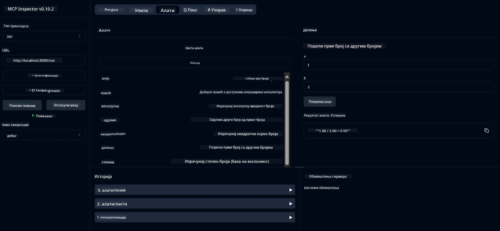

# Основни калкулатор MCP сервис

> [!NOTE]
> Ово Java решење користи наслеђени HTTP+SSE транспорт и циља SDK
> компатибилан са MCP `2025-11-25`. Остављено је због поклапања са кодом у курсу;
> нови рендутални сервери треба да користе `2026-07-28` Streamable HTTP подршку.

Овај сервис пружа основне операције калкулатора преко Model Context Protocol (MCP) коришћењем Spring Boot са WebFlux транспортом. Дизајниран је као једноставан пример за почетнике који уче о MCP имплементацијама.

За више информација, видети [MCP Server Boot Starter](https://docs.spring.io/spring-ai/reference/api/mcp/mcp-server-boot-starter-docs.html) референтну документацију.


## Коришћење сервиса

Сервис изложује следеће API ендпоинте преко MCP протокола:

- `add(a, b)`: Сабирате два броја
- `subtract(a, b)`: Одузимате други број од првог
- `multiply(a, b)`: Множите два броја
- `divide(a, b)`: Делите први број са другим (са провером на нулу)
- `power(base, exponent)`: Израчунајте степен броја
- `squareRoot(number)`: Израчунајте квадратни корен (са провером негативног броја)
- `modulus(a, b)`: Израчунајте остатак при дељењу
- `absolute(number)`: Израчунајте апсолутну вредност

## Зависности

Пројекат захтева следеће кључне зависности:

```xml
<dependency>
    <groupId>org.springframework.ai</groupId>
    <artifactId>spring-ai-starter-mcp-server-webflux</artifactId>
</dependency>
```

## Прављење пројекта

Направите пројекат коришћењем Maven-а:
```bash
./mvnw clean install -DskipTests
```

## Покретање сервера

### Коришћење Java

```bash
java -jar target/calculator-server-0.0.1-SNAPSHOT.jar
```

### Коришћење MCP инспектора

MCP инспектор је користан алат за интеракцију са MCP сервисима. За коришћење са овим сервисом калкулатора:

1. **Инсталирајте и покрените MCP инспектор** у новом терминал прозору:
   ```bash
   npx @modelcontextprotocol/inspector
   ```

2. **Приступите веб интерфејсу** кликом на URL који апликација приказује (обично http://localhost:6274)

3. **Конфигуришите везу**:
   - Поставите тип транспорта на "SSE"
   - Поставите URL на SSE ендпоинт вашег активног сервера: `http://localhost:8080/sse`
   - Кликните „Повежи се“ („Connect“)

4. **Користите алате**:
   - Кликните „Листа алата“ („List Tools“) да видите доступне операције калкулатора
   - Изаберите алат и кликните „Покрени алат“ („Run Tool“) да извршите операцију



---

<!-- CO-OP TRANSLATOR DISCLAIMER START -->
**Изјава о одрицању одговорности**:
Овај документ је преведен коришћењем услуге за аутоматски превод [Co-op Translator](https://github.com/Azure/co-op-translator). Иако тежимо тачности, имајте у виду да аутоматски преводи могу садржати грешке или нетачности. Оригинални документ на његовом изворном језику треба сматрати ауторитативним извором. За критичне информације препоручује се професионални људски превод. Нисмо одговорни за било каква неспоразума или погрешна тумачења која произилазе из коришћења овог превода.
<!-- CO-OP TRANSLATOR DISCLAIMER END -->