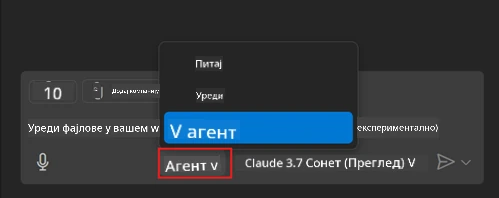
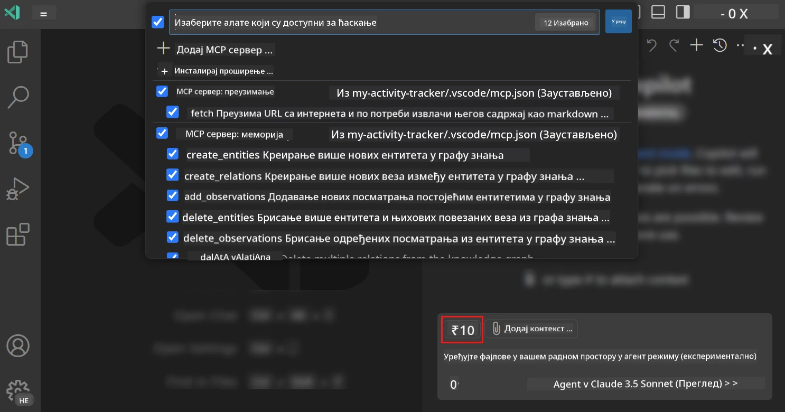
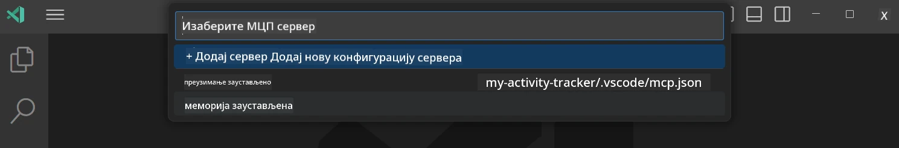
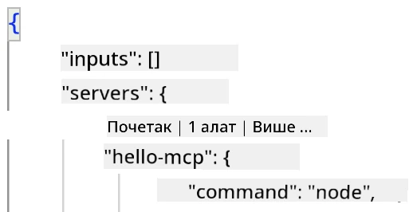
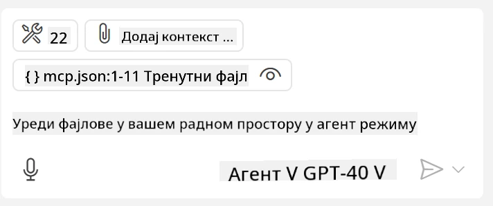
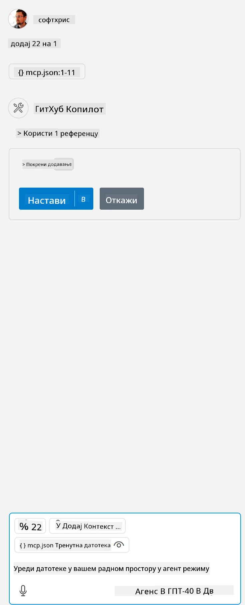

# Коришћење сервера из GitHub Copilot Agent мода

Visual Studio Code и GitHub Copilot могу да делују као клијент и користе MCP сервер. Можда се питате зашто бисмо то желели? Па, то значи да било које могућности које MCP сервер има могу сада бити коришћене из вашег IDE-а. Замислите да додате, на пример, GitHub-ов MCP сервер, што би омогућило контролу GitHub-а преко упита уместо куцања специфичних команди у терминалу. Или замислите било шта што уопште може побољшати ваше искуство развоја, све контролисано природним језиком. Сада видите добитак, зар не?

## Преглед

У овом туторијалу ћемо објаснити како да користите Visual Studio Code и GitHub Copilot-ов Agent мод као клијент за ваш MCP сервер.

## Циљеви учења

До краја овог туторијала, моћи ћете да:

- Користите MCP сервер преко Visual Studio Code-а.
- Покрећете могућности као што су алати преко GitHub Copilot-а.
- Конфигуришете Visual Studio Code да пронађе и управља вашим MCP сервером.

## Коришћење

Можете контролисати ваш MCP сервер на два различита начина:

- Кориснички интерфејс, видећете како се то ради касније у овом поглављу.
- Терминал, могуће је контролисати ствари из терминала користећи извршни `code` команду:

  Да додате MCP сервер у ваш кориснички профил, користите опцију командне линије --add-mcp и наведите JSON конфигурацију сервера у облику {\"name\":\"име-сервера\",\"command\":...}.

  ```
  code --add-mcp "{\"name\":\"my-server\",\"command\": \"uvx\",\"args\": [\"mcp-server-fetch\"]}"
  ```

### Снимци екрана





Хајде даље да причамо о томе како користимо визуелни интерфејс у следећим одељцима.

## Приступ

Ево како треба приступити овоме на вишем нивоу:

- Конфигуришите фајл да би пронашао наш MCP сервер.
- Покрените/Повежите се на поменути сервер да бисте добили список његових могућности.
- Користите поменуте могућности преко GitHub Copilot Chat интерејса.

Сјајно, сада када разумемо ток, хајде да покушамо да користимо MCP сервер преко Visual Studio Code-а кроз један задатак.

## Вежба: Коришћење сервера

У овој вежби ћемо конфигурисати Visual Studio Code да пронађе ваш MCP сервер како би могао да се користи из GitHub Copilot Chat интерфејса.

### -0- Претходни корак, омогућите откривање MCP сервера

Можда ћете морати омогућити откривање MCP сервера.

1. Идите на `File -> Preferences -> Settings` у Visual Studio Code-у.

1. Потражите "MCP" и омогућите `chat.mcp.discovery.enabled` у settings.json фајлу.

### -1- Креирање конфигурационог фајла

Почните креирањем конфигурационог фајла у корену пројекта, потребан вам је фајл зван MCP.json који треба ставити у фасциклу .vscode. Треба да изгледа овако:

```text
.vscode
|-- mcp.json
```

Следеће, хајде да видимо како можемо додати унос за сервер.

### -2- Конфигуришите сервер

Додајте следећи садржај у *mcp.json*:

```json
{
    "inputs": [],
    "servers": {
       "hello-mcp": {
           "command": "node",
           "args": [
               "build/index.js"
           ]
       }
    }
}
```

Испод је једноставан пример како покренути сервер написан у Node.js-у, за друге средине наведите одговарајућу команду за покретање сервера користећи `command` и `args`.

### -3- Покретање сервера

Сада када сте додали унос, хајде да покренемо сервер:

1. Пронађите ваш унос у *mcp.json* и проверите да ли видите иконицу "play":

    

1. Кликните на "play" икону, требало би да видите да се број доступних алата у GitHub Copilot Chat иконици алата повећа. Ако кликнете на ту икону, видећете листу регистрованих алата. Можете означити/опозвати означавање сваког алата у зависности од тога да ли желите да GitHub Copilot користи те алате као контекст:

  

1. Да покренете алат, унесите упит који знате да ће одговарати опису једног од ваших алата, на пример упит као "add 22 to 1":

  

  Треба да добијете одговор 23.

## Задатак

Покушајте да додате унос за сервер у ваш *mcp.json* фајл и уверите се да можете покретати/унимати сервер. Такође, уверите се да можете комуницирати са алатима на вашем серверу преко GitHub Copilot Chat интерфејса.

## Решење

[Решење](./solution/README.md)

## Главне поуке

Главне поуке из овог поглавља су следеће:

- Visual Studio Code је одличан клијент који вам омогућава да користите више MCP сервера и њихове алате.
- GitHub Copilot Chat интерфејс је начин како комуницирате са серверима.
- Можете тражити од корисника уносе као што су API кључеви који се могу проследити MCP серверу приликом конфигурације уноса у *mcp.json* фајлу.

## Примери

- [Java калькулатор](../samples/java/calculator/README.md)
- [.Net калькулатор](../../../../03-GettingStarted/samples/csharp)
- [JavaScript калькулатор](../samples/javascript/README.md)
- [TypeScript калькулатор](../samples/typescript/README.md)
- [Python калькулатор](../../../../03-GettingStarted/samples/python)

## Додатни ресурси

- [Visual Studio документи](https://code.visualstudio.com/docs/copilot/chat/mcp-servers)

## Шта је следеће

- Следеће: [Креирање stdio сервера](../05-stdio-server/README.md)

---

<!-- CO-OP TRANSLATOR DISCLAIMER START -->
**Изјава о одрицању одговорности**:
Овај документ је преведен коришћењем услуге за аутоматски превод [Co-op Translator](https://github.com/Azure/co-op-translator). Иако тежимо тачности, имајте у виду да аутоматски преводи могу садржати грешке или нетачности. Оригинални документ на његовом изворном језику треба сматрати ауторитативним извором. За критичне информације препоручује се професионални људски превод. Нисмо одговорни за било каква неспоразума или погрешна тумачења која произилазе из коришћења овог превода.
<!-- CO-OP TRANSLATOR DISCLAIMER END -->