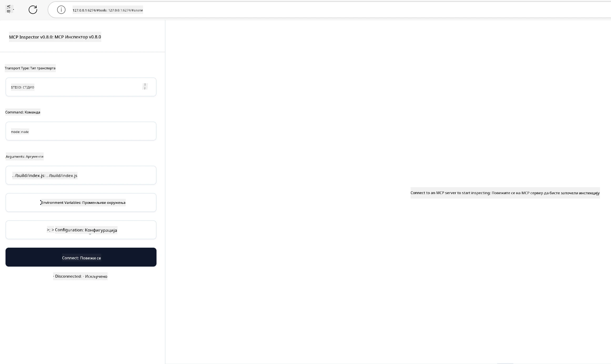

## Тестирање и отклањање грешака

Пре него што почнете са тестирањем свог MCP сервера, важно је разумети расположиве алате и најбоље праксе за отклањање грешака. Ефикасно тестирање осигурава да ваш сервер функционише како се очекује и помаже вам да брзо идентификујете и решите проблеме. Следећи одељак описује препоручене приступе за валидирање ваше MCP имплементације.

## Преглед

Ова лекција обухвата како одабрати прави приступ тестирању и најефикаснији алат за тестирање.

## Циљеви учења

До краја ове лекције моћи ћете да:

- Описујете различите приступе за тестирање.
- Користите различите алате за ефикасно тестирање вашег кода.


## Тестирање MCP сервера

MCP обезбеђује алате који вам помажу да тестирате и отклањате грешке на вашим серверима:

- **MCP инспектор**: Алат линије командe који може да се покреће као CLI алат и као визуелни алат.
- **Ручно тестирање**: Можете користити алат као што је curl за покретање веб захтева, али било који алат који подржава HTTP ће бити користан.
- **Јединично тестирање**: Могуће је користити ваш омиљени тестирачки оквир да тестирате функције и сервера и клијента.

### Коришћење MCP инспектора

Описиали смо коришћење овог алата у претходним лекцијама, али хајде да га опишемо овде на високом нивоу. То је алат изграђен у Node.js и можете га користити позивањем извршног програма `npx` који ће преузети и привремено инсталирати сам алат, и након што заврши са вашим захтевом, очистиће се.

[MCP инспектор](https://github.com/modelcontextprotocol/inspector) вам помаже да:

- **Откријете могућности сервера**: Аутоматски детектује расположиве ресурсе, алате и упите
- **Тестирате извршавање алата**: Испробајте различите параметре и видите одговоре у реалном времену
- **Погледате метаподатке сервера**: Испитате информације о серверу, шеме и конфигурације

Типичан покретач алата изгледа овако:

```bash
npx @modelcontextprotocol/inspector node build/index.js
```

Надаље наредба покреће MCP и његов визуелни интерфејс и лансира локални веб интерфејс у вашем прегледачу. Можете очекивати таблу са приказом ваших регистрованих MCP сервера, њихових расположивих алата, ресурса и упита. Интерфејс вам омогућава интерактивно тестирање извршења алата, преглед метаподатака сервера и приказ одговора у реалном времену, олакшавајући валидирање и отклањање грешака у вашим MCP имплементацијама.

Ево како то може изгледати: 

Такође можете покренути овај алат у CLI режиму додавањем атрибута `--cli`. Ево примера како покренути алат у "CLI" режиму који приказује све алате на серверу:

```sh
npx @modelcontextprotocol/inspector --cli node build/index.js --method tools/list
```

### Ручно тестирање

Поред покретања инспектор алата за тестирање могућности сервера, други сличан приступ је покретање клијента способног за коришћење HTTP, као на пример curl.

Уз curl, можете директно тестирати MCP сервере користећи HTTP захтеве:

```bash
# Пример: Мета-подаци тест сервера
curl http://localhost:3000/v1/metadata

# Пример: Изврши алат
curl -X POST http://localhost:3000/v1/tools/execute \
  -H "Content-Type: application/json" \
  -d '{"name": "calculator", "parameters": {"expression": "2+2"}}'
```

Као што видите из горег коришћења curl-а, користите POST захтев за позивање алата користећи пayload који садржи име алата и његове параметре. Користите приступ који вам највише одговара. CLI алати генерално су бржи за коришћење и погодни за скриптовање што може бити корисно у CI/CD окружењима.

### Јединично тестирање

Креирајте јединичне тестове за ваше алате и ресурсе како бисте осигурали да раде како се очекује. Ево примера тестирачког кода.

```python
import pytest

from mcp.server.fastmcp import FastMCP
from mcp.shared.memory import (
    create_connected_server_and_client_session as create_session,
)

# Обележите цео модул за асинхроне тестове
pytestmark = pytest.mark.anyio


async def test_list_tools_cursor_parameter():
    """Test that the cursor parameter is accepted for list_tools.

    Note: FastMCP doesn't currently implement pagination, so this test
    only verifies that the cursor parameter is accepted by the client.
    """

 server = FastMCP("test")

    # Креирајте неколико алата за тестирање
    @server.tool(name="test_tool_1")
    async def test_tool_1() -> str:
        """First test tool"""
        return "Result 1"

    @server.tool(name="test_tool_2")
    async def test_tool_2() -> str:
        """Second test tool"""
        return "Result 2"

    async with create_session(server._mcp_server) as client_session:
        # Тест без параметра курсора (изостављен)
        result1 = await client_session.list_tools()
        assert len(result1.tools) == 2

        # Тест са курсором=None
        result2 = await client_session.list_tools(cursor=None)
        assert len(result2.tools) == 2

        # Тест са курсором као стрингом
        result3 = await client_session.list_tools(cursor="some_cursor_value")
        assert len(result3.tools) == 2

        # Тест са празним стринг курсором
        result4 = await client_session.list_tools(cursor="")
        assert len(result4.tools) == 2
    
```

Горњи код ради следеће:

- Користи pytest оквир који вам омогућава да креирате тестове као функције и користите assert наредбе.
- Креира MCP сервер са два различита алата.
- Користи `assert` наредбу да провери да су одређени услови испуњени.

Погледајте [цео фајл овде](https://github.com/modelcontextprotocol/python-sdk/blob/main/tests/client/test_list_methods_cursor.py)

Уз горе наведени фајл можете тестирати свој сервер и осигурати да су могућности креиране како треба.

Сви главни SDK-ови имају сличне тестирачке секције, па их можете прилагодити вашем одабраном окружењу.

## Примери 

- [Java калкулатор](../samples/java/calculator/README.md)
- [.Net калкулатор](../../../../03-GettingStarted/samples/csharp)
- [JavaScript калкулатор](../samples/javascript/README.md)
- [TypeScript калкулатор](../samples/typescript/README.md)
- [Python калкулатор](../../../../03-GettingStarted/samples/python) 

## Додатни ресурси

- [Python SDK](https://github.com/modelcontextprotocol/python-sdk)

## Шта следи

- Следеће: [Деплоyмент](../09-deployment/README.md)

---

<!-- CO-OP TRANSLATOR DISCLAIMER START -->
**Изјава о одрицању одговорности**:
Овај документ је преведен коришћењем услуге за аутоматски превод [Co-op Translator](https://github.com/Azure/co-op-translator). Иако тежимо тачности, имајте у виду да аутоматски преводи могу садржати грешке или нетачности. Оригинални документ на његовом изворном језику треба сматрати ауторитативним извором. За критичне информације препоручује се професионални људски превод. Нисмо одговорни за било каква неспоразума или погрешна тумачења која произилазе из коришћења овог превода.
<!-- CO-OP TRANSLATOR DISCLAIMER END -->