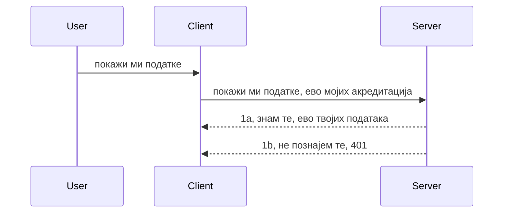

# Једноставна аутентификација

MCP SDK-ови подржавају коришћење OAuth 2.1 који је, да будемо искрени, прилично захтеван процес који укључује концепте као што су сервер аутентификације, сервер ресурса, слање података за приступ, добијање кода, размена кода за носећи токен док коначно не можете добити податке ресурса. Ако нисте навикли на OAuth што је сјајна ствар за имплементацију, добро је почети са неким основним нивоом аутентификације и градити ка бољој и бољој безбедности. Зато овај поглавље постоји, да вас припреми за напреднију аутентификацију.

## Аутентификација, шта то значи?

Аутентификација је скраћеница за аутентификацију и ауторизацију. Идеја је да треба да урадимо две ствари:

- **Аутентификација**, процес утврђивања да ли ћемо дозволити особи да уђе у нашу кућу, односно да ли има право да буде "овде", да има приступ нашем серверу ресурса где живе функције нашег MCP сервера.
- **Ауторизација**, процес откривања да ли корисник треба да има приступ овим специфичним ресурсима за које тражи, на пример овим наруџбинама или овим производима или да ли има дозволу само да чита садржај али не и да брише, као други пример.

## Подаци за приступ: како систему кажемо ко смо

Па, већина веб програмера почиње да размишља у смислу слања података за приступ серверу, обично тајне која каже да ли имају право да буду овде "Аутентификација". Овај податак за приступ обично је base64 кодирана верзија корисничког имена и лозинке или API кључ који јединствено идентификује специфичног корисника.

То укључује слање преко заглавља званог "Authorization" овако:

```json
{ "Authorization": "secret123" }
```

Ово се обично назива основна аутентификација. Како цео ток функционише је на следећи начин:


Сада када разумемо како функционише са аспекта тока, како то имплементирати? Па, већина веб сервера има концепт зван middleware, део кода који се покреће као део захтева и може проверити податке за приступ и ако су важећи дозволити да захтев прође. Ако захтев нема важеће податке добијате грешку аутентификације. Хајде да видимо како се то може имплементирати:

**Python**

```python
class AuthMiddleware(BaseHTTPMiddleware):
    async def dispatch(self, request, call_next):

        has_header = request.headers.get("Authorization")
        if not has_header:
            print("-> Missing Authorization header!")
            return Response(status_code=401, content="Unauthorized")

        if not valid_token(has_header):
            print("-> Invalid token!")
            return Response(status_code=403, content="Forbidden")

        print("Valid token, proceeding...")
       
        response = await call_next(request)
        # додајте било какве корисничке заглавља или на неки начин промените одговор
        return response


starlette_app.add_middleware(CustomHeaderMiddleware)
```

Овде имамо:

- Креиран middleware зван `AuthMiddleware` где се његова метода `dispatch` позива од стране веб сервера.
- Додат middleware веб серверу:

    ```python
    starlette_app.add_middleware(AuthMiddleware)
    ```

- Написану проверу која проверава да ли је Authorization заглавље присутно и да ли је тајна која се шаље важећа:

    ```python
    has_header = request.headers.get("Authorization")
    if not has_header:
        print("-> Missing Authorization header!")
        return Response(status_code=401, content="Unauthorized")

    if not valid_token(has_header):
        print("-> Invalid token!")
        return Response(status_code=403, content="Forbidden")
    ```

    ако је тајна присутна и важећа, дозволимо да захтев прође позивањем `call_next` и враћањем одговора.

    ```python
    response = await call_next(request)
    # додајте било какве корисничке заглавља или на неки начин промените одговор
    return response
    ```

Како функционише: ако је веб захтев упућен ка серверу, middleware ће бити позван и према имплементацији ће или пустити захтев да прође или вратити грешку која указује да клијент нема право да настави.

**TypeScript**

Овде креирамо middleware са популарним фрејмворком Express и пресрећемо захтев пре него што стигне до MCP сервера. Ево кода за то:

```typescript
function isValid(secret) {
    return secret === "secret123";
}

app.use((req, res, next) => {
    // 1. Да ли је заглавље за овлашћење присутно?
    if(!req.headers["Authorization"]) {
        res.status(401).send('Unauthorized');
    }
    
    let token = req.headers["Authorization"];

    // 2. Проверите ваљаност.
    if(!isValid(token)) {
        res.status(403).send('Forbidden');
    }

   
    console.log('Middleware executed');
    // 3. Прослеђује захтев у наредни корак у току захтева.
    next();
});
```

У овом коду смо:

1. Проверили да ли је Authorization заглавље уопште присутно, ако није шаљемо грешку 401.
2. Осигурали да је податак/токен важећи, ако није шаљемо грешку 403.
3. Коначно пропуштамо захтев да иде даље у линији обраде и враћамо тражени ресурс.

## Вежба: Имплементирај аутентификацију

Хајде да применимо наше знање и покушамо са имплементацијом. План је следећи:

Сервер

- Креирај веб сервер и MCP инстанцу.
- Имплементира middleware за сервер.

Клијент

- Пошаљи веб захтев са подацима за приступ, преко заглавља.

### -1- Креирај веб сервер и MCP инстанцу

У нашем првом кораку потребно је направити веб сервер инстанцу и MCP сервер.

**Python**

Овде креирамо инстанцу MCP сервера, правимо starlette веб апликацију и хостујемо је са uvicorn.

```python
# креирање MCP сервера

app = FastMCP(
    name="MCP Resource Server",
    instructions="Resource Server that validates tokens via Authorization Server introspection",
    host=settings["host"],
    port=settings["port"],
    debug=True
)

# креирање starlette веб апликације
starlette_app = app.streamable_http_app()

# покретање апликације преко uvicorn-а
async def run(starlette_app):
    import uvicorn
    config = uvicorn.Config(
            starlette_app,
            host=app.settings.host,
            port=app.settings.port,
            log_level=app.settings.log_level.lower(),
        )
    server = uvicorn.Server(config)
    await server.serve()

run(starlette_app)
```

У овом коду смо:

- Креирали MCP сервер.
- Конструисали starlette веб апликацију из MCP сервера, `app.streamable_http_app()`.
- Хостовали и сервирали веб апликацију користећи uvicorn `server.serve()`.

**TypeScript**

Овде креирамо MCP сервер инстанцу.

```typescript
const server = new McpServer({
      name: "example-server",
      version: "1.0.0"
    });

    // ... подесити серверске ресурсе, алате и упутства ...
```

Овај процес креирања MCP сервера мора се догодити унутар дефиниције руте POST /mcp, па хајде да узмемо горе наведени код и преместимо га овако:

```typescript
import express from "express";
import { randomUUID } from "node:crypto";
import { McpServer } from "@modelcontextprotocol/sdk/server/mcp.js";
import { StreamableHTTPServerTransport } from "@modelcontextprotocol/sdk/server/streamableHttp.js";
import { isInitializeRequest } from "@modelcontextprotocol/sdk/types.js"

const app = express();
app.use(express.json());

// Мапа за чување транспорта по ИД сесије
const transports: { [sessionId: string]: StreamableHTTPServerTransport } = {};

// Обрада POST захтева за комуникацију клијент-сервер
app.post('/mcp', async (req, res) => {
  // Провери постојећи ИД сесије
  const sessionId = req.headers['mcp-session-id'] as string | undefined;
  let transport: StreamableHTTPServerTransport;

  if (sessionId && transports[sessionId]) {
    // Поново употреби постојећи транспорт
    transport = transports[sessionId];
  } else if (!sessionId && isInitializeRequest(req.body)) {
    // Нови захтев за иницијацију
    transport = new StreamableHTTPServerTransport({
      sessionIdGenerator: () => randomUUID(),
      onsessioninitialized: (sessionId) => {
        // Сачувај транспорт по ИД сесије
        transports[sessionId] = transport;
      },
      // Заштита од DNS ребајндинга је подразумевано онемогућена ради уназадне компатибилности. Ако покрећете овај сервер
      // локално, обавезно подесите:
      // enableDnsRebindingProtection: true,
      // allowedHosts: ['127.0.0.1'],
    });

    // Очисти транспорт када је затворен
    transport.onclose = () => {
      if (transport.sessionId) {
        delete transports[transport.sessionId];
      }
    };
    const server = new McpServer({
      name: "example-server",
      version: "1.0.0"
    });

    // ... подеси серверске ресурсе, алате и упутства ...

    // Повежи се са MCP сервером
    await server.connect(transport);
  } else {
    // Неважећи захтев
    res.status(400).json({
      jsonrpc: '2.0',
      error: {
        code: -32000,
        message: 'Bad Request: No valid session ID provided',
      },
      id: null,
    });
    return;
  }

  // Обради захтев
  await transport.handleRequest(req, res, req.body);
});

// Поново употребљив руковалац за GET и DELETE захтеве
const handleSessionRequest = async (req: express.Request, res: express.Response) => {
  const sessionId = req.headers['mcp-session-id'] as string | undefined;
  if (!sessionId || !transports[sessionId]) {
    res.status(400).send('Invalid or missing session ID');
    return;
  }
  
  const transport = transports[sessionId];
  await transport.handleRequest(req, res);
};

// Обради GET захтеве за обавештења са сервера ка клијенту преко SSE
app.get('/mcp', handleSessionRequest);

// Обради DELETE захтеве за прекид сесије
app.delete('/mcp', handleSessionRequest);

app.listen(3000);
```

Сада видите како је креирање MCP сервера премештено унутар `app.post("/mcp")`.

Хајде да пређемо на следећи корак креирања middleware-а за валидацију долазних података за приступ.

### -2- Имплементирај middleware за сервер

Хајде да приступимо делу middleware-а. Овде ћемо направити middleware који тражи податке за приступ у заглављу `Authorization` и валидацијује их. Ако су прихватљиви, захтев ће наставити радити оно што треба (нпр. набројати алате, прочитати ресурс или шта год је MCP функционалност коју клијент тражи).

**Python**

Да бисмо направили middleware, потребно је направити класу која наслеђује `BaseHTTPMiddleware`. Постоје два занимљива дела:

- Захтев `request`, из кога читамо информације из заглавља.
- `call_next`, повратна функција коју позивамо ако клијент има прихватљив податак за приступ.

Прво, треба да обрадимо случај ако `Authorization` заглавље недостаје:

```python
has_header = request.headers.get("Authorization")

# заглавље није присутно, одбаци са 401, у супротном настави.
if not has_header:
    print("-> Missing Authorization header!")
    return Response(status_code=401, content="Unauthorized")
```

Овде шаљемо 401 поруку о неовлашћеном приступу јер клијент не успева аутентификацију.

Затим, ако је податак за приступ послат, треба да проверимо његову ваљаност овако:

```python
 if not valid_token(has_header):
    print("-> Invalid token!")
    return Response(status_code=403, content="Forbidden")
```

Обратите пажњу како горе шаљемо 403 поруку о забрани. Хајде да видимо комплетан middleware који имплементира све што смо горе поменули:

```python
class AuthMiddleware(BaseHTTPMiddleware):
    async def dispatch(self, request, call_next):

        has_header = request.headers.get("Authorization")
        if not has_header:
            print("-> Missing Authorization header!")
            return Response(status_code=401, content="Unauthorized")

        if not valid_token(has_header):
            print("-> Invalid token!")
            return Response(status_code=403, content="Forbidden")

        print("Valid token, proceeding...")
        print(f"-> Received {request.method} {request.url}")
        response = await call_next(request)
        response.headers['Custom'] = 'Example'
        return response

```

Сјајно, али шта је са функцијом `valid_token`? Ево је испод:
:

```python
# НЕ КОРИСТИТЕ за производњу - побољшајте га !!
def valid_token(token: str) -> bool:
    # уклоните префикс "Bearer "
    if token.startswith("Bearer "):
        token = token[7:]
        return token == "secret-token"
    return False
```

Ово би очигледно требало побољшати.

ВАЖНО: НИКАДА не би требало да имате тајне попут ове у коду. У идеалном случају треба да обезбедите вредност за поређење из извора података или од провајдера идентитета (IDP) или још боље, да IDP ради валидацију.

**TypeScript**

Да бисмо ово имплементирали са Express-ом, треба позвати метод `use` који прима middleware функције.

Потребно је:

- Радити са променљивом захтева да проверимо прослеђени податак у својству `Authorization`.
- Валидацију податка и ако је у реду пустити захтев да настави и омогућити да MCP захтев клијента уради оно што треба (нпр. набројати алате, прочитати ресурс или било шта MCP релативно).

Овде проверавамо да ли је `Authorization` заглавље присутно и ако није, заустављамо даље прослеђивање:

```typescript
if(!req.headers["authorization"]) {
    res.status(401).send('Unauthorized');
    return;
}
```

Ако заглавље није послато, добијате 401.

Затим проверимо да ли је податак важећи, ако није поново зауставимо захтев али са мало другачијом поруком:

```typescript
if(!isValid(token)) {
    res.status(403).send('Forbidden');
    return;
} 
```

Обратите пажњу да сада добијате 403 грешку.

Ево комплетног кода:

```typescript
app.use((req, res, next) => {
    console.log('Request received:', req.method, req.url, req.headers);
    console.log('Headers:', req.headers["authorization"]);
    if(!req.headers["authorization"]) {
        res.status(401).send('Unauthorized');
        return;
    }
    
    let token = req.headers["authorization"];

    if(!isValid(token)) {
        res.status(403).send('Forbidden');
        return;
    }  

    console.log('Middleware executed');
    next();
});
```

Поставили смо веб сервер да прихвата middleware који проверава податке за приступ које нам клијент надамо се шаље. А шта је са самим клијентом?

### -3- Пошаљи веб захтев са подацима за приступ преко заглавља

Потребно је осигурати да клијент прослеђује податак преко заглавља. Како ћемо користити MCP клијент за то, треба да сазнамо како се то ради.

**Python**

За клијента, треба проследити заглавље са подацима овако:

```python
# НЕ уносите вредност директно у код, барем је чувајте у променљивој окружења или у безбеднијем складишту
token = "secret-token"

async with streamablehttp_client(
        url = f"http://localhost:{port}/mcp",
        headers = {"Authorization": f"Bearer {token}"}
    ) as (
        read_stream,
        write_stream,
        session_callback,
    ):
        async with ClientSession(
            read_stream,
            write_stream
        ) as session:
            await session.initialize()
      
            # TODO, шта желите да се уради на клијенту, нпр. навођење алата, позивање алата итд.
```

Обратите пажњу како попуњавамо `headers` својство овако `headers = {"Authorization": f"Bearer {token}"}`.

**TypeScript**

То можемо решити у два корака:

1. Попунити конфигурациони објекат са нашим подацима.
2. Проследити конфигурациони објекат транспорту.

```typescript

// НЕ уносити вредност директно као што је приказано овде. Најмање, имајте је као променљиву окружења и користите нешто као dotenv (у развојном режиму).
let token = "secret123"

// дефинишите опцију транспорта клијента као објекат
let options: StreamableHTTPClientTransportOptions = {
  sessionId: sessionId,
  requestInit: {
    headers: {
      "Authorization": "secret123"
    }
  }
};

// проследите објекат опција транспорту
async function main() {
   const transport = new StreamableHTTPClientTransport(
      new URL(serverUrl),
      options
   );
```

Овде видите како смо морали да направимо `options` објекат и сместимо заглавља у својство `requestInit`.

ВАЖНО: Како ово побољшати из овде? Па, тренутна имплементација има одређене проблеме. Пре свега, слање података овако је ризично осим ако немате HTTPS. Чак и онда подаци могу бити украдени, па треба систем где лако можете поништити токен и додати додатне провере као што су одкуда долази, да ли се захтеви превише често понављају (понашање ботова), у краткој причи, има много брига.

Ипак, за веома једноставне API-је где не желите да било ко дозове ваш API без аутентификације, ово што имамо је добар почетак.

Са тим реченим, хајде да ојачамо безбедност мало коришћењем стандардизованог формата као што је JSON Web Token, познатог као JWT или "ЈОТ" токен.

## JSON Web Tokens, JWT

Дакле, покушавамо да унапредимо ствари у односу на слање веома једноставних података. Које су непосредне предности коришћења JWT?

- **Побољшања безбедности**. У основној аутентификацији понављате корисничко име и лозинку као base64 кодирани токен (или шаљете API кључ) што повећава ризик. Са JWT шаљете корисничко име и лозинку и добијате токен који такође има временско ограничење што значи да истиче. JWT омогућава фино управљање приступом користећи улоге, области и дозволе.
- **Бесједишност и скалабилност**. JWT су самостални, носе све податке о кориснику и елиминишу потребу за серверском сесијском меморијом. Токени се такође могу локално верификовати.
- **Интероперабилност и федерација**. JWT је срж Open ID Connect и користи се са познатим провајдерима идентитета као што су Entra ID, Google Identity и Auth0. Омогућавају и сингл сајн-он и још много тога што је предузетнички погодан.
- **Модуларност и флексибилност**. JWT се могу користити са API Gateway-јима као што су Azure API Management, NGINX и други. Подржавају сценарије аутентификације корисника и комуникације сервер-сервер укључујући импersonацију и делегацију.
- **Перформансе и кеширање**. JWT се могу кеширати након декодирања што смањује потребу за парсирањем. Ово посебно помаже код апликација са великим прометом јер побољшава пропусни опсег и смањује оптерећење на инфраструктури.
- **Напредне функције**. Такође подржава интроспекцију (провера ваљаности на серверу) и поништавање (чинећи токен неважећим).

Са свим овим предностима, хајде да видимо како можемо подићи нашу имплементацију на виши ниво.

## Претварање основне аутентификације у JWT

Дакле, промене које треба да урадимо у великој слици су:

- **Научити како конструисати JWT токен** и припремити га за слање од клијента ка серверу.
- **Валидирати JWT токен**, и ако је важећи, дозволити клијенту приступ ресурсима.
- **Безбедно складиштење токена**. Како чувати овај токен.
- **Заштита рута**. Треба заштитити руте, у нашем случају MCP руте и специфичне функције.
- **Додавање освежавајућих токена**. Осигурати да креирамо токене који имају кратко време живота али и освежавајуће токене који су дужег трајања и могу се користити за добијање нових токена ако истекну. Такође, осигурати постојање освежавајуће руте и стратегију ротације.

### -1- Конструиши JWT токен

Прво, JWT токен има следеће делове:

- **заглавље**, алгоритам који се користи и тип токена.
- **пакуље**, захтеви, као што су sub (корисник или ентитет који токен представља. У аутентификационом сценарију то је обично ид корисника), exp (када истиче), role (улога).
- **потпис**, потписан тајном или приватним кључем.

За ову сврху треба конструисати заглавље, пакуљ и кодирани токен.

**Python**

```python

import jwt
import jwt
from jwt.exceptions import ExpiredSignatureError, InvalidTokenError
import datetime

# Тајни кључ коришћен за потписивање JWT-а
secret_key = 'your-secret-key'

header = {
    "alg": "HS256",
    "typ": "JWT"
}

# корисничке информације, његове тврдње и време истека
payload = {
    "sub": "1234567890",               # Предмет (ИД корисника)
    "name": "User Userson",                # Прилагођена тврдња
    "admin": True,                     # Прилагођена тврдња
    "iat": datetime.datetime.utcnow(),# Време издавања
    "exp": datetime.datetime.utcnow() + datetime.timedelta(hours=1)  # Време истека
}

# кодирај то
encoded_jwt = jwt.encode(payload, secret_key, algorithm="HS256", headers=header)
```

У горњем коду смо:

- Дефинисали заглавље користећи HS256 као алгоритам и тип као JWT.
- Конструисали пакуљ који садржи субјекат или ид корисника, корисничко име, улогу, време издавања и време истека, имплементирајући тиме временско ограничење које смо раније поменули.

**TypeScript**

Овде ћемо морати имати неке зависности које нам помажу у конструисању JWT токена.

Зависности

```sh

npm install jsonwebtoken
npm install --save-dev @types/jsonwebtoken
```

Сада када имамо то на месту, хајде да креирамо заглавље, пакуљ и преко тога креирамо кодирани токен.

```typescript
import jwt from 'jsonwebtoken';

const secretKey = 'your-secret-key'; // Користи еколошке променљиве у продукцији

// Дефиниши корисни терет
const payload = {
  sub: '1234567890',
  name: 'User usersson',
  admin: true,
  iat: Math.floor(Date.now() / 1000), // Време издавања
  exp: Math.floor(Date.now() / 1000) + 60 * 60 // Истиче за 1 сат
};

// Дефиниши заглавље (опционо, jsonwebtoken подешава подразумеване вредности)
const header = {
  alg: 'HS256',
  typ: 'JWT'
};

// Креирај токен
const token = jwt.sign(payload, secretKey, {
  algorithm: 'HS256',
  header: header
});

console.log('JWT:', token);
```

Овај токен је:

Потписан коришћењем HS256
Важећи 1 сат
Укључује захтеве као што су sub, name, admin, iat и exp.

### -2- Валидирај токен

Такође морамо валидирати токен, то је нешто што треба радити на серверу да бисмо осигурали да је оно што нам клијент шаље заиста важеће. Постоји много провера које треба обавити од провере структуре до валидности. Препоручује се и додавање других провера као што је да ли је корисник у систему и више.

Да бисмо валидирали токен, морамо га декодирати да бисмо га прочитали, а онда почети провере валидности:

**Python**

```python

# Декодујте и проверите JWT
try:
    decoded = jwt.decode(token, secret_key, algorithms=["HS256"])
    print("✅ Token is valid.")
    print("Decoded claims:")
    for key, value in decoded.items():
        print(f"  {key}: {value}")
except ExpiredSignatureError:
    print("❌ Token has expired.")
except InvalidTokenError as e:
    print(f"❌ Invalid token: {e}")

```

У овом коду позивамо `jwt.decode` са токеном, тајним кључем и изабраним алгоритмом као улазом. Обратите пажњу на try-catch конструкцију јер неуспела валидација доводи до бацања грешке.

**TypeScript**

Овде треба позвати `jwt.verify` да добијемо декодирани токен који можемо даље анализирати. Ако овај позив не успе, то значи да је структура токена нетачна или више није важећа.

```typescript

try {
  const decoded = jwt.verify(token, secretKey);
  console.log('Decoded Payload:', decoded);
} catch (err) {
  console.error('Token verification failed:', err);
}
```

НАПОМЕНА: као што је раније наведено, препоручује се додатак провера да би се осигурало да овај токен показује на корисника у нашем систему и да корисник има права која тврди да има.

Затим, хајде да погледамо контролу приступа базирану на улогама, познату као RBAC.
## Додавање контроле приступа засноване на улогама

Идеја је да желимо да изразимо да различите улоге имају различите дозволе. На пример, претпостављамо да администратор може све, да обични корисници могу само читати и писати, а да гост може само читати. Стога, ево неких могућих нивоа дозвола:

- Admin.Write 
- User.Read
- Guest.Read

Погледајмо како можемо имплементирати овакву контролу помоћу middleware-а. Middleware-и се могу додати по рути као и за све руте.

**Python**

```python
from starlette.middleware.base import BaseHTTPMiddleware
from starlette.responses import JSONResponse
import jwt

# НЕ држите тајну у коду као овде, ово је само за демонстрационе сврхе. Учитајте је из безбедног места.
SECRET_KEY = "your-secret-key" # ставите ово у променљиву окружења
REQUIRED_PERMISSION = "User.Read"

class JWTPermissionMiddleware(BaseHTTPMiddleware):
    async def dispatch(self, request, call_next):
        auth_header = request.headers.get("Authorization")
        if not auth_header or not auth_header.startswith("Bearer "):
            return JSONResponse({"error": "Missing or invalid Authorization header"}, status_code=401)

        token = auth_header.split(" ")[1]
        try:
            decoded = jwt.decode(token, SECRET_KEY, algorithms=["HS256"])
        except jwt.ExpiredSignatureError:
            return JSONResponse({"error": "Token expired"}, status_code=401)
        except jwt.InvalidTokenError:
            return JSONResponse({"error": "Invalid token"}, status_code=401)

        permissions = decoded.get("permissions", [])
        if REQUIRED_PERMISSION not in permissions:
            return JSONResponse({"error": "Permission denied"}, status_code=403)

        request.state.user = decoded
        return await call_next(request)


```

Постоји неколико различитих начина да се дода middleware као доле:

```python

# Алт 1: додај мидлвер током креирања starlette апликације
middleware = [
    Middleware(JWTPermissionMiddleware)
]

app = Starlette(routes=routes, middleware=middleware)

# Алт 2: додај мидлвер након што је starlette апликација већ креирана
starlette_app.add_middleware(JWTPermissionMiddleware)

# Алт 3: додај мидлвер по рути
routes = [
    Route(
        "/mcp",
        endpoint=..., # обрађивач
        middleware=[Middleware(JWTPermissionMiddleware)]
    )
]
```

**TypeScript**

Можемо користити `app.use` и middleware који ће се извршавати за све захтеве.

```typescript
app.use((req, res, next) => {
    console.log('Request received:', req.method, req.url, req.headers);
    console.log('Headers:', req.headers["authorization"]);

    // 1. Проверите да ли је заглавље за ауторизацију послато

    if(!req.headers["authorization"]) {
        res.status(401).send('Unauthorized');
        return;
    }
    
    let token = req.headers["authorization"];

    // 2. Проверите да ли је токен валидан
    if(!isValid(token)) {
        res.status(403).send('Forbidden');
        return;
    }  

    // 3. Проверите да ли корисник токена постоји у нашем систему
    if(!isExistingUser(token)) {
        res.status(403).send('Forbidden');
        console.log("User does not exist");
        return;
    }
    console.log("User exists");

    // 4. Потврдите да токен има одговарајуће дозволе
    if(!hasScopes(token, ["User.Read"])){
        res.status(403).send('Forbidden - insufficient scopes');
    }

    console.log("User has required scopes");

    console.log('Middleware executed');
    next();
});

```

Постоји доста ствари које можемо дозволити нашем middleware-у и које НАШ middleware ТРЕБА да ради, наиме:

1. Проверити да ли је authorization заглавље присутно
2. Проверити да ли је token важећи, зовемо `isValid` који је метода коју смо написали и која проверава интегритет и ваљаност JWT token-а.
3. Верификовати да корисник постоји у нашем систему, ово треба да проверимо.

   ```typescript
    // корисници у бази података
   const users = [
     "user1",
     "User usersson",
   ]

   function isExistingUser(token) {
     let decodedToken = verifyToken(token);

     // ДОЋИ, проверите да ли корисник постоји у бази података
     return users.includes(decodedToken?.name || "");
   }
   ```

   Изнад смо направили једноставну листу `users`, која би наравно требало да буде у бази података.

4. Додатно, треба да проверимо да ли token има одговарајуће дозволе.

   ```typescript
   if(!hasScopes(token, ["User.Read"])){
        res.status(403).send('Forbidden - insufficient scopes');
   }
   ```

   У овом коду из middleware-а проверимо да ли token садржи User.Read дозволу, ако не, шаљемо грешку 403. Испод је `hasScopes` помоћна метода.

   ```typescript
   function hasScopes(scope: string, requiredScopes: string[]) {
     let decodedToken = verifyToken(scope);
    return requiredScopes.every(scope => decodedToken?.scopes.includes(scope));
  }
   ```

Have a think which additional checks you should be doing, but these are the absolute minimum of checks you should be doing.

Using Express as a web framework is a common choice. There are helpers library when you use JWT so you can write less code.

- `express-jwt`, helper library that provides a middleware that helps decode your token.
- `express-jwt-permissions`, this provides a middleware `guard` that helps check if a certain permission is on the token.

Here's what these libraries can look like when used:

```typescript
const express = require('express');
const jwt = require('express-jwt');
const guard = require('express-jwt-permissions')();

const app = express();
const secretKey = 'your-secret-key'; // put this in env variable

// Decode JWT and attach to req.user
app.use(jwt({ secret: secretKey, algorithms: ['HS256'] }));

// Check for User.Read permission
app.use(guard.check('User.Read'));

// multiple permissions
// app.use(guard.check(['User.Read', 'Admin.Access']));

app.get('/protected', (req, res) => {
  res.json({ message: `Welcome ${req.user.name}` });
});

// Error handler
app.use((err, req, res, next) => {
  if (err.code === 'permission_denied') {
    return res.status(403).send('Forbidden');
  }
  next(err);
});

```

Сада када сте видели како middleware може да се користи и за аутентификацију и за ауторизацију, шта је са MCP-ом, да ли он мења начин на који радимо auth? Хајде да сазнамо у следећем одељку.

### -3- Додавање RBAC у MCP

До сада сте видели како можете додати RBAC преко middleware-а, али за MCP нема једноставан начин да се дода RBAC по MCP функцији, шта онда радимо? Па, само морамо додати код као овај који проверава у овом случају да ли клијент има права да позове одређени алат:

Имате неколико различитих избора како да остварите RBAC по функцији, ево неких:

- Додајте проверу за сваки алат, ресурс, prompt где је потребно проверити ниво дозволе.

   **python**

   ```python
   @tool()
   def delete_product(id: int):
      try:
          check_permissions(role="Admin.Write", request)
      catch:
        pass # клијент није успео ауторизацију, подигните грешку ауторизације
   ```

   **typescript**

   ```typescript
   server.registerTool(
    "delete-product",
    {
      title: Delete a product",
      description: "Deletes a product",
      inputSchema: { id: z.number() }
    },
    async ({ id }) => {
      
      try {
        checkPermissions("Admin.Write", request);
        // уради, пошаљи ид у productService и remote entry
      } catch(Exception e) {
        console.log("Authorization error, you're not allowed");  
      }

      return {
        content: [{ type: "text", text: `Deletected product with id ${id}` }]
      };
    }
   );
   ```


- Користите напреднији приступ сервера и request хендлере тако да смањите број места где је неопходно извршити проверу.

   **Python**

   ```python
   
   tool_permission = {
      "create_product": ["User.Write", "Admin.Write"],
      "delete_product": ["Admin.Write"]
   }

   def has_permission(user_permissions, required_permissions) -> bool:
      # user_permissions: листа дозвола које корисник има
      # required_permissions: листа дозвола потребних за алат
      return any(perm in user_permissions for perm in required_permissions)

   @server.call_tool()
   async def handle_call_tool(
     name: str, arguments: dict[str, str] | None
   ) -> list[types.TextContent]:
    # Претпоставите да је request.user.permissions листа дозвола за корисника
     user_permissions = request.user.permissions
     required_permissions = tool_permission.get(name, [])
     if not has_permission(user_permissions, required_permissions):
        # Избаците грешку "Немате дозволу за позивање алата {name}"
        raise Exception(f"You don't have permission to call tool {name}")
     # наставите и позовите алат
     # ...
   ```   
   

   **TypeScript**

   ```typescript
   function hasPermission(userPermissions: string[], requiredPermissions: string[]): boolean {
       if (!Array.isArray(userPermissions) || !Array.isArray(requiredPermissions)) return false;
       // Врати true ако корисник има барем једно потребно овлашћење
       
       return requiredPermissions.some(perm => userPermissions.includes(perm));
   }
  
   server.setRequestHandler(CallToolRequestSchema, async (request) => {
      const { params: { name } } = request;
  
      let permissions = request.user.permissions;
  
      if (!hasPermission(permissions, toolPermissions[name])) {
         return new Error(`You don't have permission to call ${name}`);
      }
  
      // настави..
   });
   ```

   Имајте на уму, морате осигурати да ваш middleware додељује декодовани token својству user у request-у како би код изнад био једноставан.

### Резиме

Сада када смо разговарали о томе како додати подршку за RBAC уопштено и за MCP посебно, време је да покушате да сами имплементирате безбедност како бисте били сигурни да сте разумели представљене концепте.

## Задатак 1: Направите MCP сервер и MCP клијент користећи основну аутентификацију

Овде ћете применити оно што сте научили у погледу слања акредитива кроз заглавља.

## Решење 1

[Решење 1](./code/basic/README.md)

## Задатак 2: Надоградите решење из Задака 1 да користи JWT

Узмите прво решење, али овај пут га побољшајте.

Уместо да користите Basic Auth, користићемо JWT.

## Решење 2

[Решење 2](./solution/jwt-solution/README.md)

## Изазов

Додајте RBAC по алату као што смо описали у одељку "Додавање RBAC у MCP".

## Резиме

Надамо се да сте много тога научили у овом поглављу, од потпуне безбедности, преко основне безбедности, до JWT-а и како се он може додати MCP-у.

Изградили смо солидну основу са прилагођеним JWT-овима, али како растемо, крећемо ка моделу идентитета заснованом на стандардима. Примањем IdP-а као што су Entra или Keycloak, препуштамо обраду издавања, валидације и управљања животним циклусом token-а поверењу платформи — ослобађајући нас да се фокусирамо на логику апликације и корисничко искуство.

За то имамо напредније [поглавље о Entra](../../05-AdvancedTopics/mcp-security-entra/README.md)

## Шта следи

- Следеће: [Подешавање MCP домаћина](../12-mcp-hosts/README.md)

---

<!-- CO-OP TRANSLATOR DISCLAIMER START -->
**Одрицање од одговорности**:
Овај документ је преведен помоћу АИ услуге за превођење [Co-op Translator](https://github.com/Azure/co-op-translator). Иако настојимо да обезбедимо тачност, имајте у виду да аутоматски преводи могу садржати грешке или нетачности. Изворни документ на његовом оригиналном језику треба сматрати ауторитетним извором. За критичне информације препоруучује се професионални људски превод. Нисмо одговорни за било какве неспоразуме или погрешна тумачења која могу произаћи из коришћења овог превода.
<!-- CO-OP TRANSLATOR DISCLAIMER END -->