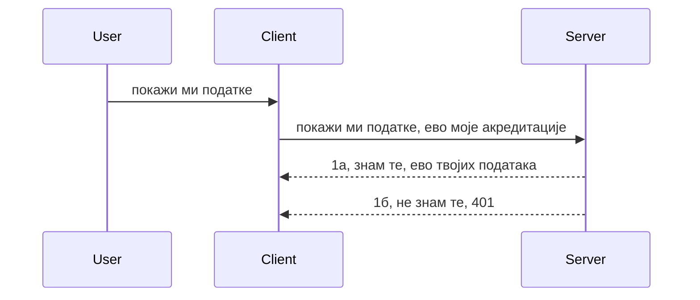

# Једноставна аутентикација

MCP SDK-ови подржавају коришћење OAuth 2.1 који је, да будемо искрени, прилично сложен процес који укључује концепте као што су сервер за аутентикацију, сервер ресурса, слање акредитива, добијање кода, размена кода за носиоца токена све док коначно не добијете своје податке ресурса. Ако нисте навикли на OAuth, што је одлично решење за имплементацију, добра је идеја да почнете са неким основним нивоом аутентикације и постепено надоградите на бољу и бољу безбедност. Зато постоји овај поглавље, да вас припреми за напреднију аутентикацију.

## Аутентикација, шта то значи?

Аутентикација је скраћеница за аутентификацију и ауторизацију. Идеја је да треба да урадимо две ствари:

- **Аутентификација**, процес утврђивања да ли ћемо особи дозволити да уђе у нашу кућу, односно да ли има право да буде "овде", односно да има приступ нашем серверу ресурса где живе функције нашег MCP сервера.
- **Ауторизација**, је процес провере да ли корисник треба да има приступ одређеним ресурсима које тражи, на пример одређеним поруџбинама или производима, или да ли може да чита садржај али не и да брише као други пример.

## Кредитиви: како систему кажемо ко смо

Већина веб програмера почне да размишља у смислу слања креденцијала ка серверу, обично тајни податак који каже да ли им је дозвољено да буду овде "Аутентификација". Овај креденцијал је обично base64 енкодована верзија корисничког имена и лозинке или API кључ који јединствено идентификује одређеног корисника.

Ово укључује слање преко хедера названог "Authorization" овако:

```json
{ "Authorization": "secret123" }
```

Ово се обично назива основна аутентикација. Како укупан проток тада функционише је на следећи начин:


```mermaid
sequenceDiagram
   participant User
   participant Client
   participant Server

   User->>Client: покажи ми податке
   Client->>Server: покажи ми податке, ево моје акредитације
   Server-->>Client: 1а, знам те, ево твојих података
   Server-->>Client: 1б, не знам те, 401 
```

Сада када разумемо како проток функционише, како га имплементирати? Већина веб сервера има концепт зван middleware, део кода који се покреће као део захтева и може потврдити кредитиве, и ако су кредитиви важећи, дозвољава пролаз захтеву. Ако захтев нема важеће кредитиве, добијате грешку аутентикације. Погледајмо како се ово може имплементирати:

**Python**

```python
class AuthMiddleware(BaseHTTPMiddleware):
    async def dispatch(self, request, call_next):

        has_header = request.headers.get("Authorization")
        if not has_header:
            print("-> Missing Authorization header!")
            return Response(status_code=401, content="Unauthorized")

        if not valid_token(has_header):
            print("-> Invalid token!")
            return Response(status_code=403, content="Forbidden")

        print("Valid token, proceeding...")
       
        response = await call_next(request)
        # додајте било какве корисничке заглавља или на неки начин измените одговор
        return response


starlette_app.add_middleware(CustomHeaderMiddleware)
```

Овде имамо:

- Креиран middleware назван `AuthMiddleware` где његова метода `dispatch` се позива од стране веб сервера.
- Middleware додат на веб сервер:

    ```python
    starlette_app.add_middleware(AuthMiddleware)
    ```

- Написана логика валидације која проверава да ли је Authorization header присутан и да ли је послати тајни кључ важећи:

    ```python
    has_header = request.headers.get("Authorization")
    if not has_header:
        print("-> Missing Authorization header!")
        return Response(status_code=401, content="Unauthorized")

    if not valid_token(has_header):
        print("-> Invalid token!")
        return Response(status_code=403, content="Forbidden")
    ```

    ако је тајни кључ присутан и важећи, дозвољавамо пролаз захтеву позивањем `call_next` и враћамо одговор.

    ```python
    response = await call_next(request)
    # додајте било које корисничке заглавља или на неки начин промените одговор
    return response
    ```

Како ово функционише је да ако се направи веб захтев ка серверу, middleware ће бити позван и датој имплементацији ће или пустити захтев да прође или ће вратити грешку која указује да клијент није овлашћен да настави.

**TypeScript**

Овде креирамо middleware са популарним Express фрејмворком и пресрећемо захтев пре него што стигне до MCP сервера. Ево кода за то:

```typescript
function isValid(secret) {
    return secret === "secret123";
}

app.use((req, res, next) => {
    // 1. Заглавље ауторизације присутно?
    if(!req.headers["Authorization"]) {
        res.status(401).send('Unauthorized');
    }
    
    let token = req.headers["Authorization"];

    // 2. Провери ваљаност.
    if(!isValid(token)) {
        res.status(403).send('Forbidden');
    }

   
    console.log('Middleware executed');
    // 3. Прослеђује захтев наредном кораку у ланцу захтева.
    next();
});
```

У овом коду:

1. Проверавамо да ли је Authorization header уопште присутан, ако није шаљемо 401 грешку.
2. Осигурати да је креденцијал/токен важећи, ако није, шаљемо 403 грешку.
3. Коначно прослеђује захтев даље у request pipeline и враћа тражени ресурс.

## Вежба: Имплементирајте аутентификацију

Узмимо наше знање и покушајмо да га имплементирамо. План је следећи:

Сервер

- Креирати веб сервер и MCP инстанцу.
- Имплементирати middleware за сервер.

Клијент

- Послати веб захтев са креденциалом преко хедера.

### -1- Креирати веб сервер и MCP инстанцу

> [!WARNING]
> Пример испод у TypeScript-у циља MCP `2025-11-25`. Праћење транспорта је
> преко `mcp-session-id` и није тренутни пример транспорта `2026-07-28`. MCP
> `2026-07-28` уклања handshake и protocol session ID и нове
> имплементације користе самостојеће захтеве. Види
> [Шта се променило у MCP: спецификација 2026-07-28](../../01-CoreConcepts/mcp-2026-07-28.md).

У првом кораку, потребно је да направимо инстанцу веб сервера и MCP сервера.

**Python**

Овде створимо MCP сервер инстанцу, направимо starlette веб апликацију и хостирамо је са uvicorn-ом.

```python
# креирање MCP сервера

app = FastMCP(
    name="MCP Resource Server",
    instructions="Resource Server that validates tokens via Authorization Server introspection",
    host=settings["host"],
    port=settings["port"],
    debug=True
)

# креирање starlette веб апликације
starlette_app = app.streamable_http_app()

# сервирање апликације преко uvicorn-а
async def run(starlette_app):
    import uvicorn
    config = uvicorn.Config(
            starlette_app,
            host=app.settings.host,
            port=app.settings.port,
            log_level=app.settings.log_level.lower(),
        )
    server = uvicorn.Server(config)
    await server.serve()

run(starlette_app)
```

У овом коду:

- Креирамо MCP сервер.
- Конструишемо starlette веб апликацију из MCP сервера, `app.streamable_http_app()`.
- Хостирамо и сервисирамо веб апликацију користећи uvicorn `server.serve()`.

**TypeScript**

Овде креирамо MCP сервер инстанцу.

```typescript
const server = new McpServer({
      name: "example-server",
      version: "1.0.0"
    });

    // ... подесите серверске ресурсе, алате и упите ...
```

Ово креирање MCP сервера ће морати да се деси унутар дефиниције наше POST /mcp руте, па хајде да претходни код померимо овако:

```typescript
import express from "express";
import { randomUUID } from "node:crypto";
import { McpServer } from "@modelcontextprotocol/sdk/server/mcp.js";
import { StreamableHTTPServerTransport } from "@modelcontextprotocol/sdk/server/streamableHttp.js";
import { isInitializeRequest } from "@modelcontextprotocol/sdk/types.js"

const app = express();
app.use(express.json());

// Мапа за чување транспорта по ID сесије
const transports: { [sessionId: string]: StreamableHTTPServerTransport } = {};

// Обрада POST захтева за комуникацију клијент-сервер
app.post('/mcp', async (req, res) => {
  // Провера постојећег ID сесије
  const sessionId = req.headers['mcp-session-id'] as string | undefined;
  let transport: StreamableHTTPServerTransport;

  if (sessionId && transports[sessionId]) {
    // Поново користи постојећи транспорт
    transport = transports[sessionId];
  } else if (!sessionId && isInitializeRequest(req.body)) {
    // Нови захтев за иницијализацију
    transport = new StreamableHTTPServerTransport({
      sessionIdGenerator: () => randomUUID(),
      onsessioninitialized: (sessionId) => {
        // Чување транспорта по ID сесије
        transports[sessionId] = transport;
      },
      // Заштита од DNS преусмеравања је подразумевано онемогућена ради компатибилности са старијим верзијама. Ако покрећете овај сервер
      // локално, обавезно подесите:
      // enableDnsRebindingProtection: true,
      // allowedHosts: ['127.0.0.1'],
    });

    // Очистити транспорт када је затворен
    transport.onclose = () => {
      if (transport.sessionId) {
        delete transports[transport.sessionId];
      }
    };
    const server = new McpServer({
      name: "example-server",
      version: "1.0.0"
    });

    // ... подешавање ресурса сервера, алата и упита ...

    // Повежи се на MCP сервер
    await server.connect(transport);
  } else {
    // Неважећи захтев
    res.status(400).json({
      jsonrpc: '2.0',
      error: {
        code: -32000,
        message: 'Bad Request: No valid session ID provided',
      },
      id: null,
    });
    return;
  }

  // Обради захтев
  await transport.handleRequest(req, res, req.body);
});

// Поново употребљив хендлер за GET и DELETE захтеве
const handleSessionRequest = async (req: express.Request, res: express.Response) => {
  const sessionId = req.headers['mcp-session-id'] as string | undefined;
  if (!sessionId || !transports[sessionId]) {
    res.status(400).send('Invalid or missing session ID');
    return;
  }
  
  const transport = transports[sessionId];
  await transport.handleRequest(req, res);
};

// Обрада GET захтева за обавештења са сервера ка клијенту преко SSE
app.get('/mcp', handleSessionRequest);

// Обрада DELETE захтева за прекид сесије
app.delete('/mcp', handleSessionRequest);

app.listen(3000);
```

Сада видите како је креирање MCP сервера померено унутар `app.post("/mcp")`.

Хајде да пређемо на следећи корак и направимо middleware како бисмо верификовали долазне креденцијале.

### -2- Имплементирати middleware за сервер

Идемо сада на део middleware-а. Овде ћемо направити middleware који тражи креденцијал у хедеру `Authorization` и валидира га. Ако је прихватљив, захтев ће проћи да ради оно што треба (нпр. листа алата, чита ресурс или било коју MCP функцију коју клијент тражи).

**Python**

Да бисмо направили middleware, потребно је направити класу која наслеђује `BaseHTTPMiddleware`. Постоје два занимљива дела:

- захтев `request`, одакле читамо податке из хедера.
- `call_next` callback који треба позвати ако клијент донесе прихватљив креденцијал.

Прво, потребно је обрадити случај када `Authorization` хедер недостаје:

```python
has_header = request.headers.get("Authorization")

# заглавље није присутно, одбиј са 401, у супротном настави.
if not has_header:
    print("-> Missing Authorization header!")
    return Response(status_code=401, content="Unauthorized")
```

Овде шаљемо 401 unauthorized поруку јер клијент није успео аутентификацију.

Затим, ако је креденцијал послат, потребно је проверити његову важећност овако:

```python
 if not valid_token(has_header):
    print("-> Invalid token!")
    return Response(status_code=403, content="Forbidden")
```

Обратите пажњу да горе шаљемо 403 forbidden поруку. Испод видимо цео middleware који имплементира све наведено:

```python
class AuthMiddleware(BaseHTTPMiddleware):
    async def dispatch(self, request, call_next):

        has_header = request.headers.get("Authorization")
        if not has_header:
            print("-> Missing Authorization header!")
            return Response(status_code=401, content="Unauthorized")

        if not valid_token(has_header):
            print("-> Invalid token!")
            return Response(status_code=403, content="Forbidden")

        print("Valid token, proceeding...")
        print(f"-> Received {request.method} {request.url}")
        response = await call_next(request)
        response.headers['Custom'] = 'Example'
        return response

```

Сјајно, али шта је са функцијом `valid_token`? Ево је испод:

```python
# НЕ користити за продукцију - унапредите га !!
def valid_token(token: str) -> bool:
    # уклонити префикс "Bearer "
    if token.startswith("Bearer "):
        token = token[7:]
        return token == "secret-token"
    return False
```

Ово треба јасно унапредити.

ВАЖНО: Никада не би требало да чувате тајне као ове у коду. Најбоље је вредност за поређење добити из извора података или од IDP-а (провајдера идентитета) или још боље, пустити да IDP ради валидацију.

**TypeScript**

За имплементацију са Express, потребно је позвати метод `use` који узима middleware функције.

Потребно је:

- Интераговати са променљивом захтева да проверимо креденцијал из својства `Authorization`.
- Валидација креденцијала и ако је исправан, дозволити да захтев настави и да клијентов MCP захтев одради онога што треба (нпр. листа алата, читање ресурса или било шта MCP повезано).

Овде проверавамо да ли је `Authorization` хедер присутан и ако није, заустављамо захтев:

```typescript
if(!req.headers["authorization"]) {
    res.status(401).send('Unauthorized');
    return;
}
```

Ако хедер није послат уопште, добијате 401 грешку.

Након тога проверавамо да ли је креденцијал важећи, ако није поново заустављамо захтев али са мало другачијом поруком:

```typescript
if(!isValid(token)) {
    res.status(403).send('Forbidden');
    return;
} 
```

Обратите пажњу да сада добијате 403 грешку.

Ево целог кода:

```typescript
app.use((req, res, next) => {
    console.log('Request received:', req.method, req.url, req.headers);
    console.log('Headers:', req.headers["authorization"]);
    if(!req.headers["authorization"]) {
        res.status(401).send('Unauthorized');
        return;
    }
    
    let token = req.headers["authorization"];

    if(!isValid(token)) {
        res.status(403).send('Forbidden');
        return;
    }  

    console.log('Middleware executed');
    next();
});
```

Поставили смо веб сервер да прихвата middleware за проверу креденцијала које нам клијент шаље. А шта је са самим клијентом?

### -3- Послати веб захтев са креденцијалом преко хедера

Треба осигурати да клијент шаље креденцијал кроз хедер. Пошто ћемо користити MCP клијента, потребно је сазнати како се то ради.

**Python**

За клијента, треба послати хедер са нашим креденцијалом овако:

```python
# НЕ уписуј вредност директно, имај је барем у променљивој окружења или безбеднијем складишту
token = "secret-token"

async with streamablehttp_client(
        url = f"http://localhost:{port}/mcp",
        headers = {"Authorization": f"Bearer {token}"}
    ) as (
        read_stream,
        write_stream,
        session_callback,
    ):
        async with ClientSession(
            read_stream,
            write_stream
        ) as session:
            await session.initialize()
      
            # ЗАДАЦИ, шта желиш да се уради у клијенту, нпр. наброј алате, позови алате итд.
```

Обратите пажњу како попуњавамо својство `headers` овако: ` headers = {"Authorization": f"Bearer {token}"}`.

**TypeScript**

Ово можемо решити у два корака:

1. Попунити конфигурациони објекат са нашим креденцијалом.
2. Proslediti конфигурациони објекат транспортном слоју.

```typescript

// НЕ убацуј вредност директно као што је показано овде. Најмање је имај као променљиву окружења и користи нешто као dotenv (у развојном режиму).
let token = "secret123"

// дефиниши опцију предмета транспорта клијента
let options: StreamableHTTPClientTransportOptions = {
  sessionId: sessionId,
  requestInit: {
    headers: {
      "Authorization": "secret123"
    }
  }
};

// проследи објекат опција транспорту
async function main() {
   const transport = new StreamableHTTPClientTransport(
      new URL(serverUrl),
      options
   );
```

Горњи код показује како је потребно направити објекат `options` и ставити наше хедере у својство `requestInit`.

ВАЖНО: Како унапредити овде? Текућа имплементација има недостатке. Прво, слање креденцијала овако је прилично ризично осим ако немате HTTPS. Чак и тада, креденцијал може бити украден, па вам треба систем за лако поништавање токена и додатне провере као шта где у свету долази, да ли се захтев дешава предуго (понашање бота), укратко, има озбиљних брига.

Треба истаћи, међутим, за врло једноставне API-је где не желите да било ко икад користи ваш API без аутентификације, оно што имамо овде је добар почетак.

Са тим речено, покушајмо мало појачати безбедност користећи стандардизован формат као што је JSON Web Token, познат и као JWT или "JOT" токени.

## JSON Web Token-и, JWT

Покушавамо да унапредимо ствари у односу на слање врло једноставних креденцијала. Које су тренутне предности прихватања JWT?

- **Побољшања безбедности**. У основној аутентикацији, шаљете корисничко име и лозинку као base64 кодирани токен (или API кључ) изнова и изнова што повећава ризик. Са JWT, шаљете корисничко име и лозинку и добијате токен за узврат, а он је временски ограничен, тј. истиче. JWT омогућава фино грануларну контролу приступа користећи улоге, обимe и дозволе.
- **Статлесност и скалабилност**. JWT-ови су самостални, носе све корисничке информације и елиминишу потребу за серверском сесијском меморијом. Токен се може верификовати локално.
- **Интероперабилност и федерација**. JWT је срце Open ID Connect протокола и користи се са познатим провајдерима идентитета као што су Entra ID, Google Identity и Auth0. Омогућава једнократну пријаву и много више што га чини погодним за ентерпрајз.
- **Модуларност и флексибилност**. JWT се такође може користити са API Gateway-има као што су Azure API Management, NGINX и други. Подржава аутентификационе сценарије и сервер-сервер комуникацију укључујући имперсонацију и делегацију.
- **Перформансе и кеширање**. JWT се може кеширати након декодирања што смањује потребу за парсирањем. Ово посебно помаже апликацијама са великим саобраћајем јер повећава пропусност и смањује оптерећење инфраструктуре.
- **Напредне функције**. Подржава и introspection (провера валидности на серверу) и ревокацију (онаемавање токена неважећим).

Са свим овим предностима, погледајмо како да нашу имплементацију доведемо на виши ниво.

## Претварање основне аутентикације у JWT

Промене које треба направити на високом нивоу су:

- **Научити како конструисати JWT токен** и направити га спремним за слање од клијента ка серверу.
- **Валидирати JWT токен**, и ако је исправан, дозволити клијенту приступ ресурсима.
- **Безбедно складиштење токена**. Како чувамо овај токен.
- **Заштитити руте**. Потребно је заштитити руте, у нашем случају, заштитити руте и одређене MCP функције.
- **Додати refresh токене**. Обезбедити да се креирају краткотрајни токени али и дуготрајни refresh токени који се могу користити за добијање нових токена ако истекну. Такође омогућити refresh руту и стратегију ротације.

### -1- Конструисати JWT токен

Прво, JWT токен има следеће делове:

- **хедер**, алгоритам који се користи и тип токена.
- **паиљод**, захтеви, као sub (корисник или ентитет који токен представља. У auth сценарију то је обично user id), exp (рок важења) role (улога)
- **потпис**, потписан тајном или приватним кључем.

За то ће нам требати конструисање header-а, payload-а и кодирани токен.

**Python**

```python

import jwt
import jwt
from jwt.exceptions import ExpiredSignatureError, InvalidTokenError
import datetime

# Тајни кључ који се користи за потписивање JWT
secret_key = 'your-secret-key'

header = {
    "alg": "HS256",
    "typ": "JWT"
}

# информације о кориснику, његове тврдње и време истека
payload = {
    "sub": "1234567890",               # Субјекат (ИД корисника)
    "name": "User Userson",                # Прилагођена тврдња
    "admin": True,                     # Прилагођена тврдња
    "iat": datetime.datetime.utcnow(),# Време издавања
    "exp": datetime.datetime.utcnow() + datetime.timedelta(hours=1)  # Истек
}

# шифруј то
encoded_jwt = jwt.encode(payload, secret_key, algorithm="HS256", headers=header)
```

У горе наведеном коду:

- Дефинисан је header користећи HS256 као алгоритам и тип као JWT.
- Конструисан payload који садржи subject или user id, корисничко име, улогу, када је издат и када истиче што имплементира временско ограничење.

**TypeScript**

Овде ће нам требати неке зависности које ће помоћи у конструисању JWT токена.

Зависности

```sh

npm install jsonwebtoken
npm install --save-dev @types/jsonwebtoken
```

Сада када то имамо, хајде да направимо header, payload и кроз то конструишемо кодирани токен.

```typescript
import jwt from 'jsonwebtoken';

const secretKey = 'your-secret-key'; // Користите променљиве окружења у продукцији

// Дефинишите садржај поруке
const payload = {
  sub: '1234567890',
  name: 'User usersson',
  admin: true,
  iat: Math.floor(Date.now() / 1000), // Време издавања
  exp: Math.floor(Date.now() / 1000) + 60 * 60 // Истиче за 1 сат
};

// Дефинишите заглавље (опционо, jsonwebtoken подешава подразумеване вредности)
const header = {
  alg: 'HS256',
  typ: 'JWT'
};

// Креирајте токен
const token = jwt.sign(payload, secretKey, {
  algorithm: 'HS256',
  header: header
});

console.log('JWT:', token);
```

Овај токен је:

Потписан коришћењем HS256
Важећи један сат
Обухвата захтеве као sub, name, admin, iat и exp.

### -2- Валидација токена

Такође ћемо морати да валидирамо токен, то бисмо требали радити на серверу да бисмо били сигурни да оно што клијент шаље заиста ваља. Постоје многе проверe које треба урадити, од провере структуре до ваљаности. Препоручује се и додавање других провера као да ли је корисник у вашем систему и слично.

Да бисмо валидирали токен, треба да га декодујемо како бисмо га могли прочитати, а затим започнемо са провером његове ваљаности:

**Python**

```python

# Декодирајте и проверите JWT
try:
    decoded = jwt.decode(token, secret_key, algorithms=["HS256"])
    print("✅ Token is valid.")
    print("Decoded claims:")
    for key, value in decoded.items():
        print(f"  {key}: {value}")
except ExpiredSignatureError:
    print("❌ Token has expired.")
except InvalidTokenError as e:
    print(f"❌ Invalid token: {e}")

```


У овом коду позивамо `jwt.decode` користећи токен, тајни кључ и изабрани алгоритам као улазне параметре. Обратите пажњу како користимо конструкцију try-catch јер као резултат неуспеле валидације долази до бацања грешке.

**TypeScript**

Овде треба да позовемо `jwt.verify` да бисмо добили декодовану верзију токена коју можемо даље анализирати. Ако овај позив не успе, то значи да је структура токена неправилна или да више није важећи.

```typescript

try {
  const decoded = jwt.verify(token, secretKey);
  console.log('Decoded Payload:', decoded);
} catch (err) {
  console.error('Token verification failed:', err);
}
```

НАПОМЕНА: као што је раније поменуто, требало би да извршимо додатне провере како бисмо били сигурни да овај токен указује на корисника у нашем систему и да корисник има права која тврди да има.

Следеће, хајде да погледамо контролу приступа засновану на улогама, познату и као RBAC.

## Додавање контроле приступа засноване на улогама

Идеја је да желимо да изразимо да различите улоге имају различите дозволе. На пример, претпостављамо да администратор може све, да обичан корисник може читати/писати, а гост може само читати. Стога, имамо неколико могућих нивоа дозвола:

- Admin.Write 
- User.Read
- Guest.Read

Хајде да видимо како можемо имплементирати оваку контролу уз помоћ middleware-а. Middleware-је можемо додати по рути као и за све руте.

**Python**

```python
from starlette.middleware.base import BaseHTTPMiddleware
from starlette.responses import JSONResponse
import jwt

# НЕ држите тајну у коду као овде, ово је само за демонстрационе сврхе. Учитајте је из безбедног извора.
SECRET_KEY = "your-secret-key" # ставите ово у променљиву окружења
REQUIRED_PERMISSION = "User.Read"

class JWTPermissionMiddleware(BaseHTTPMiddleware):
    async def dispatch(self, request, call_next):
        auth_header = request.headers.get("Authorization")
        if not auth_header or not auth_header.startswith("Bearer "):
            return JSONResponse({"error": "Missing or invalid Authorization header"}, status_code=401)

        token = auth_header.split(" ")[1]
        try:
            decoded = jwt.decode(token, SECRET_KEY, algorithms=["HS256"])
        except jwt.ExpiredSignatureError:
            return JSONResponse({"error": "Token expired"}, status_code=401)
        except jwt.InvalidTokenError:
            return JSONResponse({"error": "Invalid token"}, status_code=401)

        permissions = decoded.get("permissions", [])
        if REQUIRED_PERMISSION not in permissions:
            return JSONResponse({"error": "Permission denied"}, status_code=403)

        request.state.user = decoded
        return await call_next(request)


```

Постоји неколико различитих начина да се додате middleware, као у наставку:

```python

# Алтернатива 1: додајте middleware током конструкције starlette апликације
middleware = [
    Middleware(JWTPermissionMiddleware)
]

app = Starlette(routes=routes, middleware=middleware)

# Алтернатива 2: додајте middleware након што је starlette апликација већ конструисана
starlette_app.add_middleware(JWTPermissionMiddleware)

# Алтернатива 3: додајте middleware по рутама
routes = [
    Route(
        "/mcp",
        endpoint=..., # обрађивач
        middleware=[Middleware(JWTPermissionMiddleware)]
    )
]
```

**TypeScript**

Можемо користити `app.use` и middleware који ће се покретати за све захтеве.

```typescript
app.use((req, res, next) => {
    console.log('Request received:', req.method, req.url, req.headers);
    console.log('Headers:', req.headers["authorization"]);

    // 1. Проверите да ли је заглавље за овлашћење послато

    if(!req.headers["authorization"]) {
        res.status(401).send('Unauthorized');
        return;
    }
    
    let token = req.headers["authorization"];

    // 2. Проверите да ли је токен важећи
    if(!isValid(token)) {
        res.status(403).send('Forbidden');
        return;
    }  

    // 3. Проверите да ли корисник токена постоји у нашем систему
    if(!isExistingUser(token)) {
        res.status(403).send('Forbidden');
        console.log("User does not exist");
        return;
    }
    console.log("User exists");

    // 4. Потврдите да токен има одговарајуће дозволе
    if(!hasScopes(token, ["User.Read"])){
        res.status(403).send('Forbidden - insufficient scopes');
    }

    console.log("User has required scopes");

    console.log('Middleware executed');
    next();
});

```

Постоји неколико ствари које можемо дозволити нашем middleware-у и које НАМ middleware ТРЕБА да ради, наиме:

1. Проверити да ли је заглавље за ауторизацију присутно
2. Проверити да ли је токен важећи, позивамо `isValid` који је метода коју смо написали и која проверава интегритет и ваљаност JWT токена.
3. Проверити да ли корисник постоји у нашем систему, то би требало да проверимо.

   ```typescript
    // корисници у бази података
   const users = [
     "user1",
     "User usersson",
   ]

   function isExistingUser(token) {
     let decodedToken = verifyToken(token);

     // TODO, проверити да ли корисник постоји у бази података
     return users.includes(decodedToken?.name || "");
   }
   ```

   Горe, направили смо једноставну листу `users`, која би логично требало да буде у бази података.

4. Додатно, требало би такође проверити да ли токен има одговарајуће дозволе.

   ```typescript
   if(!hasScopes(token, ["User.Read"])){
        res.status(403).send('Forbidden - insufficient scopes');
   }
   ```

   У горе наведеном примеру из middleware-а, проверавамо да ли токен садржи дозволу User.Read, ако не, шаљемо грешку 403. Испод је помоћна метода `hasScopes`.

   ```typescript
   function hasScopes(scope: string, requiredScopes: string[]) {
     let decodedToken = verifyToken(scope);
    return requiredScopes.every(scope => decodedToken?.scopes.includes(scope));
  }
   ```

Have a think which additional checks you should be doing, but these are the absolute minimum of checks you should be doing.

Using Express as a web framework is a common choice. There are helpers library when you use JWT so you can write less code.

- `express-jwt`, helper library that provides a middleware that helps decode your token.
- `express-jwt-permissions`, this provides a middleware `guard` that helps check if a certain permission is on the token.

Here's what these libraries can look like when used:

```typescript
const express = require('express');
const jwt = require('express-jwt');
const guard = require('express-jwt-permissions')();

const app = express();
const secretKey = 'your-secret-key'; // put this in env variable

// Decode JWT and attach to req.user
app.use(jwt({ secret: secretKey, algorithms: ['HS256'] }));

// Check for User.Read permission
app.use(guard.check('User.Read'));

// multiple permissions
// app.use(guard.check(['User.Read', 'Admin.Access']));

app.get('/protected', (req, res) => {
  res.json({ message: `Welcome ${req.user.name}` });
});

// Error handler
app.use((err, req, res, next) => {
  if (err.code === 'permission_denied') {
    return res.status(403).send('Forbidden');
  }
  next(err);
});

```

Сада када сте видели како middleware може да се користи како за аутентикацију тако и за ауторизацију, како стоји ствар са MCP-ом, да ли мења начин на који радимо ауторизацију? Хајде да сазнамо у наредном одељку.

### -3- Додајте RBAC у MCP

До сада сте видели како можете додати RBAC преко middleware-а, међутим, за MCP не постоји лак начин да се дода RBAC по функцији MCP-а, па шта радимо? Па, једноставно морамо додати код као овај који проверава у овом случају да ли клијент има права да позове одређени алат:

Имате неколико различитих опција како да остварите RBAC по функцији, ево неких:

- Додајте проверу за сваки алат, ресурс, упит где је потребно проверити ниво овлашћења.

   **python**

   ```python
   @tool()
   def delete_product(id: int):
      try:
          check_permissions(role="Admin.Write", request)
      catch:
        pass # клијент није успео да се ауторизује, изазовите грешку ауторизације
   ```

   **typescript**

   ```typescript
   server.registerTool(
    "delete-product",
    {
      title: Delete a product",
      description: "Deletes a product",
      inputSchema: { id: z.number() }
    },
    async ({ id }) => {
      
      try {
        checkPermissions("Admin.Write", request);
        // уради, пошаљи ид у productService и удаљени унос
      } catch(Exception e) {
        console.log("Authorization error, you're not allowed");  
      }

      return {
        content: [{ type: "text", text: `Deletected product with id ${id}` }]
      };
    }
   );
   ```


- Користите напреднији серверски приступ и обрађиваче захтева како бисте минимализовали места на којима је потребна провера.

   **Python**

   ```python
   
   tool_permission = {
      "create_product": ["User.Write", "Admin.Write"],
      "delete_product": ["Admin.Write"]
   }

   def has_permission(user_permissions, required_permissions) -> bool:
      # user_permissions: листа дозвола које корисник има
      # required_permissions: листа дозвола потребних за алат
      return any(perm in user_permissions for perm in required_permissions)

   @server.call_tool()
   async def handle_call_tool(
     name: str, arguments: dict[str, str] | None
   ) -> list[types.TextContent]:
    # Претпоставимо да је request.user.permissions листа дозвола за корисника
     user_permissions = request.user.permissions
     required_permissions = tool_permission.get(name, [])
     if not has_permission(user_permissions, required_permissions):
        # Подигни грешку "Немате дозволу да позовете алат {name}"
        raise Exception(f"You don't have permission to call tool {name}")
     # настави и позови алат
     # ...
   ```   
   

   **TypeScript**

   ```typescript
   function hasPermission(userPermissions: string[], requiredPermissions: string[]): boolean {
       if (!Array.isArray(userPermissions) || !Array.isArray(requiredPermissions)) return false;
       // Врати true ако корисник има бар једно од потребних дозвола
       
       return requiredPermissions.some(perm => userPermissions.includes(perm));
   }
  
   server.setRequestHandler(CallToolRequestSchema, async (request) => {
      const { params: { name } } = request;
  
      let permissions = request.user.permissions;
  
      if (!hasPermission(permissions, toolPermissions[name])) {
         return new Error(`You don't have permission to call ${name}`);
      }
  
      // настави..
   });
   ```

   Напомена, морате осигурати да ваш middleware додели декодовани токен својству user у захтеву како би код горе био једноставан.

### Сумирање

Сада када смо разговарали о додавању подршке за RBAC уопште и за MCP посебно, време је да покушате да имплементирате безбедност сами како бисте били сигурни да сте разумели представљене концепте.

## Задатак 1: Направите MCP сервер и MCP клијента користећи основну аутентикацију

Овде ћете применити оно што сте научили о слању креденцијала путем заглавља.

## Решење 1

[Решење 1](./code/basic/README.md)

## Задатак 2: Надоградите решење из Задатка 1 да користи JWT

Узмите прво решење али овог пута, хајде да га унапредимо.

Уместо коришћења Basic Auth-а, употребимо JWT.

## Решење 2

[Решење 2](./solution/jwt-solution/README.md)

## Изазов

Додајте RBAC по алату које описујемо у одељку "Додавање RBAC у MCP".

## Резиме

Надамо се да сте много научили у овом поглављу, од потпуног недостатка безбедности, преко основне безбедности, до JWT-а и како га додати у MCP.

Изградили смо стабилан темељ са прилагођеним JWT-овима, али како растемо, крећемо се ка моделу идентитета заснованом на стандардима. Увођење IdP-а као што је Entra или Keycloak омогућава нам да пребацимо издавање, валидацију и управљање токенима на поуздану платформу — што нам оставља да се фокусирамо на логику апликације и корисничко искуство.

За то имамо напредније [поглавље о Entra](../../05-AdvancedTopics/mcp-security-entra/README.md)

## Шта следи

- Следеће: [Подешавање MCP хостова](../12-mcp-hosts/README.md)

---

<!-- CO-OP TRANSLATOR DISCLAIMER START -->
**Изјава о одрицању одговорности**:
Овај документ је преведен коришћењем услуге за аутоматски превод [Co-op Translator](https://github.com/Azure/co-op-translator). Иако тежимо тачности, имајте у виду да аутоматски преводи могу садржати грешке или нетачности. Оригинални документ на његовом изворном језику треба сматрати ауторитативним извором. За критичне информације препоручује се професионални људски превод. Нисмо одговорни за било каква неспоразума или погрешна тумачења која произилазе из коришћења овог превода.
<!-- CO-OP TRANSLATOR DISCLAIMER END -->