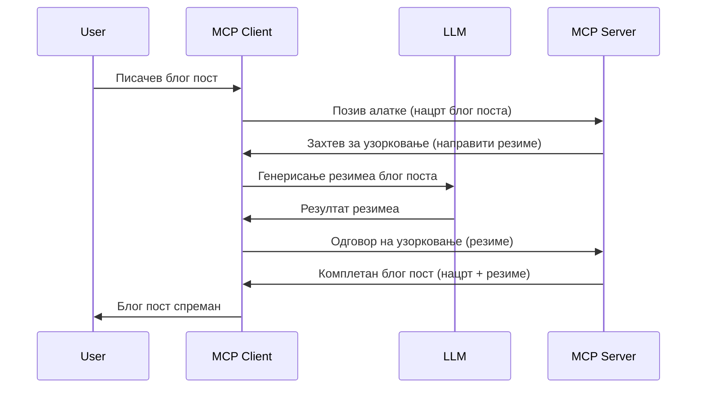

> [!WARNING]
> Узорковање је деприковано у MCP `2026-07-28`. Овај час је сачуван за
> стара имплементације. Нови сервери треба да интегришу директно са LLM
> провајдером API.

# Узорковање - делегирање функција Клијенту

> Узорковање остаје у спецификацији `2026-07-28` ради компатибилности и
> може бити уклоњено у првој ревизији објављеној на или након 28. јула,
> 2027. Примери у овом часу могу користити SDK API који имплементира `2025-11-25`.
> Погледајте [Шта је ново у MCP: Спецификација 2026-07-28](../../01-CoreConcepts/mcp-2026-07-28.md).

У старим имплементацијама, Узорковање омогућава MCP серверу да тражи помоћ од LLM
којим управља клијент. За нове имплементације, позовите одабраног LLM провајдера
директно уместо тога.

Хајде да истражимо неке случајеве употребе и како изградити решење укључујући узорковање.

## Преглед

У овом часу фокусирамо се на објашњење када и где користити Узорковање и како га конфигурисати.

## Циљеви учења

У овом поглављу ћемо:

- Објаснити шта је Узорковање и када га користити.
- Показати како конфигурисати Узорковање у MCP.
- Пружити примере Узорковања у акцији.

## Шта је Узорковање и зашто га користити?

Узорковање је напредна функција која ради на следећи начин:



### Захтев за узорковање

У реду, сада када имамо преглед сценарија, хајде да причамо о захтеву за узорковање који сервер шаље назад клијенту. Ево како такав захтев може изгледати у JSON-RPC формату:

```json
{
  "jsonrpc": "2.0",
  "id": 1,
  "method": "sampling/createMessage",
  "params": {
    "messages": [
      {
        "role": "user",
        "content": {
          "type": "text",
          "text": "Create a blog post summary of the following blog post: <BLOG POST>"
        }
      }
    ],
    "modelPreferences": {
      "hints": [
        {
          "name": "claude-3-sonnet"
        }
      ],
      "intelligencePriority": 0.8,
      "speedPriority": 0.5
    },
    "systemPrompt": "You are a helpful assistant.",
    "maxTokens": 100
  }
}
```

Вреди истакнути неке ствари овде:

- Prompt, под content -> text, је наш упит који је упутство LLM-у да сумира садржај блог поста.

- **modelPreferences**. Овај део је само препорука, предлог конфигурације коју треба користити са LLM-ом. Корисник може да изабере да ли да следи препоруке или их мења. У овом случају постоје препоруке о моделу, брзини и приоритету интелигенције.
- **systemPrompt**, ово је уобичајени системски prompt који даје LLM-у личност и садржи упутства.
- **maxTokens**, ово је још једна особина која указује колико токена се препоручује за задатак.

### Одговор на узорковање

Овај одговор клијент на крају шаље MCP Серверу и представља резултат позива LLM-у, чекања на одговор, а затим формулисања поруке. Ево како може изгледати у JSON-RPC:

```json
{
  "jsonrpc": "2.0",
  "id": 1,
  "result": {
    "role": "assistant",
    "content": {
      "type": "text",
      "text": "Here's your abstract <ABSTRACT>"
    },
    "model": "gpt-5",
    "stopReason": "endTurn"
  }
}
```

Обратите пажњу да је одговор апстракт блог поста баш као што смо тражили. Такође приметите да коришћени `model` није онај који смо тражили већ "gpt-5" уместо "claude-3-sonnet". Ово илуструје да корисник може променити мишљење о томе шта ће користити и да је ваш захтев за узорковање препорука.

Сада када разумемо главни ток и корисну примену „креирање блог поста + апстракт“, погледајмо шта треба учинити да би радило.

### Типови порука

Поруке узорковања нису ограничене само на текст, већ можете слати и слике и аудио. Ево како JSON-RPC изгледа другачије:

**Текст**

```json
{
  "type": "text",
  "text": "The message content"
}
```

**Садржај слике**

```json
{
  "type": "image",
  "data": "base64-encoded-image-data",
  "mimeType": "image/jpeg"
}
```

**Садржај звука**

```json
{
  "type": "audio",
  "data": "base64-encoded-audio-data",
  "mimeType": "audio/wav"
}
```

> НАПОМЕНА: За тренутни статус и смернице миграције, погледајте
> [застарелу документацију о узорковању](https://modelcontextprotocol.io/specification/2026-07-28/client/sampling).

## Како конфигурисати Узорковање у Клијенту

> Напомена: ако само градите сервер, не треба пуно да радите овде.

У клијенту морате дефинисати следећу функцију овако:

```json
{
  "capabilities": {
    "sampling": {}
  }
}
```

Ово ће бити учитано када ваш одабрани клијент иницијализује везу са сервером.

## Пример Узорковања у акцији - Креирање блог поста

Кодираћемо узорковање сервера заједно, потребно је урадити следеће:

1. Креирати алат на Серверу.
1. Тај алат треба да направи захтев за узорковање
1. Алат треба да сачека одговор на клијентов захтев за узорковање.
1. Затим треба произвести резултат алата.

Погледајмо код корак по корак:

### -1- Креирање алата

**python**

```python
@mcp.tool()
async def create_blog(title: str, content: str, ctx: Context[ServerSession, None]) -> str:
    """Create a blog post and generate a summary"""

```

### -2- Креирање захтева за узорковање

Проширите свој алат следећим кодом:

**python**

```python
post = BlogPost(
        id=len(posts) + 1,
        title=title,
        content=content,
        abstract=""
    )

prompt = f"Create an abstract of the following blog post: title: {title} and draft: {content} "

result = await ctx.session.create_message(
        messages=[
            SamplingMessage(
                role="user",
                content=TextContent(type="text", text=prompt),
            )
        ],
        max_tokens=100,
)

```

### -3- Чекање на одговор и повратак одговора

**python**

```python
post.abstract = result.content.text

posts.append(post)

# врати комплетан производ
return json.dumps({
    "id": post.title,
    "abstract": post.abstract
})
```

### -4- Комплетан код

**python**

```python
from starlette.applications import Starlette
from starlette.routing import Mount, Host

from mcp.server.fastmcp import Context, FastMCP

from mcp.server.session import ServerSession
from mcp.types import SamplingMessage, TextContent

import json


from uuid import uuid4
from typing import List
from pydantic import BaseModel


mcp = FastMCP("Blog post generator")

# app = FastAPI()

posts = []

class BlogPost(BaseModel):
    id: int
    title: str
    content: str
    abstract: str

posts: List[BlogPost] = []

@mcp.tool()
async def create_blog(title: str, content: str, ctx: Context[ServerSession, None]) -> str:
    """Create a blog post and generate a summary"""

    post = BlogPost(
        id=len(posts) + 1,
        title=title,
        content=content,
        abstract=""
    )

    prompt = f"Create an abstract of the following blog post: title: {title} and draft: {content} "

    result = await ctx.session.create_message(
        messages=[
            SamplingMessage(
                role="user",
                content=TextContent(type="text", text=prompt),
            )
        ],
        max_tokens=100,
    )

    post.abstract = result.content.text

    posts.append(post)

    # врати цео блог пост
    return json.dumps({
        "id": post.title,
        "abstract": post.abstract
    })

if __name__ == "__main__":
    print("Starting server...")
    # mcp.run()
    mcp.run(transport="streamable-http")

# покрени апликацију са: python server.py
```

### -5- Тестирање у Visual Studio Code

Да бисте тестирали ово у Visual Studio Code, урадите следеће:

1. Покрените сервер у терминалу
1. Додајте га у *mcp.json* (и проверите да ли је покренут), нешто овако:

   ```json
   "servers": {
      "blog-server": {
        "type": "http",
        "url": "http://localhost:8000/mcp"
      }
   }
   ```

1. Укуцајте упит:

   ```text
   create a blog post named "Where Python comes from", the content is "Python is actually named after Monty Python Flying Circus"
   ```

1. Дозволите да узорковање тече. Први пут када тестирате ово, појавиће вам се додатни дијалог који морате прихватити, а затим ћете видети нормалан дијалог за покретање алата.

1. Прегледајте резултате. Видећете резултате лепо приказане у GitHub Copilot Chat али можете прегледати и сирови JSON одговор.

**Бонус**. Visual Studio Code има одличну подршку за узорковање. Можете конфигурисати приступ узорковању на инсталираном серверу тако што ћете отићи у:

1. Одељак за екстензије.
1. Изаберите икону зупчаника за ваш инсталирани сервер у секцији "MCP SERVERS - INSTALLED".
1 Изаберите "Configure Model Access", овде можете изабрати које Моделе GitHub Copilot сме да користи приликом узорковања. Такође можете видети све захтеве за узорковање који су недавно направљени кликом на "Show Sampling requests".

## Задатак

У овом задатку ћете изградити нешто другачије Узорковање, тачније интеграцију за узорковање која подржава генерисање описа производа. Ево вашег сценарија:

**Сценарио**: Запослени у беку е-комерца треба помоћ јер генерисање описа производа захтева превише времена. Због тога треба да изградите решење где можете позвати алат "create_product" са аргументима "title" и "keywords", а он треба да произведе цео производ укључујући поље "description" које треба да попуни LLM клијента.

САВЕТ: искористите оно што сте раније научили да конструишете овај сервер и његов алат користећи захтев за узорковање.

## Решење

[Решење](./solution/README.md)

## Кључне појмови

Узорковање је моћна функција која омогућава серверу да делегира задатке клијенту када му је потребна помоћ LLM-а.

## Шта следи

- [Поглавље 4 - Практична имплементација](../../04-PracticalImplementation/README.md)

---

<!-- CO-OP TRANSLATOR DISCLAIMER START -->
**Изјава о одрицању одговорности**:
Овај документ је преведен коришћењем услуге за аутоматски превод [Co-op Translator](https://github.com/Azure/co-op-translator). Иако тежимо тачности, имајте у виду да аутоматски преводи могу садржати грешке или нетачности. Оригинални документ на његовом изворном језику треба сматрати ауторитативним извором. За критичне информације препоручује се професионални људски превод. Нисмо одговорни за било каква неспоразума или погрешна тумачења која произилазе из коришћења овог превода.
<!-- CO-OP TRANSLATOR DISCLAIMER END -->