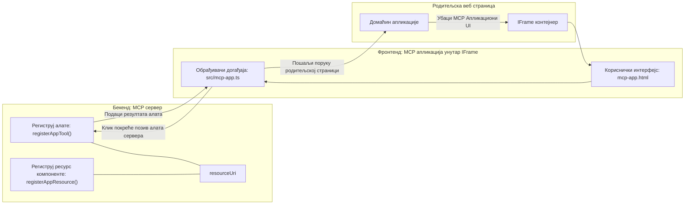
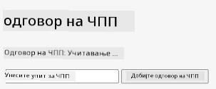
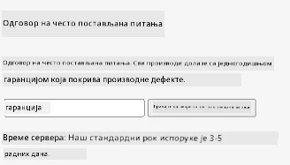
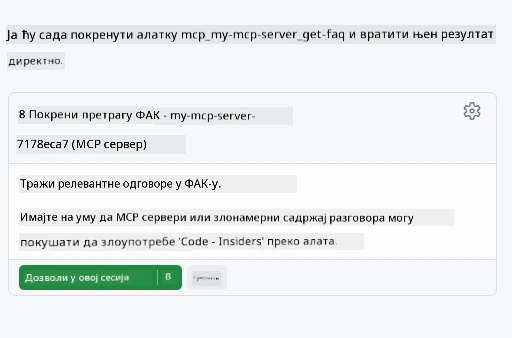

# MCP апликације

MCP апликације представљају нову парадигму у MCP-у. Идеја је да не само да одговорите са подацима након позива алата, већ и да пружите информацију о томе како треба интерактивно радити са тим информацијама. То значи да резултати алата сада могу садржати и информације о корисничком интерфејсу. Зашто бисмо то желели? Па, размислите како то радите данас. Веројатно користите резултате MCP сервера тако што испред њега стављате неки фронтенд, што је код који треба да напишете и одржавате. Понекад је то управо оно што желите, али понекад би било одлично ако бисте могли само да донесете исечак информација који је самосталан и који има све, од података до корисничког интерфејса.

## Преглед

Ова лекција пружа практичне смернице о MCP апликацијама, како започети са њима и како их интегрисати у ваше постојеће веб апликације. MCP апликације су веома нови додатак MCP стандарду.

## Циљеви учења

До краја ове лекције бићете у стању да:

- Објасните шта су MCP апликације.
- Када користити MCP апликације.
- Креирате и интегришете своје MCP апликације.

## MCP апликације - како функционишу

Идеја MCP апликација је да се пружи одговор који је у суштини компонента за рендеровање. Та компонента може имати и визуелне елементе и интерактивност, нпр. клик на дугмад, унос корисника и сл. Почнимо са серверском страном и нашим MCP сервером. Да бисте креирали MCP апликацију потребно је направити алат али и ресурс апликације. Та два дела су повезана путем resourceUri.

Ево једног примера. Покушајмо визуелно приказати шта је укључено и која део шта ради:

```text
server.ts -- responsible for registering tools and the component as a UI component
src/
  mcp-app.ts -- wiring up event handlers
mcp-app.html -- the user interface
```

Ова визулаизација описује архитектуру за креирање компоненте и њену логику.


Покушајмо описати одговорности за backend и frontend респективно.

### Backend

Постоје две ствари које треба овде испунити:

- Регистрација алата са којима желимо да интерагујемо.
- Дефинисање компоненте.

**Регистрација алата**

```typescript
registerAppTool(
    server,
    "get-time",
    {
      title: "Get Time",
      description: "Returns the current server time.",
      inputSchema: {},
      _meta: { ui: { resourceUri } }, // Повезује овај алат са његовим UI ресурсом
    },
    async () => {
      const time = new Date().toISOString();
      return { content: [{ type: "text", text: time }] };
    },
  );

```

Претходни код описује понашање, где се изложи алат под називом `get-time`. Он нема уносе али на крају враћа тренутно време. Имамо могућност да дефинишемо `inputSchema` за алате код којих треба прихватити кориснички унос.

**Регистрација компоненте**

У истој датотеци, такође треба регистровати компоненту:

```typescript
const resourceUri = "ui://get-time/mcp-app.html";

// Региструј ресурс, који враћа упаковани HTML/JavaScript за кориснички интерфејс.
registerAppResource(
  server,
  resourceUri,
  resourceUri,
  { mimeType: RESOURCE_MIME_TYPE },
  async () => {
    const html = await fs.readFile(path.join(DIST_DIR, "mcp-app.html"), "utf-8");

    return {
    contents: [
        { uri: resourceUri, mimeType: RESOURCE_MIME_TYPE, text: html },
    ],
    };
  },
);
```

Обратите пажњу како помињемо `resourceUri` да бисмо повезали компоненту са њеним алатима. Такође је интересантна функција повратног позива којом учитавамо UI датотеку и враћамо компоненту.

### Frontend компоненте

Као и код backend-а, постоје два дела:

- Фронтенд написан у чистом HTML-у.
- Код који обрађује догађаје и шта урадити, нпр. позив алата или слање порука родитељском прозору.

**Кориснички интерфејс**

Погледајмо кориснички интерфејс.

```html
<!-- mcp-app.html -->
<!DOCTYPE html>
<html lang="en">
  <head>
    <meta charset="UTF-8" />
    <title>Get Time App</title>
  </head>
  <body>
    <p>
      <strong>Server Time:</strong> <code id="server-time">Loading...</code>
    </p>
    <button id="get-time-btn">Get Server Time</button>
    <script type="module" src="/src/mcp-app.ts"></script>
  </body>
</html>
```

**Повезивање догађаја**

Последњи део је повезивање догађаја. То значи да идентификујемо који део UI треба обработнике догађаја и шта урадити ако догађаји буду покренути:

```typescript
// mcp-app.ts

import { App } from "@modelcontextprotocol/ext-apps";

// Добити референце елемената
const serverTimeEl = document.getElementById("server-time")!;
const getTimeBtn = document.getElementById("get-time-btn")!;

// Креирати инстанцу апликације
const app = new App({ name: "Get Time App", version: "1.0.0" });

// Обрадити резултате алата са сервера. Поставити пре `app.connect()` да се избегне
// губитак почетног резултата алата.
app.ontoolresult = (result) => {
  const time = result.content?.find((c) => c.type === "text")?.text;
  serverTimeEl.textContent = time ?? "[ERROR]";
};

// Повезати клик на дугме
getTimeBtn.addEventListener("click", async () => {
  // `app.callServerTool()` омогућава интерфејсу да затражи свеже податке са сервера
  const result = await app.callServerTool({ name: "get-time", arguments: {} });
  const time = result.content?.find((c) => c.type === "text")?.text;
  serverTimeEl.textContent = time ?? "[ERROR]";
});

// Повезати се на хоста
app.connect();
```

Као што видите, ово је нормалан код за повезивање DOM елемената са догађајима. Вреди поменути позив `callServerTool` који на крају позива алат на backend-у.

## Рад са корисничким уносом

До сада смо видели компоненту која има дугме које при клику позива алат. Хајде да видимо да ли можемо додати још UI елемената, као уносно поље и послати аргументе алату. Хајде да имплементирамо FAQ функционалност. Ево како треба да ради:

- Треба да постоји дугме и уносно поље у које корисник укуца кључну реч за претрагу, на пример "Shipping". Ово треба да позове алат на backend-у који тражи у FAQ подацима.
- Алат који подржава поменуту FAQ претрагу.

Прво додајмо потребну подршку backend-у:

```typescript
const faq: { [key: string]: string } = {
    "shipping": "Our standard shipping time is 3-5 business days.",
    "return policy": "You can return any item within 30 days of purchase.",
    "warranty": "All products come with a 1-year warranty covering manufacturing defects.",
  }

registerAppTool(
    server,
    "get-faq",
    {
      title: "Search FAQ",
      description: "Searches the FAQ for relevant answers.",
      inputSchema: zod.object({
        query: zod.string().default("shipping"),
      }),
      _meta: { ui: { resourceUri: faqResourceUri } }, // Повеzuje овај алат са његовим UI ресурсом
    },
    async ({ query }) => {
      const answer: string = faq[query.toLowerCase()] || "Sorry, I don't have an answer for that.";
      return { content: [{ type: "text", text: answer }] };
    },
  );
```

Оно што видимо овде је како попуњавамо `inputSchema` и давамо му `zod` схемy овако:

```typescript
inputSchema: zod.object({
  query: zod.string().default("shipping"),
})
```

У горе наведеном схематском опису декларирамо да имамо улазни параметар зван `query` који је опционо поље са подразумеваном вредношћу "shipping".

У реду, идемо даље на *mcp-app.html* да видимо који UI треба да направимо за ову сврху:

```html
<div class="faq">
    <h1>FAQ response</h1>
    <p>FAQ Response: <code id="faq-response">Loading...</code></p>
    <input type="text" id="faq-query" placeholder="Enter FAQ query" />
    <button id="get-faq-btn">Get FAQ Response</button>
  </div>
```

Одлично, сада имамо уносно поље и дугме. Идемо у *mcp-app.ts* да повежемо ове догађаје:

```typescript
const getFaqBtn = document.getElementById("get-faq-btn")!;
const faqQueryInput = document.getElementById("faq-query") as HTMLInputElement;

getFaqBtn.addEventListener("click", async () => {
  const query = faqQueryInput.value;
  const result = await app.callServerTool({ name: "get-faq", arguments: { query } });
  const faq = result.content?.find((c) => c.type === "text")?.text;
  faqResponseEl.textContent = faq ?? "[ERROR]";
});
```

У коду изнад:

- Направили смо референце на занимљиве UI елементе.
- Обрадио клик на дугме тако што смо извадили вредност из уносног поља и позвали `app.callServerTool()` са `name` и `arguments` где задњи прослеђује `query` као вредност.

Шта се заправо дешава када позовете `callServerTool` јесте да шаље поруку родитељском прозору, а тај прозор на крају позива MCP сервер.

### Испробајте

Ако ово испробамо требало би да видимо следеће:



и ево пример како ради са уносом као што је "warranty"



За покретање овог кода, идите у [Code секцију](./code/README.md)

## Тестирање у Visual Studio Code-у

Visual Studio Code има одличну подршку за MVP апликације и вероватно је један од најлакших начина за тестирање ваших MCP апликација. Да бисте користили Visual Studio Code, додајте сервер унос у *mcp.json* овако:

```json
"my-mcp-server-7178eca7": {
    "url": "http://localhost:3001/mcp",
    "type": "http"
  }
```

Онда покрените сервер, требало би да можете да комуницирате са својом MVP апликацијом преко прозора за ћаскање ако имате инсталиран GitHub Copilot.

то радите тако што покренете упит, на пример "#get-faq":



и као што је случај када сте покренули кроз веб прегледач, исти начин рендеровања изгледа овако:


## Задатак

Направите игру камен, папир, маказе која треба да се састоји од следећег:

UI:

- падајућа листа са опцијама
- дугме за слање избора
- ознака која показује ко је шта одабрао и ко је победио

Сервер:

- треба да има алат камен, папир, маказе који као унос узима "choice". Такође треба да генерише избор компјутера и одреди победника

## Решење

[Решење](./assignment/README.md)

## Резиме

Учили смо о овој новој парадигми MCP апликација. То је нова парадигма која омогућава MCP серверима да имају мишљење не само о подацима већ и о томе како ти подаци треба да се прикажу.

Поред тога, сазнали смо да су ове MCP апликације уграђене у IFrame и да за комуникацију са MCP серверима морају слати поруке родитељској веб апликацији. Постоји неколико библиотека за обичан JavaScript и React и друге које олакшавају ову комуникацију.

## Кључне поуке

Ево шта сте научили:

- MCP апликације су нови стандард који може бити користан када желите да испоручите и податке и карактеристике корисничког интерфејса.
- Ове врсте апликација се из безбедносних разлога извршавају у IFrame-у.

## Шта следи

- [Поглавље 4](../../04-PracticalImplementation/README.md)

---

<!-- CO-OP TRANSLATOR DISCLAIMER START -->
**Одрицање од одговорности**:  
Овај документ је преведен коришћењем AI сервиса за превођење [Co-op Translator](https://github.com/Azure/co-op-translator). Иако тежимо прецизности, молимо вас да имате у виду да аутоматски преводи могу садржати грешке или нетачности. Изворни документ на његовом оригиналном језику треба сматрати ауторитетним извором. За критичне информације препоручује се професионални превод од стране људи. Нисмо одговорни за било каква неспоразума или неправилна тумачења која могу настати употребом овог превода.
<!-- CO-OP TRANSLATOR DISCLAIMER END -->