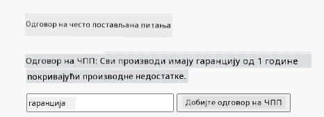
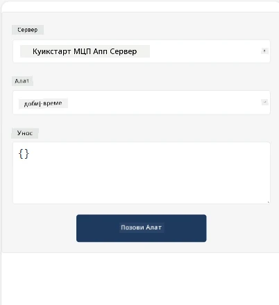
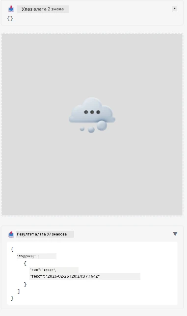

Ево примера који демонстрира MCP Апликацију

## Инсталација

1. Идите у фасциклу *mcp-app*  
1. Покрените `npm install`, ово треба да инсталира фронтенд и бекенд зависности

Проверите да ли се бекенд компајлира покретањем:

```sh
npx tsc --noEmit
```
  
Не би требало бити излаза ако је све у реду.

## Покретање бекенда

> Ово захтева мало додатног рада ако сте на Виндоус машини јер MCP Apps решење користи `concurrently` библиотеку коју треба заменити. Ево спорне линије у *package.json* у MCP Апликацији:

    ```json
    "start": "concurrently \"cross-env NODE_ENV=development INPUT=mcp-app.html vite build --watch\" \"tsx watch main.ts\""
    ```

Ова апликација има два дела, бекенд део и хост део.

Покрените бекенд позивом:

```sh
npm start
```
  
Ово би требало да покрене бекенд на `http://localhost:3001/mcp`.

> Напомена, ако сте у Codespace-у, можда ћете морати да подесите видљивост порта на јавну. Проверите да ли можете приступити крајњој тачки у прегледачу преко https://<име Codespace-а>.app.github.dev/mcp

## Опција -1 Тестирање апликације у Visual Studio Code

Да бисте тестирали решење у Visual Studio Code-у, урадите следеће:

- Додајте упис сервера у `mcp.json` овако:

    ```json
    {
        "servers": {
            "my-mcp-server-7178eca7": {
                "url": "http://localhost:3001/mcp",
                "type": "http"
            }
        },
        "inputs": []
    }
    ```
  
1. Кликните на дугме "start" у *mcp.json*  
1. Уверите се да је прозор за ћаскање отворен и укуцајте `get-faq`, требало би да видите резултат овако:

    

## Опција -2- Тестирање апликације са хостом

Репозиторијум <https://github.com/modelcontextprotocol/ext-apps> садржи више различитих хостова које можете користити за тестирање ваших MVP Апликација.

Овде ћемо вам представити две различите опције:

### Локална машина

- Идите у фасциклу *ext-apps* након што клоните репо.

- Инсталирајте зависности

   ```sh
   npm install
   ```
  
- У другом терминал прозору идите у *ext-apps/examples/basic-host*

    > ако сте у Codespace-у, потребно је да одете до serve.ts и линије 27 и замените http://localhost:3001/mcp са вашим Codespace URL-ом за бекенд, на пример https://psychic-xylophone-657rpjgvxpc5g64-3001.app.github.dev/mcp

- Покрените хост:

    ```sh
    npm start
    ```
  
    Ово би требало да повеже хост са бекендом и требало би да видите апликацију како ради овако:

    

### Codespace

Потребно је мало додатног рада да се подеси Codespace окружење. Да користите хост преко Codespace-а:

- Погледајте фасциклу *ext-apps* и идите у *examples/basic-host*.  
- Покрените `npm install` да инсталирате зависности  
- Покрените `npm start` да стартујете хост.

## Тестирање апликације

Испробајте апликацију на следећи начин:

- Изаберите дугме "Call Tool" и требало би да видите резултате овако:

    

Одлично, све ради.

---

<!-- CO-OP TRANSLATOR DISCLAIMER START -->
**Одрицање од одговорности**:
Овај документ је преведен коришћењем AI сервиса за превођење [Co-op Translator](https://github.com/Azure/co-op-translator). Иако се трудимо да превод буде тачан, молимо имајте у виду да аутоматски преводи могу садржати грешке или нетачности. Оригинални документ на његовом изворном језику треба сматрати ауторитетним извором. За критичне информације препоручује се професионални људски превод. Нисмо одговорни за било каква неспоразума или погрешна тумачења која произилазе из употребе овог превода.
<!-- CO-OP TRANSLATOR DISCLAIMER END -->