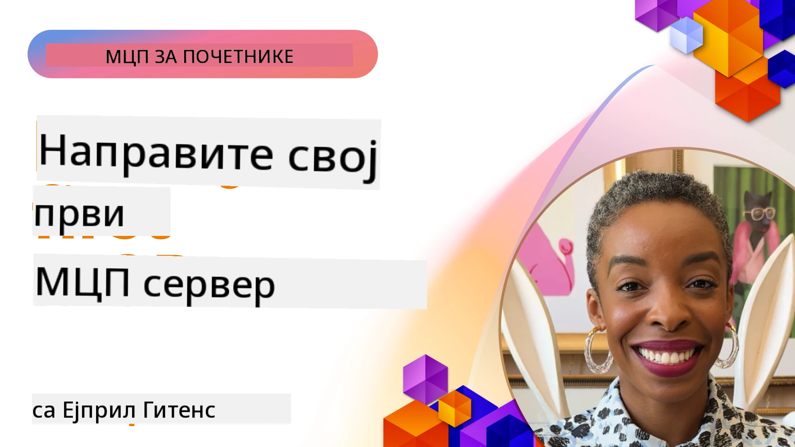

## Почетак рада  

_(Кликните слику изнад да бисте погледали видео о овој лекцији)_

Овај одељак састоји се од неколико лекција:

- **1 Ваш први сервер**, у овој првој лекцији научићете како да креирате свој први сервер и испитате га са инспектор алатом, вредан начин да тестирате и отклањате грешке на вашем серверу, [на лекцију](01-first-server/README.md)

- **2 Клијент**, у овој лекцији научићете како да напишете клијента који може да се повеже са вашим сервером, [на лекцију](02-client/README.md)

- **3 Клијент са LLM-ом**, још бољи начин писања клијента је додавањем LLM-а како би могао да "преговара" са вашим сервером шта да ради, [на лекцију](03-llm-client/README.md)

- **4 Конзумирање сервера у GitHub Copilot Agent режиму у Visual Studio Code-у**. Овде ћемо погледати покретање нашег MCP сервера изнутра Visual Studio Code-а, [на лекцију](04-vscode/README.md)

- **5 stdio Transport Server** stdio транспорт је препоручени стандард за локалну MCP комуникацију сервер-клијент, обезбеђујући сигурну комуникацију базирану на подпроцесима са унутрашњом изолацијом процеса [на лекцију](05-stdio-server/README.md)

- **6 HTTP стриминг са MCP (Streamable HTTP)**. Научите о модерном HTTP стриминг транспортном слоју (препоручен приступ за удаљене MCP сервере према [MCP спецификацији 2025-11-25](https://spec.modelcontextprotocol.io/specification/2025-11-25/basic/transports/#streamable-http)), обавештењима о напретку и како имплементирати скалабилне, реално-временске MCP сервере и клијенте користећи Streamable HTTP. [на лекцију](06-http-streaming/README.md)

- **7 Коришћење AI Toolkit-а за VSCode** за конзумирање и тестирање ваших MCP клијената и сервера [на лекцију](07-aitk/README.md)

- **8 Тестирање**. Овде ћемо се фокусирати посебно како можемо тестирати наш сервер и клијент на различите начине, [на лекцију](08-testing/README.md)

- **9 Деплојмент**. Овај одељак ће погледати различите начине распоређивања ваших MCP решења, [на лекцију](09-deployment/README.md)

- **10 Напредна употреба сервера**. Овај одељак покрива напредну употребу сервера, [на лекцију](./10-advanced/README.md)

- **11 Аутентикација**. Овај одељак покрива како додати једноставну аутентификацију, од Basic Auth до коришћења JWT и RBAC. Препоручује се да почнете овде, а затим погледате Напредне теме у Поглављу 5 и извршите додатно јачање безбедности преко препорука у Поглављу 2, [на лекцију](./11-simple-auth/README.md)

- **12 MCP хостови**. Конфигуришите и користите популарне MCP хост клијенте укључујући Claude Desktop, Cursor, Cline, и Windsurf. Научите типове транспорта и решавање проблема, [на лекцију](./12-mcp-hosts/README.md)

- **13 MCP инспектор**. Отklonite и тестирајте ваше MCP сервере интерактивно користећи MCP инспектор алат. Научите како отклањати проблеме са алатима, ресурсима и протоколским порукама, [на лекцију](./13-mcp-inspector/README.md)

- **14 Снимање узорака**. Креирајте MCP сервере који сарађују са MCP клијентима на задацима везаним за LLM-ове. [на лекцију](./14-sampling/README.md)

- **15 MCP апликације**. Правите MCP сервере који такође одговарају са UI упутствима, [на лекцију](./15-mcp-apps/README.md)

Model Context Protocol (MCP) је отворени протокол који стандардизује начин на који апликације пружају контекст LLM-овима. Замислите MCP као USB-C порт за AI апликације - он пружа стандардизован начин повезивања AI модела са различитим изворима података и алаткама.

## Циљеви учења

До краја ове лекције моћи ћете да:

- Подесите развојна окружења за MCP у C#, Јави, Пајтону, TypeScript и JavaScript
- Направите и распоредите основне MCP сервере са јединственим функцијама (ресурси, промптови и алати)
- Креирате хост апликације које се повезују на MCP сервере
- Тестирате и дебагујете MCP имплементације
- Разумете честе изазове подешавања и њихова решења
- Повежете своје MCP имплементације са популарним LLM сервисима

## Подешавање вашег MCP окружења

Пре него што почнете да радите са MCP, важно је да припремите своје развојно окружење и разумете основни ток рада. Овај одељак ће вас провести кроз почетне кораке подешавања како бисте обезбедили гласан почетак са MCP.

### Захтеви

Пре него што зароните у развој MCP-а, уверите се да имате:

- **Развојно окружење**: За ваш одабрани језик (C#, Јава, Пајтон, TypeScript или JavaScript)
- **IDE/Едитор**: Visual Studio, Visual Studio Code, IntelliJ, Eclipse, PyCharm или било који модеран едитор кода
- **Менаџери пакета**: NuGet, Maven/Gradle, pip или npm/yarn
- **API кључеве**: За све AI сервисе које планирате да користите у вашим хост апликацијама

### Званични SDK-и

У наредним поглављима видећете решења изграђена коришћењем Python-а, TypeScript-а, Јаве и .NET-а. Ево свих званично подржаних SDK-ова.

MCP пружа званичне SDK-ове за више језика (усклађено са [MCP спецификацијом 2025-11-25](https://spec.modelcontextprotocol.io/specification/2025-11-25/)):
- [C# SDK](https://github.com/modelcontextprotocol/csharp-sdk) - Одржава се у сарадњи са Microsoft-ом
- [Java SDK](https://github.com/modelcontextprotocol/java-sdk) - Одржава се у сарадњи са Spring AI
- [TypeScript SDK](https://github.com/modelcontextprotocol/typescript-sdk) - Званична TypeScript имплементација
- [Python SDK](https://github.com/modelcontextprotocol/python-sdk) - Званична Python имплементација (FastMCP)
- [Kotlin SDK](https://github.com/modelcontextprotocol/kotlin-sdk) - Званична Kotlin имплементација
- [Swift SDK](https://github.com/modelcontextprotocol/swift-sdk) - Одржава се у сарадњи са Loopwork AI
- [Rust SDK](https://github.com/modelcontextprotocol/rust-sdk) - Званична Rust имплементација
- [Go SDK](https://github.com/modelcontextprotocol/go-sdk) - Званична Go имплементација

## Кључне поуке

- Подешавање MCP развојног окружења је једноставно уз SDK-ове специфичне за језик
- Изградња MCP сервера укључује креирање и регистрацију алата са јасним шемама
- MCP клијенти се повезују са серверима и моделима како би искористили проширене могућности
- Тестирање и дебаговање су кључни за поуздане MCP имплементације
- Опције за распоређивање крећу се од локалног развоја до решења базираних у облаку

## Практична вежба

Имамо скуп примера који допуњују вежбе које ћете видети у свим поглављима овог одељка. Додатно, свако поглавље има своје вежбе и задатке

- [Java калкулатор](./samples/java/calculator/README.md)
- [.Net калкулатор](../../../03-GettingStarted/samples/csharp)
- [JavaScript калкулатор](./samples/javascript/README.md)
- [TypeScript калкулатор](./samples/typescript/README.md)
- [Python калкулатор](../../../03-GettingStarted/samples/python)

## Додатни ресурси

- [Прављење агената коришћењем Model Context Protocol-а на Azure-у](https://learn.microsoft.com/azure/developer/ai/intro-agents-mcp)
- [Удаљени MCP са Azure Container Apps (Node.js/TypeScript/JavaScript)](https://learn.microsoft.com/samples/azure-samples/mcp-container-ts/mcp-container-ts/)
- [.NET OpenAI MCP агент](https://learn.microsoft.com/samples/azure-samples/openai-mcp-agent-dotnet/openai-mcp-agent-dotnet/)

## Шта је следеће

Започните са првом лекцијом: [Креирање вашег првог MCP сервера](01-first-server/README.md)

Када завршите овај модул, наставите са: [Модул 4: Практична имплементација](../04-PracticalImplementation/README.md)

---

<!-- CO-OP TRANSLATOR DISCLAIMER START -->
**Ограничење одговорности**:
Овај документ је преведен коришћењем AI сервиса за превод [Co-op Translator](https://github.com/Azure/co-op-translator). Иако настојимо да превод буде тачан, молимо вас да имате у виду да аутоматизовани преводи могу садржати грешке или нетачности. Оригинални документ на његовом изворном језику треба сматрати ауторитативним извором. За критичне информације препоручује се професионални људски превод. Нисмо одговорни за било какве неспоразуме или погрешна тумачења настала коришћењем овог превода.
<!-- CO-OP TRANSLATOR DISCLAIMER END -->