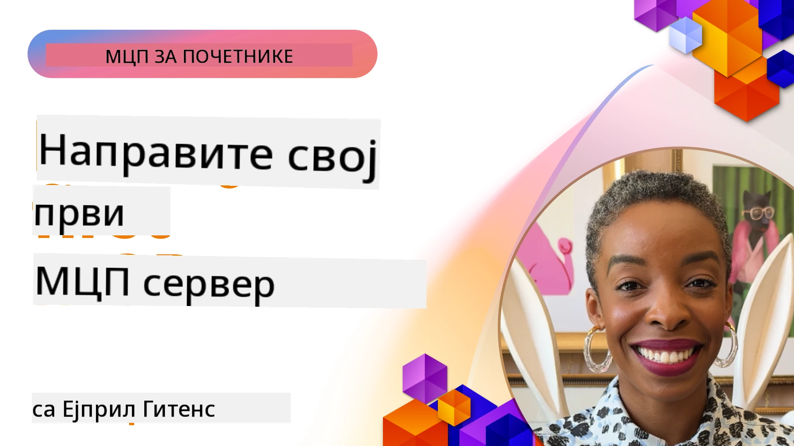

## Почетак  

_(Кликните на горњу слику да бисте погледали видео о овој лекцији)_

Овај одељак се састоји од неколико лекција:

- **1 Ваш први сервер**, у овој првој лекцији ћете научити како да направите свој први сервер и прегледате га помоћу инструмента инспектора, вредан начин за тестирање и отклањање грешака на вашем серверу, [на лекцију](01-first-server/README.md)

- **2 Клијент**, у овој лекцији научићете како да напишете клијента који може да се повеже на ваш сервер, [на лекцију](02-client/README.md)

- **3 Клијент са LLM-ом**, још бољи начин писања клијента је додавањем LLM-а тако да може „преговарати“ са вашим сервером шта да ради, [на лекцију](03-llm-client/README.md)

- **4 Коришћење режима GitHub Copilot Агент за сервер у Visual Studio Code**. Овде гледамо покретање нашег MCP сервера из Visual Studio Code, [на лекцију](04-vscode/README.md)

- **5 stdio транспортни сервер** stdio транспорт је препоручени стандард за локалну комуникацију MCP сервера и клијента, обезбеђујући сигурну комуникацију засновану на подпроцесима са уграђеном изолацијом процеса [на лекцију](05-stdio-server/README.md)

- **6 HTTP стримовање са MCP (Стримабилни HTTP)**. Научите о стандардном
	удалјенном транспорту у [MCP спецификацији 2026-07-28](https://modelcontextprotocol.io/specification/2026-07-28/basic/transports/streamable-http),
	плус легаси имплементацији заснованој на сесијама задржаној у лекцији.
	[на лекцију](06-http-streaming/README.md)

- **7 Коришћење AI комплета алата за VSCode** за употребу и тестирање ваших MCP Клијената и Сервера [на лекцију](07-aitk/README.md)

- **8 Тестирање**. Овде ћемо се посебно фокусирати на то како можемо тестирати наш сервер и клијента на различите начине, [на лекцију](08-testing/README.md)

- **9 Деплојмент**. Ово поглавље ће погледати различите начине постављања ваших MCP решења, [на лекцију](09-deployment/README.md)

- **10 Напредна употреба сервера**. Ово поглавље покрива напредну употребу сервера, [на лекцију](./10-advanced/README.md)

- **11 Аутентификација**. Ово поглавље покрива како додати једноставну аутентификацију, од Basic Auth до коришћења JWT и RBAC. Препоручује се да започнете овде, а затим погледате Напредне теме у Поглављу 5 и извршите додатно обезбеђење коришћењем препорука из Поглавља 2, [на лекцију](./11-simple-auth/README.md)

- **12 MCP хостови**. Конфигуришите и користите популарне MCP хост клијенте укључујући Claude Desktop, Cursor, Cline и Windsurf. Научите о типовима транспорта и решавању проблема, [на лекцију](./12-mcp-hosts/README.md)

- **13 MCP инспектор**. Откривајте и тестирајте ваше MCP сервере интерактивно користећи алат MCP инспектор. Научите како да решавате проблеме са алатима, ресурсима и порукама протокола, [на лекцију](./13-mcp-inspector/README.md)

- **14 Семплинг**. Научите легаси Семплинг примиитив за `2025-11-25` и
	како мигрирати нове дизајне на директну интеграцију LLM провајдера. Семплинг је
	застарео у MCP `2026-07-28`. [на лекцију](./14-sampling/README.md)

- **15 MCP апликације**. Направите MCP сервере који такође одговарају са UI упутствима, [на лекцију](./15-mcp-apps/README.md)

Протокол контекста модела (Model Context Protocol, MCP) је отворени протокол који стандардизује како апликације пружају контекст LLM-овима. Замислите MCP као USB-C порт за AI апликације - он пружа стандардизован начин да се AI модели повежу са различитим изворима података и алатима.

## Циљеви учења

На крају ове лекције, моћи ћете да:

- Подесите развојна окружења за MCP у C#, Java, Python, TypeScript и JavaScript
- Направите и деплојујете основне MCP сервере са прилагођеним функцијама (ресурси, упити и алати)
- Креирате хост апликације које се повезују са MCP серверима
- Тестирате и отклањате грешке у MCP имплементацијама
- Разумете уобичајене изазове постављања и њихова решења
- Повуците ваше MCP имплементације на популарне LLM сервисе

## Постављање MCP окружења

Пре него што почнете да радите са MCP-ом, важно је припремити ваше развојно окружење и разумети основни ток рада. Овај одељак ће вас провести кроз почетне кораке подешавања како бисте осигурали глатак почетак с MCP-ом.

### Предуслови

Пре него што зароните у MCP развој, уверите се да имате:

- **Развојно окружење**: За изабрани језик (C#, Java, Python, TypeScript или JavaScript)
- **IDE/Едитор**: Visual Studio, Visual Studio Code, IntelliJ, Eclipse, PyCharm или било који савремени уређивач кода
- **Пакет менаџери**: NuGet, Maven/Gradle, pip или npm/yarn
- **API кључеви**: За било које AI услуге које планирате да користите у вашим хост апликацијама

### Званични SDK-ови

У наредним поглављима видећете решења направљена коришћењем Python, TypeScript,
Java и .NET. Ево званичних SDK-ова.

Подршка за MCP `2026-07-28` се уводи независно по језицима.
Пре покретања примера, проверите верзију пакета и белешке о издању SDK-а
за подржане ревизије протокола. Погледајте
[званичну листу SDK-ова](https://modelcontextprotocol.io/docs/sdk):
- [C# SDK](https://github.com/modelcontextprotocol/csharp-sdk) - Одржава се у сарадњи са Microsoft-ом
- [Java SDK](https://github.com/modelcontextprotocol/java-sdk) - Одржава се у сарадњи са Spring AI
- [TypeScript SDK](https://github.com/modelcontextprotocol/typescript-sdk) - Званична TypeScript имплементација
- [Python SDK](https://github.com/modelcontextprotocol/python-sdk) - Званична Python имплементација (FastMCP)
- [Kotlin SDK](https://github.com/modelcontextprotocol/kotlin-sdk) - Званична Kotlin имплементација
- [Swift SDK](https://github.com/modelcontextprotocol/swift-sdk) - Одржава се у сарадњи са Loopwork AI
- [Rust SDK](https://github.com/modelcontextprotocol/rust-sdk) - Званична Rust имплементација
- [Go SDK](https://github.com/modelcontextprotocol/go-sdk) - Званична Go имплементација

## Кључне поуке

- Постављање MCP развојног окружења је једноставно уз SDK-ове специфичне за језик
- Изградња MCP сервера укључује креирање и регистрацију алата са јасним шемама
- MCP клијенти се повезују са серверима и моделима како би искористили проширене могућности
- Тестирање и отклањање грешака су есенцијални за поуздане MCP имплементације
- Опције за деплојмент крећу се од локалног развоја до решења у облаку

## Вежбање

Имамо сет узорака који допуњује вежбе које ћете видети у свим поглављима овог одељка. Поред тога, свако поглавље има и своје вежбе и задатке

- [Java Калькулатор](./samples/java/calculator/README.md)
- [.NET Калькулатор](../../../03-GettingStarted/samples/csharp)
- [JavaScript Калькулатор](./samples/javascript/README.md)
- [TypeScript Калькулатор](./samples/typescript/README.md)
- [Python Калькулатор](../../../03-GettingStarted/samples/python)

## Додатни ресурси

- [Прављење агената користећи Model Context Protocol на Azure](https://learn.microsoft.com/azure/developer/ai/intro-agents-mcp)
- [Удаљени MCP са Azure Container Apps (Node.js/TypeScript/JavaScript)](https://learn.microsoft.com/samples/azure-samples/mcp-container-ts/mcp-container-ts/)
- [.NET OpenAI MCP агент](https://learn.microsoft.com/samples/azure-samples/openai-mcp-agent-dotnet/openai-mcp-agent-dotnet/)

## Шта даље

Почните са првом лекцијом: [Прављење вашег првог MCP сервера](01-first-server/README.md)

Када завршите овај модул, наставите са: [Модул 4: Практична имплементација](../04-PracticalImplementation/README.md)

---

<!-- CO-OP TRANSLATOR DISCLAIMER START -->
**Изјава о одрицању одговорности**:
Овај документ је преведен коришћењем услуге за аутоматски превод [Co-op Translator](https://github.com/Azure/co-op-translator). Иако тежимо тачности, имајте у виду да аутоматски преводи могу садржати грешке или нетачности. Оригинални документ на његовом изворном језику треба сматрати ауторитативним извором. За критичне информације препоручује се професионални људски превод. Нисмо одговорни за било каква неспоразума или погрешна тумачења која произилазе из коришћења овог превода.
<!-- CO-OP TRANSLATOR DISCLAIMER END -->