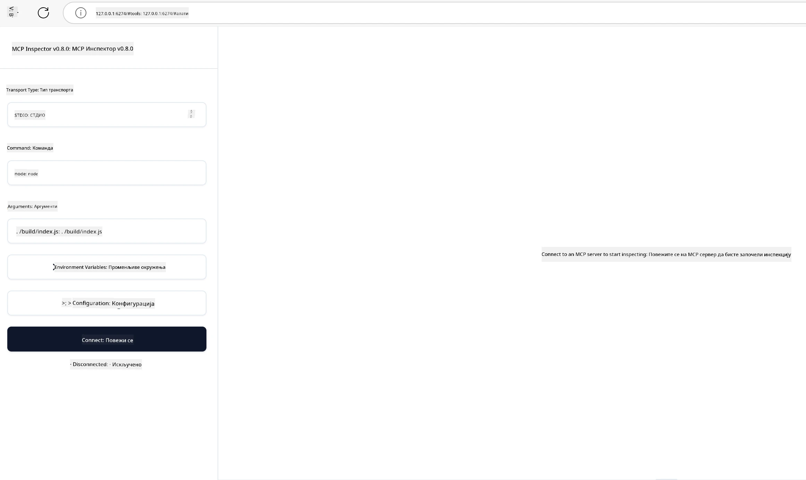

# Практична имплементација

[](https://youtu.be/vCN9-mKBDfQ)

_(Кликните на слику изнад да бисте погледали видео о овој лекцији)_

Практична имплементација је место где моћ Model Context Protocol (MCP) постаје опипљива. Док разумевање теорије и архитектуре иза MCP-а је важно, права вредност се појављује када примените ове концепте за изградњу, тестирање и имплементацију решења која решавају стварне проблеме. Ово поглавље премошћује јаз између концептуалног знања и практичног развоја, водећи вас кроз процес оживљавања апликација заснованих на MCP-у.

Без обзира да ли развијате интелигентне асистенте, интегришете вештачку интелигенцију у пословне токове, или правите прилагођене алате за обраду података, MCP пружа прилагодљиву основу. Његов дизајн без обзира на језик и званични SDK-ови за популарне програмске језике чине га приступачним широком спектру програмера. Искоришћавајући ове SDK-ове, можете брзо правити прототипове, итеративно радити и скалирати ваша решења на различитим платформама и окружењима.

У наредним одељцима наћи ћете практичне примере, узорке кода и стратегије имплементације које показују како применити MCP у C#, Java са Spring-ом, TypeScript-у, JavaScript-у и Python-у. Такође ћете научити како да исправљате грешке и тестирате MCP сервере, управљате API-јима и имплементирате решења у облак користећи Azure. Ови ресурси за практичан рад су дизајнирани да убрзају ваше учење и помогну вам да самоуверено изградите робусне, спремне за производњу MCP апликације.

## Преглед

Ова лекција се фокусира на практичне аспекте имплементације MCP-а у више програмских језика. Истражићемо како користити MCP SDK-ове у C#, Java са Spring-ом, TypeScript-у, JavaScript-у и Python-у за изградњу робусних апликација, исправљање грешака и тестирање MCP сервера, и креирање поновно употребљивих ресурса, подстицаја и алата.

## Циљеви учења

До краја ове лекције моћи ћете да:

- Имплементирате MCP решења користећи званичне SDK-ове у различитим програмским језицима
- Систематски исправљате грешке и тестирате MCP сервере
- Креирате и користите функције сервера (Ресурсе, Подстицаје и Алате)
- Дизајнирате ефикасне MCP токове рада за сложене задатке
- Оптимизујете MCP имплементације за перформансе и поузданост

## Званични ресурси SDK-а

Model Context Protocol нуди званичне SDK-ове за више језика (усклађено са [MCP спецификацијом 2025-11-25](https://spec.modelcontextprotocol.io/specification/2025-11-25/)):

- [C# SDK](https://github.com/modelcontextprotocol/csharp-sdk)
- [Java са Spring SDK](https://github.com/modelcontextprotocol/java-sdk) **Напомена:** захтева зависност од [Project Reactor](https://projectreactor.io). (Погледајте [дискусију issue 246](https://github.com/orgs/modelcontextprotocol/discussions/246).)
- [TypeScript SDK](https://github.com/modelcontextprotocol/typescript-sdk)
- [Python SDK](https://github.com/modelcontextprotocol/python-sdk)
- [Kotlin SDK](https://github.com/modelcontextprotocol/kotlin-sdk)
- [Go SDK](https://github.com/modelcontextprotocol/go-sdk)

## Рад са MCP SDK-овима

Овај одељак пружа практичне примере имплементације MCP-а у више програмских језика. Можете пронаћи узорке кода у директоријуму `samples` организоване по језицима.

### Доступни узорци

Репозиторијум укључује [узорке имплементација](../../../04-PracticalImplementation/samples) у следећим језицима:

- [C#](./samples/csharp/README.md)
- [Java са Spring-ом](./samples/java/containerapp/README.md)
- [TypeScript](./samples/typescript/README.md)
- [JavaScript](./samples/javascript/README.md)
- [Python](./samples/python/README.md)

Сваки узорак демонстрира кључне MCP концепте и паттерне имплементације за тај одређени језик и екосистем.

### Практични водичи

Додатни водичи за практичну имплементацију MCP-а:

- [Пагинација и велики скупови резултата](./pagination/README.md) - Рад са пагинацијом заснованом на курсорима за алате, ресурсе и велике скупове података

## Кључне функције сервера

MCP сервери могу имплементирати било коју комбинацију ових функција:

### Ресурси

Ресурси пружају контекст и податке које корисник или AI модел може користити:

- Репозиторијуми докумената
- Базе знања
- Структурирани извори података
- Фајл системи

### Подстицаји (Prompts)

Подстицаји су шаблонизоване поруке и токови рада за кориснике:

- Унапред дефинисани шаблони разговора
- Вођени обрасци интеракције
- Специјализоване структуре дијалога

### Алатке

Алатке су функције које AI модел може извршити:

- Утилити за обраду података
- Интеграције са екстерним API-јима
- Израчунавајуће могућности
- Претраживачка функционалност

## Узорци имплементације: C# Имплементација

Званични C# SDK репозиторијум садржи неколико узорака имплементације који демонстрирају различите аспекте MCP-а:

- **Основни MCP клијент**: Једноставан пример који показује како креирати MCP клијента и позивати алате
- **Основни MCP сервер**: Минимална имплементација сервера са основном регистрацијом алата
- **Напредни MCP сервер**: Пуноправни сервер са регистрацијом алата, аутентификацијом и обрадом грешака
- **ASP.NET интеграција**: Примери који демонстрирају интеграцију са ASP.NET Core
- **Обрасци имплементације алата**: Различити модели за имплементацију алата са различитим нивоима комплексности

MCP C# SDK је у прегледу (preview) и API-ји могу да се мењају. Континуирано ћемо ажурирати овај блог како SDK буде еволуирао.

### Кључне функције

- [C# MCP Nuget ModelContextProtocol](https://www.nuget.org/packages/ModelContextProtocol)
- Изградња вашег [првог MCP сервера](https://devblogs.microsoft.com/dotnet/build-a-model-context-protocol-mcp-server-in-csharp/).

За комплетне узорке C# имплементација, посетите [званични репозиторијум узорака C# SDK-а](https://github.com/modelcontextprotocol/csharp-sdk)

## Узорак имплементације: Java са Spring Имплементација

Java са Spring SDK нуди робусне опције имплементације MCP-а са функцијама предвиђеним за ентерпрајз

### Кључне функције

- Интеграција са Spring Framework-ом
- Јака типска сигурност
- Подршка реактивном програмирању
- Комплетна обрада грешака

За комплетан узорак имплементације Java са Spring, погледајте [Java са Spring узорак](samples/java/containerapp/README.md) у директоријуму узорака.

## Узорак имплементације: JavaScript Имплементација

JavaScript SDK пружа лаган и флексибилан приступ имплементацији MCP-а.

### Кључне функције

- Подршка за Node.js и прегледач
- API заснован на Promise-има
- Лака интеграција са Express и другим фрејмворковима
- Подршка за WebSocket за стримовање

За комплетан узорак имплементације JavaScript-а, погледајте [JavaScript узорак](samples/javascript/README.md) у директоријуму узорака.

## Узорак имплементације: Python Имплементација

Python SDK нуди Python-ски приступ MCP имплементацији са одличним интеграцијама ML фрејмворка.

### Кључне функције

- Подршка за async/await са asyncio
- Интеграција са FastAPI
- Једноставна регистрација алата
- Нативна интеграција са популарним ML библиотекама

За комплетан узорак имплементације Python-а, погледајте [Python узорак](samples/python/README.md) у директоријуму узорака.

## Управљање API-јима

Azure API Management је одличан одговор на то како можемо обезбедити MCP сервере. Идеја је да поставите Azure API Management инстанцу испред вашег MCP сервера и да јој препустите управљање функцијама које ћете вероватно желети као што су:

- ограничење брзине (rate limiting)
- управљање токенима
- мониторинг
- балансирање оптерећења
- безбедност

### Azure узорак

Ево Azure узорка који ради управо то, односно [креира MCP сервер и обезбеђује га Azure API Management-ом](https://github.com/Azure-Samples/remote-mcp-apim-functions-python).

Погледајте како се проток ауторизације одвија на следећој слици:


На претходној слици се дешава следеће:

- Аутентикација/Ауторизација се одвија коришћењем Microsoft Entra.
- Azure API Management функционише као прелаз и користи политике за усмеравење и управљање саобраћајем.
- Azure Monitor бележи све захтеве ради даље анализе.

#### Ток ауторизације

Хајде да детаљније погледамо ток ауторизације:


#### MCP спецификација ауторизације

Сазнајте више о [MCP спецификацији ауторизације](https://spec.modelcontextprotocol.io/specification/2025-11-25/basic/authorization/)

## Имплементација удаљеног MCP сервера на Azure

Погледајмо да ли можемо имплементирати узорак који смо раније споменули:

1. Клонирајте репозиторијум

    ```bash
    git clone https://github.com/Azure-Samples/remote-mcp-apim-functions-python.git
    cd remote-mcp-apim-functions-python
    ```

1. Региструјте `Microsoft.App` провајдера ресурса.

   - Ако користите Azure CLI, покрените `az provider register --namespace Microsoft.App --wait`.
   - Ако користите Azure PowerShell, покрените `Register-AzResourceProvider -ProviderNamespace Microsoft.App`. Затим након неког времена проверите статус регистрације покретањем `(Get-AzResourceProvider -ProviderNamespace Microsoft.App).RegistrationState`.

1. Покрените ову [azd](https://aka.ms/azd) команду да бисте формирали API Management сервис, function app (са кодом) и све остале потребне Azure ресурсе

    ```shell
    azd up
    ```

    Ове команде би требало да имплементирају све облачне ресурсе на Azure-у

### Тестирање вашег сервера са MCP Inspector-ом

1. У **новом прозору терминала**, инсталирајте и покрените MCP Inspector

    ```shell
    npx @modelcontextprotocol/inspector
    ```

    Требало би да видите интерфејс сличан овом:

    

1. CTRL кликните да бисте учитали MCP Inspector веб апликацију са URL-а приказаног у апликацији (нпр. [http://127.0.0.1:6274/#resources](http://127.0.0.1:6274/#resources))
1. Подесите тип транспорта на `SSE`
1. Подесите URL на ваш текући API Management SSE endpoint приказан након `azd up` и **Повежите се**:

    ```shell
    https://<apim-servicename-from-azd-output>.azure-api.net/mcp/sse
    ```

1. **Листирање алата**. Кликните на алат и **Покрените алат**.

Ако су сви кораци урађени како треба, сада би требало да будете повезани са MCP сервером и да сте успели да позовете алат.

## MCP сервери за Azure

[Remote-mcp-functions](https://github.com/Azure-Samples/remote-mcp-functions-dotnet): Овај скуп репозиторијума је образац за брз почетак изградње и имплементације прилагођених удаљених MCP (Model Context Protocol) сервера коришћењем Azure Functions са Python-ом, C# .NET-ом или Node/TypeScript-ом.

Узорци пружају комплетно решење које омогућава програмерима да:

- Граде и покрећу локално: развијају и дебагују MCP сервер на локалној машини
- Имплементирају на Azure: лако имплементирају у облак једноставном `azd up` командом
- Повежу се са клијентима: повежу се са MCP сервером са разних клијената укључујући VS Code-ов Copilot agent mode и MCP Inspector алат

### Кључне функције

- Безбедност по дизајну: MCP сервер је обезбеђен коришћењем кључева и HTTPS-а
- Опције аутентификације: Подржава OAuth коришћењем уграђене аутентификације и/или API Management-а
- Изолација мреже: Омогућава изолацију мреже коришћењем Azure Virtual Networks (VNET)
- Архитектура без сервера: Користи Azure Functions за скалабилно, догађајно вођено извршење
- Локални развој: Комплетна подршка за локални развој и дебаговање
- Једноставна имплементација: Поједностављен процес имплементације у Azure

Репозиторијум садржи све неопходне конфигурационе фајлове, изворни код и инфраструктурне дефиниције за брз почетак рада са испремљеним MCP сервером.

- [Azure Remote MCP Functions Python](https://github.com/Azure-Samples/remote-mcp-functions-python) - Узорак имплементације MCP-а користећи Azure Functions са Python-ом

- [Azure Remote MCP Functions .NET](https://github.com/Azure-Samples/remote-mcp-functions-dotnet) - Узорак имплементације MCP-а користећи Azure Functions са C# .NET-ом

- [Azure Remote MCP Functions Node/Typescript](https://github.com/Azure-Samples/remote-mcp-functions-typescript) - Узорак имплементације MCP-а користећи Azure Functions са Node/TypeScript-ом.

## Главне поуке

- MCP SDK-ови обезбеђују језички специфичне алате за имплементацију робусних MCP решења
- Процес исправљања грешака и тестирања је критичан за поуздане MCP апликације
- Поновно употребљиви шаблони подстицаја омогућавају конзистентне AI интеракције
- Добро дизајнирани токови рада могу оркестрирати сложене задатке користећи више алата
- Имплементација MCP решења захтева разматрање безбедности, перформанси и обраде грешака

## Задатак

Дизајнирајте практичан MCP ток рада који се бави стварним проблемом у вашој области:

1. Идентификујте 3-4 алата који би били корисни за решавање овог проблема
2. Креирајте дијаграм тока рада који показује како ти алати међусобно комуницирају
3. Имплементирајте основну верзију једног од алата користећи ваш омиљени језик
4. Креирајте шаблон подстицаја који би помогао моделу да ефикасно користи ваш алат

## Додатни ресурси

---

## Шта следи

Следеће: [Напредне теме](../05-AdvancedTopics/README.md)

---

<!-- CO-OP TRANSLATOR DISCLAIMER START -->
**Изјавa о одрицању одговорности**:
Овај документ је преведен коришћењем услуге за превод уз помоћ вештачке интелигенције [Co-op Translator](https://github.com/Azure/co-op-translator). Иако се трудимо да превод буде тачан, молимо вас да имате у виду да аутоматски преводи могу садржати грешке или нетачности. Првобитни документ на његовом изворном језику треба сматрати ауторитетом. За критичне информације препоручује се професионални превод од стране људског преводиоца. Не сносимо одговорност за било каква неспоразумевања или погрешне тумачења настала употребом овог превода.
<!-- CO-OP TRANSLATOR DISCLAIMER END -->