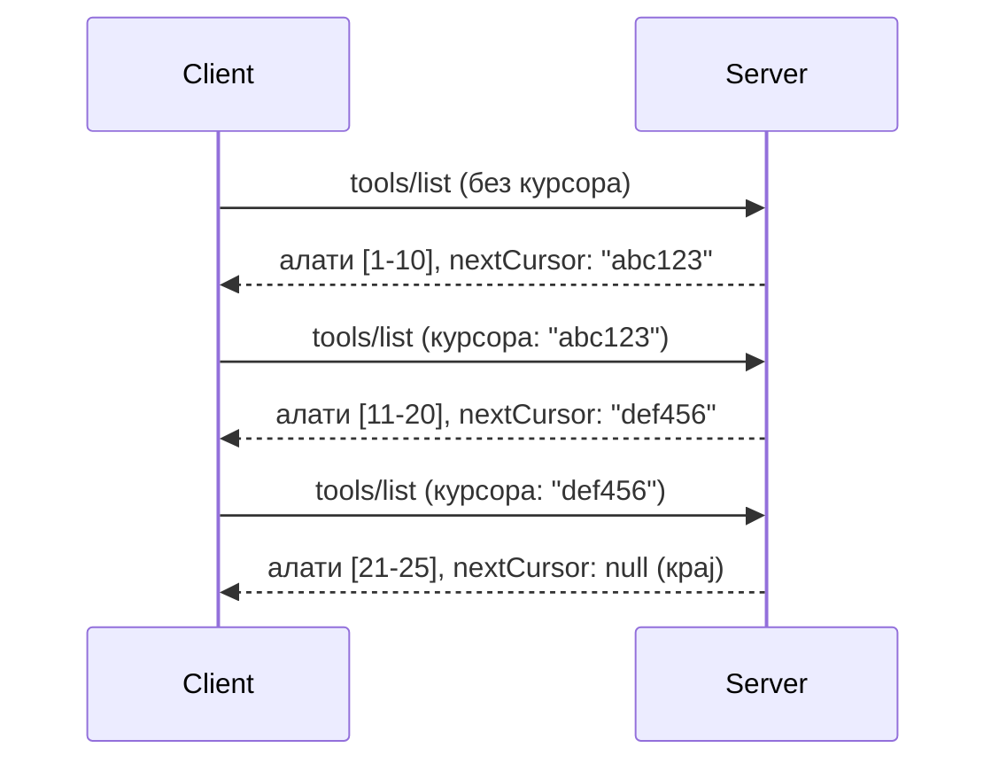

# Пагинација и Велики Скупoви Резултата у MCP

Када ваш MCP сервер обрађује велике скупове података - било да се ради о приказу хиљада датотека, записа у бази података или резултата претраге - потребна вам је пагинација за ефикасно управљање меморијом и пружање брзог корисничког искуства. Ово упутство објашњава како имплементирати и користити пагинацију у MCP.

## Зашто је пагинација важна

Без пагинације, велики одговори могу изазвати:

- **Истрошеност меморије** - Учитавање милиона записа одједном
- **Спори одговори** - Корисници чекају док се сви подаци учитају
- **Грешке због истека времена** - Захтеви прелазе ограничење времена
- **Лошу AI перформансу** - LLM-ови имају проблема са огромним контекстом

MCP користи **пагинацију засновану на курсору** за поуздано и доследно претраживање кроз скуп резултата.

---

## Како ради MCP пагинација

### Пojам курсора

**Курсор** је непрозирни низ који означава вашу позицију у скупу резултата. Можете га замислити као обележивач у дугој књизи.



### Пагинација у MCP методама

Ове MCP методе подржавају пагинацију:

| Метода | Враћа | Подршка за курсор |
|--------|---------|----------------|
| `tools/list` | Дефиниције алата | ✅ |
| `resources/list` | Дефиниције ресурса | ✅ |
| `prompts/list` | Дефиниције упита | ✅ |
| `resources/templates/list` | Шаблони ресурса | ✅ |

---

## Имплементација на серверу

### Python (FastMCP)

```python
from mcp.server import Server
from mcp.types import Tool, ListToolsResult
import math

app = Server("paginated-server")

# Симулирани велики скуп података
ALL_TOOLS = [
    Tool(name=f"tool_{i}", description=f"Tool number {i}", inputSchema={})
    for i in range(100)
]

PAGE_SIZE = 10

@app.list_tools()
async def list_tools(cursor: str | None = None) -> ListToolsResult:
    """List tools with pagination support."""
    
    # Декодирај курсор да добијеш почетни индекс
    start_index = 0
    if cursor:
        try:
            start_index = int(cursor)
        except ValueError:
            start_index = 0
    
    # Узми страницу резултата
    end_index = min(start_index + PAGE_SIZE, len(ALL_TOOLS))
    page_tools = ALL_TOOLS[start_index:end_index]
    
    # Израчунај следећи курсор
    next_cursor = None
    if end_index < len(ALL_TOOLS):
        next_cursor = str(end_index)
    
    return ListToolsResult(
        tools=page_tools,
        nextCursor=next_cursor
    )
```

### TypeScript

```typescript
import { Server } from "@modelcontextprotocol/sdk/server/index.js";
import { ListToolsResultSchema } from "@modelcontextprotocol/sdk/types.js";

const server = new Server({
  name: "paginated-server",
  version: "1.0.0"
});

// Симулирани велики скуп података
const ALL_TOOLS = Array.from({ length: 100 }, (_, i) => ({
  name: `tool_${i}`,
  description: `Tool number ${i}`,
  inputSchema: { type: "object", properties: {} }
}));

const PAGE_SIZE = 10;

server.setRequestHandler(ListToolsResultSchema, async (request) => {
  // Декодирај курсор
  let startIndex = 0;
  if (request.params?.cursor) {
    startIndex = parseInt(request.params.cursor, 10) || 0;
  }
  
  // Узми страницу резултата
  const endIndex = Math.min(startIndex + PAGE_SIZE, ALL_TOOLS.length);
  const pageTools = ALL_TOOLS.slice(startIndex, endIndex);
  
  // Израчунај следећи курсор
  const nextCursor = endIndex < ALL_TOOLS.length ? String(endIndex) : undefined;
  
  return {
    tools: pageTools,
    nextCursor
  };
});
```

### Java (Spring MCP)

```java
@Service
public class PaginatedToolService {
    
    private static final int PAGE_SIZE = 10;
    private final List<Tool> allTools;
    
    public PaginatedToolService() {
        // Инициализуј велики скуп података
        this.allTools = IntStream.range(0, 100)
            .mapToObj(i -> new Tool("tool_" + i, "Tool number " + i, Map.of()))
            .collect(Collectors.toList());
    }
    
    @McpMethod("tools/list")
    public ListToolsResult listTools(@Param("cursor") String cursor) {
        // Декодирај курсор
        int startIndex = 0;
        if (cursor != null && !cursor.isEmpty()) {
            try {
                startIndex = Integer.parseInt(cursor);
            } catch (NumberFormatException e) {
                startIndex = 0;
            }
        }
        
        // Узми страницу резултата
        int endIndex = Math.min(startIndex + PAGE_SIZE, allTools.size());
        List<Tool> pageTools = allTools.subList(startIndex, endIndex);
        
        // Израчунај следећи курсор
        String nextCursor = endIndex < allTools.size() ? String.valueOf(endIndex) : null;
        
        return new ListToolsResult(pageTools, nextCursor);
    }
}
```

---

## Имплементација на клијенту

### Python клијент

```python
from mcp import ClientSession

async def get_all_tools(session: ClientSession) -> list:
    """Fetch all tools using pagination."""
    all_tools = []
    cursor = None
    
    while True:
        result = await session.list_tools(cursor=cursor)
        all_tools.extend(result.tools)
        
        if result.nextCursor is None:
            break
        cursor = result.nextCursor
    
    return all_tools

# Употреба
async with client_session as session:
    tools = await get_all_tools(session)
    print(f"Found {len(tools)} tools")
```

### TypeScript клијент

```typescript
import { Client } from "@modelcontextprotocol/sdk/client/index.js";

async function getAllTools(client: Client): Promise<Tool[]> {
  const allTools: Tool[] = [];
  let cursor: string | undefined = undefined;
  
  do {
    const result = await client.listTools({ cursor });
    allTools.push(...result.tools);
    cursor = result.nextCursor;
  } while (cursor);
  
  return allTools;
}

// Употреба
const tools = await getAllTools(client);
console.log(`Found ${tools.length} tools`);
```

### Образац за лењо учитавање

За веома велике скупове, учитавајте странице по потреби:

```python
class PaginatedToolIterator:
    """Lazily iterate through paginated tools."""
    
    def __init__(self, session: ClientSession):
        self.session = session
        self.cursor = None
        self.buffer = []
        self.exhausted = False
    
    async def __anext__(self):
        # Вратити из бафера ако је доступно
        if self.buffer:
            return self.buffer.pop(0)
        
        # Проверити да ли смо прошли све странице
        if self.exhausted:
            raise StopAsyncIteration
        
        # Довући следећу страницу
        result = await self.session.list_tools(cursor=self.cursor)
        self.buffer = list(result.tools)
        self.cursor = result.nextCursor
        
        if self.cursor is None:
            self.exhausted = True
        
        if not self.buffer:
            raise StopAsyncIteration
        
        return self.buffer.pop(0)
    
    def __aiter__(self):
        return self

# Коришћење - ефикасно коришћење меморије за велике скупове података
async for tool in PaginatedToolIterator(session):
    process_tool(tool)
```

---

## Пагинација за ресурсе

Ресурси често захтевају пагинацију за директоријуме или велике скупове података:

```python
from mcp.server import Server
from mcp.types import Resource, ListResourcesResult
import os

app = Server("file-server")

@app.list_resources()
async def list_resources(cursor: str | None = None) -> ListResourcesResult:
    """List files in directory with pagination."""
    
    directory = "/data/files"
    all_files = sorted(os.listdir(directory))
    
    # Декодирај курсор (индекс фајла)
    start_index = int(cursor) if cursor else 0
    page_size = 20
    end_index = min(start_index + page_size, len(all_files))
    
    # Креирај листу ресурса за ову страницу
    resources = []
    for filename in all_files[start_index:end_index]:
        filepath = os.path.join(directory, filename)
        resources.append(Resource(
            uri=f"file://{filepath}",
            name=filename,
            mimeType="application/octet-stream"
        ))
    
    # Израчунај следећи курсор
    next_cursor = str(end_index) if end_index < len(all_files) else None
    
    return ListResourcesResult(
        resources=resources,
        nextCursor=next_cursor
    )
```

---

## Стратегије дизајна курсора

### Стратегија 1: Индекс-базирана (једноставна)

```python
# Курсор је само индексп
cursor = "50"  # Почни са ставком 50
```

**Предности:** Једноставна, без стања
**Мане:** Резултати могу да се помере ако се предмети додају/уклањају

### Стратегија 2: ИД-базирана (стабилна)

```python
# Курсор је последњи виђени ИД
cursor = "item_abc123"  # Почињи након ове ставке
```

**Предности:** Стабилна чак и ако се предмети мењају
**Мане:** Захтева уређене ИД-ове

### Стратегија 3: Енкодирано стање (комплексна)

```python
import base64
import json

def encode_cursor(state: dict) -> str:
    return base64.b64encode(json.dumps(state).encode()).decode()

def decode_cursor(cursor: str) -> dict:
    return json.loads(base64.b64decode(cursor).decode())

# Курсор садржи више стања поља
cursor = encode_cursor({
    "offset": 50,
    "filter": "active",
    "sort": "name"
})
```

**Предности:** Може енкодирати сложено стање
**Мане:** Комплекснији, већи курсорски низови

---

## Најбоље праксе

### 1. Изаберите одговарајуће величине страница

```python
# Размотрите величину података
PAGE_SIZE_SMALL_ITEMS = 100   # Једноставни метаподаци
PAGE_SIZE_MEDIUM_ITEMS = 20   # Објекти са више детаља
PAGE_SIZE_LARGE_ITEMS = 5     # Комплексни садржај
```

### 2. Примијените љубазну обраду неважећих курсора

```python
@app.list_tools()
async def list_tools(cursor: str | None = None) -> ListToolsResult:
    try:
        start_index = int(cursor) if cursor else 0
        if start_index < 0 or start_index >= len(ALL_TOOLS):
            start_index = 0  # Ресетуј на почетак
    except (ValueError, TypeError):
        start_index = 0  # Неважећи курсор, почни испочетка
    # ...
```

### 3. Укључите укупни број (опционо)

```python
return ListToolsResult(
    tools=page_tools,
    nextCursor=next_cursor,
    # Неке имплементације укључују укупно за UI прогрес
    _meta={"total": len(ALL_TOOLS)}
)
```

### 4. Тестирајте крајње случајеве

```python
async def test_pagination():
    # Празан скуп резултата
    result = await session.list_tools()
    assert result.tools == []
    assert result.nextCursor is None
    
    # Једна страница
    result = await session.list_tools()
    assert len(result.tools) <= PAGE_SIZE
    
    # Неисправан курсор
    result = await session.list_tools(cursor="invalid")
    assert result.tools  # Трбало би да врати прву страницу
```

---

## Уобичајене замке

### ❌ Враћање свих резултата и онда пагинација на клијентској страни

```python
# ЛОШЕ: Учитава све у меморију
@app.list_tools()
async def list_tools() -> ListToolsResult:
    all_tools = load_all_tools()  # 1 милион алата!
    return ListToolsResult(tools=all_tools)
```

### ✅ Пагинација на извору података

```python
# ДОБРО: Учитава само оно што је потребно
@app.list_tools()
async def list_tools(cursor: str | None = None) -> ListToolsResult:
    offset = int(cursor) if cursor else 0
    tools = await db.query_tools(offset=offset, limit=PAGE_SIZE)
    return ListToolsResult(tools=tools, nextCursor=...)
```

---

## Шта следи

- [Модул 5.14 - Инжењеринг Контекста](../../05-AdvancedTopics/mcp-contextengineering/README.md)
- [Модул 8 - Најбоље праксе](../../08-BestPractices/README.md)
- [3.8 - Тестирање вашег MCP сервера](../../03-GettingStarted/08-testing/README.md)

---

## Додатни ресурси

- [MCP Спецификација - Пагинација](https://modelcontextprotocol.io/specification/2026-07-28/)
- [Објашњење пагинације засноване на курсору](https://slack.engineering/evolving-api-pagination-at-slack/)
- [Python SDK тестови пагинације](https://github.com/modelcontextprotocol/python-sdk/blob/main/tests/client/test_list_methods_cursor.py)

---

<!-- CO-OP TRANSLATOR DISCLAIMER START -->
**Изјава о одрицању одговорности**:
Овај документ је преведен коришћењем услуге за аутоматски превод [Co-op Translator](https://github.com/Azure/co-op-translator). Иако тежимо тачности, имајте у виду да аутоматски преводи могу садржати грешке или нетачности. Оригинални документ на његовом изворном језику треба сматрати ауторитативним извором. За критичне информације препоручује се професионални људски превод. Нисмо одговорни за било каква неспоразума или погрешна тумачења која произилазе из коришћења овог превода.
<!-- CO-OP TRANSLATOR DISCLAIMER END -->