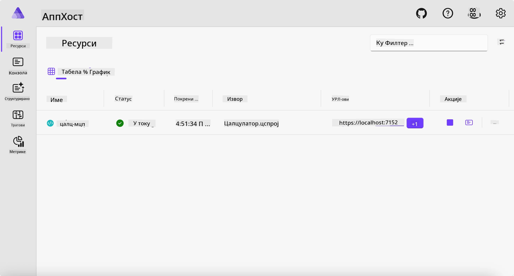
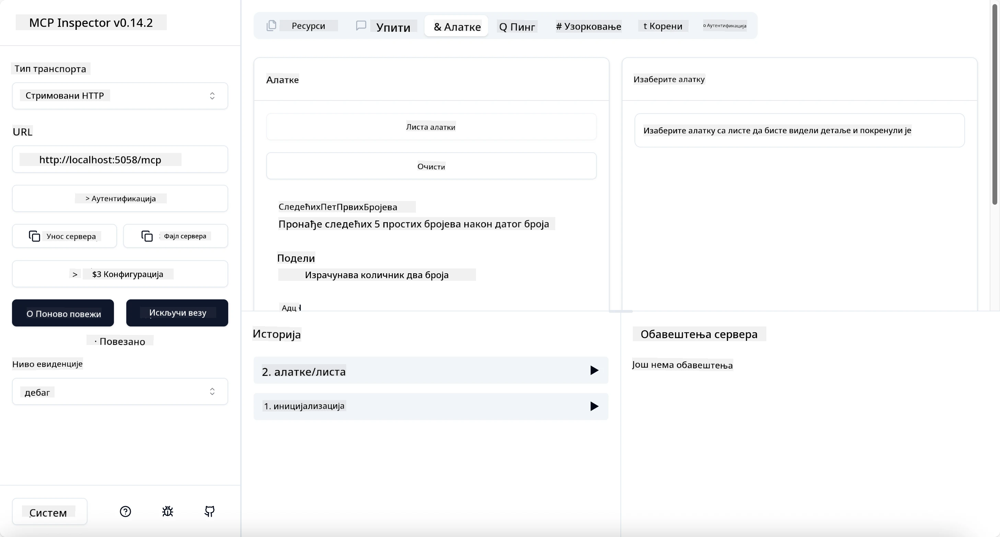
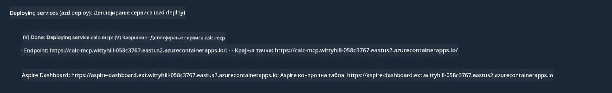

# Пример

Претходни пример показује како користити локални .NET пројекат са типом `stdio`. И како покренути сервер локално у контејнеру. Ово је добро решење у многим ситуацијама. Међутим, може бити корисно да сервер ради на удаљеној локацији, као што је облачно окружење. Ту долази у игру тип `http`.

Погледајући решење у фасцикли `04-PracticalImplementation`, може изгледати много сложеније од претходног. Али у стварности, није. Ако пажљиво погледате пројекат `src/Calculator`, видећете да је углавном исти код као у претходном примеру. Једина разлика је што користимо другу библиотеку `ModelContextProtocol.AspNetCore` за руковање HTTP захтевима. И мењамо метод `IsPrime` да буде приватан, само да се покаже да можете имати приватне методе у вашем коду. Остатак кода је исти као раније.

Остали пројекти су из [Aspire](https://aspire.dev/get-started/what-is-aspire/). Имање Aspire у решењу ће побољшати искуство програмера током развоја и тестирања и помоћи у посматрању. Није обавезно за покретање сервера, али је добра пракса имати га у вашем решењу.

## Покрените сервер локално

1. Из VS Code (са C# DevKit екстензијом), идите у директоријум `04-PracticalImplementation/samples/csharp`.
1. Извршите следећу команду да бисте покренули сервер:

   ```bash
    dotnet watch run --project ./src/AppHost
   ```

1. Када веб претраживач отвори Aspire контролну таблу, запамтите `http` URL. Требало би да буде нешто као `http://localhost:5058/`.

   

## Тестирајте Streamable HTTP са MCP Inspector

Ако имате Node.js верзије 22.7.5 или вишу, можете користити MCP Inspector за тестирање вашег сервера.

Покрените сервер и у терминалу извршите следећу команду:

```bash
npx @modelcontextprotocol/inspector http://localhost:5058
```



- Одаберите `Streamable HTTP` као тип транспорта.
- У поље Url унесите URL сервера забележен раније, и додајте `/mcp`. Требало би да буде `http` (не `https`), нешто као `http://localhost:5058/mcp`.
- изаберите дугме Connect.

Лепа ствар код Inspectora је што обезбеђује добру видљивост шта се дешава.

- Покушајте да набројите доступне алате
- Испробајте неке од њих, требало би да раде као раније.

## Тестирајте MCP сервер са GitHub Copilot Chat у VS Code

Да бисте користили Streamable HTTP транспорт са GitHub Copilot Chat, промените конфигурацију сервера `calc-mcp` који сте раније креирали да изгледа овако:

```jsonc
// .vscode/mcp.json
{
  "servers": {
    "calc-mcp": {
      "type": "http",
      "url": "http://localhost:5058/mcp"
    }
  }
}
```

Направите неке тестове:

- Питајте за "3 прва броја после 6780". Приметите како Copilot користи нове алате `NextFivePrimeNumbers` и враћа само прва 3 прва броја.
- Питајте за "7 првих бројева после 111", да видите шта се дешава.
- Питајте "Јован има 24 бомбоне и жели да их подели својој тројци деце. Колико бомбона добија сваки од њих?", да видите шта се дешава.

## Распоредите сервер на Azure

Распоредимо сервер на Azure да би га више људи могло користити.

Из терминала, идите у фасциклу `04-PracticalImplementation/samples/csharp` и покрените следећу команду:

```bash
azd up
```

Када се распоређивање заврши, требало би да видите поруку као што је ова:



Узмите URL и користите га у MCP Inspector-у и у GitHub Copilot Chat-у.

```jsonc
// .vscode/mcp.json
{
  "servers": {
    "calc-mcp": {
      "type": "http",
      "url": "https://calc-mcp.gentleriver-3977fbcf.australiaeast.azurecontainerapps.io/mcp"
    }
  }
}
```

## Шта следи?

Испробали смо различите типове транспорта и алате за тестирање. Такође смо распоредили ваш MCP сервер на Azure. Али шта ако наш сервер треба приступ приватним ресурсима? На пример, бази података или приватном API-ју? У следећем поглављу ћемо видети како можемо побољшати безбедност нашег сервера.

---

<!-- CO-OP TRANSLATOR DISCLAIMER START -->
**Изјава о одрицању одговорности**:
Овај документ је преведен коришћењем услуге за аутоматски превод [Co-op Translator](https://github.com/Azure/co-op-translator). Иако тежимо тачности, имајте у виду да аутоматски преводи могу садржати грешке или нетачности. Оригинални документ на његовом изворном језику треба сматрати ауторитативним извором. За критичне информације препоручује се професионални људски превод. Нисмо одговорни за било каква неспоразума или погрешна тумачења која произилазе из коришћења овог превода.
<!-- CO-OP TRANSLATOR DISCLAIMER END -->